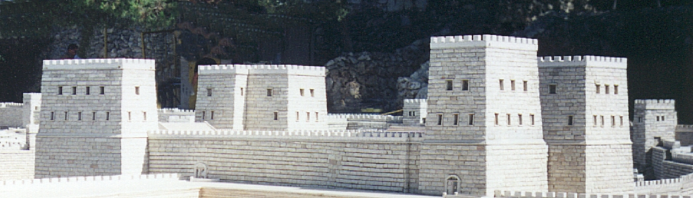
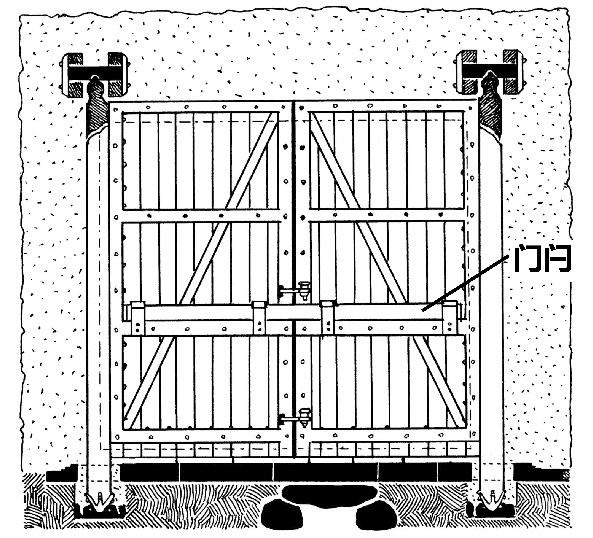

# Human-made Things in the Bible

## License Information

Human-made Things in the Bible © United Bible Societies, 2025. Adapted from: <cite>The Works of Their Hands: Man-made Things in the Bible</cite>, by Ray Pritz © 2009 United Bible Societies. This work is licensed under Creative Commons Attribution-ShareAlike 4.0 International (<a href="https://creativecommons.org/licenses/by-sa/4.0/">https://creativecommons.org/licenses/by-sa/4.0/</a>).

--------------------------------

## 标题：堡垒、城市防御工事（city fortifications） (id: REALIA:3.13.3)

3\.13\.3 标题：堡垒、城市防御工事（city fortifications）
==========================================

古时，城市通常建有特殊的防御工事来保护居民不受外敌的攻击。有些防御工事凭依天然，例如陡峭的山顶或河边。人工修建的防御工事至少包括一堵又高又厚的墙，通常是用砖或石头砌成的。城墙有一个或多个入口，用大门关闭。大门通常是木制的。入口的结构往往相当复杂，包含一个或多个转弯通道和几个警卫室。城门和城墙的其余部分可能还建有高过城墙的塔楼。这些塔楼既有利于观察从远处靠近的人，也是向敌人投射枪矛弓箭的制高点。

## 标题：城墙、外郭、城垛（city wall, rampart, battlement） (id: REALIA:3.13.3.1)

3\.13\.3\.1 标题：城墙、外郭、城垛（city wall, rampart, battlement）
=======================================================

经文出处
----

Hebrew 来：גְּבוּל (音译：gvul)

[ISA 54:12](https://ref.ly/Isa54:12)

Hebrew 来：גָּדֵר (音译：gader)

[MIC 7:11](https://ref.ly/Mic7:11)

Hebrew 来：חֵיל, חַיִל (音译：chel, chayil, cheylah)

[2SA 20:15](https://ref.ly/2Sam20:15), [1KI 21:23](https://ref.ly/1Kgs21:23), [PSA 48:14](https://ref.ly/Ps48:14), [PSA 122:7](https://ref.ly/Ps122:7), [ISA 26:1](https://ref.ly/Isa26:1), [LAM 2:8](https://ref.ly/Lam2:8), [NAM 3:8](https://ref.ly/Nah3:8)

Hebrew 来：חוֹמָה (音译：chomah)

[EXO 14:22](https://ref.ly/Exod14:22), [EXO 14:29](https://ref.ly/Exod14:29), [LEV 25:29](https://ref.ly/Lev25:29), [LEV 25:30](https://ref.ly/Lev25:30), [LEV 25:31](https://ref.ly/Lev25:31), [DEU 3:5](https://ref.ly/Deut3:5), [DEU 28:52](https://ref.ly/Deut28:52), [JOS 6:5](https://ref.ly/Josh6:5), [JOS 6:20](https://ref.ly/Josh6:20), [1SA 31:10](https://ref.ly/1Sam31:10), [1SA 31:12](https://ref.ly/1Sam31:12), [2SA 11:20](https://ref.ly/2Sam11:20), [2SA 11:21](https://ref.ly/2Sam11:21), [2SA 11:21](https://ref.ly/2Sam11:21), [2SA 11:24](https://ref.ly/2Sam11:24), [2SA 18:24](https://ref.ly/2Sam18:24), [2SA 20:15](https://ref.ly/2Sam20:15), [2SA 20:21](https://ref.ly/2Sam20:21), [2KI 3:27](https://ref.ly/2Kgs3:27), [2KI 6:26](https://ref.ly/2Kgs6:26), [2KI 6:30](https://ref.ly/2Kgs6:30), [2KI 14:13](https://ref.ly/2Kgs14:13), [2KI 18:26](https://ref.ly/2Kgs18:26), [2KI 18:27](https://ref.ly/2Kgs18:27), [2KI 25:4](https://ref.ly/2Kgs25:4), [2CH 8:5](https://ref.ly/2Chr8:5), [2CH 14:6](https://ref.ly/2Chr14:6), [2CH 25:23](https://ref.ly/2Chr25:23), [2CH 26:6](https://ref.ly/2Chr26:6), [2CH 26:6](https://ref.ly/2Chr26:6), [2CH 26:6](https://ref.ly/2Chr26:6), [2CH 27:3](https://ref.ly/2Chr27:3), [2CH 32:5](https://ref.ly/2Chr32:5), [2CH 32:18](https://ref.ly/2Chr32:18), [2CH 33:14](https://ref.ly/2Chr33:14), [2CH 36:19](https://ref.ly/2Chr36:19), [PSA 51:20](https://ref.ly/Ps51:20), [PSA 55:11](https://ref.ly/Ps55:11), [PRO 25:28](https://ref.ly/Prov25:28), [SNG 5:7](https://ref.ly/Song5:7), [SNG 8:9](https://ref.ly/Song8:9), [SNG 8:10](https://ref.ly/Song8:10), [ISA 2:15](https://ref.ly/Isa2:15), [ISA 22:10](https://ref.ly/Isa22:10), [ISA 22:11](https://ref.ly/Isa22:11), [ISA 26:1](https://ref.ly/Isa26:1), [ISA 30:13](https://ref.ly/Isa30:13), [ISA 36:11](https://ref.ly/Isa36:11), [ISA 36:12](https://ref.ly/Isa36:12), [ISA 49:16](https://ref.ly/Isa49:16), [ISA 56:5](https://ref.ly/Isa56:5), [ISA 60:10](https://ref.ly/Isa60:10), [ISA 60:18](https://ref.ly/Isa60:18), [ISA 62:6](https://ref.ly/Isa62:6), [JER 1:15](https://ref.ly/Jer1:15), [JER 1:18](https://ref.ly/Jer1:18), [JER 15:20](https://ref.ly/Jer15:20), [JER 21:4](https://ref.ly/Jer21:4), [JER 52:7](https://ref.ly/Jer52:7), [JER 52:14](https://ref.ly/Jer52:14), [LAM 2:8](https://ref.ly/Lam2:8), [LAM 2:8](https://ref.ly/Lam2:8), [LAM 2:18](https://ref.ly/Lam2:18), [EZK 26:4](https://ref.ly/Ezek26:4), [EZK 26:9](https://ref.ly/Ezek26:9), [EZK 26:10](https://ref.ly/Ezek26:10), [EZK 26:12](https://ref.ly/Ezek26:12), [EZK 27:11](https://ref.ly/Ezek27:11), [EZK 27:11](https://ref.ly/Ezek27:11), [EZK 38:11](https://ref.ly/Ezek38:11), [EZK 38:20](https://ref.ly/Ezek38:20), [JOL 2:7](https://ref.ly/Joel2:7), [JOL 2:9](https://ref.ly/Joel2:9), [AMO 1:7](https://ref.ly/Amos1:7), [AMO 1:10](https://ref.ly/Amos1:10), [AMO 1:14](https://ref.ly/Amos1:14), [AMO 7:7](https://ref.ly/Amos7:7), [NAM 2:6](https://ref.ly/Nah2:6), [NAM 3:8](https://ref.ly/Nah3:8), [ZEC 2:9](https://ref.ly/Zech2:9)

Hebrew 来：מְצוּרָה (音译：mtsurah)

[NAM 2:2](https://ref.ly/Nah2:2)

Hebrew 来：קִיר (音译：qir)

[NUM 22:25](https://ref.ly/Num22:25), [NUM 22:25](https://ref.ly/Num22:25), [NUM 35:4](https://ref.ly/Num35:4), [JOS 2:15](https://ref.ly/Josh2:15), [ISA 25:4](https://ref.ly/Isa25:4)

Hebrew 来：שׁוּר (音译：shur)

[2SA 22:30](https://ref.ly/2Sam22:30), [EZR 4:12](https://ref.ly/Ezra4:12), [EZR 4:12](https://ref.ly/Ezra4:12), [EZR 4:13](https://ref.ly/Ezra4:13), [EZR 4:16](https://ref.ly/Ezra4:16), [PSA 18:30](https://ref.ly/Ps18:30)

Greek 希：ἐπάλξις (音译：epalxis)

[JDT 14:1](https://ref.ly/Jdt14:1), [SIR 9:13](https://ref.ly/Sir9:13)

Greek 希：προμαχών (音译：promachōn)

[TOB 13:17](https://ref.ly/Tob13:17)

Greek 希：τεῖχος (音译：teichos)

[ACT 9:25](https://ref.ly/Acts9:25), [2CO 11:33](https://ref.ly/2Cor11:33), [HEB 11:30](https://ref.ly/Heb11:30), [REV 21:12](https://ref.ly/Rev21:12), [REV 21:14](https://ref.ly/Rev21:14), [REV 21:15](https://ref.ly/Rev21:15), [REV 21:17](https://ref.ly/Rev21:17), [REV 21:18](https://ref.ly/Rev21:18), [REV 21:19](https://ref.ly/Rev21:19), [TOB 1:17](https://ref.ly/Tob1:17), [TOB 13:17](https://ref.ly/Tob13:17), [JDT 1:2](https://ref.ly/Jdt1:2), [JDT 1:2](https://ref.ly/Jdt1:2), [JDT 7:32](https://ref.ly/Jdt7:32), [JDT 14:1](https://ref.ly/Jdt14:1), [JDT 14:11](https://ref.ly/Jdt14:11), [SIR 49:13](https://ref.ly/Sir49:13), [1MA 1:31](https://ref.ly/1Macc1:31), [1MA 1:33](https://ref.ly/1Macc1:33), [1MA 4:60](https://ref.ly/1Macc4:60), [1MA 6:7](https://ref.ly/1Macc6:7), [1MA 6:62](https://ref.ly/1Macc6:62), [1MA 9:50](https://ref.ly/1Macc9:50), [1MA 9:54](https://ref.ly/1Macc9:54), [1MA 10:11](https://ref.ly/1Macc10:11), [1MA 10:45](https://ref.ly/1Macc10:45), [1MA 10:45](https://ref.ly/1Macc10:45), [1MA 12:36](https://ref.ly/1Macc12:36), [1MA 12:37](https://ref.ly/1Macc12:37), [1MA 13:10](https://ref.ly/1Macc13:10), [1MA 13:33](https://ref.ly/1Macc13:33), [1MA 13:45](https://ref.ly/1Macc13:45), [1MA 14:37](https://ref.ly/1Macc14:37), [1MA 16:23](https://ref.ly/1Macc16:23), [2MA 3:19](https://ref.ly/2Macc3:19), [2MA 5:5](https://ref.ly/2Macc5:5), [2MA 6:10](https://ref.ly/2Macc6:10), [2MA 10:17](https://ref.ly/2Macc10:17), [2MA 10:35](https://ref.ly/2Macc10:35), [2MA 11:9](https://ref.ly/2Macc11:9), [2MA 12:13](https://ref.ly/2Macc12:13), [2MA 12:14](https://ref.ly/2Macc12:14), [2MA 12:15](https://ref.ly/2Macc12:15), [2MA 12:27](https://ref.ly/2Macc12:27), [2MA 14:43](https://ref.ly/2Macc14:43), [3MA 1:29](https://ref.ly/3Macc1:29), [1ES 1:52](https://ref.ly/1Esd1:52), [1ES 2:14](https://ref.ly/1Esd2:14), [1ES 2:15](https://ref.ly/1Esd2:15), [1ES 2:18](https://ref.ly/1Esd2:18), [1ES 4:4](https://ref.ly/1Esd4:4), [ODA 1:8](https://ref.ly/Odes1:8), [PSS 2:1](https://ref.ly/PssSol2:1), [PSS 8:17](https://ref.ly/PssSol8:17), [PSS 8:19](https://ref.ly/PssSol8:19)

Greek 希：χάραξ (音译：charax)

[4MA 3:12](https://ref.ly/4Macc3:12)

Latin 拉：murus

[2ES 2:22](https://ref.ly/2Esd2:22), [2ES 11:42](https://ref.ly/2Esd11:42), [2ES 15:42](https://ref.ly/2Esd15:42)

描述
--

*耶路撒冷希律城墙模型（以色列博物馆） (© Ray Pritz by United Bible Societies)*

城邑或要塞的周围会建造坚固的永久性城墙，以提供保护。有些城邑甚至建有两道城墙。敌人若想攻击内城墙，必须先攻破外城墙。外城墙有时也被称为外郭。单道城墙以及两道城墙中的内城墙通常用石头建成，有时会用泥砖。外城墙也可以用这些材料建造，或者简单地用土堆成。

城垛或护墙是防御墙最上面的部分，上有开口，供士兵侦察或使用武器攻击。

---

翻译
--

今天，在世界上的大多数地方，城墙都不是城市建筑的一部分，翻译者经常要使用描述性短语来翻译“城墙”，例如，“用来保护城市不受敌人攻击的墙”，或“把敌人挡在城外的墙”。在许多地方，人们用灌木、树枝、泥土或石块围成的一圈篱笆来保护房子或花园，可以使用表示这种保护措施的词语来翻译城墙。然而，这种篱笆可能不够宽，人们可能无法在上面行走。如果经文提到人们在城墙上行走或做其他事情，翻译者要留意译词的选用，以免读者感觉这是不可能的或荒谬的。在这些情况下，可能需要扩展译文，如译成“城周围用石头砌成的厚篱笆”，或“城周围的加固篱笆”。

希伯来文*chel* 和*chomah* 平行出现了好几次。在一些地方，*chel* 指*chomah* 的附加防御工事或加固措施，两者有些区别。然而，如果目标语言只有一个表示城墙的词语，通常可以把这两个词语视为一个来处理。当*chel* 及其相关词语单独出现时，翻译者可以增加一个修饰语，译为“坚固的墙”或“加固的墙”。

在一些经文中（[1SA 25:16](https://ref.ly/1Sam25:16); [PRO 18:11](https://ref.ly/Prov18:11); [SNG 8:9](https://ref.ly/Song8:9); [SNG 8:10](https://ref.ly/Song8:10); [ISA 26:1](https://ref.ly/Isa26:1); [JER 15:20](https://ref.ly/Jer15:20); [ZEC 2:9](https://ref.ly/Zech2:9) ），*chomah* 一词是比喻用法，表示力量或保护。在[1SA 25:16](https://ref.ly/1Sam25:16) 中，可以不采用墙的比喻，而简单地译为“他们保护了我们”（GNT (Good News Translation (1992)) 直译）。

[JOS 2:15](https://ref.ly/Josh2:15) 记载喇合的“房子建在城墙里面”（GNT (Good News Translation (1992)) 直译）。考古发掘显示，耶利哥城曾经有两道城墙：一道内城墙，一道外城墙，两道城墙之间相隔约3\.5—4\.5米（11\.5—14\.5英尺）。在两道城墙之间铺上粗木头，然后在木头上面建造房屋。喇合把两个探子缒下去的窗户开向外城墙朝外的那一面。“建在城墙里面的房子”这个短语的意思可能不清楚，译为“城墙的一部分形成喇合房子的外墙”比较好。此外，可能有必要添加一个脚注，以便更清楚地说明房子和城墙之间的关系。

[JDT 14:1](https://ref.ly/Jdt14:1) ：如果目标语言没有表示“护墙”的词语，或者这个词语的意思比较模糊，可以将这节经文中字面意思为“你墙上的护墙”的短语译为“城墙”（如GNT (Good News Translation (1992)) ）或“城墙顶部”（如CEV (Contemporary English Version) ）。

* **Associated Passages:** 以赛亚书 54:12; 弥迦书 7:11; 撒母耳记下 20:15; 列王纪上 21:23; 诗篇 48:14; 诗篇 122:7; 以赛亚书 26:1; 耶利米哀歌 2:8; 那鸿书 3:8; 出埃及记 14:22; 出埃及记 14:29; 利未记 25:29; 利未记 25:30; 利未记 25:31; 申命记 3:5; 申命记 28:52; 约书亚记 6:5; 约书亚记 6:20; 撒母耳记上 31:10; 撒母耳记上 31:12; 撒母耳记下 11:20; 撒母耳记下 11:21; 撒母耳记下 11:24; 撒母耳记下 18:24; 撒母耳记下 20:21; 列王纪下 3:27; 列王纪下 6:26; 列王纪下 6:30; 列王纪下 14:13; 列王纪下 18:26; 列王纪下 18:27; 列王纪下 25:4; 历代志下 8:5; 历代志下 14:6; 历代志下 25:23; 历代志下 26:6; 历代志下 27:3; 历代志下 32:5; 历代志下 32:18; 历代志下 33:14; 历代志下 36:19; 诗篇 51:20; 诗篇 55:11; 箴言 25:28; 雅歌 5:7; 雅歌 8:9; 雅歌 8:10; 以赛亚书 2:15; 以赛亚书 22:10; 以赛亚书 22:11; 以赛亚书 30:13; 以赛亚书 36:11; 以赛亚书 36:12; 以赛亚书 49:16; 以赛亚书 56:5; 以赛亚书 60:10; 以赛亚书 60:18; 以赛亚书 62:6; 耶利米书 1:15; 耶利米书 1:18; 耶利米书 15:20; 耶利米书 21:4; 耶利米书 52:7; 耶利米书 52:14; 耶利米哀歌 2:18; 以西结书 26:4; 以西结书 26:9; 以西结书 26:10; 以西结书 26:12; 以西结书 27:11; 以西结书 38:11; 以西结书 38:20; 约珥书 2:7; 约珥书 2:9; 阿摩司书 1:7; 阿摩司书 1:10; 阿摩司书 1:14; 阿摩司书 7:7; 那鸿书 2:6; 撒迦利亚书 2:9; 那鸿书 2:2; 民数记 22:25; 民数记 35:4; 约书亚记 2:15; 以赛亚书 25:4; 撒母耳记下 22:30; 以斯拉记 4:12; 以斯拉记 4:13; 以斯拉记 4:16; 诗篇 18:30; 友弟德传 14:1; 德训篇 9:13; 多俾亚传 13:17; 使徒行传 9:25; 哥林多后书 11:33; 希伯来书 11:30; 启示录 21:12; 启示录 21:14; 启示录 21:15; 启示录 21:17; 启示录 21:18; 启示录 21:19; 多俾亚传 1:17; 友弟德传 1:2; 友弟德传 7:32; 友弟德传 14:11; 德训篇 49:13; 玛加伯上 1:31; 玛加伯上 1:33; 玛加伯上 4:60; 玛加伯上 6:7; 玛加伯上 6:62; 玛加伯上 9:50; 玛加伯上 9:54; 玛加伯上 10:11; 玛加伯上 10:45; 玛加伯上 12:36; 玛加伯上 12:37; 玛加伯上 13:10; 玛加伯上 13:33; 玛加伯上 13:45; 玛加伯上 14:37; 玛加伯上 16:23; 玛加伯下 3:19; 玛加伯下 5:5; 玛加伯下 6:10; 玛加伯下 10:17; 玛加伯下 10:35; 玛加伯下 11:9; 玛加伯下 12:13; 玛加伯下 12:14; 玛加伯下 12:15; 玛加伯下 12:27; 玛加伯下 14:43; 玛加伯三书 1:29; 厄斯德拉上 1:52; 厄斯德拉上 2:14; 厄斯德拉上 2:15; 厄斯德拉上 2:18; 厄斯德拉上 4:4; 颂歌 1:8; 所罗门诗篇 2:1; 所罗门诗篇 8:17; 所罗门诗篇 8:19; 玛加伯四书 3:12; 厄斯德拉下 2:22; 厄斯德拉下 11:42; 厄斯德拉下 15:42; 撒母耳记上 25:16; 箴言 18:11

## 标题：要塞、堡垒、城堡（fortress, stronghold, castle, citadel, fort） (id: REALIA:3.13.3.2)

3\.13\.3\.2 标题：要塞、堡垒、城堡（fortress, stronghold, castle, citadel, fort）
====================================================================

经文出处
----

Hebrew 来：בִּירָה (音译：birah)

[2CH 17:12](https://ref.ly/2Chr17:12), [2CH 27:4](https://ref.ly/2Chr27:4), [NEH 2:8](https://ref.ly/Neh2:8), [NEH 7:2](https://ref.ly/Neh7:2)

Hebrew 来：מִבְצָר (音译：mivtsar)

[2SA 24:7](https://ref.ly/2Sam24:7), [2KI 8:12](https://ref.ly/2Kgs8:12), [PSA 89:41](https://ref.ly/Ps89:41), [ISA 17:3](https://ref.ly/Isa17:3), [ISA 34:13](https://ref.ly/Isa34:13), [JER 48:18](https://ref.ly/Jer48:18), [LAM 2:2](https://ref.ly/Lam2:2), [LAM 2:5](https://ref.ly/Lam2:5), [DAN 11:39](https://ref.ly/Dan11:39), [HOS 10:14](https://ref.ly/Hos10:14), [AMO 5:9](https://ref.ly/Amos5:9), [MIC 5:10](https://ref.ly/Mic5:10), [NAM 3:12](https://ref.ly/Nah3:12), [NAM 3:14](https://ref.ly/Nah3:14), [HAB 1:10](https://ref.ly/Hab1:10)

Hebrew 来：מִגְדַּל־שְׁכֶם (音译：migdal shkem)

[JDG 9:46](https://ref.ly/Judg9:46), [JDG 9:47](https://ref.ly/Judg9:47), [JDG 9:49](https://ref.ly/Judg9:49)

Hebrew 来：מִסְגֶּרֶת (音译：misgereth)

[2SA 22:46](https://ref.ly/2Sam22:46), [PSA 18:46](https://ref.ly/Ps18:46), [MIC 7:17](https://ref.ly/Mic7:17)

Hebrew 来：מָעוֹז (音译：ma‘oz)

[ISA 23:11](https://ref.ly/Isa23:11), [DAN 11:7](https://ref.ly/Dan11:7), [DAN 11:10](https://ref.ly/Dan11:10), [DAN 11:10](https://ref.ly/Dan11:10), [DAN 11:19](https://ref.ly/Dan11:19), [DAN 11:31](https://ref.ly/Dan11:31), [DAN 11:38](https://ref.ly/Dan11:38), [DAN 11:39](https://ref.ly/Dan11:39)

Hebrew 来：מְצָד, מְצוּדָה (音译：mtsad, mtsudah)

[2SA 5:7](https://ref.ly/2Sam5:7), [2SA 5:9](https://ref.ly/2Sam5:9), [1CH 11:5](https://ref.ly/1Chr11:5), [1CH 11:7](https://ref.ly/1Chr11:7), [JER 48:41](https://ref.ly/Jer48:41), [JER 51:30](https://ref.ly/Jer51:30)

Hebrew 来：מָצוֹר (音译：matsor)

[ZEC 9:3](https://ref.ly/Zech9:3)

Hebrew 来：מְצוּרָה (音译：mtsurah)

[2CH 11:11](https://ref.ly/2Chr11:11), [2CH 11:23](https://ref.ly/2Chr11:23), [2CH 12:4](https://ref.ly/2Chr12:4), [2CH 14:5](https://ref.ly/2Chr14:5), [2CH 21:3](https://ref.ly/2Chr21:3)

Hebrew 来：מִשְׂגָּב (音译：misgav)

[2SA 22:3](https://ref.ly/2Sam22:3), [PSA 9:10](https://ref.ly/Ps9:10), [PSA 9:10](https://ref.ly/Ps9:10), [PSA 18:3](https://ref.ly/Ps18:3), [PSA 46:8](https://ref.ly/Ps46:8), [PSA 46:12](https://ref.ly/Ps46:12), [PSA 48:4](https://ref.ly/Ps48:4), [PSA 59:10](https://ref.ly/Ps59:10), [PSA 59:17](https://ref.ly/Ps59:17), [PSA 59:18](https://ref.ly/Ps59:18), [PSA 62:3](https://ref.ly/Ps62:3), [PSA 62:7](https://ref.ly/Ps62:7), [PSA 94:22](https://ref.ly/Ps94:22), [PSA 144:2](https://ref.ly/Ps144:2), [ISA 25:12](https://ref.ly/Isa25:12), [ISA 33:16](https://ref.ly/Isa33:16), [JER 48:1](https://ref.ly/Jer48:1)

Hebrew 来：צְרִיחַ (音译：tsariach)

[JDG 9:46](https://ref.ly/Judg9:46), [JDG 9:49](https://ref.ly/Judg9:49), [JDG 9:49](https://ref.ly/Judg9:49)

Greek 希：ἀκρόπολις (音译：akropolis)

[2MA 4:12](https://ref.ly/2Macc4:12), [2MA 4:28](https://ref.ly/2Macc4:28), [2MA 5:5](https://ref.ly/2Macc5:5)

Greek 希：ἄκρα (音译：akra)

[1MA 1:33](https://ref.ly/1Macc1:33), [1MA 3:45](https://ref.ly/1Macc3:45), [1MA 4:2](https://ref.ly/1Macc4:2), [1MA 4:41](https://ref.ly/1Macc4:41), [1MA 6:18](https://ref.ly/1Macc6:18), [1MA 6:26](https://ref.ly/1Macc6:26), [1MA 6:32](https://ref.ly/1Macc6:32), [1MA 9:52](https://ref.ly/1Macc9:52), [1MA 9:53](https://ref.ly/1Macc9:53), [1MA 10:7](https://ref.ly/1Macc10:7), [1MA 10:7](https://ref.ly/1Macc10:7), [1MA 10:9](https://ref.ly/1Macc10:9), [1MA 10:32](https://ref.ly/1Macc10:32), [1MA 11:21](https://ref.ly/1Macc11:21), [1MA 11:21](https://ref.ly/1Macc11:21), [1MA 11:41](https://ref.ly/1Macc11:41), [1MA 12:36](https://ref.ly/1Macc12:36), [1MA 13:21](https://ref.ly/1Macc13:21), [1MA 13:50](https://ref.ly/1Macc13:50), [1MA 13:50](https://ref.ly/1Macc13:50), [1MA 13:52](https://ref.ly/1Macc13:52), [1MA 14:7](https://ref.ly/1Macc14:7), [1MA 14:36](https://ref.ly/1Macc14:36), [1MA 15:28](https://ref.ly/1Macc15:28), [2MA 15:31](https://ref.ly/2Macc15:31), [2MA 15:35](https://ref.ly/2Macc15:35), [4MA 4:20](https://ref.ly/4Macc4:20)

Greek 希：βάρις (音译：baris)

[1ES 6:22](https://ref.ly/1Esd6:22)

Greek 希：ὀχύρωμα, ὀχυρωμάτιον (音译：ochurōma, ochurōmation)

[2CO 10:4](https://ref.ly/2Cor10:4), [1MA 1:2](https://ref.ly/1Macc1:2), [1MA 4:61](https://ref.ly/1Macc4:61), [1MA 5:9](https://ref.ly/1Macc5:9), [1MA 5:11](https://ref.ly/1Macc5:11), [1MA 5:27](https://ref.ly/1Macc5:27), [1MA 5:29](https://ref.ly/1Macc5:29), [1MA 5:30](https://ref.ly/1Macc5:30), [1MA 5:65](https://ref.ly/1Macc5:65), [1MA 6:61](https://ref.ly/1Macc6:61), [1MA 6:62](https://ref.ly/1Macc6:62), [1MA 8:10](https://ref.ly/1Macc8:10), [1MA 9:50](https://ref.ly/1Macc9:50), [1MA 10:12](https://ref.ly/1Macc10:12), [1MA 10:37](https://ref.ly/1Macc10:37), [1MA 11:18](https://ref.ly/1Macc11:18), [1MA 11:18](https://ref.ly/1Macc11:18), [1MA 11:41](https://ref.ly/1Macc11:41), [1MA 12:33](https://ref.ly/1Macc12:33), [1MA 12:34](https://ref.ly/1Macc12:34), [1MA 12:35](https://ref.ly/1Macc12:35), [1MA 12:45](https://ref.ly/1Macc12:45), [1MA 13:33](https://ref.ly/1Macc13:33), [1MA 13:33](https://ref.ly/1Macc13:33), [1MA 13:38](https://ref.ly/1Macc13:38), [1MA 14:42](https://ref.ly/1Macc14:42), [1MA 15:7](https://ref.ly/1Macc15:7), [1MA 16:8](https://ref.ly/1Macc16:8), [1MA 16:15](https://ref.ly/1Macc16:15), [2MA 8:30](https://ref.ly/2Macc8:30), [2MA 10:15](https://ref.ly/2Macc10:15), [2MA 10:16](https://ref.ly/2Macc10:16), [2MA 10:23](https://ref.ly/2Macc10:23), [2MA 10:32](https://ref.ly/2Macc10:32), [2MA 11:6](https://ref.ly/2Macc11:6), [2MA 12:19](https://ref.ly/2Macc12:19), [3MA 6:25](https://ref.ly/3Macc6:25)

Greek 希：φρούριον (音译：frourion)

[2MA 10:32](https://ref.ly/2Macc10:32), [2MA 10:33](https://ref.ly/2Macc10:33), [2MA 13:19](https://ref.ly/2Macc13:19)

描述
--

*耶路撒冷安东尼亚堡垒（Antonia Fortress）模型 (© Ray Pritz by United Bible Societies)*

堡垒是一种大型防御工事，通常是城镇防御的一部分。在中东，这种防御工事是用石头建造的。堡垒可能是一座特别坚固的建筑物，或者是一个建筑群，周围有自身的防护墙。

---

翻译
--

在有些语言中，“堡垒”一词可以根据其功能来翻译，例如译为“提供保护的地方”或“防卫自己的地方”。然而，堡垒通常是根据它的建筑结构来描述的，例如“有坚固围墙的地方”。

在[NEH 2:8](https://ref.ly/Neh2:8); [NEH 7:2](https://ref.ly/Neh7:2) 中，希伯来文*birah* 指的是位于耶路撒冷圣殿建筑群西北角的一处防御工事，用来防守圣殿北侧，那是敌人最有可能进攻的地方。后来，大希律扩大并加强了该防御工事，并把它命名为安东尼亚堡（参[3\.20\.1 铺道、石板地、铺石地、铺华石处 (pavement, The Pavement)\<REALIA:3\.20\.1\>](#) ）。在[NEH 2:8](https://ref.ly/Neh2:8) 中，原文字面意思为“圣殿的堡垒”的短语可译为“靠近圣殿的堡垒”（CEV (Contemporary English Version) 直译）、“防守圣殿的堡垒”（GNT (Good News Translation (1992)) 直译）、“紧挨着圣殿的要塞”（REB (Revised English Bible (1989)) 直译）。

在[JDG 9:47](https://ref.ly/Judg9:47); [JDG 9:47](https://ref.ly/Judg9:47); [JDG 9:49](https://ref.ly/Judg9:49) 中，不同译本对希伯来文短语*migdal shkem* 有不同的理解。我们查阅的大部分译本都将其译为“示剑塔”或“示剑城堡”；有些译本将“Tower”（“城楼、塔”）的首字母大写，表明它可能是一个地名。许多非英文译本（如SPCL (Spanish Common Language Version (Dios Habla Hoy)) 、FRCL (French Common Language Version (Bible en français courant)) 、DUCL (Dutch Common Language Version) 、TOB (Traduction Oecuménique de la Bible (French, 1975)) ）把它当做地名，仅仅进行了音译（DUCL (Dutch Common Language Version) 译为“米格达尔—示剑”）。

在新约中，希腊文*ochurōma* 仅出现在[2CO 10:4](https://ref.ly/2Cor10:4) ，喻指谬论的力量。许多语言可能更适合采用明喻来翻译该词，以突出原文中的比喻用法；例如，这节经文可译为：“我们争战所用的兵器不是这世界的兵器，而是上帝大能的兵器，我们用这兵器可以摧毁谬论，就像人们摧毁堡垒一样。”

* **Associated Passages:** 历代志下 17:12; 历代志下 27:4; 尼希米记 2:8; 尼希米记 7:2; 撒母耳记下 24:7; 列王纪下 8:12; 诗篇 89:41; 以赛亚书 17:3; 以赛亚书 34:13; 耶利米书 48:18; 耶利米哀歌 2:2; 耶利米哀歌 2:5; 但以理书 11:39; 何西阿书 10:14; 阿摩司书 5:9; 弥迦书 5:10; 那鸿书 3:12; 那鸿书 3:14; 哈巴谷书 1:10; 士师记 9:46; 士师记 9:47; 士师记 9:49; 撒母耳记下 22:46; 诗篇 18:46; 弥迦书 7:17; 以赛亚书 23:11; 但以理书 11:7; 但以理书 11:10; 但以理书 11:19; 但以理书 11:31; 但以理书 11:38; 撒母耳记下 5:7; 撒母耳记下 5:9; 历代志上 11:5; 历代志上 11:7; 耶利米书 48:41; 耶利米书 51:30; 撒迦利亚书 9:3; 历代志下 11:11; 历代志下 11:23; 历代志下 12:4; 历代志下 14:5; 历代志下 21:3; 撒母耳记下 22:3; 诗篇 9:10; 诗篇 18:3; 诗篇 46:8; 诗篇 46:12; 诗篇 48:4; 诗篇 59:10; 诗篇 59:17; 诗篇 59:18; 诗篇 62:3; 诗篇 62:7; 诗篇 94:22; 诗篇 144:2; 以赛亚书 25:12; 以赛亚书 33:16; 耶利米书 48:1; 玛加伯下 4:12; 玛加伯下 4:28; 玛加伯下 5:5; 玛加伯上 1:33; 玛加伯上 3:45; 玛加伯上 4:2; 玛加伯上 4:41; 玛加伯上 6:18; 玛加伯上 6:26; 玛加伯上 6:32; 玛加伯上 9:52; 玛加伯上 9:53; 玛加伯上 10:7; 玛加伯上 10:9; 玛加伯上 10:32; 玛加伯上 11:21; 玛加伯上 11:41; 玛加伯上 12:36; 玛加伯上 13:21; 玛加伯上 13:50; 玛加伯上 13:52; 玛加伯上 14:7; 玛加伯上 14:36; 玛加伯上 15:28; 玛加伯下 15:31; 玛加伯下 15:35; 玛加伯四书 4:20; 厄斯德拉上 6:22; 哥林多后书 10:4; 玛加伯上 1:2; 玛加伯上 4:61; 玛加伯上 5:9; 玛加伯上 5:11; 玛加伯上 5:27; 玛加伯上 5:29; 玛加伯上 5:30; 玛加伯上 5:65; 玛加伯上 6:61; 玛加伯上 6:62; 玛加伯上 8:10; 玛加伯上 9:50; 玛加伯上 10:12; 玛加伯上 10:37; 玛加伯上 11:18; 玛加伯上 12:33; 玛加伯上 12:34; 玛加伯上 12:35; 玛加伯上 12:45; 玛加伯上 13:33; 玛加伯上 13:38; 玛加伯上 14:42; 玛加伯上 15:7; 玛加伯上 16:8; 玛加伯上 16:15; 玛加伯下 8:30; 玛加伯下 10:15; 玛加伯下 10:16; 玛加伯下 10:23; 玛加伯下 10:32; 玛加伯下 11:6; 玛加伯下 12:19; 玛加伯三书 6:25; 玛加伯下 10:33; 玛加伯下 13:19

## 标题：瞭望塔、塔楼、塔（watchtower, tower） (id: REALIA:3.13.3.3)

3\.13\.3\.3 标题：瞭望塔、塔楼、塔（watchtower, tower）
==========================================

经文出处
----

Hebrew 来：אַלְמָן (音译：’alman)

[ISA 13:22](https://ref.ly/Isa13:22)

Hebrew 来：בַּחַן (音译：bachan)

[ISA 32:14](https://ref.ly/Isa32:14)

Hebrew 来：מִגְדָּל, מִגְדֹּל (音译：migdal, migdol)

[JDG 8:9](https://ref.ly/Judg8:9), [JDG 8:17](https://ref.ly/Judg8:17), [JDG 9:51](https://ref.ly/Judg9:51), [JDG 9:51](https://ref.ly/Judg9:51), [JDG 9:52](https://ref.ly/Judg9:52), [JDG 9:52](https://ref.ly/Judg9:52), [2KI 9:17](https://ref.ly/2Kgs9:17), [2KI 17:9](https://ref.ly/2Kgs17:9), [2KI 18:8](https://ref.ly/2Kgs18:8), [1CH 27:25](https://ref.ly/1Chr27:25), [2CH 14:6](https://ref.ly/2Chr14:6), [2CH 26:9](https://ref.ly/2Chr26:9), [2CH 26:15](https://ref.ly/2Chr26:15), [2CH 27:4](https://ref.ly/2Chr27:4), [2CH 32:5](https://ref.ly/2Chr32:5), [NEH 3:1](https://ref.ly/Neh3:1), [NEH 3:1](https://ref.ly/Neh3:1), [NEH 3:11](https://ref.ly/Neh3:11), [NEH 3:25](https://ref.ly/Neh3:25), [NEH 3:26](https://ref.ly/Neh3:26), [NEH 3:27](https://ref.ly/Neh3:27), [NEH 12:38](https://ref.ly/Neh12:38), [NEH 12:39](https://ref.ly/Neh12:39), [NEH 12:39](https://ref.ly/Neh12:39), [PSA 48:13](https://ref.ly/Ps48:13), [PSA 61:4](https://ref.ly/Ps61:4), [PRO 18:10](https://ref.ly/Prov18:10), [SNG 4:4](https://ref.ly/Song4:4), [SNG 5:13](https://ref.ly/Song5:13), [SNG 7:5](https://ref.ly/Song7:5), [SNG 7:5](https://ref.ly/Song7:5), [SNG 8:10](https://ref.ly/Song8:10), [ISA 2:15](https://ref.ly/Isa2:15), [ISA 30:25](https://ref.ly/Isa30:25), [ISA 33:18](https://ref.ly/Isa33:18), [JER 31:38](https://ref.ly/Jer31:38), [EZK 26:4](https://ref.ly/Ezek26:4), [EZK 26:9](https://ref.ly/Ezek26:9), [EZK 27:11](https://ref.ly/Ezek27:11), [ZEC 14:10](https://ref.ly/Zech14:10)

Hebrew 来：מָצוֹר (音译：matsor)

[HAB 2:1](https://ref.ly/Hab2:1)

Hebrew 来：מִצְפֶּה (音译：mitspeh)

[ISA 21:8](https://ref.ly/Isa21:8), [2CH 20:24](https://ref.ly/2Chr20:24)

Hebrew 来：פִּנָּה (音译：pinah)

[2CH 26:15](https://ref.ly/2Chr26:15), [ZEP 1:16](https://ref.ly/Zeph1:16), [ZEP 3:6](https://ref.ly/Zeph3:6)

Hebrew 来：שֶׁמֶשׁ (音译：shemesh)

[ISA 54:12](https://ref.ly/Isa54:12)

Greek 希：πύργος (音译：purgos)

[MAT 21:33](https://ref.ly/Matt21:33), [MRK 12:1](https://ref.ly/Mark12:1), [LUK 13:4](https://ref.ly/Luke13:4), [LUK 14:28](https://ref.ly/Luke14:28), [TOB 13:14](https://ref.ly/Tob13:14), [TOB 13:17](https://ref.ly/Tob13:17), [JDT 1:3](https://ref.ly/Jdt1:3), [JDT 1:14](https://ref.ly/Jdt1:14), [JDT 7:5](https://ref.ly/Jdt7:5), [JDT 7:32](https://ref.ly/Jdt7:32), [1MA 1:33](https://ref.ly/1Macc1:33), [1MA 4:60](https://ref.ly/1Macc4:60), [1MA 5:5](https://ref.ly/1Macc5:5), [1MA 5:5](https://ref.ly/1Macc5:5), [1MA 5:65](https://ref.ly/1Macc5:65), [1MA 13:33](https://ref.ly/1Macc13:33), [1MA 13:43](https://ref.ly/1Macc13:43), [1MA 16:10](https://ref.ly/1Macc16:10), [2MA 10:18](https://ref.ly/2Macc10:18), [2MA 10:20](https://ref.ly/2Macc10:20), [2MA 10:22](https://ref.ly/2Macc10:22), [2MA 10:36](https://ref.ly/2Macc10:36), [2MA 13:5](https://ref.ly/2Macc13:5), [2MA 14:41](https://ref.ly/2Macc14:41), [3MA 2:27](https://ref.ly/3Macc2:27), [4MA 13:6](https://ref.ly/4Macc13:6), [1ES 1:52](https://ref.ly/1Esd1:52), [1ES 4:4](https://ref.ly/1Esd4:4)

Greek 希：σκοπή (音译：skopē)

[SIR 37:14](https://ref.ly/Sir37:14)

描述
--

*城墙上的守望塔模型 (© Ray Pritz by United Bible Societies)*

瞭望塔是一座很高的建筑物，顶部有一个瞭望台。

---

用途
--

城墙每隔一段距离就建有一个瞭望塔，用来戒备靠近的敌人。城中的守军还可以从瞭望塔上对进攻者的侧面进行攻击。有时，私人产业也建有塔楼作为保护。另参[2\.19\.3 射击台、攻城塔 (firing platform, siege tower)\<REALIA:2\.19\.3\>](#) 。

---

翻译
--

在许多语言中，“塔楼”一词仅仅是指“很高的建筑”（当然不是指摩天大楼）。在其他情况下，把它译为“很高的平台”或“很高的瞭望台”可能更合适。

在[ISA 13:22](https://ref.ly/Isa13:22) 中，希伯来文*’alman* 的字面意思是“他的寡妇”。这个词与意为“宫殿”的希伯来文词语非常相像（参[3\.4 宫殿 (palace)\<REALIA:3\.4\>](#) 中的*’armon* ）。我们不清楚是这里的文本出现了问题，还是作者有意互换了两个字母，以表示“荒凉”的意思（参瓦尔德［de Waard］，《〈以赛亚书手册〉》（*A Handbook on Isaiah* ），第61页）。

[2CH 20:24](https://ref.ly/2Chr20:24) ：虽然有些译本把希伯来文*mitspeh* 译为“塔楼”或“瞭望塔”（如NRSV (New Revised Standard Version (1989)) 、GNT (Good News Translation (1992)) 、CEV (Contemporary English Version) ），但*mitspeh* 可能只是一个天然形成的、视野开阔的高点，因此可译为“旷野的瞭望塔”（如RSV (Revised Standard Version (1952)) ）、“俯瞰旷野的地方”（如NIV (New International Version (1984)) ）、“他们可以看到旷野的一个地方”（如 NCV (New Century Version) ），ITCL (Italian Common Language Version) 将这个词译为“一座小山，从山上面可以看到旷野”。

希伯来文*pinah* 的字面意思是“角落”。在本词条的参考经文中，该词不一定指某个独立的构筑物，而仅仅是城墙的一个转角。在[ZEP 1:16](https://ref.ly/Zeph1:16) 中，有些译本将这个词译为“角楼”（如NIV (New International Version (1984)) 、NJPSV (New Jewish Publication Society Version) ），还有译本的译法比较笼统，作“高耸的城垛”（RSV (Revised Standard Version (1952)) 直译；NLT (New Living Translation) 的译法类似）。

有些较早的译本把[ISA 21:5](https://ref.ly/Isa21:5) 中的希伯来文*tsafith* 译为“瞭望塔”（“watchtower”；KJV (King James Version (1611)) ）。现在，学者普遍认为这个词的意思是“地毯”（参[5\.17 地毯、毯子 (carpet, rug)\<REALIA:5\.17\>](#) ）。

在新约中，希腊文*purgos* 可以指任何类型的塔，包括用于军事目的或者供守望者保护收成的塔（参[1\.1\.11 瞭望楼 (watchtower)\<REALIA:1\.1\.11\>](#) ）。[LUK 13:4](https://ref.ly/Luke13:4) 中的塔可能是耶路撒冷古城墙的一部分。

* **Associated Passages:** 以赛亚书 13:22; 以赛亚书 32:14; 士师记 8:9; 士师记 8:17; 士师记 9:51; 士师记 9:52; 列王纪下 9:17; 列王纪下 17:9; 列王纪下 18:8; 历代志上 27:25; 历代志下 14:6; 历代志下 26:9; 历代志下 26:15; 历代志下 27:4; 历代志下 32:5; 尼希米记 3:1; 尼希米记 3:11; 尼希米记 3:25; 尼希米记 3:26; 尼希米记 3:27; 尼希米记 12:38; 尼希米记 12:39; 诗篇 48:13; 诗篇 61:4; 箴言 18:10; 雅歌 4:4; 雅歌 5:13; 雅歌 7:5; 雅歌 8:10; 以赛亚书 2:15; 以赛亚书 30:25; 以赛亚书 33:18; 耶利米书 31:38; 以西结书 26:4; 以西结书 26:9; 以西结书 27:11; 撒迦利亚书 14:10; 哈巴谷书 2:1; 以赛亚书 21:8; 历代志下 20:24; 西番雅书 1:16; 西番雅书 3:6; 以赛亚书 54:12; 马太福音 21:33; 马可福音 12:1; 路加福音 13:4; 路加福音 14:28; 多俾亚传 13:14; 多俾亚传 13:17; 友弟德传 1:3; 友弟德传 1:14; 友弟德传 7:5; 友弟德传 7:32; 玛加伯上 1:33; 玛加伯上 4:60; 玛加伯上 5:5; 玛加伯上 5:65; 玛加伯上 13:33; 玛加伯上 13:43; 玛加伯上 16:10; 玛加伯下 10:18; 玛加伯下 10:20; 玛加伯下 10:22; 玛加伯下 10:36; 玛加伯下 13:5; 玛加伯下 14:41; 玛加伯三书 2:27; 玛加伯四书 13:6; 厄斯德拉上 1:52; 厄斯德拉上 4:4; 德训篇 37:14; 以赛亚书 21:5

* **Associated ACAI Concepts:** Tower (ID: `realia:Tower`)

## 标题：护城河、壕沟（moat） (id: REALIA:3.13.3.4)

3\.13\.3\.4 标题：护城河、壕沟（moat）
===========================

经文出处
----

Hebrew 来：חָרוּץ (音译：charuts)

[DAN 9:25](https://ref.ly/Dan9:25)

描述和用途
-----

*有护城河环绕的一座堡垒的废墟 (© Ya'acov Sa'ar, Israel Government Press Office)*

护城河是在城墙外挖掘出来的一条较宽的沟渠或壕沟，使那些试图从城外进攻的人更加难以靠近城墙。护城河可能是干的，也可以注满水；以色列地的护城河较有可能是干的。

---

翻译
--

当希伯来文*charuts* 一词的意思是指城市防御设施的一部分时，仅用于[DAN 9:25](https://ref.ly/Dan9:25) 。各译本对这个词的理解也很不同，但这里最有可能是指上文提到的护城河。RSV (Revised Standard Version (1952)) 和NASB (New American Standard Bible) 译为“moat”（“护城河”），NIV (New International Version (1984)) 译为“trench”（“壕沟”），CEV (Contemporary English Version) 扩展了译文，英文意为“在城市周围挖出来提供保护的壕沟”。GNT (Good News Translation (1992)) 的“坚固的防御工事”也是一个很好的翻译范例。

另参[3\.10 水池 (pool)\<REALIA:3\.10\>](#) 关于[ISA 22:11](https://ref.ly/Isa22:11) 的说明。

* **Associated Passages:** 但以理书 9:25; 以赛亚书 22:11

## 标题：城门（city gate） (id: REALIA:3.13.3.5)

3\.13\.3\.5 标题：城门（city gate）
============================

经文出处
----

Hebrew 来：דֶּלֶת (音译：deleth)

[DEU 3:5](https://ref.ly/Deut3:5), [JOS 6:26](https://ref.ly/Josh6:26), [JDG 16:3](https://ref.ly/Judg16:3), [1SA 21:14](https://ref.ly/1Sam21:14), [1SA 23:7](https://ref.ly/1Sam23:7), [1KI 16:34](https://ref.ly/1Kgs16:34), [2CH 8:5](https://ref.ly/2Chr8:5), [2CH 14:6](https://ref.ly/2Chr14:6), [NEH 3:1](https://ref.ly/Neh3:1), [NEH 3:3](https://ref.ly/Neh3:3), [NEH 3:6](https://ref.ly/Neh3:6), [NEH 3:13](https://ref.ly/Neh3:13), [NEH 3:14](https://ref.ly/Neh3:14), [NEH 3:15](https://ref.ly/Neh3:15), [NEH 6:1](https://ref.ly/Neh6:1), [NEH 7:1](https://ref.ly/Neh7:1), [NEH 7:3](https://ref.ly/Neh7:3), [NEH 13:19](https://ref.ly/Neh13:19), [PSA 107:16](https://ref.ly/Ps107:16), [ISA 45:1](https://ref.ly/Isa45:1), [ISA 45:2](https://ref.ly/Isa45:2), [JER 49:31](https://ref.ly/Jer49:31), [EZK 26:2](https://ref.ly/Ezek26:2), [EZK 38:11](https://ref.ly/Ezek38:11)

Hebrew 来：פֶּתַח, שַׁעַר (音译：pethach, pethach sha‘ar)

[GEN 38:14](https://ref.ly/Gen38:14), [JOS 8:29](https://ref.ly/Josh8:29), [JOS 20:4](https://ref.ly/Josh20:4), [JDG 9:35](https://ref.ly/Judg9:35), [JDG 9:40](https://ref.ly/Judg9:40), [JDG 9:44](https://ref.ly/Judg9:44), [JDG 18:16](https://ref.ly/Judg18:16), [JDG 18:17](https://ref.ly/Judg18:17), [JDG 19:27](https://ref.ly/Judg19:27), [2SA 11:23](https://ref.ly/2Sam11:23), [1KI 17:10](https://ref.ly/1Kgs17:10), [1KI 22:10](https://ref.ly/1Kgs22:10), [2KI 7:3](https://ref.ly/2Kgs7:3), [2KI 10:8](https://ref.ly/2Kgs10:8), [1CH 19:9](https://ref.ly/1Chr19:9), [2CH 18:9](https://ref.ly/2Chr18:9), [PRO 1:21](https://ref.ly/Prov1:21), [PRO 8:3](https://ref.ly/Prov8:3), [JER 1:15](https://ref.ly/Jer1:15), [JER 19:2](https://ref.ly/Jer19:2)

Hebrew 来：שַׁעַר (音译：sha‘ar)

[GEN 19:1](https://ref.ly/Gen19:1), [GEN 22:17](https://ref.ly/Gen22:17), [GEN 23:10](https://ref.ly/Gen23:10), [GEN 23:18](https://ref.ly/Gen23:18), [GEN 24:60](https://ref.ly/Gen24:60), [GEN 34:20](https://ref.ly/Gen34:20), [GEN 34:24](https://ref.ly/Gen34:24), [GEN 34:24](https://ref.ly/Gen34:24), [EXO 20:10](https://ref.ly/Exod20:10), [DEU 12:12](https://ref.ly/Deut12:12), [DEU 12:15](https://ref.ly/Deut12:15), [DEU 12:17](https://ref.ly/Deut12:17), [DEU 12:18](https://ref.ly/Deut12:18), [DEU 12:21](https://ref.ly/Deut12:21), [DEU 14:21](https://ref.ly/Deut14:21), [DEU 14:27](https://ref.ly/Deut14:27), [DEU 14:28](https://ref.ly/Deut14:28), [DEU 14:29](https://ref.ly/Deut14:29), [DEU 15:7](https://ref.ly/Deut15:7), [DEU 15:22](https://ref.ly/Deut15:22), [DEU 16:5](https://ref.ly/Deut16:5), [DEU 16:11](https://ref.ly/Deut16:11), [DEU 16:14](https://ref.ly/Deut16:14), [DEU 16:18](https://ref.ly/Deut16:18), [DEU 17:2](https://ref.ly/Deut17:2), [DEU 17:5](https://ref.ly/Deut17:5), [DEU 17:8](https://ref.ly/Deut17:8), [DEU 18:6](https://ref.ly/Deut18:6), [DEU 22:15](https://ref.ly/Deut22:15), [DEU 22:24](https://ref.ly/Deut22:24), [DEU 23:17](https://ref.ly/Deut23:17), [DEU 24:14](https://ref.ly/Deut24:14), [DEU 25:7](https://ref.ly/Deut25:7), [DEU 26:12](https://ref.ly/Deut26:12), [DEU 28:52](https://ref.ly/Deut28:52), [DEU 28:52](https://ref.ly/Deut28:52), [DEU 28:55](https://ref.ly/Deut28:55), [DEU 28:57](https://ref.ly/Deut28:57), [DEU 31:12](https://ref.ly/Deut31:12), [JOS 2:5](https://ref.ly/Josh2:5), [JOS 2:7](https://ref.ly/Josh2:7), [JOS 7:5](https://ref.ly/Josh7:5), [JDG 5:8](https://ref.ly/Judg5:8), [JDG 5:11](https://ref.ly/Judg5:11), [JDG 9:40](https://ref.ly/Judg9:40), [JDG 16:2](https://ref.ly/Judg16:2), [JDG 16:3](https://ref.ly/Judg16:3), [JDG 18:16](https://ref.ly/Judg18:16), [JDG 18:17](https://ref.ly/Judg18:17), [RUT 4:1](https://ref.ly/Ruth4:1), [RUT 4:10](https://ref.ly/Ruth4:10), [RUT 4:11](https://ref.ly/Ruth4:11), [1SA 4:18](https://ref.ly/1Sam4:18), [1SA 9:18](https://ref.ly/1Sam9:18), [1SA 17:52](https://ref.ly/1Sam17:52), [1SA 21:14](https://ref.ly/1Sam21:14), [2SA 3:27](https://ref.ly/2Sam3:27), [2SA 10:8](https://ref.ly/2Sam10:8), [2SA 11:23](https://ref.ly/2Sam11:23), [2SA 15:2](https://ref.ly/2Sam15:2), [2SA 18:4](https://ref.ly/2Sam18:4), [2SA 18:24](https://ref.ly/2Sam18:24), [2SA 18:24](https://ref.ly/2Sam18:24), [2SA 19:1](https://ref.ly/2Sam19:1), [2SA 19:9](https://ref.ly/2Sam19:9), [2SA 19:9](https://ref.ly/2Sam19:9), [2SA 23:15](https://ref.ly/2Sam23:15), [2SA 23:16](https://ref.ly/2Sam23:16), [1KI 8:37](https://ref.ly/1Kgs8:37), [2KI 7:1](https://ref.ly/2Kgs7:1), [2KI 7:3](https://ref.ly/2Kgs7:3), [2KI 7:17](https://ref.ly/2Kgs7:17), [2KI 7:17](https://ref.ly/2Kgs7:17), [2KI 7:18](https://ref.ly/2Kgs7:18), [2KI 7:20](https://ref.ly/2Kgs7:20), [2KI 9:31](https://ref.ly/2Kgs9:31), [2KI 10:8](https://ref.ly/2Kgs10:8), [2KI 14:13](https://ref.ly/2Kgs14:13), [2KI 14:13](https://ref.ly/2Kgs14:13), [2KI 23:8](https://ref.ly/2Kgs23:8), [1CH 11:17](https://ref.ly/1Chr11:17), [1CH 11:18](https://ref.ly/1Chr11:18), [2CH 6:28](https://ref.ly/2Chr6:28), [2CH 25:23](https://ref.ly/2Chr25:23), [2CH 25:23](https://ref.ly/2Chr25:23), [2CH 26:9](https://ref.ly/2Chr26:9), [2CH 26:9](https://ref.ly/2Chr26:9), [2CH 32:6](https://ref.ly/2Chr32:6), [2CH 33:14](https://ref.ly/2Chr33:14), [NEH 1:3](https://ref.ly/Neh1:3), [NEH 2:3](https://ref.ly/Neh2:3), [NEH 2:13](https://ref.ly/Neh2:13), [NEH 2:13](https://ref.ly/Neh2:13), [NEH 2:13](https://ref.ly/Neh2:13), [NEH 2:14](https://ref.ly/Neh2:14), [NEH 2:15](https://ref.ly/Neh2:15), [NEH 2:17](https://ref.ly/Neh2:17), [NEH 3:1](https://ref.ly/Neh3:1), [NEH 3:3](https://ref.ly/Neh3:3), [NEH 3:13](https://ref.ly/Neh3:13), [NEH 3:13](https://ref.ly/Neh3:13), [NEH 3:14](https://ref.ly/Neh3:14), [NEH 3:15](https://ref.ly/Neh3:15), [NEH 3:26](https://ref.ly/Neh3:26), [NEH 3:28](https://ref.ly/Neh3:28), [NEH 3:29](https://ref.ly/Neh3:29), [NEH 3:31](https://ref.ly/Neh3:31), [NEH 3:32](https://ref.ly/Neh3:32), [NEH 6:1](https://ref.ly/Neh6:1), [NEH 7:3](https://ref.ly/Neh7:3), [NEH 8:1](https://ref.ly/Neh8:1), [NEH 8:3](https://ref.ly/Neh8:3), [NEH 8:16](https://ref.ly/Neh8:16), [NEH 8:16](https://ref.ly/Neh8:16), [NEH 11:19](https://ref.ly/Neh11:19), [NEH 12:25](https://ref.ly/Neh12:25), [NEH 12:30](https://ref.ly/Neh12:30), [NEH 12:31](https://ref.ly/Neh12:31), [NEH 12:37](https://ref.ly/Neh12:37), [NEH 12:37](https://ref.ly/Neh12:37), [NEH 12:39](https://ref.ly/Neh12:39), [NEH 12:39](https://ref.ly/Neh12:39), [NEH 12:39](https://ref.ly/Neh12:39), [NEH 12:39](https://ref.ly/Neh12:39), [NEH 12:39](https://ref.ly/Neh12:39), [NEH 13:19](https://ref.ly/Neh13:19), [NEH 13:19](https://ref.ly/Neh13:19), [NEH 13:22](https://ref.ly/Neh13:22), [JOB 5:4](https://ref.ly/Job5:4), [JOB 29:7](https://ref.ly/Job29:7), [JOB 31:21](https://ref.ly/Job31:21), [PSA 69:13](https://ref.ly/Ps69:13), [PSA 122:2](https://ref.ly/Ps122:2), [PSA 127:5](https://ref.ly/Ps127:5), [PRO 8:3](https://ref.ly/Prov8:3), [PRO 22:22](https://ref.ly/Prov22:22), [PRO 24:7](https://ref.ly/Prov24:7), [PRO 31:23](https://ref.ly/Prov31:23), [PRO 31:31](https://ref.ly/Prov31:31), [SNG 7:5](https://ref.ly/Song7:5), [ISA 14:31](https://ref.ly/Isa14:31), [ISA 22:7](https://ref.ly/Isa22:7), [ISA 24:12](https://ref.ly/Isa24:12), [ISA 26:2](https://ref.ly/Isa26:2), [ISA 28:6](https://ref.ly/Isa28:6), [ISA 29:21](https://ref.ly/Isa29:21), [ISA 45:1](https://ref.ly/Isa45:1), [ISA 54:12](https://ref.ly/Isa54:12), [ISA 60:11](https://ref.ly/Isa60:11), [ISA 60:18](https://ref.ly/Isa60:18), [ISA 62:10](https://ref.ly/Isa62:10), [JER 17:19](https://ref.ly/Jer17:19), [JER 17:19](https://ref.ly/Jer17:19), [JER 17:20](https://ref.ly/Jer17:20), [JER 17:21](https://ref.ly/Jer17:21), [JER 17:24](https://ref.ly/Jer17:24), [JER 17:25](https://ref.ly/Jer17:25), [JER 17:27](https://ref.ly/Jer17:27), [JER 17:27](https://ref.ly/Jer17:27), [JER 22:19](https://ref.ly/Jer22:19), [JER 31:38](https://ref.ly/Jer31:38), [JER 31:40](https://ref.ly/Jer31:40), [JER 39:3](https://ref.ly/Jer39:3), [JER 39:4](https://ref.ly/Jer39:4), [JER 51:58](https://ref.ly/Jer51:58), [JER 52:7](https://ref.ly/Jer52:7), [LAM 1:4](https://ref.ly/Lam1:4), [LAM 2:9](https://ref.ly/Lam2:9), [LAM 4:12](https://ref.ly/Lam4:12), [LAM 5:14](https://ref.ly/Lam5:14), [EZK 21:20](https://ref.ly/Ezek21:20), [EZK 21:27](https://ref.ly/Ezek21:27), [EZK 26:10](https://ref.ly/Ezek26:10), [EZK 48:31](https://ref.ly/Ezek48:31), [EZK 48:31](https://ref.ly/Ezek48:31), [EZK 48:31](https://ref.ly/Ezek48:31), [EZK 48:31](https://ref.ly/Ezek48:31), [EZK 48:31](https://ref.ly/Ezek48:31), [EZK 48:32](https://ref.ly/Ezek48:32), [EZK 48:32](https://ref.ly/Ezek48:32), [EZK 48:32](https://ref.ly/Ezek48:32), [EZK 48:32](https://ref.ly/Ezek48:32), [EZK 48:33](https://ref.ly/Ezek48:33), [EZK 48:33](https://ref.ly/Ezek48:33), [EZK 48:33](https://ref.ly/Ezek48:33), [EZK 48:33](https://ref.ly/Ezek48:33), [EZK 48:34](https://ref.ly/Ezek48:34), [EZK 48:34](https://ref.ly/Ezek48:34), [EZK 48:34](https://ref.ly/Ezek48:34), [EZK 48:34](https://ref.ly/Ezek48:34), [AMO 5:10](https://ref.ly/Amos5:10), [AMO 5:12](https://ref.ly/Amos5:12), [AMO 5:15](https://ref.ly/Amos5:15), [OBA 1:11](https://ref.ly/Obad1:11), [OBA 1:11](https://ref.ly/Obad1:11), [OBA 1:13](https://ref.ly/Obad1:13), [MIC 1:9](https://ref.ly/Mic1:9), [MIC 1:12](https://ref.ly/Mic1:12), [MIC 2:13](https://ref.ly/Mic2:13), [NAM 3:13](https://ref.ly/Nah3:13), [ZEP 1:10](https://ref.ly/Zeph1:10), [ZEC 8:16](https://ref.ly/Zech8:16), [ZEC 14:10](https://ref.ly/Zech14:10), [ZEC 14:10](https://ref.ly/Zech14:10), [ZEC 14:10](https://ref.ly/Zech14:10)

Greek 希：θύρα (音译：thura)

[ACT 3:2](https://ref.ly/Acts3:2), [1MA 4:38](https://ref.ly/1Macc4:38), [1MA 12:38](https://ref.ly/1Macc12:38)

Greek 希：πύλη (音译：pulē)

[MAT 7:13](https://ref.ly/Matt7:13), [MAT 7:13](https://ref.ly/Matt7:13), [MAT 7:14](https://ref.ly/Matt7:14), [MAT 16:18](https://ref.ly/Matt16:18), [LUK 7:12](https://ref.ly/Luke7:12), [ACT 3:10](https://ref.ly/Acts3:10), [ACT 9:24](https://ref.ly/Acts9:24), [ACT 12:10](https://ref.ly/Acts12:10), [ACT 16:13](https://ref.ly/Acts16:13), [HEB 13:12](https://ref.ly/Heb13:12), [TOB 11:15](https://ref.ly/Tob11:15), [TOB 11:16](https://ref.ly/Tob11:16), [JDT 1:3](https://ref.ly/Jdt1:3), [JDT 1:4](https://ref.ly/Jdt1:4), [JDT 1:4](https://ref.ly/Jdt1:4), [JDT 7:22](https://ref.ly/Jdt7:22), [JDT 8:33](https://ref.ly/Jdt8:33), [JDT 10:6](https://ref.ly/Jdt10:6), [JDT 10:9](https://ref.ly/Jdt10:9), [JDT 13:10](https://ref.ly/Jdt13:10), [JDT 13:11](https://ref.ly/Jdt13:11), [JDT 13:11](https://ref.ly/Jdt13:11), [JDT 13:12](https://ref.ly/Jdt13:12), [JDT 13:13](https://ref.ly/Jdt13:13), [SIR 49:13](https://ref.ly/Sir49:13), [1MA 5:22](https://ref.ly/1Macc5:22), [1MA 5:47](https://ref.ly/1Macc5:47), [1MA 9:50](https://ref.ly/1Macc9:50), [1MA 12:48](https://ref.ly/1Macc12:48), [1MA 13:33](https://ref.ly/1Macc13:33), [1MA 15:39](https://ref.ly/1Macc15:39), [2MA 10:36](https://ref.ly/2Macc10:36), [3MA 5:48](https://ref.ly/3Macc5:48)

Greek 希：πυλών (音译：pulōn)

[ACT 14:13](https://ref.ly/Acts14:13), [REV 21:12](https://ref.ly/Rev21:12), [REV 21:12](https://ref.ly/Rev21:12), [REV 21:13](https://ref.ly/Rev21:13), [REV 21:13](https://ref.ly/Rev21:13), [REV 21:13](https://ref.ly/Rev21:13), [REV 21:13](https://ref.ly/Rev21:13), [REV 21:15](https://ref.ly/Rev21:15), [REV 21:21](https://ref.ly/Rev21:21), [REV 21:21](https://ref.ly/Rev21:21), [REV 21:25](https://ref.ly/Rev21:25), [REV 22:14](https://ref.ly/Rev22:14), [2MA 1:8](https://ref.ly/2Macc1:8), [2MA 3:19](https://ref.ly/2Macc3:19), [2MA 8:33](https://ref.ly/2Macc8:33), [1ES 1:15](https://ref.ly/1Esd1:15), [1ES 5:46](https://ref.ly/1Esd5:46), [1ES 7:9](https://ref.ly/1Esd7:9), [1ES 9:38](https://ref.ly/1Esd9:38), [1ES 9:41](https://ref.ly/1Esd9:41)

经文出处
----

### **看门人** ：

Hebrew 来：שׁוֹעֵר (音译：sho‘er)

[2KI 7:10](https://ref.ly/2Kgs7:10), [2KI 7:11](https://ref.ly/2Kgs7:11), [1CH 9:18](https://ref.ly/1Chr9:18), [1CH 9:22](https://ref.ly/1Chr9:22), [1CH 9:24](https://ref.ly/1Chr9:24), [1CH 9:26](https://ref.ly/1Chr9:26), [1CH 15:18](https://ref.ly/1Chr15:18), [1CH 15:23](https://ref.ly/1Chr15:23), [1CH 15:24](https://ref.ly/1Chr15:24), [1CH 16:38](https://ref.ly/1Chr16:38), [1CH 23:5](https://ref.ly/1Chr23:5), [1CH 26:1](https://ref.ly/1Chr26:1), [1CH 26:12](https://ref.ly/1Chr26:12), [1CH 26:19](https://ref.ly/1Chr26:19), [2CH 8:14](https://ref.ly/2Chr8:14), [2CH 23:4](https://ref.ly/2Chr23:4), [2CH 23:19](https://ref.ly/2Chr23:19), [2CH 31:14](https://ref.ly/2Chr31:14), [2CH 34:13](https://ref.ly/2Chr34:13), [2CH 35:15](https://ref.ly/2Chr35:15), [EZR 2:42](https://ref.ly/Ezra2:42), [EZR 2:70](https://ref.ly/Ezra2:70), [EZR 7:7](https://ref.ly/Ezra7:7), [EZR 10:24](https://ref.ly/Ezra10:24), [NEH 7:1](https://ref.ly/Neh7:1), [NEH 7:45](https://ref.ly/Neh7:45), [NEH 7:72](https://ref.ly/Neh7:72), [NEH 10:29](https://ref.ly/Neh10:29), [NEH 10:40](https://ref.ly/Neh10:40), [NEH 11:19](https://ref.ly/Neh11:19), [NEH 12:25](https://ref.ly/Neh12:25), [NEH 12:45](https://ref.ly/Neh12:45), [NEH 12:47](https://ref.ly/Neh12:47), [NEH 13:5](https://ref.ly/Neh13:5)

Aramaic 兰：תְּרַע (音译：tara‘)

[DAN 3:26](https://ref.ly/Dan3:26)

Greek 希：θυρωρός (音译：thurōros)

[JHN 10:3](https://ref.ly/John10:3), [1ES 1:15](https://ref.ly/1Esd1:15), [1ES 5:28](https://ref.ly/1Esd5:28), [1ES 5:45](https://ref.ly/1Esd5:45), [1ES 7:9](https://ref.ly/1Esd7:9), [1ES 8:5](https://ref.ly/1Esd8:5), [1ES 8:22](https://ref.ly/1Esd8:22), [1ES 9:25](https://ref.ly/1Esd9:25)

描述和用途
-----

*城门 (© Gilabrand, CC BY\-SA 3\.0, via Wikimedia Commons)*

城门是穿过防护墙进入城内的入口。在大型建筑群的入口处，如圣殿或富人住宅，也会有大门。在不同时期，大门的结构也不同，在门道两侧各有两个、四个或六个并排的守卫室。有时，大门会建有一个或多个90度的转弯通道，通常是向左转（以暴露进攻者的侧面，因该处无盾牌遮护）。大门的入口由一道很厚的门关住，通常是木制的。门通常有两扇，分别悬挂在大门两侧的合页上。把两扇门推到一起阖上，然后用一根或几根粗木闩从里面固定住（参[3\.13\.3\.5\.1 门闩、闩 (gate bar, bolt)\<REALIA:3\.13\.3\.5\.1\>](#) ）。

---

翻译
--

*古城门建筑群入口示意图 (© United Bible Societies, 2001\)*

在上面列出的大部分经文中（如[ACT 14:13](https://ref.ly/Acts14:13) ），这个词指的是入口通道，而不是具体的门。然而，在有些经文中（如[JDG 16:3](https://ref.ly/Judg16:3) ），它指的是入口处的门。在许多文化中，人们并未见过建有城门和城墙的城镇，因此在[JDG 16:3](https://ref.ly/Judg16:3) 中，翻译者可能有必要把字面意思为“他把守城门的门”这个分扩展如下：“他把守围绕城市的城墙上的大门。”

在古代城市，商业活动和公共议题的讨论，通常会在城门口进行（参[GEN 23:10](https://ref.ly/Gen23:10); [GEN 23:18](https://ref.ly/Gen23:18); [RUT 4:1](https://ref.ly/Ruth4:1); [RUT 4:11](https://ref.ly/Ruth4:11) ；另参[3\.13\.2 广场、市场、集市 (square, marketplace)\<REALIA:3\.13\.2\>](#) ）。城门口是城中长老或重要人物聚集的地方（[JOB 29:7](https://ref.ly/Job29:7) ）。城门口也可以作为审判（[DEU 21:19](https://ref.ly/Deut21:19); [JOS 20:4](https://ref.ly/Josh20:4) ）或执行惩罚（[DEU 17:5](https://ref.ly/Deut17:5); [DEU 22:24](https://ref.ly/Deut22:24) ）的场所。[JOB 31:21](https://ref.ly/Job31:21) 提到城门口时，可能也是用来指审判的地方。这节经文第二行的字面意思是：“因为我在城门口看到我的帮助。”这是指得到镇上其他官长的支持和帮助。约伯若被控告有意亏负人，他可以指望城镇议会的人来为他辩护。GNT (Good News Translation (1992)) 英文意为“知道我能在法庭上胜诉”，指的是约伯有（在城门口聚集的）地方法院系统的支持，来为他的案件辩护。我们也可以把整节经文译为“我未曾威胁过要伤害孤儿，虽然知道我即使真的这样做了，官长也会站在我一边。”[PSA 127:5](https://ref.ly/Ps127:5) 提到城门时也是指法庭。这节经文后半部分的字面意思是：“他在城门口与仇敌说话时，必不至羞愧”，RSV (Revised Standard Version (1952)) 采用了直译。“城门口的仇敌”是指一个人在法律纠纷中的对手，而靠近内城门的空地是解决法律纠纷的地方。如果某人有几个已经成年的儿子，那他在与对手的法律纠纷中获胜的可能性更大。在一些语言中，有专门的词语表示村中长老聚集听讼的指定地点。如果没有这样的场所，“在城门口”有时可译为“人们会面决定事务的地方”。另比较[PRO 22:22](https://ref.ly/Prov22:22); [PRO 24:7](https://ref.ly/Prov24:7); [PRO 31:23](https://ref.ly/Prov31:23); [ISA 29:21](https://ref.ly/Isa29:21); [LAM 5:14](https://ref.ly/Lam5:14); [AMO 5:10](https://ref.ly/Amos5:10); [AMO 5:12](https://ref.ly/Amos5:12); [AMO 5:15](https://ref.ly/Amos5:15); [ZEC 8:16](https://ref.ly/Zech8:16) 。

[GEN 22:17](https://ref.ly/Gen22:17); [GEN 24:60](https://ref.ly/Gen24:60) ：[GEN 22:17](https://ref.ly/Gen22:17) 中的字面表达“必夺取他们仇敌的城门”是一个惯用语，意思是“必征服他们的仇敌”（如GNT (Good News Translation (1992)) ），或“必打败他们的仇敌”（如CEV (Contemporary English Version) ），RSV (Revised Standard Version (1952)) 采用了直译。

[EXO 20:10](https://ref.ly/Exod20:10) ：这里有一个希伯来文惯用语，论到“你城门内”的人，RSV (Revised Standard Version (1952)) 采用了字面直译。“你城门内”是指在某人控制下的土地，因此可译为“在你国中”（GNT (Good News Translation (1992)) 直译）、“在你镇中”（CEV (Contemporary English Version) 直译）、“在你城中”（NCV (New Century Version) 直译）。比较[DEU 5:14](https://ref.ly/Deut5:14); [DEU 12:12](https://ref.ly/Deut12:12); [DEU 12:15](https://ref.ly/Deut12:15); [DEU 12:18](https://ref.ly/Deut12:18); [DEU 12:18](https://ref.ly/Deut12:18); [DEU 12:21](https://ref.ly/Deut12:21); [DEU 14:21](https://ref.ly/Deut14:21); [DEU 14:27](https://ref.ly/Deut14:27); [DEU 14:28](https://ref.ly/Deut14:28); [DEU 14:29](https://ref.ly/Deut14:29); [DEU 15:7](https://ref.ly/Deut15:7) 。这个惯用语通常可以译为：“在你的土地上”、“在你的镇中”，或“在你的城中”。翻译者需要注意，避免读者误以为这个表述是指“坐在城门口的人”；“坐在城门口的人”是另一个不同的比喻，指当地的领袖。

[RUT 3:11](https://ref.ly/Ruth3:11) ：在字面意为“我百姓的整扇门”的短语中，“门”指的是城；“整扇门”指的是整座城，意思是“城中的所有百姓”或“所有居民”。翻译者很少能用“门”这个词来指代一座城。[RUT 4:10](https://ref.ly/Ruth4:10) 的字面意思是：玛伦的名不会“从他的地方的门被剪除”。“门”在这里也喻指整个城镇。翻译者可以采用肯定语气的陈述句，译为“他的家族必在他的家乡延续”（GNT (Good News Translation (1992)) 直译），也可译为“他在这城中必被纪念”（CEV (Contemporary English Version) 直译）。

[2SA 18:24](https://ref.ly/2Sam18:24) ：字面意为“两道城门之间”一语反映了城门的建筑结构，RSV (Revised Standard Version (1952)) 采用了直译。一些有坚墙围护的城邑会设有外城门和内城门，两座门之间有带顶的过道或较窄的门厅。过道两侧通常是警卫的房间（参[3\.13\.3\.5\.2 护卫室、守卫房 (guardroom)\<REALIA:3\.13\.3\.5\.2\>](#) ）。翻译者可以扩展译文，从而更清楚地表达文意，例如，“在内城门和外城门之间”（NIV (New International Version (1984)) 直译），或“在城的内城门和外城门之间”（GNT (Good News Translation (1992)) 直译）。CEV (Contemporary English Version) 的译法与NIV (New International Version (1984)) 类似，并添加了以下附注：“城门口通常像是城墙上的一座塔楼，城墙外侧有一道门，城墙内侧还有一道门。”

[PRO 31:31](https://ref.ly/Prov31:31) ：原文字面意为“愿她的工作在城门口荣耀她”，这里的“门”是指人们聚集的地方，是一个公共场所。RSV (Revised Standard Version (1952)) 采用了直译，然而也可译为，“因她所做的事而公开称赞她”（CEV (Contemporary English Version) 直译；NCV (New Century Version) 的译法类似），或“她当得所有人的尊敬”（GNT (Good News Translation (1992)) 直译）。

[MAT 16:18](https://ref.ly/Matt16:18) ：字面意为“阴间之门”的短语是一个惯用语，表示死亡或死亡对人类的权势，可译为“死亡的权势”（如RSV (Revised Standard Version (1952)) 、NEB (New English Bible (1970)) ）。这节经文的最后一个分可译为：“死亡本身对它没有任何权势”（CEV (Contemporary English Version) 直译）。[ISA 38:10](https://ref.ly/Isa38:10) 有一个类似的表达，那里希西家抱怨说，在他余下不多的时间里，他会被将至的死亡所支配：“我曾想过：我必定在我的中年离开；在我余下的年日里，我已被交付阴间的门（意思是‘死者的世界’）”（NJPSV (New Jewish Publication Society Version) 直译）。比较GNT (Good News Translation (1992)) ，英文意为：“我以为我会在壮年的时候去到死者的世界，永远无法寿高而死。”在这两段经文中，翻译者不必硬要保留“门”的说法，除非这在目标语言中是一种自然的表达；例如，在英文中，希西家在[ISA 38:10](https://ref.ly/Isa38:10) 可能会说“at death’s door”（“在死亡的门口”）。

[ACT 3:2](https://ref.ly/Acts3:2) ：这节经文提到的门仅出现在此处；关于它究竟是哪道门，人们有两种意见。一些权威学者认为，这是尼加诺门（Nicanor Gate），由打磨过的哥林多青铜制成；根据约瑟夫的意见，这道门的价值超过了所有其他的门，也是女子从女院进到以色列院的入口。但是，上下文说彼得和约翰正要“进去”，因此这里的“美门”更有可能是金门，也叫“书珊门”。犹太传统完全没有提到一道称为“美门”的门。然而，翻译者不必关心这究竟是哪一道门，只要说“美门”或“称为美门的门”就足够了。在由字母组成单词的表音文字中，翻译者通常会把这扇门名称的首字母大写。

大约有40处经文提到“守门者”。守门者负责坐在大门旁边，分辨那些想要进来的人的身分。他只会为那些获准进入的人打开大门（城门、殿门、宫门，或者是富人宅院的门）。

* **Associated Passages:** 申命记 3:5; 约书亚记 6:26; 士师记 16:3; 撒母耳记上 21:14; 撒母耳记上 23:7; 列王纪上 16:34; 历代志下 8:5; 历代志下 14:6; 尼希米记 3:1; 尼希米记 3:3; 尼希米记 3:6; 尼希米记 3:13; 尼希米记 3:14; 尼希米记 3:15; 尼希米记 6:1; 尼希米记 7:1; 尼希米记 7:3; 尼希米记 13:19; 诗篇 107:16; 以赛亚书 45:1; 以赛亚书 45:2; 耶利米书 49:31; 以西结书 26:2; 以西结书 38:11; 创世记 38:14; 约书亚记 8:29; 约书亚记 20:4; 士师记 9:35; 士师记 9:40; 士师记 9:44; 士师记 18:16; 士师记 18:17; 士师记 19:27; 撒母耳记下 11:23; 列王纪上 17:10; 列王纪上 22:10; 列王纪下 7:3; 列王纪下 10:8; 历代志上 19:9; 历代志下 18:9; 箴言 1:21; 箴言 8:3; 耶利米书 1:15; 耶利米书 19:2; 创世记 19:1; 创世记 22:17; 创世记 23:10; 创世记 23:18; 创世记 24:60; 创世记 34:20; 创世记 34:24; 出埃及记 20:10; 申命记 12:12; 申命记 12:15; 申命记 12:17; 申命记 12:18; 申命记 12:21; 申命记 14:21; 申命记 14:27; 申命记 14:28; 申命记 14:29; 申命记 15:7; 申命记 15:22; 申命记 16:5; 申命记 16:11; 申命记 16:14; 申命记 16:18; 申命记 17:2; 申命记 17:5; 申命记 17:8; 申命记 18:6; 申命记 22:15; 申命记 22:24; 申命记 23:17; 申命记 24:14; 申命记 25:7; 申命记 26:12; 申命记 28:52; 申命记 28:55; 申命记 28:57; 申命记 31:12; 约书亚记 2:5; 约书亚记 2:7; 约书亚记 7:5; 士师记 5:8; 士师记 5:11; 士师记 16:2; 路得记 4:1; 路得记 4:10; 路得记 4:11; 撒母耳记上 4:18; 撒母耳记上 9:18; 撒母耳记上 17:52; 撒母耳记下 3:27; 撒母耳记下 10:8; 撒母耳记下 15:2; 撒母耳记下 18:4; 撒母耳记下 18:24; 撒母耳记下 19:1; 撒母耳记下 19:9; 撒母耳记下 23:15; 撒母耳记下 23:16; 列王纪上 8:37; 列王纪下 7:1; 列王纪下 7:17; 列王纪下 7:18; 列王纪下 7:20; 列王纪下 9:31; 列王纪下 14:13; 列王纪下 23:8; 历代志上 11:17; 历代志上 11:18; 历代志下 6:28; 历代志下 25:23; 历代志下 26:9; 历代志下 32:6; 历代志下 33:14; 尼希米记 1:3; 尼希米记 2:3; 尼希米记 2:13; 尼希米记 2:14; 尼希米记 2:15; 尼希米记 2:17; 尼希米记 3:26; 尼希米记 3:28; 尼希米记 3:29; 尼希米记 3:31; 尼希米记 3:32; 尼希米记 8:1; 尼希米记 8:3; 尼希米记 8:16; 尼希米记 11:19; 尼希米记 12:25; 尼希米记 12:30; 尼希米记 12:31; 尼希米记 12:37; 尼希米记 12:39; 尼希米记 13:22; 约伯记 5:4; 约伯记 29:7; 约伯记 31:21; 诗篇 69:13; 诗篇 122:2; 诗篇 127:5; 箴言 22:22; 箴言 24:7; 箴言 31:23; 箴言 31:31; 雅歌 7:5; 以赛亚书 14:31; 以赛亚书 22:7; 以赛亚书 24:12; 以赛亚书 26:2; 以赛亚书 28:6; 以赛亚书 29:21; 以赛亚书 54:12; 以赛亚书 60:11; 以赛亚书 60:18; 以赛亚书 62:10; 耶利米书 17:19; 耶利米书 17:20; 耶利米书 17:21; 耶利米书 17:24; 耶利米书 17:25; 耶利米书 17:27; 耶利米书 22:19; 耶利米书 31:38; 耶利米书 31:40; 耶利米书 39:3; 耶利米书 39:4; 耶利米书 51:58; 耶利米书 52:7; 耶利米哀歌 1:4; 耶利米哀歌 2:9; 耶利米哀歌 4:12; 耶利米哀歌 5:14; 以西结书 21:20; 以西结书 21:27; 以西结书 26:10; 以西结书 48:31; 以西结书 48:32; 以西结书 48:33; 以西结书 48:34; 阿摩司书 5:10; 阿摩司书 5:12; 阿摩司书 5:15; 俄巴底亚书 1:11; 俄巴底亚书 1:13; 弥迦书 1:9; 弥迦书 1:12; 弥迦书 2:13; 那鸿书 3:13; 西番雅书 1:10; 撒迦利亚书 8:16; 撒迦利亚书 14:10; 使徒行传 3:2; 玛加伯上 4:38; 玛加伯上 12:38; 马太福音 7:13; 马太福音 7:14; 马太福音 16:18; 路加福音 7:12; 使徒行传 3:10; 使徒行传 9:24; 使徒行传 12:10; 使徒行传 16:13; 希伯来书 13:12; 多俾亚传 11:15; 多俾亚传 11:16; 友弟德传 1:3; 友弟德传 1:4; 友弟德传 7:22; 友弟德传 8:33; 友弟德传 10:6; 友弟德传 10:9; 友弟德传 13:10; 友弟德传 13:11; 友弟德传 13:12; 友弟德传 13:13; 德训篇 49:13; 玛加伯上 5:22; 玛加伯上 5:47; 玛加伯上 9:50; 玛加伯上 12:48; 玛加伯上 13:33; 玛加伯上 15:39; 玛加伯下 10:36; 玛加伯三书 5:48; 使徒行传 14:13; 启示录 21:12; 启示录 21:13; 启示录 21:15; 启示录 21:21; 启示录 21:25; 启示录 22:14; 玛加伯下 1:8; 玛加伯下 3:19; 玛加伯下 8:33; 厄斯德拉上 1:15; 厄斯德拉上 5:46; 厄斯德拉上 7:9; 厄斯德拉上 9:38; 厄斯德拉上 9:41; 列王纪下 7:10; 列王纪下 7:11; 历代志上 9:18; 历代志上 9:22; 历代志上 9:24; 历代志上 9:26; 历代志上 15:18; 历代志上 15:23; 历代志上 15:24; 历代志上 16:38; 历代志上 23:5; 历代志上 26:1; 历代志上 26:12; 历代志上 26:19; 历代志下 8:14; 历代志下 23:4; 历代志下 23:19; 历代志下 31:14; 历代志下 34:13; 历代志下 35:15; 以斯拉记 2:42; 以斯拉记 2:70; 以斯拉记 7:7; 以斯拉记 10:24; 尼希米记 7:45; 尼希米记 7:72; 尼希米记 10:29; 尼希米记 10:40; 尼希米记 12:45; 尼希米记 12:47; 尼希米记 13:5; 但以理书 3:26; 约翰福音 10:3; 厄斯德拉上 5:28; 厄斯德拉上 5:45; 厄斯德拉上 8:5; 厄斯德拉上 8:22; 厄斯德拉上 9:25; 申命记 21:19; 申命记 5:14; 路得记 3:11; 以赛亚书 38:10

## 标题：门闩、闩（gate bar, bolt） (id: REALIA:3.13.3.5.1)

3\.13\.3\.5\.1 标题：门闩、闩（gate bar, bolt）
======================================

经文出处
----

Hebrew 来：בַּד (音译：bad)

[HOS 11:6](https://ref.ly/Hos11:6)

Hebrew 来：בְּרִיחַ (音译：briach)

[DEU 3:5](https://ref.ly/Deut3:5), [JDG 16:3](https://ref.ly/Judg16:3), [1SA 23:7](https://ref.ly/1Sam23:7), [1KI 4:13](https://ref.ly/1Kgs4:13), [2CH 8:5](https://ref.ly/2Chr8:5), [2CH 14:6](https://ref.ly/2Chr14:6), [NEH 3:3](https://ref.ly/Neh3:3), [NEH 3:6](https://ref.ly/Neh3:6), [NEH 3:13](https://ref.ly/Neh3:13), [NEH 3:14](https://ref.ly/Neh3:14), [NEH 3:15](https://ref.ly/Neh3:15), [JOB 38:10](https://ref.ly/Job38:10), [PSA 107:16](https://ref.ly/Ps107:16), [PSA 147:13](https://ref.ly/Ps147:13), [PRO 18:19](https://ref.ly/Prov18:19), [ISA 45:2](https://ref.ly/Isa45:2), [JER 49:31](https://ref.ly/Jer49:31), [JER 51:30](https://ref.ly/Jer51:30), [LAM 2:9](https://ref.ly/Lam2:9), [EZK 38:11](https://ref.ly/Ezek38:11), [AMO 1:5](https://ref.ly/Amos1:5), [JON 2:7](https://ref.ly/Jonah2:7), [NAM 3:13](https://ref.ly/Nah3:13)

Hebrew 来：מִנְעָל (音译：min‘al)

[DEU 33:25](https://ref.ly/Deut33:25)

Hebrew 来：מַנְעוּל (音译：man‘ul)

[NEH 3:3](https://ref.ly/Neh3:3), [NEH 3:6](https://ref.ly/Neh3:6), [NEH 3:13](https://ref.ly/Neh3:13), [NEH 3:14](https://ref.ly/Neh3:14), [NEH 3:15](https://ref.ly/Neh3:15)

Greek 希：μοχλός (音译：mochlos)

[SIR 28:25](https://ref.ly/Sir28:25), [SIR 49:13](https://ref.ly/Sir49:13), [LJE 1:17](https://ref.ly/EpJer1:17), [1MA 9:50](https://ref.ly/1Macc9:50), [1MA 12:38](https://ref.ly/1Macc12:38), [1MA 13:33](https://ref.ly/1Macc13:33)

描述
--

*有闩的城门 (© Deutsche Bibelgesellschaft, Stuttgart by United Bible Societies)*

大门的闩通常是木头做的（参[3\.13\.3\.5 城门 (city gate)\<REALIA:3\.13\.3\.5\>](#) 对大门的描述）。然而，有几处经文提到金属做的闩（[1KI 4:13](https://ref.ly/1Kgs4:13) ；[PSA 107:16](https://ref.ly/Ps107:16) ；[ISA 45:2](https://ref.ly/Isa45:2) ），但是这些门闩也有可能是用金属加固的木头做成的。

---

翻译
--

在有些语言中，翻译者可能要使用描述性短语来表示“闩”，例如“使门保持关闭的粗杆子”，或“在城镇周围的城墙／篱笆入口处的大门上面，闩住大门所用的棍子”。由于闩和现代的锁都有关住门的功能，翻译者可能更倾向于用“锁”来替代闩，例如，在[JER 49:31](https://ref.ly/Jer49:31) 中，GNT (Good News Translation (1992)) 译为“locks”（“锁”）。在[DEU 3:5](https://ref.ly/Deut3:5) 中，GNT (Good News Translation (1992)) 提供了另一种翻译范例：“bars to lock the gates”（“用来锁门的闩”）。

[JOB 38:10](https://ref.ly/Job38:10) ：参[3\.1\.3 房屋或建筑群的大门或大门入口 (gate or gateway to house or building complex)\<REALIA:3\.1\.3\>](#) 中的讨论。

在[AMO 1:5](https://ref.ly/Amos1:5) 中，RSV (Revised Standard Version (1952)) 按字面翻译希伯来文*briach* ，第一行的英文意为：“我必折断大马士革的门闩。”大多数译本都和RSV (Revised Standard Version (1952)) 一样，把第一行解作指毁灭大马士革城的威胁；译法有：“我必打破大马士革的城门”（NIV (New International Version (1984)) 直译）、“我必突破大马士革的城门”（CEV (Contemporary English Version) 直译）、“我必打碎大马士革的城门”（GNT (Good News Translation (1992)) 直译）。这也是《〈阿摩司书〉手册》（*A Handbook on The Book of Amos* ）中提出的唯一选择。然而，这节经文的前两行与后两行可能是平行关系，第一行的“门闩”与第三行的“权杖”（希伯来文*shevet* ）平行。这样，门闩就是一个隐喻，指统治者。在我们查阅的译本中，只有REB (Revised English Bible (1989)) 的译法与这种理解接近，英文意为：“我必碾碎大马士革的权贵……和伯‧伊甸手持权杖的统治者。”

[NAM 3:13](https://ref.ly/Nah3:13) ：关于这里提到的闩和门是应该按字面意思还是按比喻来理解，学者们并不确定。如果按比喻来理解，“闩”可能是象征把守山口的堡垒，即这节经文前面提到的“门”。如果按字面意思来理解，“闩”是指防止尼尼微城门被打开的木梁。GNT (Good News Translation (1992)) 采取后一种理解，经文后半句的英文意为：“火必摧毁你城门上的闩。”翻译者可能最好把门和闩都看做比喻，或者都按字面意思来理解。如果翻译者把门和闩都看做比喻，可以参考如下译法：“你土地的边界向你的敌人敞开，火必摧毁你的堡垒。”

[NEH 3:3](https://ref.ly/Neh3:3); [NEH 3:6](https://ref.ly/Neh3:6); [NEH 3:13](https://ref.ly/Neh3:13); [NEH 3:14](https://ref.ly/Neh3:14); [NEH 3:15](https://ref.ly/Neh3:15) 把*briach* 和*man‘ul* 都列为城门的一部分。实际上，它们是城门关锁系统的一部分，用来从里面锁住大门，使之无法打开。希伯来文*briach* 指一根杠或棍，而*man‘ul* 的词根意为“关闭”。大多数译本把这两种物件译为“插销和门栓”。CEV (Contemporary English Version) 英文意为“金属闩和木梁作锁”，该译法说明了这些物件的材质和功能。*man‘ul* 的具体结构和功能不详。GECL (German Common Language Version (Gute Nachricht Bibel)) 的译法（略有展开）可能比较接近原意：“门闩及其定位锁紧装置”。

* **Associated Passages:** 何西阿书 11:6; 申命记 3:5; 士师记 16:3; 撒母耳记上 23:7; 列王纪上 4:13; 历代志下 8:5; 历代志下 14:6; 尼希米记 3:3; 尼希米记 3:6; 尼希米记 3:13; 尼希米记 3:14; 尼希米记 3:15; 约伯记 38:10; 诗篇 107:16; 诗篇 147:13; 箴言 18:19; 以赛亚书 45:2; 耶利米书 49:31; 耶利米书 51:30; 耶利米哀歌 2:9; 以西结书 38:11; 阿摩司书 1:5; 约拿书 2:7; 那鸿书 3:13; 申命记 33:25; 德训篇 28:25; 德训篇 49:13; 耶利米书信 1:17; 玛加伯上 9:50; 玛加伯上 12:38; 玛加伯上 13:33

## 标题：护卫室、守卫房（guardroom） (id: REALIA:3.13.3.5.2)

3\.13\.3\.5\.2 标题：护卫室、守卫房（guardroom）
====================================

经文出处
----

Hebrew 来：תָּא (音译：t’a)

[1KI 14:28](https://ref.ly/1Kgs14:28), [2CH 12:11](https://ref.ly/2Chr12:11), [EZK 40:7](https://ref.ly/Ezek40:7), [EZK 40:7](https://ref.ly/Ezek40:7), [EZK 40:10](https://ref.ly/Ezek40:10), [EZK 40:12](https://ref.ly/Ezek40:12), [EZK 40:12](https://ref.ly/Ezek40:12), [EZK 40:13](https://ref.ly/Ezek40:13), [EZK 40:16](https://ref.ly/Ezek40:16), [EZK 40:21](https://ref.ly/Ezek40:21), [EZK 40:21](https://ref.ly/Ezek40:21), [EZK 40:29](https://ref.ly/Ezek40:29), [EZK 40:29](https://ref.ly/Ezek40:29), [EZK 40:33](https://ref.ly/Ezek40:33), [EZK 40:33](https://ref.ly/Ezek40:33), [EZK 40:36](https://ref.ly/Ezek40:36), [EZK 40:36](https://ref.ly/Ezek40:36)

描述
--

有些时候，古代城门入口的两侧会设有护卫室，通常是两间、四间或六间成对出现（参[3\.13\.3\.5 城门 (city gate)\<REALIA:3\.13\.3\.5\>](#) ）。

---

翻译
--

希伯来文*t’a* 的意思仅仅是“室”、“房间”、“单元”或“隔间”。[1KI 14:28](https://ref.ly/1Kgs14:28) 和[2CH 12:11](https://ref.ly/2Chr12:11) 中的房间与[EZK 40:0](https://ref.ly/Ezek40:0) 中的房间用途不同。许多语言需要使用两个不同的词语或短语来翻译该词。

[1KI 14:28](https://ref.ly/1Kgs14:28); [2CH 12:11](https://ref.ly/2Chr12:11) ：在这两节经文中，*t’a* 指的是一间用来存放贵重物品的房间，虽然该房间可能原本并不是用来作金库的。在这种情况下，大多数译本都将这个词译为“护卫室”（如RSV (Revised Standard Version (1952)) 、GNT (Good News Translation (1992)) ），也有译为“护卫的军械库”（如NJPSV (New Jewish Publication Society Version) ）。GECL (German Common Language Version (Gute Nachricht Bibel)) 没有使用专业术语，将这个词译为“它们（铜盾牌）的地方”。该译法可扩展为“存放它们的地方”或“看守它们的地方”。

[EZK 40:0](https://ref.ly/Ezek40:0) ：先知以西结在这一章描述了他在异象中所见的理想圣殿的大门。每道门都建成了某种走廊或有顶的通道。走廊两侧各有三间较小的、彼此相对的、有三面墙的房间（希伯来文*t’a* ）。守卫圣殿外院和内院入口的护卫兵，就坐在这些房间里面。大多数译本将这个词译为“护卫室”（如GNT (Good News Translation (1992)) 、CEV (Contemporary English Version) ）。路德提供了另一种译法，将*t’a* 译为“壁龛”；GECL (German Common Language Version (Gute Nachricht Bibel)) 依循此译法。这实际上可能比“房间”更准确，因为该区域三面有墙，面向走廊的那一面始终开敞，因而更像一个“凹室”或“壁凹”。

* **Associated Passages:** 列王纪上 14:28; 历代志下 12:11; 以西结书 40:7; 以西结书 40:10; 以西结书 40:12; 以西结书 40:13; 以西结书 40:16; 以西结书 40:21; 以西结书 40:29; 以西结书 40:33; 以西结书 40:36; 以西结书 40:0

