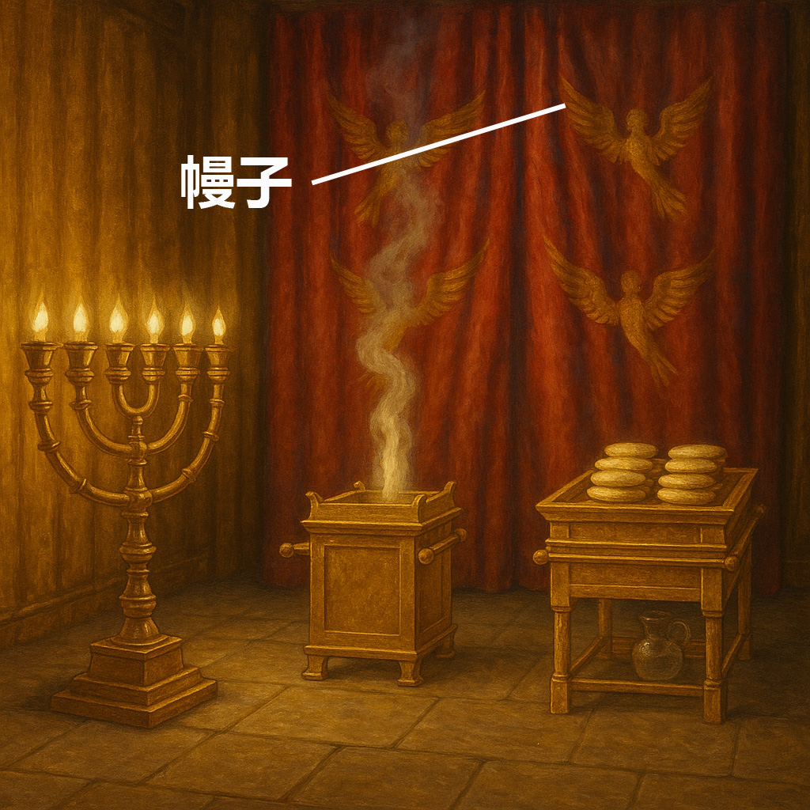

# Human-made Things in the Bible

## License Information

Human-made Things in the Bible © United Bible Societies, 2025. Adapted from: <cite>The Works of Their Hands: Man-made Things in the Bible</cite>, by Ray Pritz © 2009 United Bible Societies. This work is licensed under Creative Commons Attribution-ShareAlike 4.0 International (<a href="https://creativecommons.org/licenses/by-sa/4.0/">https://creativecommons.org/licenses/by-sa/4.0/</a>).

--------------------------------

## 标题：幔子、帷幔、帷帐（curtain, veil, drape） (id: REALIA:3.14.1.6)

3\.14\.1\.6 标题：幔子、帷幔、帷帐（curtain, veil, drape）
=============================================

经文出处
----

Hebrew 来：פָּרֹכֶת (音译：paroketh)

[EXO 26:31](https://ref.ly/Exod26:31), [EXO 26:33](https://ref.ly/Exod26:33), [EXO 26:33](https://ref.ly/Exod26:33), [EXO 26:33](https://ref.ly/Exod26:33), [EXO 26:35](https://ref.ly/Exod26:35), [EXO 27:21](https://ref.ly/Exod27:21), [EXO 30:6](https://ref.ly/Exod30:6), [EXO 35:12](https://ref.ly/Exod35:12), [EXO 36:35](https://ref.ly/Exod36:35), [EXO 38:27](https://ref.ly/Exod38:27), [EXO 39:34](https://ref.ly/Exod39:34), [EXO 40:3](https://ref.ly/Exod40:3), [EXO 40:22](https://ref.ly/Exod40:22), [EXO 40:22](https://ref.ly/Exod40:22), [EXO 40:26](https://ref.ly/Exod40:26), [LEV 4:6](https://ref.ly/Lev4:6), [LEV 4:17](https://ref.ly/Lev4:17), [LEV 16:2](https://ref.ly/Lev16:2), [LEV 16:12](https://ref.ly/Lev16:12), [LEV 16:15](https://ref.ly/Lev16:15), [LEV 21:23](https://ref.ly/Lev21:23), [LEV 24:3](https://ref.ly/Lev24:3), [NUM 4:5](https://ref.ly/Num4:5), [NUM 18:7](https://ref.ly/Num18:7), [2CH 3:14](https://ref.ly/2Chr3:14)

Greek 希：καταπέτασμα (音译：katapetasma)

[MAT 27:51](https://ref.ly/Matt27:51), [MRK 15:38](https://ref.ly/Mark15:38), [LUK 23:45](https://ref.ly/Luke23:45), [HEB 6:19](https://ref.ly/Heb6:19), [HEB 9:3](https://ref.ly/Heb9:3), [HEB 10:20](https://ref.ly/Heb10:20), [SIR 50:5](https://ref.ly/Sir50:5), [1MA 1:22](https://ref.ly/1Macc1:22), [1MA 4:51](https://ref.ly/1Macc4:51)

描述
--

*幔子 (Image generated by ChatGPT using OpenAI technology)*

幔子是一块悬挂起来的布，用来遮住房间的入口或把房间分隔成两部分。帐幕和圣殿中，有一块幔子挂在至圣所前面，就在约柜的正前方，把至圣所和圣所隔开。有些学者认为幔子并不是挂起来的，而是搭在约柜放置地点四围的顶部，形成一个类似帐棚的结构。幔子是用三种颜色的羊毛和一种细麻布织成的，上面装饰着有翼生物的图案。幔子的布很厚（在圣经成书之后的时期，犹太传统认为它和人手的厚度差不多。）

---

用途
--

除了遮蔽至圣所以免让人看见之外，幔子在人们抬约柜的时候也起到同样的作用。拆卸会幕时，幔子从前面（或上面）直接盖在约柜上，从而避免有人在移动约柜时看见它。

---

翻译
--

希伯来文*paroketh* 的字面意思是“隔墙”。在犹太传统中，这是一种特殊的隔墙，把君王和百姓隔开。有些语言可能会用一个专门的词语表示这种隔墙。

希伯来文*paroketh* 和希腊文*katapetasma* 与圣殿有关，英文传统上译为“veil”（“幕纱、面纱”，中文译本作“幔子”），但在其他语言中，与“面纱”字面意思相对应的词语可能会误导读者，因为它可能表示仅仅用来遮住脸的东西。甚至“curtain”（“帷幕、窗帘”）在其他语言中的对应词也可能会误导人，因为它可能指用来遮住窗户的物品。翻译者常常需要使用某些描述性的对等语，例如，“从天花板垂下来的一大块布”，或“遮住入口的一大块布”。

[EXO 26:31](https://ref.ly/Exod26:31) 描述了该物件。“Veil”（RSV (Revised Standard Version (1952)) ；希伯来文*paroketh* ）是一块“curtain”（GNT (Good News Translation (1992)) ），但最好把它与帐幕入口处的“screen”（RSV (Revised Standard Version (1952)) ；希伯来文*masak* ，中译“门帘”）区别开来，虽然那块布料本身也是一块“curtain”（参[EXO 26:36](https://ref.ly/Exod26:36) 和[3\.15\.2\.3\.8 门帘 (screen, entrance curtain)\<REALIA:3\.15\.2\.3\.8\>](#) ）。*Masak* 一词的原意是遮住某物，甚至是隐藏某物；而*paroketh* 的原意是进行区分和将某物分开。有些译本并没有区分这两个词（GNT (Good News Translation (1992)) 、NIV (New International Version (1984)) ），还有些译本分别译为“curtain／screen”（NRSV (New Revised Standard Version (1989)) 、NJPSV (New Jewish Publication Society Version) 、NJB (New Jerusalem Bible (1985)) 、REB (Revised English Bible (1989)) ）、“veil／curtain”（NAB (New American Bible (1970)) ）、“Veil／Screen”（德拉姆）、“screen／covering”（TOT ），甚至是“curtain／veil”（Mft (Moffatt Translation (1926)) ）。然而，*paroketh* 的功能是隔开圣所和至圣所（参[EXO 26:33](https://ref.ly/Exod26:33) ）。因此，这个信息可以应用在这节经文中，表明它是用来隐藏至圣所内部物品的“门帘”或“幔子”。如果当地文化不知道这种“门帘”，翻译者可译为“圣布”或“避讳的布”。

[EXO 26:33](https://ref.ly/Exod26:33) ：“你要把幔子垂挂在钩子上”（RSV (Revised Standard Version (1952)) 直译），这句话的希伯来文本的字面意思是：“你要把幔子放在钩子下面。”“钩子”指的是26:6中提到的金钩，这些钩子把帐幕里层的两大块细麻布连在一起。按照上帝的指示把里层罩棚放在框架上之后，这排钩子距离帐幕西端正好10肘（约4\.5米或15英尺）。NAB (New American Bible (1970)) 、NIV (New International Version (1984)) 、RSV (Revised Standard Version (1952)) 认为幔子是从这些钩子上悬垂下来的，但NRSV (New Revised Standard Version (1989)) 将其改译为“在钩子下方”（“under the clasps”），意思是“在会幕顶部那排钩子的下方”（“under the row of hooks in the roof of the Tent”；GNT (Good News Translation (1992)) ）。

* **Associated Passages:** 出埃及记 26:31; 出埃及记 26:33; 出埃及记 26:35; 出埃及记 27:21; 出埃及记 30:6; 出埃及记 35:12; 出埃及记 36:35; 出埃及记 38:27; 出埃及记 39:34; 出埃及记 40:3; 出埃及记 40:22; 出埃及记 40:26; 利未记 4:6; 利未记 4:17; 利未记 16:2; 利未记 16:12; 利未记 16:15; 利未记 21:23; 利未记 24:3; 民数记 4:5; 民数记 18:7; 历代志下 3:14; 马太福音 27:51; 马可福音 15:38; 路加福音 23:45; 希伯来书 6:19; 希伯来书 9:3; 希伯来书 10:20; 德训篇 50:5; 玛加伯上 1:22; 玛加伯上 4:51; 出埃及记 26:36

