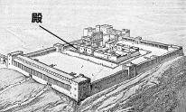
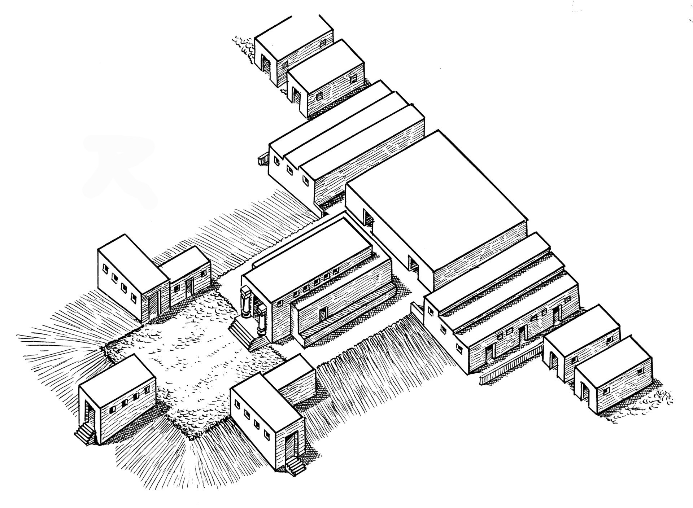
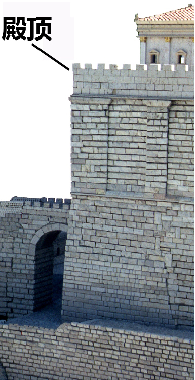

# Human-made Things in the Bible

## License Information

Human-made Things in the Bible © United Bible Societies, 2025. Adapted from: <cite>The Works of Their Hands: Man-made Things in the Bible</cite>, by Ray Pritz © 2009 United Bible Societies. This work is licensed under Creative Commons Attribution-ShareAlike 4.0 International (<a href="https://creativecommons.org/licenses/by-sa/4.0/">https://creativecommons.org/licenses/by-sa/4.0/</a>).

--------------------------------

## 标题：犹太人的圣殿（Jewish Temple） (id: REALIA:3.14.1)

3\.14\.1 标题：犹太人的圣殿（Jewish Temple）
=================================

经文出处
----

Hebrew 来：בַּיִת (音译：bayith)

[2SA 7:5](https://ref.ly/2Sam7:5), [2SA 7:6](https://ref.ly/2Sam7:6), [2SA 7:7](https://ref.ly/2Sam7:7), [1KI 3:1](https://ref.ly/1Kgs3:1), [1KI 3:2](https://ref.ly/1Kgs3:2), [1KI 5:17](https://ref.ly/1Kgs5:17), [1KI 5:19](https://ref.ly/1Kgs5:19), [1KI 5:19](https://ref.ly/1Kgs5:19), [1KI 5:31](https://ref.ly/1Kgs5:31), [1KI 5:32](https://ref.ly/1Kgs5:32)

Hebrew 来：הֵיכָל (音译：heykal)

[2SA 22:7](https://ref.ly/2Sam22:7), [1KI 6:3](https://ref.ly/1Kgs6:3), [1KI 6:5](https://ref.ly/1Kgs6:5), [1KI 7:21](https://ref.ly/1Kgs7:21), [2KI 18:16](https://ref.ly/2Kgs18:16), [2KI 23:4](https://ref.ly/2Kgs23:4), [2KI 24:13](https://ref.ly/2Kgs24:13), [2CH 3:17](https://ref.ly/2Chr3:17), [2CH 4:7](https://ref.ly/2Chr4:7), [2CH 4:8](https://ref.ly/2Chr4:8), [2CH 26:16](https://ref.ly/2Chr26:16), [2CH 27:2](https://ref.ly/2Chr27:2), [EZR 3:6](https://ref.ly/Ezra3:6), [EZR 3:10](https://ref.ly/Ezra3:10), [EZR 4:1](https://ref.ly/Ezra4:1), [PSA 27:4](https://ref.ly/Ps27:4), [PSA 29:9](https://ref.ly/Ps29:9), [PSA 48:10](https://ref.ly/Ps48:10), [PSA 65:5](https://ref.ly/Ps65:5), [PSA 68:30](https://ref.ly/Ps68:30), [PSA 79:1](https://ref.ly/Ps79:1), [ISA 44:28](https://ref.ly/Isa44:28), [ISA 66:6](https://ref.ly/Isa66:6), [JER 7:4](https://ref.ly/Jer7:4), [JER 7:4](https://ref.ly/Jer7:4), [JER 7:4](https://ref.ly/Jer7:4), [JER 24:1](https://ref.ly/Jer24:1), [JER 50:28](https://ref.ly/Jer50:28), [JER 51:11](https://ref.ly/Jer51:11), [AMO 8:3](https://ref.ly/Amos8:3), [HAG 2:15](https://ref.ly/Hag2:15), [HAG 2:18](https://ref.ly/Hag2:18), [ZEC 6:12](https://ref.ly/Zech6:12), [ZEC 6:13](https://ref.ly/Zech6:13), [ZEC 6:14](https://ref.ly/Zech6:14), [ZEC 6:15](https://ref.ly/Zech6:15), [ZEC 8:9](https://ref.ly/Zech8:9)

Aramaic 兰：הֵיכַל (音译：heykal)

[EZR 5:14](https://ref.ly/Ezra5:14), [EZR 5:14](https://ref.ly/Ezra5:14), [EZR 5:14](https://ref.ly/Ezra5:14), [EZR 5:15](https://ref.ly/Ezra5:15), [EZR 6:5](https://ref.ly/Ezra6:5), [EZR 6:5](https://ref.ly/Ezra6:5), [DAN 5:2](https://ref.ly/Dan5:2), [DAN 5:3](https://ref.ly/Dan5:3)

Hebrew 来：מוֹעֵד (音译：mo‘ed)

[PSA 74:4](https://ref.ly/Ps74:4), [LAM 2:6](https://ref.ly/Lam2:6)

Hebrew 来：מִקְדָּשׁ (音译：miqdash)

[1CH 22:19](https://ref.ly/1Chr22:19), [1CH 28:10](https://ref.ly/1Chr28:10), [2CH 20:8](https://ref.ly/2Chr20:8), [2CH 26:18](https://ref.ly/2Chr26:18), [2CH 29:21](https://ref.ly/2Chr29:21), [2CH 30:8](https://ref.ly/2Chr30:8), [2CH 36:17](https://ref.ly/2Chr36:17), [NEH 10:40](https://ref.ly/Neh10:40), [PSA 68:36](https://ref.ly/Ps68:36), [PSA 73:17](https://ref.ly/Ps73:17), [PSA 74:7](https://ref.ly/Ps74:7), [PSA 78:69](https://ref.ly/Ps78:69), [PSA 96:6](https://ref.ly/Ps96:6), [ISA 60:13](https://ref.ly/Isa60:13), [ISA 63:18](https://ref.ly/Isa63:18), [JER 17:12](https://ref.ly/Jer17:12), [JER 51:51](https://ref.ly/Jer51:51), [LAM 1:10](https://ref.ly/Lam1:10), [LAM 2:7](https://ref.ly/Lam2:7), [LAM 2:20](https://ref.ly/Lam2:20), [EZK 5:11](https://ref.ly/Ezek5:11), [EZK 8:6](https://ref.ly/Ezek8:6), [EZK 9:6](https://ref.ly/Ezek9:6), [EZK 23:38](https://ref.ly/Ezek23:38), [EZK 23:39](https://ref.ly/Ezek23:39), [EZK 24:21](https://ref.ly/Ezek24:21), [EZK 25:3](https://ref.ly/Ezek25:3), [EZK 37:26](https://ref.ly/Ezek37:26), [EZK 37:28](https://ref.ly/Ezek37:28), [EZK 43:21](https://ref.ly/Ezek43:21), [EZK 44:1](https://ref.ly/Ezek44:1), [EZK 44:5](https://ref.ly/Ezek44:5), [EZK 44:7](https://ref.ly/Ezek44:7), [EZK 44:8](https://ref.ly/Ezek44:8), [EZK 44:9](https://ref.ly/Ezek44:9), [EZK 44:11](https://ref.ly/Ezek44:11), [EZK 44:15](https://ref.ly/Ezek44:15), [EZK 44:16](https://ref.ly/Ezek44:16), [EZK 45:4](https://ref.ly/Ezek45:4), [EZK 45:4](https://ref.ly/Ezek45:4), [EZK 45:18](https://ref.ly/Ezek45:18), [EZK 47:12](https://ref.ly/Ezek47:12), [EZK 48:8](https://ref.ly/Ezek48:8), [EZK 48:10](https://ref.ly/Ezek48:10), [EZK 48:21](https://ref.ly/Ezek48:21), [DAN 8:11](https://ref.ly/Dan8:11), [DAN 9:17](https://ref.ly/Dan9:17), [DAN 11:31](https://ref.ly/Dan11:31)

Hebrew 来：קָדוֹשׁ (音译：qadosh)

[ECC 8:10](https://ref.ly/Eccl8:10)

Hebrew 来：קֹדֶשׁ (音译：qodesh)

[1CH 23:32](https://ref.ly/1Chr23:32), [1CH 24:5](https://ref.ly/1Chr24:5), [2CH 29:5](https://ref.ly/2Chr29:5), [2CH 29:7](https://ref.ly/2Chr29:7), [2CH 30:19](https://ref.ly/2Chr30:19), [PSA 20:3](https://ref.ly/Ps20:3), [PSA 24:3](https://ref.ly/Ps24:3), [PSA 63:3](https://ref.ly/Ps63:3), [PSA 68:18](https://ref.ly/Ps68:18), [PSA 68:25](https://ref.ly/Ps68:25), [PSA 74:3](https://ref.ly/Ps74:3), [PSA 134:2](https://ref.ly/Ps134:2), [PSA 150:1](https://ref.ly/Ps150:1), [ISA 43:28](https://ref.ly/Isa43:28), [EZK 44:27](https://ref.ly/Ezek44:27), [EZK 44:27](https://ref.ly/Ezek44:27), [EZK 45:3](https://ref.ly/Ezek45:3), [EZK 45:3](https://ref.ly/Ezek45:3), [EZK 45:3](https://ref.ly/Ezek45:3), [DAN 8:13](https://ref.ly/Dan8:13), [DAN 8:14](https://ref.ly/Dan8:14), [DAN 9:24](https://ref.ly/Dan9:24), [DAN 9:26](https://ref.ly/Dan9:26)

Hebrew 来：שֹׂךְ (音译：sok)

[LAM 2:6](https://ref.ly/Lam2:6)

Greek 希：ἅγιος (音译：hagios)

[JDT 4:12](https://ref.ly/Jdt4:12), [JDT 4:13](https://ref.ly/Jdt4:13), [JDT 8:21](https://ref.ly/Jdt8:21), [JDT 8:24](https://ref.ly/Jdt8:24), [JDT 9:8](https://ref.ly/Jdt9:8), [JDT 16:20](https://ref.ly/Jdt16:20), [1MA 2:12](https://ref.ly/1Macc2:12), [1MA 3:43](https://ref.ly/1Macc3:43), [1MA 3:51](https://ref.ly/1Macc3:51), [1MA 3:58](https://ref.ly/1Macc3:58), [1MA 3:59](https://ref.ly/1Macc3:59), [1MA 4:36](https://ref.ly/1Macc4:36), [1MA 4:41](https://ref.ly/1Macc4:41), [1MA 4:43](https://ref.ly/1Macc4:43), [1MA 4:48](https://ref.ly/1Macc4:48), [1MA 6:18](https://ref.ly/1Macc6:18), [1MA 6:54](https://ref.ly/1Macc6:54), [1MA 7:33](https://ref.ly/1Macc7:33), [1MA 7:42](https://ref.ly/1Macc7:42), [1MA 9:54](https://ref.ly/1Macc9:54), [1MA 10:42](https://ref.ly/1Macc10:42), [1MA 10:39](https://ref.ly/1Macc10:39), [1MA 10:39](https://ref.ly/1Macc10:39), [1MA 10:44](https://ref.ly/1Macc10:44), [1MA 13:3](https://ref.ly/1Macc13:3), [1MA 13:6](https://ref.ly/1Macc13:6), [1MA 14:15](https://ref.ly/1Macc14:15), [1MA 14:15](https://ref.ly/1Macc14:15), [1MA 14:29](https://ref.ly/1Macc14:29), [1MA 14:31](https://ref.ly/1Macc14:31), [1MA 14:36](https://ref.ly/1Macc14:36), [1MA 14:42](https://ref.ly/1Macc14:42), [1MA 14:48](https://ref.ly/1Macc14:48), [1MA 15:7](https://ref.ly/1Macc15:7), [2MA 15:17](https://ref.ly/2Macc15:17)

Greek 希：ἁγίασμα (音译：hagiasma)

[JDT 5:19](https://ref.ly/Jdt5:19), [SIR 47:10](https://ref.ly/Sir47:10), [SIR 47:13](https://ref.ly/Sir47:13), [SIR 50:11](https://ref.ly/Sir50:11), [1MA 1:21](https://ref.ly/1Macc1:21), [1MA 1:36](https://ref.ly/1Macc1:36), [1MA 1:37](https://ref.ly/1Macc1:37), [1MA 1:37](https://ref.ly/1Macc1:37), [1MA 1:39](https://ref.ly/1Macc1:39), [1MA 1:45](https://ref.ly/1Macc1:45), [1MA 1:46](https://ref.ly/1Macc1:46), [1MA 2:7](https://ref.ly/1Macc2:7), [1MA 3:45](https://ref.ly/1Macc3:45), [1MA 4:38](https://ref.ly/1Macc4:38), [1MA 5:1](https://ref.ly/1Macc5:1), [1MA 6:7](https://ref.ly/1Macc6:7), [1MA 6:26](https://ref.ly/1Macc6:26), [1MA 6:51](https://ref.ly/1Macc6:51)

Greek 希：ἁγιασμός (音译：hagiasmos)

[3MA 2:18](https://ref.ly/3Macc2:18)

Greek 希：ἱερός (音译：hieros)

[MAT 4:5](https://ref.ly/Matt4:5), [MAT 12:5](https://ref.ly/Matt12:5), [MAT 12:6](https://ref.ly/Matt12:6), [MAT 21:12](https://ref.ly/Matt21:12), [MAT 21:12](https://ref.ly/Matt21:12), [MAT 21:14](https://ref.ly/Matt21:14), [MAT 21:15](https://ref.ly/Matt21:15), [MAT 21:23](https://ref.ly/Matt21:23), [MAT 24:1](https://ref.ly/Matt24:1), [MAT 24:1](https://ref.ly/Matt24:1), [MAT 26:55](https://ref.ly/Matt26:55), [MRK 11:11](https://ref.ly/Mark11:11), [MRK 11:15](https://ref.ly/Mark11:15), [MRK 11:15](https://ref.ly/Mark11:15), [MRK 11:16](https://ref.ly/Mark11:16), [MRK 11:27](https://ref.ly/Mark11:27), [MRK 12:35](https://ref.ly/Mark12:35), [MRK 13:1](https://ref.ly/Mark13:1), [MRK 13:3](https://ref.ly/Mark13:3), [MRK 14:49](https://ref.ly/Mark14:49), [LUK 2:27](https://ref.ly/Luke2:27), [LUK 2:37](https://ref.ly/Luke2:37), [LUK 2:46](https://ref.ly/Luke2:46), [LUK 4:9](https://ref.ly/Luke4:9), [LUK 18:10](https://ref.ly/Luke18:10), [LUK 19:45](https://ref.ly/Luke19:45), [LUK 19:47](https://ref.ly/Luke19:47), [LUK 20:1](https://ref.ly/Luke20:1), [LUK 21:5](https://ref.ly/Luke21:5), [LUK 21:37](https://ref.ly/Luke21:37), [LUK 21:38](https://ref.ly/Luke21:38), [LUK 22:52](https://ref.ly/Luke22:52), [LUK 22:53](https://ref.ly/Luke22:53), [LUK 24:53](https://ref.ly/Luke24:53), [JHN 2:14](https://ref.ly/John2:14), [JHN 2:15](https://ref.ly/John2:15), [JHN 5:14](https://ref.ly/John5:14), [JHN 7:14](https://ref.ly/John7:14), [JHN 7:28](https://ref.ly/John7:28), [JHN 8:2](https://ref.ly/John8:2), [JHN 8:20](https://ref.ly/John8:20), [JHN 8:59](https://ref.ly/John8:59), [JHN 10:23](https://ref.ly/John10:23), [JHN 11:56](https://ref.ly/John11:56), [JHN 18:20](https://ref.ly/John18:20), [ACT 2:46](https://ref.ly/Acts2:46), [ACT 3:1](https://ref.ly/Acts3:1), [ACT 3:2](https://ref.ly/Acts3:2), [ACT 3:2](https://ref.ly/Acts3:2), [ACT 3:3](https://ref.ly/Acts3:3), [ACT 3:8](https://ref.ly/Acts3:8), [ACT 3:10](https://ref.ly/Acts3:10), [ACT 4:1](https://ref.ly/Acts4:1), [ACT 5:20](https://ref.ly/Acts5:20), [ACT 5:21](https://ref.ly/Acts5:21), [ACT 5:24](https://ref.ly/Acts5:24), [ACT 5:25](https://ref.ly/Acts5:25), [ACT 5:42](https://ref.ly/Acts5:42), [ACT 19:27](https://ref.ly/Acts19:27), [ACT 21:26](https://ref.ly/Acts21:26), [ACT 21:27](https://ref.ly/Acts21:27), [ACT 21:28](https://ref.ly/Acts21:28), [ACT 21:29](https://ref.ly/Acts21:29), [ACT 21:30](https://ref.ly/Acts21:30), [ACT 22:17](https://ref.ly/Acts22:17), [ACT 24:6](https://ref.ly/Acts24:6), [ACT 24:12](https://ref.ly/Acts24:12), [ACT 24:18](https://ref.ly/Acts24:18), [ACT 25:8](https://ref.ly/Acts25:8), [ACT 26:21](https://ref.ly/Acts26:21), [1CO 9:13](https://ref.ly/1Cor9:13), [1CO 9:13](https://ref.ly/1Cor9:13)

Greek 希：ναός (音译：naos)

[MAT 23:16](https://ref.ly/Matt23:16), [MAT 23:16](https://ref.ly/Matt23:16), [MAT 23:17](https://ref.ly/Matt23:17), [MAT 23:21](https://ref.ly/Matt23:21), [MAT 23:35](https://ref.ly/Matt23:35), [MAT 26:61](https://ref.ly/Matt26:61), [MAT 27:5](https://ref.ly/Matt27:5), [MAT 27:40](https://ref.ly/Matt27:40), [MAT 27:51](https://ref.ly/Matt27:51), [MRK 14:58](https://ref.ly/Mark14:58), [MRK 15:29](https://ref.ly/Mark15:29), [MRK 15:38](https://ref.ly/Mark15:38), [LUK 1:9](https://ref.ly/Luke1:9), [LUK 1:21](https://ref.ly/Luke1:21), [LUK 1:22](https://ref.ly/Luke1:22), [LUK 23:45](https://ref.ly/Luke23:45), [JHN 2:19](https://ref.ly/John2:19), [JHN 2:20](https://ref.ly/John2:20), [1CO 3:17](https://ref.ly/1Cor3:17), [1CO 3:17](https://ref.ly/1Cor3:17), [2CO 6:16](https://ref.ly/2Cor6:16), [EPH 2:21](https://ref.ly/Eph2:21), [2TH 2:4](https://ref.ly/2Thess2:4), [REV 3:12](https://ref.ly/Rev3:12), [REV 7:15](https://ref.ly/Rev7:15), [REV 11:1](https://ref.ly/Rev11:1), [REV 11:2](https://ref.ly/Rev11:2), [REV 11:19](https://ref.ly/Rev11:19), [REV 11:19](https://ref.ly/Rev11:19), [REV 14:15](https://ref.ly/Rev14:15), [REV 14:17](https://ref.ly/Rev14:17), [REV 15:5](https://ref.ly/Rev15:5), [REV 15:6](https://ref.ly/Rev15:6), [REV 15:8](https://ref.ly/Rev15:8), [REV 15:8](https://ref.ly/Rev15:8), [REV 16:1](https://ref.ly/Rev16:1), [REV 16:17](https://ref.ly/Rev16:17)

Greek 希：νεώς (音译：neōs)

[2MA 4:14](https://ref.ly/2Macc4:14), [2MA 6:2](https://ref.ly/2Macc6:2), [2MA 9:16](https://ref.ly/2Macc9:16), [2MA 10:3](https://ref.ly/2Macc10:3), [2MA 10:5](https://ref.ly/2Macc10:5), [2MA 13:23](https://ref.ly/2Macc13:23), [2MA 14:33](https://ref.ly/2Macc14:33)

Greek 希：οἰκία, οἶκος (音译：oikia, oikos)

[MAT 12:4](https://ref.ly/Matt12:4), [MAT 21:13](https://ref.ly/Matt21:13), [MAT 21:13](https://ref.ly/Matt21:13), [MRK 2:26](https://ref.ly/Mark2:26), [MRK 11:17](https://ref.ly/Mark11:17), [MRK 11:17](https://ref.ly/Mark11:17), [LUK 6:4](https://ref.ly/Luke6:4), [LUK 11:51](https://ref.ly/Luke11:51), [LUK 19:46](https://ref.ly/Luke19:46), [LUK 19:46](https://ref.ly/Luke19:46), [JHN 2:16](https://ref.ly/John2:16), [JHN 2:17](https://ref.ly/John2:17), [JHN 14:2](https://ref.ly/John14:2), [ACT 7:47](https://ref.ly/Acts7:47), [ACT 7:49](https://ref.ly/Acts7:49), [HEB 3:2](https://ref.ly/Heb3:2), [HEB 3:5](https://ref.ly/Heb3:5), [HEB 10:21](https://ref.ly/Heb10:21)

Greek 希：σκήνωμα (音译：skēnōma)

[JDT 9:8](https://ref.ly/Jdt9:8)

Greek 希：τόπος, ἅγιος, ἁγίασμα (音译：topos, hagios topos, topos hagios, topos tou hagiasmatos)

[MAT 24:15](https://ref.ly/Matt24:15), [JHN 11:48](https://ref.ly/John11:48), [ACT 6:13](https://ref.ly/Acts6:13), [ACT 21:28](https://ref.ly/Acts21:28), [2MA 2:18](https://ref.ly/2Macc2:18), [2MA 3:18](https://ref.ly/2Macc3:18), [2MA 5:17](https://ref.ly/2Macc5:17), [2MA 5:19](https://ref.ly/2Macc5:19), [2MA 5:19](https://ref.ly/2Macc5:19), [2MA 8:17](https://ref.ly/2Macc8:17), [2MA 10:7](https://ref.ly/2Macc10:7), [2MA 13:23](https://ref.ly/2Macc13:23), [3MA 1:9](https://ref.ly/3Macc1:9), [3MA 1:9](https://ref.ly/3Macc1:9), [3MA 1:23](https://ref.ly/3Macc1:23), [3MA 2:14](https://ref.ly/3Macc2:14), [4MA 4:9](https://ref.ly/4Macc4:9), [4MA 4:12](https://ref.ly/4Macc4:12), [1ES 8:75](https://ref.ly/1Esd8:75)

Latin 拉：sanctificatio

[2ES 7:108](https://ref.ly/2Esd7:108), [2ES 10:21](https://ref.ly/2Esd10:21), [2ES 12:48](https://ref.ly/2Esd12:48), [2ES 15:25](https://ref.ly/2Esd15:25)

Latin 拉：templum

[2ES 10:21](https://ref.ly/2Esd10:21)

描述和用途
-----

*希律圣殿示意图 (© Public Domain \- Wikimedia Commons)*

圣殿是位于耶路撒冷的一座建筑物，被视为上帝的居所，是百姓敬拜他的地方。自所罗门首次建殿以来，它就是犹太人敬拜的中心。在犹太人的历史上，一共建造了三座圣殿，每一座都非常不同。所罗门建造的第一座圣殿于主前587或主前586年被毁。大约70年后，所罗巴伯建造了一座比较简朴的新殿，该殿一直使用到差不多新约时期，那时大希律进行了大规模的重建。这第三座圣殿约在主后63年才建成，但是7年之后就被罗马军队摧毁。

---

翻译
--

*希律时代的圣殿山模型 (© Ray Pritz by United Bible Societies)*

实际上，圣经中提到四座犹太人的圣殿，分别是所罗门、所罗巴伯和大希律修建的圣殿，以及《以西结书》最后几章中提到的、以西结在异象中见到的理想圣殿。翻译者应使用同一个词来表示这四座圣殿，同时提供附注或术语简释词条来解释它们之间的不同。一般情况下，不需要也不建议在译文中说明它们之间的不同。

“圣殿”可译为“上帝的殿”、“上帝的居所”或“上帝的房屋”。有些语言会说“圣洁的房屋”或“圣洁的地方”。其他译法有“向上帝歌唱的大房屋”、“向上帝祷告的大房屋”等。

*艺术家构想的以西结圣殿 (© Deutsche Bibelgesellschaft, Stuttgart by United Bible Societies)*

希伯来文*mo‘ed* 的字面意思是约定的会面时间或地点。在上面提到的经文中，这个词指的是圣殿，是人们前来度过神圣节期的地方。

*(Image generated by ChatGPT using OpenAI technology)*

有些语言有专门的词语来表示“圣殿”，而且通常会与表示神明居住的祭祀中心所用的词语区别开来。在新约中，希腊文*naos* 指的是一座建筑，而*hieron* 指的是整个圣殿区域，包括建筑、庭院和库房。虽然在一些上下文中不需要区分*hieron* 和*naos* ，但在[MAT 21:12](https://ref.ly/Matt21:12) （以及平行经文[MRK 11:15](https://ref.ly/Mark11:15); [LUK 19:45](https://ref.ly/Luke19:45); [JHN 2:14](https://ref.ly/John2:14) ）中，翻译者需要指出这个区别，以免让人误以为献祭的动物是在中央圣所售卖的。翻译者要避免使用同一个词语来翻译“圣殿”和新约中的“会堂”。

* **Associated Passages:** 撒母耳记下 7:5; 撒母耳记下 7:6; 撒母耳记下 7:7; 列王纪上 3:1; 列王纪上 3:2; 列王纪上 5:17; 列王纪上 5:19; 列王纪上 5:31; 列王纪上 5:32; 撒母耳记下 22:7; 列王纪上 6:3; 列王纪上 6:5; 列王纪上 7:21; 列王纪下 18:16; 列王纪下 23:4; 列王纪下 24:13; 历代志下 3:17; 历代志下 4:7; 历代志下 4:8; 历代志下 26:16; 历代志下 27:2; 以斯拉记 3:6; 以斯拉记 3:10; 以斯拉记 4:1; 诗篇 27:4; 诗篇 29:9; 诗篇 48:10; 诗篇 65:5; 诗篇 68:30; 诗篇 79:1; 以赛亚书 44:28; 以赛亚书 66:6; 耶利米书 7:4; 耶利米书 24:1; 耶利米书 50:28; 耶利米书 51:11; 阿摩司书 8:3; 哈该书 2:15; 哈该书 2:18; 撒迦利亚书 6:12; 撒迦利亚书 6:13; 撒迦利亚书 6:14; 撒迦利亚书 6:15; 撒迦利亚书 8:9; 以斯拉记 5:14; 以斯拉记 5:15; 以斯拉记 6:5; 但以理书 5:2; 但以理书 5:3; 诗篇 74:4; 耶利米哀歌 2:6; 历代志上 22:19; 历代志上 28:10; 历代志下 20:8; 历代志下 26:18; 历代志下 29:21; 历代志下 30:8; 历代志下 36:17; 尼希米记 10:40; 诗篇 68:36; 诗篇 73:17; 诗篇 74:7; 诗篇 78:69; 诗篇 96:6; 以赛亚书 60:13; 以赛亚书 63:18; 耶利米书 17:12; 耶利米书 51:51; 耶利米哀歌 1:10; 耶利米哀歌 2:7; 耶利米哀歌 2:20; 以西结书 5:11; 以西结书 8:6; 以西结书 9:6; 以西结书 23:38; 以西结书 23:39; 以西结书 24:21; 以西结书 25:3; 以西结书 37:26; 以西结书 37:28; 以西结书 43:21; 以西结书 44:1; 以西结书 44:5; 以西结书 44:7; 以西结书 44:8; 以西结书 44:9; 以西结书 44:11; 以西结书 44:15; 以西结书 44:16; 以西结书 45:4; 以西结书 45:18; 以西结书 47:12; 以西结书 48:8; 以西结书 48:10; 以西结书 48:21; 但以理书 8:11; 但以理书 9:17; 但以理书 11:31; 传道书 8:10; 历代志上 23:32; 历代志上 24:5; 历代志下 29:5; 历代志下 29:7; 历代志下 30:19; 诗篇 20:3; 诗篇 24:3; 诗篇 63:3; 诗篇 68:18; 诗篇 68:25; 诗篇 74:3; 诗篇 134:2; 诗篇 150:1; 以赛亚书 43:28; 以西结书 44:27; 以西结书 45:3; 但以理书 8:13; 但以理书 8:14; 但以理书 9:24; 但以理书 9:26; 友弟德传 4:12; 友弟德传 4:13; 友弟德传 8:21; 友弟德传 8:24; 友弟德传 9:8; 友弟德传 16:20; 玛加伯上 2:12; 玛加伯上 3:43; 玛加伯上 3:51; 玛加伯上 3:58; 玛加伯上 3:59; 玛加伯上 4:36; 玛加伯上 4:41; 玛加伯上 4:43; 玛加伯上 4:48; 玛加伯上 6:18; 玛加伯上 6:54; 玛加伯上 7:33; 玛加伯上 7:42; 玛加伯上 9:54; 玛加伯上 10:42; 玛加伯上 10:39; 玛加伯上 10:44; 玛加伯上 13:3; 玛加伯上 13:6; 玛加伯上 14:15; 玛加伯上 14:29; 玛加伯上 14:31; 玛加伯上 14:36; 玛加伯上 14:42; 玛加伯上 14:48; 玛加伯上 15:7; 玛加伯下 15:17; 友弟德传 5:19; 德训篇 47:10; 德训篇 47:13; 德训篇 50:11; 玛加伯上 1:21; 玛加伯上 1:36; 玛加伯上 1:37; 玛加伯上 1:39; 玛加伯上 1:45; 玛加伯上 1:46; 玛加伯上 2:7; 玛加伯上 3:45; 玛加伯上 4:38; 玛加伯上 5:1; 玛加伯上 6:7; 玛加伯上 6:26; 玛加伯上 6:51; 玛加伯三书 2:18; 马太福音 4:5; 马太福音 12:5; 马太福音 12:6; 马太福音 21:12; 马太福音 21:14; 马太福音 21:15; 马太福音 21:23; 马太福音 24:1; 马太福音 26:55; 马可福音 11:11; 马可福音 11:15; 马可福音 11:16; 马可福音 11:27; 马可福音 12:35; 马可福音 13:1; 马可福音 13:3; 马可福音 14:49; 路加福音 2:27; 路加福音 2:37; 路加福音 2:46; 路加福音 4:9; 路加福音 18:10; 路加福音 19:45; 路加福音 19:47; 路加福音 20:1; 路加福音 21:5; 路加福音 21:37; 路加福音 21:38; 路加福音 22:52; 路加福音 22:53; 路加福音 24:53; 约翰福音 2:14; 约翰福音 2:15; 约翰福音 5:14; 约翰福音 7:14; 约翰福音 7:28; 约翰福音 8:2; 约翰福音 8:20; 约翰福音 8:59; 约翰福音 10:23; 约翰福音 11:56; 约翰福音 18:20; 使徒行传 2:46; 使徒行传 3:1; 使徒行传 3:2; 使徒行传 3:3; 使徒行传 3:8; 使徒行传 3:10; 使徒行传 4:1; 使徒行传 5:20; 使徒行传 5:21; 使徒行传 5:24; 使徒行传 5:25; 使徒行传 5:42; 使徒行传 19:27; 使徒行传 21:26; 使徒行传 21:27; 使徒行传 21:28; 使徒行传 21:29; 使徒行传 21:30; 使徒行传 22:17; 使徒行传 24:6; 使徒行传 24:12; 使徒行传 24:18; 使徒行传 25:8; 使徒行传 26:21; 哥林多前书 9:13; 马太福音 23:16; 马太福音 23:17; 马太福音 23:21; 马太福音 23:35; 马太福音 26:61; 马太福音 27:5; 马太福音 27:40; 马太福音 27:51; 马可福音 14:58; 马可福音 15:29; 马可福音 15:38; 路加福音 1:9; 路加福音 1:21; 路加福音 1:22; 路加福音 23:45; 约翰福音 2:19; 约翰福音 2:20; 哥林多前书 3:17; 哥林多后书 6:16; 以弗所书 2:21; 帖撒罗尼迦后书 2:4; 启示录 3:12; 启示录 7:15; 启示录 11:1; 启示录 11:2; 启示录 11:19; 启示录 14:15; 启示录 14:17; 启示录 15:5; 启示录 15:6; 启示录 15:8; 启示录 16:1; 启示录 16:17; 玛加伯下 4:14; 玛加伯下 6:2; 玛加伯下 9:16; 玛加伯下 10:3; 玛加伯下 10:5; 玛加伯下 13:23; 玛加伯下 14:33; 马太福音 12:4; 马太福音 21:13; 马可福音 2:26; 马可福音 11:17; 路加福音 6:4; 路加福音 11:51; 路加福音 19:46; 约翰福音 2:16; 约翰福音 2:17; 约翰福音 14:2; 使徒行传 7:47; 使徒行传 7:49; 希伯来书 3:2; 希伯来书 3:5; 希伯来书 10:21; 马太福音 24:15; 约翰福音 11:48; 使徒行传 6:13; 玛加伯下 2:18; 玛加伯下 3:18; 玛加伯下 5:17; 玛加伯下 5:19; 玛加伯下 8:17; 玛加伯下 10:7; 玛加伯三书 1:9; 玛加伯三书 1:23; 玛加伯三书 2:14; 玛加伯四书 4:9; 玛加伯四书 4:12; 厄斯德拉上 8:75; 厄斯德拉下 7:108; 厄斯德拉下 10:21; 厄斯德拉下 12:48; 厄斯德拉下 15:25

* **Associated ACAI Concepts:** Temple (ID: `realia:Temple`)

## 标题：门厅、门廊（entrance room, entrance hall） (id: REALIA:3.14.1.1)

3\.14\.1\.1 标题：门厅、门廊（entrance room, entrance hall）
==================================================

经文出处
----

Hebrew 来：אֵילָם, אוּלָם (音译：’eylam, ’elam, ’ulam)

[1KI 6:3](https://ref.ly/1Kgs6:3), [1KI 7:6](https://ref.ly/1Kgs7:6), [1KI 7:6](https://ref.ly/1Kgs7:6), [1KI 7:7](https://ref.ly/1Kgs7:7), [1KI 7:7](https://ref.ly/1Kgs7:7), [1KI 7:8](https://ref.ly/1Kgs7:8), [1KI 7:8](https://ref.ly/1Kgs7:8), [1KI 7:12](https://ref.ly/1Kgs7:12), [1KI 7:19](https://ref.ly/1Kgs7:19), [1KI 7:21](https://ref.ly/1Kgs7:21), [1CH 28:11](https://ref.ly/1Chr28:11), [2CH 3:4](https://ref.ly/2Chr3:4), [2CH 8:12](https://ref.ly/2Chr8:12), [2CH 15:8](https://ref.ly/2Chr15:8), [2CH 29:7](https://ref.ly/2Chr29:7), [2CH 29:17](https://ref.ly/2Chr29:17), [EZK 8:16](https://ref.ly/Ezek8:16), [EZK 40:7](https://ref.ly/Ezek40:7), [EZK 40:8](https://ref.ly/Ezek40:8), [EZK 40:9](https://ref.ly/Ezek40:9), [EZK 40:9](https://ref.ly/Ezek40:9), [EZK 40:15](https://ref.ly/Ezek40:15), [EZK 40:16](https://ref.ly/Ezek40:16), [EZK 40:21](https://ref.ly/Ezek40:21), [EZK 40:21](https://ref.ly/Ezek40:21), [EZK 40:22](https://ref.ly/Ezek40:22), [EZK 40:22](https://ref.ly/Ezek40:22), [EZK 40:22](https://ref.ly/Ezek40:22), [EZK 40:22](https://ref.ly/Ezek40:22), [EZK 40:24](https://ref.ly/Ezek40:24), [EZK 40:24](https://ref.ly/Ezek40:24), [EZK 40:25](https://ref.ly/Ezek40:25), [EZK 40:25](https://ref.ly/Ezek40:25), [EZK 40:26](https://ref.ly/Ezek40:26), [EZK 40:26](https://ref.ly/Ezek40:26), [EZK 40:29](https://ref.ly/Ezek40:29), [EZK 40:29](https://ref.ly/Ezek40:29), [EZK 40:29](https://ref.ly/Ezek40:29), [EZK 40:29](https://ref.ly/Ezek40:29), [EZK 40:30](https://ref.ly/Ezek40:30), [EZK 40:31](https://ref.ly/Ezek40:31), [EZK 40:33](https://ref.ly/Ezek40:33), [EZK 40:33](https://ref.ly/Ezek40:33), [EZK 40:33](https://ref.ly/Ezek40:33), [EZK 40:33](https://ref.ly/Ezek40:33), [EZK 40:34](https://ref.ly/Ezek40:34), [EZK 40:34](https://ref.ly/Ezek40:34), [EZK 40:36](https://ref.ly/Ezek40:36), [EZK 40:36](https://ref.ly/Ezek40:36), [EZK 40:39](https://ref.ly/Ezek40:39), [EZK 40:40](https://ref.ly/Ezek40:40), [EZK 40:48](https://ref.ly/Ezek40:48), [EZK 40:48](https://ref.ly/Ezek40:48), [EZK 40:49](https://ref.ly/Ezek40:49), [EZK 41:15](https://ref.ly/Ezek41:15), [EZK 41:25](https://ref.ly/Ezek41:25), [EZK 41:26](https://ref.ly/Ezek41:26), [EZK 44:3](https://ref.ly/Ezek44:3), [EZK 46:2](https://ref.ly/Ezek46:2), [EZK 46:8](https://ref.ly/Ezek46:8), [JOL 2:17](https://ref.ly/Joel2:17)

Hebrew 来：מִסְדְּרוֹן (音译：misdron)

[JDG 3:23](https://ref.ly/Judg3:23)

描述和用途
-----

门厅是从大型建筑的入口延伸出来的某种前厅。圣殿的门厅比殿的其余部分要高，可能没有屋顶。虽然圣经文本认为它是圣所内部空间的一部分，但它可能就像是个前院，是从外院过渡到建筑物内部的构筑物。上面列出的几节经文并不是指圣殿的门厅。[JDG 3:23](https://ref.ly/Judg3:23) 和[1KI 7:6](https://ref.ly/1Kgs7:6); [1KI 7:7](https://ref.ly/1Kgs7:7); [1KI 7:8](https://ref.ly/1Kgs7:8) 指的是王宫的门厅，而《以西结书》中的一些经文（[EZK 40:7](https://ref.ly/Ezek40:7); [EZK 40:8](https://ref.ly/Ezek40:8); [EZK 40:9](https://ref.ly/Ezek40:9), [EZK 40:15](https://ref.ly/Ezek40:15); [EZK 40:16](https://ref.ly/Ezek40:16); [EZK 40:17](https://ref.ly/Ezek40:17); [EZK 40:18](https://ref.ly/Ezek40:18); [EZK 40:19](https://ref.ly/Ezek40:19); [EZK 40:20](https://ref.ly/Ezek40:20); [EZK 40:21](https://ref.ly/Ezek40:21); [EZK 40:22](https://ref.ly/Ezek40:22); [EZK 40:23](https://ref.ly/Ezek40:23); [EZK 40:24](https://ref.ly/Ezek40:24); [EZK 40:25](https://ref.ly/Ezek40:25); [EZK 40:26](https://ref.ly/Ezek40:26); [EZK 40:27](https://ref.ly/Ezek40:27); [EZK 40:28](https://ref.ly/Ezek40:28); [EZK 40:29](https://ref.ly/Ezek40:29); [EZK 40:30](https://ref.ly/Ezek40:30); [EZK 40:31](https://ref.ly/Ezek40:31); [EZK 40:32](https://ref.ly/Ezek40:32); [EZK 40:33](https://ref.ly/Ezek40:33); [EZK 40:34](https://ref.ly/Ezek40:34); [EZK 40:35](https://ref.ly/Ezek40:35); [EZK 40:36](https://ref.ly/Ezek40:36) ，[EZK 40:39](https://ref.ly/Ezek40:39); [EZK 40:40](https://ref.ly/Ezek40:40) ，[EZK 46:2](https://ref.ly/Ezek46:2) ，[EZK 46:8](https://ref.ly/Ezek46:8) ）指的是殿门的门厅。

---

翻译
--

在许多语言中，希伯来文*’ulam* 唯一的近似对等词可能是房屋入口里面的小厅。但是，这可能会引起误解，因为这个希伯来文词语指的是一个非常大的厅，甚至比主建筑还要宽。翻译者可能要增加一个表示大小的修饰词，如“很大的门厅”。

* **Associated Passages:** 列王纪上 6:3; 列王纪上 7:6; 列王纪上 7:7; 列王纪上 7:8; 列王纪上 7:12; 列王纪上 7:19; 列王纪上 7:21; 历代志上 28:11; 历代志下 3:4; 历代志下 8:12; 历代志下 15:8; 历代志下 29:7; 历代志下 29:17; 以西结书 8:16; 以西结书 40:7; 以西结书 40:8; 以西结书 40:9; 以西结书 40:15; 以西结书 40:16; 以西结书 40:21; 以西结书 40:22; 以西结书 40:24; 以西结书 40:25; 以西结书 40:26; 以西结书 40:29; 以西结书 40:30; 以西结书 40:31; 以西结书 40:33; 以西结书 40:34; 以西结书 40:36; 以西结书 40:39; 以西结书 40:40; 以西结书 40:48; 以西结书 40:49; 以西结书 41:15; 以西结书 41:25; 以西结书 41:26; 以西结书 44:3; 以西结书 46:2; 以西结书 46:8; 约珥书 2:17; 士师记 3:23; 以西结书 40:17; 以西结书 40:18; 以西结书 40:19; 以西结书 40:20; 以西结书 40:23; 以西结书 40:27; 以西结书 40:28; 以西结书 40:32; 以西结书 40:35

## 标题：柱廊、走廊、廊子、游廊（colonnade, porch, covered walkway, stoa, portico） (id: REALIA:3.14.1.2)

3\.14\.1\.2 标题：柱廊、走廊、廊子、游廊（colonnade, porch, covered walkway, stoa, portico）
============================================================================

经文出处
----

Greek 希：στοά (音译：stoa)

[JHN 5:2](https://ref.ly/John5:2), [JHN 10:23](https://ref.ly/John10:23), [ACT 3:11](https://ref.ly/Acts3:11), [ACT 5:12](https://ref.ly/Acts5:12)

描述和用途
-----

*希律圣殿周围的有盖人行道模型 (© Ray Pritz by United Bible Societies)*

走廊是一个有顶盖的柱廊，有一侧通常是敞向户外的，人们可以在走廊上或站、或坐、或走，而不受日晒雨淋。走廊由支撑着屋顶的两排平行柱子组成。

---

翻译
--

在世界上许多地方，与希腊文*stoa* 最相近的对等词是一种游廊（verandah），这是一种宽敞的走廊。这种走廊可译为“很长的外部房间”或“柱子构成的开放式房间”。除[JHN 5:2](https://ref.ly/John5:2) 外，上面提到的经文都是指“所罗门廊”，这个走廊可能位于圣殿建筑群中外邦人院的东侧。

* **Associated Passages:** 约翰福音 5:2; 约翰福音 10:23; 使徒行传 3:11; 使徒行传 5:12

## 标题：煮祭肉的房间、厨房（rooms for boiling meat from sacrifices, kitchens） (id: REALIA:3.14.1.3)

3\.14\.1\.3 标题：煮祭肉的房间、厨房（rooms for boiling meat from sacrifices, kitchens）
==========================================================================

经文出处
----

Hebrew 来：בַּיִת, בשׁל (音译：beyth mvashlim)

[EZK 46:24](https://ref.ly/Ezek46:24)

描述和用途
-----

在以西结对圣殿的描述中，外院的四角有几个房间专门用来煮祭牲的肉。献某些祭的百姓要吃分别为圣的祭肉，这些祭肉是由专门负责该项工作的仆役（可能是利未人）在这些房间里面烹煮的。

---

翻译
--

大部分译本把[EZK 46:24](https://ref.ly/Ezek46:24) 中的*beyth mvashlim* 译为“厨房”（如RSV (Revised Standard Version (1952)) 、CEV (Contemporary English Version) 、NIV (New International Version (1984)) ），也有译为“烹煮的地方”（如NASB (New American Standard Bible) ）。GECL (German Common Language Version (Gute Nachricht Bibel)) 没有出现房间的名称，译为“殿役会在这里为百姓煮圣祭肉”。

* **Associated Passages:** 以西结书 46:24

## 标题：库房、银库、宝库（treasury, strongroom） (id: REALIA:3.14.1.4)

3\.14\.1\.4 标题：库房、银库、宝库（treasury, strongroom）
=============================================

经文出处
----

Hebrew 来：אֲרוֹן (音译：’aron)

[2KI 12:10](https://ref.ly/2Kgs12:10), [2KI 12:11](https://ref.ly/2Kgs12:11), [2CH 24:8](https://ref.ly/2Chr24:8), [2CH 24:10](https://ref.ly/2Chr24:10), [2CH 24:11](https://ref.ly/2Chr24:11), [2CH 24:11](https://ref.ly/2Chr24:11)

Hebrew 来：בַּיִת, אָסֹף (音译：(beyth) ’asupim)

[1CH 26:15](https://ref.ly/1Chr26:15), [1CH 26:17](https://ref.ly/1Chr26:17)

Hebrew 来：בַּיִת, אוֹצָר (音译：(beyth) ’otsar)

[DEU 28:12](https://ref.ly/Deut28:12), [DEU 32:34](https://ref.ly/Deut32:34), [JOS 6:19](https://ref.ly/Josh6:19), [JOS 6:24](https://ref.ly/Josh6:24), [1KI 7:51](https://ref.ly/1Kgs7:51), [1KI 15:18](https://ref.ly/1Kgs15:18), [1KI 15:18](https://ref.ly/1Kgs15:18), [2KI 12:19](https://ref.ly/2Kgs12:19), [2KI 14:14](https://ref.ly/2Kgs14:14), [2KI 16:8](https://ref.ly/2Kgs16:8), [2KI 18:15](https://ref.ly/2Kgs18:15), [2KI 20:13](https://ref.ly/2Kgs20:13), [2KI 20:15](https://ref.ly/2Kgs20:15), [2KI 24:13](https://ref.ly/2Kgs24:13), [2KI 24:13](https://ref.ly/2Kgs24:13), [1CH 9:26](https://ref.ly/1Chr9:26), [1CH 26:20](https://ref.ly/1Chr26:20), [1CH 26:20](https://ref.ly/1Chr26:20), [1CH 26:22](https://ref.ly/1Chr26:22), [1CH 26:24](https://ref.ly/1Chr26:24), [1CH 26:26](https://ref.ly/1Chr26:26), [1CH 27:25](https://ref.ly/1Chr27:25), [1CH 27:25](https://ref.ly/1Chr27:25), [1CH 28:12](https://ref.ly/1Chr28:12), [1CH 28:12](https://ref.ly/1Chr28:12), [1CH 29:8](https://ref.ly/1Chr29:8), [2CH 5:1](https://ref.ly/2Chr5:1), [2CH 8:15](https://ref.ly/2Chr8:15), [2CH 12:9](https://ref.ly/2Chr12:9), [2CH 12:9](https://ref.ly/2Chr12:9), [2CH 16:2](https://ref.ly/2Chr16:2), [2CH 25:24](https://ref.ly/2Chr25:24), [2CH 32:27](https://ref.ly/2Chr32:27), [EZR 2:69](https://ref.ly/Ezra2:69), [NEH 7:69](https://ref.ly/Neh7:69), [NEH 7:70](https://ref.ly/Neh7:70), [NEH 10:39](https://ref.ly/Neh10:39), [PRO 8:21](https://ref.ly/Prov8:21), [EZK 28:4](https://ref.ly/Ezek28:4), [DAN 1:2](https://ref.ly/Dan1:2), [HOS 13:15](https://ref.ly/Hos13:15), [MAL 3:10](https://ref.ly/Mal3:10)

Hebrew 来：בַּיִת, נְכֹאת (音译：beth nkoth)

[2KI 20:13](https://ref.ly/2Kgs20:13), [ISA 39:2](https://ref.ly/Isa39:2)

Aramaic 兰：גְּנַז (音译：gnaz)

[EZR 7:20](https://ref.ly/Ezra7:20)

Hebrew 来：גֶּנֶז (音译：genez)

[EST 3:9](https://ref.ly/Esth3:9), [EST 4:7](https://ref.ly/Esth4:7)

Hebrew 来：גַּנְזַךְ (音译：ganzak)

[1CH 28:11](https://ref.ly/1Chr28:11)

Greek 希：γαζοφυλάκιον (音译：gazofulakion)

[MRK 12:41](https://ref.ly/Mark12:41), [MRK 12:41](https://ref.ly/Mark12:41), [MRK 12:43](https://ref.ly/Mark12:43), [LUK 21:1](https://ref.ly/Luke21:1), [JHN 8:20](https://ref.ly/John8:20), [1MA 3:28](https://ref.ly/1Macc3:28), [1MA 14:49](https://ref.ly/1Macc14:49), [2MA 3:6](https://ref.ly/2Macc3:6), [2MA 3:24](https://ref.ly/2Macc3:24), [2MA 3:28](https://ref.ly/2Macc3:28), [2MA 3:40](https://ref.ly/2Macc3:40), [2MA 4:42](https://ref.ly/2Macc4:42), [2MA 5:18](https://ref.ly/2Macc5:18), [4MA 4:3](https://ref.ly/4Macc4:3), [4MA 4:6](https://ref.ly/4Macc4:6), [1ES 5:44](https://ref.ly/1Esd5:44), [1ES 8:18](https://ref.ly/1Esd8:18), [1ES 8:44](https://ref.ly/1Esd8:44)

Greek 希：θησαυρός (音译：thēsauros)

[SIR 1:25](https://ref.ly/Sir1:25), [1MA 3:29](https://ref.ly/1Macc3:29)

Greek 希：κορβανᾶς (音译：korbanas)

[MAT 27:6](https://ref.ly/Matt27:6)

Greek 希：ταμιεῖον (音译：tamieion)

[SIR 29:12](https://ref.ly/Sir29:12)

Greek 希：θησαυρός (音译：thesaurus)

[4MA 4:7](https://ref.ly/4Macc4:7), [2ES 6:40](https://ref.ly/2Esd6:40)

描述和用途
-----

*圣殿山的西南角 (© Ray Pritz by United Bible Societies)*

宝库是用来存放君王或其他国家行政机构的贵重物品的地方。耶路撒冷圣殿有自己的库房。库房没有标准的大小或结构。

---

翻译
--

在[2KI 12:10](https://ref.ly/2Kgs12:10); [2KI 12:11](https://ref.ly/2Kgs12:11) 和（《和》12:9–10）[2CH 24:8](https://ref.ly/2Chr24:8); [2CH 24:10](https://ref.ly/2Chr24:10); [2CH 24:11](https://ref.ly/2Chr24:11) 中，希伯来文*’aron* 指的是一个很大的奉献箱。根据[2KI 12:10](https://ref.ly/2Kgs12:10) （《和》12:9），这种箱子的“门”上开有一个洞。“门”指的是箱子的一个表面，可能是箱子的顶面。以色列人可以把他们的捐项（不是硬币，因为当时还没有发明出来），通过这个洞塞到箱子里面。之后，打开或取下箱子的顶，就可以取出捐项。

在一些经文中，希伯来文*’otsar* 指的是宝物（treasure；如[2KI 24:13](https://ref.ly/2Kgs24:13); [2CH 12:9](https://ref.ly/2Chr12:9) ）；而在另一些经文中，这个词指的是储存宝物的地方，即库房（treasury；如[2KI 20:13](https://ref.ly/2Kgs20:13); [2CH 32:27](https://ref.ly/2Chr32:27) ）。[1KI 15:18](https://ref.ly/1Kgs15:18) 前半节的原文字面意思是：“亚撒取了耶和华殿的 库房里剩下的所有金银，（他又取了）王宫中的宝物”。我们所查阅的译本都没有区分这两层意思，有些译本把两个词都译为“宝物”（“treasures”；RSV (Revised Standard Version (1952)) ），还有译本把它们都译为“库房”（“treasuries”；NJPSV (New Jewish Publication Society Version) ）。事实上，在提到*’otsar* 的许多经文中，很难确定它的意思是“宝物”还是“库房”。在希伯来文中，只有三处经文明确提到“宝物间”（[NEH 10:39](https://ref.ly/Neh10:39); [DAN 1:2](https://ref.ly/Dan1:2); [MAL 3:10](https://ref.ly/Mal3:10) ）。

如果目标语言没有表示“库房”的词语，则可以使用描述性短语，例如，“存放／看守王（或圣殿）的贵重物品的地方）”。[MAT 27:6](https://ref.ly/Matt27:6) 的后半节也可以译成：“把它和圣殿的钱放在一起是违犯律法的，因为这是血钱。”

在新约中，希腊文*gazofulakion* 也指一种用来收奉献的箱子。根据犹太传统，圣殿中有13个这样的奉献箱，让金钱滑到箱子里面的开口是号角形或羊角形的。因此，钱币掉进箱子里的声音非常响亮。在有些文化中，人们并不知道这种奉献箱，或者最多只知道教堂里传来传去收取奉献的袋子。在[LUK 21:1](https://ref.ly/Luke21:1) 中，NCV (New Century Version) 将这个词译为“Temple money box”（“圣殿钱箱”），并加上了以下附注：“犹太人敬拜场所内一种特殊的盒子，人们把他们献给上帝的礼物放到里面。”PV 使用了一个较长的译法，意为：“专门装它们（礼物）的地方。”

* **Associated Passages:** 列王纪下 12:10; 列王纪下 12:11; 历代志下 24:8; 历代志下 24:10; 历代志下 24:11; 历代志上 26:15; 历代志上 26:17; 申命记 28:12; 申命记 32:34; 约书亚记 6:19; 约书亚记 6:24; 列王纪上 7:51; 列王纪上 15:18; 列王纪下 12:19; 列王纪下 14:14; 列王纪下 16:8; 列王纪下 18:15; 列王纪下 20:13; 列王纪下 20:15; 列王纪下 24:13; 历代志上 9:26; 历代志上 26:20; 历代志上 26:22; 历代志上 26:24; 历代志上 26:26; 历代志上 27:25; 历代志上 28:12; 历代志上 29:8; 历代志下 5:1; 历代志下 8:15; 历代志下 12:9; 历代志下 16:2; 历代志下 25:24; 历代志下 32:27; 以斯拉记 2:69; 尼希米记 7:69; 尼希米记 7:70; 尼希米记 10:39; 箴言 8:21; 以西结书 28:4; 但以理书 1:2; 何西阿书 13:15; 玛拉基书 3:10; 以赛亚书 39:2; 以斯拉记 7:20; 以斯帖记 3:9; 以斯帖记 4:7; 历代志上 28:11; 马可福音 12:41; 马可福音 12:43; 路加福音 21:1; 约翰福音 8:20; 玛加伯上 3:28; 玛加伯上 14:49; 玛加伯下 3:6; 玛加伯下 3:24; 玛加伯下 3:28; 玛加伯下 3:40; 玛加伯下 4:42; 玛加伯下 5:18; 玛加伯四书 4:3; 玛加伯四书 4:6; 厄斯德拉上 5:44; 厄斯德拉上 8:18; 厄斯德拉上 8:44; 德训篇 1:25; 玛加伯上 3:29; 马太福音 27:6; 德训篇 29:12; 玛加伯四书 4:7; 厄斯德拉下 6:40

## 标题：尖顶、殿顶、殿檐（pinnacle） (id: REALIA:3.14.1.5)

3\.14\.1\.5 标题：尖顶、殿顶、殿檐（pinnacle）
=================================

经文出处
----

Greek 希：πτερύγιον (音译：pterugion)

[MAT 4:5](https://ref.ly/Matt4:5), [LUK 4:9](https://ref.ly/Luke4:9)

描述
--

尖顶是建筑结构的顶端或最高点。在上面列出的经文中，它指的是圣殿的顶。

---

翻译
--

希腊文*pterugion* 的确切含义不详。有些学者提出，这个词可能是指“门楣”或“圣殿门的上部结构”。在[MAT 4:5](https://ref.ly/Matt4:5) 和[LUK 4:9](https://ref.ly/Luke4:9) 中，译为“殿”的希腊文词语（*hieron* ）指的是圣殿所在的整个区域（参[3\.14\.1 犹太人的圣殿 (Jewish Temple)\<REALIA:3\.14\.1\>](#) ），顶点（字面意思“小翅膀”）可以指一个转角或最突出的部位。因此，有些学者认为它指的是围绕圣殿建筑群的希律墙的西南角。这个词不太可能是指圣殿建筑本身的某个顶部转角。通俗译本经常将这个词译为“非常高的点”或“最高的部分”。

* **Associated Passages:** 马太福音 4:5; 路加福音 4:9

* **Associated ACAI Concepts:** Pinnacle (ID: `realia:Pinnacle`)

## 标题：幔子、帷幔、帷帐（curtain, veil, drape） (id: REALIA:3.14.1.6)

3\.14\.1\.6 标题：幔子、帷幔、帷帐（curtain, veil, drape）
=============================================

经文出处
----

Hebrew 来：פָּרֹכֶת (音译：paroketh)

[EXO 26:31](https://ref.ly/Exod26:31), [EXO 26:33](https://ref.ly/Exod26:33), [EXO 26:33](https://ref.ly/Exod26:33), [EXO 26:33](https://ref.ly/Exod26:33), [EXO 26:35](https://ref.ly/Exod26:35), [EXO 27:21](https://ref.ly/Exod27:21), [EXO 30:6](https://ref.ly/Exod30:6), [EXO 35:12](https://ref.ly/Exod35:12), [EXO 36:35](https://ref.ly/Exod36:35), [EXO 38:27](https://ref.ly/Exod38:27), [EXO 39:34](https://ref.ly/Exod39:34), [EXO 40:3](https://ref.ly/Exod40:3), [EXO 40:22](https://ref.ly/Exod40:22), [EXO 40:22](https://ref.ly/Exod40:22), [EXO 40:26](https://ref.ly/Exod40:26), [LEV 4:6](https://ref.ly/Lev4:6), [LEV 4:17](https://ref.ly/Lev4:17), [LEV 16:2](https://ref.ly/Lev16:2), [LEV 16:12](https://ref.ly/Lev16:12), [LEV 16:15](https://ref.ly/Lev16:15), [LEV 21:23](https://ref.ly/Lev21:23), [LEV 24:3](https://ref.ly/Lev24:3), [NUM 4:5](https://ref.ly/Num4:5), [NUM 18:7](https://ref.ly/Num18:7), [2CH 3:14](https://ref.ly/2Chr3:14)

Greek 希：καταπέτασμα (音译：katapetasma)

[MAT 27:51](https://ref.ly/Matt27:51), [MRK 15:38](https://ref.ly/Mark15:38), [LUK 23:45](https://ref.ly/Luke23:45), [HEB 6:19](https://ref.ly/Heb6:19), [HEB 9:3](https://ref.ly/Heb9:3), [HEB 10:20](https://ref.ly/Heb10:20), [SIR 50:5](https://ref.ly/Sir50:5), [1MA 1:22](https://ref.ly/1Macc1:22), [1MA 4:51](https://ref.ly/1Macc4:51)

描述
--

*幔子 (Image generated by ChatGPT using OpenAI technology)*

幔子是一块悬挂起来的布，用来遮住房间的入口或把房间分隔成两部分。帐幕和圣殿中，有一块幔子挂在至圣所前面，就在约柜的正前方，把至圣所和圣所隔开。有些学者认为幔子并不是挂起来的，而是搭在约柜放置地点四围的顶部，形成一个类似帐棚的结构。幔子是用三种颜色的羊毛和一种细麻布织成的，上面装饰着有翼生物的图案。幔子的布很厚（在圣经成书之后的时期，犹太传统认为它和人手的厚度差不多。）

---

用途
--

除了遮蔽至圣所以免让人看见之外，幔子在人们抬约柜的时候也起到同样的作用。拆卸会幕时，幔子从前面（或上面）直接盖在约柜上，从而避免有人在移动约柜时看见它。

---

翻译
--

希伯来文*paroketh* 的字面意思是“隔墙”。在犹太传统中，这是一种特殊的隔墙，把君王和百姓隔开。有些语言可能会用一个专门的词语表示这种隔墙。

希伯来文*paroketh* 和希腊文*katapetasma* 与圣殿有关，英文传统上译为“veil”（“幕纱、面纱”，中文译本作“幔子”），但在其他语言中，与“面纱”字面意思相对应的词语可能会误导读者，因为它可能表示仅仅用来遮住脸的东西。甚至“curtain”（“帷幕、窗帘”）在其他语言中的对应词也可能会误导人，因为它可能指用来遮住窗户的物品。翻译者常常需要使用某些描述性的对等语，例如，“从天花板垂下来的一大块布”，或“遮住入口的一大块布”。

[EXO 26:31](https://ref.ly/Exod26:31) 描述了该物件。“Veil”（RSV (Revised Standard Version (1952)) ；希伯来文*paroketh* ）是一块“curtain”（GNT (Good News Translation (1992)) ），但最好把它与帐幕入口处的“screen”（RSV (Revised Standard Version (1952)) ；希伯来文*masak* ，中译“门帘”）区别开来，虽然那块布料本身也是一块“curtain”（参[EXO 26:36](https://ref.ly/Exod26:36) 和[3\.15\.2\.3\.8 门帘 (screen, entrance curtain)\<REALIA:3\.15\.2\.3\.8\>](#) ）。*Masak* 一词的原意是遮住某物，甚至是隐藏某物；而*paroketh* 的原意是进行区分和将某物分开。有些译本并没有区分这两个词（GNT (Good News Translation (1992)) 、NIV (New International Version (1984)) ），还有些译本分别译为“curtain／screen”（NRSV (New Revised Standard Version (1989)) 、NJPSV (New Jewish Publication Society Version) 、NJB (New Jerusalem Bible (1985)) 、REB (Revised English Bible (1989)) ）、“veil／curtain”（NAB (New American Bible (1970)) ）、“Veil／Screen”（德拉姆）、“screen／covering”（TOT ），甚至是“curtain／veil”（Mft (Moffatt Translation (1926)) ）。然而，*paroketh* 的功能是隔开圣所和至圣所（参[EXO 26:33](https://ref.ly/Exod26:33) ）。因此，这个信息可以应用在这节经文中，表明它是用来隐藏至圣所内部物品的“门帘”或“幔子”。如果当地文化不知道这种“门帘”，翻译者可译为“圣布”或“避讳的布”。

[EXO 26:33](https://ref.ly/Exod26:33) ：“你要把幔子垂挂在钩子上”（RSV (Revised Standard Version (1952)) 直译），这句话的希伯来文本的字面意思是：“你要把幔子放在钩子下面。”“钩子”指的是26:6中提到的金钩，这些钩子把帐幕里层的两大块细麻布连在一起。按照上帝的指示把里层罩棚放在框架上之后，这排钩子距离帐幕西端正好10肘（约4\.5米或15英尺）。NAB (New American Bible (1970)) 、NIV (New International Version (1984)) 、RSV (Revised Standard Version (1952)) 认为幔子是从这些钩子上悬垂下来的，但NRSV (New Revised Standard Version (1989)) 将其改译为“在钩子下方”（“under the clasps”），意思是“在会幕顶部那排钩子的下方”（“under the row of hooks in the roof of the Tent”；GNT (Good News Translation (1992)) ）。

* **Associated Passages:** 出埃及记 26:31; 出埃及记 26:33; 出埃及记 26:35; 出埃及记 27:21; 出埃及记 30:6; 出埃及记 35:12; 出埃及记 36:35; 出埃及记 38:27; 出埃及记 39:34; 出埃及记 40:3; 出埃及记 40:22; 出埃及记 40:26; 利未记 4:6; 利未记 4:17; 利未记 16:2; 利未记 16:12; 利未记 16:15; 利未记 21:23; 利未记 24:3; 民数记 4:5; 民数记 18:7; 历代志下 3:14; 马太福音 27:51; 马可福音 15:38; 路加福音 23:45; 希伯来书 6:19; 希伯来书 9:3; 希伯来书 10:20; 德训篇 50:5; 玛加伯上 1:22; 玛加伯上 4:51; 出埃及记 26:36

* **Associated ACAI Concepts:** Curtain (ID: `realia:Curtain`)

## 标题：圣殿其他物件和建筑构件（additional Temple features） (id: REALIA:3.14.1.7)

3\.14\.1\.7 标题：圣殿其他物件和建筑构件（additional Temple features）
======================================================

经文出处
----

Hebrew 来：אַתּוּק, אַתִּיק (音译：’atuq, ’atiq)

[EZK 41:15](https://ref.ly/Ezek41:15), [EZK 41:15](https://ref.ly/Ezek41:15), [EZK 41:16](https://ref.ly/Ezek41:16), [EZK 42:3](https://ref.ly/Ezek42:3), [EZK 42:3](https://ref.ly/Ezek42:3), [EZK 42:5](https://ref.ly/Ezek42:5)

Hebrew 来：עָב (音译：‘av)

[EZK 41:25](https://ref.ly/Ezek41:25), [EZK 41:26](https://ref.ly/Ezek41:26)

Hebrew 来：שְׂחִיף, עֵץ (音译：schif ‘ets)

[EZK 41:16](https://ref.ly/Ezek41:16)

Hebrew 来：מִגְרַעַת (音译：migra‘ah)

[1KI 6:6](https://ref.ly/1Kgs6:6)

描述 和翻译
------

在[EZK 41:15](https://ref.ly/Ezek41:15); [EZK 41:16](https://ref.ly/Ezek41:16); [EZK 42:3](https://ref.ly/Ezek42:3); [EZK 42:5](https://ref.ly/Ezek42:5) 中，希伯来文*’atuq* ／*’atiq* 的意思不明。各译本对这个词语的译法非常不同，包括：“墙”（“walls”；RSV (Revised Standard Version (1952)) ）、“侧屋”（“side rooms”；CEV (Contemporary English Version) ）、“陈列室”（“galleries”；GNT (Good News Translation (1992)) 、NIV (New International Version (1984)) ）、“壁架”（“ledges”；NJPSV (New Jewish Publication Society Version) ）和“走廊”（“corridors”；REB (Revised English Bible (1989)) ）。

希伯来文*‘av* 在[EZK 41:25](https://ref.ly/Ezek41:25); [EZK 41:26](https://ref.ly/Ezek41:26) 中的意思也不详。在[1KI 7:6](https://ref.ly/1Kgs7:6) 中，同一个词语似乎是指建筑的某种特征，但是含义仍很模糊。我们发现不同译本有以下多种译法：“盖”（“covering”；GNT (Good News Translation (1992)) 、CEV (Contemporary English Version) ）、“顶篷”（“canopy”；RSV (Revised Standard Version (1952)) ）、“屋檐”（“overhang”；NIV (New International Version (1984)) ）和“格栅”（“lattice”；NJPSV (New Jewish Publication Society Version) ）。

希伯来文形容词*schif* 仅出现在[EZK 41:16](https://ref.ly/Ezek41:16) 中，意思不详。根据[1KI 6:6](https://ref.ly/1Kgs6:6) 对所罗门圣殿的描述，我们知道许多物件都是先用木头做好，然后贴上金箔。由于直接把金箔贴在石头上非常困难，所以有时候人们先在石头上贴一层薄薄的木镶板，然后再把金箔贴在木板上。即使《以西结书》对于未来圣殿的描述没有明确提到用金箔贴面，然而内部的石头墙应该是包着木镶板，并且在木镶板上包着金。当然，如果经文没有提到金子，翻译者也不应该提及。短语*schif**‘ets* 可译为“镶着木板”（如RSV (Revised Standard Version (1952)) 、GNT (Good News Translation (1992)) ）、“用木板装饰”（如CEV (Contemporary English Version) ）、“覆盖着木板”（如NIV (New International Version (1984)) ）、“用木板框住”（如REB (Revised English Bible (1989)) ），以及“包着木板”（如NJPSV (New Jewish Publication Society Version) ）。

在[1KI 6:6](https://ref.ly/1Kgs6:6) 中，希伯来文*migra‘ah* 描述了所罗门圣殿中的一个结构性的装置。在圣殿主建筑的外墙上，建有较小的房间（参[3\.1\.6 房间 (room)\<REALIA:3\.1\.6\>](#) 下的*tsela‘* ）。这意味着圣殿主建筑的外墙也是这些较小房间的一面墙。横梁的一端（亚兰文《他尔根》提到过，但《列王纪上》的经文没有提到；参[3\.1\.5\.3 大梁、梁木、椽子 (crossbeam, rafter)\<REALIA:3\.1\.5\.3\>](#) ）插在小房间的外墙内，另一端则由圣殿的外墙提供支撑。圣殿的建筑者没有在殿墙上挖出一个洞，而是在安放横梁末端的地方做了一个凹处或壁凹（或平窄的壁架）。这个支撑构件称为*migra‘ah* ，译法有“壁阶”（“offsets”；RSV (Revised Standard Version (1952)) ）、“壁凹”（“recesses”；NJPSV (New Jewish Publication Society Version) ）、“壁架”（“ledges”；CEV (Contemporary English Version) ）或“阶梯壁架”（“offset ledges”；NIV (New International Version (1984)) ）。

* **Associated Passages:** 以西结书 41:15; 以西结书 41:16; 以西结书 42:3; 以西结书 42:5; 以西结书 41:25; 以西结书 41:26; 列王纪上 6:6; 列王纪上 7:6

## 标题：在本章其他地方讨论过的圣殿其他建筑物和构件 (id: REALIA:3.14.1.8)

3\.14\.1\.8 标题：在本章其他地方讨论过的圣殿其他建筑物和构件
====================================

梁木 \- [3\.1\.5\.3 大梁、梁木、椽子 (crossbeam, rafter)\<REALIA:3\.1\.5\.3\>](#)
-----------------------------------------------------------------------

链子 \- [3\.21\.4 锁链、链子 (chain)\<REALIA:3\.21\.4\>](#)

庭院 \- [3\.20 院子、院宇、宫廷 (courtyard, court)\<REALIA:3\.20\>](#)

门 \- [3\.1\.2 门、门口 (door, doorway)\<REALIA:3\.1\.2\>](#)

门柱 \- [3\.1\.2\.4 门柱 (doorpost)\<REALIA:3\.1\.2\.4\>](#)

堡垒 \- [3\.13\.3\.2 要塞、堡垒、城堡 (fortress, stronghold, castle, citadel, fort)\<REALIA:3\.13\.3\.2\>](#)

地基 \- [3\.1\.1 地基、根基、基础 (foundation)\<REALIA:3\.1\.1\>](#)

大门／城门 \- [3\.13\.3\.5 城门 (city gate)\<REALIA:3\.13\.3\.5\>](#)

门口 \- [3\.1\.3 房屋或建筑群的大门或大门入口 (gate or gateway to house or building complex)\<REALIA:3\.1\.3\>](#)

护卫室 \- [3\.13\.3\.5\.2 护卫室、守卫房 (guardroom)\<REALIA:3\.13\.3\.5\.2\>](#)

合页、铰链 \- [3\.1\.2\.3 合页 (hinge)\<REALIA:3\.1\.2\.3\>](#)

圣所 \- [3\.15\.2\.1 圣所、圣洁的地方 (Holy Place)\<REALIA:3\.15\.2\.1\>](#)

门楣 \- [3\.1\.2\.5 门楣 (lintel)\<REALIA:3\.1\.2\.5\>](#)

至圣所 \- [3\.15\.2\.2 至圣所、最圣洁的地方 (Holy of Holies, Most Holy Place)\<REALIA:3\.15\.2\.2\>](#)

柱顶上的网 \- [3\.5 柱子、柱顶 (column, pillar, capital)\<REALIA:3\.5\>](#)

柱子 \- [3\.5 柱子、柱顶 (column, pillar, capital)\<REALIA:3\.5\>](#)

屋顶 \- [3\.1\.5 屋顶、房顶 (roof, housetop)\<REALIA:3\.1\.5\>](#)

楼梯、台阶、阶梯 \- [3\.1\.7 楼梯、台阶、阶梯 (stairs, steps)\<REALIA:3\.1\.7\>](#)

楼层 \- [3\.1\.6\.3 墙 (wall)\<REALIA:3\.1\.6\.3\>](#) 和[3\.1\.6\.4 楼上的房间、楼房、屋顶的房间 (upper room, roof chamber)\<REALIA:3\.1\.6\.4\>](#)

门槛 \- [3\.1\.2\.6 门槛 (threshold, doorsill)\<REALIA:3\.1\.2\.6\>](#)

窗户 \- [3\.1\.4 窗户 (window)\<REALIA:3\.1\.4\>](#)

墙 \- [3\.6 边界墙、围墙、围栏、栅栏 (boundary wall, fence)\<REALIA:3\.6\>](#)

