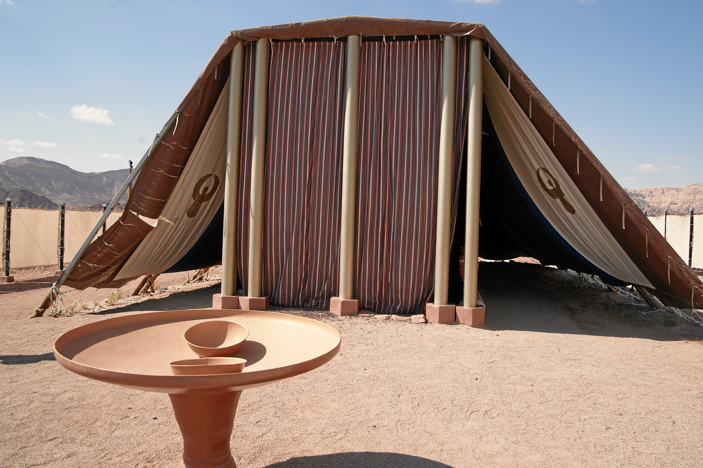

# Human-made Things in the Bible

## License Information

Human-made Things in the Bible © United Bible Societies, 2025. Adapted from: <cite>The Works of Their Hands: Man-made Things in the Bible</cite>, by Ray Pritz © 2009 United Bible Societies. This work is licensed under Creative Commons Attribution-ShareAlike 4.0 International (<a href="https://creativecommons.org/licenses/by-sa/4.0/">https://creativecommons.org/licenses/by-sa/4.0/</a>).

--------------------------------

## 标题：帐幕（Tabernacle） (id: REALIA:3.15.2)

3\.15\.2 标题：帐幕（Tabernacle）
==========================

经文出处
----

Hebrew 来：אֹהֶל, מוֹעֵד (音译：’ohel, ’ohel mo‘ed)

[EXO 26:7](https://ref.ly/Exod26:7), [EXO 26:9](https://ref.ly/Exod26:9), [EXO 26:11](https://ref.ly/Exod26:11), [EXO 26:12](https://ref.ly/Exod26:12), [EXO 26:13](https://ref.ly/Exod26:13), [EXO 26:14](https://ref.ly/Exod26:14), [EXO 26:36](https://ref.ly/Exod26:36), [EXO 27:21](https://ref.ly/Exod27:21), [EXO 28:43](https://ref.ly/Exod28:43), [EXO 29:4](https://ref.ly/Exod29:4), [EXO 29:10](https://ref.ly/Exod29:10), [EXO 29:11](https://ref.ly/Exod29:11), [EXO 29:30](https://ref.ly/Exod29:30), [EXO 29:32](https://ref.ly/Exod29:32), [EXO 29:42](https://ref.ly/Exod29:42), [EXO 29:44](https://ref.ly/Exod29:44), [EXO 30:16](https://ref.ly/Exod30:16), [EXO 30:18](https://ref.ly/Exod30:18), [EXO 30:20](https://ref.ly/Exod30:20), [EXO 30:26](https://ref.ly/Exod30:26), [EXO 30:36](https://ref.ly/Exod30:36), [EXO 31:7](https://ref.ly/Exod31:7), [EXO 31:7](https://ref.ly/Exod31:7), [EXO 33:7](https://ref.ly/Exod33:7), [EXO 33:7](https://ref.ly/Exod33:7), [EXO 33:7](https://ref.ly/Exod33:7), [EXO 33:8](https://ref.ly/Exod33:8), [EXO 33:8](https://ref.ly/Exod33:8), [EXO 33:9](https://ref.ly/Exod33:9), [EXO 33:9](https://ref.ly/Exod33:9), [EXO 33:10](https://ref.ly/Exod33:10), [EXO 33:11](https://ref.ly/Exod33:11), [EXO 35:11](https://ref.ly/Exod35:11), [EXO 35:21](https://ref.ly/Exod35:21), [EXO 36:14](https://ref.ly/Exod36:14), [EXO 36:18](https://ref.ly/Exod36:18), [EXO 36:19](https://ref.ly/Exod36:19), [EXO 36:37](https://ref.ly/Exod36:37), [EXO 38:8](https://ref.ly/Exod38:8), [EXO 38:30](https://ref.ly/Exod38:30), [EXO 39:32](https://ref.ly/Exod39:32), [EXO 39:33](https://ref.ly/Exod39:33), [EXO 39:38](https://ref.ly/Exod39:38), [EXO 39:40](https://ref.ly/Exod39:40), [EXO 40:2](https://ref.ly/Exod40:2), [EXO 40:6](https://ref.ly/Exod40:6), [EXO 40:7](https://ref.ly/Exod40:7), [EXO 40:12](https://ref.ly/Exod40:12), [EXO 40:19](https://ref.ly/Exod40:19), [EXO 40:19](https://ref.ly/Exod40:19), [EXO 40:22](https://ref.ly/Exod40:22), [EXO 40:24](https://ref.ly/Exod40:24), [EXO 40:26](https://ref.ly/Exod40:26), [EXO 40:29](https://ref.ly/Exod40:29), [EXO 40:30](https://ref.ly/Exod40:30), [EXO 40:32](https://ref.ly/Exod40:32), [EXO 40:34](https://ref.ly/Exod40:34), [EXO 40:35](https://ref.ly/Exod40:35), [LEV 1:1](https://ref.ly/Lev1:1), [LEV 1:3](https://ref.ly/Lev1:3), [LEV 1:5](https://ref.ly/Lev1:5), [LEV 3:2](https://ref.ly/Lev3:2), [LEV 3:8](https://ref.ly/Lev3:8), [LEV 3:13](https://ref.ly/Lev3:13), [LEV 4:4](https://ref.ly/Lev4:4), [LEV 4:5](https://ref.ly/Lev4:5), [LEV 4:7](https://ref.ly/Lev4:7), [LEV 4:7](https://ref.ly/Lev4:7), [LEV 4:14](https://ref.ly/Lev4:14), [LEV 4:16](https://ref.ly/Lev4:16), [LEV 4:18](https://ref.ly/Lev4:18), [LEV 4:18](https://ref.ly/Lev4:18), [LEV 6:9](https://ref.ly/Lev6:9), [LEV 6:19](https://ref.ly/Lev6:19), [LEV 6:23](https://ref.ly/Lev6:23), [LEV 8:3](https://ref.ly/Lev8:3), [LEV 8:4](https://ref.ly/Lev8:4), [LEV 8:31](https://ref.ly/Lev8:31), [LEV 8:33](https://ref.ly/Lev8:33), [LEV 8:35](https://ref.ly/Lev8:35), [LEV 9:5](https://ref.ly/Lev9:5), [LEV 9:23](https://ref.ly/Lev9:23), [LEV 10:7](https://ref.ly/Lev10:7), [LEV 10:9](https://ref.ly/Lev10:9), [LEV 12:6](https://ref.ly/Lev12:6), [LEV 14:11](https://ref.ly/Lev14:11), [LEV 14:23](https://ref.ly/Lev14:23), [LEV 15:14](https://ref.ly/Lev15:14), [LEV 15:29](https://ref.ly/Lev15:29), [LEV 16:7](https://ref.ly/Lev16:7), [LEV 16:16](https://ref.ly/Lev16:16), [LEV 16:17](https://ref.ly/Lev16:17), [LEV 16:20](https://ref.ly/Lev16:20), [LEV 16:23](https://ref.ly/Lev16:23), [LEV 16:33](https://ref.ly/Lev16:33), [LEV 17:4](https://ref.ly/Lev17:4), [LEV 17:5](https://ref.ly/Lev17:5), [LEV 17:6](https://ref.ly/Lev17:6), [LEV 17:9](https://ref.ly/Lev17:9), [LEV 19:21](https://ref.ly/Lev19:21), [LEV 24:3](https://ref.ly/Lev24:3), [NUM 1:1](https://ref.ly/Num1:1), [NUM 2:2](https://ref.ly/Num2:2), [NUM 2:17](https://ref.ly/Num2:17), [NUM 3:7](https://ref.ly/Num3:7), [NUM 3:8](https://ref.ly/Num3:8), [NUM 3:25](https://ref.ly/Num3:25), [NUM 3:25](https://ref.ly/Num3:25), [NUM 3:25](https://ref.ly/Num3:25), [NUM 3:38](https://ref.ly/Num3:38), [NUM 4:3](https://ref.ly/Num4:3), [NUM 4:4](https://ref.ly/Num4:4), [NUM 4:15](https://ref.ly/Num4:15), [NUM 4:23](https://ref.ly/Num4:23), [NUM 4:25](https://ref.ly/Num4:25), [NUM 4:25](https://ref.ly/Num4:25), [NUM 4:28](https://ref.ly/Num4:28), [NUM 4:30](https://ref.ly/Num4:30), [NUM 4:31](https://ref.ly/Num4:31), [NUM 4:33](https://ref.ly/Num4:33), [NUM 4:35](https://ref.ly/Num4:35), [NUM 4:37](https://ref.ly/Num4:37), [NUM 4:39](https://ref.ly/Num4:39), [NUM 4:41](https://ref.ly/Num4:41), [NUM 4:43](https://ref.ly/Num4:43), [NUM 4:47](https://ref.ly/Num4:47), [NUM 6:10](https://ref.ly/Num6:10), [NUM 6:13](https://ref.ly/Num6:13), [NUM 6:18](https://ref.ly/Num6:18), [NUM 7:5](https://ref.ly/Num7:5), [NUM 7:89](https://ref.ly/Num7:89), [NUM 8:9](https://ref.ly/Num8:9), [NUM 8:15](https://ref.ly/Num8:15), [NUM 8:19](https://ref.ly/Num8:19), [NUM 8:22](https://ref.ly/Num8:22), [NUM 8:24](https://ref.ly/Num8:24), [NUM 8:26](https://ref.ly/Num8:26), [NUM 9:15](https://ref.ly/Num9:15), [NUM 9:17](https://ref.ly/Num9:17), [NUM 10:3](https://ref.ly/Num10:3), [NUM 11:16](https://ref.ly/Num11:16), [NUM 11:24](https://ref.ly/Num11:24), [NUM 11:26](https://ref.ly/Num11:26), [NUM 12:4](https://ref.ly/Num12:4), [NUM 12:5](https://ref.ly/Num12:5), [NUM 12:10](https://ref.ly/Num12:10), [NUM 14:10](https://ref.ly/Num14:10), [NUM 16:18](https://ref.ly/Num16:18), [NUM 16:19](https://ref.ly/Num16:19), [NUM 17:7](https://ref.ly/Num17:7), [NUM 17:8](https://ref.ly/Num17:8), [NUM 17:15](https://ref.ly/Num17:15), [NUM 17:19](https://ref.ly/Num17:19), [NUM 17:22](https://ref.ly/Num17:22), [NUM 17:23](https://ref.ly/Num17:23), [NUM 18:2](https://ref.ly/Num18:2), [NUM 18:3](https://ref.ly/Num18:3), [NUM 18:4](https://ref.ly/Num18:4), [NUM 18:4](https://ref.ly/Num18:4), [NUM 18:6](https://ref.ly/Num18:6), [NUM 18:21](https://ref.ly/Num18:21), [NUM 18:22](https://ref.ly/Num18:22), [NUM 18:23](https://ref.ly/Num18:23), [NUM 18:31](https://ref.ly/Num18:31), [NUM 19:4](https://ref.ly/Num19:4), [NUM 20:6](https://ref.ly/Num20:6), [NUM 25:6](https://ref.ly/Num25:6), [NUM 27:2](https://ref.ly/Num27:2), [NUM 31:54](https://ref.ly/Num31:54), [DEU 31:14](https://ref.ly/Deut31:14), [DEU 31:14](https://ref.ly/Deut31:14), [DEU 31:15](https://ref.ly/Deut31:15), [DEU 31:15](https://ref.ly/Deut31:15), [JOS 18:1](https://ref.ly/Josh18:1), [JOS 19:51](https://ref.ly/Josh19:51), [1SA 2:22](https://ref.ly/1Sam2:22), [2SA 6:17](https://ref.ly/2Sam6:17), [2SA 7:6](https://ref.ly/2Sam7:6), [1KI 1:39](https://ref.ly/1Kgs1:39), [1KI 2:28](https://ref.ly/1Kgs2:28), [1KI 2:29](https://ref.ly/1Kgs2:29), [1KI 2:30](https://ref.ly/1Kgs2:30), [1KI 8:4](https://ref.ly/1Kgs8:4), [1KI 8:4](https://ref.ly/1Kgs8:4), [1CH 6:17](https://ref.ly/1Chr6:17), [1CH 9:19](https://ref.ly/1Chr9:19), [1CH 9:21](https://ref.ly/1Chr9:21), [1CH 9:23](https://ref.ly/1Chr9:23), [1CH 17:5](https://ref.ly/1Chr17:5), [1CH 17:5](https://ref.ly/1Chr17:5), [1CH 23:32](https://ref.ly/1Chr23:32), [2CH 1:3](https://ref.ly/2Chr1:3), [2CH 1:6](https://ref.ly/2Chr1:6), [2CH 1:13](https://ref.ly/2Chr1:13), [2CH 5:5](https://ref.ly/2Chr5:5), [2CH 5:5](https://ref.ly/2Chr5:5), [2CH 24:6](https://ref.ly/2Chr24:6), [PSA 27:6](https://ref.ly/Ps27:6), [PSA 78:60](https://ref.ly/Ps78:60)

Hebrew 来：הֵיכָל (音译：heykal)

[1SA 1:9](https://ref.ly/1Sam1:9), [1SA 3:3](https://ref.ly/1Sam3:3)

Hebrew 来：מִשְׁכָּן (音译：mishkan)

[EXO 25:9](https://ref.ly/Exod25:9), [EXO 26:1](https://ref.ly/Exod26:1), [EXO 26:6](https://ref.ly/Exod26:6), [EXO 26:7](https://ref.ly/Exod26:7), [EXO 26:12](https://ref.ly/Exod26:12), [EXO 26:13](https://ref.ly/Exod26:13), [EXO 26:15](https://ref.ly/Exod26:15), [EXO 26:17](https://ref.ly/Exod26:17), [EXO 26:18](https://ref.ly/Exod26:18), [EXO 26:20](https://ref.ly/Exod26:20), [EXO 26:22](https://ref.ly/Exod26:22), [EXO 26:23](https://ref.ly/Exod26:23), [EXO 26:26](https://ref.ly/Exod26:26), [EXO 26:27](https://ref.ly/Exod26:27), [EXO 26:27](https://ref.ly/Exod26:27), [EXO 26:30](https://ref.ly/Exod26:30), [EXO 26:35](https://ref.ly/Exod26:35), [EXO 27:9](https://ref.ly/Exod27:9), [EXO 27:19](https://ref.ly/Exod27:19), [EXO 35:11](https://ref.ly/Exod35:11), [EXO 35:15](https://ref.ly/Exod35:15), [EXO 35:18](https://ref.ly/Exod35:18), [EXO 36:8](https://ref.ly/Exod36:8), [EXO 36:13](https://ref.ly/Exod36:13), [EXO 36:14](https://ref.ly/Exod36:14), [EXO 36:20](https://ref.ly/Exod36:20), [EXO 36:22](https://ref.ly/Exod36:22), [EXO 36:23](https://ref.ly/Exod36:23), [EXO 36:25](https://ref.ly/Exod36:25), [EXO 36:27](https://ref.ly/Exod36:27), [EXO 36:28](https://ref.ly/Exod36:28), [EXO 36:31](https://ref.ly/Exod36:31), [EXO 36:32](https://ref.ly/Exod36:32), [EXO 36:32](https://ref.ly/Exod36:32), [EXO 38:20](https://ref.ly/Exod38:20), [EXO 38:21](https://ref.ly/Exod38:21), [EXO 38:21](https://ref.ly/Exod38:21), [EXO 38:31](https://ref.ly/Exod38:31), [EXO 39:32](https://ref.ly/Exod39:32), [EXO 39:33](https://ref.ly/Exod39:33), [EXO 39:40](https://ref.ly/Exod39:40), [EXO 40:2](https://ref.ly/Exod40:2), [EXO 40:5](https://ref.ly/Exod40:5), [EXO 40:6](https://ref.ly/Exod40:6), [EXO 40:9](https://ref.ly/Exod40:9), [EXO 40:17](https://ref.ly/Exod40:17), [EXO 40:18](https://ref.ly/Exod40:18), [EXO 40:19](https://ref.ly/Exod40:19), [EXO 40:21](https://ref.ly/Exod40:21), [EXO 40:22](https://ref.ly/Exod40:22), [EXO 40:24](https://ref.ly/Exod40:24), [EXO 40:28](https://ref.ly/Exod40:28), [EXO 40:29](https://ref.ly/Exod40:29), [EXO 40:33](https://ref.ly/Exod40:33), [EXO 40:34](https://ref.ly/Exod40:34), [EXO 40:35](https://ref.ly/Exod40:35), [EXO 40:36](https://ref.ly/Exod40:36), [EXO 40:38](https://ref.ly/Exod40:38), [LEV 8:10](https://ref.ly/Lev8:10), [LEV 15:31](https://ref.ly/Lev15:31), [LEV 17:4](https://ref.ly/Lev17:4), [NUM 1:50](https://ref.ly/Num1:50), [NUM 1:50](https://ref.ly/Num1:50), [NUM 1:50](https://ref.ly/Num1:50), [NUM 1:51](https://ref.ly/Num1:51), [NUM 1:51](https://ref.ly/Num1:51), [NUM 1:53](https://ref.ly/Num1:53), [NUM 1:53](https://ref.ly/Num1:53), [NUM 3:7](https://ref.ly/Num3:7), [NUM 3:8](https://ref.ly/Num3:8), [NUM 3:23](https://ref.ly/Num3:23), [NUM 3:25](https://ref.ly/Num3:25), [NUM 3:26](https://ref.ly/Num3:26), [NUM 3:29](https://ref.ly/Num3:29), [NUM 3:35](https://ref.ly/Num3:35), [NUM 3:36](https://ref.ly/Num3:36), [NUM 3:38](https://ref.ly/Num3:38), [NUM 4:16](https://ref.ly/Num4:16), [NUM 4:25](https://ref.ly/Num4:25), [NUM 4:26](https://ref.ly/Num4:26), [NUM 4:31](https://ref.ly/Num4:31), [NUM 5:17](https://ref.ly/Num5:17), [NUM 7:1](https://ref.ly/Num7:1), [NUM 7:3](https://ref.ly/Num7:3), [NUM 9:15](https://ref.ly/Num9:15), [NUM 9:15](https://ref.ly/Num9:15), [NUM 9:15](https://ref.ly/Num9:15), [NUM 9:18](https://ref.ly/Num9:18), [NUM 9:19](https://ref.ly/Num9:19), [NUM 9:20](https://ref.ly/Num9:20), [NUM 9:22](https://ref.ly/Num9:22), [NUM 10:11](https://ref.ly/Num10:11), [NUM 10:17](https://ref.ly/Num10:17), [NUM 10:17](https://ref.ly/Num10:17), [NUM 10:21](https://ref.ly/Num10:21), [NUM 16:9](https://ref.ly/Num16:9), [NUM 17:28](https://ref.ly/Num17:28), [NUM 19:13](https://ref.ly/Num19:13), [NUM 31:30](https://ref.ly/Num31:30), [NUM 31:47](https://ref.ly/Num31:47), [JOS 22:19](https://ref.ly/Josh22:19), [JOS 22:29](https://ref.ly/Josh22:29), [1CH 6:17](https://ref.ly/1Chr6:17), [1CH 6:33](https://ref.ly/1Chr6:33), [1CH 16:39](https://ref.ly/1Chr16:39), [1CH 21:29](https://ref.ly/1Chr21:29), [1CH 23:26](https://ref.ly/1Chr23:26), [2CH 1:5](https://ref.ly/2Chr1:5), [PSA 26:8](https://ref.ly/Ps26:8), [PSA 74:7](https://ref.ly/Ps74:7), [PSA 78:60](https://ref.ly/Ps78:60), [EZK 37:27](https://ref.ly/Ezek37:27)

Hebrew 来：מִקְדָּשׁ (音译：miqdash)

[EXO 15:17](https://ref.ly/Exod15:17), [EXO 25:8](https://ref.ly/Exod25:8), [LEV 12:4](https://ref.ly/Lev12:4), [LEV 19:30](https://ref.ly/Lev19:30), [LEV 20:3](https://ref.ly/Lev20:3), [LEV 26:2](https://ref.ly/Lev26:2), [LEV 21:12](https://ref.ly/Lev21:12), [LEV 21:12](https://ref.ly/Lev21:12), [LEV 21:23](https://ref.ly/Lev21:23), [NUM 3:38](https://ref.ly/Num3:38), [NUM 10:21](https://ref.ly/Num10:21), [NUM 18:1](https://ref.ly/Num18:1), [NUM 18:29](https://ref.ly/Num18:29), [NUM 19:20](https://ref.ly/Num19:20), [JOS 24:26](https://ref.ly/Josh24:26)

Hebrew 来：קֹדֶשׁ (音译：qodesh)

[EXO 36:1](https://ref.ly/Exod36:1), [EXO 36:4](https://ref.ly/Exod36:4), [EXO 36:6](https://ref.ly/Exod36:6), [EXO 38:24](https://ref.ly/Exod38:24), [EXO 38:24](https://ref.ly/Exod38:24), [EXO 38:27](https://ref.ly/Exod38:27), [LEV 10:4](https://ref.ly/Lev10:4), [NUM 3:28](https://ref.ly/Num3:28), [NUM 3:31](https://ref.ly/Num3:31), [NUM 3:32](https://ref.ly/Num3:32), [NUM 4:12](https://ref.ly/Num4:12), [NUM 4:15](https://ref.ly/Num4:15), [NUM 4:15](https://ref.ly/Num4:15), [NUM 4:15](https://ref.ly/Num4:15), [NUM 4:16](https://ref.ly/Num4:16), [NUM 8:19](https://ref.ly/Num8:19), [NUM 18:3](https://ref.ly/Num18:3), [NUM 18:5](https://ref.ly/Num18:5)

Greek 希：ἅγιος (音译：hagia, hagion)

[HEB 8:2](https://ref.ly/Heb8:2), [HEB 9:1](https://ref.ly/Heb9:1), [HEB 9:8](https://ref.ly/Heb9:8)

Greek 希：σκηνή (音译：skēnē)

[ACT 7:44](https://ref.ly/Acts7:44), [HEB 8:2](https://ref.ly/Heb8:2), [HEB 8:5](https://ref.ly/Heb8:5), [HEB 9:8](https://ref.ly/Heb9:8), [HEB 9:11](https://ref.ly/Heb9:11), [HEB 9:21](https://ref.ly/Heb9:21), [HEB 13:10](https://ref.ly/Heb13:10), [REV 15:5](https://ref.ly/Rev15:5), [WIS 9:8](https://ref.ly/Wis9:8), [SIR 24:10](https://ref.ly/Sir24:10), [SIR 24:15](https://ref.ly/Sir24:15), [2MA 2:4](https://ref.ly/2Macc2:4), [2MA 2:5](https://ref.ly/2Macc2:5)

描述和用途
-----

*在旷野漂流时使用的可移动会幕和它的外院（亭纳公园（Timnah Park）模型） (© Ruk7, CC BY\-SA 3\.0, via Wikimedia Commons)*

帐幕是一个相对较大的帐棚，周围有一个封闭的庭院；帐幕是圣殿建成之前，以色列人的敬拜中心。

---

翻译
--

*可移动会幕的模型（亭纳公园（Timnah Park）） (© Mboesch, CC BY\-SA 4\.0, via Wikimedia Commons)*

在不同的语境中，上面列出的希伯来文和希腊文词语的含义也可能有所不同。翻译者要特别注意语境，因为语境通常会表明词语所要表达的意思。例如，希伯来文*mishkan* 既可以指整个帐幕（即帐幕和院子；[EXO 25:8](https://ref.ly/Exod25:8) ），也可以指帐幕本身，即位于院子里面，包括了圣所和至圣所的帐幕（[EXO 26:1](https://ref.ly/Exod26:1) ）。同样地，希伯来文*miqdash* 有时指圣所（[LEV 20:3](https://ref.ly/Lev20:3) ），有时是指至圣所（[LEV 16:33](https://ref.ly/Lev16:33) ），有时指的是帐幕加上院子的整体结构（[EXO 25:8](https://ref.ly/Exod25:8) ）。

希伯来文*’ohel* 的意思是“帐棚”（参[3\.2 帐棚 (tent)\<REALIA:3\.2\>](#) ），可以指帐幕本身（[EXO 26:36](https://ref.ly/Exod26:36) ），或者指会幕，如上文所述（参[3\.15 会幕和帐幕 (Tent of Meeting and Tabernacle)\<REALIA:3\.15\>](#) ）。

在有些语言中，“帐幕”可以译为“上帝居住的最大的帐棚”、“用来敬拜上帝的大帐棚”，或“圣洁的帐棚”。在选择合适的名称时，重要的是要表明帐幕的功能在本质上与圣殿相同；两者只有结构上的不同，并没有用途或宗教意义上的不同。参[3\.14\.1 犹太人的圣殿 (Jewish Temple)\<REALIA:3\.14\.1\>](#) 中的讨论。

关于“帐幕”的翻译，奥斯本发表了以下评论：“最近的几个译本没有采用‘帐幕’的传统译法，而直接译为‘居所’。《翻译者的〈旧约〉》（TOT ）使用了‘神龛’一词，这也许更适合用来表示耶和华在旷野的居所。当然，这两个词都可以指一块围地内的帐棚，也可以指包含帐棚在内的整个构筑物。然而，两个术语都含有某种成分，暗示着自身与相对固定的所罗门圣殿有所不同，并且该成分似乎影响了从祭司角度对帐幕的描述。”

[EXO 39:32](https://ref.ly/Exod39:32); [EXO 40:2](https://ref.ly/Exod40:2); [EXO 40:6](https://ref.ly/Exod40:6); [EXO 40:29](https://ref.ly/Exod40:29) ；[1CH 6:17](https://ref.ly/1Chr6:17) （《和》6:32）：这些经文中的希伯来文结合了*mishkan* 和*’ohel mo‘ed* 两个词语，RSV (Revised Standard Version (1952)) 译为“the tabernacle of the tent of meeting”（“会幕的帐幕”）。[EXO 40:0](https://ref.ly/Exod40:0) 三次提到这个词组，其中*mishkan* 可能是指院子里面由支架（竖板）和四层罩棚组成的帐棚，而*’ohel mo‘ed* 则是指帐幕和院子的整体。在[EXO 39:32](https://ref.ly/Exod39:32) 中，这两个词语指的是同一个事物，其中第二个词语解释了第一个词语。在这节经文中，GNT (Good News Translation (1992)) 只用了一个表达来翻译两个术语：“the Tent of the LORD’s presence”（“耶和华临在的帐棚”）。NIV (New International Version (1984)) 的译法更好，作“the tabernacle, the Tent of Meeting”（“帐幕，就是会幕”）。另一种表达方式是“神圣的帐棚，人们与上帝相会的地方”。

[HEB 8:2](https://ref.ly/Heb8:2); [HEB 9:11](https://ref.ly/Heb9:11); [REV 15:5](https://ref.ly/Rev15:5) ：这些经文都用同一个希腊文*skēnē* 来指称神圣的帐棚，该词指的是在旷野中的帐棚（如[HEB 8:5](https://ref.ly/Heb8:5) ）。然而，这几处经文说的是属天或属灵意义上的帐幕（实际上，这才是地上实体帐幕的本物）。不管是指实体帐幕还是它属天的对应物，翻译者应尽可能使用同一个词来翻译*skēnē* 。

以下内容节选自《〈启示录〉手册》（*A Handbook on The Revelation to John* ，第226—227页）关于[REV 15:5](https://ref.ly/Rev15:5) 的注释：关于“作证的帐棚的殿”（“the temple of the tent of witness”；RSV (Revised Standard Version (1952)) ／NRSV (New Revised Standard Version (1989)) ）这个复合属格短语的含意，还有一些不太确定的地方。这个短语的字面意思相当模糊，一般的读者可能会把它理解为：在作证的帐棚中有一个殿。这个短语有三种可能的意思：（1）“作证的帐棚”和“殿”指的是同一个事物，因此可以译为“殿，即作证的帐棚”（如AT (American Translation (Goodspeed, 1935)) 、NJB (New Jerusalem Bible (1985)) 、SPCL (Spanish Common Language Version (Dios Habla Hoy)) 、NIV (New International Version (1984)) ）；（2）“殿中的作证帐棚”（如GNT (Good News Translation (1992)) 、FRCL (French Common Language Version (Bible en français courant)) 、巴西文通俗译本）；（3）“作证帐棚中的圣所”（如TNT 、REB (Revised English Bible (1989)) 、巴克利、菲利普斯）。最后一种解释（也是我们推荐的解释）的支持理由是：译作“殿”的希腊文*naos* 是一个专门词语，特指圣殿内部的圣所，而不是圣殿内较大的敬拜区域（希腊文*hieron* ）。圣殿内部的圣所（存放约柜的地方）与敬拜区域之间，有一块厚重的幔子隔开；敬拜区域内有香坛和每天奉献供饼给上帝的桌子。这也是帐幕的设计（参[EXO 40:1](https://ref.ly/Exod40:1) —[EXO 40:33](https://ref.ly/Exod40:33) ）。因此，在这里最好译为：“在作证的帐棚中的圣所（或至圣所）”，或“在帐幕中的圣所（或至圣所）”。在这里和[ACT 7:44](https://ref.ly/Acts7:44) 中，应使用旧约中最常用来指称帐幕的译名。

* **Associated Passages:** 出埃及记 26:7; 出埃及记 26:9; 出埃及记 26:11; 出埃及记 26:12; 出埃及记 26:13; 出埃及记 26:14; 出埃及记 26:36; 出埃及记 27:21; 出埃及记 28:43; 出埃及记 29:4; 出埃及记 29:10; 出埃及记 29:11; 出埃及记 29:30; 出埃及记 29:32; 出埃及记 29:42; 出埃及记 29:44; 出埃及记 30:16; 出埃及记 30:18; 出埃及记 30:20; 出埃及记 30:26; 出埃及记 30:36; 出埃及记 31:7; 出埃及记 33:7; 出埃及记 33:8; 出埃及记 33:9; 出埃及记 33:10; 出埃及记 33:11; 出埃及记 35:11; 出埃及记 35:21; 出埃及记 36:14; 出埃及记 36:18; 出埃及记 36:19; 出埃及记 36:37; 出埃及记 38:8; 出埃及记 38:30; 出埃及记 39:32; 出埃及记 39:33; 出埃及记 39:38; 出埃及记 39:40; 出埃及记 40:2; 出埃及记 40:6; 出埃及记 40:7; 出埃及记 40:12; 出埃及记 40:19; 出埃及记 40:22; 出埃及记 40:24; 出埃及记 40:26; 出埃及记 40:29; 出埃及记 40:30; 出埃及记 40:32; 出埃及记 40:34; 出埃及记 40:35; 利未记 1:1; 利未记 1:3; 利未记 1:5; 利未记 3:2; 利未记 3:8; 利未记 3:13; 利未记 4:4; 利未记 4:5; 利未记 4:7; 利未记 4:14; 利未记 4:16; 利未记 4:18; 利未记 6:9; 利未记 6:19; 利未记 6:23; 利未记 8:3; 利未记 8:4; 利未记 8:31; 利未记 8:33; 利未记 8:35; 利未记 9:5; 利未记 9:23; 利未记 10:7; 利未记 10:9; 利未记 12:6; 利未记 14:11; 利未记 14:23; 利未记 15:14; 利未记 15:29; 利未记 16:7; 利未记 16:16; 利未记 16:17; 利未记 16:20; 利未记 16:23; 利未记 16:33; 利未记 17:4; 利未记 17:5; 利未记 17:6; 利未记 17:9; 利未记 19:21; 利未记 24:3; 民数记 1:1; 民数记 2:2; 民数记 2:17; 民数记 3:7; 民数记 3:8; 民数记 3:25; 民数记 3:38; 民数记 4:3; 民数记 4:4; 民数记 4:15; 民数记 4:23; 民数记 4:25; 民数记 4:28; 民数记 4:30; 民数记 4:31; 民数记 4:33; 民数记 4:35; 民数记 4:37; 民数记 4:39; 民数记 4:41; 民数记 4:43; 民数记 4:47; 民数记 6:10; 民数记 6:13; 民数记 6:18; 民数记 7:5; 民数记 7:89; 民数记 8:9; 民数记 8:15; 民数记 8:19; 民数记 8:22; 民数记 8:24; 民数记 8:26; 民数记 9:15; 民数记 9:17; 民数记 10:3; 民数记 11:16; 民数记 11:24; 民数记 11:26; 民数记 12:4; 民数记 12:5; 民数记 12:10; 民数记 14:10; 民数记 16:18; 民数记 16:19; 民数记 17:7; 民数记 17:8; 民数记 17:15; 民数记 17:19; 民数记 17:22; 民数记 17:23; 民数记 18:2; 民数记 18:3; 民数记 18:4; 民数记 18:6; 民数记 18:21; 民数记 18:22; 民数记 18:23; 民数记 18:31; 民数记 19:4; 民数记 20:6; 民数记 25:6; 民数记 27:2; 民数记 31:54; 申命记 31:14; 申命记 31:15; 约书亚记 18:1; 约书亚记 19:51; 撒母耳记上 2:22; 撒母耳记下 6:17; 撒母耳记下 7:6; 列王纪上 1:39; 列王纪上 2:28; 列王纪上 2:29; 列王纪上 2:30; 列王纪上 8:4; 历代志上 6:17; 历代志上 9:19; 历代志上 9:21; 历代志上 9:23; 历代志上 17:5; 历代志上 23:32; 历代志下 1:3; 历代志下 1:6; 历代志下 1:13; 历代志下 5:5; 历代志下 24:6; 诗篇 27:6; 诗篇 78:60; 撒母耳记上 1:9; 撒母耳记上 3:3; 出埃及记 25:9; 出埃及记 26:1; 出埃及记 26:6; 出埃及记 26:15; 出埃及记 26:17; 出埃及记 26:18; 出埃及记 26:20; 出埃及记 26:22; 出埃及记 26:23; 出埃及记 26:26; 出埃及记 26:27; 出埃及记 26:30; 出埃及记 26:35; 出埃及记 27:9; 出埃及记 27:19; 出埃及记 35:15; 出埃及记 35:18; 出埃及记 36:8; 出埃及记 36:13; 出埃及记 36:20; 出埃及记 36:22; 出埃及记 36:23; 出埃及记 36:25; 出埃及记 36:27; 出埃及记 36:28; 出埃及记 36:31; 出埃及记 36:32; 出埃及记 38:20; 出埃及记 38:21; 出埃及记 38:31; 出埃及记 40:5; 出埃及记 40:9; 出埃及记 40:17; 出埃及记 40:18; 出埃及记 40:21; 出埃及记 40:28; 出埃及记 40:33; 出埃及记 40:36; 出埃及记 40:38; 利未记 8:10; 利未记 15:31; 民数记 1:50; 民数记 1:51; 民数记 1:53; 民数记 3:23; 民数记 3:26; 民数记 3:29; 民数记 3:35; 民数记 3:36; 民数记 4:16; 民数记 4:26; 民数记 5:17; 民数记 7:1; 民数记 7:3; 民数记 9:18; 民数记 9:19; 民数记 9:20; 民数记 9:22; 民数记 10:11; 民数记 10:17; 民数记 10:21; 民数记 16:9; 民数记 17:28; 民数记 19:13; 民数记 31:30; 民数记 31:47; 约书亚记 22:19; 约书亚记 22:29; 历代志上 6:33; 历代志上 16:39; 历代志上 21:29; 历代志上 23:26; 历代志下 1:5; 诗篇 26:8; 诗篇 74:7; 以西结书 37:27; 出埃及记 15:17; 出埃及记 25:8; 利未记 12:4; 利未记 19:30; 利未记 20:3; 利未记 26:2; 利未记 21:12; 利未记 21:23; 民数记 18:1; 民数记 18:29; 民数记 19:20; 约书亚记 24:26; 出埃及记 36:1; 出埃及记 36:4; 出埃及记 36:6; 出埃及记 38:24; 出埃及记 38:27; 利未记 10:4; 民数记 3:28; 民数记 3:31; 民数记 3:32; 民数记 4:12; 民数记 18:5; 希伯来书 8:2; 希伯来书 9:1; 希伯来书 9:8; 使徒行传 7:44; 希伯来书 8:5; 希伯来书 9:11; 希伯来书 9:21; 希伯来书 13:10; 启示录 15:5; 智慧篇 9:8; 德训篇 24:10; 德训篇 24:15; 玛加伯下 2:4; 玛加伯下 2:5; 出埃及记 40:0; 出埃及记 40:1

