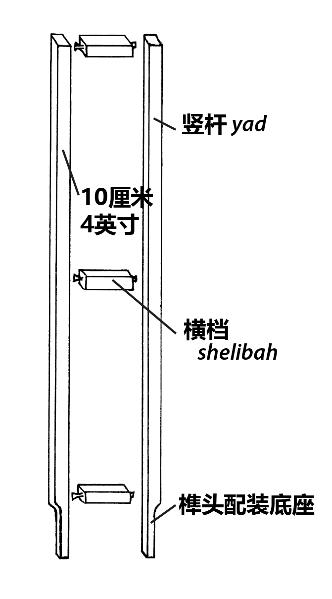
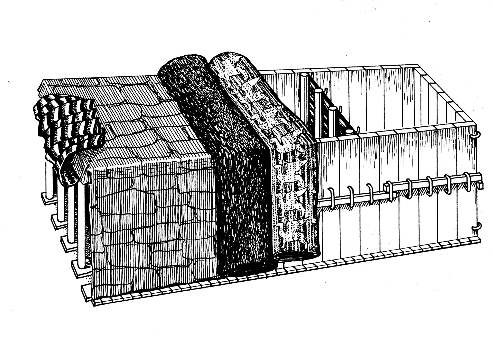
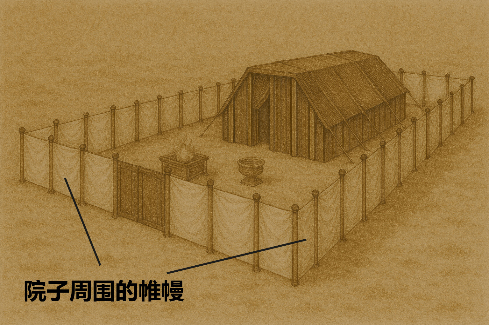

# Human-made Things in the Bible

## License Information

Human-made Things in the Bible © United Bible Societies, 2025. Adapted from: <cite>The Works of Their Hands: Man-made Things in the Bible</cite>, by Ray Pritz © 2009 United Bible Societies. This work is licensed under Creative Commons Attribution-ShareAlike 4.0 International (<a href="https://creativecommons.org/licenses/by-sa/4.0/">https://creativecommons.org/licenses/by-sa/4.0/</a>).

--------------------------------

## 标题：帐幕的结构（Tabernacle construction） (id: REALIA:3.15.2.3)

3\.15\.2\.3 标题：帐幕的结构（Tabernacle construction）
=============================================

人们对于帐幕结构的描述有很大的差异。和沙漠游牧民族的住所一样，帐幕是一个临时的构筑物，易于拆装和运输。要确定描述帐幕结构的许多词语的确切含义，这是很困难的。下面的一般性描述反映了大多数学者的观点，但应该足以帮助翻译者完成翻译工作。我们将分别描述帐幕的各个部分。

完整的帐幕由两个主要构筑物组成。帐幕有一道用柱子和帷幔做成的外围墙，就是院子的边界。通过外围墙东面的一个开口，可以进到院子里面。希伯来文*mishkan* 有时用来指各个部分所组成的整体。然而，这个词通常指的是第二个构筑物，即位于封闭式建筑里面的大帐棚。我们这里所用的“帐幕”一词指的就是这个构筑物。

基本上，帐幕是一座帐棚，里面有一个框架将其支撑起来。这个框架是由一系列支架（竖板）连接而成的。每个支架由五根金合欢木做成，即两根较长的竖杆分别在顶部、中部和底部附近由横档连接在一起。竖杆的末端延伸到最下面的横档以下。竖杆突出来的这部分称为榫，插入到一个很重的银底座上面对应的卯眼里；银底座的宽度和支架的宽度相同。支架和底座并排放置，形成一面墙。然后，把横木穿过支架上面的三排金环中，这样支架墙就稳固了。帐幕有三面这样的支架墙；帐幕的东面没有墙，而是一个入口，用挂在柱子上的幔子垂下来遮住。

帐幕的顶面和三个侧面覆盖着四层用不同材料做成的罩棚。内层是由绣着基路伯的细麻布做成的幔子（参[1\.5\.3\.7 麻、亚麻、细麻布 (linen)\<REALIA:1\.5\.3\.7\>](#) 和[1\.5\.3\.11 绣花布、刺绣作品 (embroidered cloth, needlework)\<REALIA:1\.5\.3\.11\>](#) ），这层幔子构成帐幕内部的顶棚，另外通过支架的开孔也可以看到。这层幔子翻过支架墙的顶部，从一面墙搭到另一面墙。这样，它就形成了帐幕的顶棚，并从侧面的支架墙上垂下，距离地面约有50厘米（20英寸）。在这层幔子上面，还覆盖有三层罩棚，以保护支架、细麻布幔子，以及帐幕内的物件。虽然外面几层罩棚未经装饰（除了有一块染成红色），看起来并不富丽堂皇，但选择这几种材料是因为它们能够防水，尽管西奈地区的降雨并不多。帐幕顶部铺着四层罩棚，形成了一个平坦、没有斜度的顶棚，因此整个帐幕看上去就像是一个盒子。外面几层罩棚比最里面的细麻布幔子要长，一直垂到地上。帐幕的一个侧面没有盖住，留作入口。

帐幕的许多物件都是根据相同的基本样式做成的。例如，圣所顶部的罩棚是用钩子和环把两块大幔子连在一起做成的。同样，至圣所前面的幔子也是把环缝到幔子上，然后挂到顶棚的钩子上悬垂下来；把院子围起来的幔子（帷幔）和圣所入口的幔子（门帘）也是用同样的方法挂起来的。另外，所有这些幔子都是用同样的方法挂起来的，即立在沉重金属底座上面的木柱子上。翻译者一旦确定了环、钩子、柱子、底座和幔子的用词，就要始终使用相同的词语，以保持一致。

帐幕中有几样物件是用金合欢木（希伯来文*shitah* ）做的。

即使目标语言翻译帐幕的各个部分并不特别困难，我们仍然建议给读者提供一些插图或示意图。

## 标题：支架、竖板、板（frames, boards） (id: REALIA:3.15.2.3.1)

3\.15\.2\.3\.1 标题：支架、竖板、板（frames, boards）
=========================================

经文出处
----

Hebrew 来：קֶרֶשׁ (音译：qeresh)

[EXO 26:15](https://ref.ly/Exod26:15), [EXO 26:16](https://ref.ly/Exod26:16), [EXO 26:16](https://ref.ly/Exod26:16), [EXO 26:17](https://ref.ly/Exod26:17), [EXO 26:17](https://ref.ly/Exod26:17), [EXO 26:18](https://ref.ly/Exod26:18), [EXO 26:18](https://ref.ly/Exod26:18), [EXO 26:19](https://ref.ly/Exod26:19), [EXO 26:19](https://ref.ly/Exod26:19), [EXO 26:19](https://ref.ly/Exod26:19), [EXO 26:20](https://ref.ly/Exod26:20), [EXO 26:21](https://ref.ly/Exod26:21), [EXO 26:21](https://ref.ly/Exod26:21), [EXO 26:22](https://ref.ly/Exod26:22), [EXO 26:23](https://ref.ly/Exod26:23), [EXO 26:25](https://ref.ly/Exod26:25), [EXO 26:25](https://ref.ly/Exod26:25), [EXO 26:25](https://ref.ly/Exod26:25), [EXO 26:26](https://ref.ly/Exod26:26), [EXO 26:27](https://ref.ly/Exod26:27), [EXO 26:27](https://ref.ly/Exod26:27), [EXO 26:28](https://ref.ly/Exod26:28), [EXO 26:29](https://ref.ly/Exod26:29), [EXO 35:11](https://ref.ly/Exod35:11), [EXO 36:20](https://ref.ly/Exod36:20), [EXO 36:21](https://ref.ly/Exod36:21), [EXO 36:21](https://ref.ly/Exod36:21), [EXO 36:22](https://ref.ly/Exod36:22), [EXO 36:22](https://ref.ly/Exod36:22), [EXO 36:23](https://ref.ly/Exod36:23), [EXO 36:23](https://ref.ly/Exod36:23), [EXO 36:24](https://ref.ly/Exod36:24), [EXO 36:24](https://ref.ly/Exod36:24), [EXO 36:24](https://ref.ly/Exod36:24), [EXO 36:25](https://ref.ly/Exod36:25), [EXO 36:26](https://ref.ly/Exod36:26), [EXO 36:26](https://ref.ly/Exod36:26), [EXO 36:27](https://ref.ly/Exod36:27), [EXO 36:28](https://ref.ly/Exod36:28), [EXO 36:30](https://ref.ly/Exod36:30), [EXO 36:30](https://ref.ly/Exod36:30), [EXO 36:31](https://ref.ly/Exod36:31), [EXO 36:32](https://ref.ly/Exod36:32), [EXO 36:32](https://ref.ly/Exod36:32), [EXO 36:33](https://ref.ly/Exod36:33), [EXO 36:34](https://ref.ly/Exod36:34), [EXO 39:33](https://ref.ly/Exod39:33), [EXO 40:18](https://ref.ly/Exod40:18), [NUM 3:36](https://ref.ly/Num3:36), [NUM 4:31](https://ref.ly/Num4:31), [EZK 27:6](https://ref.ly/Ezek27:6)

描述
--

*帐幕的支架和底座 (Howard Hatton in The Bible Translator © United Bible Societies 1991; Ray Pritz)*

传统上，人们认为帐幕的这些构件（“竖板”）是用实心的木料做的。然而，它们更有可能是上面所述的木制支架，这也是现今学者普遍接受的观点。每个支架高5米（16\.5英尺），宽75厘米（30英寸）。帐幕的南北两侧各有20个这样的支架；后面（西边）有6个，加上转角处的2个，这样，后面一共有8个支架（[EXO 26:25](https://ref.ly/Exod26:25) ）。

---

翻译
--

*帐幕支架 (Howard Hatton in The Bible Translator © United Bible Societies 1991\)*

大多数仿建的帐幕都是用实心木材做墙。有些学者甚至认为这些墙有50厘米（20英寸）厚。然而，这似乎不太可能，因为：（1）很难找到这么大的木材；（2）运输这么重的木材很困难。现在普遍接受的一种意见是：希伯来文*qeresh* 一词指的是某种木制的“支架”。这些支架的外部尺寸如经文所述，但是比同样尺寸的实心木材轻，并且使帐幕更凉快，同时还可以让人从内部看到里层带刺绣的罩棚。大多数现代译本的译法都依循这种建议，这也是我们所推荐的。参哈顿（Hatton）题为《帐幕支架上的榫》（“The Projections on the Frames of the Tabernacle”）的文章。哈顿（第209页）把[EXO 26:16](https://ref.ly/Exod26:16); [EXO 26:17](https://ref.ly/Exod26:17); [EXO 26:18](https://ref.ly/Exod26:18); [EXO 26:19](https://ref.ly/Exod26:19) 译为：“16\~每个支架要高十五英尺，宽二十七英寸，17\~两根配对的竖杆由横档连接在一起。所有支架都有这种竖杆。18\~要为南边做二十个支架，19\~又要在支架下面做四十个银底座，每个支架下面各有两个底座来支撑两根竖杆。”

* **Associated Passages:** 出埃及记 26:15; 出埃及记 26:16; 出埃及记 26:17; 出埃及记 26:18; 出埃及记 26:19; 出埃及记 26:20; 出埃及记 26:21; 出埃及记 26:22; 出埃及记 26:23; 出埃及记 26:25; 出埃及记 26:26; 出埃及记 26:27; 出埃及记 26:28; 出埃及记 26:29; 出埃及记 35:11; 出埃及记 36:20; 出埃及记 36:21; 出埃及记 36:22; 出埃及记 36:23; 出埃及记 36:24; 出埃及记 36:25; 出埃及记 36:26; 出埃及记 36:27; 出埃及记 36:28; 出埃及记 36:30; 出埃及记 36:31; 出埃及记 36:32; 出埃及记 36:33; 出埃及记 36:34; 出埃及记 39:33; 出埃及记 40:18; 民数记 3:36; 民数记 4:31; 以西结书 27:6

## 标题：底座、卯眼（base, stand, socket, mortise） (id: REALIA:3.15.2.3.2)

3\.15\.2\.3\.2 标题：底座、卯眼（base, stand, socket, mortise）
=====================================================

经文出处
----

Hebrew 来：אֶדֶן (音译：’eden)

[EXO 26:19](https://ref.ly/Exod26:19), [EXO 26:19](https://ref.ly/Exod26:19), [EXO 26:19](https://ref.ly/Exod26:19), [EXO 26:21](https://ref.ly/Exod26:21), [EXO 26:21](https://ref.ly/Exod26:21), [EXO 26:21](https://ref.ly/Exod26:21), [EXO 26:25](https://ref.ly/Exod26:25), [EXO 26:25](https://ref.ly/Exod26:25), [EXO 26:25](https://ref.ly/Exod26:25), [EXO 26:25](https://ref.ly/Exod26:25), [EXO 26:32](https://ref.ly/Exod26:32), [EXO 26:37](https://ref.ly/Exod26:37), [EXO 27:10](https://ref.ly/Exod27:10), [EXO 27:11](https://ref.ly/Exod27:11), [EXO 27:12](https://ref.ly/Exod27:12), [EXO 27:14](https://ref.ly/Exod27:14), [EXO 27:15](https://ref.ly/Exod27:15), [EXO 27:16](https://ref.ly/Exod27:16), [EXO 27:17](https://ref.ly/Exod27:17), [EXO 27:18](https://ref.ly/Exod27:18), [EXO 35:11](https://ref.ly/Exod35:11), [EXO 35:17](https://ref.ly/Exod35:17), [EXO 36:24](https://ref.ly/Exod36:24), [EXO 36:24](https://ref.ly/Exod36:24), [EXO 36:24](https://ref.ly/Exod36:24), [EXO 36:26](https://ref.ly/Exod36:26), [EXO 36:26](https://ref.ly/Exod36:26), [EXO 36:26](https://ref.ly/Exod36:26), [EXO 36:30](https://ref.ly/Exod36:30), [EXO 36:30](https://ref.ly/Exod36:30), [EXO 36:30](https://ref.ly/Exod36:30), [EXO 36:30](https://ref.ly/Exod36:30), [EXO 36:36](https://ref.ly/Exod36:36), [EXO 36:38](https://ref.ly/Exod36:38), [EXO 38:10](https://ref.ly/Exod38:10), [EXO 38:11](https://ref.ly/Exod38:11), [EXO 38:12](https://ref.ly/Exod38:12), [EXO 38:14](https://ref.ly/Exod38:14), [EXO 38:15](https://ref.ly/Exod38:15), [EXO 38:17](https://ref.ly/Exod38:17), [EXO 38:19](https://ref.ly/Exod38:19), [EXO 38:27](https://ref.ly/Exod38:27), [EXO 38:27](https://ref.ly/Exod38:27), [EXO 38:27](https://ref.ly/Exod38:27), [EXO 38:27](https://ref.ly/Exod38:27), [EXO 38:30](https://ref.ly/Exod38:30), [EXO 38:31](https://ref.ly/Exod38:31), [EXO 38:31](https://ref.ly/Exod38:31), [EXO 39:33](https://ref.ly/Exod39:33), [EXO 39:40](https://ref.ly/Exod39:40), [EXO 40:18](https://ref.ly/Exod40:18), [NUM 3:36](https://ref.ly/Num3:36), [NUM 3:37](https://ref.ly/Num3:37), [NUM 4:31](https://ref.ly/Num4:31), [NUM 4:32](https://ref.ly/Num4:32), [JOB 38:6](https://ref.ly/Job38:6), [SNG 5:15](https://ref.ly/Song5:15)

描述和用途
-----

构成帐幕墙的支架和院子四围的柱子，都是立在有凹槽的金属底座或卯眼上，这样可以使支架和柱子稳固。帐幕支架的底座是银子做的，院子立柱的底座是铜做的。

---

翻译
--

帐幕的南北支架墙各有40个底座（[EXO 26:19](https://ref.ly/Exod26:19); [EXO 26:20](https://ref.ly/Exod26:20); [EXO 26:21](https://ref.ly/Exod26:21) ），这就意味着每个榫头都插入一个卯座，或“每个支架下面有两个底座承接它的两个榫头”（RSV (Revised Standard Version (1952)) 直译）。短句“那个支架下面也有两个底座承接它的两个榫头”（RSV (Revised Standard Version (1952)) 直译）重复出现，意思是说，“每个支架下面都有两个底座来固定支架的两个突出的部分”（GNT (Good News Translation (1992)) 直译）。

* **Associated Passages:** 出埃及记 26:19; 出埃及记 26:21; 出埃及记 26:25; 出埃及记 26:32; 出埃及记 26:37; 出埃及记 27:10; 出埃及记 27:11; 出埃及记 27:12; 出埃及记 27:14; 出埃及记 27:15; 出埃及记 27:16; 出埃及记 27:17; 出埃及记 27:18; 出埃及记 35:11; 出埃及记 35:17; 出埃及记 36:24; 出埃及记 36:26; 出埃及记 36:30; 出埃及记 36:36; 出埃及记 36:38; 出埃及记 38:10; 出埃及记 38:11; 出埃及记 38:12; 出埃及记 38:14; 出埃及记 38:15; 出埃及记 38:17; 出埃及记 38:19; 出埃及记 38:27; 出埃及记 38:30; 出埃及记 38:31; 出埃及记 39:33; 出埃及记 39:40; 出埃及记 40:18; 民数记 3:36; 民数记 3:37; 民数记 4:31; 民数记 4:32; 约伯记 38:6; 雅歌 5:15; 出埃及记 26:20

## 标题：竖杆、榫头、横档（upright beam, tenon, crosspiece, rung） (id: REALIA:3.15.2.3.3)

3\.15\.2\.3\.3 标题：竖杆、榫头、横档（upright beam, tenon, crosspiece, rung）
=================================================================

经文出处
----

### **竖杆** ：

Hebrew 来：יָד (音译：yadoth)

[EXO 26:17](https://ref.ly/Exod26:17), [EXO 26:19](https://ref.ly/Exod26:19), [EXO 26:19](https://ref.ly/Exod26:19), [EXO 36:22](https://ref.ly/Exod36:22), [EXO 36:24](https://ref.ly/Exod36:24), [EXO 36:24](https://ref.ly/Exod36:24)

经文出处
----

### **横档** ：

Hebrew 来：שׁלב (音译：mshulavoth)

[EXO 26:17](https://ref.ly/Exod26:17), [EXO 36:22](https://ref.ly/Exod36:22)

描述
--

每个支架都固定到很重的金属底座上（参[3\.15\.2\.3\.2 底座、卯眼 (base, stand, socket, mortise)\<REALIA:3\.15\.2\.3\.2\>](#) ）。支架由两根木制的竖杆组成，每根竖杆长5米（16\.5英尺）。这些竖杆的顶部、中部和底部附近都有木横档相互联结。每根竖杆都有一小段延伸到最底下的横档以下，就像是支架的支脚。两个支脚（称为榫头）插入金属底座相应的卯眼内。

---

翻译
--

希伯来文*yadoth* 的字面意思是“手”，传统上，在上面列出的经文中，该词被认为是指竖板（支架）侧面的小凸出物，插入到相邻竖板（支架）上的洞里，从而使竖板（支架）墙连在一起并固定住。然而，这种解释有许多困难。更合理的解释是，*yadoth* 指的是较长的、直立的侧板，支架就是用这些侧板做成的。正如上面所述，这些侧板通过横杆或“横档”连接。这些横杆在希伯来文中称为*mshulavoth* 。《〈出埃及记〉手册》（*A Handbook on Exodus* ，第620页）建议[EXO 26:15](https://ref.ly/Exod26:15); [EXO 26:16](https://ref.ly/Exod26:16); [EXO 26:17](https://ref.ly/Exod26:17) 的译文如下：“15\~你要用金合欢木做圣帐棚的竖立支架，16\~每个支架要高十五英尺，宽二十七英寸，17\~两根配对的竖杆通过横杆连在一起。所有的支架都有这些横杆。”

* **Associated Passages:** 出埃及记 26:17; 出埃及记 26:19; 出埃及记 36:22; 出埃及记 36:24; 出埃及记 26:15; 出埃及记 26:16

## 标题：环（ring） (id: REALIA:3.15.2.3.4)

3\.15\.2\.3\.4 标题：环（ring）
=========================

经文出处
----

Hebrew 来：טַבַּעַת (音译：taba‘ath)

[EXO 26:24](https://ref.ly/Exod26:24), [EXO 26:29](https://ref.ly/Exod26:29), [EXO 36:29](https://ref.ly/Exod36:29), [EXO 36:34](https://ref.ly/Exod36:34)

描述和用途
-----

*会幕墙壁上用圆环固定的柱杆 (© Mboesch, CC BY\-SA 4\.0, via Wikimedia Commons)*

帐幕的每个支架上都固定着几个环，将几根水平横木贯穿各个支架上的这些环，就形成一面稳固的支架墙。这些环是用金子做成的。

---

翻译
--

[EXO 26:24](https://ref.ly/Exod26:24) ：“在第一个环子处”（RSV (Revised Standard Version (1952)) 直译）的字面意思是“直到一个（或译：第一个）环子”。也可以译为“到一个环里面”（NIV (New International Version (1984)) 、REB (Revised English Bible (1989)) 直译；德拉姆的译法类似）。或译“一个环子里面”（NJPSV (New Jewish Publication Society Version) 直译）。前面的经文并没有提到框架结构上的环子，但是[EXO 26:29](https://ref.ly/Exod26:29) 提到了金环，这些金环显然是固定在每个支架上面，用来套住横木的。因此，“第一个环子”可能是位于“顶部”的那个环子。出于某些原因，GNT (Good News Translation (1992)) 和CEV (Contemporary English Version) 在第24节中没有提到“环子”，可能是因为在这节经文中提到环子似乎没有意义。然而，如果环子是用来套住横木的（参第29节），那么可以把26:24b译为：“并且（或译：但是）顶部连接在一起，靠近第一个用来套住横木的金环。”

* **Associated Passages:** 出埃及记 26:24; 出埃及记 26:29; 出埃及记 36:29; 出埃及记 36:34

## 标题：横木、杠（bar, pole） (id: REALIA:3.15.2.3.5)

3\.15\.2\.3\.5 标题：横木、杠（bar, pole）
=================================

经文出处
----

Hebrew 来：בְּרִיחַ (音译：briach)

[EXO 26:26](https://ref.ly/Exod26:26), [EXO 26:27](https://ref.ly/Exod26:27), [EXO 26:27](https://ref.ly/Exod26:27), [EXO 26:28](https://ref.ly/Exod26:28), [EXO 26:29](https://ref.ly/Exod26:29), [EXO 26:29](https://ref.ly/Exod26:29), [EXO 35:11](https://ref.ly/Exod35:11), [EXO 36:31](https://ref.ly/Exod36:31), [EXO 36:32](https://ref.ly/Exod36:32), [EXO 36:32](https://ref.ly/Exod36:32), [EXO 36:33](https://ref.ly/Exod36:33), [EXO 36:34](https://ref.ly/Exod36:34), [EXO 36:34](https://ref.ly/Exod36:34), [EXO 39:33](https://ref.ly/Exod39:33), [EXO 39:33](https://ref.ly/Exod39:33), [EXO 40:18](https://ref.ly/Exod40:18), [NUM 3:36](https://ref.ly/Num3:36), [NUM 4:31](https://ref.ly/Num4:31), [DEU 3:5](https://ref.ly/Deut3:5), [JDG 16:3](https://ref.ly/Judg16:3), [1SA 23:7](https://ref.ly/1Sam23:7), [1KI 4:13](https://ref.ly/1Kgs4:13), [2CH 8:5](https://ref.ly/2Chr8:5), [2CH 14:6](https://ref.ly/2Chr14:6), [NEH 3:3](https://ref.ly/Neh3:3), [NEH 3:6](https://ref.ly/Neh3:6), [NEH 3:13](https://ref.ly/Neh3:13), [NEH 3:14](https://ref.ly/Neh3:14), [NEH 3:15](https://ref.ly/Neh3:15), [JOB 38:10](https://ref.ly/Job38:10), [PSA 107:16](https://ref.ly/Ps107:16), [PSA 147:13](https://ref.ly/Ps147:13), [PRO 18:19](https://ref.ly/Prov18:19), [ISA 45:2](https://ref.ly/Isa45:2), [JER 49:31](https://ref.ly/Jer49:31), [JER 51:30](https://ref.ly/Jer51:30), [LAM 2:9](https://ref.ly/Lam2:9), [AMO 1:5](https://ref.ly/Amos1:5), [JON 2:7](https://ref.ly/Jonah2:7), [NAM 3:13](https://ref.ly/Nah3:13)

描述
--

用金合欢木做成的横木或杠穿过固定在支架上的金环。[EXO 26:28](https://ref.ly/Exod26:28) 记载，中间的横木要有帐幕的整面墙那么长，即侧墙30肘（15米或50英尺）和后墙10肘（5米或16\.5英尺），但是经文没有提供这些横木的尺寸。三面墙上各有5根这样的横木（参下面的讨论），用金子包裹。参[3\.15\.2\.3\.4 环 (ring)\<REALIA:3\.15\.2\.3\.4\>](#) 中的插图。

---

翻译
--

[EXO 26:28](https://ref.ly/Exod26:28) 记载，中间的横木或“中心横木”（CEV (Contemporary English Version) 直译）“从一头到另一头”（RSV (Revised Standard Version (1952)) 直译）穿过所有环子。如上所述，这意味着该横木有整面墙那么长。经文没有提到另外四根横木的长度。人们普遍认为支架墙只有三排金环。如果真是这样，那么其他四根横木的长度只有中间横木长度的一半，也就是墙长度的一半。译文可能不会反映这些信息，但建议把它放到脚注或插图中。

* **Associated Passages:** 出埃及记 26:26; 出埃及记 26:27; 出埃及记 26:28; 出埃及记 26:29; 出埃及记 35:11; 出埃及记 36:31; 出埃及记 36:32; 出埃及记 36:33; 出埃及记 36:34; 出埃及记 39:33; 出埃及记 40:18; 民数记 3:36; 民数记 4:31; 申命记 3:5; 士师记 16:3; 撒母耳记上 23:7; 列王纪上 4:13; 历代志下 8:5; 历代志下 14:6; 尼希米记 3:3; 尼希米记 3:6; 尼希米记 3:13; 尼希米记 3:14; 尼希米记 3:15; 约伯记 38:10; 诗篇 107:16; 诗篇 147:13; 箴言 18:19; 以赛亚书 45:2; 耶利米书 49:31; 耶利米书 51:30; 耶利米哀歌 2:9; 阿摩司书 1:5; 约拿书 2:7; 那鸿书 3:13

## 标题：罩棚（coverings） (id: REALIA:3.15.2.3.6)

3\.15\.2\.3\.6 标题：罩棚（coverings）
===============================

*可移动的会幕上的多层覆盖物 (© Deutsche Bibelgesellschaft, Stuttgart by United Bible Societies)*

## 标题：细麻布幔子（linen cloth strips） (id: REALIA:3.15.2.3.6.1)

3\.15\.2\.3\.6\.1 标题：细麻布幔子（linen cloth strips）
==============================================

经文出处
----

Hebrew 来：יְרִיעָה, שֵׁשׁ, שׁזר (音译：yri‘ah (shesh mashzar))

[EXO 26:1](https://ref.ly/Exod26:1), [EXO 26:2](https://ref.ly/Exod26:2), [EXO 26:2](https://ref.ly/Exod26:2), [EXO 26:2](https://ref.ly/Exod26:2), [EXO 26:3](https://ref.ly/Exod26:3), [EXO 26:3](https://ref.ly/Exod26:3), [EXO 26:4](https://ref.ly/Exod26:4), [EXO 26:4](https://ref.ly/Exod26:4), [EXO 26:5](https://ref.ly/Exod26:5), [EXO 26:5](https://ref.ly/Exod26:5), [EXO 26:6](https://ref.ly/Exod26:6), [EXO 36:8](https://ref.ly/Exod36:8), [EXO 36:9](https://ref.ly/Exod36:9), [EXO 36:9](https://ref.ly/Exod36:9), [EXO 36:9](https://ref.ly/Exod36:9), [EXO 36:10](https://ref.ly/Exod36:10), [EXO 36:10](https://ref.ly/Exod36:10), [EXO 36:11](https://ref.ly/Exod36:11), [EXO 36:11](https://ref.ly/Exod36:11), [EXO 36:12](https://ref.ly/Exod36:12), [EXO 36:12](https://ref.ly/Exod36:12), [EXO 36:13](https://ref.ly/Exod36:13), [NUM 4:25](https://ref.ly/Num4:25), [2SA 7:2](https://ref.ly/2Sam7:2), [1CH 17:1](https://ref.ly/1Chr17:1)

描述和用途
-----

*可移动会幕的柱子和覆盖会幕的亚麻布条特写（亭纳公园（Timnah Park）） (© Ori229, CC BY\-SA 3\.0, via Wikimedia Commons)*

以色列人把十幅宽布料连接在一起，形成一片很大的帐棚布或防水布，盖住帐幕的顶、两侧和后侧。上面列出的《出埃及记》经文提供了单幅幔子的尺寸。这些幔子是用细麻布织成的（参[1\.5\.3\.7 麻、亚麻、细麻布 (linen)\<REALIA:1\.5\.3\.7\>](#) ），上面绣着基路伯作装饰（参[4\.1\.2 基路伯、有翅膀的受造物 (winged creatures, cherubim)\<REALIA:4\.1\.2\>](#) ）。把五块这样的幔子连在一起，就形成了一块大布。然后，把两块这样的大布通过一套钩和环（或钮扣和扣眼）在中间连起来，就成为一个完整的大罩棚。

把整块罩棚分成两半的原因可能是为了便于搬运。

---

翻译
--

希伯来文*yri‘ah* 始终指的是制作帐棚所用的织物或材料。帐棚通常是用山羊毛做成的（参[3\.2 帐棚(tent)\<REALIA:3\.2\>](#) ），但是[EXO 26:1](https://ref.ly/Exod26:1) 记载，帐幕的第一层罩棚是用“搓的细麻”（RSV (Revised Standard Version (1952)) 直译）做的，也有译为“捻的细麻”（NRSV (New Revised Standard Version (1989)) 直译），因为希伯来文中的“搓”指的是在纺纱时捻线。

[EXO 26:1](https://ref.ly/Exod26:1) 在描述如何装饰这些幔子时，并没有清楚说明基路伯的图案是在织布时织上去的，还是后来绣在上面的。较早的犹太解经家认为，这些图案是在织布时织出来的（NJPSV (New Jewish Publication Society Version) 英文意为“把基路伯的图案设计织上去”，GW (God's Word Translation) “有创造性地把天使的图案织到布上”）。然而，大多数译本在这里更倾向于译为“绣”（如GNT (Good News Translation (1992)) 、CEV (Contemporary English Version) 、GECL (German Common Language Version (Gute Nachricht Bibel)) ；参[1\.5\.3\.11 绣花布、刺绣作品 (embroidered cloth, needlework)\<REALIA:1\.5\.3\.11\>](#) ）。有些译本的译法既描述了布料上的装饰，又没有提到它是如何出现在布料上的；例如，ITCL (Italian Common Language Version) 译为，“你要用基路伯的图案来装饰它们。”

* **Associated Passages:** 出埃及记 26:1; 出埃及记 26:2; 出埃及记 26:3; 出埃及记 26:4; 出埃及记 26:5; 出埃及记 26:6; 出埃及记 36:8; 出埃及记 36:9; 出埃及记 36:10; 出埃及记 36:11; 出埃及记 36:12; 出埃及记 36:13; 民数记 4:25; 撒母耳记下 7:2; 历代志上 17:1

## 标题：钮环和钩（loops and hooks） (id: REALIA:3.15.2.3.6.2)

3\.15\.2\.3\.6\.2 标题：钮环和钩（loops and hooks）
==========================================

经文出处
----

### **钮环** ：

Hebrew 来：לוּלָאָה (音译：lula’ot)

[EXO 26:4](https://ref.ly/Exod26:4), [EXO 26:5](https://ref.ly/Exod26:5), [EXO 26:5](https://ref.ly/Exod26:5), [EXO 26:5](https://ref.ly/Exod26:5), [EXO 26:10](https://ref.ly/Exod26:10), [EXO 26:10](https://ref.ly/Exod26:10), [EXO 26:11](https://ref.ly/Exod26:11), [EXO 36:11](https://ref.ly/Exod36:11), [EXO 36:12](https://ref.ly/Exod36:12), [EXO 36:12](https://ref.ly/Exod36:12), [EXO 36:12](https://ref.ly/Exod36:12), [EXO 36:17](https://ref.ly/Exod36:17), [EXO 36:17](https://ref.ly/Exod36:17)

经文出处
----

### **钩** ：

Hebrew 来：קֶרֶס (音译：qrasim)

[EXO 26:6](https://ref.ly/Exod26:6), [EXO 26:6](https://ref.ly/Exod26:6), [EXO 26:11](https://ref.ly/Exod26:11), [EXO 26:11](https://ref.ly/Exod26:11), [EXO 26:33](https://ref.ly/Exod26:33), [EXO 35:11](https://ref.ly/Exod35:11), [EXO 36:13](https://ref.ly/Exod36:13), [EXO 36:13](https://ref.ly/Exod36:13), [EXO 36:18](https://ref.ly/Exod36:18), [EXO 39:33](https://ref.ly/Exod39:33)

描述和用途
-----

组成帐幕罩棚的两块大布（参[3\.15\.2\.3\.6\.1 细麻布幔子 (linen cloth strips)\<REALIA:3\.15\.2\.3\.6\.1\>](#) 和[3\.15\.2\.3\.6\.3 山羊毛幔子 (goat hair cloth strips)\<REALIA:3\.15\.2\.3\.6\.3\>](#) ）是用环和钩连接起来的。沿着一块大布的一条边，每隔一段距离缝上一个用绳子做的环。沿着另一块大布的边缘系上金属钩，使钩子的位置正好与第一块布上的环相对应。把钩穿到环里，两块布就成了一块更大的布。细麻布罩棚和山羊毛罩棚都是采用这种做法。

---

翻译
--

“环”的希伯来文指的是用蓝色线做成的U形配对物件，U形的两个末端缝到细麻布幔子的边缘上，留出一个刚好能让金钩穿过的洞。在一些语言中，有必要把[EXO 26:4](https://ref.ly/Exod26:4) 译为“用蓝色布做环，并把它们缝到每套幔子的最外面那幅上”，从而清楚指出“缝”的动作。在一些语言中，“环”应译为“耳朵”或某个类似的物品。

“钩”（“hooks”；GNT (Good News Translation (1992)) 、CEV (Contemporary English Version) ）的希伯来文也可以指“扣环”（“clasps”；RSV (Revised Standard Version (1952)) ）或“按扣”（“fasteners”；REB (Revised English Bible (1989)) ）。这个词语源自意为“弯过来”的动词，故钩子可能是S形的。

* **Associated Passages:** 出埃及记 26:4; 出埃及记 26:5; 出埃及记 26:10; 出埃及记 26:11; 出埃及记 36:11; 出埃及记 36:12; 出埃及记 36:17; 出埃及记 26:6; 出埃及记 26:33; 出埃及记 35:11; 出埃及记 36:13; 出埃及记 36:18; 出埃及记 39:33

## 标题：山羊毛幔子（goat hair cloth strips） (id: REALIA:3.15.2.3.6.3)

3\.15\.2\.3\.6\.3 标题：山羊毛幔子（goat hair cloth strips）
==================================================

经文出处
----

Hebrew 来：יְרִיעָה, עֵז (音译：yri‘ah (‘ez))

[EXO 26:7](https://ref.ly/Exod26:7), [EXO 26:7](https://ref.ly/Exod26:7), [EXO 26:8](https://ref.ly/Exod26:8), [EXO 26:8](https://ref.ly/Exod26:8), [EXO 26:8](https://ref.ly/Exod26:8), [EXO 26:9](https://ref.ly/Exod26:9), [EXO 26:9](https://ref.ly/Exod26:9), [EXO 26:9](https://ref.ly/Exod26:9), [EXO 26:10](https://ref.ly/Exod26:10), [EXO 26:10](https://ref.ly/Exod26:10), [EXO 26:12](https://ref.ly/Exod26:12), [EXO 26:12](https://ref.ly/Exod26:12), [EXO 26:13](https://ref.ly/Exod26:13), [EXO 36:14](https://ref.ly/Exod36:14), [EXO 36:14](https://ref.ly/Exod36:14), [EXO 36:15](https://ref.ly/Exod36:15), [EXO 36:15](https://ref.ly/Exod36:15), [EXO 36:15](https://ref.ly/Exod36:15), [EXO 36:16](https://ref.ly/Exod36:16), [EXO 36:16](https://ref.ly/Exod36:16), [EXO 36:17](https://ref.ly/Exod36:17), [EXO 36:17](https://ref.ly/Exod36:17)

描述
--

参[3\.15\.2\.3\.6\.1 细麻布幔子 (linen cloth strips)\<REALIA:3\.15\.2\.3\.6\.1\>](#) 中关于细麻布幔子的描述。在细麻布罩棚上面还盖着一层用相同的方法做成的山羊毛罩棚。和细麻布罩棚一样，山羊毛罩棚也是把几幅幔子缝在一起做成的。山羊毛罩棚共有11幅幔子，而细麻布罩棚是10幅幔子。

---

翻译
--

[EXO 26:7](https://ref.ly/Exod26:7) 把整个第二层罩棚称为“帐棚”。有些译本按字面译为“帐幕上方的帐棚”（如RSV (Revised Standard Version (1952)) 、NIV (New International Version (1984)) 、REB (Revised English Bible (1989)) ）。这可能会让人误以为：帐幕的顶上立着一个帐棚。翻译者最好参照GNT (Good News Translation (1992)) 来翻译整节经文，比如：“用山羊毛织十一块布做帐棚的覆盖物。”NCV (New Century Version) 的译法也很好，英文意为：“又要用山羊毛织成的十一幅幔子做一个帐棚，来遮盖圣帐棚。”

山羊毛布是中东游牧民族经常用来制作帐棚的材料（参[3\.2 帐棚 (tent)\<REALIA:3\.2\>](#) ）。山羊毛湿了之后会膨胀，布就变得密实，从而阻止水滴渗透。如果当地人们不知道山羊，可能需要译为：“用一种叫做山羊的动物的毛做成的布”，或“用家畜的毛做成的布”。

许多英文译本在上述经文中使用了“curtain”（“幕布、帘”）一词，这有可能会误导读者，因为这些山羊毛幔子是用来遮盖帐幕的顶面和三个侧面的。

* **Associated Passages:** 出埃及记 26:7; 出埃及记 26:8; 出埃及记 26:9; 出埃及记 26:10; 出埃及记 26:12; 出埃及记 26:13; 出埃及记 36:14; 出埃及记 36:15; 出埃及记 36:16; 出埃及记 36:17

## 标题：帐幕的罩棚（outer coverings for the Tabernacle） (id: REALIA:3.15.2.3.6.4)

3\.15\.2\.3\.6\.4 标题：帐幕的罩棚（outer coverings for the Tabernacle）
==============================================================

经文出处
----

Hebrew 来：מִכְסֶה (音译：mikseh)

[EXO 26:14](https://ref.ly/Exod26:14), [EXO 26:14](https://ref.ly/Exod26:14), [EXO 35:11](https://ref.ly/Exod35:11), [EXO 36:19](https://ref.ly/Exod36:19), [EXO 36:19](https://ref.ly/Exod36:19), [EXO 39:34](https://ref.ly/Exod39:34), [EXO 39:34](https://ref.ly/Exod39:34), [EXO 40:19](https://ref.ly/Exod40:19), [NUM 3:25](https://ref.ly/Num3:25), [NUM 4:25](https://ref.ly/Num4:25), [NUM 4:25](https://ref.ly/Num4:25)

描述
--

*外面的罩棚和绳子 (Elbert Boot © United Bible Societies)*

在帐幕里面两层罩棚的上面还有两层。经文只是简单提到外面这两层罩棚，并没有详加描述。我们不确定这两层是仅仅覆盖了帐幕的顶部，还是像山羊毛罩棚那样从侧面垂到地上。这两层罩棚是用两种不同的兽皮做的。第一层是用染红的公羊皮（或鞣制的公羊皮；参[1\.13 皮革 (leather)\<REALIA:1\.13\>](#) ）。第二层是用一种海洋哺乳动物的皮做的。

---

翻译
--

*儒艮（学名Dugong dugon），与海牛同类 (© Julien Willem, CC BY\-SA 3\.0, via Wikimedia Commons)*

[EXO 26:14](https://ref.ly/Exod26:14) ：制作最外层罩棚所用皮革究竟来自哪种哺乳动物，翻译者意见不一。各种译本的译法包括“獾”（“badger”；KJV (King James Version (1611)) ）、“海豹”和“儒艮”（“dugong”；REB (Revised English Bible (1989)) ），或者是范围比较宽泛的“海牛”（“sea cow”；NIV (New International Version (1984)) ）、“海豚”（“dolphin”；NJPSV (New Jewish Publication Society Version) ）、“鼠海豚”（“porpoise”；NEB (New English Bible (1970)) ）和“山羊”（“goat”；RSV (Revised Standard Version (1952)) ）。这些译法大多表明这是一种相当罕见，因而非常特别的皮革。也许因为这个原因，最近的通俗译本趋向于把希伯来文*tachash* 译为“上好的皮革”（如GNT (Good News Translation (1992)) 、CEV (Contemporary English Version) 、NCV (New Century Version) 、NJB (New Jerusalem Bible (1985)) ），而不指明是哪种动物的皮。如果某种语言必须指明皮革来自哪种动物，那么“海牛”或“鼠海豚”是最好的选择。

* **Associated Passages:** 出埃及记 26:14; 出埃及记 35:11; 出埃及记 36:19; 出埃及记 39:34; 出埃及记 40:19; 民数记 3:25; 民数记 4:25

## 标题：帐幕里面和院子周围用来挂幔子的柱子（posts from which curtains were hung in and around the Tabernacle） (id: REALIA:3.15.2.3.7)

3\.15\.2\.3\.7 标题：帐幕里面和院子周围用来挂幔子的柱子（posts from which curtains were hung in and around the Tabernacle）
=====================================================================================================

经文出处
----

Hebrew 来：עַמּוּד (音译：‘amud)

[EXO 13:21](https://ref.ly/Exod13:21), [EXO 13:21](https://ref.ly/Exod13:21), [EXO 13:22](https://ref.ly/Exod13:22), [EXO 13:22](https://ref.ly/Exod13:22), [EXO 14:19](https://ref.ly/Exod14:19), [EXO 14:24](https://ref.ly/Exod14:24), [EXO 26:32](https://ref.ly/Exod26:32), [EXO 26:37](https://ref.ly/Exod26:37), [EXO 27:10](https://ref.ly/Exod27:10), [EXO 27:10](https://ref.ly/Exod27:10), [EXO 27:11](https://ref.ly/Exod27:11), [EXO 27:11](https://ref.ly/Exod27:11), [EXO 27:11](https://ref.ly/Exod27:11), [EXO 27:12](https://ref.ly/Exod27:12), [EXO 27:14](https://ref.ly/Exod27:14), [EXO 27:15](https://ref.ly/Exod27:15), [EXO 27:16](https://ref.ly/Exod27:16), [EXO 27:17](https://ref.ly/Exod27:17), [EXO 33:9](https://ref.ly/Exod33:9), [EXO 33:10](https://ref.ly/Exod33:10), [EXO 35:11](https://ref.ly/Exod35:11), [EXO 35:17](https://ref.ly/Exod35:17), [EXO 36:36](https://ref.ly/Exod36:36), [EXO 36:38](https://ref.ly/Exod36:38), [EXO 38:10](https://ref.ly/Exod38:10), [EXO 38:10](https://ref.ly/Exod38:10), [EXO 38:11](https://ref.ly/Exod38:11), [EXO 38:11](https://ref.ly/Exod38:11), [EXO 38:12](https://ref.ly/Exod38:12), [EXO 38:12](https://ref.ly/Exod38:12), [EXO 38:14](https://ref.ly/Exod38:14), [EXO 38:15](https://ref.ly/Exod38:15), [EXO 38:17](https://ref.ly/Exod38:17), [EXO 38:17](https://ref.ly/Exod38:17), [EXO 38:17](https://ref.ly/Exod38:17), [EXO 38:19](https://ref.ly/Exod38:19), [EXO 38:28](https://ref.ly/Exod38:28), [EXO 39:33](https://ref.ly/Exod39:33), [EXO 39:40](https://ref.ly/Exod39:40), [EXO 40:18](https://ref.ly/Exod40:18), [NUM 3:36](https://ref.ly/Num3:36), [NUM 3:37](https://ref.ly/Num3:37), [NUM 4:31](https://ref.ly/Num4:31), [NUM 4:32](https://ref.ly/Num4:32), [NUM 12:5](https://ref.ly/Num12:5), [NUM 14:14](https://ref.ly/Num14:14), [NUM 14:14](https://ref.ly/Num14:14), [DEU 31:15](https://ref.ly/Deut31:15), [DEU 31:15](https://ref.ly/Deut31:15), [JDG 16:25](https://ref.ly/Judg16:25), [JDG 16:26](https://ref.ly/Judg16:26), [JDG 16:29](https://ref.ly/Judg16:29), [JDG 20:40](https://ref.ly/Judg20:40), [1KI 7:2](https://ref.ly/1Kgs7:2), [1KI 7:2](https://ref.ly/1Kgs7:2), [1KI 7:3](https://ref.ly/1Kgs7:3), [1KI 7:6](https://ref.ly/1Kgs7:6), [1KI 7:2](https://ref.ly/1Kgs7:2), [1KI 7:15](https://ref.ly/1Kgs7:15), [1KI 7:15](https://ref.ly/1Kgs7:15), [1KI 7:15](https://ref.ly/1Kgs7:15), [1KI 7:16](https://ref.ly/1Kgs7:16), [1KI 7:17](https://ref.ly/1Kgs7:17), [1KI 7:18](https://ref.ly/1Kgs7:18), [1KI 7:19](https://ref.ly/1Kgs7:19), [1KI 7:20](https://ref.ly/1Kgs7:20), [1KI 7:21](https://ref.ly/1Kgs7:21), [1KI 7:21](https://ref.ly/1Kgs7:21), [1KI 7:21](https://ref.ly/1Kgs7:21), [1KI 7:22](https://ref.ly/1Kgs7:22), [1KI 7:22](https://ref.ly/1Kgs7:22), [1KI 7:41](https://ref.ly/1Kgs7:41), [1KI 7:41](https://ref.ly/1Kgs7:41), [1KI 7:41](https://ref.ly/1Kgs7:41), [1KI 7:42](https://ref.ly/1Kgs7:42), [2KI 11:14](https://ref.ly/2Kgs11:14), [2KI 23:3](https://ref.ly/2Kgs23:3), [2KI 25:13](https://ref.ly/2Kgs25:13), [2KI 25:16](https://ref.ly/2Kgs25:16), [2KI 25:17](https://ref.ly/2Kgs25:17), [2KI 25:17](https://ref.ly/2Kgs25:17), [1CH 18:8](https://ref.ly/1Chr18:8), [2CH 3:15](https://ref.ly/2Chr3:15), [2CH 3:16](https://ref.ly/2Chr3:16), [2CH 3:17](https://ref.ly/2Chr3:17), [2CH 4:12](https://ref.ly/2Chr4:12), [2CH 4:12](https://ref.ly/2Chr4:12), [2CH 4:12](https://ref.ly/2Chr4:12), [2CH 4:13](https://ref.ly/2Chr4:13), [2CH 23:13](https://ref.ly/2Chr23:13), [NEH 9:12](https://ref.ly/Neh9:12), [NEH 9:12](https://ref.ly/Neh9:12), [NEH 9:19](https://ref.ly/Neh9:19), [NEH 9:19](https://ref.ly/Neh9:19), [EST 1:6](https://ref.ly/Esth1:6), [JOB 9:6](https://ref.ly/Job9:6), [JOB 26:11](https://ref.ly/Job26:11), [PSA 75:4](https://ref.ly/Ps75:4), [PSA 99:7](https://ref.ly/Ps99:7), [PRO 9:1](https://ref.ly/Prov9:1), [SNG 3:10](https://ref.ly/Song3:10), [SNG 5:15](https://ref.ly/Song5:15), [JER 1:18](https://ref.ly/Jer1:18), [JER 27:19](https://ref.ly/Jer27:19), [JER 52:17](https://ref.ly/Jer52:17), [JER 52:20](https://ref.ly/Jer52:20), [JER 52:21](https://ref.ly/Jer52:21), [JER 52:21](https://ref.ly/Jer52:21), [JER 52:22](https://ref.ly/Jer52:22), [EZK 40:49](https://ref.ly/Ezek40:49), [EZK 42:6](https://ref.ly/Ezek42:6), [EZK 42:6](https://ref.ly/Ezek42:6)

描述和用途
-----

*会幕入口处的柱子（亭纳公园（Timnah Park）） (© Mboesch, CC BY\-SA 4\.0, via Wikimedia Commons)*

圣所和至圣所之间有一块垂着的幔子隔开（参[3\.14\.1\.6 幔子、帷幔、帷帐 (curtain, veil, drape)\<REALIA:3\.14\.1\.6\>](#) ）。幔子挂在四根直立的柱子或立杆上，柱子或立杆安在银座上。在幔子的顶部有四个环或扣环。每根柱子的顶部都有一个钩子，幔子上的环正好套在钩子上，从而把幔子挂起来。这些柱子是用金子包裹的，钩子也是用金子做的。

帐幕入口处的门帘以及院子外围的帷幔，都是用同样的方法悬挂起来的。

---

翻译
--

挂幔子和门帘的柱子都是用金合欢木做的（[EXO 26:32](https://ref.ly/Exod26:32); [EXO 26:37](https://ref.ly/Exod26:37) ）。经文没有说明院子周围的柱子是用什么材料做的，但可能也是用木头做的。如果目标语言需要给出所用材料的名称，可以添加此信息。

CEV (Contemporary English Version) 在[EXO 26:32](https://ref.ly/Exod26:32); [EXO 26:33](https://ref.ly/Exod26:33) 中的译法呈现出一幅清晰的画面，英文意为：“用金子包裹四根金合欢木柱子，并把它们分别安到一个银座上。然后把金钩固定在柱子上，好把幔子悬挂起来。”

[EXO 26:32](https://ref.ly/Exod26:32) 和[EXO 26:37](https://ref.ly/Exod26:37) 中相同物件的译词应该保持一致。

* **Associated Passages:** 出埃及记 13:21; 出埃及记 13:22; 出埃及记 14:19; 出埃及记 14:24; 出埃及记 26:32; 出埃及记 26:37; 出埃及记 27:10; 出埃及记 27:11; 出埃及记 27:12; 出埃及记 27:14; 出埃及记 27:15; 出埃及记 27:16; 出埃及记 27:17; 出埃及记 33:9; 出埃及记 33:10; 出埃及记 35:11; 出埃及记 35:17; 出埃及记 36:36; 出埃及记 36:38; 出埃及记 38:10; 出埃及记 38:11; 出埃及记 38:12; 出埃及记 38:14; 出埃及记 38:15; 出埃及记 38:17; 出埃及记 38:19; 出埃及记 38:28; 出埃及记 39:33; 出埃及记 39:40; 出埃及记 40:18; 民数记 3:36; 民数记 3:37; 民数记 4:31; 民数记 4:32; 民数记 12:5; 民数记 14:14; 申命记 31:15; 士师记 16:25; 士师记 16:26; 士师记 16:29; 士师记 20:40; 列王纪上 7:2; 列王纪上 7:3; 列王纪上 7:6; 列王纪上 7:15; 列王纪上 7:16; 列王纪上 7:17; 列王纪上 7:18; 列王纪上 7:19; 列王纪上 7:20; 列王纪上 7:21; 列王纪上 7:22; 列王纪上 7:41; 列王纪上 7:42; 列王纪下 11:14; 列王纪下 23:3; 列王纪下 25:13; 列王纪下 25:16; 列王纪下 25:17; 历代志上 18:8; 历代志下 3:15; 历代志下 3:16; 历代志下 3:17; 历代志下 4:12; 历代志下 4:13; 历代志下 23:13; 尼希米记 9:12; 尼希米记 9:19; 以斯帖记 1:6; 约伯记 9:6; 约伯记 26:11; 诗篇 75:4; 诗篇 99:7; 箴言 9:1; 雅歌 3:10; 雅歌 5:15; 耶利米书 1:18; 耶利米书 27:19; 耶利米书 52:17; 耶利米书 52:20; 耶利米书 52:21; 耶利米书 52:22; 以西结书 40:49; 以西结书 42:6; 出埃及记 26:33

## 标题：门帘（screen, entrance curtain） (id: REALIA:3.15.2.3.8)

3\.15\.2\.3\.8 标题：门帘（screen, entrance curtain）
==============================================

经文出处
----

Hebrew 来：מָסָךְ (音译：masak)

[EXO 26:36](https://ref.ly/Exod26:36), [EXO 26:37](https://ref.ly/Exod26:37), [EXO 27:16](https://ref.ly/Exod27:16), [EXO 35:15](https://ref.ly/Exod35:15), [EXO 35:17](https://ref.ly/Exod35:17), [EXO 36:37](https://ref.ly/Exod36:37), [EXO 38:18](https://ref.ly/Exod38:18), [EXO 39:38](https://ref.ly/Exod39:38), [EXO 39:40](https://ref.ly/Exod39:40), [EXO 40:5](https://ref.ly/Exod40:5), [EXO 40:8](https://ref.ly/Exod40:8), [EXO 40:28](https://ref.ly/Exod40:28), [EXO 40:33](https://ref.ly/Exod40:33), [NUM 3:25](https://ref.ly/Num3:25), [NUM 3:26](https://ref.ly/Num3:26), [NUM 4:25](https://ref.ly/Num4:25), [NUM 4:26](https://ref.ly/Num4:26)

描述和用途
-----

*柱子和门帘 (Elbert Boot © United Bible Societies)*

门帘是一幅大帘子，悬挂在帐幕入口处的五根柱子上，作为帐幕的门，和普通帐棚的门帘差不多。挂上门帘的目的是不让百姓看到帐幕内进行的活动。参[3\.15\.2\.3\.7 帐幕里面和院子周围用来挂幔子的柱子 (posts from which curtains were hung in and around the Tabernacle)\<REALIA:3\.15\.2\.3\.7\>](#) 中的描述。

---

翻译
--

希伯来文*masak* 既用来指圣所入口处的门帘，也指帐幕院子入口处挂着的门帘。

* **Associated Passages:** 出埃及记 26:36; 出埃及记 26:37; 出埃及记 27:16; 出埃及记 35:15; 出埃及记 35:17; 出埃及记 36:37; 出埃及记 38:18; 出埃及记 39:38; 出埃及记 39:40; 出埃及记 40:5; 出埃及记 40:8; 出埃及记 40:28; 出埃及记 40:33; 民数记 3:25; 民数记 3:26; 民数记 4:25; 民数记 4:26

## 标题：院子周围的帷幔（hangings, perimeter curtain） (id: REALIA:3.15.2.3.9)

3\.15\.2\.3\.9 标题：院子周围的帷幔（hangings, perimeter curtain）
======================================================

经文出处
----

Hebrew 来：קֶלַע (音译：qela‘)

[EXO 27:9](https://ref.ly/Exod27:9), [EXO 27:11](https://ref.ly/Exod27:11), [EXO 27:12](https://ref.ly/Exod27:12), [EXO 27:14](https://ref.ly/Exod27:14), [EXO 27:15](https://ref.ly/Exod27:15), [EXO 35:17](https://ref.ly/Exod35:17), [EXO 38:9](https://ref.ly/Exod38:9), [EXO 38:12](https://ref.ly/Exod38:12), [EXO 38:14](https://ref.ly/Exod38:14), [EXO 38:15](https://ref.ly/Exod38:15), [EXO 38:16](https://ref.ly/Exod38:16), [EXO 38:18](https://ref.ly/Exod38:18), [EXO 39:40](https://ref.ly/Exod39:40), [NUM 3:26](https://ref.ly/Num3:26), [NUM 4:26](https://ref.ly/Num4:26), [1SA 17:40](https://ref.ly/1Sam17:40), [1SA 17:50](https://ref.ly/1Sam17:50), [1SA 25:29](https://ref.ly/1Sam25:29), [1KI 6:34](https://ref.ly/1Kgs6:34), [2CH 26:14](https://ref.ly/2Chr26:14), [JOB 41:20](https://ref.ly/Job41:20), [ZEC 9:15](https://ref.ly/Zech9:15)

描述
--

*院子周围的帷幔 (Image generated by ChatGPT using OpenAI technology)*

帐幕院子周围的帷幔也是通过立柱和顶部的环（如上文3\.15\.2\.3\.7所述）来悬挂起来的。这些帷幔是用细麻布做的（参[1\.5\.3\.7 麻、亚麻、细麻布 (linen)\<REALIA:1\.5\.3\.7\>](#) ）；尺寸见[EXO 27:9–EXO 27:19](https://ref.ly/Exod27:9-Exod27:19) 和[EXO 38:9–EXO 38:20](https://ref.ly/Exod38:9-Exod38:20) 。

---

翻译
--

[EXO 27:9](https://ref.ly/Exod27:9) 中指称“帷幔”的希伯来文与[EXO 26:1](https://ref.ly/Exod26:1) 中的“幔子”（参[3\.15\.2\.3\.6\.1 细麻布幔子 (linen cloth strips)\<REALIA:3\.15\.2\.3\.6\.1\>](#) ）不是同一个词，这可能表明两者的织法不同。许多英文译本都将这个词译为“hangings”（“帷子”；RSV (Revised Standard Version (1952)) 、REB (Revised English Bible (1989)) ），有一个译本译为“draperies”（“帐帘”），GNT (Good News Translation (1992)) 和CEV (Contemporary English Version) 都译为“curtains”（“帘子”）。在许多语言中，该词可译为“大块（细麻）布”。

* **Associated Passages:** 出埃及记 27:9; 出埃及记 27:11; 出埃及记 27:12; 出埃及记 27:14; 出埃及记 27:15; 出埃及记 35:17; 出埃及记 38:9; 出埃及记 38:12; 出埃及记 38:14; 出埃及记 38:15; 出埃及记 38:16; 出埃及记 38:18; 出埃及记 39:40; 民数记 3:26; 民数记 4:26; 撒母耳记上 17:40; 撒母耳记上 17:50; 撒母耳记上 25:29; 列王纪上 6:34; 历代志下 26:14; 约伯记 41:20; 撒迦利亚书 9:15; 出埃及记 27:19; 出埃及记 38:20; 出埃及记 26:1

## 标题：箍、环、杆（band, ring, rod） (id: REALIA:3.15.2.3.9.1)

3\.15\.2\.3\.9\.1 标题：箍、环、杆（band, ring, rod）
===========================================

经文出处
----

Hebrew 来：חשׁק, חָשׁוּק (音译：chashaq（动词）, chashuq)

[GEN 34:8](https://ref.ly/Gen34:8), [EXO 27:10](https://ref.ly/Exod27:10), [EXO 27:11](https://ref.ly/Exod27:11), [EXO 27:17](https://ref.ly/Exod27:17), [EXO 36:38](https://ref.ly/Exod36:38), [EXO 38:10](https://ref.ly/Exod38:10), [EXO 38:11](https://ref.ly/Exod38:11), [EXO 38:12](https://ref.ly/Exod38:12), [EXO 38:17](https://ref.ly/Exod38:17), [EXO 38:17](https://ref.ly/Exod38:17), [EXO 38:19](https://ref.ly/Exod38:19), [EXO 38:28](https://ref.ly/Exod38:28), [DEU 7:7](https://ref.ly/Deut7:7), [DEU 10:15](https://ref.ly/Deut10:15), [DEU 21:11](https://ref.ly/Deut21:11), [1KI 9:19](https://ref.ly/1Kgs9:19), [2CH 8:6](https://ref.ly/2Chr8:6), [PSA 91:14](https://ref.ly/Ps91:14), [ISA 38:17](https://ref.ly/Isa38:17)

描述和用途
-----

这些包银的箍的确切作用不详。事实上，经文并没有说明院子外围每根柱子上有多少个箍，也没有说明箍的确切位置。这些箍可能只是装饰，也可能是用来加固木柱子以防止开裂。也有人认为帷幔可能是固定在箍上的，以免被风吹得过于鼓胀。有位解经家认为，希伯来文*chashuq* 指的是从上到下缠绕柱子的一条绳索。

---

翻译
--

建议翻译者尽量选择一个通用词语来翻译“箍”。

[EXO 27:17](https://ref.ly/Exod27:17) ：这节经文使用了第10节希伯来文名词*chashuq* 的动词形式，意思可能是“箍紧”（NRSV (New Revised Standard Version (1989)) 、NJPSV (New Jewish Publication Society Version) 直译）或“相连”（GNT (Good News Translation (1992)) 、NJB (New Jerusalem Bible (1985)) 直译）。“箍紧”是指每根柱子都有箍围着柱顶。“连接”是指柱子之间由“银杆”（GNT (Good News Translation (1992)) 直译）连接在一起。这节经文的第一部分也可以表达为：“他们要用银杆连接院子四围所有的柱子。”

如果遵循GNT (Good News Translation (1992)) 和NJB (New Jerusalem Bible (1985)) 的解释，则表明是用连接“杆”来支撑柱子，而帷幔也可能挂在这些杆上。然而，帐幕的幔子和门帘显然是挂在带钩子的柱子上（参[EXO 26:32](https://ref.ly/Exod26:32) 、[EXO 26:37](https://ref.ly/Exod26:37) ）。因此，大多数译本采纳另一种解释，认为这些物件是每根柱子顶部的“箍”（如NIV (New International Version (1984)) 、TOT ）。

帐棚橛、帐棚桩：参[3\.2\.2 帐棚橛、帐棚桩 (tent peg, stake)\<REALIA:3\.2\.2\>](#) 。

* **Associated Passages:** 创世记 34:8; 出埃及记 27:10; 出埃及记 27:11; 出埃及记 27:17; 出埃及记 36:38; 出埃及记 38:10; 出埃及记 38:11; 出埃及记 38:12; 出埃及记 38:17; 出埃及记 38:19; 出埃及记 38:28; 申命记 7:7; 申命记 10:15; 申命记 21:11; 列王纪上 9:19; 历代志下 8:6; 诗篇 91:14; 以赛亚书 38:17; 出埃及记 26:32; 出埃及记 26:37

