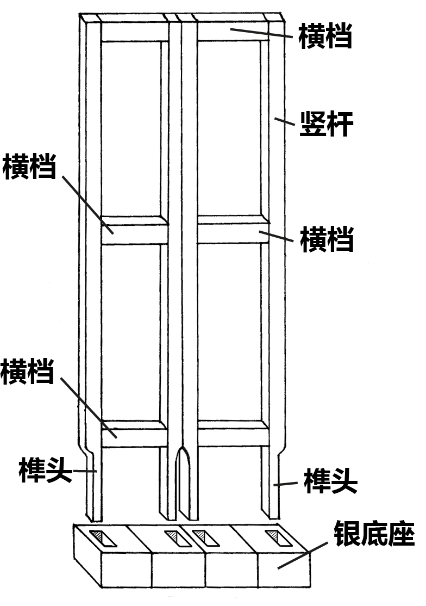
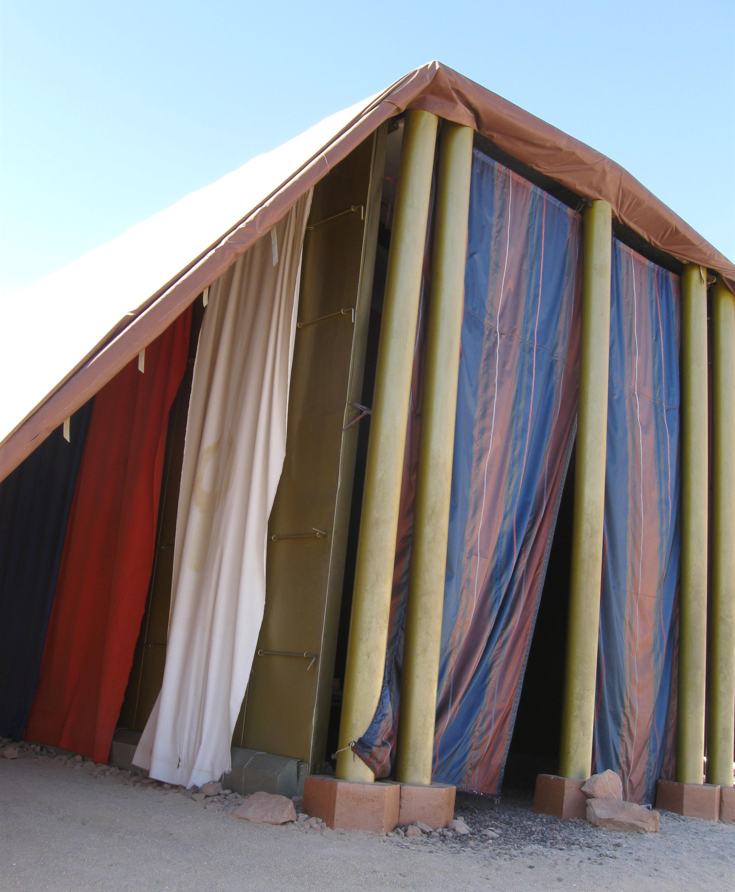
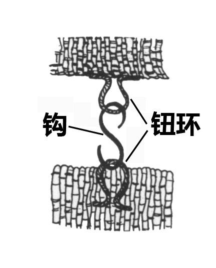
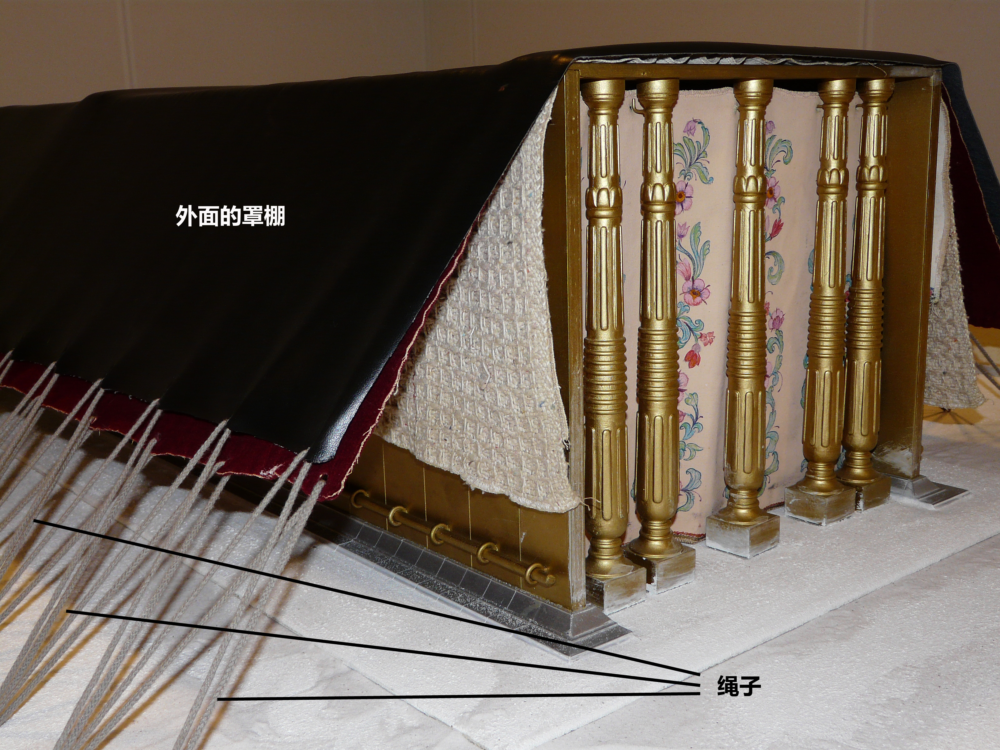
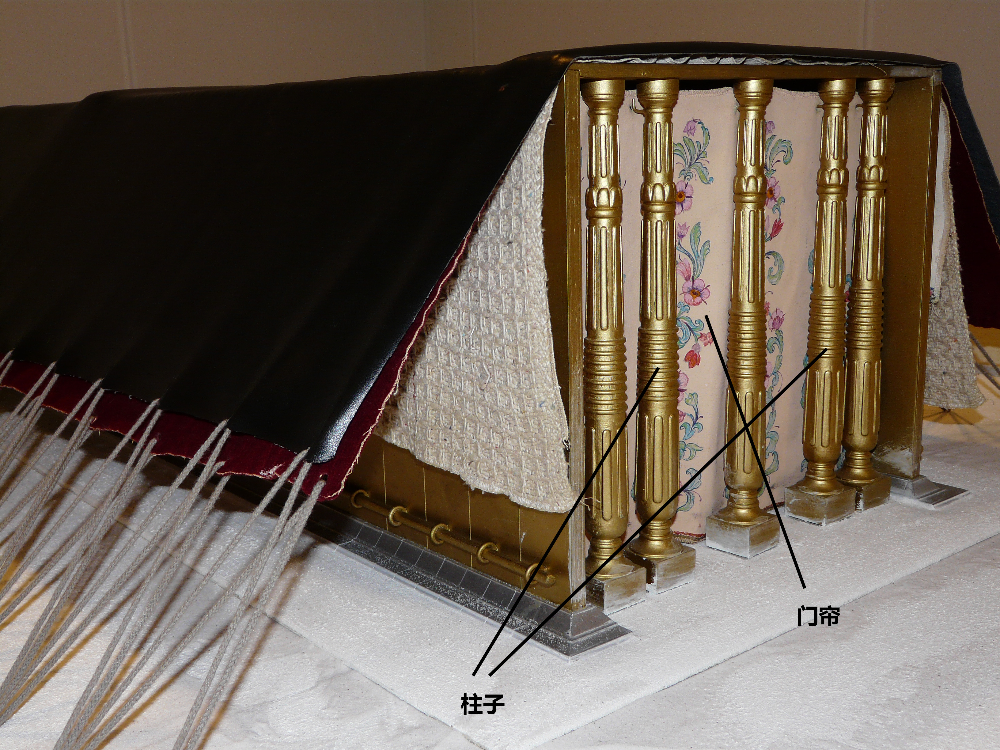

# Human-made Things in the Bible

## License Information

Human-made Things in the Bible © United Bible Societies, 2025. Adapted from: <cite>The Works of Their Hands: Man-made Things in the Bible</cite>, by Ray Pritz © 2009 United Bible Societies. This work is licensed under Creative Commons Attribution-ShareAlike 4.0 International (<a href="https://creativecommons.org/licenses/by-sa/4.0/">https://creativecommons.org/licenses/by-sa/4.0/</a>).

--------------------------------

## 标题：会幕和帐幕（Tent of Meeting and Tabernacle） (id: REALIA:3.15)

3\.15 标题：会幕和帐幕（Tent of Meeting and Tabernacle）
==============================================

从摩西五经的某些经文可以明显看出，以色列人在旷野漂流的时候，有两个不同的、用来与上帝相会的临时构筑物，两者都可以称为“帐棚”。虽然希伯来文*mishkan* 专门指包括祭坛和其他器具、精心建造的帐幕，但在一些地方，希伯来文*’ohel mo‘ed* （字面意为“相会的帐棚”）暗指一个较小的构筑物。这第二个“帐棚”安设在营外，可能是摩西亲自搭建的。

读者可参考诺埃尔·奥斯本（Noel Osborn）一篇题为《帐棚还是帐幕？翻译的两种传统》的文章。以下内容摘自奥斯本的结论：

很明显，在《出埃及记》中，关于以色列人在西奈山遇见耶和华之后，如何装备自己以继续前行，有两种不同的传统。这两种传统都记叙了一个可移动的圣所，这圣所是以色列人未来数十年在旷野漂流所必不可少的。两种传统都提供了一个可行的办法，来确保以色列人开启未来的路程时，有耶和华的同在，确保他们与上帝之间的圣约关系依然存续。但是，我们从经文中仍然可以看到这两种传统之间的差异；我们若要理解和正确认识耶和华如何塑造这些人及他们的后代，就必须要聆听这些重要的“声音”。

因此，翻译者必须要敏感地听到经文所发出来的声音。就如何翻译这些传统而言，我建议遵从以下准则：

（1）由于两种传统都提到一个可移动的圣所，所以选定的译词本身应有帐棚或可移动住所的意思。许多语言可以表述为“相会的帐棚”或“居住的帐棚”。因此，在大多数情况下，使用“帐棚”一词应该就足够了，这样不会给读者带来不必要的困惑。

（2）在[EXO 33:7](https://ref.ly/Exod33:7); [EXO 33:8](https://ref.ly/Exod33:8); [EXO 33:9](https://ref.ly/Exod33:9); [EXO 33:10](https://ref.ly/Exod33:10); [EXO 33:11](https://ref.ly/Exod33:11) 中，所用的词语应该清楚表明，摩西在营外不时与耶和华相会的帐棚，并不是在接下来几章经文中所建造的、配备所有器物的那个帐棚。

（3）在大多数情况下，即更大的语境清楚表明经文指的是精致搭建的帐幕，并且直接语境也不包含简朴会幕的有冲突特征，那么，我认为可以使用同一个词语来指帐幕。但是，如果经文中存在前文“声音”的痕迹，则应该在译文中保留这两种帐棚的区别。如果实在没有其他办法，那么可以在脚注中提供希伯来文的直译。

（4）然而，对于上面详细讨论的四种情况（[EXO 26:7](https://ref.ly/Exod26:7) ，[EXO 26:14](https://ref.ly/Exod26:14) ；[EXO 35:10](https://ref.ly/Exod35:10); [EXO 35:11](https://ref.ly/Exod35:11) ；[EXO 39:32](https://ref.ly/Exod39:32); [EXO 39:33](https://ref.ly/Exod39:33) ；[EXO 40:34](https://ref.ly/Exod40:34); [EXO 40:35](https://ref.ly/Exod40:35) ），我认为应该尽可能地区分“相会的帐棚”和“帐幕”。但是，如果区分这两个词意味着译文必须过于注重两者的不同之处，以致行文不流畅，则需要作出调整。

* **Associated Passages:** 出埃及记 33:7; 出埃及记 33:8; 出埃及记 33:9; 出埃及记 33:10; 出埃及记 33:11; 出埃及记 26:7; 出埃及记 26:14; 出埃及记 35:10; 出埃及记 35:11; 出埃及记 39:32; 出埃及记 39:33; 出埃及记 40:34; 出埃及记 40:35

* **Associated ACAI Concepts:** Tent of Meeting (ID: `realia:TentOfMeeting`)

## 标题：会幕（Tent of Meeting） (id: REALIA:3.15.1)

3\.15\.1 标题：会幕（Tent of Meeting）
===============================

经文出处
----

Hebrew 来：אֹהֶל, מוֹעֵד (音译：’ohel, ’ohel mo‘ed)

[EXO 33:7](https://ref.ly/Exod33:7), [EXO 33:7](https://ref.ly/Exod33:7), [EXO 33:7](https://ref.ly/Exod33:7), [EXO 33:8](https://ref.ly/Exod33:8), [EXO 33:8](https://ref.ly/Exod33:8), [EXO 33:8](https://ref.ly/Exod33:8), [EXO 33:9](https://ref.ly/Exod33:9), [EXO 33:9](https://ref.ly/Exod33:9), [EXO 33:10](https://ref.ly/Exod33:10), [EXO 33:10](https://ref.ly/Exod33:10), [EXO 33:11](https://ref.ly/Exod33:11), [NUM 11:16](https://ref.ly/Num11:16), [NUM 11:24](https://ref.ly/Num11:24), [NUM 11:26](https://ref.ly/Num11:26), [NUM 12:4](https://ref.ly/Num12:4), [NUM 12:5](https://ref.ly/Num12:5), [DEU 31:14](https://ref.ly/Deut31:14), [DEU 31:14](https://ref.ly/Deut31:14), [DEU 31:15](https://ref.ly/Deut31:15), [DEU 31:15](https://ref.ly/Deut31:15), [JOS 18:1](https://ref.ly/Josh18:1), [JOS 19:51](https://ref.ly/Josh19:51), [2CH 1:3](https://ref.ly/2Chr1:3), [2CH 1:6](https://ref.ly/2Chr1:6), [2CH 1:13](https://ref.ly/2Chr1:13), [2CH 5:5](https://ref.ly/2Chr5:5), [2CH 5:5](https://ref.ly/2Chr5:5)

描述
--

如果奥斯本的结论是正确的，即有两个不同的帐棚（参[3\.15 会幕和帐幕 (Tent of Meeting and Tabernacle)\<REALIA:3\.15\>](#) ），那么，摩西五经中给出的便是帐幕的尺寸，而经文实际上并没有描述会幕的尺寸。会幕显然是一个较小的构筑物，可由一个人独力搭建。

---

翻译
--

参上面[3\.15 会幕和帐幕 (Tent of Meeting and Tabernacle)\<REALIA:3\.15\>](#) 的讨论。

* **Associated Passages:** 出埃及记 33:7; 出埃及记 33:8; 出埃及记 33:9; 出埃及记 33:10; 出埃及记 33:11; 民数记 11:16; 民数记 11:24; 民数记 11:26; 民数记 12:4; 民数记 12:5; 申命记 31:14; 申命记 31:15; 约书亚记 18:1; 约书亚记 19:51; 历代志下 1:3; 历代志下 1:6; 历代志下 1:13; 历代志下 5:5

* **Associated ACAI Concepts:** Tent of Meeting (ID: `realia:TentOfMeeting`); Tent (ID: `realia:Tent`)

## 标题：帐幕（Tabernacle） (id: REALIA:3.15.2)

3\.15\.2 标题：帐幕（Tabernacle）
==========================

经文出处
----

Hebrew 来：אֹהֶל, מוֹעֵד (音译：’ohel, ’ohel mo‘ed)

[EXO 26:7](https://ref.ly/Exod26:7), [EXO 26:9](https://ref.ly/Exod26:9), [EXO 26:11](https://ref.ly/Exod26:11), [EXO 26:12](https://ref.ly/Exod26:12), [EXO 26:13](https://ref.ly/Exod26:13), [EXO 26:14](https://ref.ly/Exod26:14), [EXO 26:36](https://ref.ly/Exod26:36), [EXO 27:21](https://ref.ly/Exod27:21), [EXO 28:43](https://ref.ly/Exod28:43), [EXO 29:4](https://ref.ly/Exod29:4), [EXO 29:10](https://ref.ly/Exod29:10), [EXO 29:11](https://ref.ly/Exod29:11), [EXO 29:30](https://ref.ly/Exod29:30), [EXO 29:32](https://ref.ly/Exod29:32), [EXO 29:42](https://ref.ly/Exod29:42), [EXO 29:44](https://ref.ly/Exod29:44), [EXO 30:16](https://ref.ly/Exod30:16), [EXO 30:18](https://ref.ly/Exod30:18), [EXO 30:20](https://ref.ly/Exod30:20), [EXO 30:26](https://ref.ly/Exod30:26), [EXO 30:36](https://ref.ly/Exod30:36), [EXO 31:7](https://ref.ly/Exod31:7), [EXO 31:7](https://ref.ly/Exod31:7), [EXO 33:7](https://ref.ly/Exod33:7), [EXO 33:7](https://ref.ly/Exod33:7), [EXO 33:7](https://ref.ly/Exod33:7), [EXO 33:8](https://ref.ly/Exod33:8), [EXO 33:8](https://ref.ly/Exod33:8), [EXO 33:9](https://ref.ly/Exod33:9), [EXO 33:9](https://ref.ly/Exod33:9), [EXO 33:10](https://ref.ly/Exod33:10), [EXO 33:11](https://ref.ly/Exod33:11), [EXO 35:11](https://ref.ly/Exod35:11), [EXO 35:21](https://ref.ly/Exod35:21), [EXO 36:14](https://ref.ly/Exod36:14), [EXO 36:18](https://ref.ly/Exod36:18), [EXO 36:19](https://ref.ly/Exod36:19), [EXO 36:37](https://ref.ly/Exod36:37), [EXO 38:8](https://ref.ly/Exod38:8), [EXO 38:30](https://ref.ly/Exod38:30), [EXO 39:32](https://ref.ly/Exod39:32), [EXO 39:33](https://ref.ly/Exod39:33), [EXO 39:38](https://ref.ly/Exod39:38), [EXO 39:40](https://ref.ly/Exod39:40), [EXO 40:2](https://ref.ly/Exod40:2), [EXO 40:6](https://ref.ly/Exod40:6), [EXO 40:7](https://ref.ly/Exod40:7), [EXO 40:12](https://ref.ly/Exod40:12), [EXO 40:19](https://ref.ly/Exod40:19), [EXO 40:19](https://ref.ly/Exod40:19), [EXO 40:22](https://ref.ly/Exod40:22), [EXO 40:24](https://ref.ly/Exod40:24), [EXO 40:26](https://ref.ly/Exod40:26), [EXO 40:29](https://ref.ly/Exod40:29), [EXO 40:30](https://ref.ly/Exod40:30), [EXO 40:32](https://ref.ly/Exod40:32), [EXO 40:34](https://ref.ly/Exod40:34), [EXO 40:35](https://ref.ly/Exod40:35), [LEV 1:1](https://ref.ly/Lev1:1), [LEV 1:3](https://ref.ly/Lev1:3), [LEV 1:5](https://ref.ly/Lev1:5), [LEV 3:2](https://ref.ly/Lev3:2), [LEV 3:8](https://ref.ly/Lev3:8), [LEV 3:13](https://ref.ly/Lev3:13), [LEV 4:4](https://ref.ly/Lev4:4), [LEV 4:5](https://ref.ly/Lev4:5), [LEV 4:7](https://ref.ly/Lev4:7), [LEV 4:7](https://ref.ly/Lev4:7), [LEV 4:14](https://ref.ly/Lev4:14), [LEV 4:16](https://ref.ly/Lev4:16), [LEV 4:18](https://ref.ly/Lev4:18), [LEV 4:18](https://ref.ly/Lev4:18), [LEV 6:9](https://ref.ly/Lev6:9), [LEV 6:19](https://ref.ly/Lev6:19), [LEV 6:23](https://ref.ly/Lev6:23), [LEV 8:3](https://ref.ly/Lev8:3), [LEV 8:4](https://ref.ly/Lev8:4), [LEV 8:31](https://ref.ly/Lev8:31), [LEV 8:33](https://ref.ly/Lev8:33), [LEV 8:35](https://ref.ly/Lev8:35), [LEV 9:5](https://ref.ly/Lev9:5), [LEV 9:23](https://ref.ly/Lev9:23), [LEV 10:7](https://ref.ly/Lev10:7), [LEV 10:9](https://ref.ly/Lev10:9), [LEV 12:6](https://ref.ly/Lev12:6), [LEV 14:11](https://ref.ly/Lev14:11), [LEV 14:23](https://ref.ly/Lev14:23), [LEV 15:14](https://ref.ly/Lev15:14), [LEV 15:29](https://ref.ly/Lev15:29), [LEV 16:7](https://ref.ly/Lev16:7), [LEV 16:16](https://ref.ly/Lev16:16), [LEV 16:17](https://ref.ly/Lev16:17), [LEV 16:20](https://ref.ly/Lev16:20), [LEV 16:23](https://ref.ly/Lev16:23), [LEV 16:33](https://ref.ly/Lev16:33), [LEV 17:4](https://ref.ly/Lev17:4), [LEV 17:5](https://ref.ly/Lev17:5), [LEV 17:6](https://ref.ly/Lev17:6), [LEV 17:9](https://ref.ly/Lev17:9), [LEV 19:21](https://ref.ly/Lev19:21), [LEV 24:3](https://ref.ly/Lev24:3), [NUM 1:1](https://ref.ly/Num1:1), [NUM 2:2](https://ref.ly/Num2:2), [NUM 2:17](https://ref.ly/Num2:17), [NUM 3:7](https://ref.ly/Num3:7), [NUM 3:8](https://ref.ly/Num3:8), [NUM 3:25](https://ref.ly/Num3:25), [NUM 3:25](https://ref.ly/Num3:25), [NUM 3:25](https://ref.ly/Num3:25), [NUM 3:38](https://ref.ly/Num3:38), [NUM 4:3](https://ref.ly/Num4:3), [NUM 4:4](https://ref.ly/Num4:4), [NUM 4:15](https://ref.ly/Num4:15), [NUM 4:23](https://ref.ly/Num4:23), [NUM 4:25](https://ref.ly/Num4:25), [NUM 4:25](https://ref.ly/Num4:25), [NUM 4:28](https://ref.ly/Num4:28), [NUM 4:30](https://ref.ly/Num4:30), [NUM 4:31](https://ref.ly/Num4:31), [NUM 4:33](https://ref.ly/Num4:33), [NUM 4:35](https://ref.ly/Num4:35), [NUM 4:37](https://ref.ly/Num4:37), [NUM 4:39](https://ref.ly/Num4:39), [NUM 4:41](https://ref.ly/Num4:41), [NUM 4:43](https://ref.ly/Num4:43), [NUM 4:47](https://ref.ly/Num4:47), [NUM 6:10](https://ref.ly/Num6:10), [NUM 6:13](https://ref.ly/Num6:13), [NUM 6:18](https://ref.ly/Num6:18), [NUM 7:5](https://ref.ly/Num7:5), [NUM 7:89](https://ref.ly/Num7:89), [NUM 8:9](https://ref.ly/Num8:9), [NUM 8:15](https://ref.ly/Num8:15), [NUM 8:19](https://ref.ly/Num8:19), [NUM 8:22](https://ref.ly/Num8:22), [NUM 8:24](https://ref.ly/Num8:24), [NUM 8:26](https://ref.ly/Num8:26), [NUM 9:15](https://ref.ly/Num9:15), [NUM 9:17](https://ref.ly/Num9:17), [NUM 10:3](https://ref.ly/Num10:3), [NUM 11:16](https://ref.ly/Num11:16), [NUM 11:24](https://ref.ly/Num11:24), [NUM 11:26](https://ref.ly/Num11:26), [NUM 12:4](https://ref.ly/Num12:4), [NUM 12:5](https://ref.ly/Num12:5), [NUM 12:10](https://ref.ly/Num12:10), [NUM 14:10](https://ref.ly/Num14:10), [NUM 16:18](https://ref.ly/Num16:18), [NUM 16:19](https://ref.ly/Num16:19), [NUM 17:7](https://ref.ly/Num17:7), [NUM 17:8](https://ref.ly/Num17:8), [NUM 17:15](https://ref.ly/Num17:15), [NUM 17:19](https://ref.ly/Num17:19), [NUM 17:22](https://ref.ly/Num17:22), [NUM 17:23](https://ref.ly/Num17:23), [NUM 18:2](https://ref.ly/Num18:2), [NUM 18:3](https://ref.ly/Num18:3), [NUM 18:4](https://ref.ly/Num18:4), [NUM 18:4](https://ref.ly/Num18:4), [NUM 18:6](https://ref.ly/Num18:6), [NUM 18:21](https://ref.ly/Num18:21), [NUM 18:22](https://ref.ly/Num18:22), [NUM 18:23](https://ref.ly/Num18:23), [NUM 18:31](https://ref.ly/Num18:31), [NUM 19:4](https://ref.ly/Num19:4), [NUM 20:6](https://ref.ly/Num20:6), [NUM 25:6](https://ref.ly/Num25:6), [NUM 27:2](https://ref.ly/Num27:2), [NUM 31:54](https://ref.ly/Num31:54), [DEU 31:14](https://ref.ly/Deut31:14), [DEU 31:14](https://ref.ly/Deut31:14), [DEU 31:15](https://ref.ly/Deut31:15), [DEU 31:15](https://ref.ly/Deut31:15), [JOS 18:1](https://ref.ly/Josh18:1), [JOS 19:51](https://ref.ly/Josh19:51), [1SA 2:22](https://ref.ly/1Sam2:22), [2SA 6:17](https://ref.ly/2Sam6:17), [2SA 7:6](https://ref.ly/2Sam7:6), [1KI 1:39](https://ref.ly/1Kgs1:39), [1KI 2:28](https://ref.ly/1Kgs2:28), [1KI 2:29](https://ref.ly/1Kgs2:29), [1KI 2:30](https://ref.ly/1Kgs2:30), [1KI 8:4](https://ref.ly/1Kgs8:4), [1KI 8:4](https://ref.ly/1Kgs8:4), [1CH 6:17](https://ref.ly/1Chr6:17), [1CH 9:19](https://ref.ly/1Chr9:19), [1CH 9:21](https://ref.ly/1Chr9:21), [1CH 9:23](https://ref.ly/1Chr9:23), [1CH 17:5](https://ref.ly/1Chr17:5), [1CH 17:5](https://ref.ly/1Chr17:5), [1CH 23:32](https://ref.ly/1Chr23:32), [2CH 1:3](https://ref.ly/2Chr1:3), [2CH 1:6](https://ref.ly/2Chr1:6), [2CH 1:13](https://ref.ly/2Chr1:13), [2CH 5:5](https://ref.ly/2Chr5:5), [2CH 5:5](https://ref.ly/2Chr5:5), [2CH 24:6](https://ref.ly/2Chr24:6), [PSA 27:6](https://ref.ly/Ps27:6), [PSA 78:60](https://ref.ly/Ps78:60)

Hebrew 来：הֵיכָל (音译：heykal)

[1SA 1:9](https://ref.ly/1Sam1:9), [1SA 3:3](https://ref.ly/1Sam3:3)

Hebrew 来：מִשְׁכָּן (音译：mishkan)

[EXO 25:9](https://ref.ly/Exod25:9), [EXO 26:1](https://ref.ly/Exod26:1), [EXO 26:6](https://ref.ly/Exod26:6), [EXO 26:7](https://ref.ly/Exod26:7), [EXO 26:12](https://ref.ly/Exod26:12), [EXO 26:13](https://ref.ly/Exod26:13), [EXO 26:15](https://ref.ly/Exod26:15), [EXO 26:17](https://ref.ly/Exod26:17), [EXO 26:18](https://ref.ly/Exod26:18), [EXO 26:20](https://ref.ly/Exod26:20), [EXO 26:22](https://ref.ly/Exod26:22), [EXO 26:23](https://ref.ly/Exod26:23), [EXO 26:26](https://ref.ly/Exod26:26), [EXO 26:27](https://ref.ly/Exod26:27), [EXO 26:27](https://ref.ly/Exod26:27), [EXO 26:30](https://ref.ly/Exod26:30), [EXO 26:35](https://ref.ly/Exod26:35), [EXO 27:9](https://ref.ly/Exod27:9), [EXO 27:19](https://ref.ly/Exod27:19), [EXO 35:11](https://ref.ly/Exod35:11), [EXO 35:15](https://ref.ly/Exod35:15), [EXO 35:18](https://ref.ly/Exod35:18), [EXO 36:8](https://ref.ly/Exod36:8), [EXO 36:13](https://ref.ly/Exod36:13), [EXO 36:14](https://ref.ly/Exod36:14), [EXO 36:20](https://ref.ly/Exod36:20), [EXO 36:22](https://ref.ly/Exod36:22), [EXO 36:23](https://ref.ly/Exod36:23), [EXO 36:25](https://ref.ly/Exod36:25), [EXO 36:27](https://ref.ly/Exod36:27), [EXO 36:28](https://ref.ly/Exod36:28), [EXO 36:31](https://ref.ly/Exod36:31), [EXO 36:32](https://ref.ly/Exod36:32), [EXO 36:32](https://ref.ly/Exod36:32), [EXO 38:20](https://ref.ly/Exod38:20), [EXO 38:21](https://ref.ly/Exod38:21), [EXO 38:21](https://ref.ly/Exod38:21), [EXO 38:31](https://ref.ly/Exod38:31), [EXO 39:32](https://ref.ly/Exod39:32), [EXO 39:33](https://ref.ly/Exod39:33), [EXO 39:40](https://ref.ly/Exod39:40), [EXO 40:2](https://ref.ly/Exod40:2), [EXO 40:5](https://ref.ly/Exod40:5), [EXO 40:6](https://ref.ly/Exod40:6), [EXO 40:9](https://ref.ly/Exod40:9), [EXO 40:17](https://ref.ly/Exod40:17), [EXO 40:18](https://ref.ly/Exod40:18), [EXO 40:19](https://ref.ly/Exod40:19), [EXO 40:21](https://ref.ly/Exod40:21), [EXO 40:22](https://ref.ly/Exod40:22), [EXO 40:24](https://ref.ly/Exod40:24), [EXO 40:28](https://ref.ly/Exod40:28), [EXO 40:29](https://ref.ly/Exod40:29), [EXO 40:33](https://ref.ly/Exod40:33), [EXO 40:34](https://ref.ly/Exod40:34), [EXO 40:35](https://ref.ly/Exod40:35), [EXO 40:36](https://ref.ly/Exod40:36), [EXO 40:38](https://ref.ly/Exod40:38), [LEV 8:10](https://ref.ly/Lev8:10), [LEV 15:31](https://ref.ly/Lev15:31), [LEV 17:4](https://ref.ly/Lev17:4), [NUM 1:50](https://ref.ly/Num1:50), [NUM 1:50](https://ref.ly/Num1:50), [NUM 1:50](https://ref.ly/Num1:50), [NUM 1:51](https://ref.ly/Num1:51), [NUM 1:51](https://ref.ly/Num1:51), [NUM 1:53](https://ref.ly/Num1:53), [NUM 1:53](https://ref.ly/Num1:53), [NUM 3:7](https://ref.ly/Num3:7), [NUM 3:8](https://ref.ly/Num3:8), [NUM 3:23](https://ref.ly/Num3:23), [NUM 3:25](https://ref.ly/Num3:25), [NUM 3:26](https://ref.ly/Num3:26), [NUM 3:29](https://ref.ly/Num3:29), [NUM 3:35](https://ref.ly/Num3:35), [NUM 3:36](https://ref.ly/Num3:36), [NUM 3:38](https://ref.ly/Num3:38), [NUM 4:16](https://ref.ly/Num4:16), [NUM 4:25](https://ref.ly/Num4:25), [NUM 4:26](https://ref.ly/Num4:26), [NUM 4:31](https://ref.ly/Num4:31), [NUM 5:17](https://ref.ly/Num5:17), [NUM 7:1](https://ref.ly/Num7:1), [NUM 7:3](https://ref.ly/Num7:3), [NUM 9:15](https://ref.ly/Num9:15), [NUM 9:15](https://ref.ly/Num9:15), [NUM 9:15](https://ref.ly/Num9:15), [NUM 9:18](https://ref.ly/Num9:18), [NUM 9:19](https://ref.ly/Num9:19), [NUM 9:20](https://ref.ly/Num9:20), [NUM 9:22](https://ref.ly/Num9:22), [NUM 10:11](https://ref.ly/Num10:11), [NUM 10:17](https://ref.ly/Num10:17), [NUM 10:17](https://ref.ly/Num10:17), [NUM 10:21](https://ref.ly/Num10:21), [NUM 16:9](https://ref.ly/Num16:9), [NUM 17:28](https://ref.ly/Num17:28), [NUM 19:13](https://ref.ly/Num19:13), [NUM 31:30](https://ref.ly/Num31:30), [NUM 31:47](https://ref.ly/Num31:47), [JOS 22:19](https://ref.ly/Josh22:19), [JOS 22:29](https://ref.ly/Josh22:29), [1CH 6:17](https://ref.ly/1Chr6:17), [1CH 6:33](https://ref.ly/1Chr6:33), [1CH 16:39](https://ref.ly/1Chr16:39), [1CH 21:29](https://ref.ly/1Chr21:29), [1CH 23:26](https://ref.ly/1Chr23:26), [2CH 1:5](https://ref.ly/2Chr1:5), [PSA 26:8](https://ref.ly/Ps26:8), [PSA 74:7](https://ref.ly/Ps74:7), [PSA 78:60](https://ref.ly/Ps78:60), [EZK 37:27](https://ref.ly/Ezek37:27)

Hebrew 来：מִקְדָּשׁ (音译：miqdash)

[EXO 15:17](https://ref.ly/Exod15:17), [EXO 25:8](https://ref.ly/Exod25:8), [LEV 12:4](https://ref.ly/Lev12:4), [LEV 19:30](https://ref.ly/Lev19:30), [LEV 20:3](https://ref.ly/Lev20:3), [LEV 26:2](https://ref.ly/Lev26:2), [LEV 21:12](https://ref.ly/Lev21:12), [LEV 21:12](https://ref.ly/Lev21:12), [LEV 21:23](https://ref.ly/Lev21:23), [NUM 3:38](https://ref.ly/Num3:38), [NUM 10:21](https://ref.ly/Num10:21), [NUM 18:1](https://ref.ly/Num18:1), [NUM 18:29](https://ref.ly/Num18:29), [NUM 19:20](https://ref.ly/Num19:20), [JOS 24:26](https://ref.ly/Josh24:26)

Hebrew 来：קֹדֶשׁ (音译：qodesh)

[EXO 36:1](https://ref.ly/Exod36:1), [EXO 36:4](https://ref.ly/Exod36:4), [EXO 36:6](https://ref.ly/Exod36:6), [EXO 38:24](https://ref.ly/Exod38:24), [EXO 38:24](https://ref.ly/Exod38:24), [EXO 38:27](https://ref.ly/Exod38:27), [LEV 10:4](https://ref.ly/Lev10:4), [NUM 3:28](https://ref.ly/Num3:28), [NUM 3:31](https://ref.ly/Num3:31), [NUM 3:32](https://ref.ly/Num3:32), [NUM 4:12](https://ref.ly/Num4:12), [NUM 4:15](https://ref.ly/Num4:15), [NUM 4:15](https://ref.ly/Num4:15), [NUM 4:15](https://ref.ly/Num4:15), [NUM 4:16](https://ref.ly/Num4:16), [NUM 8:19](https://ref.ly/Num8:19), [NUM 18:3](https://ref.ly/Num18:3), [NUM 18:5](https://ref.ly/Num18:5)

Greek 希：ἅγιος (音译：hagia, hagion)

[HEB 8:2](https://ref.ly/Heb8:2), [HEB 9:1](https://ref.ly/Heb9:1), [HEB 9:8](https://ref.ly/Heb9:8)

Greek 希：σκηνή (音译：skēnē)

[ACT 7:44](https://ref.ly/Acts7:44), [HEB 8:2](https://ref.ly/Heb8:2), [HEB 8:5](https://ref.ly/Heb8:5), [HEB 9:8](https://ref.ly/Heb9:8), [HEB 9:11](https://ref.ly/Heb9:11), [HEB 9:21](https://ref.ly/Heb9:21), [HEB 13:10](https://ref.ly/Heb13:10), [REV 15:5](https://ref.ly/Rev15:5), [WIS 9:8](https://ref.ly/Wis9:8), [SIR 24:10](https://ref.ly/Sir24:10), [SIR 24:15](https://ref.ly/Sir24:15), [2MA 2:4](https://ref.ly/2Macc2:4), [2MA 2:5](https://ref.ly/2Macc2:5)

描述和用途
-----

*在旷野漂流时使用的可移动会幕和它的外院（亭纳公园（Timnah Park）模型） (© Ruk7, CC BY\-SA 3\.0, via Wikimedia Commons)*

帐幕是一个相对较大的帐棚，周围有一个封闭的庭院；帐幕是圣殿建成之前，以色列人的敬拜中心。

---

翻译
--

*可移动会幕的模型（亭纳公园（Timnah Park）） (© Mboesch, CC BY\-SA 4\.0, via Wikimedia Commons)*

在不同的语境中，上面列出的希伯来文和希腊文词语的含义也可能有所不同。翻译者要特别注意语境，因为语境通常会表明词语所要表达的意思。例如，希伯来文*mishkan* 既可以指整个帐幕（即帐幕和院子；[EXO 25:8](https://ref.ly/Exod25:8) ），也可以指帐幕本身，即位于院子里面，包括了圣所和至圣所的帐幕（[EXO 26:1](https://ref.ly/Exod26:1) ）。同样地，希伯来文*miqdash* 有时指圣所（[LEV 20:3](https://ref.ly/Lev20:3) ），有时是指至圣所（[LEV 16:33](https://ref.ly/Lev16:33) ），有时指的是帐幕加上院子的整体结构（[EXO 25:8](https://ref.ly/Exod25:8) ）。

希伯来文*’ohel* 的意思是“帐棚”（参[3\.2 帐棚 (tent)\<REALIA:3\.2\>](#) ），可以指帐幕本身（[EXO 26:36](https://ref.ly/Exod26:36) ），或者指会幕，如上文所述（参[3\.15 会幕和帐幕 (Tent of Meeting and Tabernacle)\<REALIA:3\.15\>](#) ）。

在有些语言中，“帐幕”可以译为“上帝居住的最大的帐棚”、“用来敬拜上帝的大帐棚”，或“圣洁的帐棚”。在选择合适的名称时，重要的是要表明帐幕的功能在本质上与圣殿相同；两者只有结构上的不同，并没有用途或宗教意义上的不同。参[3\.14\.1 犹太人的圣殿 (Jewish Temple)\<REALIA:3\.14\.1\>](#) 中的讨论。

关于“帐幕”的翻译，奥斯本发表了以下评论：“最近的几个译本没有采用‘帐幕’的传统译法，而直接译为‘居所’。《翻译者的〈旧约〉》（TOT ）使用了‘神龛’一词，这也许更适合用来表示耶和华在旷野的居所。当然，这两个词都可以指一块围地内的帐棚，也可以指包含帐棚在内的整个构筑物。然而，两个术语都含有某种成分，暗示着自身与相对固定的所罗门圣殿有所不同，并且该成分似乎影响了从祭司角度对帐幕的描述。”

[EXO 39:32](https://ref.ly/Exod39:32); [EXO 40:2](https://ref.ly/Exod40:2); [EXO 40:6](https://ref.ly/Exod40:6); [EXO 40:29](https://ref.ly/Exod40:29) ；[1CH 6:17](https://ref.ly/1Chr6:17) （《和》6:32）：这些经文中的希伯来文结合了*mishkan* 和*’ohel mo‘ed* 两个词语，RSV (Revised Standard Version (1952)) 译为“the tabernacle of the tent of meeting”（“会幕的帐幕”）。[EXO 40:0](https://ref.ly/Exod40:0) 三次提到这个词组，其中*mishkan* 可能是指院子里面由支架（竖板）和四层罩棚组成的帐棚，而*’ohel mo‘ed* 则是指帐幕和院子的整体。在[EXO 39:32](https://ref.ly/Exod39:32) 中，这两个词语指的是同一个事物，其中第二个词语解释了第一个词语。在这节经文中，GNT (Good News Translation (1992)) 只用了一个表达来翻译两个术语：“the Tent of the LORD’s presence”（“耶和华临在的帐棚”）。NIV (New International Version (1984)) 的译法更好，作“the tabernacle, the Tent of Meeting”（“帐幕，就是会幕”）。另一种表达方式是“神圣的帐棚，人们与上帝相会的地方”。

[HEB 8:2](https://ref.ly/Heb8:2); [HEB 9:11](https://ref.ly/Heb9:11); [REV 15:5](https://ref.ly/Rev15:5) ：这些经文都用同一个希腊文*skēnē* 来指称神圣的帐棚，该词指的是在旷野中的帐棚（如[HEB 8:5](https://ref.ly/Heb8:5) ）。然而，这几处经文说的是属天或属灵意义上的帐幕（实际上，这才是地上实体帐幕的本物）。不管是指实体帐幕还是它属天的对应物，翻译者应尽可能使用同一个词来翻译*skēnē* 。

以下内容节选自《〈启示录〉手册》（*A Handbook on The Revelation to John* ，第226—227页）关于[REV 15:5](https://ref.ly/Rev15:5) 的注释：关于“作证的帐棚的殿”（“the temple of the tent of witness”；RSV (Revised Standard Version (1952)) ／NRSV (New Revised Standard Version (1989)) ）这个复合属格短语的含意，还有一些不太确定的地方。这个短语的字面意思相当模糊，一般的读者可能会把它理解为：在作证的帐棚中有一个殿。这个短语有三种可能的意思：（1）“作证的帐棚”和“殿”指的是同一个事物，因此可以译为“殿，即作证的帐棚”（如AT (American Translation (Goodspeed, 1935)) 、NJB (New Jerusalem Bible (1985)) 、SPCL (Spanish Common Language Version (Dios Habla Hoy)) 、NIV (New International Version (1984)) ）；（2）“殿中的作证帐棚”（如GNT (Good News Translation (1992)) 、FRCL (French Common Language Version (Bible en français courant)) 、巴西文通俗译本）；（3）“作证帐棚中的圣所”（如TNT 、REB (Revised English Bible (1989)) 、巴克利、菲利普斯）。最后一种解释（也是我们推荐的解释）的支持理由是：译作“殿”的希腊文*naos* 是一个专门词语，特指圣殿内部的圣所，而不是圣殿内较大的敬拜区域（希腊文*hieron* ）。圣殿内部的圣所（存放约柜的地方）与敬拜区域之间，有一块厚重的幔子隔开；敬拜区域内有香坛和每天奉献供饼给上帝的桌子。这也是帐幕的设计（参[EXO 40:1](https://ref.ly/Exod40:1) —[EXO 40:33](https://ref.ly/Exod40:33) ）。因此，在这里最好译为：“在作证的帐棚中的圣所（或至圣所）”，或“在帐幕中的圣所（或至圣所）”。在这里和[ACT 7:44](https://ref.ly/Acts7:44) 中，应使用旧约中最常用来指称帐幕的译名。

* **Associated Passages:** 出埃及记 26:7; 出埃及记 26:9; 出埃及记 26:11; 出埃及记 26:12; 出埃及记 26:13; 出埃及记 26:14; 出埃及记 26:36; 出埃及记 27:21; 出埃及记 28:43; 出埃及记 29:4; 出埃及记 29:10; 出埃及记 29:11; 出埃及记 29:30; 出埃及记 29:32; 出埃及记 29:42; 出埃及记 29:44; 出埃及记 30:16; 出埃及记 30:18; 出埃及记 30:20; 出埃及记 30:26; 出埃及记 30:36; 出埃及记 31:7; 出埃及记 33:7; 出埃及记 33:8; 出埃及记 33:9; 出埃及记 33:10; 出埃及记 33:11; 出埃及记 35:11; 出埃及记 35:21; 出埃及记 36:14; 出埃及记 36:18; 出埃及记 36:19; 出埃及记 36:37; 出埃及记 38:8; 出埃及记 38:30; 出埃及记 39:32; 出埃及记 39:33; 出埃及记 39:38; 出埃及记 39:40; 出埃及记 40:2; 出埃及记 40:6; 出埃及记 40:7; 出埃及记 40:12; 出埃及记 40:19; 出埃及记 40:22; 出埃及记 40:24; 出埃及记 40:26; 出埃及记 40:29; 出埃及记 40:30; 出埃及记 40:32; 出埃及记 40:34; 出埃及记 40:35; 利未记 1:1; 利未记 1:3; 利未记 1:5; 利未记 3:2; 利未记 3:8; 利未记 3:13; 利未记 4:4; 利未记 4:5; 利未记 4:7; 利未记 4:14; 利未记 4:16; 利未记 4:18; 利未记 6:9; 利未记 6:19; 利未记 6:23; 利未记 8:3; 利未记 8:4; 利未记 8:31; 利未记 8:33; 利未记 8:35; 利未记 9:5; 利未记 9:23; 利未记 10:7; 利未记 10:9; 利未记 12:6; 利未记 14:11; 利未记 14:23; 利未记 15:14; 利未记 15:29; 利未记 16:7; 利未记 16:16; 利未记 16:17; 利未记 16:20; 利未记 16:23; 利未记 16:33; 利未记 17:4; 利未记 17:5; 利未记 17:6; 利未记 17:9; 利未记 19:21; 利未记 24:3; 民数记 1:1; 民数记 2:2; 民数记 2:17; 民数记 3:7; 民数记 3:8; 民数记 3:25; 民数记 3:38; 民数记 4:3; 民数记 4:4; 民数记 4:15; 民数记 4:23; 民数记 4:25; 民数记 4:28; 民数记 4:30; 民数记 4:31; 民数记 4:33; 民数记 4:35; 民数记 4:37; 民数记 4:39; 民数记 4:41; 民数记 4:43; 民数记 4:47; 民数记 6:10; 民数记 6:13; 民数记 6:18; 民数记 7:5; 民数记 7:89; 民数记 8:9; 民数记 8:15; 民数记 8:19; 民数记 8:22; 民数记 8:24; 民数记 8:26; 民数记 9:15; 民数记 9:17; 民数记 10:3; 民数记 11:16; 民数记 11:24; 民数记 11:26; 民数记 12:4; 民数记 12:5; 民数记 12:10; 民数记 14:10; 民数记 16:18; 民数记 16:19; 民数记 17:7; 民数记 17:8; 民数记 17:15; 民数记 17:19; 民数记 17:22; 民数记 17:23; 民数记 18:2; 民数记 18:3; 民数记 18:4; 民数记 18:6; 民数记 18:21; 民数记 18:22; 民数记 18:23; 民数记 18:31; 民数记 19:4; 民数记 20:6; 民数记 25:6; 民数记 27:2; 民数记 31:54; 申命记 31:14; 申命记 31:15; 约书亚记 18:1; 约书亚记 19:51; 撒母耳记上 2:22; 撒母耳记下 6:17; 撒母耳记下 7:6; 列王纪上 1:39; 列王纪上 2:28; 列王纪上 2:29; 列王纪上 2:30; 列王纪上 8:4; 历代志上 6:17; 历代志上 9:19; 历代志上 9:21; 历代志上 9:23; 历代志上 17:5; 历代志上 23:32; 历代志下 1:3; 历代志下 1:6; 历代志下 1:13; 历代志下 5:5; 历代志下 24:6; 诗篇 27:6; 诗篇 78:60; 撒母耳记上 1:9; 撒母耳记上 3:3; 出埃及记 25:9; 出埃及记 26:1; 出埃及记 26:6; 出埃及记 26:15; 出埃及记 26:17; 出埃及记 26:18; 出埃及记 26:20; 出埃及记 26:22; 出埃及记 26:23; 出埃及记 26:26; 出埃及记 26:27; 出埃及记 26:30; 出埃及记 26:35; 出埃及记 27:9; 出埃及记 27:19; 出埃及记 35:15; 出埃及记 35:18; 出埃及记 36:8; 出埃及记 36:13; 出埃及记 36:20; 出埃及记 36:22; 出埃及记 36:23; 出埃及记 36:25; 出埃及记 36:27; 出埃及记 36:28; 出埃及记 36:31; 出埃及记 36:32; 出埃及记 38:20; 出埃及记 38:21; 出埃及记 38:31; 出埃及记 40:5; 出埃及记 40:9; 出埃及记 40:17; 出埃及记 40:18; 出埃及记 40:21; 出埃及记 40:28; 出埃及记 40:33; 出埃及记 40:36; 出埃及记 40:38; 利未记 8:10; 利未记 15:31; 民数记 1:50; 民数记 1:51; 民数记 1:53; 民数记 3:23; 民数记 3:26; 民数记 3:29; 民数记 3:35; 民数记 3:36; 民数记 4:16; 民数记 4:26; 民数记 5:17; 民数记 7:1; 民数记 7:3; 民数记 9:18; 民数记 9:19; 民数记 9:20; 民数记 9:22; 民数记 10:11; 民数记 10:17; 民数记 10:21; 民数记 16:9; 民数记 17:28; 民数记 19:13; 民数记 31:30; 民数记 31:47; 约书亚记 22:19; 约书亚记 22:29; 历代志上 6:33; 历代志上 16:39; 历代志上 21:29; 历代志上 23:26; 历代志下 1:5; 诗篇 26:8; 诗篇 74:7; 以西结书 37:27; 出埃及记 15:17; 出埃及记 25:8; 利未记 12:4; 利未记 19:30; 利未记 20:3; 利未记 26:2; 利未记 21:12; 利未记 21:23; 民数记 18:1; 民数记 18:29; 民数记 19:20; 约书亚记 24:26; 出埃及记 36:1; 出埃及记 36:4; 出埃及记 36:6; 出埃及记 38:24; 出埃及记 38:27; 利未记 10:4; 民数记 3:28; 民数记 3:31; 民数记 3:32; 民数记 4:12; 民数记 18:5; 希伯来书 8:2; 希伯来书 9:1; 希伯来书 9:8; 使徒行传 7:44; 希伯来书 8:5; 希伯来书 9:11; 希伯来书 9:21; 希伯来书 13:10; 启示录 15:5; 智慧篇 9:8; 德训篇 24:10; 德训篇 24:15; 玛加伯下 2:4; 玛加伯下 2:5; 出埃及记 40:0; 出埃及记 40:1

* **Associated ACAI Concepts:** Tabernacle (ID: `realia:Tabernacle`)

## 标题：圣所、圣洁的地方（Holy Place） (id: REALIA:3.15.2.1)

3\.15\.2\.1 标题：圣所、圣洁的地方（Holy Place）
===================================

经文出处
----

Hebrew 来：הֵיכָל (音译：heykal)

[1KI 6:17](https://ref.ly/1Kgs6:17), [1KI 6:33](https://ref.ly/1Kgs6:33), [1KI 7:50](https://ref.ly/1Kgs7:50), [2CH 4:22](https://ref.ly/2Chr4:22), [2CH 29:16](https://ref.ly/2Chr29:16), [NEH 6:10](https://ref.ly/Neh6:10), [NEH 6:10](https://ref.ly/Neh6:10), [NEH 6:11](https://ref.ly/Neh6:11), [PSA 5:8](https://ref.ly/Ps5:8), [PSA 11:4](https://ref.ly/Ps11:4), [PSA 18:7](https://ref.ly/Ps18:7), [PSA 138:2](https://ref.ly/Ps138:2), [ISA 6:1](https://ref.ly/Isa6:1), [EZK 8:16](https://ref.ly/Ezek8:16), [EZK 8:16](https://ref.ly/Ezek8:16), [EZK 41:1](https://ref.ly/Ezek41:1), [EZK 41:4](https://ref.ly/Ezek41:4), [EZK 41:15](https://ref.ly/Ezek41:15), [EZK 41:20](https://ref.ly/Ezek41:20), [EZK 41:21](https://ref.ly/Ezek41:21), [EZK 41:23](https://ref.ly/Ezek41:23), [EZK 41:25](https://ref.ly/Ezek41:25), [EZK 42:8](https://ref.ly/Ezek42:8), [JON 2:5](https://ref.ly/Jonah2:5), [JON 2:8](https://ref.ly/Jonah2:8), [MIC 1:2](https://ref.ly/Mic1:2), [HAB 2:20](https://ref.ly/Hab2:20), [MAL 3:1](https://ref.ly/Mal3:1)

Hebrew 来：קֹדֶשׁ (音译：qodesh)

[EXO 29:30](https://ref.ly/Exod29:30), [EXO 30:13](https://ref.ly/Exod30:13), [EXO 30:24](https://ref.ly/Exod30:24), [EXO 31:11](https://ref.ly/Exod31:11), [EXO 35:19](https://ref.ly/Exod35:19), [EXO 36:3](https://ref.ly/Exod36:3), [EXO 36:4](https://ref.ly/Exod36:4), [EXO 36:6](https://ref.ly/Exod36:6), [EXO 38:24](https://ref.ly/Exod38:24), [EXO 38:24](https://ref.ly/Exod38:24), [EXO 38:25](https://ref.ly/Exod38:25), [EXO 38:26](https://ref.ly/Exod38:26), [EXO 38:27](https://ref.ly/Exod38:27), [EXO 39:1](https://ref.ly/Exod39:1), [EXO 39:41](https://ref.ly/Exod39:41), [LEV 4:6](https://ref.ly/Lev4:6), [LEV 5:15](https://ref.ly/Lev5:15), [LEV 6:23](https://ref.ly/Lev6:23), [LEV 10:4](https://ref.ly/Lev10:4), [LEV 10:17](https://ref.ly/Lev10:17), [LEV 10:18](https://ref.ly/Lev10:18), [LEV 10:18](https://ref.ly/Lev10:18), [LEV 12:4](https://ref.ly/Lev12:4), [LEV 14:13](https://ref.ly/Lev14:13), [LEV 16:2](https://ref.ly/Lev16:2), [LEV 16:3](https://ref.ly/Lev16:3), [LEV 16:16](https://ref.ly/Lev16:16), [LEV 16:17](https://ref.ly/Lev16:17), [LEV 16:20](https://ref.ly/Lev16:20), [LEV 16:23](https://ref.ly/Lev16:23), [LEV 16:27](https://ref.ly/Lev16:27), [LEV 16:33](https://ref.ly/Lev16:33), [LEV 27:3](https://ref.ly/Lev27:3), [LEV 27:25](https://ref.ly/Lev27:25), [NUM 3:28](https://ref.ly/Num3:28), [NUM 3:31](https://ref.ly/Num3:31), [NUM 3:32](https://ref.ly/Num3:32), [NUM 3:47](https://ref.ly/Num3:47), [NUM 3:50](https://ref.ly/Num3:50), [NUM 4:12](https://ref.ly/Num4:12), [NUM 4:15](https://ref.ly/Num4:15), [NUM 4:15](https://ref.ly/Num4:15), [NUM 4:16](https://ref.ly/Num4:16), [NUM 7:13](https://ref.ly/Num7:13), [NUM 7:19](https://ref.ly/Num7:19), [NUM 7:25](https://ref.ly/Num7:25), [NUM 7:31](https://ref.ly/Num7:31), [NUM 7:37](https://ref.ly/Num7:37), [NUM 7:43](https://ref.ly/Num7:43), [NUM 7:49](https://ref.ly/Num7:49), [NUM 7:55](https://ref.ly/Num7:55), [NUM 7:61](https://ref.ly/Num7:61), [NUM 7:67](https://ref.ly/Num7:67), [NUM 7:73](https://ref.ly/Num7:73), [NUM 7:79](https://ref.ly/Num7:79), [NUM 7:85](https://ref.ly/Num7:85), [NUM 7:86](https://ref.ly/Num7:86), [NUM 8:19](https://ref.ly/Num8:19), [NUM 18:5](https://ref.ly/Num18:5), [NUM 18:16](https://ref.ly/Num18:16), [NUM 28:7](https://ref.ly/Num28:7), [1KI 8:8](https://ref.ly/1Kgs8:8), [1KI 8:10](https://ref.ly/1Kgs8:10), [1CH 23:32](https://ref.ly/1Chr23:32), [1CH 24:5](https://ref.ly/1Chr24:5), [2CH 5:11](https://ref.ly/2Chr5:11), [2CH 29:5](https://ref.ly/2Chr29:5), [2CH 29:7](https://ref.ly/2Chr29:7), [2CH 30:19](https://ref.ly/2Chr30:19), [2CH 35:5](https://ref.ly/2Chr35:5), [EZR 9:8](https://ref.ly/Ezra9:8), [PSA 60:8](https://ref.ly/Ps60:8), [PSA 63:3](https://ref.ly/Ps63:3), [PSA 68:18](https://ref.ly/Ps68:18), [PSA 68:25](https://ref.ly/Ps68:25), [PSA 74:3](https://ref.ly/Ps74:3), [PSA 108:8](https://ref.ly/Ps108:8), [PSA 134:2](https://ref.ly/Ps134:2), [PSA 150:1](https://ref.ly/Ps150:1), [ISA 43:28](https://ref.ly/Isa43:28), [ISA 62:9](https://ref.ly/Isa62:9), [EZK 41:21](https://ref.ly/Ezek41:21), [EZK 41:23](https://ref.ly/Ezek41:23), [EZK 42:14](https://ref.ly/Ezek42:14), [EZK 44:27](https://ref.ly/Ezek44:27), [EZK 44:27](https://ref.ly/Ezek44:27), [EZK 45:2](https://ref.ly/Ezek45:2), [DAN 8:13](https://ref.ly/Dan8:13), [DAN 8:14](https://ref.ly/Dan8:14), [DAN 9:26](https://ref.ly/Dan9:26), [MAL 2:11](https://ref.ly/Mal2:11)

Greek 希：ἅγιος (音译：hagia)

[HEB 9:2](https://ref.ly/Heb9:2), [HEB 9:24](https://ref.ly/Heb9:24), [SIR 45:24](https://ref.ly/Sir45:24)

Greek 希：σκηνή (音译：skēnē)

[HEB 9:2](https://ref.ly/Heb9:2), [HEB 9:6](https://ref.ly/Heb9:6)

描述
--

圣所（直译：圣洁的地方）是耶路撒冷圣殿或早期帐幕的内部，分为两个房间，一个外面的房间，一个里面的房间。“圣所”可以指这两个房间中的任何一个。通常，“圣所”指的是幔子外面较大的房间，这个房间西侧的小房间则被称为“至圣所”或“最圣洁的地方”（参[3\.15\.2\.2 至圣所、最圣洁的地方 (Holy of Holies, Most Holy Place)\<REALIA:3\.15\.2\.2\>](#) ）。帐幕内的圣所大小为10×20肘（约5×10米或16\.5×33英尺），而圣殿中的圣所大小为20×40肘（10×20米或33×66英尺）。

---

翻译
--

在有些语言中，圣所靠外面的房间可以简单译为“帐幕／圣殿中的第一个房间”或“帐幕／圣殿中的第一间圣室”。“圣所／圣洁的地方”也可以译为“避讳的地方（或房间）”，或“限制进入的场所”，意思是只有祭司才可以进入。

把圣所的第一部分称为“圣洁的地方”，问题可能会比较复杂，因为在有些语言中，“地方”一词仅仅是指一个地点，而不是封闭空间。因此，“圣洁的地方”在这些语言中必须译为“圣洁的房间”。其他译法有“上帝（临在）的地方／房间”和“上帝的地方／房间”。在[LEV 20:3](https://ref.ly/Lev20:3) ，CEV (Contemporary English Version) 英文意为“敬拜我（耶和华）的地方”。

[LEV 21:23](https://ref.ly/Lev21:23) ：这里的“我的圣所”（RSV (Revised Standard Version (1952)) 直译）一词是复数，学者们对此感到意外和困扰。有些学者认为，这说明在某个时期，以色列人敬拜上帝的圣所不只一个，但其他学者认为这是指“我的圣所和里面的所有器物”（TOB (Traduction Oecuménique de la Bible (French, 1975)) ）。这种解释在本质上正是NJB (New Jerusalem Bible (1985)) 、NAB (New American Bible (1970)) 和GNT (Good News Translation (1992)) 所采用的解释，目标语言也应该采用。按字面翻译“我的众圣所”（复数）会误导读者，而单数的“我的圣所”（NIV (New International Version (1984)) 、LB (Living Bible (1971)) ）又不能准确地反映文本。

[HEB 9:1](https://ref.ly/Heb9:1); [HEB 9:2](https://ref.ly/Heb9:2) ：第1节中的“圣所”（“sanctuary”；RSV (Revised Standard Version (1952)) ）字面意思作“圣洁的地方”（希腊文*hagion* ），在这里指的是整个敬拜的地方。它在[HEB 8:2](https://ref.ly/Heb8:2) 中也被称为“帐棚”（“tent”；RSV (Revised Standard Version (1952)) ；希腊文*skēnē* ）。在9:2使用了另一个希腊文词语（*hagia* ，字面意为“圣洁的各地方”）来指圣所，即圣所靠外的那个房间。然而，由于希腊文的“帐棚”一词已被用来描述整个建筑（8:2）、圣所（9:2）和至圣所（9:3），这就使文本变得很复杂。为了解决这个问题，GECL (German Common Language Version (Gute Nachricht Bibel)) 把9:2的开头译为“有一个包含两个房间的帐棚”。NJB (New Jerusalem Bible (1985)) 的做法也类似，译为“有一个由两个隔间组成的帐棚”。《希伯来书》的作者无意详细陈明任何特定圣所的情况，但他提供的那些细节，与一个大房间被幔子分成两部分的基本情况是一致的。

* **Associated Passages:** 列王纪上 6:17; 列王纪上 6:33; 列王纪上 7:50; 历代志下 4:22; 历代志下 29:16; 尼希米记 6:10; 尼希米记 6:11; 诗篇 5:8; 诗篇 11:4; 诗篇 18:7; 诗篇 138:2; 以赛亚书 6:1; 以西结书 8:16; 以西结书 41:1; 以西结书 41:4; 以西结书 41:15; 以西结书 41:20; 以西结书 41:21; 以西结书 41:23; 以西结书 41:25; 以西结书 42:8; 约拿书 2:5; 约拿书 2:8; 弥迦书 1:2; 哈巴谷书 2:20; 玛拉基书 3:1; 出埃及记 29:30; 出埃及记 30:13; 出埃及记 30:24; 出埃及记 31:11; 出埃及记 35:19; 出埃及记 36:3; 出埃及记 36:4; 出埃及记 36:6; 出埃及记 38:24; 出埃及记 38:25; 出埃及记 38:26; 出埃及记 38:27; 出埃及记 39:1; 出埃及记 39:41; 利未记 4:6; 利未记 5:15; 利未记 6:23; 利未记 10:4; 利未记 10:17; 利未记 10:18; 利未记 12:4; 利未记 14:13; 利未记 16:2; 利未记 16:3; 利未记 16:16; 利未记 16:17; 利未记 16:20; 利未记 16:23; 利未记 16:27; 利未记 16:33; 利未记 27:3; 利未记 27:25; 民数记 3:28; 民数记 3:31; 民数记 3:32; 民数记 3:47; 民数记 3:50; 民数记 4:12; 民数记 4:15; 民数记 4:16; 民数记 7:13; 民数记 7:19; 民数记 7:25; 民数记 7:31; 民数记 7:37; 民数记 7:43; 民数记 7:49; 民数记 7:55; 民数记 7:61; 民数记 7:67; 民数记 7:73; 民数记 7:79; 民数记 7:85; 民数记 7:86; 民数记 8:19; 民数记 18:5; 民数记 18:16; 民数记 28:7; 列王纪上 8:8; 列王纪上 8:10; 历代志上 23:32; 历代志上 24:5; 历代志下 5:11; 历代志下 29:5; 历代志下 29:7; 历代志下 30:19; 历代志下 35:5; 以斯拉记 9:8; 诗篇 60:8; 诗篇 63:3; 诗篇 68:18; 诗篇 68:25; 诗篇 74:3; 诗篇 108:8; 诗篇 134:2; 诗篇 150:1; 以赛亚书 43:28; 以赛亚书 62:9; 以西结书 42:14; 以西结书 44:27; 以西结书 45:2; 但以理书 8:13; 但以理书 8:14; 但以理书 9:26; 玛拉基书 2:11; 希伯来书 9:2; 希伯来书 9:24; 德训篇 45:24; 希伯来书 9:6; 利未记 20:3; 利未记 21:23; 希伯来书 9:1; 希伯来书 8:2

* **Associated ACAI Concepts:** The Holy Place (ID: `realia:TheHolyPlace`); Holy Place (ID: `place:HolyPlace.2`); Holy (ID: `keyterm:Holy`)

## 标题：至圣所、最圣洁的地方（Holy of Holies, Most Holy Place） (id: REALIA:3.15.2.2)

3\.15\.2\.2 标题：至圣所、最圣洁的地方（Holy of Holies, Most Holy Place）
==========================================================

经文出处
----

Hebrew 来：בַּיִת, כַּפֹּרֶת (音译：beyth hakaporeth)

[1CH 28:11](https://ref.ly/1Chr28:11)

Hebrew 来：דְּבִיר (音译：dvir)

[JOS 10:3](https://ref.ly/Josh10:3), [JOS 10:38](https://ref.ly/Josh10:38), [JOS 10:39](https://ref.ly/Josh10:39), [JOS 11:21](https://ref.ly/Josh11:21), [JOS 12:13](https://ref.ly/Josh12:13), [JOS 15:7](https://ref.ly/Josh15:7), [JOS 15:15](https://ref.ly/Josh15:15), [JOS 15:15](https://ref.ly/Josh15:15), [JOS 15:49](https://ref.ly/Josh15:49), [JOS 21:15](https://ref.ly/Josh21:15), [JDG 1:11](https://ref.ly/Judg1:11), [JDG 1:11](https://ref.ly/Judg1:11), [1KI 6:5](https://ref.ly/1Kgs6:5), [1KI 6:16](https://ref.ly/1Kgs6:16), [1KI 6:19](https://ref.ly/1Kgs6:19), [1KI 6:20](https://ref.ly/1Kgs6:20), [1KI 6:21](https://ref.ly/1Kgs6:21), [1KI 6:22](https://ref.ly/1Kgs6:22), [1KI 6:23](https://ref.ly/1Kgs6:23), [1KI 6:31](https://ref.ly/1Kgs6:31), [1KI 7:49](https://ref.ly/1Kgs7:49), [1KI 8:6](https://ref.ly/1Kgs8:6), [1KI 8:8](https://ref.ly/1Kgs8:8), [1CH 6:34](https://ref.ly/1Chr6:34), [2CH 3:16](https://ref.ly/2Chr3:16), [2CH 4:20](https://ref.ly/2Chr4:20), [2CH 5:7](https://ref.ly/2Chr5:7), [2CH 5:9](https://ref.ly/2Chr5:9), [PSA 28:2](https://ref.ly/Ps28:2)

Hebrew 来：מִקְדָּשׁ (音译：miqdash)

[LEV 16:33](https://ref.ly/Lev16:33), [EZK 45:3](https://ref.ly/Ezek45:3)

Hebrew 来：פְּנִימָה, פְּנִימִי (音译：pnimah, pnimi)

[EZK 41:3](https://ref.ly/Ezek41:3), [EZK 41:17](https://ref.ly/Ezek41:17), [EZK 41:17](https://ref.ly/Ezek41:17)

Hebrew 来：קֹדֶשׁ (音译：qodesh)

[LEV 16:3](https://ref.ly/Lev16:3), [LEV 16:17](https://ref.ly/Lev16:17), [LEV 16:20](https://ref.ly/Lev16:20), [LEV 16:23](https://ref.ly/Lev16:23), [LEV 16:27](https://ref.ly/Lev16:27), [LEV 16:33](https://ref.ly/Lev16:33), [EZK 41:21](https://ref.ly/Ezek41:21), [EZK 41:23](https://ref.ly/Ezek41:23)

Hebrew 来：קֹדֶשׁ (音译：qodesh haqodashim)

[EXO 26:33](https://ref.ly/Exod26:33), [EXO 26:34](https://ref.ly/Exod26:34), [1KI 6:16](https://ref.ly/1Kgs6:16), [1KI 7:50](https://ref.ly/1Kgs7:50), [1KI 8:6](https://ref.ly/1Kgs8:6), [1CH 6:34](https://ref.ly/1Chr6:34), [2CH 3:8](https://ref.ly/2Chr3:8), [2CH 3:10](https://ref.ly/2Chr3:10), [2CH 4:22](https://ref.ly/2Chr4:22), [2CH 5:7](https://ref.ly/2Chr5:7), [EZK 41:4](https://ref.ly/Ezek41:4)

Greek 希：ἅγιος (音译：hagia)

[HEB 9:8](https://ref.ly/Heb9:8), [HEB 9:12](https://ref.ly/Heb9:12), [HEB 9:25](https://ref.ly/Heb9:25), [HEB 10:19](https://ref.ly/Heb10:19), [HEB 13:11](https://ref.ly/Heb13:11)

Greek 希：ἅγιος (音译：hagia hagiōn)

[HEB 9:3](https://ref.ly/Heb9:3)

Greek 希：ναός (音译：naos)

[REV 15:5](https://ref.ly/Rev15:5), [3MA 1:10](https://ref.ly/3Macc1:10)

Greek 希：οἶκος, καταπέτασμα (音译：oikos katapetasmatos)

[SIR 50:5](https://ref.ly/Sir50:5)

Greek 希：σκηνή (音译：skēnē)

[HEB 9:3](https://ref.ly/Heb9:3)

描述
--

至圣所是一个正方体的房间，位于帐幕和圣殿主体建筑的西侧。帐幕中的至圣所在每一个方向上都是10肘（约5米或16\.5英尺）长，而圣殿至圣所沿每个方向的长度均加倍。

---

翻译
--

“至圣所”在希伯来文中的字面意思是“所有圣洁之物中最圣洁者”。对于大多数读者来说，这个字面上的意思是没有意义的。该希伯来文短语可以译为“至圣所”（“Most Holy Place”；GNT (Good News Translation (1992)) ）、“帐幕／圣殿中的第二间圣室”，或“帐幕／圣殿中的圣洁内室”。这里的重点是圣洁的程度，而不是它在帐幕／圣殿中的实际位置。因此，许多翻译者将其译为“最神圣的地方”、“非常、非常神圣的地方”，或“极其神圣的地方／房间”。在这种语境中，“神圣的”一词可以译为“特别献给上帝”或“分别为圣献给上帝”，所以“至圣所”也可以译成“最属于上帝的房间”，或“在最大程度上献给上帝的房间”。另一种可能的译法是，“上帝临在场所之内的地方／房间”。另参[3\.15\.2\.1 圣所、圣洁的地方 (Holy Place)\<REALIA:3\.15\.2\.1\>](#) 中的注解。

圣所的内室也可以称为“幔子内（或后面）”（[LEV 16:2](https://ref.ly/Lev16:2); [LEV 16:12](https://ref.ly/Lev16:12); [LEV 16:15](https://ref.ly/Lev16:15); [NUM 18:7](https://ref.ly/Num18:7); [HEB 6:19](https://ref.ly/Heb6:19) ；参[3\.14\.1\.6 幔子、帷幔、帷帐 (curtain, veil, drape)\<REALIA:3\.14\.1\.6\>](#) ）。

* **Associated Passages:** 历代志上 28:11; 约书亚记 10:3; 约书亚记 10:38; 约书亚记 10:39; 约书亚记 11:21; 约书亚记 12:13; 约书亚记 15:7; 约书亚记 15:15; 约书亚记 15:49; 约书亚记 21:15; 士师记 1:11; 列王纪上 6:5; 列王纪上 6:16; 列王纪上 6:19; 列王纪上 6:20; 列王纪上 6:21; 列王纪上 6:22; 列王纪上 6:23; 列王纪上 6:31; 列王纪上 7:49; 列王纪上 8:6; 列王纪上 8:8; 历代志上 6:34; 历代志下 3:16; 历代志下 4:20; 历代志下 5:7; 历代志下 5:9; 诗篇 28:2; 利未记 16:33; 以西结书 45:3; 以西结书 41:3; 以西结书 41:17; 利未记 16:3; 利未记 16:17; 利未记 16:20; 利未记 16:23; 利未记 16:27; 以西结书 41:21; 以西结书 41:23; 出埃及记 26:33; 出埃及记 26:34; 列王纪上 7:50; 历代志下 3:8; 历代志下 3:10; 历代志下 4:22; 以西结书 41:4; 希伯来书 9:8; 希伯来书 9:12; 希伯来书 9:25; 希伯来书 10:19; 希伯来书 13:11; 希伯来书 9:3; 启示录 15:5; 玛加伯三书 1:10; 德训篇 50:5; 利未记 16:2; 利未记 16:12; 利未记 16:15; 民数记 18:7; 希伯来书 6:19

## 标题：帐幕的结构（Tabernacle construction） (id: REALIA:3.15.2.3)

3\.15\.2\.3 标题：帐幕的结构（Tabernacle construction）
=============================================

人们对于帐幕结构的描述有很大的差异。和沙漠游牧民族的住所一样，帐幕是一个临时的构筑物，易于拆装和运输。要确定描述帐幕结构的许多词语的确切含义，这是很困难的。下面的一般性描述反映了大多数学者的观点，但应该足以帮助翻译者完成翻译工作。我们将分别描述帐幕的各个部分。

完整的帐幕由两个主要构筑物组成。帐幕有一道用柱子和帷幔做成的外围墙，就是院子的边界。通过外围墙东面的一个开口，可以进到院子里面。希伯来文*mishkan* 有时用来指各个部分所组成的整体。然而，这个词通常指的是第二个构筑物，即位于封闭式建筑里面的大帐棚。我们这里所用的“帐幕”一词指的就是这个构筑物。

基本上，帐幕是一座帐棚，里面有一个框架将其支撑起来。这个框架是由一系列支架（竖板）连接而成的。每个支架由五根金合欢木做成，即两根较长的竖杆分别在顶部、中部和底部附近由横档连接在一起。竖杆的末端延伸到最下面的横档以下。竖杆突出来的这部分称为榫，插入到一个很重的银底座上面对应的卯眼里；银底座的宽度和支架的宽度相同。支架和底座并排放置，形成一面墙。然后，把横木穿过支架上面的三排金环中，这样支架墙就稳固了。帐幕有三面这样的支架墙；帐幕的东面没有墙，而是一个入口，用挂在柱子上的幔子垂下来遮住。

帐幕的顶面和三个侧面覆盖着四层用不同材料做成的罩棚。内层是由绣着基路伯的细麻布做成的幔子（参[1\.5\.3\.7 麻、亚麻、细麻布 (linen)\<REALIA:1\.5\.3\.7\>](#) 和[1\.5\.3\.11 绣花布、刺绣作品 (embroidered cloth, needlework)\<REALIA:1\.5\.3\.11\>](#) ），这层幔子构成帐幕内部的顶棚，另外通过支架的开孔也可以看到。这层幔子翻过支架墙的顶部，从一面墙搭到另一面墙。这样，它就形成了帐幕的顶棚，并从侧面的支架墙上垂下，距离地面约有50厘米（20英寸）。在这层幔子上面，还覆盖有三层罩棚，以保护支架、细麻布幔子，以及帐幕内的物件。虽然外面几层罩棚未经装饰（除了有一块染成红色），看起来并不富丽堂皇，但选择这几种材料是因为它们能够防水，尽管西奈地区的降雨并不多。帐幕顶部铺着四层罩棚，形成了一个平坦、没有斜度的顶棚，因此整个帐幕看上去就像是一个盒子。外面几层罩棚比最里面的细麻布幔子要长，一直垂到地上。帐幕的一个侧面没有盖住，留作入口。

帐幕的许多物件都是根据相同的基本样式做成的。例如，圣所顶部的罩棚是用钩子和环把两块大幔子连在一起做成的。同样，至圣所前面的幔子也是把环缝到幔子上，然后挂到顶棚的钩子上悬垂下来；把院子围起来的幔子（帷幔）和圣所入口的幔子（门帘）也是用同样的方法挂起来的。另外，所有这些幔子都是用同样的方法挂起来的，即立在沉重金属底座上面的木柱子上。翻译者一旦确定了环、钩子、柱子、底座和幔子的用词，就要始终使用相同的词语，以保持一致。

帐幕中有几样物件是用金合欢木（希伯来文*shitah* ）做的。

即使目标语言翻译帐幕的各个部分并不特别困难，我们仍然建议给读者提供一些插图或示意图。

## 标题：支架、竖板、板（frames, boards） (id: REALIA:3.15.2.3.1)

3\.15\.2\.3\.1 标题：支架、竖板、板（frames, boards）
=========================================

经文出处
----

Hebrew 来：קֶרֶשׁ (音译：qeresh)

[EXO 26:15](https://ref.ly/Exod26:15), [EXO 26:16](https://ref.ly/Exod26:16), [EXO 26:16](https://ref.ly/Exod26:16), [EXO 26:17](https://ref.ly/Exod26:17), [EXO 26:17](https://ref.ly/Exod26:17), [EXO 26:18](https://ref.ly/Exod26:18), [EXO 26:18](https://ref.ly/Exod26:18), [EXO 26:19](https://ref.ly/Exod26:19), [EXO 26:19](https://ref.ly/Exod26:19), [EXO 26:19](https://ref.ly/Exod26:19), [EXO 26:20](https://ref.ly/Exod26:20), [EXO 26:21](https://ref.ly/Exod26:21), [EXO 26:21](https://ref.ly/Exod26:21), [EXO 26:22](https://ref.ly/Exod26:22), [EXO 26:23](https://ref.ly/Exod26:23), [EXO 26:25](https://ref.ly/Exod26:25), [EXO 26:25](https://ref.ly/Exod26:25), [EXO 26:25](https://ref.ly/Exod26:25), [EXO 26:26](https://ref.ly/Exod26:26), [EXO 26:27](https://ref.ly/Exod26:27), [EXO 26:27](https://ref.ly/Exod26:27), [EXO 26:28](https://ref.ly/Exod26:28), [EXO 26:29](https://ref.ly/Exod26:29), [EXO 35:11](https://ref.ly/Exod35:11), [EXO 36:20](https://ref.ly/Exod36:20), [EXO 36:21](https://ref.ly/Exod36:21), [EXO 36:21](https://ref.ly/Exod36:21), [EXO 36:22](https://ref.ly/Exod36:22), [EXO 36:22](https://ref.ly/Exod36:22), [EXO 36:23](https://ref.ly/Exod36:23), [EXO 36:23](https://ref.ly/Exod36:23), [EXO 36:24](https://ref.ly/Exod36:24), [EXO 36:24](https://ref.ly/Exod36:24), [EXO 36:24](https://ref.ly/Exod36:24), [EXO 36:25](https://ref.ly/Exod36:25), [EXO 36:26](https://ref.ly/Exod36:26), [EXO 36:26](https://ref.ly/Exod36:26), [EXO 36:27](https://ref.ly/Exod36:27), [EXO 36:28](https://ref.ly/Exod36:28), [EXO 36:30](https://ref.ly/Exod36:30), [EXO 36:30](https://ref.ly/Exod36:30), [EXO 36:31](https://ref.ly/Exod36:31), [EXO 36:32](https://ref.ly/Exod36:32), [EXO 36:32](https://ref.ly/Exod36:32), [EXO 36:33](https://ref.ly/Exod36:33), [EXO 36:34](https://ref.ly/Exod36:34), [EXO 39:33](https://ref.ly/Exod39:33), [EXO 40:18](https://ref.ly/Exod40:18), [NUM 3:36](https://ref.ly/Num3:36), [NUM 4:31](https://ref.ly/Num4:31), [EZK 27:6](https://ref.ly/Ezek27:6)

描述
--

*帐幕的支架和底座 (Howard Hatton in The Bible Translator © United Bible Societies 1991; Ray Pritz)*

传统上，人们认为帐幕的这些构件（“竖板”）是用实心的木料做的。然而，它们更有可能是上面所述的木制支架，这也是现今学者普遍接受的观点。每个支架高5米（16\.5英尺），宽75厘米（30英寸）。帐幕的南北两侧各有20个这样的支架；后面（西边）有6个，加上转角处的2个，这样，后面一共有8个支架（[EXO 26:25](https://ref.ly/Exod26:25) ）。

---

翻译
--

*帐幕支架 (Howard Hatton in The Bible Translator © United Bible Societies 1991\)*

大多数仿建的帐幕都是用实心木材做墙。有些学者甚至认为这些墙有50厘米（20英寸）厚。然而，这似乎不太可能，因为：（1）很难找到这么大的木材；（2）运输这么重的木材很困难。现在普遍接受的一种意见是：希伯来文*qeresh* 一词指的是某种木制的“支架”。这些支架的外部尺寸如经文所述，但是比同样尺寸的实心木材轻，并且使帐幕更凉快，同时还可以让人从内部看到里层带刺绣的罩棚。大多数现代译本的译法都依循这种建议，这也是我们所推荐的。参哈顿（Hatton）题为《帐幕支架上的榫》（“The Projections on the Frames of the Tabernacle”）的文章。哈顿（第209页）把[EXO 26:16](https://ref.ly/Exod26:16); [EXO 26:17](https://ref.ly/Exod26:17); [EXO 26:18](https://ref.ly/Exod26:18); [EXO 26:19](https://ref.ly/Exod26:19) 译为：“16\~每个支架要高十五英尺，宽二十七英寸，17\~两根配对的竖杆由横档连接在一起。所有支架都有这种竖杆。18\~要为南边做二十个支架，19\~又要在支架下面做四十个银底座，每个支架下面各有两个底座来支撑两根竖杆。”

* **Associated Passages:** 出埃及记 26:15; 出埃及记 26:16; 出埃及记 26:17; 出埃及记 26:18; 出埃及记 26:19; 出埃及记 26:20; 出埃及记 26:21; 出埃及记 26:22; 出埃及记 26:23; 出埃及记 26:25; 出埃及记 26:26; 出埃及记 26:27; 出埃及记 26:28; 出埃及记 26:29; 出埃及记 35:11; 出埃及记 36:20; 出埃及记 36:21; 出埃及记 36:22; 出埃及记 36:23; 出埃及记 36:24; 出埃及记 36:25; 出埃及记 36:26; 出埃及记 36:27; 出埃及记 36:28; 出埃及记 36:30; 出埃及记 36:31; 出埃及记 36:32; 出埃及记 36:33; 出埃及记 36:34; 出埃及记 39:33; 出埃及记 40:18; 民数记 3:36; 民数记 4:31; 以西结书 27:6

* **Associated ACAI Concepts:** Frame (ID: `realia:Frame`)

## 标题：底座、卯眼（base, stand, socket, mortise） (id: REALIA:3.15.2.3.2)

3\.15\.2\.3\.2 标题：底座、卯眼（base, stand, socket, mortise）
=====================================================

经文出处
----

Hebrew 来：אֶדֶן (音译：’eden)

[EXO 26:19](https://ref.ly/Exod26:19), [EXO 26:19](https://ref.ly/Exod26:19), [EXO 26:19](https://ref.ly/Exod26:19), [EXO 26:21](https://ref.ly/Exod26:21), [EXO 26:21](https://ref.ly/Exod26:21), [EXO 26:21](https://ref.ly/Exod26:21), [EXO 26:25](https://ref.ly/Exod26:25), [EXO 26:25](https://ref.ly/Exod26:25), [EXO 26:25](https://ref.ly/Exod26:25), [EXO 26:25](https://ref.ly/Exod26:25), [EXO 26:32](https://ref.ly/Exod26:32), [EXO 26:37](https://ref.ly/Exod26:37), [EXO 27:10](https://ref.ly/Exod27:10), [EXO 27:11](https://ref.ly/Exod27:11), [EXO 27:12](https://ref.ly/Exod27:12), [EXO 27:14](https://ref.ly/Exod27:14), [EXO 27:15](https://ref.ly/Exod27:15), [EXO 27:16](https://ref.ly/Exod27:16), [EXO 27:17](https://ref.ly/Exod27:17), [EXO 27:18](https://ref.ly/Exod27:18), [EXO 35:11](https://ref.ly/Exod35:11), [EXO 35:17](https://ref.ly/Exod35:17), [EXO 36:24](https://ref.ly/Exod36:24), [EXO 36:24](https://ref.ly/Exod36:24), [EXO 36:24](https://ref.ly/Exod36:24), [EXO 36:26](https://ref.ly/Exod36:26), [EXO 36:26](https://ref.ly/Exod36:26), [EXO 36:26](https://ref.ly/Exod36:26), [EXO 36:30](https://ref.ly/Exod36:30), [EXO 36:30](https://ref.ly/Exod36:30), [EXO 36:30](https://ref.ly/Exod36:30), [EXO 36:30](https://ref.ly/Exod36:30), [EXO 36:36](https://ref.ly/Exod36:36), [EXO 36:38](https://ref.ly/Exod36:38), [EXO 38:10](https://ref.ly/Exod38:10), [EXO 38:11](https://ref.ly/Exod38:11), [EXO 38:12](https://ref.ly/Exod38:12), [EXO 38:14](https://ref.ly/Exod38:14), [EXO 38:15](https://ref.ly/Exod38:15), [EXO 38:17](https://ref.ly/Exod38:17), [EXO 38:19](https://ref.ly/Exod38:19), [EXO 38:27](https://ref.ly/Exod38:27), [EXO 38:27](https://ref.ly/Exod38:27), [EXO 38:27](https://ref.ly/Exod38:27), [EXO 38:27](https://ref.ly/Exod38:27), [EXO 38:30](https://ref.ly/Exod38:30), [EXO 38:31](https://ref.ly/Exod38:31), [EXO 38:31](https://ref.ly/Exod38:31), [EXO 39:33](https://ref.ly/Exod39:33), [EXO 39:40](https://ref.ly/Exod39:40), [EXO 40:18](https://ref.ly/Exod40:18), [NUM 3:36](https://ref.ly/Num3:36), [NUM 3:37](https://ref.ly/Num3:37), [NUM 4:31](https://ref.ly/Num4:31), [NUM 4:32](https://ref.ly/Num4:32), [JOB 38:6](https://ref.ly/Job38:6), [SNG 5:15](https://ref.ly/Song5:15)

描述和用途
-----

构成帐幕墙的支架和院子四围的柱子，都是立在有凹槽的金属底座或卯眼上，这样可以使支架和柱子稳固。帐幕支架的底座是银子做的，院子立柱的底座是铜做的。

---

翻译
--

帐幕的南北支架墙各有40个底座（[EXO 26:19](https://ref.ly/Exod26:19); [EXO 26:20](https://ref.ly/Exod26:20); [EXO 26:21](https://ref.ly/Exod26:21) ），这就意味着每个榫头都插入一个卯座，或“每个支架下面有两个底座承接它的两个榫头”（RSV (Revised Standard Version (1952)) 直译）。短句“那个支架下面也有两个底座承接它的两个榫头”（RSV (Revised Standard Version (1952)) 直译）重复出现，意思是说，“每个支架下面都有两个底座来固定支架的两个突出的部分”（GNT (Good News Translation (1992)) 直译）。

* **Associated Passages:** 出埃及记 26:19; 出埃及记 26:21; 出埃及记 26:25; 出埃及记 26:32; 出埃及记 26:37; 出埃及记 27:10; 出埃及记 27:11; 出埃及记 27:12; 出埃及记 27:14; 出埃及记 27:15; 出埃及记 27:16; 出埃及记 27:17; 出埃及记 27:18; 出埃及记 35:11; 出埃及记 35:17; 出埃及记 36:24; 出埃及记 36:26; 出埃及记 36:30; 出埃及记 36:36; 出埃及记 36:38; 出埃及记 38:10; 出埃及记 38:11; 出埃及记 38:12; 出埃及记 38:14; 出埃及记 38:15; 出埃及记 38:17; 出埃及记 38:19; 出埃及记 38:27; 出埃及记 38:30; 出埃及记 38:31; 出埃及记 39:33; 出埃及记 39:40; 出埃及记 40:18; 民数记 3:36; 民数记 3:37; 民数记 4:31; 民数记 4:32; 约伯记 38:6; 雅歌 5:15; 出埃及记 26:20

## 标题：竖杆、榫头、横档（upright beam, tenon, crosspiece, rung） (id: REALIA:3.15.2.3.3)

3\.15\.2\.3\.3 标题：竖杆、榫头、横档（upright beam, tenon, crosspiece, rung）
=================================================================

经文出处
----

### **竖杆** ：

Hebrew 来：יָד (音译：yadoth)

[EXO 26:17](https://ref.ly/Exod26:17), [EXO 26:19](https://ref.ly/Exod26:19), [EXO 26:19](https://ref.ly/Exod26:19), [EXO 36:22](https://ref.ly/Exod36:22), [EXO 36:24](https://ref.ly/Exod36:24), [EXO 36:24](https://ref.ly/Exod36:24)

经文出处
----

### **横档** ：

Hebrew 来：שׁלב (音译：mshulavoth)

[EXO 26:17](https://ref.ly/Exod26:17), [EXO 36:22](https://ref.ly/Exod36:22)

描述
--

每个支架都固定到很重的金属底座上（参[3\.15\.2\.3\.2 底座、卯眼 (base, stand, socket, mortise)\<REALIA:3\.15\.2\.3\.2\>](#) ）。支架由两根木制的竖杆组成，每根竖杆长5米（16\.5英尺）。这些竖杆的顶部、中部和底部附近都有木横档相互联结。每根竖杆都有一小段延伸到最底下的横档以下，就像是支架的支脚。两个支脚（称为榫头）插入金属底座相应的卯眼内。

---

翻译
--

希伯来文*yadoth* 的字面意思是“手”，传统上，在上面列出的经文中，该词被认为是指竖板（支架）侧面的小凸出物，插入到相邻竖板（支架）上的洞里，从而使竖板（支架）墙连在一起并固定住。然而，这种解释有许多困难。更合理的解释是，*yadoth* 指的是较长的、直立的侧板，支架就是用这些侧板做成的。正如上面所述，这些侧板通过横杆或“横档”连接。这些横杆在希伯来文中称为*mshulavoth* 。《〈出埃及记〉手册》（*A Handbook on Exodus* ，第620页）建议[EXO 26:15](https://ref.ly/Exod26:15); [EXO 26:16](https://ref.ly/Exod26:16); [EXO 26:17](https://ref.ly/Exod26:17) 的译文如下：“15\~你要用金合欢木做圣帐棚的竖立支架，16\~每个支架要高十五英尺，宽二十七英寸，17\~两根配对的竖杆通过横杆连在一起。所有的支架都有这些横杆。”

* **Associated Passages:** 出埃及记 26:17; 出埃及记 26:19; 出埃及记 36:22; 出埃及记 36:24; 出埃及记 26:15; 出埃及记 26:16

## 标题：环（ring） (id: REALIA:3.15.2.3.4)

3\.15\.2\.3\.4 标题：环（ring）
=========================

经文出处
----

Hebrew 来：טַבַּעַת (音译：taba‘ath)

[EXO 26:24](https://ref.ly/Exod26:24), [EXO 26:29](https://ref.ly/Exod26:29), [EXO 36:29](https://ref.ly/Exod36:29), [EXO 36:34](https://ref.ly/Exod36:34)

描述和用途
-----

*会幕墙壁上用圆环固定的柱杆 (© Mboesch, CC BY\-SA 4\.0, via Wikimedia Commons)*

帐幕的每个支架上都固定着几个环，将几根水平横木贯穿各个支架上的这些环，就形成一面稳固的支架墙。这些环是用金子做成的。

---

翻译
--

[EXO 26:24](https://ref.ly/Exod26:24) ：“在第一个环子处”（RSV (Revised Standard Version (1952)) 直译）的字面意思是“直到一个（或译：第一个）环子”。也可以译为“到一个环里面”（NIV (New International Version (1984)) 、REB (Revised English Bible (1989)) 直译；德拉姆的译法类似）。或译“一个环子里面”（NJPSV (New Jewish Publication Society Version) 直译）。前面的经文并没有提到框架结构上的环子，但是[EXO 26:29](https://ref.ly/Exod26:29) 提到了金环，这些金环显然是固定在每个支架上面，用来套住横木的。因此，“第一个环子”可能是位于“顶部”的那个环子。出于某些原因，GNT (Good News Translation (1992)) 和CEV (Contemporary English Version) 在第24节中没有提到“环子”，可能是因为在这节经文中提到环子似乎没有意义。然而，如果环子是用来套住横木的（参第29节），那么可以把26:24b译为：“并且（或译：但是）顶部连接在一起，靠近第一个用来套住横木的金环。”

* **Associated Passages:** 出埃及记 26:24; 出埃及记 26:29; 出埃及记 36:29; 出埃及记 36:34

## 标题：横木、杠（bar, pole） (id: REALIA:3.15.2.3.5)

3\.15\.2\.3\.5 标题：横木、杠（bar, pole）
=================================

经文出处
----

Hebrew 来：בְּרִיחַ (音译：briach)

[EXO 26:26](https://ref.ly/Exod26:26), [EXO 26:27](https://ref.ly/Exod26:27), [EXO 26:27](https://ref.ly/Exod26:27), [EXO 26:28](https://ref.ly/Exod26:28), [EXO 26:29](https://ref.ly/Exod26:29), [EXO 26:29](https://ref.ly/Exod26:29), [EXO 35:11](https://ref.ly/Exod35:11), [EXO 36:31](https://ref.ly/Exod36:31), [EXO 36:32](https://ref.ly/Exod36:32), [EXO 36:32](https://ref.ly/Exod36:32), [EXO 36:33](https://ref.ly/Exod36:33), [EXO 36:34](https://ref.ly/Exod36:34), [EXO 36:34](https://ref.ly/Exod36:34), [EXO 39:33](https://ref.ly/Exod39:33), [EXO 39:33](https://ref.ly/Exod39:33), [EXO 40:18](https://ref.ly/Exod40:18), [NUM 3:36](https://ref.ly/Num3:36), [NUM 4:31](https://ref.ly/Num4:31), [DEU 3:5](https://ref.ly/Deut3:5), [JDG 16:3](https://ref.ly/Judg16:3), [1SA 23:7](https://ref.ly/1Sam23:7), [1KI 4:13](https://ref.ly/1Kgs4:13), [2CH 8:5](https://ref.ly/2Chr8:5), [2CH 14:6](https://ref.ly/2Chr14:6), [NEH 3:3](https://ref.ly/Neh3:3), [NEH 3:6](https://ref.ly/Neh3:6), [NEH 3:13](https://ref.ly/Neh3:13), [NEH 3:14](https://ref.ly/Neh3:14), [NEH 3:15](https://ref.ly/Neh3:15), [JOB 38:10](https://ref.ly/Job38:10), [PSA 107:16](https://ref.ly/Ps107:16), [PSA 147:13](https://ref.ly/Ps147:13), [PRO 18:19](https://ref.ly/Prov18:19), [ISA 45:2](https://ref.ly/Isa45:2), [JER 49:31](https://ref.ly/Jer49:31), [JER 51:30](https://ref.ly/Jer51:30), [LAM 2:9](https://ref.ly/Lam2:9), [AMO 1:5](https://ref.ly/Amos1:5), [JON 2:7](https://ref.ly/Jonah2:7), [NAM 3:13](https://ref.ly/Nah3:13)

描述
--

用金合欢木做成的横木或杠穿过固定在支架上的金环。[EXO 26:28](https://ref.ly/Exod26:28) 记载，中间的横木要有帐幕的整面墙那么长，即侧墙30肘（15米或50英尺）和后墙10肘（5米或16\.5英尺），但是经文没有提供这些横木的尺寸。三面墙上各有5根这样的横木（参下面的讨论），用金子包裹。参[3\.15\.2\.3\.4 环 (ring)\<REALIA:3\.15\.2\.3\.4\>](#) 中的插图。

---

翻译
--

[EXO 26:28](https://ref.ly/Exod26:28) 记载，中间的横木或“中心横木”（CEV (Contemporary English Version) 直译）“从一头到另一头”（RSV (Revised Standard Version (1952)) 直译）穿过所有环子。如上所述，这意味着该横木有整面墙那么长。经文没有提到另外四根横木的长度。人们普遍认为支架墙只有三排金环。如果真是这样，那么其他四根横木的长度只有中间横木长度的一半，也就是墙长度的一半。译文可能不会反映这些信息，但建议把它放到脚注或插图中。

* **Associated Passages:** 出埃及记 26:26; 出埃及记 26:27; 出埃及记 26:28; 出埃及记 26:29; 出埃及记 35:11; 出埃及记 36:31; 出埃及记 36:32; 出埃及记 36:33; 出埃及记 36:34; 出埃及记 39:33; 出埃及记 40:18; 民数记 3:36; 民数记 4:31; 申命记 3:5; 士师记 16:3; 撒母耳记上 23:7; 列王纪上 4:13; 历代志下 8:5; 历代志下 14:6; 尼希米记 3:3; 尼希米记 3:6; 尼希米记 3:13; 尼希米记 3:14; 尼希米记 3:15; 约伯记 38:10; 诗篇 107:16; 诗篇 147:13; 箴言 18:19; 以赛亚书 45:2; 耶利米书 49:31; 耶利米书 51:30; 耶利米哀歌 2:9; 阿摩司书 1:5; 约拿书 2:7; 那鸿书 3:13

## 标题：罩棚（coverings） (id: REALIA:3.15.2.3.6)

3\.15\.2\.3\.6 标题：罩棚（coverings）
===============================

*可移动的会幕上的多层覆盖物 (© Deutsche Bibelgesellschaft, Stuttgart by United Bible Societies)*

## 标题：细麻布幔子（linen cloth strips） (id: REALIA:3.15.2.3.6.1)

3\.15\.2\.3\.6\.1 标题：细麻布幔子（linen cloth strips）
==============================================

经文出处
----

Hebrew 来：יְרִיעָה, שֵׁשׁ, שׁזר (音译：yri‘ah (shesh mashzar))

[EXO 26:1](https://ref.ly/Exod26:1), [EXO 26:2](https://ref.ly/Exod26:2), [EXO 26:2](https://ref.ly/Exod26:2), [EXO 26:2](https://ref.ly/Exod26:2), [EXO 26:3](https://ref.ly/Exod26:3), [EXO 26:3](https://ref.ly/Exod26:3), [EXO 26:4](https://ref.ly/Exod26:4), [EXO 26:4](https://ref.ly/Exod26:4), [EXO 26:5](https://ref.ly/Exod26:5), [EXO 26:5](https://ref.ly/Exod26:5), [EXO 26:6](https://ref.ly/Exod26:6), [EXO 36:8](https://ref.ly/Exod36:8), [EXO 36:9](https://ref.ly/Exod36:9), [EXO 36:9](https://ref.ly/Exod36:9), [EXO 36:9](https://ref.ly/Exod36:9), [EXO 36:10](https://ref.ly/Exod36:10), [EXO 36:10](https://ref.ly/Exod36:10), [EXO 36:11](https://ref.ly/Exod36:11), [EXO 36:11](https://ref.ly/Exod36:11), [EXO 36:12](https://ref.ly/Exod36:12), [EXO 36:12](https://ref.ly/Exod36:12), [EXO 36:13](https://ref.ly/Exod36:13), [NUM 4:25](https://ref.ly/Num4:25), [2SA 7:2](https://ref.ly/2Sam7:2), [1CH 17:1](https://ref.ly/1Chr17:1)

描述和用途
-----

*可移动会幕的柱子和覆盖会幕的亚麻布条特写（亭纳公园（Timnah Park）） (© Ori229, CC BY\-SA 3\.0, via Wikimedia Commons)*

以色列人把十幅宽布料连接在一起，形成一片很大的帐棚布或防水布，盖住帐幕的顶、两侧和后侧。上面列出的《出埃及记》经文提供了单幅幔子的尺寸。这些幔子是用细麻布织成的（参[1\.5\.3\.7 麻、亚麻、细麻布 (linen)\<REALIA:1\.5\.3\.7\>](#) ），上面绣着基路伯作装饰（参[4\.1\.2 基路伯、有翅膀的受造物 (winged creatures, cherubim)\<REALIA:4\.1\.2\>](#) ）。把五块这样的幔子连在一起，就形成了一块大布。然后，把两块这样的大布通过一套钩和环（或钮扣和扣眼）在中间连起来，就成为一个完整的大罩棚。

把整块罩棚分成两半的原因可能是为了便于搬运。

---

翻译
--

希伯来文*yri‘ah* 始终指的是制作帐棚所用的织物或材料。帐棚通常是用山羊毛做成的（参[3\.2 帐棚(tent)\<REALIA:3\.2\>](#) ），但是[EXO 26:1](https://ref.ly/Exod26:1) 记载，帐幕的第一层罩棚是用“搓的细麻”（RSV (Revised Standard Version (1952)) 直译）做的，也有译为“捻的细麻”（NRSV (New Revised Standard Version (1989)) 直译），因为希伯来文中的“搓”指的是在纺纱时捻线。

[EXO 26:1](https://ref.ly/Exod26:1) 在描述如何装饰这些幔子时，并没有清楚说明基路伯的图案是在织布时织上去的，还是后来绣在上面的。较早的犹太解经家认为，这些图案是在织布时织出来的（NJPSV (New Jewish Publication Society Version) 英文意为“把基路伯的图案设计织上去”，GW (God's Word Translation) “有创造性地把天使的图案织到布上”）。然而，大多数译本在这里更倾向于译为“绣”（如GNT (Good News Translation (1992)) 、CEV (Contemporary English Version) 、GECL (German Common Language Version (Gute Nachricht Bibel)) ；参[1\.5\.3\.11 绣花布、刺绣作品 (embroidered cloth, needlework)\<REALIA:1\.5\.3\.11\>](#) ）。有些译本的译法既描述了布料上的装饰，又没有提到它是如何出现在布料上的；例如，ITCL (Italian Common Language Version) 译为，“你要用基路伯的图案来装饰它们。”

* **Associated Passages:** 出埃及记 26:1; 出埃及记 26:2; 出埃及记 26:3; 出埃及记 26:4; 出埃及记 26:5; 出埃及记 26:6; 出埃及记 36:8; 出埃及记 36:9; 出埃及记 36:10; 出埃及记 36:11; 出埃及记 36:12; 出埃及记 36:13; 民数记 4:25; 撒母耳记下 7:2; 历代志上 17:1

* **Associated ACAI Concepts:** Linen Strips (ID: `realia:LinenStrips`); Goat Hair Strips (ID: `realia:GoatHairStrips`)

## 标题：钮环和钩（loops and hooks） (id: REALIA:3.15.2.3.6.2)

3\.15\.2\.3\.6\.2 标题：钮环和钩（loops and hooks）
==========================================

经文出处
----

### **钮环** ：

Hebrew 来：לוּלָאָה (音译：lula’ot)

[EXO 26:4](https://ref.ly/Exod26:4), [EXO 26:5](https://ref.ly/Exod26:5), [EXO 26:5](https://ref.ly/Exod26:5), [EXO 26:5](https://ref.ly/Exod26:5), [EXO 26:10](https://ref.ly/Exod26:10), [EXO 26:10](https://ref.ly/Exod26:10), [EXO 26:11](https://ref.ly/Exod26:11), [EXO 36:11](https://ref.ly/Exod36:11), [EXO 36:12](https://ref.ly/Exod36:12), [EXO 36:12](https://ref.ly/Exod36:12), [EXO 36:12](https://ref.ly/Exod36:12), [EXO 36:17](https://ref.ly/Exod36:17), [EXO 36:17](https://ref.ly/Exod36:17)

经文出处
----

### **钩** ：

Hebrew 来：קֶרֶס (音译：qrasim)

[EXO 26:6](https://ref.ly/Exod26:6), [EXO 26:6](https://ref.ly/Exod26:6), [EXO 26:11](https://ref.ly/Exod26:11), [EXO 26:11](https://ref.ly/Exod26:11), [EXO 26:33](https://ref.ly/Exod26:33), [EXO 35:11](https://ref.ly/Exod35:11), [EXO 36:13](https://ref.ly/Exod36:13), [EXO 36:13](https://ref.ly/Exod36:13), [EXO 36:18](https://ref.ly/Exod36:18), [EXO 39:33](https://ref.ly/Exod39:33)

描述和用途
-----

组成帐幕罩棚的两块大布（参[3\.15\.2\.3\.6\.1 细麻布幔子 (linen cloth strips)\<REALIA:3\.15\.2\.3\.6\.1\>](#) 和[3\.15\.2\.3\.6\.3 山羊毛幔子 (goat hair cloth strips)\<REALIA:3\.15\.2\.3\.6\.3\>](#) ）是用环和钩连接起来的。沿着一块大布的一条边，每隔一段距离缝上一个用绳子做的环。沿着另一块大布的边缘系上金属钩，使钩子的位置正好与第一块布上的环相对应。把钩穿到环里，两块布就成了一块更大的布。细麻布罩棚和山羊毛罩棚都是采用这种做法。

---

翻译
--

“环”的希伯来文指的是用蓝色线做成的U形配对物件，U形的两个末端缝到细麻布幔子的边缘上，留出一个刚好能让金钩穿过的洞。在一些语言中，有必要把[EXO 26:4](https://ref.ly/Exod26:4) 译为“用蓝色布做环，并把它们缝到每套幔子的最外面那幅上”，从而清楚指出“缝”的动作。在一些语言中，“环”应译为“耳朵”或某个类似的物品。

“钩”（“hooks”；GNT (Good News Translation (1992)) 、CEV (Contemporary English Version) ）的希伯来文也可以指“扣环”（“clasps”；RSV (Revised Standard Version (1952)) ）或“按扣”（“fasteners”；REB (Revised English Bible (1989)) ）。这个词语源自意为“弯过来”的动词，故钩子可能是S形的。

* **Associated Passages:** 出埃及记 26:4; 出埃及记 26:5; 出埃及记 26:10; 出埃及记 26:11; 出埃及记 36:11; 出埃及记 36:12; 出埃及记 36:17; 出埃及记 26:6; 出埃及记 26:33; 出埃及记 35:11; 出埃及记 36:13; 出埃及记 36:18; 出埃及记 39:33

* **Associated ACAI Concepts:** Loop (ID: `realia:Loop`)

## 标题：山羊毛幔子（goat hair cloth strips） (id: REALIA:3.15.2.3.6.3)

3\.15\.2\.3\.6\.3 标题：山羊毛幔子（goat hair cloth strips）
==================================================

经文出处
----

Hebrew 来：יְרִיעָה, עֵז (音译：yri‘ah (‘ez))

[EXO 26:7](https://ref.ly/Exod26:7), [EXO 26:7](https://ref.ly/Exod26:7), [EXO 26:8](https://ref.ly/Exod26:8), [EXO 26:8](https://ref.ly/Exod26:8), [EXO 26:8](https://ref.ly/Exod26:8), [EXO 26:9](https://ref.ly/Exod26:9), [EXO 26:9](https://ref.ly/Exod26:9), [EXO 26:9](https://ref.ly/Exod26:9), [EXO 26:10](https://ref.ly/Exod26:10), [EXO 26:10](https://ref.ly/Exod26:10), [EXO 26:12](https://ref.ly/Exod26:12), [EXO 26:12](https://ref.ly/Exod26:12), [EXO 26:13](https://ref.ly/Exod26:13), [EXO 36:14](https://ref.ly/Exod36:14), [EXO 36:14](https://ref.ly/Exod36:14), [EXO 36:15](https://ref.ly/Exod36:15), [EXO 36:15](https://ref.ly/Exod36:15), [EXO 36:15](https://ref.ly/Exod36:15), [EXO 36:16](https://ref.ly/Exod36:16), [EXO 36:16](https://ref.ly/Exod36:16), [EXO 36:17](https://ref.ly/Exod36:17), [EXO 36:17](https://ref.ly/Exod36:17)

描述
--

参[3\.15\.2\.3\.6\.1 细麻布幔子 (linen cloth strips)\<REALIA:3\.15\.2\.3\.6\.1\>](#) 中关于细麻布幔子的描述。在细麻布罩棚上面还盖着一层用相同的方法做成的山羊毛罩棚。和细麻布罩棚一样，山羊毛罩棚也是把几幅幔子缝在一起做成的。山羊毛罩棚共有11幅幔子，而细麻布罩棚是10幅幔子。

---

翻译
--

[EXO 26:7](https://ref.ly/Exod26:7) 把整个第二层罩棚称为“帐棚”。有些译本按字面译为“帐幕上方的帐棚”（如RSV (Revised Standard Version (1952)) 、NIV (New International Version (1984)) 、REB (Revised English Bible (1989)) ）。这可能会让人误以为：帐幕的顶上立着一个帐棚。翻译者最好参照GNT (Good News Translation (1992)) 来翻译整节经文，比如：“用山羊毛织十一块布做帐棚的覆盖物。”NCV (New Century Version) 的译法也很好，英文意为：“又要用山羊毛织成的十一幅幔子做一个帐棚，来遮盖圣帐棚。”

山羊毛布是中东游牧民族经常用来制作帐棚的材料（参[3\.2 帐棚 (tent)\<REALIA:3\.2\>](#) ）。山羊毛湿了之后会膨胀，布就变得密实，从而阻止水滴渗透。如果当地人们不知道山羊，可能需要译为：“用一种叫做山羊的动物的毛做成的布”，或“用家畜的毛做成的布”。

许多英文译本在上述经文中使用了“curtain”（“幕布、帘”）一词，这有可能会误导读者，因为这些山羊毛幔子是用来遮盖帐幕的顶面和三个侧面的。

* **Associated Passages:** 出埃及记 26:7; 出埃及记 26:8; 出埃及记 26:9; 出埃及记 26:10; 出埃及记 26:12; 出埃及记 26:13; 出埃及记 36:14; 出埃及记 36:15; 出埃及记 36:16; 出埃及记 36:17

* **Associated ACAI Concepts:** Goat Hair Strips (ID: `realia:GoatHairStrips`); Linen Strips (ID: `realia:LinenStrips`)

## 标题：帐幕的罩棚（outer coverings for the Tabernacle） (id: REALIA:3.15.2.3.6.4)

3\.15\.2\.3\.6\.4 标题：帐幕的罩棚（outer coverings for the Tabernacle）
==============================================================

经文出处
----

Hebrew 来：מִכְסֶה (音译：mikseh)

[EXO 26:14](https://ref.ly/Exod26:14), [EXO 26:14](https://ref.ly/Exod26:14), [EXO 35:11](https://ref.ly/Exod35:11), [EXO 36:19](https://ref.ly/Exod36:19), [EXO 36:19](https://ref.ly/Exod36:19), [EXO 39:34](https://ref.ly/Exod39:34), [EXO 39:34](https://ref.ly/Exod39:34), [EXO 40:19](https://ref.ly/Exod40:19), [NUM 3:25](https://ref.ly/Num3:25), [NUM 4:25](https://ref.ly/Num4:25), [NUM 4:25](https://ref.ly/Num4:25)

描述
--

*外面的罩棚和绳子 (Elbert Boot © United Bible Societies)*

在帐幕里面两层罩棚的上面还有两层。经文只是简单提到外面这两层罩棚，并没有详加描述。我们不确定这两层是仅仅覆盖了帐幕的顶部，还是像山羊毛罩棚那样从侧面垂到地上。这两层罩棚是用两种不同的兽皮做的。第一层是用染红的公羊皮（或鞣制的公羊皮；参[1\.13 皮革 (leather)\<REALIA:1\.13\>](#) ）。第二层是用一种海洋哺乳动物的皮做的。

---

翻译
--

*儒艮（学名Dugong dugon），与海牛同类 (© Julien Willem, CC BY\-SA 3\.0, via Wikimedia Commons)*

[EXO 26:14](https://ref.ly/Exod26:14) ：制作最外层罩棚所用皮革究竟来自哪种哺乳动物，翻译者意见不一。各种译本的译法包括“獾”（“badger”；KJV (King James Version (1611)) ）、“海豹”和“儒艮”（“dugong”；REB (Revised English Bible (1989)) ），或者是范围比较宽泛的“海牛”（“sea cow”；NIV (New International Version (1984)) ）、“海豚”（“dolphin”；NJPSV (New Jewish Publication Society Version) ）、“鼠海豚”（“porpoise”；NEB (New English Bible (1970)) ）和“山羊”（“goat”；RSV (Revised Standard Version (1952)) ）。这些译法大多表明这是一种相当罕见，因而非常特别的皮革。也许因为这个原因，最近的通俗译本趋向于把希伯来文*tachash* 译为“上好的皮革”（如GNT (Good News Translation (1992)) 、CEV (Contemporary English Version) 、NCV (New Century Version) 、NJB (New Jerusalem Bible (1985)) ），而不指明是哪种动物的皮。如果某种语言必须指明皮革来自哪种动物，那么“海牛”或“鼠海豚”是最好的选择。

* **Associated Passages:** 出埃及记 26:14; 出埃及记 35:11; 出埃及记 36:19; 出埃及记 39:34; 出埃及记 40:19; 民数记 3:25; 民数记 4:25

## 标题：帐幕里面和院子周围用来挂幔子的柱子（posts from which curtains were hung in and around the Tabernacle） (id: REALIA:3.15.2.3.7)

3\.15\.2\.3\.7 标题：帐幕里面和院子周围用来挂幔子的柱子（posts from which curtains were hung in and around the Tabernacle）
=====================================================================================================

经文出处
----

Hebrew 来：עַמּוּד (音译：‘amud)

[EXO 13:21](https://ref.ly/Exod13:21), [EXO 13:21](https://ref.ly/Exod13:21), [EXO 13:22](https://ref.ly/Exod13:22), [EXO 13:22](https://ref.ly/Exod13:22), [EXO 14:19](https://ref.ly/Exod14:19), [EXO 14:24](https://ref.ly/Exod14:24), [EXO 26:32](https://ref.ly/Exod26:32), [EXO 26:37](https://ref.ly/Exod26:37), [EXO 27:10](https://ref.ly/Exod27:10), [EXO 27:10](https://ref.ly/Exod27:10), [EXO 27:11](https://ref.ly/Exod27:11), [EXO 27:11](https://ref.ly/Exod27:11), [EXO 27:11](https://ref.ly/Exod27:11), [EXO 27:12](https://ref.ly/Exod27:12), [EXO 27:14](https://ref.ly/Exod27:14), [EXO 27:15](https://ref.ly/Exod27:15), [EXO 27:16](https://ref.ly/Exod27:16), [EXO 27:17](https://ref.ly/Exod27:17), [EXO 33:9](https://ref.ly/Exod33:9), [EXO 33:10](https://ref.ly/Exod33:10), [EXO 35:11](https://ref.ly/Exod35:11), [EXO 35:17](https://ref.ly/Exod35:17), [EXO 36:36](https://ref.ly/Exod36:36), [EXO 36:38](https://ref.ly/Exod36:38), [EXO 38:10](https://ref.ly/Exod38:10), [EXO 38:10](https://ref.ly/Exod38:10), [EXO 38:11](https://ref.ly/Exod38:11), [EXO 38:11](https://ref.ly/Exod38:11), [EXO 38:12](https://ref.ly/Exod38:12), [EXO 38:12](https://ref.ly/Exod38:12), [EXO 38:14](https://ref.ly/Exod38:14), [EXO 38:15](https://ref.ly/Exod38:15), [EXO 38:17](https://ref.ly/Exod38:17), [EXO 38:17](https://ref.ly/Exod38:17), [EXO 38:17](https://ref.ly/Exod38:17), [EXO 38:19](https://ref.ly/Exod38:19), [EXO 38:28](https://ref.ly/Exod38:28), [EXO 39:33](https://ref.ly/Exod39:33), [EXO 39:40](https://ref.ly/Exod39:40), [EXO 40:18](https://ref.ly/Exod40:18), [NUM 3:36](https://ref.ly/Num3:36), [NUM 3:37](https://ref.ly/Num3:37), [NUM 4:31](https://ref.ly/Num4:31), [NUM 4:32](https://ref.ly/Num4:32), [NUM 12:5](https://ref.ly/Num12:5), [NUM 14:14](https://ref.ly/Num14:14), [NUM 14:14](https://ref.ly/Num14:14), [DEU 31:15](https://ref.ly/Deut31:15), [DEU 31:15](https://ref.ly/Deut31:15), [JDG 16:25](https://ref.ly/Judg16:25), [JDG 16:26](https://ref.ly/Judg16:26), [JDG 16:29](https://ref.ly/Judg16:29), [JDG 20:40](https://ref.ly/Judg20:40), [1KI 7:2](https://ref.ly/1Kgs7:2), [1KI 7:2](https://ref.ly/1Kgs7:2), [1KI 7:3](https://ref.ly/1Kgs7:3), [1KI 7:6](https://ref.ly/1Kgs7:6), [1KI 7:2](https://ref.ly/1Kgs7:2), [1KI 7:15](https://ref.ly/1Kgs7:15), [1KI 7:15](https://ref.ly/1Kgs7:15), [1KI 7:15](https://ref.ly/1Kgs7:15), [1KI 7:16](https://ref.ly/1Kgs7:16), [1KI 7:17](https://ref.ly/1Kgs7:17), [1KI 7:18](https://ref.ly/1Kgs7:18), [1KI 7:19](https://ref.ly/1Kgs7:19), [1KI 7:20](https://ref.ly/1Kgs7:20), [1KI 7:21](https://ref.ly/1Kgs7:21), [1KI 7:21](https://ref.ly/1Kgs7:21), [1KI 7:21](https://ref.ly/1Kgs7:21), [1KI 7:22](https://ref.ly/1Kgs7:22), [1KI 7:22](https://ref.ly/1Kgs7:22), [1KI 7:41](https://ref.ly/1Kgs7:41), [1KI 7:41](https://ref.ly/1Kgs7:41), [1KI 7:41](https://ref.ly/1Kgs7:41), [1KI 7:42](https://ref.ly/1Kgs7:42), [2KI 11:14](https://ref.ly/2Kgs11:14), [2KI 23:3](https://ref.ly/2Kgs23:3), [2KI 25:13](https://ref.ly/2Kgs25:13), [2KI 25:16](https://ref.ly/2Kgs25:16), [2KI 25:17](https://ref.ly/2Kgs25:17), [2KI 25:17](https://ref.ly/2Kgs25:17), [1CH 18:8](https://ref.ly/1Chr18:8), [2CH 3:15](https://ref.ly/2Chr3:15), [2CH 3:16](https://ref.ly/2Chr3:16), [2CH 3:17](https://ref.ly/2Chr3:17), [2CH 4:12](https://ref.ly/2Chr4:12), [2CH 4:12](https://ref.ly/2Chr4:12), [2CH 4:12](https://ref.ly/2Chr4:12), [2CH 4:13](https://ref.ly/2Chr4:13), [2CH 23:13](https://ref.ly/2Chr23:13), [NEH 9:12](https://ref.ly/Neh9:12), [NEH 9:12](https://ref.ly/Neh9:12), [NEH 9:19](https://ref.ly/Neh9:19), [NEH 9:19](https://ref.ly/Neh9:19), [EST 1:6](https://ref.ly/Esth1:6), [JOB 9:6](https://ref.ly/Job9:6), [JOB 26:11](https://ref.ly/Job26:11), [PSA 75:4](https://ref.ly/Ps75:4), [PSA 99:7](https://ref.ly/Ps99:7), [PRO 9:1](https://ref.ly/Prov9:1), [SNG 3:10](https://ref.ly/Song3:10), [SNG 5:15](https://ref.ly/Song5:15), [JER 1:18](https://ref.ly/Jer1:18), [JER 27:19](https://ref.ly/Jer27:19), [JER 52:17](https://ref.ly/Jer52:17), [JER 52:20](https://ref.ly/Jer52:20), [JER 52:21](https://ref.ly/Jer52:21), [JER 52:21](https://ref.ly/Jer52:21), [JER 52:22](https://ref.ly/Jer52:22), [EZK 40:49](https://ref.ly/Ezek40:49), [EZK 42:6](https://ref.ly/Ezek42:6), [EZK 42:6](https://ref.ly/Ezek42:6)

描述和用途
-----

*会幕入口处的柱子（亭纳公园（Timnah Park）） (© Mboesch, CC BY\-SA 4\.0, via Wikimedia Commons)*

圣所和至圣所之间有一块垂着的幔子隔开（参[3\.14\.1\.6 幔子、帷幔、帷帐 (curtain, veil, drape)\<REALIA:3\.14\.1\.6\>](#) ）。幔子挂在四根直立的柱子或立杆上，柱子或立杆安在银座上。在幔子的顶部有四个环或扣环。每根柱子的顶部都有一个钩子，幔子上的环正好套在钩子上，从而把幔子挂起来。这些柱子是用金子包裹的，钩子也是用金子做的。

帐幕入口处的门帘以及院子外围的帷幔，都是用同样的方法悬挂起来的。

---

翻译
--

挂幔子和门帘的柱子都是用金合欢木做的（[EXO 26:32](https://ref.ly/Exod26:32); [EXO 26:37](https://ref.ly/Exod26:37) ）。经文没有说明院子周围的柱子是用什么材料做的，但可能也是用木头做的。如果目标语言需要给出所用材料的名称，可以添加此信息。

CEV (Contemporary English Version) 在[EXO 26:32](https://ref.ly/Exod26:32); [EXO 26:33](https://ref.ly/Exod26:33) 中的译法呈现出一幅清晰的画面，英文意为：“用金子包裹四根金合欢木柱子，并把它们分别安到一个银座上。然后把金钩固定在柱子上，好把幔子悬挂起来。”

[EXO 26:32](https://ref.ly/Exod26:32) 和[EXO 26:37](https://ref.ly/Exod26:37) 中相同物件的译词应该保持一致。

* **Associated Passages:** 出埃及记 13:21; 出埃及记 13:22; 出埃及记 14:19; 出埃及记 14:24; 出埃及记 26:32; 出埃及记 26:37; 出埃及记 27:10; 出埃及记 27:11; 出埃及记 27:12; 出埃及记 27:14; 出埃及记 27:15; 出埃及记 27:16; 出埃及记 27:17; 出埃及记 33:9; 出埃及记 33:10; 出埃及记 35:11; 出埃及记 35:17; 出埃及记 36:36; 出埃及记 36:38; 出埃及记 38:10; 出埃及记 38:11; 出埃及记 38:12; 出埃及记 38:14; 出埃及记 38:15; 出埃及记 38:17; 出埃及记 38:19; 出埃及记 38:28; 出埃及记 39:33; 出埃及记 39:40; 出埃及记 40:18; 民数记 3:36; 民数记 3:37; 民数记 4:31; 民数记 4:32; 民数记 12:5; 民数记 14:14; 申命记 31:15; 士师记 16:25; 士师记 16:26; 士师记 16:29; 士师记 20:40; 列王纪上 7:2; 列王纪上 7:3; 列王纪上 7:6; 列王纪上 7:15; 列王纪上 7:16; 列王纪上 7:17; 列王纪上 7:18; 列王纪上 7:19; 列王纪上 7:20; 列王纪上 7:21; 列王纪上 7:22; 列王纪上 7:41; 列王纪上 7:42; 列王纪下 11:14; 列王纪下 23:3; 列王纪下 25:13; 列王纪下 25:16; 列王纪下 25:17; 历代志上 18:8; 历代志下 3:15; 历代志下 3:16; 历代志下 3:17; 历代志下 4:12; 历代志下 4:13; 历代志下 23:13; 尼希米记 9:12; 尼希米记 9:19; 以斯帖记 1:6; 约伯记 9:6; 约伯记 26:11; 诗篇 75:4; 诗篇 99:7; 箴言 9:1; 雅歌 3:10; 雅歌 5:15; 耶利米书 1:18; 耶利米书 27:19; 耶利米书 52:17; 耶利米书 52:20; 耶利米书 52:21; 耶利米书 52:22; 以西结书 40:49; 以西结书 42:6; 出埃及记 26:33

## 标题：门帘（screen, entrance curtain） (id: REALIA:3.15.2.3.8)

3\.15\.2\.3\.8 标题：门帘（screen, entrance curtain）
==============================================

经文出处
----

Hebrew 来：מָסָךְ (音译：masak)

[EXO 26:36](https://ref.ly/Exod26:36), [EXO 26:37](https://ref.ly/Exod26:37), [EXO 27:16](https://ref.ly/Exod27:16), [EXO 35:15](https://ref.ly/Exod35:15), [EXO 35:17](https://ref.ly/Exod35:17), [EXO 36:37](https://ref.ly/Exod36:37), [EXO 38:18](https://ref.ly/Exod38:18), [EXO 39:38](https://ref.ly/Exod39:38), [EXO 39:40](https://ref.ly/Exod39:40), [EXO 40:5](https://ref.ly/Exod40:5), [EXO 40:8](https://ref.ly/Exod40:8), [EXO 40:28](https://ref.ly/Exod40:28), [EXO 40:33](https://ref.ly/Exod40:33), [NUM 3:25](https://ref.ly/Num3:25), [NUM 3:26](https://ref.ly/Num3:26), [NUM 4:25](https://ref.ly/Num4:25), [NUM 4:26](https://ref.ly/Num4:26)

描述和用途
-----

*柱子和门帘 (Elbert Boot © United Bible Societies)*

门帘是一幅大帘子，悬挂在帐幕入口处的五根柱子上，作为帐幕的门，和普通帐棚的门帘差不多。挂上门帘的目的是不让百姓看到帐幕内进行的活动。参[3\.15\.2\.3\.7 帐幕里面和院子周围用来挂幔子的柱子 (posts from which curtains were hung in and around the Tabernacle)\<REALIA:3\.15\.2\.3\.7\>](#) 中的描述。

---

翻译
--

希伯来文*masak* 既用来指圣所入口处的门帘，也指帐幕院子入口处挂着的门帘。

* **Associated Passages:** 出埃及记 26:36; 出埃及记 26:37; 出埃及记 27:16; 出埃及记 35:15; 出埃及记 35:17; 出埃及记 36:37; 出埃及记 38:18; 出埃及记 39:38; 出埃及记 39:40; 出埃及记 40:5; 出埃及记 40:8; 出埃及记 40:28; 出埃及记 40:33; 民数记 3:25; 民数记 3:26; 民数记 4:25; 民数记 4:26

* **Associated ACAI Concepts:** Screen (ID: `realia:Screen`)

## 标题：院子周围的帷幔（hangings, perimeter curtain） (id: REALIA:3.15.2.3.9)

3\.15\.2\.3\.9 标题：院子周围的帷幔（hangings, perimeter curtain）
======================================================

经文出处
----

Hebrew 来：קֶלַע (音译：qela‘)

[EXO 27:9](https://ref.ly/Exod27:9), [EXO 27:11](https://ref.ly/Exod27:11), [EXO 27:12](https://ref.ly/Exod27:12), [EXO 27:14](https://ref.ly/Exod27:14), [EXO 27:15](https://ref.ly/Exod27:15), [EXO 35:17](https://ref.ly/Exod35:17), [EXO 38:9](https://ref.ly/Exod38:9), [EXO 38:12](https://ref.ly/Exod38:12), [EXO 38:14](https://ref.ly/Exod38:14), [EXO 38:15](https://ref.ly/Exod38:15), [EXO 38:16](https://ref.ly/Exod38:16), [EXO 38:18](https://ref.ly/Exod38:18), [EXO 39:40](https://ref.ly/Exod39:40), [NUM 3:26](https://ref.ly/Num3:26), [NUM 4:26](https://ref.ly/Num4:26), [1SA 17:40](https://ref.ly/1Sam17:40), [1SA 17:50](https://ref.ly/1Sam17:50), [1SA 25:29](https://ref.ly/1Sam25:29), [1KI 6:34](https://ref.ly/1Kgs6:34), [2CH 26:14](https://ref.ly/2Chr26:14), [JOB 41:20](https://ref.ly/Job41:20), [ZEC 9:15](https://ref.ly/Zech9:15)

描述
--

*院子周围的帷幔 (Image generated by ChatGPT using OpenAI technology)*

帐幕院子周围的帷幔也是通过立柱和顶部的环（如上文3\.15\.2\.3\.7所述）来悬挂起来的。这些帷幔是用细麻布做的（参[1\.5\.3\.7 麻、亚麻、细麻布 (linen)\<REALIA:1\.5\.3\.7\>](#) ）；尺寸见[EXO 27:9–EXO 27:19](https://ref.ly/Exod27:9-Exod27:19) 和[EXO 38:9–EXO 38:20](https://ref.ly/Exod38:9-Exod38:20) 。

---

翻译
--

[EXO 27:9](https://ref.ly/Exod27:9) 中指称“帷幔”的希伯来文与[EXO 26:1](https://ref.ly/Exod26:1) 中的“幔子”（参[3\.15\.2\.3\.6\.1 细麻布幔子 (linen cloth strips)\<REALIA:3\.15\.2\.3\.6\.1\>](#) ）不是同一个词，这可能表明两者的织法不同。许多英文译本都将这个词译为“hangings”（“帷子”；RSV (Revised Standard Version (1952)) 、REB (Revised English Bible (1989)) ），有一个译本译为“draperies”（“帐帘”），GNT (Good News Translation (1992)) 和CEV (Contemporary English Version) 都译为“curtains”（“帘子”）。在许多语言中，该词可译为“大块（细麻）布”。

* **Associated Passages:** 出埃及记 27:9; 出埃及记 27:11; 出埃及记 27:12; 出埃及记 27:14; 出埃及记 27:15; 出埃及记 35:17; 出埃及记 38:9; 出埃及记 38:12; 出埃及记 38:14; 出埃及记 38:15; 出埃及记 38:16; 出埃及记 38:18; 出埃及记 39:40; 民数记 3:26; 民数记 4:26; 撒母耳记上 17:40; 撒母耳记上 17:50; 撒母耳记上 25:29; 列王纪上 6:34; 历代志下 26:14; 约伯记 41:20; 撒迦利亚书 9:15; 出埃及记 27:19; 出埃及记 38:20; 出埃及记 26:1

* **Associated ACAI Concepts:** Perimiter Curtain (ID: `realia:PerimiterCurtain`)

## 标题：箍、环、杆（band, ring, rod） (id: REALIA:3.15.2.3.9.1)

3\.15\.2\.3\.9\.1 标题：箍、环、杆（band, ring, rod）
===========================================

经文出处
----

Hebrew 来：חשׁק, חָשׁוּק (音译：chashaq（动词）, chashuq)

[GEN 34:8](https://ref.ly/Gen34:8), [EXO 27:10](https://ref.ly/Exod27:10), [EXO 27:11](https://ref.ly/Exod27:11), [EXO 27:17](https://ref.ly/Exod27:17), [EXO 36:38](https://ref.ly/Exod36:38), [EXO 38:10](https://ref.ly/Exod38:10), [EXO 38:11](https://ref.ly/Exod38:11), [EXO 38:12](https://ref.ly/Exod38:12), [EXO 38:17](https://ref.ly/Exod38:17), [EXO 38:17](https://ref.ly/Exod38:17), [EXO 38:19](https://ref.ly/Exod38:19), [EXO 38:28](https://ref.ly/Exod38:28), [DEU 7:7](https://ref.ly/Deut7:7), [DEU 10:15](https://ref.ly/Deut10:15), [DEU 21:11](https://ref.ly/Deut21:11), [1KI 9:19](https://ref.ly/1Kgs9:19), [2CH 8:6](https://ref.ly/2Chr8:6), [PSA 91:14](https://ref.ly/Ps91:14), [ISA 38:17](https://ref.ly/Isa38:17)

描述和用途
-----

这些包银的箍的确切作用不详。事实上，经文并没有说明院子外围每根柱子上有多少个箍，也没有说明箍的确切位置。这些箍可能只是装饰，也可能是用来加固木柱子以防止开裂。也有人认为帷幔可能是固定在箍上的，以免被风吹得过于鼓胀。有位解经家认为，希伯来文*chashuq* 指的是从上到下缠绕柱子的一条绳索。

---

翻译
--

建议翻译者尽量选择一个通用词语来翻译“箍”。

[EXO 27:17](https://ref.ly/Exod27:17) ：这节经文使用了第10节希伯来文名词*chashuq* 的动词形式，意思可能是“箍紧”（NRSV (New Revised Standard Version (1989)) 、NJPSV (New Jewish Publication Society Version) 直译）或“相连”（GNT (Good News Translation (1992)) 、NJB (New Jerusalem Bible (1985)) 直译）。“箍紧”是指每根柱子都有箍围着柱顶。“连接”是指柱子之间由“银杆”（GNT (Good News Translation (1992)) 直译）连接在一起。这节经文的第一部分也可以表达为：“他们要用银杆连接院子四围所有的柱子。”

如果遵循GNT (Good News Translation (1992)) 和NJB (New Jerusalem Bible (1985)) 的解释，则表明是用连接“杆”来支撑柱子，而帷幔也可能挂在这些杆上。然而，帐幕的幔子和门帘显然是挂在带钩子的柱子上（参[EXO 26:32](https://ref.ly/Exod26:32) 、[EXO 26:37](https://ref.ly/Exod26:37) ）。因此，大多数译本采纳另一种解释，认为这些物件是每根柱子顶部的“箍”（如NIV (New International Version (1984)) 、TOT ）。

帐棚橛、帐棚桩：参[3\.2\.2 帐棚橛、帐棚桩 (tent peg, stake)\<REALIA:3\.2\.2\>](#) 。

* **Associated Passages:** 创世记 34:8; 出埃及记 27:10; 出埃及记 27:11; 出埃及记 27:17; 出埃及记 36:38; 出埃及记 38:10; 出埃及记 38:11; 出埃及记 38:12; 出埃及记 38:17; 出埃及记 38:19; 出埃及记 38:28; 申命记 7:7; 申命记 10:15; 申命记 21:11; 列王纪上 9:19; 历代志下 8:6; 诗篇 91:14; 以赛亚书 38:17; 出埃及记 26:32; 出埃及记 26:37

