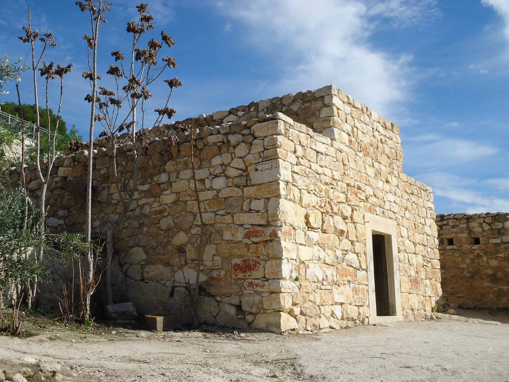

# Human-made Things in the Bible

## License Information

Human-made Things in the Bible © United Bible Societies, 2025. Adapted from: <cite>The Works of Their Hands: Man-made Things in the Bible</cite>, by Ray Pritz © 2009 United Bible Societies. This work is licensed under Creative Commons Attribution-ShareAlike 4.0 International (<a href="https://creativecommons.org/licenses/by-sa/4.0/">https://creativecommons.org/licenses/by-sa/4.0/</a>).

--------------------------------

## 标题：会堂、犹太会堂（synagogue） (id: REALIA:3.17)

3\.17 标题：会堂、犹太会堂（synagogue）
===========================

经文出处
----

Greek 希：ἀποσυνάγωγος (音译：aposunagōgos)

JHN 9:22, JHN 12:42, JHN 16:2

Greek 希：ἀρχισυνάγωγος (音译：archisunagōgos)

MRK 5:22, MRK 5:36, MRK 5:38, LUK 8:49, LUK 13:14, ACT 13:15, ACT 18:8, ACT 18:17

Greek 希：συναγωγή (音译：sunagōgē)

MAT 4:23, MAT 6:2, MAT 6:5, MAT 9:35, MAT 10:17, MAT 12:9, MAT 13:54, MAT 23:6, MAT 23:34, MRK 1:21, MRK 1:23, MRK 1:29, MRK 1:39, MRK 3:1, MRK 6:2, MRK 12:39, MRK 13:9, LUK 4:15, LUK 4:16, LUK 4:20, LUK 4:28, LUK 4:33, LUK 4:38, LUK 4:44, LUK 6:6, LUK 7:5, LUK 8:41, LUK 11:43, LUK 12:11, LUK 13:10, LUK 20:46, LUK 21:12, JHN 6:59, JHN 18:20, ACT 6:9, ACT 9:2, ACT 9:20, ACT 13:5, ACT 13:14, ACT 13:43, ACT 14:1, ACT 15:21, ACT 17:1, ACT 17:10, ACT 17:17, ACT 18:4, ACT 18:7, ACT 18:19, ACT 18:26, ACT 19:8, ACT 22:19, ACT 24:12, ACT 26:11, JAS 2:2, REV 2:9, REV 3:9

描述和用途
-----

*仿建的拿撒勒犹太会堂 (© Ray Pritz by United Bible Societies)*

犹太会堂是一个用于集会的建筑物，犹太人在里面进行各种宗教活动，如敬拜和教导律法等。在新约时期，犹太会堂并不大，通常比一个家大不了多少。

---

翻译
--

新约频繁提到犹太会堂，但令人惊讶的是，人们对会堂在当时的建筑结构知之甚少，因为在考古发掘中，几乎没有一间犹太会堂可以确定为耶稣时期的会堂。犹太会堂一直到新约时期以后，才有一些比较鲜明的建筑风格，在那之前可能只有固定的“朝向”（即朝向东方）。让翻译者长出一口气的是，他们的任务不需要了解会堂建筑结构的细节。

翻译者需要明确区分“犹太会堂”和“圣殿”，并且仅仅把犹太会堂称为“小圣殿”是不够的。会堂有很多座，但是只有一座位于耶路撒冷的圣殿，这座圣殿是犹太人可以献祭的唯一一个地方。翻译者最好借用一个词语来表示会堂，或者使用类似“犹太人敬拜上帝的地方”或“敬拜上帝的建筑物”这样的描述性对等语。

无论“犹太会堂”和“教会”这两个词语指的是会众还是建筑，都需要在译文中区分开来。

希腊文*sunagōgē* 在次经中大概出现了十几次，每次都是指会众或聚集的人。在这些书卷中，不应该把这个词译为某种建筑。

* **Associated Passages:** 约翰福音 9:22; 约翰福音 12:42; 约翰福音 16:2; 马可福音 5:22; 马可福音 5:36; 马可福音 5:38; 路加福音 8:49; 路加福音 13:14; 使徒行传 13:15; 使徒行传 18:8; 使徒行传 18:17; 马太福音 4:23; 马太福音 6:2; 马太福音 6:5; 马太福音 9:35; 马太福音 10:17; 马太福音 12:9; 马太福音 13:54; 马太福音 23:6; 马太福音 23:34; 马可福音 1:21; 马可福音 1:23; 马可福音 1:29; 马可福音 1:39; 马可福音 3:1; 马可福音 6:2; 马可福音 12:39; 马可福音 13:9; 路加福音 4:15; 路加福音 4:16; 路加福音 4:20; 路加福音 4:28; 路加福音 4:33; 路加福音 4:38; 路加福音 4:44; 路加福音 6:6; 路加福音 7:5; 路加福音 8:41; 路加福音 11:43; 路加福音 12:11; 路加福音 13:10; 路加福音 20:46; 路加福音 21:12; 约翰福音 6:59; 约翰福音 18:20; 使徒行传 6:9; 使徒行传 9:2; 使徒行传 9:20; 使徒行传 13:5; 使徒行传 13:14; 使徒行传 13:43; 使徒行传 14:1; 使徒行传 15:21; 使徒行传 17:1; 使徒行传 17:10; 使徒行传 17:17; 使徒行传 18:4; 使徒行传 18:7; 使徒行传 18:19; 使徒行传 18:26; 使徒行传 19:8; 使徒行传 22:19; 使徒行传 24:12; 使徒行传 26:11; 雅各书 2:2; 启示录 2:9; 启示录 3:9

* **Associated ACAI Concepts:** Synagogue (ID: `realia:Synagogue`)
