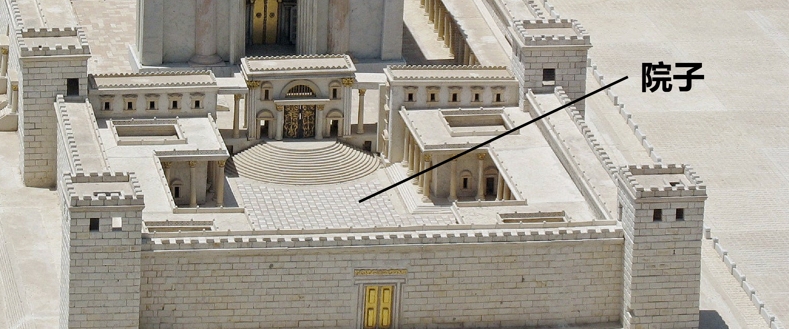

# Human-made Things in the Bible

## License Information

Human-made Things in the Bible © United Bible Societies, 2025. Adapted from: <cite>The Works of Their Hands: Man-made Things in the Bible</cite>, by Ray Pritz © 2009 United Bible Societies. This work is licensed under Creative Commons Attribution-ShareAlike 4.0 International (<a href="https://creativecommons.org/licenses/by-sa/4.0/">https://creativecommons.org/licenses/by-sa/4.0/</a>).

--------------------------------

## 标题：院子、院宇、宫廷（courtyard, court） (id: REALIA:3.20)

3\.20 标题：院子、院宇、宫廷（courtyard, court）
===================================

经文出处
----

Hebrew 来：חָצֵר (音译：chatser)

[EXO 8:9](https://ref.ly/Exod8:9), [EXO 27:9](https://ref.ly/Exod27:9), [EXO 27:9](https://ref.ly/Exod27:9), [EXO 27:12](https://ref.ly/Exod27:12), [EXO 27:13](https://ref.ly/Exod27:13), [EXO 27:16](https://ref.ly/Exod27:16), [EXO 27:17](https://ref.ly/Exod27:17), [EXO 27:18](https://ref.ly/Exod27:18), [EXO 27:19](https://ref.ly/Exod27:19), [EXO 35:17](https://ref.ly/Exod35:17), [EXO 35:17](https://ref.ly/Exod35:17), [EXO 35:18](https://ref.ly/Exod35:18), [EXO 38:9](https://ref.ly/Exod38:9), [EXO 38:9](https://ref.ly/Exod38:9), [EXO 38:15](https://ref.ly/Exod38:15), [EXO 38:16](https://ref.ly/Exod38:16), [EXO 38:17](https://ref.ly/Exod38:17), [EXO 38:18](https://ref.ly/Exod38:18), [EXO 38:18](https://ref.ly/Exod38:18), [EXO 38:20](https://ref.ly/Exod38:20), [EXO 38:31](https://ref.ly/Exod38:31), [EXO 38:31](https://ref.ly/Exod38:31), [EXO 38:31](https://ref.ly/Exod38:31), [EXO 39:40](https://ref.ly/Exod39:40), [EXO 39:40](https://ref.ly/Exod39:40), [EXO 40:8](https://ref.ly/Exod40:8), [EXO 40:8](https://ref.ly/Exod40:8), [EXO 40:33](https://ref.ly/Exod40:33), [EXO 40:33](https://ref.ly/Exod40:33), [LEV 6:9](https://ref.ly/Lev6:9), [LEV 6:19](https://ref.ly/Lev6:19), [NUM 3:26](https://ref.ly/Num3:26), [NUM 3:26](https://ref.ly/Num3:26), [NUM 3:37](https://ref.ly/Num3:37), [NUM 4:26](https://ref.ly/Num4:26), [NUM 4:26](https://ref.ly/Num4:26), [NUM 4:32](https://ref.ly/Num4:32), [2SA 17:18](https://ref.ly/2Sam17:18), [1KI 6:36](https://ref.ly/1Kgs6:36), [1KI 7:8](https://ref.ly/1Kgs7:8), [1KI 7:9](https://ref.ly/1Kgs7:9), [1KI 7:12](https://ref.ly/1Kgs7:12), [1KI 7:12](https://ref.ly/1Kgs7:12), [1KI 8:64](https://ref.ly/1Kgs8:64), [2KI 20:4](https://ref.ly/2Kgs20:4), [2KI 21:5](https://ref.ly/2Kgs21:5), [2KI 23:12](https://ref.ly/2Kgs23:12), [1CH 23:28](https://ref.ly/1Chr23:28), [1CH 28:6](https://ref.ly/1Chr28:6), [1CH 28:12](https://ref.ly/1Chr28:12), [2CH 4:9](https://ref.ly/2Chr4:9), [2CH 7:7](https://ref.ly/2Chr7:7), [2CH 20:5](https://ref.ly/2Chr20:5), [2CH 23:5](https://ref.ly/2Chr23:5), [2CH 24:21](https://ref.ly/2Chr24:21), [2CH 29:16](https://ref.ly/2Chr29:16), [2CH 33:5](https://ref.ly/2Chr33:5), [NEH 3:25](https://ref.ly/Neh3:25), [NEH 8:16](https://ref.ly/Neh8:16), [NEH 8:16](https://ref.ly/Neh8:16), [NEH 13:7](https://ref.ly/Neh13:7), [EST 1:5](https://ref.ly/Esth1:5), [EST 2:11](https://ref.ly/Esth2:11), [EST 4:11](https://ref.ly/Esth4:11), [EST 5:1](https://ref.ly/Esth5:1), [EST 5:2](https://ref.ly/Esth5:2), [EST 6:4](https://ref.ly/Esth6:4), [EST 6:4](https://ref.ly/Esth6:4), [EST 6:5](https://ref.ly/Esth6:5), [PSA 65:5](https://ref.ly/Ps65:5), [PSA 84:3](https://ref.ly/Ps84:3), [PSA 84:11](https://ref.ly/Ps84:11), [PSA 92:14](https://ref.ly/Ps92:14), [PSA 96:8](https://ref.ly/Ps96:8), [PSA 100:4](https://ref.ly/Ps100:4), [PSA 116:19](https://ref.ly/Ps116:19), [PSA 135:2](https://ref.ly/Ps135:2), [ISA 1:12](https://ref.ly/Isa1:12), [ISA 62:9](https://ref.ly/Isa62:9), [JER 19:14](https://ref.ly/Jer19:14), [JER 26:2](https://ref.ly/Jer26:2), [JER 32:2](https://ref.ly/Jer32:2), [JER 32:8](https://ref.ly/Jer32:8), [JER 32:12](https://ref.ly/Jer32:12), [JER 33:1](https://ref.ly/Jer33:1), [JER 36:10](https://ref.ly/Jer36:10), [JER 36:20](https://ref.ly/Jer36:20), [JER 37:21](https://ref.ly/Jer37:21), [JER 37:21](https://ref.ly/Jer37:21), [JER 38:6](https://ref.ly/Jer38:6), [JER 38:13](https://ref.ly/Jer38:13), [JER 38:28](https://ref.ly/Jer38:28), [JER 39:14](https://ref.ly/Jer39:14), [JER 39:15](https://ref.ly/Jer39:15), [EZK 8:7](https://ref.ly/Ezek8:7), [EZK 8:16](https://ref.ly/Ezek8:16), [EZK 9:7](https://ref.ly/Ezek9:7), [EZK 10:3](https://ref.ly/Ezek10:3), [EZK 10:4](https://ref.ly/Ezek10:4), [EZK 10:5](https://ref.ly/Ezek10:5), [EZK 40:14](https://ref.ly/Ezek40:14), [EZK 40:17](https://ref.ly/Ezek40:17), [EZK 40:17](https://ref.ly/Ezek40:17), [EZK 40:19](https://ref.ly/Ezek40:19), [EZK 40:20](https://ref.ly/Ezek40:20), [EZK 40:23](https://ref.ly/Ezek40:23), [EZK 40:27](https://ref.ly/Ezek40:27), [EZK 40:28](https://ref.ly/Ezek40:28), [EZK 40:31](https://ref.ly/Ezek40:31), [EZK 40:32](https://ref.ly/Ezek40:32), [EZK 40:34](https://ref.ly/Ezek40:34), [EZK 40:37](https://ref.ly/Ezek40:37), [EZK 40:44](https://ref.ly/Ezek40:44), [EZK 40:47](https://ref.ly/Ezek40:47), [EZK 41:15](https://ref.ly/Ezek41:15), [EZK 42:1](https://ref.ly/Ezek42:1), [EZK 42:3](https://ref.ly/Ezek42:3), [EZK 42:3](https://ref.ly/Ezek42:3), [EZK 42:6](https://ref.ly/Ezek42:6), [EZK 42:7](https://ref.ly/Ezek42:7), [EZK 42:8](https://ref.ly/Ezek42:8), [EZK 42:9](https://ref.ly/Ezek42:9), [EZK 42:10](https://ref.ly/Ezek42:10), [EZK 42:14](https://ref.ly/Ezek42:14), [EZK 43:5](https://ref.ly/Ezek43:5), [EZK 44:17](https://ref.ly/Ezek44:17), [EZK 44:17](https://ref.ly/Ezek44:17), [EZK 44:19](https://ref.ly/Ezek44:19), [EZK 44:19](https://ref.ly/Ezek44:19), [EZK 44:21](https://ref.ly/Ezek44:21), [EZK 44:27](https://ref.ly/Ezek44:27), [EZK 45:19](https://ref.ly/Ezek45:19), [EZK 46:1](https://ref.ly/Ezek46:1), [EZK 46:20](https://ref.ly/Ezek46:20), [EZK 46:21](https://ref.ly/Ezek46:21), [EZK 46:21](https://ref.ly/Ezek46:21), [EZK 46:21](https://ref.ly/Ezek46:21), [EZK 46:21](https://ref.ly/Ezek46:21), [EZK 46:21](https://ref.ly/Ezek46:21), [EZK 46:21](https://ref.ly/Ezek46:21), [EZK 46:22](https://ref.ly/Ezek46:22), [EZK 46:22](https://ref.ly/Ezek46:22), [ZEC 3:7](https://ref.ly/Zech3:7)

Hebrew 来：עֲזָרָה (音译：‘azarah)

[2CH 4:9](https://ref.ly/2Chr4:9), [2CH 4:9](https://ref.ly/2Chr4:9), [2CH 6:13](https://ref.ly/2Chr6:13)

Greek 希：αὐλαῖος (音译：aulaios)

[2MA 14:41](https://ref.ly/2Macc14:41)

Greek 希：αὐλή (音译：aulē)

[MAT 26:3](https://ref.ly/Matt26:3), [MAT 26:58](https://ref.ly/Matt26:58), [MAT 26:69](https://ref.ly/Matt26:69), [MRK 14:54](https://ref.ly/Mark14:54), [MRK 14:66](https://ref.ly/Mark14:66), [MRK 15:16](https://ref.ly/Mark15:16), [LUK 11:21](https://ref.ly/Luke11:21), [LUK 22:55](https://ref.ly/Luke22:55), [JHN 18:15](https://ref.ly/John18:15), [REV 11:2](https://ref.ly/Rev11:2), [TOB 2:9](https://ref.ly/Tob2:9), [TOB 2:9](https://ref.ly/Tob2:9), [ESG 1:1](https://ref.ly/EsthGr1:1), [ESG 2:11](https://ref.ly/EsthGr2:11), [ESG 4:2](https://ref.ly/EsthGr4:2), [LJE 1:17](https://ref.ly/EpJer1:17), [1MA 4:38](https://ref.ly/1Macc4:38), [1MA 4:48](https://ref.ly/1Macc4:48), [1MA 9:54](https://ref.ly/1Macc9:54), [1MA 11:46](https://ref.ly/1Macc11:46), [3MA 2:27](https://ref.ly/3Macc2:27), [3MA 5:10](https://ref.ly/3Macc5:10), [3MA 5:46](https://ref.ly/3Macc5:46), [1ES 9:1](https://ref.ly/1Esd9:1)

Greek 希：περιβολή (音译：peribolē)

[SIR 50:11](https://ref.ly/Sir50:11)

Aramaic 兰：תְּרַע (音译：tera‘)

[DAN 2:49](https://ref.ly/Dan2:49)

描述
--

*房屋的院子 (Daderot, CC0, via Wikimedia Commons)*

院子是圣殿、宫殿等建筑群，甚至是一所房子里面，由一些构筑物所围成的露天区域。

---

翻译
--

“院”一词在圣经原文语言中既指实际的庭院，也指君王的住所或活动场所，这一点和英文的用法一样。

*圣殿的院子 (© Ariely, CC BY 3\.0, via Wikimedia Commons)*

在旧约中，尤其是在《诗篇》中，我们多次看到“耶和华的院宇”、“你的院宇”或“我的院宇”这样的短语。在这些经文中，“院宇”一词是帐幕或圣殿的换喻，必要时可翻译成帐幕或圣殿。例如，在[PSA 65:5](https://ref.ly/Ps65:5) （《和》65:4）中，可译为“你的圣所”（GNT (Good News Translation (1992)) 直译）、“你的殿”（CEV (Contemporary English Version) 直译）。翻译者应避免使用表示法庭的词语。

希腊文*aulē* 在一些经文中指的是私人住宅的院子，如[MAT 26:3](https://ref.ly/Matt26:3) 和[LUK 11:21](https://ref.ly/Luke11:21) ，因此CEV (Contemporary English Version) 在这两处将这个词译为“home”（“家”）。

[REV 11:2](https://ref.ly/Rev11:2) ：“殿外的院子”（RSV (Revised Standard Version (1952)) 直译）就是外邦人院，那里是外邦人可以进入的地方。但他们不能靠近里面的圣所。在本节经文中，院子和其中的人代表非信徒，他们无法幸免即将到来的灾难。另外，这节经文中的第一个分还可以翻译为：“但是不要测量圣殿外面用墙围起来的空地。”

* **Associated Passages:** 出埃及记 8:9; 出埃及记 27:9; 出埃及记 27:12; 出埃及记 27:13; 出埃及记 27:16; 出埃及记 27:17; 出埃及记 27:18; 出埃及记 27:19; 出埃及记 35:17; 出埃及记 35:18; 出埃及记 38:9; 出埃及记 38:15; 出埃及记 38:16; 出埃及记 38:17; 出埃及记 38:18; 出埃及记 38:20; 出埃及记 38:31; 出埃及记 39:40; 出埃及记 40:8; 出埃及记 40:33; 利未记 6:9; 利未记 6:19; 民数记 3:26; 民数记 3:37; 民数记 4:26; 民数记 4:32; 撒母耳记下 17:18; 列王纪上 6:36; 列王纪上 7:8; 列王纪上 7:9; 列王纪上 7:12; 列王纪上 8:64; 列王纪下 20:4; 列王纪下 21:5; 列王纪下 23:12; 历代志上 23:28; 历代志上 28:6; 历代志上 28:12; 历代志下 4:9; 历代志下 7:7; 历代志下 20:5; 历代志下 23:5; 历代志下 24:21; 历代志下 29:16; 历代志下 33:5; 尼希米记 3:25; 尼希米记 8:16; 尼希米记 13:7; 以斯帖记 1:5; 以斯帖记 2:11; 以斯帖记 4:11; 以斯帖记 5:1; 以斯帖记 5:2; 以斯帖记 6:4; 以斯帖记 6:5; 诗篇 65:5; 诗篇 84:3; 诗篇 84:11; 诗篇 92:14; 诗篇 96:8; 诗篇 100:4; 诗篇 116:19; 诗篇 135:2; 以赛亚书 1:12; 以赛亚书 62:9; 耶利米书 19:14; 耶利米书 26:2; 耶利米书 32:2; 耶利米书 32:8; 耶利米书 32:12; 耶利米书 33:1; 耶利米书 36:10; 耶利米书 36:20; 耶利米书 37:21; 耶利米书 38:6; 耶利米书 38:13; 耶利米书 38:28; 耶利米书 39:14; 耶利米书 39:15; 以西结书 8:7; 以西结书 8:16; 以西结书 9:7; 以西结书 10:3; 以西结书 10:4; 以西结书 10:5; 以西结书 40:14; 以西结书 40:17; 以西结书 40:19; 以西结书 40:20; 以西结书 40:23; 以西结书 40:27; 以西结书 40:28; 以西结书 40:31; 以西结书 40:32; 以西结书 40:34; 以西结书 40:37; 以西结书 40:44; 以西结书 40:47; 以西结书 41:15; 以西结书 42:1; 以西结书 42:3; 以西结书 42:6; 以西结书 42:7; 以西结书 42:8; 以西结书 42:9; 以西结书 42:10; 以西结书 42:14; 以西结书 43:5; 以西结书 44:17; 以西结书 44:19; 以西结书 44:21; 以西结书 44:27; 以西结书 45:19; 以西结书 46:1; 以西结书 46:20; 以西结书 46:21; 以西结书 46:22; 撒迦利亚书 3:7; 历代志下 6:13; 玛加伯下 14:41; 马太福音 26:3; 马太福音 26:58; 马太福音 26:69; 马可福音 14:54; 马可福音 14:66; 马可福音 15:16; 路加福音 11:21; 路加福音 22:55; 约翰福音 18:15; 启示录 11:2; 多俾亚传 2:9; 以斯帖记补篇 1:1; 以斯帖记补篇 2:11; 以斯帖记补篇 4:2; 耶利米书信 1:17; 玛加伯上 4:38; 玛加伯上 4:48; 玛加伯上 9:54; 玛加伯上 11:46; 玛加伯三书 2:27; 玛加伯三书 5:10; 玛加伯三书 5:46; 厄斯德拉上 9:1; 德训篇 50:11; 但以理书 2:49

