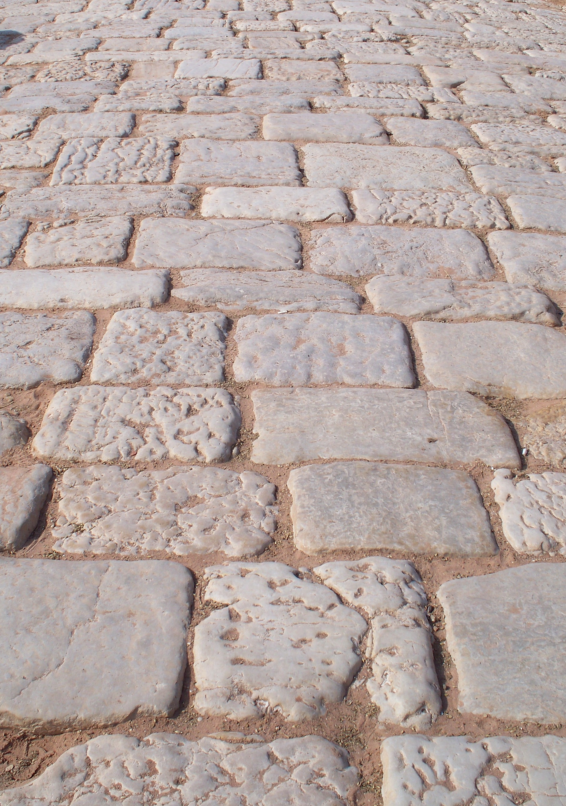

# Human-made Things in the Bible

## License Information

Human-made Things in the Bible © United Bible Societies, 2025. Adapted from: <cite>The Works of Their Hands: Man-made Things in the Bible</cite>, by Ray Pritz © 2009 United Bible Societies. This work is licensed under Creative Commons Attribution-ShareAlike 4.0 International (<a href="https://creativecommons.org/licenses/by-sa/4.0/">https://creativecommons.org/licenses/by-sa/4.0/</a>).

--------------------------------

## 标题：铺道、石板地、铺石地、铺华石处（pavement, The Pavement） (id: REALIA:3.20.1)

3\.20\.1 标题：铺道、石板地、铺石地、铺华石处（pavement, The Pavement）
===================================================

经文出处
----

Hebrew 来：לְבֵנָה (音译：lvenah)

[EXO 24:10](https://ref.ly/Exod24:10)

Hebrew 来：מַלְבֵּן (音译：malben)

[JER 43:9](https://ref.ly/Jer43:9)

Hebrew 来：רִצְפָה (音译：ritsfah)

[2CH 7:3](https://ref.ly/2Chr7:3), [EST 1:6](https://ref.ly/Esth1:6), [EZK 40:17](https://ref.ly/Ezek40:17), [EZK 40:17](https://ref.ly/Ezek40:17), [EZK 40:18](https://ref.ly/Ezek40:18), [EZK 40:18](https://ref.ly/Ezek40:18), [EZK 42:3](https://ref.ly/Ezek42:3)

Greek 希：λιθόστρωτον (音译：lithostrōton)

[JHN 19:13](https://ref.ly/John19:13)

Greek 希：ἔδαφος (音译：edafos)

[SIR 11:5](https://ref.ly/Sir11:5), [SIR 20:18](https://ref.ly/Sir20:18), [BEL 1:19](https://ref.ly/Bel1:19), [3MA 2:22](https://ref.ly/3Macc2:22), [4MA 6:7](https://ref.ly/4Macc6:7)

描述和用途
-----

*罗马人行道，佩特拉（Petra） (© High Contrast, CC BY 3\.0 DE, via Wikimedia Commons)*

石板地是用扁平的石块铺成的一个区域，该区域形成一个庭院（而不是道路）。“铺华石处”是罗马人的安东尼亚堡内庭院的名称，该堡与耶路撒冷圣殿建筑群的西北角相接。

---

翻译
--

[JER 43:9](https://ref.ly/Jer43:9) ：希伯来文*malben* 出现在其他地方时，意为“砖模”或“砖窑”（参[1\.8\.1 砖模、砖窑 (brick mold, brickkiln)\<REALIA:1\.8\.1\>](#) 中的讨论及经文出处）。在这节经文中，该词似乎是指铺地的材料；许多译本都将这个词译为“铺砖路面”（如NIV (New International Version (1984)) 、NCV (New Century Version) 、CEV (Contemporary English Version) ）。上帝吩咐耶利米把石头藏在“*malben* 的*melet* 中”。希伯来文*melet* 只出现在此处，意思不确定。各译本通常把它译为铺设砖块时用到的某种材料，例如“黏土”（“clay”；NRSV (New Revised Standard Version (1989)) 、NIV (New International Version (1984)) 、NCV (New Century Version) ）、“砂浆”（“mortar”；RSV (Revised Standard Version (1952)) 、GNT (Good News Translation (1992)) ）或“水泥”（“cement”；REB (Revised English Bible (1989)) ）。CEV (Contemporary English Version) 避免使用特定材料的名称，而是着重于位置，英文意为“在铺砖路面下面”。

[JHN 19:13](https://ref.ly/John19:13) ：在一些语言中，翻译者可以把“铺华石处”译为：“用大块扁平石头铺成的院子”，或“铺着石头的院子”。

希腊文*edafos* 并不是指某个特定的地方，甚至不是指某种特殊的建筑。因此，翻译者可以使用一个统称，例如“地板”，甚至是“地面”。

* **Associated Passages:** 出埃及记 24:10; 耶利米书 43:9; 历代志下 7:3; 以斯帖记 1:6; 以西结书 40:17; 以西结书 40:18; 以西结书 42:3; 约翰福音 19:13; 德训篇 11:5; 德训篇 20:18; 彼勒与大龙 1:19; 玛加伯三书 2:22; 玛加伯四书 6:7

