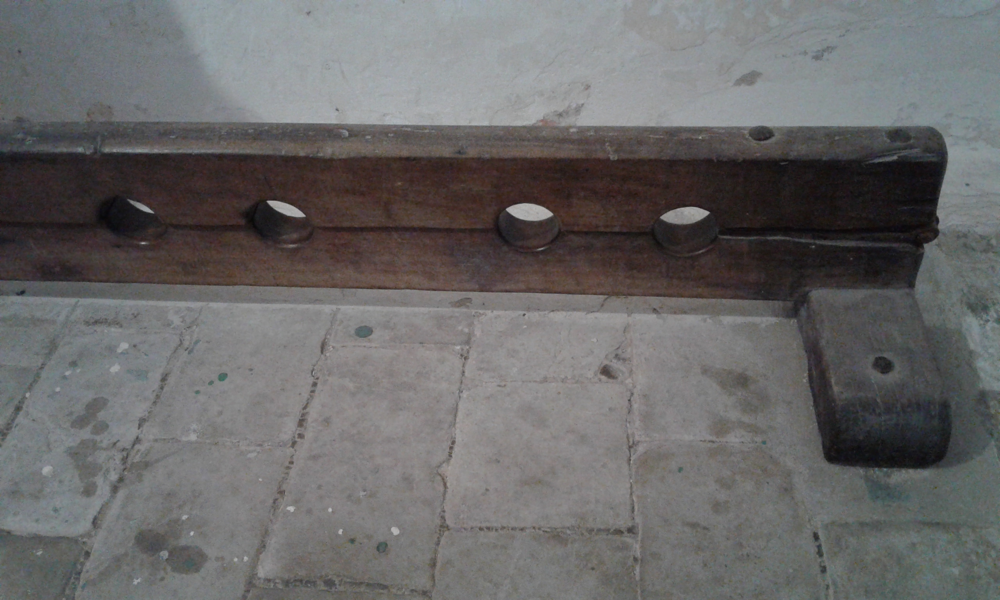

# Human-made Things in the Bible

## License Information

Human-made Things in the Bible © United Bible Societies, 2025. Adapted from: <cite>The Works of Their Hands: Man-made Things in the Bible</cite>, by Ray Pritz © 2009 United Bible Societies. This work is licensed under Creative Commons Attribution-ShareAlike 4.0 International (<a href="https://creativecommons.org/licenses/by-sa/4.0/">https://creativecommons.org/licenses/by-sa/4.0/</a>).

--------------------------------

## 标题：木枷、枷锁、木狗、木架（stocks） (id: REALIA:3.21.2)

3\.21\.2 标题：木枷、枷锁、木狗、木架（stocks）
===============================

经文出处
----

Hebrew 来：מַהְפֶּכֶת (音译：mahpeketh)

[2CH 16:10](https://ref.ly/2Chr16:10), [JER 20:2](https://ref.ly/Jer20:2), [JER 20:3](https://ref.ly/Jer20:3), [JER 29:26](https://ref.ly/Jer29:26)

Hebrew 来：סַד (音译：sad)

[JOB 13:27](https://ref.ly/Job13:27), [JOB 33:11](https://ref.ly/Job33:11)

Greek 希：ξύλον (音译：xulon)

[ACT 16:24](https://ref.ly/Acts16:24)

描述和用途
-----

*木制脚锁 (© Connorisda1 \- Wikimedia Commons)*

木枷是一种由木头构件组装而成的装置，把犯人的腿、臂和／或头放在木枷中间，然后牢牢地固定住。两块木头构件上各有几个半圆形的洞，把它们合到一起，就形成几个圆形的孔，固定住犯人的四肢或头。然后，把两块木板锁在一起，这样囚犯就无法动弹了。木枷既是一种监禁的工具，也是一种刑罚手段。

---

翻译
--

*(Image generated by ChatGPT using OpenAI technology)*

许多译本都需要用一个描述性短语来表示“木枷”，才能准确表达出它的意思。比较NCV (New Century Version) 中的[JER 20:2](https://ref.ly/Jer20:2) ，英文意为：“他把耶利米的手和脚都锁到大木块中间。”

[JOB 13:27](https://ref.ly/Job13:27) ：在这节经文中，约伯把自己描绘成上帝的囚犯，行动受到严重的限制。第一行经文中的“木枷”指的是用来锁住囚犯双脚的木块，但根据第二行经文，约伯也许还可以略微活动。有译本把第一行译为：“你在我脚上绑上锁链”（GNT (Good News Translation (1992)) 直译）。这行也可以译为：“你把我的脚绑在一起”，或“你绑住了我的脚，让我无法行走”。

[ACT 16:24](https://ref.ly/Acts16:24) ：对于“在木枷中”（RSV (Revised Standard Version (1952)) 直译）这个短语，GNT (Good News Translation (1992)) 英文意为“在很重的木块之间”。GNT (Good News Translation (1992)) 没有使用“木枷”一词有两个原因：（1）翻译者认为目标读者难以理解该词的含义；（2）罗马人使用的木枷与其他已知的木枷种类不同。罗马人用木枷作为一种刑具，上面有多对固定腿的孔，从而可以把囚犯的双腿分得很开，造成极大的疼痛。

* **Associated Passages:** 历代志下 16:10; 耶利米书 20:2; 耶利米书 20:3; 耶利米书 29:26; 约伯记 13:27; 约伯记 33:11; 使徒行传 16:24

