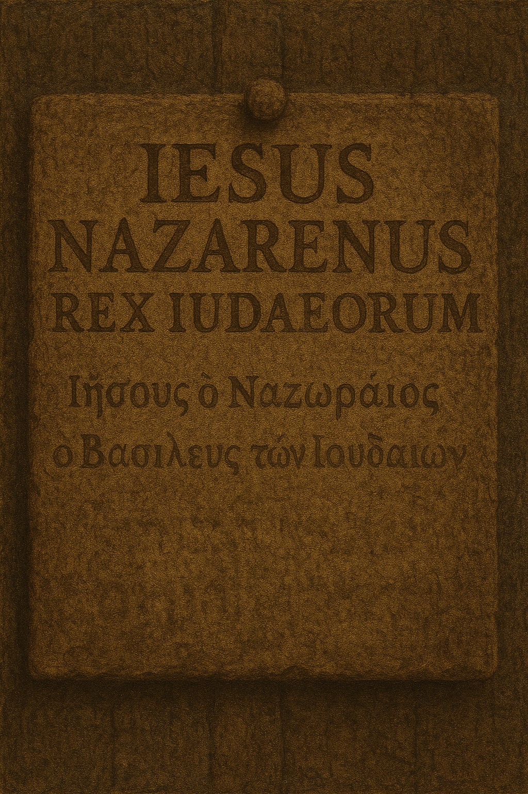
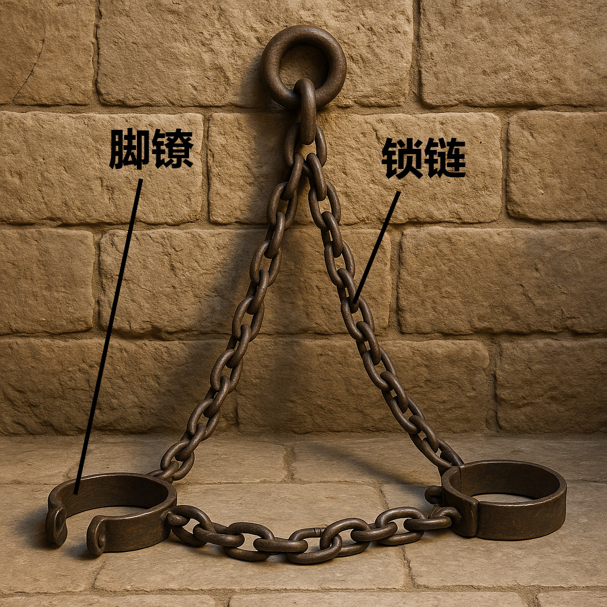

# Human-made Things in the Bible

## License Information

Human-made Things in the Bible © United Bible Societies, 2025. Adapted from: <cite>The Works of Their Hands: Man-made Things in the Bible</cite>, by Ray Pritz © 2009 United Bible Societies. This work is licensed under Creative Commons Attribution-ShareAlike 4.0 International (<a href="https://creativecommons.org/licenses/by-sa/4.0/">https://creativecommons.org/licenses/by-sa/4.0/</a>).

--------------------------------

## 标题：监狱及刑罚（prison and penal activity） (id: REALIA:3.21)

3\.21 标题：监狱及刑罚（prison and penal activity）
=========================================

## 标题：监狱、监牢、地牢（prison, dungeon） (id: REALIA:3.21.1)

3\.21\.1 标题：监狱、监牢、地牢（prison, dungeon）
=====================================

经文出处
----

Hebrew 来：בַּיִת, אסר, אָסִיר, אֵסוּר (音译：beyth ’esur, beyth ’asurim, beyth hasurim)

[JDG 16:21](https://ref.ly/Judg16:21), [JDG 16:21](https://ref.ly/Judg16:21), [JDG 16:21](https://ref.ly/Judg16:21), [JDG 16:25](https://ref.ly/Judg16:25), [JDG 16:25](https://ref.ly/Judg16:25), [ECC 4:14](https://ref.ly/Eccl4:14), [JER 37:15](https://ref.ly/Jer37:15)

Hebrew 来：בַּיִת, בּוֹר (音译：(beyth) bor)

[GEN 40:15](https://ref.ly/Gen40:15), [GEN 41:14](https://ref.ly/Gen41:14), [EXO 12:29](https://ref.ly/Exod12:29), [ISA 24:22](https://ref.ly/Isa24:22), [JER 37:16](https://ref.ly/Jer37:16), [JER 38:6](https://ref.ly/Jer38:6), [JER 38:7](https://ref.ly/Jer38:7), [JER 38:9](https://ref.ly/Jer38:9), [JER 38:10](https://ref.ly/Jer38:10), [JER 38:11](https://ref.ly/Jer38:11), [JER 38:13](https://ref.ly/Jer38:13)

Hebrew 来：בַּיִת, כֶּלֶא, כְּלִיא (音译：(beyth) kele’, beyth kelu’)

[1KI 22:27](https://ref.ly/1Kgs22:27), [2KI 17:4](https://ref.ly/2Kgs17:4), [2KI 25:27](https://ref.ly/2Kgs25:27), [2KI 25:29](https://ref.ly/2Kgs25:29), [2CH 18:26](https://ref.ly/2Chr18:26), [ISA 42:7](https://ref.ly/Isa42:7), [ISA 42:22](https://ref.ly/Isa42:22), [JER 37:4](https://ref.ly/Jer37:4), [JER 37:15](https://ref.ly/Jer37:15), [JER 37:18](https://ref.ly/Jer37:18), [JER 52:31](https://ref.ly/Jer52:31), [JER 52:33](https://ref.ly/Jer52:33)

Hebrew 来：בַּיִת, מִשְׁמָר (音译：beyth mishmar)

[GEN 42:19](https://ref.ly/Gen42:19)

Hebrew 来：בַּיִת, פְּקֻדָּה (音译：beyth pqudoth)

[JER 52:11](https://ref.ly/Jer52:11)

Hebrew 来：בַּיִת, סֹהַר (音译：beyth sohar)

[GEN 39:20](https://ref.ly/Gen39:20), [GEN 39:20](https://ref.ly/Gen39:20), [GEN 39:21](https://ref.ly/Gen39:21), [GEN 39:22](https://ref.ly/Gen39:22), [GEN 39:22](https://ref.ly/Gen39:22), [GEN 39:23](https://ref.ly/Gen39:23), [GEN 40:3](https://ref.ly/Gen40:3), [GEN 40:3](https://ref.ly/Gen40:3)

Aramaic 兰：גֹּב (音译：gov)

[DAN 6:8](https://ref.ly/Dan6:8), [DAN 6:13](https://ref.ly/Dan6:13), [DAN 6:17](https://ref.ly/Dan6:17), [DAN 6:18](https://ref.ly/Dan6:18), [DAN 6:20](https://ref.ly/Dan6:20), [DAN 6:21](https://ref.ly/Dan6:21), [DAN 6:24](https://ref.ly/Dan6:24), [DAN 6:24](https://ref.ly/Dan6:24), [DAN 6:25](https://ref.ly/Dan6:25), [DAN 6:25](https://ref.ly/Dan6:25)

Hebrew 来：מַטָּרָה (音译：matarah)

[NEH 3:25](https://ref.ly/Neh3:25), [NEH 12:39](https://ref.ly/Neh12:39), [JER 32:2](https://ref.ly/Jer32:2), [JER 32:8](https://ref.ly/Jer32:8), [JER 32:12](https://ref.ly/Jer32:12), [JER 33:1](https://ref.ly/Jer33:1), [JER 37:21](https://ref.ly/Jer37:21), [JER 37:21](https://ref.ly/Jer37:21), [JER 38:6](https://ref.ly/Jer38:6), [JER 38:13](https://ref.ly/Jer38:13), [JER 38:28](https://ref.ly/Jer38:28), [JER 39:14](https://ref.ly/Jer39:14), [JER 39:15](https://ref.ly/Jer39:15)

Hebrew 来：מַסְגֵּר (音译：masger)

[PSA 142:8](https://ref.ly/Ps142:8), [ISA 24:22](https://ref.ly/Isa24:22), [ISA 42:7](https://ref.ly/Isa42:7)

Hebrew 来：עֹצֶר (音译：‘otser)

[ISA 53:8](https://ref.ly/Isa53:8)

Greek 希：δεσμωτήριον (音译：desmōtērion)

[MAT 11:2](https://ref.ly/Matt11:2), [ACT 5:21](https://ref.ly/Acts5:21), [ACT 5:23](https://ref.ly/Acts5:23), [ACT 16:26](https://ref.ly/Acts16:26)

Greek 希：εἱρκτή (音译：heirktē)

[WIS 17:15](https://ref.ly/Wis17:15)

Greek 希：λάκκος (音译：lakkos)

[WIS 10:14](https://ref.ly/Wis10:14), [BEL 1:31](https://ref.ly/Bel1:31), [BEL 1:32](https://ref.ly/Bel1:32), [BEL 1:34](https://ref.ly/Bel1:34), [BEL 1:35](https://ref.ly/Bel1:35), [BEL 1:36](https://ref.ly/Bel1:36), [BEL 1:40](https://ref.ly/Bel1:40), [BEL 1:42](https://ref.ly/Bel1:42), [4MA 18:13](https://ref.ly/4Macc18:13)

Greek 希：τήρησις (音译：tērēsis)

[ACT 4:3](https://ref.ly/Acts4:3), [ACT 5:18](https://ref.ly/Acts5:18)

Greek 希：φυλακή (音译：fulakē)

[MAT 5:25](https://ref.ly/Matt5:25), [MAT 14:3](https://ref.ly/Matt14:3), [MAT 14:10](https://ref.ly/Matt14:10), [MAT 18:30](https://ref.ly/Matt18:30), [MAT 25:36](https://ref.ly/Matt25:36), [MAT 25:39](https://ref.ly/Matt25:39), [MAT 25:43](https://ref.ly/Matt25:43), [MAT 25:44](https://ref.ly/Matt25:44), [MRK 6:17](https://ref.ly/Mark6:17), [MRK 6:27](https://ref.ly/Mark6:27), [LUK 3:20](https://ref.ly/Luke3:20), [LUK 12:58](https://ref.ly/Luke12:58), [LUK 21:12](https://ref.ly/Luke21:12), [LUK 22:33](https://ref.ly/Luke22:33), [LUK 23:19](https://ref.ly/Luke23:19), [LUK 23:25](https://ref.ly/Luke23:25), [JHN 3:24](https://ref.ly/John3:24), [ACT 5:19](https://ref.ly/Acts5:19), [ACT 5:22](https://ref.ly/Acts5:22), [ACT 5:25](https://ref.ly/Acts5:25), [ACT 8:3](https://ref.ly/Acts8:3), [ACT 12:4](https://ref.ly/Acts12:4), [ACT 12:5](https://ref.ly/Acts12:5), [ACT 12:6](https://ref.ly/Acts12:6), [ACT 12:17](https://ref.ly/Acts12:17), [ACT 16:23](https://ref.ly/Acts16:23), [ACT 16:24](https://ref.ly/Acts16:24), [ACT 16:27](https://ref.ly/Acts16:27), [ACT 16:37](https://ref.ly/Acts16:37), [ACT 16:40](https://ref.ly/Acts16:40), [ACT 22:4](https://ref.ly/Acts22:4), [ACT 26:10](https://ref.ly/Acts26:10), [2CO 6:5](https://ref.ly/2Cor6:5), [2CO 11:23](https://ref.ly/2Cor11:23), [HEB 11:36](https://ref.ly/Heb11:36), [1PE 3:19](https://ref.ly/1Pet3:19), [REV 2:10](https://ref.ly/Rev2:10), [REV 20:7](https://ref.ly/Rev20:7), [4MA 18:11](https://ref.ly/4Macc18:11)

描述和用途
-----

监狱是关押罪犯或其他囚犯的地方。监狱或监牢没有标准的大小或建筑结构。

---

翻译
--

几乎所有语言都有表示监狱或监牢的词语，但在某些情况下，可能要使用描述性短语，例如“把人绑起来的地方”或“人被链子锁起来的地方”。在有些语言中，人们会使用一些惯用语，例如“吃铁的地方”或“与老鼠呆在一起的房间”。译文要传递出这样的意思：这是一个违背某人的意志、强行约束他的地方。

希伯来文*bor* 、亚兰文*gov* 和希腊文*lakkos* 都是指地上的洞或凹坑。在[JER 38:0](https://ref.ly/Jer38:0) 中，耶利米被下到*bor* ，这可能是一个蓄水池（参[3\.9 蓄水池 (cistern)\<REALIA:3\.9\>](#) ）。在出现这三个词语的其他经文中，并不确知这些洞或坑是天然形成的还是人造的。

* **Associated Passages:** 士师记 16:21; 士师记 16:25; 传道书 4:14; 耶利米书 37:15; 创世记 40:15; 创世记 41:14; 出埃及记 12:29; 以赛亚书 24:22; 耶利米书 37:16; 耶利米书 38:6; 耶利米书 38:7; 耶利米书 38:9; 耶利米书 38:10; 耶利米书 38:11; 耶利米书 38:13; 列王纪上 22:27; 列王纪下 17:4; 列王纪下 25:27; 列王纪下 25:29; 历代志下 18:26; 以赛亚书 42:7; 以赛亚书 42:22; 耶利米书 37:4; 耶利米书 37:18; 耶利米书 52:31; 耶利米书 52:33; 创世记 42:19; 耶利米书 52:11; 创世记 39:20; 创世记 39:21; 创世记 39:22; 创世记 39:23; 创世记 40:3; 但以理书 6:8; 但以理书 6:13; 但以理书 6:17; 但以理书 6:18; 但以理书 6:20; 但以理书 6:21; 但以理书 6:24; 但以理书 6:25; 尼希米记 3:25; 尼希米记 12:39; 耶利米书 32:2; 耶利米书 32:8; 耶利米书 32:12; 耶利米书 33:1; 耶利米书 37:21; 耶利米书 38:28; 耶利米书 39:14; 耶利米书 39:15; 诗篇 142:8; 以赛亚书 53:8; 马太福音 11:2; 使徒行传 5:21; 使徒行传 5:23; 使徒行传 16:26; 智慧篇 17:15; 智慧篇 10:14; 彼勒与大龙 1:31; 彼勒与大龙 1:32; 彼勒与大龙 1:34; 彼勒与大龙 1:35; 彼勒与大龙 1:36; 彼勒与大龙 1:40; 彼勒与大龙 1:42; 玛加伯四书 18:13; 使徒行传 4:3; 使徒行传 5:18; 马太福音 5:25; 马太福音 14:3; 马太福音 14:10; 马太福音 18:30; 马太福音 25:36; 马太福音 25:39; 马太福音 25:43; 马太福音 25:44; 马可福音 6:17; 马可福音 6:27; 路加福音 3:20; 路加福音 12:58; 路加福音 21:12; 路加福音 22:33; 路加福音 23:19; 路加福音 23:25; 约翰福音 3:24; 使徒行传 5:19; 使徒行传 5:22; 使徒行传 5:25; 使徒行传 8:3; 使徒行传 12:4; 使徒行传 12:5; 使徒行传 12:6; 使徒行传 12:17; 使徒行传 16:23; 使徒行传 16:24; 使徒行传 16:27; 使徒行传 16:37; 使徒行传 16:40; 使徒行传 22:4; 使徒行传 26:10; 哥林多后书 6:5; 哥林多后书 11:23; 希伯来书 11:36; 彼得前书 3:19; 启示录 2:10; 启示录 20:7; 玛加伯四书 18:11; 耶利米书 38:0

* **Associated ACAI Concepts:** Prison (ID: `realia:Prison`)

## 标题：木枷、枷锁、木狗、木架（stocks） (id: REALIA:3.21.2)

3\.21\.2 标题：木枷、枷锁、木狗、木架（stocks）
===============================

经文出处
----

Hebrew 来：מַהְפֶּכֶת (音译：mahpeketh)

[2CH 16:10](https://ref.ly/2Chr16:10), [JER 20:2](https://ref.ly/Jer20:2), [JER 20:3](https://ref.ly/Jer20:3), [JER 29:26](https://ref.ly/Jer29:26)

Hebrew 来：סַד (音译：sad)

[JOB 13:27](https://ref.ly/Job13:27), [JOB 33:11](https://ref.ly/Job33:11)

Greek 希：ξύλον (音译：xulon)

[ACT 16:24](https://ref.ly/Acts16:24)

描述和用途
-----

*木制脚锁 (© Connorisda1 \- Wikimedia Commons)*

木枷是一种由木头构件组装而成的装置，把犯人的腿、臂和／或头放在木枷中间，然后牢牢地固定住。两块木头构件上各有几个半圆形的洞，把它们合到一起，就形成几个圆形的孔，固定住犯人的四肢或头。然后，把两块木板锁在一起，这样囚犯就无法动弹了。木枷既是一种监禁的工具，也是一种刑罚手段。

---

翻译
--

*(Image generated by ChatGPT using OpenAI technology)*

许多译本都需要用一个描述性短语来表示“木枷”，才能准确表达出它的意思。比较NCV (New Century Version) 中的[JER 20:2](https://ref.ly/Jer20:2) ，英文意为：“他把耶利米的手和脚都锁到大木块中间。”

[JOB 13:27](https://ref.ly/Job13:27) ：在这节经文中，约伯把自己描绘成上帝的囚犯，行动受到严重的限制。第一行经文中的“木枷”指的是用来锁住囚犯双脚的木块，但根据第二行经文，约伯也许还可以略微活动。有译本把第一行译为：“你在我脚上绑上锁链”（GNT (Good News Translation (1992)) 直译）。这行也可以译为：“你把我的脚绑在一起”，或“你绑住了我的脚，让我无法行走”。

[ACT 16:24](https://ref.ly/Acts16:24) ：对于“在木枷中”（RSV (Revised Standard Version (1952)) 直译）这个短语，GNT (Good News Translation (1992)) 英文意为“在很重的木块之间”。GNT (Good News Translation (1992)) 没有使用“木枷”一词有两个原因：（1）翻译者认为目标读者难以理解该词的含义；（2）罗马人使用的木枷与其他已知的木枷种类不同。罗马人用木枷作为一种刑具，上面有多对固定腿的孔，从而可以把囚犯的双腿分得很开，造成极大的疼痛。

* **Associated Passages:** 历代志下 16:10; 耶利米书 20:2; 耶利米书 20:3; 耶利米书 29:26; 约伯记 13:27; 约伯记 33:11; 使徒行传 16:24

## 标题：十架、十字架（cross） (id: REALIA:3.21.3)

3\.21\.3 标题：十架、十字架（cross）
=========================

经文出处
----

Greek 希：ἀνασταυρόω (音译：anastauroō（动词）)

[HEB 6:6](https://ref.ly/Heb6:6)

Greek 希：ξύλον (音译：xulon)

[ACT 5:30](https://ref.ly/Acts5:30), [ACT 10:39](https://ref.ly/Acts10:39), [ACT 13:29](https://ref.ly/Acts13:29), [1PE 2:24](https://ref.ly/1Pet2:24)

Greek 希：σταυρός, σταυρόω (音译：stauros, stauroō（动词）)

[MAT 10:38](https://ref.ly/Matt10:38), [MAT 16:24](https://ref.ly/Matt16:24), [MAT 20:19](https://ref.ly/Matt20:19), [MAT 23:34](https://ref.ly/Matt23:34), [MAT 26:2](https://ref.ly/Matt26:2), [MAT 27:22](https://ref.ly/Matt27:22), [MAT 27:23](https://ref.ly/Matt27:23), [MAT 27:26](https://ref.ly/Matt27:26), [MAT 27:31](https://ref.ly/Matt27:31), [MAT 27:32](https://ref.ly/Matt27:32), [MAT 27:35](https://ref.ly/Matt27:35), [MAT 27:38](https://ref.ly/Matt27:38), [MAT 27:40](https://ref.ly/Matt27:40), [MAT 27:42](https://ref.ly/Matt27:42), [MAT 28:5](https://ref.ly/Matt28:5), [MRK 8:34](https://ref.ly/Mark8:34), [MRK 15:13](https://ref.ly/Mark15:13), [MRK 15:14](https://ref.ly/Mark15:14), [MRK 15:15](https://ref.ly/Mark15:15), [MRK 15:20](https://ref.ly/Mark15:20), [MRK 15:21](https://ref.ly/Mark15:21), [MRK 15:24](https://ref.ly/Mark15:24), [MRK 15:25](https://ref.ly/Mark15:25), [MRK 15:27](https://ref.ly/Mark15:27), [MRK 15:30](https://ref.ly/Mark15:30), [MRK 15:32](https://ref.ly/Mark15:32), [MRK 16:6](https://ref.ly/Mark16:6), [LUK 9:23](https://ref.ly/Luke9:23), [LUK 14:27](https://ref.ly/Luke14:27), [LUK 23:21](https://ref.ly/Luke23:21), [LUK 23:21](https://ref.ly/Luke23:21), [LUK 23:23](https://ref.ly/Luke23:23), [LUK 23:26](https://ref.ly/Luke23:26), [LUK 23:33](https://ref.ly/Luke23:33), [LUK 24:7](https://ref.ly/Luke24:7), [LUK 24:20](https://ref.ly/Luke24:20), [JHN 19:6](https://ref.ly/John19:6), [JHN 19:6](https://ref.ly/John19:6), [JHN 19:6](https://ref.ly/John19:6), [JHN 19:10](https://ref.ly/John19:10), [JHN 19:15](https://ref.ly/John19:15), [JHN 19:15](https://ref.ly/John19:15), [JHN 19:16](https://ref.ly/John19:16), [JHN 19:17](https://ref.ly/John19:17), [JHN 19:18](https://ref.ly/John19:18), [JHN 19:19](https://ref.ly/John19:19), [JHN 19:20](https://ref.ly/John19:20), [JHN 19:23](https://ref.ly/John19:23), [JHN 19:25](https://ref.ly/John19:25), [JHN 19:31](https://ref.ly/John19:31), [JHN 19:41](https://ref.ly/John19:41), [ACT 2:36](https://ref.ly/Acts2:36), [ACT 4:10](https://ref.ly/Acts4:10), [1CO 1:13](https://ref.ly/1Cor1:13), [1CO 1:17](https://ref.ly/1Cor1:17), [1CO 1:18](https://ref.ly/1Cor1:18), [1CO 1:23](https://ref.ly/1Cor1:23), [1CO 2:2](https://ref.ly/1Cor2:2), [1CO 2:8](https://ref.ly/1Cor2:8), [2CO 13:4](https://ref.ly/2Cor13:4), [GAL 3:1](https://ref.ly/Gal3:1), [GAL 5:11](https://ref.ly/Gal5:11), [GAL 5:24](https://ref.ly/Gal5:24), [GAL 6:12](https://ref.ly/Gal6:12), [GAL 6:14](https://ref.ly/Gal6:14), [GAL 6:14](https://ref.ly/Gal6:14), [EPH 2:16](https://ref.ly/Eph2:16), [PHP 2:8](https://ref.ly/Phil2:8), [PHP 3:18](https://ref.ly/Phil3:18), [COL 1:20](https://ref.ly/Col1:20), [COL 2:14](https://ref.ly/Col2:14), [HEB 12:2](https://ref.ly/Heb12:2), [REV 11:8](https://ref.ly/Rev11:8)

Greek 希：συσταυρόω (音译：sustauroō（动词）)

[MAT 27:44](https://ref.ly/Matt27:44), [MRK 15:32](https://ref.ly/Mark15:32), [JHN 19:32](https://ref.ly/John19:32), [ROM 6:6](https://ref.ly/Rom6:6), [GAL 2:19](https://ref.ly/Gal2:19)

描述
--

*木制现代十字架 (Aaron Burden aaronburden, CC0, via Wikimedia Commons)*

十字架是把一根木柱子直立插在地上，上半部分固定着一根横木，形状就像字母**T** 或**†** 符号。此外，还有一种由两根木条做成的**X** 形十字架，不过这种十字架可能不太常见。耶稣头部上方有一块写着字的罪状牌，这表明钉他的十字架可能是**†** 形状。

---

用途
--

被判刑的人通常要把十字架的横木背到行刑的地方，而木柱子（甚或是砍断的树干）已经竖立在那里了。钉十字架时，行刑者把罪人的两只手钉在横木上（穿过手掌下面的手腕），然后把人和横木抬起来，绑到竖立着的木柱子上。有时，犯人的臀部会坐靠在木柱子上面的一个小突起上。然后，把犯人的双脚钉在木柱子上，用一根大钉子从脚的侧面钉穿两脚的脚踝。被钉十字架的人会慢慢死去，经常需要几天的时间。

---

翻译
--

由于十字架具有象征含义，因此所有语言的新约译本都保留了十字架这个词语。十字架不仅是死刑的手段，还有一个特定的样式，即直立的柱子加一根横木。在一些目标语言中，表示十字架的词语就是“横木”。在其他一些语言中，可以采用一个意为“交叉杆”的短语。

如果可能的话，翻译者应该采用一个具有引申义的词语或短语，因为在许多上下文中，“十字架”一语不仅指基督被钉死的刑具，还指他被钉死这件事情本身。另外，十字架还是赦罪及和好的象征。因为十字架有许多引申义，所以需要尽量选择能够表达这些附加意思的方式。

希腊文*xulon* 的字面意思是“木头”。在新约之外，*xulon* 通常指绞刑架；在新约关于死刑的语境中，这个词指的是耶稣被钉的十字架。在[GAL 3:13](https://ref.ly/Gal3:13) ，没有必要使用一个表示活树的词语来翻译*xulon* 。这个希腊文词语在这节经文中可能只是指“柱子”，因此使用一个也可以表示十字架的词语可能更加合适。如果采用只能表示活树的词语，可能会导致不必要的不一致。虽然这节经文中的短语在一定程度上是引自[DEU 21:23](https://ref.ly/Deut21:23) ，但翻译者不要试图协调这两段经文。因为《申命记》中的诫命是要把罪人处死，然后把尸体挂在树上。这种悬挂与钉十字架不同，它不是处死的方式，可能只是某种公开的警告。

* **Associated Passages:** 希伯来书 6:6; 使徒行传 5:30; 使徒行传 10:39; 使徒行传 13:29; 彼得前书 2:24; 马太福音 10:38; 马太福音 16:24; 马太福音 20:19; 马太福音 23:34; 马太福音 26:2; 马太福音 27:22; 马太福音 27:23; 马太福音 27:26; 马太福音 27:31; 马太福音 27:32; 马太福音 27:35; 马太福音 27:38; 马太福音 27:40; 马太福音 27:42; 马太福音 28:5; 马可福音 8:34; 马可福音 15:13; 马可福音 15:14; 马可福音 15:15; 马可福音 15:20; 马可福音 15:21; 马可福音 15:24; 马可福音 15:25; 马可福音 15:27; 马可福音 15:30; 马可福音 15:32; 马可福音 16:6; 路加福音 9:23; 路加福音 14:27; 路加福音 23:21; 路加福音 23:23; 路加福音 23:26; 路加福音 23:33; 路加福音 24:7; 路加福音 24:20; 约翰福音 19:6; 约翰福音 19:10; 约翰福音 19:15; 约翰福音 19:16; 约翰福音 19:17; 约翰福音 19:18; 约翰福音 19:19; 约翰福音 19:20; 约翰福音 19:23; 约翰福音 19:25; 约翰福音 19:31; 约翰福音 19:41; 使徒行传 2:36; 使徒行传 4:10; 哥林多前书 1:13; 哥林多前书 1:17; 哥林多前书 1:18; 哥林多前书 1:23; 哥林多前书 2:2; 哥林多前书 2:8; 哥林多后书 13:4; 加拉太书 3:1; 加拉太书 5:11; 加拉太书 5:24; 加拉太书 6:12; 加拉太书 6:14; 以弗所书 2:16; 腓立比书 2:8; 腓立比书 3:18; 歌罗西书 1:20; 歌罗西书 2:14; 希伯来书 12:2; 启示录 11:8; 马太福音 27:44; 约翰福音 19:32; 罗马书 6:6; 加拉太书 2:19; 加拉太书 3:13; 申命记 21:23

* **Associated ACAI Concepts:** Cross (ID: `realia:Cross`)

## 标题：锁链、链子（chain） (id: REALIA:3.21.4)

3\.21\.4 标题：锁链、链子（chain）
========================

经文出处
----

Hebrew 来：אֲזִקִּים (音译：’aziqim（’azeq的复数）)

[JER 40:1](https://ref.ly/Jer40:1), [JER 40:4](https://ref.ly/Jer40:4)

Hebrew 来：זֵק (音译：ziqim（zeq的复数）)

[JOB 36:8](https://ref.ly/Job36:8), [PSA 149:8](https://ref.ly/Ps149:8), [ISA 45:14](https://ref.ly/Isa45:14), [NAM 3:10](https://ref.ly/Nah3:10)

Hebrew 来：מַעֲדַנּוֹת (音译：ma‘adanoth)

[JOB 38:31](https://ref.ly/Job38:31)

Hebrew 来：מֹשְׁכוֹת (音译：moshkoth)

[JOB 38:31](https://ref.ly/Job38:31)

Hebrew 来：רַתּוּקָה (音译：ratuqah)

[1KI 6:21](https://ref.ly/1Kgs6:21)

Greek 希：ἅλυσις (音译：halusis)

[MRK 5:3](https://ref.ly/Mark5:3), [MRK 5:4](https://ref.ly/Mark5:4), [MRK 5:4](https://ref.ly/Mark5:4), [LUK 8:29](https://ref.ly/Luke8:29), [ACT 12:6](https://ref.ly/Acts12:6), [ACT 12:7](https://ref.ly/Acts12:7), [ACT 21:33](https://ref.ly/Acts21:33), [ACT 28:20](https://ref.ly/Acts28:20), [EPH 6:20](https://ref.ly/Eph6:20), [2TI 1:16](https://ref.ly/2Tim1:16), [REV 20:1](https://ref.ly/Rev20:1), [WIS 17:16](https://ref.ly/Wis17:16)

Greek 希：δέσμιος, δεσμός (音译：desmios, desmos)

[LUK 8:29](https://ref.ly/Luke8:29), [LUK 13:16](https://ref.ly/Luke13:16), [ACT 16:26](https://ref.ly/Acts16:26), [ACT 20:23](https://ref.ly/Acts20:23), [ACT 23:29](https://ref.ly/Acts23:29), [ACT 26:29](https://ref.ly/Acts26:29), [ACT 26:31](https://ref.ly/Acts26:31), [PHP 1:7](https://ref.ly/Phil1:7), [PHP 1:14](https://ref.ly/Phil1:14), [PHP 1:17](https://ref.ly/Phil1:17), [COL 4:18](https://ref.ly/Col4:18), [2TI 2:9](https://ref.ly/2Tim2:9), [PHM 1:10](https://ref.ly/Phlm1:10), [PHM 1:13](https://ref.ly/Phlm1:13), [HEB 11:36](https://ref.ly/Heb11:36), [JUD 1:6](https://ref.ly/Jude1:6), [WIS 10:14](https://ref.ly/Wis10:14), [SIR 6:25](https://ref.ly/Sir6:25), [SIR 6:30](https://ref.ly/Sir6:30), [SIR 13:12](https://ref.ly/Sir13:12), [SIR 28:20](https://ref.ly/Sir28:20), [SIR 28:20](https://ref.ly/Sir28:20), [SIR 28:20](https://ref.ly/Sir28:20), [3MA 3:25](https://ref.ly/3Macc3:25), [3MA 4:7](https://ref.ly/3Macc4:7), [3MA 5:6](https://ref.ly/3Macc5:6), [3MA 6:27](https://ref.ly/3Macc6:27), [4MA 12:2](https://ref.ly/4Macc12:2), [1ES 1:38](https://ref.ly/1Esd1:38)

Greek 希：σειρά (音译：seira)

[2PE 2:4](https://ref.ly/2Pet2:4)

描述
--

*锁链和脚镣 (Image generated by ChatGPT using OpenAI technology)*

锁链是一串链环连在一起，通常由金属做成。

---

用途
--

锁链通常用于限制物体，或把几个物体固定在一起。它尤其与限制囚犯的行动有关。另参[10\.5\.4 项链、链、带子 (necklace, chain, cord)\<REALIA:10\.5\.4\>](#) 。

---

翻译
--

在许多语言中，“锁链”的表达方式就是“金属绳”。还有一些语言可以译为“一节节的绳子”，而不是“扭绞的绳子”，后者是指用某种纤维编成的绳子。有些语言用不同的词语表示捆绑人的锁链与工农业生产所用的链条。

在上面列出的一些经文中，“锁链”象征监禁。在类似[PHP 1:7](https://ref.ly/Phil1:7) 的经文中，许多译本都会遵循GNT (Good News Translation (1992)) 的译法。在这节经文的中间部分，希腊文本的字面意思是“在我被锁链捆绑的境地中”，但GNT (Good News Translation (1992)) 英文意为“现在我在狱中的情况下”。

所罗门放在至圣所前的链子是用金子做的（[1KI 6:21](https://ref.ly/1Kgs6:21) ），主要用来装饰，但它们也提醒在圣所供职的人不要靠近至圣所。

在[JOB 38:31](https://ref.ly/Job38:31) 中，有两个希伯来文词语需要特别注意。*ma‘adanoth* （也出现在[1SA 15:32](https://ref.ly/1Sam15:32) ，意思却完全不同）与一个意为“系、绑”的动词一起出现。*ma‘adanoth* 的意思不确定，但似乎是由于“环”一词中的两个希伯来文字母调换了顺序所导致的，所以*ma‘adanoth* 的意思是一串相互连接的环，即“链子”（RSV (Revised Standard Version (1952)) 直译）。有些译本倾向于将动词和名词合译为“系在一起”（GNT (Good News Translation (1992)) 、GECL (German Common Language Version (Gute Nachricht Bibel)) 直译），而不提捆绑所用的物件。第二个希伯来文词语*moshkoth* 在整本圣经中仅出现在此处。该词来自一个意为“拉、拖”的动词。在现代希伯来文中，*moshkoth* 的意思是“缰绳”（用来驾驭马的皮绳），NJPSV (New Jewish Publication Society Version) 的译法就反映出这一层意思，这节经文的第二行英文意为“或解开猎户座的缰绳”。其他译本认为*moshkoth* 指的是猎户座的“腰带”（如NEB (New English Bible (1970)) 、REB (Revised English Bible (1989)) 、GECL (German Common Language Version (Gute Nachricht Bibel)) ），这是排成一行的三颗星。

[PSA 149:8](https://ref.ly/Ps149:8) ：RSV (Revised Standard Version (1952)) 在这节经文的英文意为，“用链子捆绑他们的君王，用铁脚镣锁住他们的贵族。”“他们的贵族”与“他们的君王”平行，指军事领袖。在一些语言中，使用“链子”和“铁脚镣”容易让人以为捆绑君王的链子不是用铁做成的。然而，诗歌中的平行表明它们是同义词。在一些语言中，这节经文可译为：“俘虏他们的君王和领袖，并把他们绑起来。”

[REV 20:1](https://ref.ly/Rev20:1) ：“一条大锁链”（RSV (Revised Standard Version (1952)) 直译）可以译为“一条沉重的锁链”（GNT (Good News Translation (1992)) 直译）或“一条粗锁链”。我们假定这条链子是金属做成的，目的显然是捆绑撒但。在金属锁链不为人所知的文化中，翻译者可以说“一根粗绳子”，或者也可以使用其他用来绑人的材料。

* **Associated Passages:** 耶利米书 40:1; 耶利米书 40:4; 约伯记 36:8; 诗篇 149:8; 以赛亚书 45:14; 那鸿书 3:10; 约伯记 38:31; 列王纪上 6:21; 马可福音 5:3; 马可福音 5:4; 路加福音 8:29; 使徒行传 12:6; 使徒行传 12:7; 使徒行传 21:33; 使徒行传 28:20; 以弗所书 6:20; 提摩太后书 1:16; 启示录 20:1; 智慧篇 17:16; 路加福音 13:16; 使徒行传 16:26; 使徒行传 20:23; 使徒行传 23:29; 使徒行传 26:29; 使徒行传 26:31; 腓立比书 1:7; 腓立比书 1:14; 腓立比书 1:17; 歌罗西书 4:18; 提摩太后书 2:9; 腓利门书 1:10; 腓利门书 1:13; 希伯来书 11:36; 犹大书 1:6; 智慧篇 10:14; 德训篇 6:25; 德训篇 6:30; 德训篇 13:12; 德训篇 28:20; 玛加伯三书 3:25; 玛加伯三书 4:7; 玛加伯三书 5:6; 玛加伯三书 6:27; 玛加伯四书 12:2; 厄斯德拉上 1:38; 彼得后书 2:4; 撒母耳记上 15:32

* **Associated ACAI Concepts:** Chain (ID: `realia:Chain`)

## 标题：脚镣（shackle, fetter, manacle） (id: REALIA:3.21.5)

3\.21\.5 标题：脚镣（shackle, fetter, manacle）
========================================

经文出处
----

Hebrew 来：כֶּבֶל (音译：kevel)

[PSA 105:18](https://ref.ly/Ps105:18), [PSA 149:8](https://ref.ly/Ps149:8)

Hebrew 来：נְחֹשֶׁת (音译：nchosheth)

[JDG 16:21](https://ref.ly/Judg16:21), [2SA 3:34](https://ref.ly/2Sam3:34), [2KI 25:7](https://ref.ly/2Kgs25:7), [2CH 33:11](https://ref.ly/2Chr33:11), [2CH 36:6](https://ref.ly/2Chr36:6), [JER 39:7](https://ref.ly/Jer39:7), [JER 52:11](https://ref.ly/Jer52:11), [LAM 3:7](https://ref.ly/Lam3:7)

Greek 希：πέδη (音译：pedē)

[MRK 5:4](https://ref.ly/Mark5:4), [MRK 5:4](https://ref.ly/Mark5:4), [LUK 8:29](https://ref.ly/Luke8:29), [SIR 6:24](https://ref.ly/Sir6:24), [SIR 6:29](https://ref.ly/Sir6:29), [SIR 21:19](https://ref.ly/Sir21:19), [SIR 33:29](https://ref.ly/Sir33:29), [1MA 3:41](https://ref.ly/1Macc3:41), [3MA 4:9](https://ref.ly/3Macc4:9), [3MA 6:19](https://ref.ly/3Macc6:19)

Greek 希：χειροπέδη (音译：cheiropedē)

[SIR 21:19](https://ref.ly/Sir21:19)

描述和用途
-----

*脚踝上的镣铐，用来限制囚犯的活动 (Daderot, Public domain or CC0, via Wikimedia Commons)*

脚镣是一种金属锁链，上面有专门的环，用来套住脚踝。脚镣的作用是限制危险分子或囚犯的行动。本条目与上一个条目“锁链、链子”有很多重叠之处。另参上节的插图。

---

翻译
--

在有些语言中，“脚镣”的对等词就是“脚上的锁链”。[MRK 5:4](https://ref.ly/Mark5:4) 和[LUK 8:29](https://ref.ly/Luke8:29) 都提到锁链和脚镣。脚镣用来绑住腿和脚，而锁链用来绑住手和手臂。如果目标语言中没有具体指“脚镣”的词语，可把字面意思为“被锁链和脚镣捆绑”的短语译为：“给他的手脚套上锁链”。

旧约文本通常会指明制作脚镣和锁链所用的材料。希伯来文*nchosheth* 指的是黄铜或青铜，而在《诗篇》中出现两次的*kevel* 指的是铁做的器具。

* **Associated Passages:** 诗篇 105:18; 诗篇 149:8; 士师记 16:21; 撒母耳记下 3:34; 列王纪下 25:7; 历代志下 33:11; 历代志下 36:6; 耶利米书 39:7; 耶利米书 52:11; 耶利米哀歌 3:7; 马可福音 5:4; 路加福音 8:29; 德训篇 6:24; 德训篇 6:29; 德训篇 21:19; 德训篇 33:29; 玛加伯上 3:41; 玛加伯三书 4:9; 玛加伯三书 6:19

## 标题：刑架和其他刑具（rack and other instruments of torture） (id: REALIA:3.21.6)

3\.21\.6 标题：刑架和其他刑具（rack and other instruments of torture）
==========================================================

经文出处
----

Greek 希：ἄξων (音译：axōn)

[4MA 9:20](https://ref.ly/4Macc9:20)

Greek 希：καταπέλτης (音译：katapeltēs)

[4MA 11:26](https://ref.ly/4Macc11:26), [4MA 8:13](https://ref.ly/4Macc8:13), [4MA 9:26](https://ref.ly/4Macc9:26), [4MA 11:9](https://ref.ly/4Macc11:9), [4MA 18:20](https://ref.ly/4Macc18:20)

Greek 希：στρέβλη (音译：streblē)

[SIR 33:27](https://ref.ly/Sir33:27), [4MA 7:4](https://ref.ly/4Macc7:4), [4MA 7:14](https://ref.ly/4Macc7:14), [4MA 8:11](https://ref.ly/4Macc8:11), [4MA 8:24](https://ref.ly/4Macc8:24), [4MA 9:22](https://ref.ly/4Macc9:22), [4MA 14:12](https://ref.ly/4Macc14:12), [4MA 15:24](https://ref.ly/4Macc15:24), [4MA 15:25](https://ref.ly/4Macc15:25)

Greek 希：στρεβλωτήριον (音译：streblōtērion)

[4MA 8:13](https://ref.ly/4Macc8:13)

Greek 希：τροχός (音译：trochos)

[4MA 5:32](https://ref.ly/4Macc5:32), [4MA 8:13](https://ref.ly/4Macc8:13), [4MA 9:12](https://ref.ly/4Macc9:12), [4MA 9:17](https://ref.ly/4Macc9:17), [4MA 9:19](https://ref.ly/4Macc9:19), [4MA 9:20](https://ref.ly/4Macc9:20), [4MA 10:8](https://ref.ly/4Macc10:8), [4MA 11:10](https://ref.ly/4Macc11:10), [4MA 11:17](https://ref.ly/4Macc11:17), [4MA 15:22](https://ref.ly/4Macc15:22)

Greek 希：τύμπανον (音译：tumpanon)

[2MA 6:19](https://ref.ly/2Macc6:19), [2MA 6:28](https://ref.ly/2Macc6:28)

描述和用途
-----

刑架是一个拷问的刑具。受刑者的双手伸过头顶，四肢伸展躺在桌子上。手和脚分别绑在桌子两端的轮子或其他装置上，这些装置把四肢拉得越来越开，给人造成巨大的痛苦。受刑者被这样扯拽的同时，可能还会遭受鞭打或其他方式的身体虐待。

---

翻译
--

大多数文化都不知道这种刑具。翻译者最好依循GNT (Good News Translation (1992)) 的译法，不要追求准确地描述刑架；例如，在[2MA 6:19](https://ref.ly/2Macc6:19) 中，GNT (Good News Translation (1992)) 英文意为“严刑拷打的地方”。

希腊文*trochos* 的字面意思是“轮子”。在[4MA 5:32](https://ref.ly/4Macc5:32) 中，RSV (Revised Standard Version (1952)) 英文意为“拷问人的轮子”。在《次经‧马加比四书》的大多数情况下，“轮子”和刑架相似，都是用来扯拽受刑者的，并且轮子似乎与火一起使用，受刑者在被扯拽的同时，还被火烤灼着。

同样，[4MA 8:13](https://ref.ly/4Macc8:13) 中的希腊文*katapeltēs* 似乎是指一种拉扯四肢、使关节脱臼的刑具。RSV (Revised Standard Version (1952)) 把它译为“catapults”（“弹弓”），但CEV (Contemporary English Version) 译为“pounding machines”（“投石车”）。但这似乎不符合[4MA 11:9](https://ref.ly/4Macc11:9); [4MA 11:10](https://ref.ly/4Macc11:10) 中描述的酷刑，CEV (Contemporary English Version) 英文意为“他将要受刑的地方”。

《次经‧马加比四书》所列的部分刑具可能是更大刑具的构件；例如，[4MA 11:10](https://ref.ly/4Macc11:10) 中的“楔子”（“wedge”；RSV (Revised Standard Version (1952)) ，希腊文*sfēn* ）、“铁夹子”（*podagra sidērous* ）和“轮子”（*trochiaios* ）在施行*katapeltēs* 酷刑时都会用到。

希腊文*axōn* 通常指的是轮子的轴（参[8\.3 轮、车轮 (wheel)\<REALIA:8\.3\>](#) ）。然而，在[4MA 9:20](https://ref.ly/4Macc9:20) 中，它不是指车轮的一个部件，而是指静止不动的刑讯机器的一个部分。轮子是其运转机构的一部分，这些轮子就像马车上的轮子一样，围着一个中心轴转动。

《次经‧马加比四书》还提到了其他一些刑具。这些刑具的结构大多不明确。我们在这里列出它们的名称以及翻译建议。主要有：

*arthrembolon*[4MA 8:13](https://ref.ly/4Macc8:13) “关节脱臼器”（“joint\-dislocator”；RSV (Revised Standard Version (1952)) ）、“牵拉架”（“stretching frame”；CEV (Contemporary English Version) ）

*daktulēthra*[4MA 8:13](https://ref.ly/4Macc8:13) “拇指夹”（“thumbscrew”；RSV (Revised Standard Version (1952)) ）、“铁钳”（“iron clamps”；CEV (Contemporary English Version) ）

*daktulēthra*[4MA 8:13](https://ref.ly/4Macc8:13) “骨头轧碎器”（“bone\-crusher”，可能与轮子有关）

*cheir sidēra*[4MA 8:13](https://ref.ly/4Macc8:13); [4MA 11:10](https://ref.ly/4Macc11:10) “带尖钩的铁手套”（“iron gauntlets having sharp hooks”；RSV (Revised Standard Version (1952)) ）、“末端有尖钩的重铁棒”（“heavy iron club with sharp hooks on its end”；CEV (Contemporary English Version) ）

* **Associated Passages:** 玛加伯四书 9:20; 玛加伯四书 11:26; 玛加伯四书 8:13; 玛加伯四书 9:26; 玛加伯四书 11:9; 玛加伯四书 18:20; 德训篇 33:27; 玛加伯四书 7:4; 玛加伯四书 7:14; 玛加伯四书 8:11; 玛加伯四书 8:24; 玛加伯四书 9:22; 玛加伯四书 14:12; 玛加伯四书 15:24; 玛加伯四书 15:25; 玛加伯四书 5:32; 玛加伯四书 9:12; 玛加伯四书 9:17; 玛加伯四书 9:19; 玛加伯四书 10:8; 玛加伯四书 11:10; 玛加伯四书 11:17; 玛加伯四书 15:22; 玛加伯下 6:19; 玛加伯下 6:28

