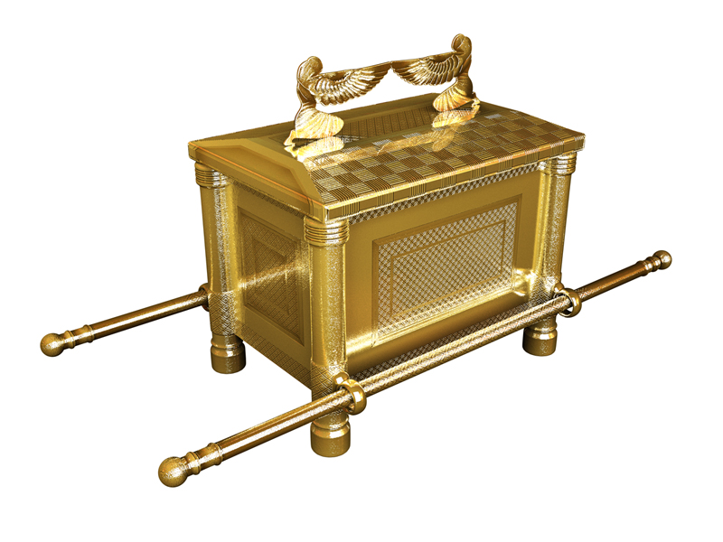

# Human-made Things in the Bible

## License Information

Human-made Things in the Bible © United Bible Societies, 2025. Adapted from: <cite>The Works of Their Hands: Man-made Things in the Bible</cite>, by Ray Pritz © 2009 United Bible Societies. This work is licensed under Creative Commons Attribution-ShareAlike 4.0 International (<a href="https://creativecommons.org/licenses/by-sa/4.0/">https://creativecommons.org/licenses/by-sa/4.0/</a>).

--------------------------------

## 标题：约柜（Covenant Box, Ark of the Covenant） (id: REALIA:4.1)

4\.1 标题：约柜（Covenant Box, Ark of the Covenant）
=============================================

经文出处
----

Hebrew 来：אֲרוֹן (音译：’aron)

[GEN 50:26](https://ref.ly/Gen50:26), [EXO 25:10](https://ref.ly/Exod25:10), [EXO 25:14](https://ref.ly/Exod25:14), [EXO 25:14](https://ref.ly/Exod25:14), [EXO 25:15](https://ref.ly/Exod25:15), [EXO 25:16](https://ref.ly/Exod25:16), [EXO 25:21](https://ref.ly/Exod25:21), [EXO 25:21](https://ref.ly/Exod25:21), [EXO 25:22](https://ref.ly/Exod25:22), [EXO 26:33](https://ref.ly/Exod26:33), [EXO 26:34](https://ref.ly/Exod26:34), [EXO 30:6](https://ref.ly/Exod30:6), [EXO 30:26](https://ref.ly/Exod30:26), [EXO 31:7](https://ref.ly/Exod31:7), [EXO 35:12](https://ref.ly/Exod35:12), [EXO 37:1](https://ref.ly/Exod37:1), [EXO 37:5](https://ref.ly/Exod37:5), [EXO 37:5](https://ref.ly/Exod37:5), [EXO 39:35](https://ref.ly/Exod39:35), [EXO 40:3](https://ref.ly/Exod40:3), [EXO 40:3](https://ref.ly/Exod40:3), [EXO 40:5](https://ref.ly/Exod40:5), [EXO 40:20](https://ref.ly/Exod40:20), [EXO 40:20](https://ref.ly/Exod40:20), [EXO 40:20](https://ref.ly/Exod40:20), [EXO 40:21](https://ref.ly/Exod40:21), [EXO 40:21](https://ref.ly/Exod40:21), [LEV 16:2](https://ref.ly/Lev16:2), [NUM 3:31](https://ref.ly/Num3:31), [NUM 4:5](https://ref.ly/Num4:5), [NUM 7:89](https://ref.ly/Num7:89), [NUM 10:33](https://ref.ly/Num10:33), [NUM 10:35](https://ref.ly/Num10:35), [NUM 14:44](https://ref.ly/Num14:44), [DEU 10:1](https://ref.ly/Deut10:1), [DEU 10:2](https://ref.ly/Deut10:2), [DEU 10:3](https://ref.ly/Deut10:3), [DEU 10:5](https://ref.ly/Deut10:5), [DEU 10:8](https://ref.ly/Deut10:8), [DEU 31:9](https://ref.ly/Deut31:9), [DEU 31:25](https://ref.ly/Deut31:25), [DEU 31:26](https://ref.ly/Deut31:26), [JOS 3:3](https://ref.ly/Josh3:3), [JOS 3:6](https://ref.ly/Josh3:6), [JOS 3:6](https://ref.ly/Josh3:6), [JOS 3:8](https://ref.ly/Josh3:8), [JOS 3:11](https://ref.ly/Josh3:11), [JOS 3:13](https://ref.ly/Josh3:13), [JOS 3:14](https://ref.ly/Josh3:14), [JOS 3:15](https://ref.ly/Josh3:15), [JOS 3:15](https://ref.ly/Josh3:15), [JOS 3:17](https://ref.ly/Josh3:17), [JOS 4:5](https://ref.ly/Josh4:5), [JOS 4:7](https://ref.ly/Josh4:7), [JOS 4:9](https://ref.ly/Josh4:9), [JOS 4:10](https://ref.ly/Josh4:10), [JOS 4:11](https://ref.ly/Josh4:11), [JOS 4:16](https://ref.ly/Josh4:16), [JOS 4:18](https://ref.ly/Josh4:18), [JOS 6:4](https://ref.ly/Josh6:4), [JOS 6:6](https://ref.ly/Josh6:6), [JOS 6:6](https://ref.ly/Josh6:6), [JOS 6:7](https://ref.ly/Josh6:7), [JOS 6:8](https://ref.ly/Josh6:8), [JOS 6:9](https://ref.ly/Josh6:9), [JOS 6:11](https://ref.ly/Josh6:11), [JOS 6:12](https://ref.ly/Josh6:12), [JOS 6:13](https://ref.ly/Josh6:13), [JOS 6:13](https://ref.ly/Josh6:13), [JOS 7:6](https://ref.ly/Josh7:6), [JOS 8:33](https://ref.ly/Josh8:33), [JOS 8:33](https://ref.ly/Josh8:33), [JDG 20:27](https://ref.ly/Judg20:27), [1SA 3:3](https://ref.ly/1Sam3:3), [1SA 4:3](https://ref.ly/1Sam4:3), [1SA 4:4](https://ref.ly/1Sam4:4), [1SA 4:4](https://ref.ly/1Sam4:4), [1SA 4:5](https://ref.ly/1Sam4:5), [1SA 4:6](https://ref.ly/1Sam4:6), [1SA 4:11](https://ref.ly/1Sam4:11), [1SA 4:13](https://ref.ly/1Sam4:13), [1SA 4:17](https://ref.ly/1Sam4:17), [1SA 4:18](https://ref.ly/1Sam4:18), [1SA 4:19](https://ref.ly/1Sam4:19), [1SA 4:21](https://ref.ly/1Sam4:21), [1SA 4:22](https://ref.ly/1Sam4:22), [1SA 5:1](https://ref.ly/1Sam5:1), [1SA 5:2](https://ref.ly/1Sam5:2), [1SA 5:3](https://ref.ly/1Sam5:3), [1SA 5:4](https://ref.ly/1Sam5:4), [1SA 5:7](https://ref.ly/1Sam5:7), [1SA 5:8](https://ref.ly/1Sam5:8), [1SA 5:8](https://ref.ly/1Sam5:8), [1SA 5:8](https://ref.ly/1Sam5:8), [1SA 5:10](https://ref.ly/1Sam5:10), [1SA 5:10](https://ref.ly/1Sam5:10), [1SA 5:10](https://ref.ly/1Sam5:10), [1SA 5:11](https://ref.ly/1Sam5:11), [1SA 6:1](https://ref.ly/1Sam6:1), [1SA 6:2](https://ref.ly/1Sam6:2), [1SA 6:3](https://ref.ly/1Sam6:3), [1SA 6:8](https://ref.ly/1Sam6:8), [1SA 6:11](https://ref.ly/1Sam6:11), [1SA 6:13](https://ref.ly/1Sam6:13), [1SA 6:15](https://ref.ly/1Sam6:15), [1SA 6:18](https://ref.ly/1Sam6:18), [1SA 6:19](https://ref.ly/1Sam6:19), [1SA 6:21](https://ref.ly/1Sam6:21), [1SA 7:1](https://ref.ly/1Sam7:1), [1SA 7:1](https://ref.ly/1Sam7:1), [1SA 7:2](https://ref.ly/1Sam7:2), [1SA 14:18](https://ref.ly/1Sam14:18), [1SA 14:18](https://ref.ly/1Sam14:18), [2SA 6:2](https://ref.ly/2Sam6:2), [2SA 6:3](https://ref.ly/2Sam6:3), [2SA 6:4](https://ref.ly/2Sam6:4), [2SA 6:4](https://ref.ly/2Sam6:4), [2SA 6:6](https://ref.ly/2Sam6:6), [2SA 6:7](https://ref.ly/2Sam6:7), [2SA 6:9](https://ref.ly/2Sam6:9), [2SA 6:10](https://ref.ly/2Sam6:10), [2SA 6:11](https://ref.ly/2Sam6:11), [2SA 6:12](https://ref.ly/2Sam6:12), [2SA 6:12](https://ref.ly/2Sam6:12), [2SA 6:13](https://ref.ly/2Sam6:13), [2SA 6:15](https://ref.ly/2Sam6:15), [2SA 6:16](https://ref.ly/2Sam6:16), [2SA 6:17](https://ref.ly/2Sam6:17), [2SA 7:2](https://ref.ly/2Sam7:2), [2SA 11:11](https://ref.ly/2Sam11:11), [2SA 15:24](https://ref.ly/2Sam15:24), [2SA 15:24](https://ref.ly/2Sam15:24), [2SA 15:25](https://ref.ly/2Sam15:25), [2SA 15:29](https://ref.ly/2Sam15:29), [1KI 2:26](https://ref.ly/1Kgs2:26), [1KI 3:15](https://ref.ly/1Kgs3:15), [1KI 6:19](https://ref.ly/1Kgs6:19), [1KI 8:1](https://ref.ly/1Kgs8:1), [1KI 8:3](https://ref.ly/1Kgs8:3), [1KI 8:4](https://ref.ly/1Kgs8:4), [1KI 8:5](https://ref.ly/1Kgs8:5), [1KI 8:6](https://ref.ly/1Kgs8:6), [1KI 8:7](https://ref.ly/1Kgs8:7), [1KI 8:7](https://ref.ly/1Kgs8:7), [1KI 8:9](https://ref.ly/1Kgs8:9), [1KI 8:21](https://ref.ly/1Kgs8:21), [2KI 12:10](https://ref.ly/2Kgs12:10), [2KI 12:11](https://ref.ly/2Kgs12:11), [1CH 6:16](https://ref.ly/1Chr6:16), [1CH 13:3](https://ref.ly/1Chr13:3), [1CH 13:5](https://ref.ly/1Chr13:5), [1CH 13:6](https://ref.ly/1Chr13:6), [1CH 13:7](https://ref.ly/1Chr13:7), [1CH 13:9](https://ref.ly/1Chr13:9), [1CH 13:10](https://ref.ly/1Chr13:10), [1CH 13:12](https://ref.ly/1Chr13:12), [1CH 13:13](https://ref.ly/1Chr13:13), [1CH 13:14](https://ref.ly/1Chr13:14), [1CH 15:1](https://ref.ly/1Chr15:1), [1CH 15:2](https://ref.ly/1Chr15:2), [1CH 15:2](https://ref.ly/1Chr15:2), [1CH 15:3](https://ref.ly/1Chr15:3), [1CH 15:12](https://ref.ly/1Chr15:12), [1CH 15:14](https://ref.ly/1Chr15:14), [1CH 15:15](https://ref.ly/1Chr15:15), [1CH 15:23](https://ref.ly/1Chr15:23), [1CH 15:24](https://ref.ly/1Chr15:24), [1CH 15:24](https://ref.ly/1Chr15:24), [1CH 15:25](https://ref.ly/1Chr15:25), [1CH 15:26](https://ref.ly/1Chr15:26), [1CH 15:27](https://ref.ly/1Chr15:27), [1CH 15:28](https://ref.ly/1Chr15:28), [1CH 15:29](https://ref.ly/1Chr15:29), [1CH 16:1](https://ref.ly/1Chr16:1), [1CH 16:4](https://ref.ly/1Chr16:4), [1CH 16:6](https://ref.ly/1Chr16:6), [1CH 16:37](https://ref.ly/1Chr16:37), [1CH 16:37](https://ref.ly/1Chr16:37), [1CH 17:1](https://ref.ly/1Chr17:1), [1CH 22:19](https://ref.ly/1Chr22:19), [1CH 28:2](https://ref.ly/1Chr28:2), [1CH 28:18](https://ref.ly/1Chr28:18), [2CH 1:4](https://ref.ly/2Chr1:4), [2CH 5:2](https://ref.ly/2Chr5:2), [2CH 5:4](https://ref.ly/2Chr5:4), [2CH 5:5](https://ref.ly/2Chr5:5), [2CH 5:6](https://ref.ly/2Chr5:6), [2CH 5:7](https://ref.ly/2Chr5:7), [2CH 5:8](https://ref.ly/2Chr5:8), [2CH 5:8](https://ref.ly/2Chr5:8), [2CH 5:9](https://ref.ly/2Chr5:9), [2CH 5:10](https://ref.ly/2Chr5:10), [2CH 6:11](https://ref.ly/2Chr6:11), [2CH 6:41](https://ref.ly/2Chr6:41), [2CH 8:11](https://ref.ly/2Chr8:11), [2CH 24:8](https://ref.ly/2Chr24:8), [2CH 24:10](https://ref.ly/2Chr24:10), [2CH 24:11](https://ref.ly/2Chr24:11), [2CH 24:11](https://ref.ly/2Chr24:11), [2CH 35:3](https://ref.ly/2Chr35:3), [PSA 132:8](https://ref.ly/Ps132:8), [JER 3:16](https://ref.ly/Jer3:16)

Greek 希：κιβωτός (音译：kibōtos)

[HEB 9:4](https://ref.ly/Heb9:4), [REV 11:19](https://ref.ly/Rev11:19), [2MA 2:4](https://ref.ly/2Macc2:4), [2MA 2:5](https://ref.ly/2Macc2:5), [1ES 3:6](https://ref.ly/1Esd3:6)

Latin 拉：arca

[2ES 10:22](https://ref.ly/2Esd10:22)

经文出处
----

### **脚** ：

Hebrew 来：פַּעַם (音译：pa‘am)

[EXO 25:12](https://ref.ly/Exod25:12), [EXO 37:3](https://ref.ly/Exod37:3)

经文出处
----

### **柜边** ：

Hebrew 来：צֵלָע (音译：tsela‘)

[EXO 25:12](https://ref.ly/Exod25:12), [EXO 25:12](https://ref.ly/Exod25:12), [EXO 25:14](https://ref.ly/Exod25:14), [EXO 37:3](https://ref.ly/Exod37:3), [EXO 37:3](https://ref.ly/Exod37:3), [EXO 37:5](https://ref.ly/Exod37:5)

经文出处
----

### **环** ：

Hebrew 来：טַבַּעַת (音译：taba‘ath)

[EXO 25:12](https://ref.ly/Exod25:12), [EXO 25:12](https://ref.ly/Exod25:12), [EXO 25:12](https://ref.ly/Exod25:12), [EXO 25:14](https://ref.ly/Exod25:14), [EXO 25:15](https://ref.ly/Exod25:15), [EXO 37:3](https://ref.ly/Exod37:3), [EXO 37:3](https://ref.ly/Exod37:3), [EXO 37:3](https://ref.ly/Exod37:3), [EXO 37:5](https://ref.ly/Exod37:5)

经文出处
----

### **杠** ：

Hebrew 来：בַּד (音译：bad)

[EXO 25:13](https://ref.ly/Exod25:13), [EXO 25:14](https://ref.ly/Exod25:14), [EXO 25:15](https://ref.ly/Exod25:15), [EXO 35:12](https://ref.ly/Exod35:12), [EXO 37:4](https://ref.ly/Exod37:4), [EXO 37:5](https://ref.ly/Exod37:5), [EXO 39:35](https://ref.ly/Exod39:35), [EXO 40:20](https://ref.ly/Exod40:20), [NUM 4:6](https://ref.ly/Num4:6), [1KI 8:7](https://ref.ly/1Kgs8:7), [1KI 8:8](https://ref.ly/1Kgs8:8), [1KI 8:8](https://ref.ly/1Kgs8:8), [2CH 5:8](https://ref.ly/2Chr5:8), [2CH 5:9](https://ref.ly/2Chr5:9), [2CH 5:9](https://ref.ly/2Chr5:9)

Hebrew 来：מוֹט, מוֹטָה (音译：mot, motah)

[NUM 4:10](https://ref.ly/Num4:10), [NUM 4:12](https://ref.ly/Num4:12), [1CH 15:15](https://ref.ly/1Chr15:15)

经文出处
----

### **金边** ：

Hebrew 来：זֵר (音译：zer)

[EXO 25:11](https://ref.ly/Exod25:11), [EXO 37:2](https://ref.ly/Exod37:2)

描述
--

*列队行进时，约柜用布幔覆盖保护 (Image generated by ChatGPT using OpenAI technology)*

约柜的做法记在[EXO 25:11](https://ref.ly/Exod25:11) ，结构描述见[EXO 37:0](https://ref.ly/Exod37:0) 。约柜是一个长方形的柜子，长约125厘米（49英寸），宽75厘米（30英寸），高75厘米（30英寸），由金合欢木制成，用金包裹，四围镶上金牙边作装饰。显然，约柜通过四角的四只脚立在地上。每只脚上都安有一个金环，有两根杠穿过这些金环，用来抬约柜。（下图所示的环和杠其实应该是在约柜的底部，更靠近约柜的脚；见上图。）杠也是用金合欢木做的，用金包裹；经文没有给出杠的长度和直径。把杠从金环中穿过，就可以在不接触约柜的情况下抬起和移动约柜。约柜有一个特别的盖子（参[4\.1\.1 施恩座、赎罪盖 (mercy seat, atonement cover, atonement lid)\<REALIA:4\.1\.1\>](#) ）。

---

Translation:
------------

*约柜 (© Fernando Shoiti Schatzmann from Suzano, Brasil, CC BY 2\.0, via Wikimedia Commons)*

有些学者反对把英文的“Ark of the Covenant”（“约柜”）称为“the Covenant Box”（“约盒”），因为他们认为英文“ark”具有特殊含义，与对应的希伯来文或希腊文词语意义相同。然而，“ark”在古英文和中古英文中只是拉丁文*arca* 的音译，意为“盒子、箱子、保险柜”。事实上，希伯来文中表示“ark”的词语*’aron* 也指其他类型的盒子（[GEN 50:26](https://ref.ly/Gen50:26) ；[2KI 12:10](https://ref.ly/2Kgs12:10); [2KI 12:11](https://ref.ly/2Kgs12:11) ［《和》12:9–10］；[2CH 24:8](https://ref.ly/2Chr24:8); [2CH 24:9](https://ref.ly/2Chr24:9); [2CH 24:10](https://ref.ly/2Chr24:10); [2CH 24:11](https://ref.ly/2Chr24:11) ；参[4\.8\.4 尸架、棺材 (bier, coffin)\<REALIA:4\.8\.4\>](#) 等）。

在现代英文中，人们主要是从“Noah’s ark”（“挪亚方舟”）的故事中得知“ark”这个词。翻译者要知道，只是因为历史上的偶然因素，英文、法文和其他一些欧洲语言的较早译本才使用了“ark”一词来表示挪亚的方舟（参[8\.1\.3 方舟、大船 (ark, ship)\<REALIA:8\.1\.3\>](#) ）和约柜。挪亚的方舟在希伯来文中是另外一个词。翻译者不应该用同一个词语来翻译方舟和约柜。

**金边** ：镶在约柜四围的金“牙边”似乎是用来装饰的。在[2CH 24:11](https://ref.ly/2Chr24:11) ，RSV (Revised Standard Version (1952)) 译作“round about”（“周围”）的希伯来文词语意为“all around it”（“它的四周”），正如GNT (Good News Translation (1992)) 所译，因为这个词的基本意思是包围。NAB (New American Bible (1970)) 将其译作“around the top of it”（“在它顶部的四围”），不过牙边可能镶在略低于约柜顶部边缘的地方。CEV (Contemporary English Version) 将这节经文的后半节译作“put a gold edging around the lid”（“在盖子四围镶上金牙边”），但这似乎不得要领，因为牙边是镶在约柜柜体四周的。

**杠和环** ：帐幕中有几样物件都带有金环，以便将长杠穿过这些金环来抬运物件。翻译者应该采用统一的词语来表示这些杠和环。[EXO 25:15](https://ref.ly/Exod25:15) 明确说明，抬约柜的两根杠不可以抽出来。RSV (Revised Standard Version (1952)) 、GNT (Good News Translation (1992)) 和NIV (New International Version (1984)) 将[NUM 4:10](https://ref.ly/Num4:10); [NUM 4:12](https://ref.ly/Num4:12) 中的希伯来文*mot* 译作“carrying frame”（“抬架”）。REB (Revised English Bible (1989)) 将其解作挂包袱的“pole”（“杠”）。

* **Associated Passages:** 创世记 50:26; 出埃及记 25:10; 出埃及记 25:14; 出埃及记 25:15; 出埃及记 25:16; 出埃及记 25:21; 出埃及记 25:22; 出埃及记 26:33; 出埃及记 26:34; 出埃及记 30:6; 出埃及记 30:26; 出埃及记 31:7; 出埃及记 35:12; 出埃及记 37:1; 出埃及记 37:5; 出埃及记 39:35; 出埃及记 40:3; 出埃及记 40:5; 出埃及记 40:20; 出埃及记 40:21; 利未记 16:2; 民数记 3:31; 民数记 4:5; 民数记 7:89; 民数记 10:33; 民数记 10:35; 民数记 14:44; 申命记 10:1; 申命记 10:2; 申命记 10:3; 申命记 10:5; 申命记 10:8; 申命记 31:9; 申命记 31:25; 申命记 31:26; 约书亚记 3:3; 约书亚记 3:6; 约书亚记 3:8; 约书亚记 3:11; 约书亚记 3:13; 约书亚记 3:14; 约书亚记 3:15; 约书亚记 3:17; 约书亚记 4:5; 约书亚记 4:7; 约书亚记 4:9; 约书亚记 4:10; 约书亚记 4:11; 约书亚记 4:16; 约书亚记 4:18; 约书亚记 6:4; 约书亚记 6:6; 约书亚记 6:7; 约书亚记 6:8; 约书亚记 6:9; 约书亚记 6:11; 约书亚记 6:12; 约书亚记 6:13; 约书亚记 7:6; 约书亚记 8:33; 士师记 20:27; 撒母耳记上 3:3; 撒母耳记上 4:3; 撒母耳记上 4:4; 撒母耳记上 4:5; 撒母耳记上 4:6; 撒母耳记上 4:11; 撒母耳记上 4:13; 撒母耳记上 4:17; 撒母耳记上 4:18; 撒母耳记上 4:19; 撒母耳记上 4:21; 撒母耳记上 4:22; 撒母耳记上 5:1; 撒母耳记上 5:2; 撒母耳记上 5:3; 撒母耳记上 5:4; 撒母耳记上 5:7; 撒母耳记上 5:8; 撒母耳记上 5:10; 撒母耳记上 5:11; 撒母耳记上 6:1; 撒母耳记上 6:2; 撒母耳记上 6:3; 撒母耳记上 6:8; 撒母耳记上 6:11; 撒母耳记上 6:13; 撒母耳记上 6:15; 撒母耳记上 6:18; 撒母耳记上 6:19; 撒母耳记上 6:21; 撒母耳记上 7:1; 撒母耳记上 7:2; 撒母耳记上 14:18; 撒母耳记下 6:2; 撒母耳记下 6:3; 撒母耳记下 6:4; 撒母耳记下 6:6; 撒母耳记下 6:7; 撒母耳记下 6:9; 撒母耳记下 6:10; 撒母耳记下 6:11; 撒母耳记下 6:12; 撒母耳记下 6:13; 撒母耳记下 6:15; 撒母耳记下 6:16; 撒母耳记下 6:17; 撒母耳记下 7:2; 撒母耳记下 11:11; 撒母耳记下 15:24; 撒母耳记下 15:25; 撒母耳记下 15:29; 列王纪上 2:26; 列王纪上 3:15; 列王纪上 6:19; 列王纪上 8:1; 列王纪上 8:3; 列王纪上 8:4; 列王纪上 8:5; 列王纪上 8:6; 列王纪上 8:7; 列王纪上 8:9; 列王纪上 8:21; 列王纪下 12:10; 列王纪下 12:11; 历代志上 6:16; 历代志上 13:3; 历代志上 13:5; 历代志上 13:6; 历代志上 13:7; 历代志上 13:9; 历代志上 13:10; 历代志上 13:12; 历代志上 13:13; 历代志上 13:14; 历代志上 15:1; 历代志上 15:2; 历代志上 15:3; 历代志上 15:12; 历代志上 15:14; 历代志上 15:15; 历代志上 15:23; 历代志上 15:24; 历代志上 15:25; 历代志上 15:26; 历代志上 15:27; 历代志上 15:28; 历代志上 15:29; 历代志上 16:1; 历代志上 16:4; 历代志上 16:6; 历代志上 16:37; 历代志上 17:1; 历代志上 22:19; 历代志上 28:2; 历代志上 28:18; 历代志下 1:4; 历代志下 5:2; 历代志下 5:4; 历代志下 5:5; 历代志下 5:6; 历代志下 5:7; 历代志下 5:8; 历代志下 5:9; 历代志下 5:10; 历代志下 6:11; 历代志下 6:41; 历代志下 8:11; 历代志下 24:8; 历代志下 24:10; 历代志下 24:11; 历代志下 35:3; 诗篇 132:8; 耶利米书 3:16; 希伯来书 9:4; 启示录 11:19; 玛加伯下 2:4; 玛加伯下 2:5; 厄斯德拉上 3:6; 厄斯德拉下 10:22; 出埃及记 25:12; 出埃及记 37:3; 出埃及记 25:13; 出埃及记 37:4; 民数记 4:6; 列王纪上 8:8; 民数记 4:10; 民数记 4:12; 出埃及记 25:11; 出埃及记 37:2; 出埃及记 37:0; 历代志下 24:9

