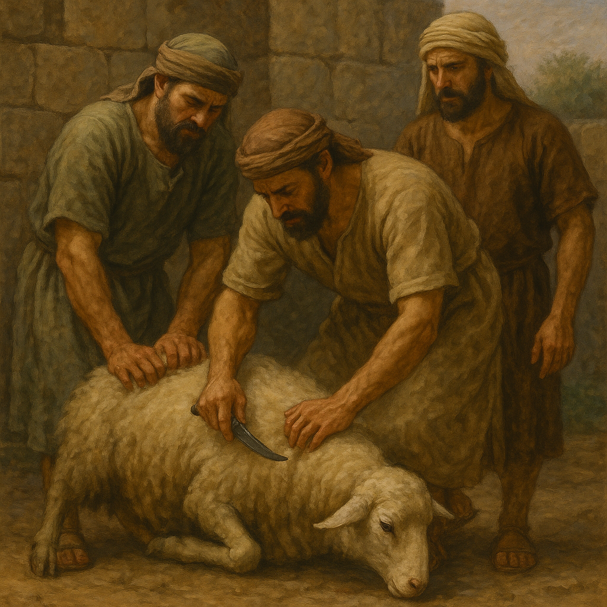

# Human-made Things in the Bible

## License Information

Human-made Things in the Bible © United Bible Societies, 2025. Adapted from: <cite>The Works of Their Hands: Man-made Things in the Bible</cite>, by Ray Pritz © 2009 United Bible Societies. This work is licensed under Creative Commons Attribution-ShareAlike 4.0 International (<a href="https://creativecommons.org/licenses/by-sa/4.0/">https://creativecommons.org/licenses/by-sa/4.0/</a>).

--------------------------------

## 标题：祭坛的翘角（horns of the altar） (id: REALIA:4.2.1.1)

4\.2\.1\.1 标题：祭坛的翘角（horns of the altar）
=======================================

经文出处
----

Hebrew 来：קֶרֶן (音译：qarnoth（qeren的复数形式）)

[EXO 27:2](https://ref.ly/Exod27:2), [EXO 27:2](https://ref.ly/Exod27:2), [EXO 29:12](https://ref.ly/Exod29:12), [EXO 30:2](https://ref.ly/Exod30:2), [EXO 30:3](https://ref.ly/Exod30:3), [EXO 30:10](https://ref.ly/Exod30:10), [EXO 37:25](https://ref.ly/Exod37:25), [EXO 37:26](https://ref.ly/Exod37:26), [EXO 38:2](https://ref.ly/Exod38:2), [EXO 38:2](https://ref.ly/Exod38:2), [LEV 4:7](https://ref.ly/Lev4:7), [LEV 4:18](https://ref.ly/Lev4:18), [LEV 4:25](https://ref.ly/Lev4:25), [LEV 4:30](https://ref.ly/Lev4:30), [LEV 4:34](https://ref.ly/Lev4:34), [LEV 8:15](https://ref.ly/Lev8:15), [LEV 9:9](https://ref.ly/Lev9:9), [LEV 16:18](https://ref.ly/Lev16:18), [1KI 1:50](https://ref.ly/1Kgs1:50), [1KI 1:51](https://ref.ly/1Kgs1:51), [1KI 2:28](https://ref.ly/1Kgs2:28), [PSA 118:27](https://ref.ly/Ps118:27), [JER 17:1](https://ref.ly/Jer17:1), [EZK 43:15](https://ref.ly/Ezek43:15), [EZK 43:20](https://ref.ly/Ezek43:20), [AMO 3:14](https://ref.ly/Amos3:14)

Greek 希：κέρας (音译：keras)

[JDT 9:8](https://ref.ly/Jdt9:8)

描述和用途
-----

*(Image generated by ChatGPT using OpenAI technology)*

坛角是坛顶部四个拐角的突出部分，形状像祭牲的角。有些学者认为这些翘角代表祭牲，还有一些学者认为翘角最初是用来悬挂烹饪器具的。在以色列的律法中，坛角也是一个避难的地方，在那里，误杀人者可以免受被杀者亲人的报复。

---

翻译
--

*有角香坛（石灰石，米吉多，公元前8世纪） (Gary Todd, Israel Museum, CC0, via Wikimedia Commons)*

希伯来文*qeren* 和希腊文*keras* 意思相同，都指动物（如牛）的角，但是没有必要在译文中保留这个描述性的表达。“角”在有些语言中可能很自然，但在另一些语言中，译成“突出物”（“projections”；GNT (Good News Translation (1992)) ）、“把手”（“knobs”；Mft (Moffatt Translation (1926)) ），或“突出的角”之类可能更合适。有些翻译者会扩展“角”的译文；例如，CEV (Contemporary English Version) 在[EXO 27:2](https://ref.ly/Exod27:2) 的英文意为，“使顶部的四个拐角像公牛的角一样竖起来。”

字面意为“祭坛的翘角”的希伯来文短语可以翻译为“角状突出物，位于献祭的地方（或译：放祭物的地方）的四角”，但如此冗长而复杂的译文是没有必要的；经文的重点通常不是形状。因此，在[AMO 3:14](https://ref.ly/Amos3:14) ，GNT (Good News Translation (1992)) 英文意为“每个祭坛的拐角”，清楚说明翘角的位置而非形状，这在许多语言中都是一个很好的做法。

[PSA 118:27](https://ref.ly/Ps118:27) ：这节经文的后两行包含祭牲在圣殿里行进的指示，但希伯来文本的意思有些不确定，似乎是说“用枝子把祭牲拴在坛角那里”。HOTTP (Hebrew Old Testament Text Project (UBS)) 指出，这里的希伯来文本有两种理解方式：“用绳子把祭牲拴在坛角”，或“在坛角那里用绳子把节期（朝圣者）排好”，意即敬拜者被圈在绳子里面，分别出来作为圣民。HOTTP (Hebrew Old Testament Text Project (UBS)) 依循NJPSV (New Jewish Publication Society Version) ，译为“绳子”（“ropes”）而非“树枝”。NJPSV (New Jewish Publication Society Version) 英文意为：“用绳子把祭牲拴在坛的角上。”NJB (New Jerusalem Bible (1985)) 意为：“排起队列，手拿树枝，直到坛角那里”，并在脚注中解释说：“*lulab* 礼仪，使用桃金娘枝或棕榈枝，在队列环绕祭坛时挥舞。”然而，这些解释似乎相当可疑。我们认为GNT (Good News Translation (1992)) 合理地表达了原来文本的含义，因此推荐这种译法：“手拿树枝，开始节期的庆祝，绕着祭坛行进。”SPCL (Spanish Common Language Version (Dios Habla Hoy)) 意为：“开始节期的庆祝，拿着树枝走到祭坛的角那里。”AT (American Translation (Goodspeed, 1935)) 意为：“用枝子编排节日的舞蹈，直到祭坛的角那里。”

* **Associated Passages:** 出埃及记 27:2; 出埃及记 29:12; 出埃及记 30:2; 出埃及记 30:3; 出埃及记 30:10; 出埃及记 37:25; 出埃及记 37:26; 出埃及记 38:2; 利未记 4:7; 利未记 4:18; 利未记 4:25; 利未记 4:30; 利未记 4:34; 利未记 8:15; 利未记 9:9; 利未记 16:18; 列王纪上 1:50; 列王纪上 1:51; 列王纪上 2:28; 诗篇 118:27; 耶利米书 17:1; 以西结书 43:15; 以西结书 43:20; 阿摩司书 3:14; 友弟德传 9:8

