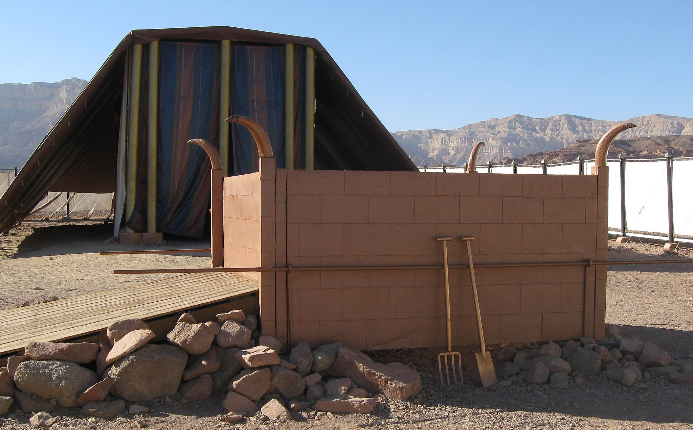
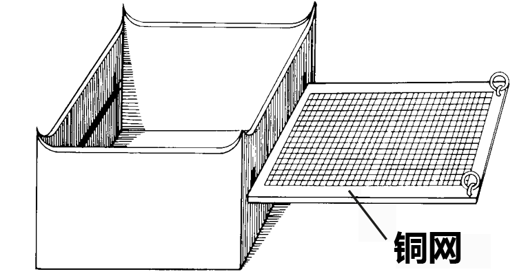

# Human-made Things in the Bible

## License Information

Human-made Things in the Bible © United Bible Societies, 2025. Adapted from: <cite>The Works of Their Hands: Man-made Things in the Bible</cite>, by Ray Pritz © 2009 United Bible Societies. This work is licensed under Creative Commons Attribution-ShareAlike 4.0 International (<a href="https://creativecommons.org/licenses/by-sa/4.0/">https://creativecommons.org/licenses/by-sa/4.0/</a>).

--------------------------------

## 标题：帐幕中的祭坛（Tabernacle altar） (id: REALIA:4.2.2)

4\.2\.2 标题：帐幕中的祭坛（Tabernacle altar）
===================================

经文出处
----

Hebrew 来：מִזְבֵּחַ (音译：mizbeach)

[EXO 27:1](https://ref.ly/Exod27:1), [EXO 27:1](https://ref.ly/Exod27:1), [EXO 27:5](https://ref.ly/Exod27:5), [EXO 27:5](https://ref.ly/Exod27:5), [EXO 27:6](https://ref.ly/Exod27:6), [EXO 27:7](https://ref.ly/Exod27:7), [EXO 28:43](https://ref.ly/Exod28:43), [EXO 29:12](https://ref.ly/Exod29:12), [EXO 29:12](https://ref.ly/Exod29:12), [EXO 29:13](https://ref.ly/Exod29:13), [EXO 29:16](https://ref.ly/Exod29:16), [EXO 29:18](https://ref.ly/Exod29:18), [EXO 29:20](https://ref.ly/Exod29:20), [EXO 29:21](https://ref.ly/Exod29:21), [EXO 29:25](https://ref.ly/Exod29:25), [EXO 29:36](https://ref.ly/Exod29:36), [EXO 29:37](https://ref.ly/Exod29:37), [EXO 29:37](https://ref.ly/Exod29:37), [EXO 29:37](https://ref.ly/Exod29:37), [EXO 29:38](https://ref.ly/Exod29:38), [EXO 29:44](https://ref.ly/Exod29:44), [EXO 30:18](https://ref.ly/Exod30:18), [EXO 30:20](https://ref.ly/Exod30:20), [EXO 30:28](https://ref.ly/Exod30:28), [EXO 31:9](https://ref.ly/Exod31:9), [EXO 35:16](https://ref.ly/Exod35:16), [EXO 38:1](https://ref.ly/Exod38:1), [EXO 38:3](https://ref.ly/Exod38:3), [EXO 38:4](https://ref.ly/Exod38:4), [EXO 38:7](https://ref.ly/Exod38:7), [EXO 38:30](https://ref.ly/Exod38:30), [EXO 38:30](https://ref.ly/Exod38:30), [EXO 39:39](https://ref.ly/Exod39:39), [EXO 40:6](https://ref.ly/Exod40:6), [EXO 40:7](https://ref.ly/Exod40:7), [EXO 40:10](https://ref.ly/Exod40:10), [EXO 40:10](https://ref.ly/Exod40:10), [EXO 40:10](https://ref.ly/Exod40:10), [EXO 40:29](https://ref.ly/Exod40:29), [EXO 40:30](https://ref.ly/Exod40:30), [EXO 40:32](https://ref.ly/Exod40:32), [EXO 40:33](https://ref.ly/Exod40:33), [LEV 1:5](https://ref.ly/Lev1:5), [LEV 1:7](https://ref.ly/Lev1:7), [LEV 1:8](https://ref.ly/Lev1:8), [LEV 1:9](https://ref.ly/Lev1:9), [LEV 1:11](https://ref.ly/Lev1:11), [LEV 1:11](https://ref.ly/Lev1:11), [LEV 1:12](https://ref.ly/Lev1:12), [LEV 1:13](https://ref.ly/Lev1:13), [LEV 1:15](https://ref.ly/Lev1:15), [LEV 1:15](https://ref.ly/Lev1:15), [LEV 1:15](https://ref.ly/Lev1:15), [LEV 1:16](https://ref.ly/Lev1:16), [LEV 1:17](https://ref.ly/Lev1:17), [LEV 2:2](https://ref.ly/Lev2:2), [LEV 2:8](https://ref.ly/Lev2:8), [LEV 2:9](https://ref.ly/Lev2:9), [LEV 2:12](https://ref.ly/Lev2:12), [LEV 3:2](https://ref.ly/Lev3:2), [LEV 3:5](https://ref.ly/Lev3:5), [LEV 3:8](https://ref.ly/Lev3:8), [LEV 3:11](https://ref.ly/Lev3:11), [LEV 3:13](https://ref.ly/Lev3:13), [LEV 3:16](https://ref.ly/Lev3:16), [LEV 4:7](https://ref.ly/Lev4:7), [LEV 4:10](https://ref.ly/Lev4:10), [LEV 4:18](https://ref.ly/Lev4:18), [LEV 4:18](https://ref.ly/Lev4:18), [LEV 4:19](https://ref.ly/Lev4:19), [LEV 4:25](https://ref.ly/Lev4:25), [LEV 4:25](https://ref.ly/Lev4:25), [LEV 4:26](https://ref.ly/Lev4:26), [LEV 4:30](https://ref.ly/Lev4:30), [LEV 4:30](https://ref.ly/Lev4:30), [LEV 4:31](https://ref.ly/Lev4:31), [LEV 4:34](https://ref.ly/Lev4:34), [LEV 4:34](https://ref.ly/Lev4:34), [LEV 4:35](https://ref.ly/Lev4:35), [LEV 5:9](https://ref.ly/Lev5:9), [LEV 5:9](https://ref.ly/Lev5:9), [LEV 5:12](https://ref.ly/Lev5:12), [LEV 6:2](https://ref.ly/Lev6:2), [LEV 6:2](https://ref.ly/Lev6:2), [LEV 6:3](https://ref.ly/Lev6:3), [LEV 6:3](https://ref.ly/Lev6:3), [LEV 6:5](https://ref.ly/Lev6:5), [LEV 6:6](https://ref.ly/Lev6:6), [LEV 6:7](https://ref.ly/Lev6:7), [LEV 6:8](https://ref.ly/Lev6:8), [LEV 7:2](https://ref.ly/Lev7:2), [LEV 7:5](https://ref.ly/Lev7:5), [LEV 7:31](https://ref.ly/Lev7:31), [LEV 8:11](https://ref.ly/Lev8:11), [LEV 8:11](https://ref.ly/Lev8:11), [LEV 8:15](https://ref.ly/Lev8:15), [LEV 8:15](https://ref.ly/Lev8:15), [LEV 8:15](https://ref.ly/Lev8:15), [LEV 8:16](https://ref.ly/Lev8:16), [LEV 8:19](https://ref.ly/Lev8:19), [LEV 8:21](https://ref.ly/Lev8:21), [LEV 8:24](https://ref.ly/Lev8:24), [LEV 8:28](https://ref.ly/Lev8:28), [LEV 8:30](https://ref.ly/Lev8:30), [LEV 9:7](https://ref.ly/Lev9:7), [LEV 9:8](https://ref.ly/Lev9:8), [LEV 9:9](https://ref.ly/Lev9:9), [LEV 9:9](https://ref.ly/Lev9:9), [LEV 9:10](https://ref.ly/Lev9:10), [LEV 9:12](https://ref.ly/Lev9:12), [LEV 9:13](https://ref.ly/Lev9:13), [LEV 9:14](https://ref.ly/Lev9:14), [LEV 9:17](https://ref.ly/Lev9:17), [LEV 9:18](https://ref.ly/Lev9:18), [LEV 9:20](https://ref.ly/Lev9:20), [LEV 9:24](https://ref.ly/Lev9:24), [LEV 10:12](https://ref.ly/Lev10:12), [LEV 14:20](https://ref.ly/Lev14:20), [LEV 16:12](https://ref.ly/Lev16:12), [LEV 16:18](https://ref.ly/Lev16:18), [LEV 16:18](https://ref.ly/Lev16:18), [LEV 16:20](https://ref.ly/Lev16:20), [LEV 16:25](https://ref.ly/Lev16:25), [LEV 16:33](https://ref.ly/Lev16:33), [LEV 17:6](https://ref.ly/Lev17:6), [LEV 17:11](https://ref.ly/Lev17:11), [LEV 21:23](https://ref.ly/Lev21:23), [LEV 22:22](https://ref.ly/Lev22:22), [NUM 3:26](https://ref.ly/Num3:26), [NUM 3:31](https://ref.ly/Num3:31), [NUM 4:13](https://ref.ly/Num4:13), [NUM 4:14](https://ref.ly/Num4:14), [NUM 4:26](https://ref.ly/Num4:26), [NUM 5:25](https://ref.ly/Num5:25), [NUM 5:26](https://ref.ly/Num5:26), [NUM 7:1](https://ref.ly/Num7:1), [NUM 7:10](https://ref.ly/Num7:10), [NUM 7:10](https://ref.ly/Num7:10), [NUM 7:11](https://ref.ly/Num7:11), [NUM 7:84](https://ref.ly/Num7:84), [NUM 7:88](https://ref.ly/Num7:88), [NUM 17:3](https://ref.ly/Num17:3), [NUM 17:4](https://ref.ly/Num17:4), [NUM 17:11](https://ref.ly/Num17:11), [NUM 18:3](https://ref.ly/Num18:3), [NUM 18:5](https://ref.ly/Num18:5), [NUM 18:7](https://ref.ly/Num18:7), [NUM 18:17](https://ref.ly/Num18:17), [DEU 12:27](https://ref.ly/Deut12:27), [DEU 12:27](https://ref.ly/Deut12:27), [DEU 16:21](https://ref.ly/Deut16:21), [DEU 26:4](https://ref.ly/Deut26:4), [JOS 22:29](https://ref.ly/Josh22:29), [1SA 2:28](https://ref.ly/1Sam2:28), [1SA 2:33](https://ref.ly/1Sam2:33), [1KI 1:50](https://ref.ly/1Kgs1:50), [1KI 1:51](https://ref.ly/1Kgs1:51), [1KI 1:53](https://ref.ly/1Kgs1:53), [1KI 2:28](https://ref.ly/1Kgs2:28), [1KI 2:29](https://ref.ly/1Kgs2:29), [1CH 21:29](https://ref.ly/1Chr21:29), [2CH 1:5](https://ref.ly/2Chr1:5), [2CH 1:6](https://ref.ly/2Chr1:6)

经文出处
----

### **边、台** ：

Hebrew 来：כַּרְכֹּב (音译：karkov)

[EXO 27:5](https://ref.ly/Exod27:5), [EXO 38:4](https://ref.ly/Exod38:4)

描述
--

*可移动会幕的祭坛（亭纳公园（Timnah Park）） (© Ori229, CC BY\-SA 3\.0, via Wikimedia Commons)*

帐幕中的祭坛用金合欢木制成，里外都包着铜，边长5肘（2\.5米或8\.3英尺），高3肘（1\.5米或5英尺）。坛是中空的，顶部四围有台或边（希伯来文*karkov* ），经文没有具体说明祭坛的用途。

---

翻译
--

参上文[4\.2 坛、祭坛、燔祭坛 (altars)\<REALIA:4\.2\>](#) 和[4\.2\.1 石坛 (stone altar)\<REALIA:4\.2\.1\>](#) 。

**边、台** ：希伯来文*karkov* 只出现在[EXO 27:5](https://ref.ly/Exod27:5) 和[EXO 38:4](https://ref.ly/Exod38:4) ，意思不明。有些学者认为这是坛四围的饰“边”（“rim”；GNT (Good News Translation (1992)) ），当利未人通过铜网上的环抬起祭坛时，饰边还可以承受坛的一部分重量（[EXO 27:4](https://ref.ly/Exod27:4) ；参[4\.2\.3 圣殿中的祭坛 (Temple altar)\<REALIA:4\.2\.3\>](#) 插图所示的边）。还有学者认为这可能是一个“台”（“ledge”；RSV (Revised Standard Version (1952)) ），宽到可以让供职的祭司站在上面，但这不大可能，因为坛本身只有1\.5米（5英尺）高。

经文没有明确指出这道边是位于坛的顶部、中间，还是底部，也没有说明是在坛的里面还是外面。NAB (New American Bible (1970)) 将*karkov* 简单地译作“around”（“四围”），因为这个词的词根意思可能是环绕或围绕。在[EXO 27:5](https://ref.ly/Exod27:5) a，NAB (New American Bible (1970)) 英文意为，“将铜网沿着坛的四周放下，放到地上。”

注意，[EXO 27:5](https://ref.ly/Exod27:5) 的希伯来文本同时使用了“在下面”（“under”）和“在下面”（“below”）两个词，这可能是为了强调或澄清。NJPSV (New Jewish Publication Society Version) 英文意为“把网放在下面，在坛的台下面”，NJB (New Jerusalem Bible (1985)) 意为“要放在坛的台下面，在下方”。由于这些术语的含义存在很大的不确定性，翻译者必须从“台”和“边”之中选择其一。我们猜测，这可能是围绕坛顶的一个结构边。

* **Associated Passages:** 出埃及记 27:1; 出埃及记 27:5; 出埃及记 27:6; 出埃及记 27:7; 出埃及记 28:43; 出埃及记 29:12; 出埃及记 29:13; 出埃及记 29:16; 出埃及记 29:18; 出埃及记 29:20; 出埃及记 29:21; 出埃及记 29:25; 出埃及记 29:36; 出埃及记 29:37; 出埃及记 29:38; 出埃及记 29:44; 出埃及记 30:18; 出埃及记 30:20; 出埃及记 30:28; 出埃及记 31:9; 出埃及记 35:16; 出埃及记 38:1; 出埃及记 38:3; 出埃及记 38:4; 出埃及记 38:7; 出埃及记 38:30; 出埃及记 39:39; 出埃及记 40:6; 出埃及记 40:7; 出埃及记 40:10; 出埃及记 40:29; 出埃及记 40:30; 出埃及记 40:32; 出埃及记 40:33; 利未记 1:5; 利未记 1:7; 利未记 1:8; 利未记 1:9; 利未记 1:11; 利未记 1:12; 利未记 1:13; 利未记 1:15; 利未记 1:16; 利未记 1:17; 利未记 2:2; 利未记 2:8; 利未记 2:9; 利未记 2:12; 利未记 3:2; 利未记 3:5; 利未记 3:8; 利未记 3:11; 利未记 3:13; 利未记 3:16; 利未记 4:7; 利未记 4:10; 利未记 4:18; 利未记 4:19; 利未记 4:25; 利未记 4:26; 利未记 4:30; 利未记 4:31; 利未记 4:34; 利未记 4:35; 利未记 5:9; 利未记 5:12; 利未记 6:2; 利未记 6:3; 利未记 6:5; 利未记 6:6; 利未记 6:7; 利未记 6:8; 利未记 7:2; 利未记 7:5; 利未记 7:31; 利未记 8:11; 利未记 8:15; 利未记 8:16; 利未记 8:19; 利未记 8:21; 利未记 8:24; 利未记 8:28; 利未记 8:30; 利未记 9:7; 利未记 9:8; 利未记 9:9; 利未记 9:10; 利未记 9:12; 利未记 9:13; 利未记 9:14; 利未记 9:17; 利未记 9:18; 利未记 9:20; 利未记 9:24; 利未记 10:12; 利未记 14:20; 利未记 16:12; 利未记 16:18; 利未记 16:20; 利未记 16:25; 利未记 16:33; 利未记 17:6; 利未记 17:11; 利未记 21:23; 利未记 22:22; 民数记 3:26; 民数记 3:31; 民数记 4:13; 民数记 4:14; 民数记 4:26; 民数记 5:25; 民数记 5:26; 民数记 7:1; 民数记 7:10; 民数记 7:11; 民数记 7:84; 民数记 7:88; 民数记 17:3; 民数记 17:4; 民数记 17:11; 民数记 18:3; 民数记 18:5; 民数记 18:7; 民数记 18:17; 申命记 12:27; 申命记 16:21; 申命记 26:4; 约书亚记 22:29; 撒母耳记上 2:28; 撒母耳记上 2:33; 列王纪上 1:50; 列王纪上 1:51; 列王纪上 1:53; 列王纪上 2:28; 列王纪上 2:29; 历代志上 21:29; 历代志下 1:5; 历代志下 1:6; 出埃及记 27:4

* **Associated ACAI Concepts:** Tabernacle Altar (ID: `realia:TabernacleAltar`); Temple Altar (ID: `realia:TempleAltar`); Stone Altar (ID: `realia:StoneAltar`); Altar (ID: `realia:Altar`)

## 标题：网、铜网（grating, mesh） (id: REALIA:4.2.2.1)

4\.2\.2\.1 标题：网、铜网（grating, mesh）
=================================

经文出处
----

Hebrew 来：מִכְבָּר (音译：mikbar)

[EXO 27:4](https://ref.ly/Exod27:4), [EXO 35:16](https://ref.ly/Exod35:16), [EXO 38:5](https://ref.ly/Exod38:5), [EXO 38:5](https://ref.ly/Exod38:5), [EXO 38:30](https://ref.ly/Exod38:30), [EXO 39:39](https://ref.ly/Exod39:39)

经文出处
----

### **环** ：

Hebrew 来：טַבַּעַת (音译：taba‘ath)

[EXO 27:4](https://ref.ly/Exod27:4), [EXO 27:7](https://ref.ly/Exod27:7), [EXO 38:5](https://ref.ly/Exod38:5), [EXO 38:7](https://ref.ly/Exod38:7)

经文出处
----

### **杠** ：

Hebrew 来：בַּד (音译：bad)

[EXO 27:6](https://ref.ly/Exod27:6), [EXO 27:6](https://ref.ly/Exod27:6), [EXO 27:7](https://ref.ly/Exod27:7), [EXO 27:7](https://ref.ly/Exod27:7), [EXO 38:5](https://ref.ly/Exod38:5), [EXO 38:6](https://ref.ly/Exod38:6), [EXO 38:7](https://ref.ly/Exod38:7)

描述和用途
-----

帐幕祭坛的网是用青铜制成的，形状与蜘蛛网相似，具有比较细密的网状结构。铜网的用途没有说明，可能是用来放置木炭、让灰烬和油脂漏到地面上，以及使空气从下面流过铜网，来维持火炭的燃烧。这些都是保持火势旺盛所必需的。铜网上面的四个角带有铜环。把杠穿过这些铜环，就可以搬运祭坛。

---

翻译
--

*祭坛内的铜网（BYU模型） (© Ben P L, CC BY 2\.0, via Wikimedia Commons)*

网的希伯来文（*mikbar* ）与[AMO 9:9](https://ref.ly/Amos9:9) 中的“筛子”一词有关联。[EXO 27:4](https://ref.ly/Exod27:4) 的希伯来文本用了短语*ma‘aseh resheth* （字面意为“网状物”）来描述这个物件。学者对于网的确切位置和功能有不同看法。有些学者认为，网只是围绕祭坛下半部分的装饰物，也可能是为了加固坛的木制框架；例如，在[EXO 27:4](https://ref.ly/Exod27:4) a，CEV (Contemporary English Version) 英文意为，“用一个装饰性的铜网盖住坛的下半部分。”然而，大多数学者都同意前文关于铜网的描述。网在坛上或坛内的位置，与围绕坛顶的边或台有某种关系（参[4\.2\.2 帐幕中的祭坛 (Tabernacle altar)\<REALIA:4\.2\.2\>](#) ）。

[EXO 27:5](https://ref.ly/Exod27:5) b的希伯来文本字面意为“网直到坛的一半”，RSV (Revised Standard Version (1952)) 英文意为“使网下垂到坛的半腰”。然而，希伯来文本并没有指明网是向下垂到坛的半腰，还是“向上达到坛的半腰”（GNT (Good News Translation (1992)) 直译）。大多数译本作“向上达到半腰”，显示网是放在坛的下半部分。但是，RSV (Revised Standard Version (1952)) 和NRSV (New Revised Standard Version (1989)) 暗示网靠近顶部；建议翻译者采纳这个解释。

总结各译本可见，翻译者在翻译[EXO 38:4](https://ref.ly/Exod38:4); [EXO 38:5](https://ref.ly/Exod38:5) 和平行经文[EXO 27:4](https://ref.ly/Exod27:4); [EXO 27:7](https://ref.ly/Exod27:7) 时，可以不必清楚说明网、边和祭坛之间的位置关系。虽然边和网的作用存在争议，但是清楚地描述其中一种可能的情况，好过对读者而言毫无意义的译法。下文所示范例出自《〈出埃及记〉手册》（*A Handbook on Exodus* ，第635页）：

4\~要为坛做一个铜网，像是一个滤网，在网的四角各固定一个铜环。5\~然后，把网安在坛四围的边的下面，使网在坛内垂到半腰。

另一个译法：

5\~要在靠近坛顶端的四围做一道边，上面悬挂一个铜网，这铜网在坛内一直垂到半腰。在网的四角各固定一个铜环。

**环和杠** ：[EXO 27:4](https://ref.ly/Exod27:4) 记载，铜环要安在网的“角”或“边”上。第7节说，杠要穿过“环子，从而杠靠在坛的两侧”（RSV (Revised Standard Version (1952)) 直译）。希伯来文本似乎表明，环子只有一套，即固定在网上的那些铜环，并且整个祭坛就是通过这套环子来抬运的。环的位置取决于翻译者如何理解上文讨论的网。如果将网理解为坛外面一圈的网格，那么环就是固定在网格上。另一方面，如果认为“网”是水平放在坛的里面，那么环就是穿过坛的四角伸到外面，从而可以穿上木杠。

利未人把杠穿过铜环，然后抬起祭坛，搬运到目的地；把坛放好之后，可能会把杠抽出来。如果目标语言用不同的词语表示永久性的安装和临时安装某个物件，这里需要采用后者。这可能意味着翻译者要在[EXO 27:7](https://ref.ly/Exod27:7) 中使用一个与[EXO 25:14](https://ref.ly/Exod25:14) 所用不同的动词（参[4\.1 约柜 (Covenant Box, Ark of the Covenant)\<REALIA:4\.1\>](#) 中的讨论）。

* **Associated Passages:** 出埃及记 27:4; 出埃及记 35:16; 出埃及记 38:5; 出埃及记 38:30; 出埃及记 39:39; 出埃及记 27:7; 出埃及记 38:7; 出埃及记 27:6; 出埃及记 38:6; 阿摩司书 9:9; 出埃及记 27:5; 出埃及记 38:4; 出埃及记 25:14

* **Associated ACAI Concepts:** Grating (ID: `realia:Grating`)
