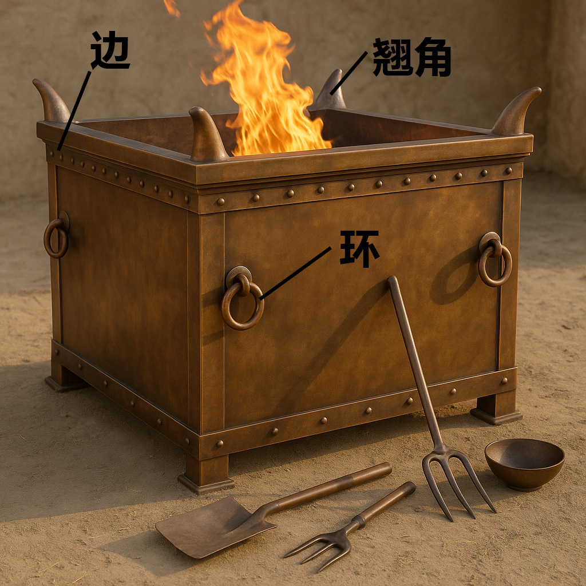

# Human-made Things in the Bible

## License Information

Human-made Things in the Bible © United Bible Societies, 2025. Adapted from: <cite>The Works of Their Hands: Man-made Things in the Bible</cite>, by Ray Pritz © 2009 United Bible Societies. This work is licensed under Creative Commons Attribution-ShareAlike 4.0 International (<a href="https://creativecommons.org/licenses/by-sa/4.0/">https://creativecommons.org/licenses/by-sa/4.0/</a>).

--------------------------------

## 标题：坛、祭坛、燔祭坛（altars） (id: REALIA:4.2)

4\.2 标题：坛、祭坛、燔祭坛（altars）
========================

*(Image generated by ChatGPT using OpenAI technology)*

祭坛是一种桌子或平台，用来向上帝献上祭牲或其他祭物。圣经提到几种祭坛：

1\. 用于献祭的以色列人祭坛

（a）建在户外露天地方的石头祭坛，如《创世记》和其他旧约书卷中提到的祭坛。

（b）在帐幕和耶路撒冷圣殿中用来献祭的祭坛

2\. 作献祭以外用途的以色列人祭坛

（a）帐幕或圣殿中的香坛，包括《启示录》中提到的供人献上祷告和焚香的坛

3\. 异教祭坛

下面的条目描述了不同的坛。然而在许多经文中，我们并不确定所指的究竟是哪种坛，尤其是在帐幕或圣殿的礼仪中，所指的可能是祭坛，也可能是香坛。很多语言都有一个统称，用来指具有多种用途的祭坛或礼台。如果目标语言没有术语表示献祭的地方，翻译者可能需要使用描述性的短语或者借用术语。更多讨论参[4\.2\.1 石坛 (stone altar)\<REALIA:4\.2\.1\>](#) 。

## 标题：石坛（stone altar） (id: REALIA:4.2.1)

4\.2\.1 标题：石坛（stone altar）
==========================

经文出处
----

Hebrew 来：מִזְבֵּחַ (音译：mizbeach)

[GEN 8:20](https://ref.ly/Gen8:20), [GEN 8:20](https://ref.ly/Gen8:20), [GEN 12:7](https://ref.ly/Gen12:7), [GEN 12:8](https://ref.ly/Gen12:8), [GEN 13:4](https://ref.ly/Gen13:4), [GEN 13:18](https://ref.ly/Gen13:18), [GEN 22:9](https://ref.ly/Gen22:9), [GEN 22:9](https://ref.ly/Gen22:9), [GEN 26:25](https://ref.ly/Gen26:25), [GEN 33:20](https://ref.ly/Gen33:20), [GEN 35:1](https://ref.ly/Gen35:1), [GEN 35:3](https://ref.ly/Gen35:3), [GEN 35:7](https://ref.ly/Gen35:7), [EXO 17:15](https://ref.ly/Exod17:15), [EXO 20:24](https://ref.ly/Exod20:24), [EXO 20:25](https://ref.ly/Exod20:25), [EXO 20:26](https://ref.ly/Exod20:26), [EXO 21:14](https://ref.ly/Exod21:14), [EXO 24:4](https://ref.ly/Exod24:4), [EXO 24:6](https://ref.ly/Exod24:6), [EXO 32:5](https://ref.ly/Exod32:5), [EXO 34:13](https://ref.ly/Exod34:13), [NUM 23:1](https://ref.ly/Num23:1), [NUM 23:2](https://ref.ly/Num23:2), [NUM 23:4](https://ref.ly/Num23:4), [NUM 23:4](https://ref.ly/Num23:4), [NUM 23:14](https://ref.ly/Num23:14), [NUM 23:14](https://ref.ly/Num23:14), [NUM 23:29](https://ref.ly/Num23:29), [NUM 23:30](https://ref.ly/Num23:30), [DEU 7:5](https://ref.ly/Deut7:5), [DEU 12:3](https://ref.ly/Deut12:3), [DEU 27:5](https://ref.ly/Deut27:5), [DEU 27:5](https://ref.ly/Deut27:5), [DEU 27:6](https://ref.ly/Deut27:6), [DEU 33:10](https://ref.ly/Deut33:10), [JOS 8:30](https://ref.ly/Josh8:30), [JOS 8:31](https://ref.ly/Josh8:31), [JOS 9:27](https://ref.ly/Josh9:27), [JOS 22:10](https://ref.ly/Josh22:10), [JOS 22:10](https://ref.ly/Josh22:10), [JOS 22:11](https://ref.ly/Josh22:11), [JOS 22:16](https://ref.ly/Josh22:16), [JOS 22:19](https://ref.ly/Josh22:19), [JOS 22:19](https://ref.ly/Josh22:19), [JOS 22:23](https://ref.ly/Josh22:23), [JOS 22:26](https://ref.ly/Josh22:26), [JOS 22:28](https://ref.ly/Josh22:28), [JOS 22:29](https://ref.ly/Josh22:29), [JOS 22:34](https://ref.ly/Josh22:34), [JDG 2:2](https://ref.ly/Judg2:2), [JDG 6:24](https://ref.ly/Judg6:24), [JDG 6:25](https://ref.ly/Judg6:25), [JDG 6:26](https://ref.ly/Judg6:26), [JDG 6:28](https://ref.ly/Judg6:28), [JDG 6:28](https://ref.ly/Judg6:28), [JDG 6:30](https://ref.ly/Judg6:30), [JDG 6:31](https://ref.ly/Judg6:31), [JDG 6:32](https://ref.ly/Judg6:32), [JDG 13:20](https://ref.ly/Judg13:20), [JDG 13:20](https://ref.ly/Judg13:20), [JDG 21:4](https://ref.ly/Judg21:4), [1SA 7:17](https://ref.ly/1Sam7:17), [1SA 14:35](https://ref.ly/1Sam14:35), [1SA 14:35](https://ref.ly/1Sam14:35), [2SA 24:18](https://ref.ly/2Sam24:18), [2SA 24:21](https://ref.ly/2Sam24:21), [2SA 24:25](https://ref.ly/2Sam24:25), [1KI 3:4](https://ref.ly/1Kgs3:4), [1KI 12:32](https://ref.ly/1Kgs12:32), [1KI 12:33](https://ref.ly/1Kgs12:33), [1KI 12:33](https://ref.ly/1Kgs12:33), [1KI 13:1](https://ref.ly/1Kgs13:1), [1KI 13:2](https://ref.ly/1Kgs13:2), [1KI 13:2](https://ref.ly/1Kgs13:2), [1KI 13:2](https://ref.ly/1Kgs13:2), [1KI 13:3](https://ref.ly/1Kgs13:3), [1KI 13:4](https://ref.ly/1Kgs13:4), [1KI 13:4](https://ref.ly/1Kgs13:4), [1KI 13:5](https://ref.ly/1Kgs13:5), [1KI 13:5](https://ref.ly/1Kgs13:5), [1KI 13:32](https://ref.ly/1Kgs13:32), [1KI 16:32](https://ref.ly/1Kgs16:32), [1KI 18:26](https://ref.ly/1Kgs18:26), [1KI 18:30](https://ref.ly/1Kgs18:30), [1KI 18:32](https://ref.ly/1Kgs18:32), [1KI 18:32](https://ref.ly/1Kgs18:32), [1KI 18:35](https://ref.ly/1Kgs18:35), [1KI 19:10](https://ref.ly/1Kgs19:10), [1KI 19:14](https://ref.ly/1Kgs19:14), [2KI 11:18](https://ref.ly/2Kgs11:18), [2KI 11:18](https://ref.ly/2Kgs11:18), [2KI 11:18](https://ref.ly/2Kgs11:18), [2KI 16:10](https://ref.ly/2Kgs16:10), [2KI 16:10](https://ref.ly/2Kgs16:10), [2KI 18:22](https://ref.ly/2Kgs18:22), [2KI 21:3](https://ref.ly/2Kgs21:3), [2KI 23:12](https://ref.ly/2Kgs23:12), [2KI 23:12](https://ref.ly/2Kgs23:12), [2KI 23:15](https://ref.ly/2Kgs23:15), [2KI 23:15](https://ref.ly/2Kgs23:15), [2KI 23:16](https://ref.ly/2Kgs23:16), [2KI 23:17](https://ref.ly/2Kgs23:17), [2KI 23:20](https://ref.ly/2Kgs23:20), [1CH 21:18](https://ref.ly/1Chr21:18), [1CH 21:22](https://ref.ly/1Chr21:22), [1CH 21:26](https://ref.ly/1Chr21:26), [1CH 21:26](https://ref.ly/1Chr21:26), [2CH 14:2](https://ref.ly/2Chr14:2), [2CH 23:17](https://ref.ly/2Chr23:17), [2CH 23:17](https://ref.ly/2Chr23:17), [2CH 28:24](https://ref.ly/2Chr28:24), [2CH 30:14](https://ref.ly/2Chr30:14), [2CH 31:1](https://ref.ly/2Chr31:1), [2CH 32:12](https://ref.ly/2Chr32:12), [2CH 33:3](https://ref.ly/2Chr33:3), [2CH 33:15](https://ref.ly/2Chr33:15), [2CH 34:4](https://ref.ly/2Chr34:4), [2CH 34:5](https://ref.ly/2Chr34:5), [2CH 34:5](https://ref.ly/2Chr34:5), [2CH 34:7](https://ref.ly/2Chr34:7), [ISA 17:8](https://ref.ly/Isa17:8), [ISA 19:19](https://ref.ly/Isa19:19), [ISA 27:9](https://ref.ly/Isa27:9), [ISA 36:7](https://ref.ly/Isa36:7), [JER 11:13](https://ref.ly/Jer11:13), [JER 11:13](https://ref.ly/Jer11:13), [JER 17:1](https://ref.ly/Jer17:1), [JER 17:2](https://ref.ly/Jer17:2), [EZK 6:4](https://ref.ly/Ezek6:4), [EZK 6:5](https://ref.ly/Ezek6:5), [EZK 6:6](https://ref.ly/Ezek6:6), [EZK 6:13](https://ref.ly/Ezek6:13), [HOS 8:11](https://ref.ly/Hos8:11), [HOS 8:11](https://ref.ly/Hos8:11), [HOS 10:1](https://ref.ly/Hos10:1), [HOS 10:2](https://ref.ly/Hos10:2), [HOS 10:8](https://ref.ly/Hos10:8), [HOS 12:12](https://ref.ly/Hos12:12), [AMO 2:8](https://ref.ly/Amos2:8), [AMO 3:14](https://ref.ly/Amos3:14), [AMO 3:14](https://ref.ly/Amos3:14)

Greek 希：βωμός (音译：bomōs)

[ACT 17:23](https://ref.ly/Acts17:23), [1MA 1:47](https://ref.ly/1Macc1:47), [1MA 1:54](https://ref.ly/1Macc1:54), [1MA 2:23](https://ref.ly/1Macc2:23), [1MA 2:24](https://ref.ly/1Macc2:24), [1MA 2:25](https://ref.ly/1Macc2:25), [1MA 2:45](https://ref.ly/1Macc2:45), [1MA 5:68](https://ref.ly/1Macc5:68), [2MA 10:2](https://ref.ly/2Macc10:2)

Greek 希：θυσιαστήριον (音译：thusiastērion)

[ROM 11:3](https://ref.ly/Rom11:3), [JAS 2:21](https://ref.ly/Jas2:21)

描述和用途
-----

*(© Ray Pritz by United Bible Societies)*

在旧约时期，特别是在帐幕或圣殿建成之前，人们在户外筑石坛献祭。坛是由大块的石头堆砌而成的一个平台。祭物是绵羊或山羊，或者谷物。以色列人用来筑坛的石头不能经过铁器的打凿或塑形（[EXO 20:25](https://ref.ly/Exod20:25) ；[DEU 27:5](https://ref.ly/Deut27:5) ）。

---

翻译
--

*在米吉多发现的圆形迦南祭坛 (© Ray Pritz by United Bible Societies)*

有些语言可能会用不同的词语来表示天然的石头与打凿成型的石块。当提到筑坛的石头时，翻译者应该选用一个表示天然石头的词语。

如果目标语言的文化中也有献动物为祭的做法，翻译者就要考虑是否有表示祭坛的对等词。许多现代文化都有用来献动物祭或供奉神明的较高构筑物，有时是一个石制或木制的平台或桌子。译文一定要清楚表明，祭物是献给上帝的。

在有些语言中，“祭坛”的对等描述是“向上帝献礼物的地方”，也可以译成“供人献祭的地方／平台／灶台”、“用来（宰杀和）献上祭物的床／平台”，或“献祭所用的（灶台）石头”。在一些经文中，翻译者可能需要添加一个短语，如“将祭物焚烧以献给上帝的地方”，或“焚烧圣香以尊荣上帝的地方”。还可译作“放置（神圣）祭物的东西”和“献祭的地方”。在大多数经文中，祭坛的实际形式并不是重点；重要的是，这是一个祭祀的地方。

注意：一些南美语言可能会有“坛”的音译词（或其西班牙文或葡萄牙文的对等词）。这个词通常是“借来的”，具有限定的意思，有时指某个圣人的神龛，有时指教堂的前部，有时指纪念爱国者的神龛。当目标语言中有这类外来词语时，翻译者一定要仔细查考这个词对目标读者来说是什么意思，以判断是否适合用在圣经译文中。

同样地，翻译者可能会倾向于使用“坛”的音译，因为那是当地的罗马天主教、圣公会或其他教会所使用的译法。与“祭司”一词的处理方法一样，我们建议不要把这个基督教术语用作翻译旧约的基础，因为它具有十分不同的神学意义。另参[4\.7 丘坛 (cult place, high place)\<REALIA:4\.7\>](#) 。

* **Associated Passages:** 创世记 8:20; 创世记 12:7; 创世记 12:8; 创世记 13:4; 创世记 13:18; 创世记 22:9; 创世记 26:25; 创世记 33:20; 创世记 35:1; 创世记 35:3; 创世记 35:7; 出埃及记 17:15; 出埃及记 20:24; 出埃及记 20:25; 出埃及记 20:26; 出埃及记 21:14; 出埃及记 24:4; 出埃及记 24:6; 出埃及记 32:5; 出埃及记 34:13; 民数记 23:1; 民数记 23:2; 民数记 23:4; 民数记 23:14; 民数记 23:29; 民数记 23:30; 申命记 7:5; 申命记 12:3; 申命记 27:5; 申命记 27:6; 申命记 33:10; 约书亚记 8:30; 约书亚记 8:31; 约书亚记 9:27; 约书亚记 22:10; 约书亚记 22:11; 约书亚记 22:16; 约书亚记 22:19; 约书亚记 22:23; 约书亚记 22:26; 约书亚记 22:28; 约书亚记 22:29; 约书亚记 22:34; 士师记 2:2; 士师记 6:24; 士师记 6:25; 士师记 6:26; 士师记 6:28; 士师记 6:30; 士师记 6:31; 士师记 6:32; 士师记 13:20; 士师记 21:4; 撒母耳记上 7:17; 撒母耳记上 14:35; 撒母耳记下 24:18; 撒母耳记下 24:21; 撒母耳记下 24:25; 列王纪上 3:4; 列王纪上 12:32; 列王纪上 12:33; 列王纪上 13:1; 列王纪上 13:2; 列王纪上 13:3; 列王纪上 13:4; 列王纪上 13:5; 列王纪上 13:32; 列王纪上 16:32; 列王纪上 18:26; 列王纪上 18:30; 列王纪上 18:32; 列王纪上 18:35; 列王纪上 19:10; 列王纪上 19:14; 列王纪下 11:18; 列王纪下 16:10; 列王纪下 18:22; 列王纪下 21:3; 列王纪下 23:12; 列王纪下 23:15; 列王纪下 23:16; 列王纪下 23:17; 列王纪下 23:20; 历代志上 21:18; 历代志上 21:22; 历代志上 21:26; 历代志下 14:2; 历代志下 23:17; 历代志下 28:24; 历代志下 30:14; 历代志下 31:1; 历代志下 32:12; 历代志下 33:3; 历代志下 33:15; 历代志下 34:4; 历代志下 34:5; 历代志下 34:7; 以赛亚书 17:8; 以赛亚书 19:19; 以赛亚书 27:9; 以赛亚书 36:7; 耶利米书 11:13; 耶利米书 17:1; 耶利米书 17:2; 以西结书 6:4; 以西结书 6:5; 以西结书 6:6; 以西结书 6:13; 何西阿书 8:11; 何西阿书 10:1; 何西阿书 10:2; 何西阿书 10:8; 何西阿书 12:12; 阿摩司书 2:8; 阿摩司书 3:14; 使徒行传 17:23; 玛加伯上 1:47; 玛加伯上 1:54; 玛加伯上 2:23; 玛加伯上 2:24; 玛加伯上 2:25; 玛加伯上 2:45; 玛加伯上 5:68; 玛加伯下 10:2; 罗马书 11:3; 雅各书 2:21

* **Associated ACAI Concepts:** Stone Altar (ID: `realia:StoneAltar`); Temple Altar (ID: `realia:TempleAltar`); Altar (ID: `realia:Altar`); Tabernacle Altar (ID: `realia:TabernacleAltar`)

## 标题：祭坛的翘角（horns of the altar） (id: REALIA:4.2.1.1)

4\.2\.1\.1 标题：祭坛的翘角（horns of the altar）
=======================================

经文出处
----

Hebrew 来：קֶרֶן (音译：qarnoth（qeren的复数形式）)

[EXO 27:2](https://ref.ly/Exod27:2), [EXO 27:2](https://ref.ly/Exod27:2), [EXO 29:12](https://ref.ly/Exod29:12), [EXO 30:2](https://ref.ly/Exod30:2), [EXO 30:3](https://ref.ly/Exod30:3), [EXO 30:10](https://ref.ly/Exod30:10), [EXO 37:25](https://ref.ly/Exod37:25), [EXO 37:26](https://ref.ly/Exod37:26), [EXO 38:2](https://ref.ly/Exod38:2), [EXO 38:2](https://ref.ly/Exod38:2), [LEV 4:7](https://ref.ly/Lev4:7), [LEV 4:18](https://ref.ly/Lev4:18), [LEV 4:25](https://ref.ly/Lev4:25), [LEV 4:30](https://ref.ly/Lev4:30), [LEV 4:34](https://ref.ly/Lev4:34), [LEV 8:15](https://ref.ly/Lev8:15), [LEV 9:9](https://ref.ly/Lev9:9), [LEV 16:18](https://ref.ly/Lev16:18), [1KI 1:50](https://ref.ly/1Kgs1:50), [1KI 1:51](https://ref.ly/1Kgs1:51), [1KI 2:28](https://ref.ly/1Kgs2:28), [PSA 118:27](https://ref.ly/Ps118:27), [JER 17:1](https://ref.ly/Jer17:1), [EZK 43:15](https://ref.ly/Ezek43:15), [EZK 43:20](https://ref.ly/Ezek43:20), [AMO 3:14](https://ref.ly/Amos3:14)

Greek 希：κέρας (音译：keras)

[JDT 9:8](https://ref.ly/Jdt9:8)

描述和用途
-----

*(Image generated by ChatGPT using OpenAI technology)*

坛角是坛顶部四个拐角的突出部分，形状像祭牲的角。有些学者认为这些翘角代表祭牲，还有一些学者认为翘角最初是用来悬挂烹饪器具的。在以色列的律法中，坛角也是一个避难的地方，在那里，误杀人者可以免受被杀者亲人的报复。

---

翻译
--

*有角香坛（石灰石，米吉多，公元前8世纪） (Gary Todd, Israel Museum, CC0, via Wikimedia Commons)*

希伯来文*qeren* 和希腊文*keras* 意思相同，都指动物（如牛）的角，但是没有必要在译文中保留这个描述性的表达。“角”在有些语言中可能很自然，但在另一些语言中，译成“突出物”（“projections”；GNT (Good News Translation (1992)) ）、“把手”（“knobs”；Mft (Moffatt Translation (1926)) ），或“突出的角”之类可能更合适。有些翻译者会扩展“角”的译文；例如，CEV (Contemporary English Version) 在[EXO 27:2](https://ref.ly/Exod27:2) 的英文意为，“使顶部的四个拐角像公牛的角一样竖起来。”

字面意为“祭坛的翘角”的希伯来文短语可以翻译为“角状突出物，位于献祭的地方（或译：放祭物的地方）的四角”，但如此冗长而复杂的译文是没有必要的；经文的重点通常不是形状。因此，在[AMO 3:14](https://ref.ly/Amos3:14) ，GNT (Good News Translation (1992)) 英文意为“每个祭坛的拐角”，清楚说明翘角的位置而非形状，这在许多语言中都是一个很好的做法。

[PSA 118:27](https://ref.ly/Ps118:27) ：这节经文的后两行包含祭牲在圣殿里行进的指示，但希伯来文本的意思有些不确定，似乎是说“用枝子把祭牲拴在坛角那里”。HOTTP (Hebrew Old Testament Text Project (UBS)) 指出，这里的希伯来文本有两种理解方式：“用绳子把祭牲拴在坛角”，或“在坛角那里用绳子把节期（朝圣者）排好”，意即敬拜者被圈在绳子里面，分别出来作为圣民。HOTTP (Hebrew Old Testament Text Project (UBS)) 依循NJPSV (New Jewish Publication Society Version) ，译为“绳子”（“ropes”）而非“树枝”。NJPSV (New Jewish Publication Society Version) 英文意为：“用绳子把祭牲拴在坛的角上。”NJB (New Jerusalem Bible (1985)) 意为：“排起队列，手拿树枝，直到坛角那里”，并在脚注中解释说：“*lulab* 礼仪，使用桃金娘枝或棕榈枝，在队列环绕祭坛时挥舞。”然而，这些解释似乎相当可疑。我们认为GNT (Good News Translation (1992)) 合理地表达了原来文本的含义，因此推荐这种译法：“手拿树枝，开始节期的庆祝，绕着祭坛行进。”SPCL (Spanish Common Language Version (Dios Habla Hoy)) 意为：“开始节期的庆祝，拿着树枝走到祭坛的角那里。”AT (American Translation (Goodspeed, 1935)) 意为：“用枝子编排节日的舞蹈，直到祭坛的角那里。”

* **Associated Passages:** 出埃及记 27:2; 出埃及记 29:12; 出埃及记 30:2; 出埃及记 30:3; 出埃及记 30:10; 出埃及记 37:25; 出埃及记 37:26; 出埃及记 38:2; 利未记 4:7; 利未记 4:18; 利未记 4:25; 利未记 4:30; 利未记 4:34; 利未记 8:15; 利未记 9:9; 利未记 16:18; 列王纪上 1:50; 列王纪上 1:51; 列王纪上 2:28; 诗篇 118:27; 耶利米书 17:1; 以西结书 43:15; 以西结书 43:20; 阿摩司书 3:14; 友弟德传 9:8

* **Associated ACAI Concepts:** Horns of Altar (ID: `realia:HornsOfAltar`)

## 标题：帐幕中的祭坛（Tabernacle altar） (id: REALIA:4.2.2)

4\.2\.2 标题：帐幕中的祭坛（Tabernacle altar）
===================================

经文出处
----

Hebrew 来：מִזְבֵּחַ (音译：mizbeach)

[EXO 27:1](https://ref.ly/Exod27:1), [EXO 27:1](https://ref.ly/Exod27:1), [EXO 27:5](https://ref.ly/Exod27:5), [EXO 27:5](https://ref.ly/Exod27:5), [EXO 27:6](https://ref.ly/Exod27:6), [EXO 27:7](https://ref.ly/Exod27:7), [EXO 28:43](https://ref.ly/Exod28:43), [EXO 29:12](https://ref.ly/Exod29:12), [EXO 29:12](https://ref.ly/Exod29:12), [EXO 29:13](https://ref.ly/Exod29:13), [EXO 29:16](https://ref.ly/Exod29:16), [EXO 29:18](https://ref.ly/Exod29:18), [EXO 29:20](https://ref.ly/Exod29:20), [EXO 29:21](https://ref.ly/Exod29:21), [EXO 29:25](https://ref.ly/Exod29:25), [EXO 29:36](https://ref.ly/Exod29:36), [EXO 29:37](https://ref.ly/Exod29:37), [EXO 29:37](https://ref.ly/Exod29:37), [EXO 29:37](https://ref.ly/Exod29:37), [EXO 29:38](https://ref.ly/Exod29:38), [EXO 29:44](https://ref.ly/Exod29:44), [EXO 30:18](https://ref.ly/Exod30:18), [EXO 30:20](https://ref.ly/Exod30:20), [EXO 30:28](https://ref.ly/Exod30:28), [EXO 31:9](https://ref.ly/Exod31:9), [EXO 35:16](https://ref.ly/Exod35:16), [EXO 38:1](https://ref.ly/Exod38:1), [EXO 38:3](https://ref.ly/Exod38:3), [EXO 38:4](https://ref.ly/Exod38:4), [EXO 38:7](https://ref.ly/Exod38:7), [EXO 38:30](https://ref.ly/Exod38:30), [EXO 38:30](https://ref.ly/Exod38:30), [EXO 39:39](https://ref.ly/Exod39:39), [EXO 40:6](https://ref.ly/Exod40:6), [EXO 40:7](https://ref.ly/Exod40:7), [EXO 40:10](https://ref.ly/Exod40:10), [EXO 40:10](https://ref.ly/Exod40:10), [EXO 40:10](https://ref.ly/Exod40:10), [EXO 40:29](https://ref.ly/Exod40:29), [EXO 40:30](https://ref.ly/Exod40:30), [EXO 40:32](https://ref.ly/Exod40:32), [EXO 40:33](https://ref.ly/Exod40:33), [LEV 1:5](https://ref.ly/Lev1:5), [LEV 1:7](https://ref.ly/Lev1:7), [LEV 1:8](https://ref.ly/Lev1:8), [LEV 1:9](https://ref.ly/Lev1:9), [LEV 1:11](https://ref.ly/Lev1:11), [LEV 1:11](https://ref.ly/Lev1:11), [LEV 1:12](https://ref.ly/Lev1:12), [LEV 1:13](https://ref.ly/Lev1:13), [LEV 1:15](https://ref.ly/Lev1:15), [LEV 1:15](https://ref.ly/Lev1:15), [LEV 1:15](https://ref.ly/Lev1:15), [LEV 1:16](https://ref.ly/Lev1:16), [LEV 1:17](https://ref.ly/Lev1:17), [LEV 2:2](https://ref.ly/Lev2:2), [LEV 2:8](https://ref.ly/Lev2:8), [LEV 2:9](https://ref.ly/Lev2:9), [LEV 2:12](https://ref.ly/Lev2:12), [LEV 3:2](https://ref.ly/Lev3:2), [LEV 3:5](https://ref.ly/Lev3:5), [LEV 3:8](https://ref.ly/Lev3:8), [LEV 3:11](https://ref.ly/Lev3:11), [LEV 3:13](https://ref.ly/Lev3:13), [LEV 3:16](https://ref.ly/Lev3:16), [LEV 4:7](https://ref.ly/Lev4:7), [LEV 4:10](https://ref.ly/Lev4:10), [LEV 4:18](https://ref.ly/Lev4:18), [LEV 4:18](https://ref.ly/Lev4:18), [LEV 4:19](https://ref.ly/Lev4:19), [LEV 4:25](https://ref.ly/Lev4:25), [LEV 4:25](https://ref.ly/Lev4:25), [LEV 4:26](https://ref.ly/Lev4:26), [LEV 4:30](https://ref.ly/Lev4:30), [LEV 4:30](https://ref.ly/Lev4:30), [LEV 4:31](https://ref.ly/Lev4:31), [LEV 4:34](https://ref.ly/Lev4:34), [LEV 4:34](https://ref.ly/Lev4:34), [LEV 4:35](https://ref.ly/Lev4:35), [LEV 5:9](https://ref.ly/Lev5:9), [LEV 5:9](https://ref.ly/Lev5:9), [LEV 5:12](https://ref.ly/Lev5:12), [LEV 6:2](https://ref.ly/Lev6:2), [LEV 6:2](https://ref.ly/Lev6:2), [LEV 6:3](https://ref.ly/Lev6:3), [LEV 6:3](https://ref.ly/Lev6:3), [LEV 6:5](https://ref.ly/Lev6:5), [LEV 6:6](https://ref.ly/Lev6:6), [LEV 6:7](https://ref.ly/Lev6:7), [LEV 6:8](https://ref.ly/Lev6:8), [LEV 7:2](https://ref.ly/Lev7:2), [LEV 7:5](https://ref.ly/Lev7:5), [LEV 7:31](https://ref.ly/Lev7:31), [LEV 8:11](https://ref.ly/Lev8:11), [LEV 8:11](https://ref.ly/Lev8:11), [LEV 8:15](https://ref.ly/Lev8:15), [LEV 8:15](https://ref.ly/Lev8:15), [LEV 8:15](https://ref.ly/Lev8:15), [LEV 8:16](https://ref.ly/Lev8:16), [LEV 8:19](https://ref.ly/Lev8:19), [LEV 8:21](https://ref.ly/Lev8:21), [LEV 8:24](https://ref.ly/Lev8:24), [LEV 8:28](https://ref.ly/Lev8:28), [LEV 8:30](https://ref.ly/Lev8:30), [LEV 9:7](https://ref.ly/Lev9:7), [LEV 9:8](https://ref.ly/Lev9:8), [LEV 9:9](https://ref.ly/Lev9:9), [LEV 9:9](https://ref.ly/Lev9:9), [LEV 9:10](https://ref.ly/Lev9:10), [LEV 9:12](https://ref.ly/Lev9:12), [LEV 9:13](https://ref.ly/Lev9:13), [LEV 9:14](https://ref.ly/Lev9:14), [LEV 9:17](https://ref.ly/Lev9:17), [LEV 9:18](https://ref.ly/Lev9:18), [LEV 9:20](https://ref.ly/Lev9:20), [LEV 9:24](https://ref.ly/Lev9:24), [LEV 10:12](https://ref.ly/Lev10:12), [LEV 14:20](https://ref.ly/Lev14:20), [LEV 16:12](https://ref.ly/Lev16:12), [LEV 16:18](https://ref.ly/Lev16:18), [LEV 16:18](https://ref.ly/Lev16:18), [LEV 16:20](https://ref.ly/Lev16:20), [LEV 16:25](https://ref.ly/Lev16:25), [LEV 16:33](https://ref.ly/Lev16:33), [LEV 17:6](https://ref.ly/Lev17:6), [LEV 17:11](https://ref.ly/Lev17:11), [LEV 21:23](https://ref.ly/Lev21:23), [LEV 22:22](https://ref.ly/Lev22:22), [NUM 3:26](https://ref.ly/Num3:26), [NUM 3:31](https://ref.ly/Num3:31), [NUM 4:13](https://ref.ly/Num4:13), [NUM 4:14](https://ref.ly/Num4:14), [NUM 4:26](https://ref.ly/Num4:26), [NUM 5:25](https://ref.ly/Num5:25), [NUM 5:26](https://ref.ly/Num5:26), [NUM 7:1](https://ref.ly/Num7:1), [NUM 7:10](https://ref.ly/Num7:10), [NUM 7:10](https://ref.ly/Num7:10), [NUM 7:11](https://ref.ly/Num7:11), [NUM 7:84](https://ref.ly/Num7:84), [NUM 7:88](https://ref.ly/Num7:88), [NUM 17:3](https://ref.ly/Num17:3), [NUM 17:4](https://ref.ly/Num17:4), [NUM 17:11](https://ref.ly/Num17:11), [NUM 18:3](https://ref.ly/Num18:3), [NUM 18:5](https://ref.ly/Num18:5), [NUM 18:7](https://ref.ly/Num18:7), [NUM 18:17](https://ref.ly/Num18:17), [DEU 12:27](https://ref.ly/Deut12:27), [DEU 12:27](https://ref.ly/Deut12:27), [DEU 16:21](https://ref.ly/Deut16:21), [DEU 26:4](https://ref.ly/Deut26:4), [JOS 22:29](https://ref.ly/Josh22:29), [1SA 2:28](https://ref.ly/1Sam2:28), [1SA 2:33](https://ref.ly/1Sam2:33), [1KI 1:50](https://ref.ly/1Kgs1:50), [1KI 1:51](https://ref.ly/1Kgs1:51), [1KI 1:53](https://ref.ly/1Kgs1:53), [1KI 2:28](https://ref.ly/1Kgs2:28), [1KI 2:29](https://ref.ly/1Kgs2:29), [1CH 21:29](https://ref.ly/1Chr21:29), [2CH 1:5](https://ref.ly/2Chr1:5), [2CH 1:6](https://ref.ly/2Chr1:6)

经文出处
----

### **边、台** ：

Hebrew 来：כַּרְכֹּב (音译：karkov)

[EXO 27:5](https://ref.ly/Exod27:5), [EXO 38:4](https://ref.ly/Exod38:4)

描述
--

*可移动会幕的祭坛（亭纳公园（Timnah Park）） (© Ori229, CC BY\-SA 3\.0, via Wikimedia Commons)*

帐幕中的祭坛用金合欢木制成，里外都包着铜，边长5肘（2\.5米或8\.3英尺），高3肘（1\.5米或5英尺）。坛是中空的，顶部四围有台或边（希伯来文*karkov* ），经文没有具体说明祭坛的用途。

---

翻译
--

参上文[4\.2 坛、祭坛、燔祭坛 (altars)\<REALIA:4\.2\>](#) 和[4\.2\.1 石坛 (stone altar)\<REALIA:4\.2\.1\>](#) 。

**边、台** ：希伯来文*karkov* 只出现在[EXO 27:5](https://ref.ly/Exod27:5) 和[EXO 38:4](https://ref.ly/Exod38:4) ，意思不明。有些学者认为这是坛四围的饰“边”（“rim”；GNT (Good News Translation (1992)) ），当利未人通过铜网上的环抬起祭坛时，饰边还可以承受坛的一部分重量（[EXO 27:4](https://ref.ly/Exod27:4) ；参[4\.2\.3 圣殿中的祭坛 (Temple altar)\<REALIA:4\.2\.3\>](#) 插图所示的边）。还有学者认为这可能是一个“台”（“ledge”；RSV (Revised Standard Version (1952)) ），宽到可以让供职的祭司站在上面，但这不大可能，因为坛本身只有1\.5米（5英尺）高。

经文没有明确指出这道边是位于坛的顶部、中间，还是底部，也没有说明是在坛的里面还是外面。NAB (New American Bible (1970)) 将*karkov* 简单地译作“around”（“四围”），因为这个词的词根意思可能是环绕或围绕。在[EXO 27:5](https://ref.ly/Exod27:5) a，NAB (New American Bible (1970)) 英文意为，“将铜网沿着坛的四周放下，放到地上。”

注意，[EXO 27:5](https://ref.ly/Exod27:5) 的希伯来文本同时使用了“在下面”（“under”）和“在下面”（“below”）两个词，这可能是为了强调或澄清。NJPSV (New Jewish Publication Society Version) 英文意为“把网放在下面，在坛的台下面”，NJB (New Jerusalem Bible (1985)) 意为“要放在坛的台下面，在下方”。由于这些术语的含义存在很大的不确定性，翻译者必须从“台”和“边”之中选择其一。我们猜测，这可能是围绕坛顶的一个结构边。

* **Associated Passages:** 出埃及记 27:1; 出埃及记 27:5; 出埃及记 27:6; 出埃及记 27:7; 出埃及记 28:43; 出埃及记 29:12; 出埃及记 29:13; 出埃及记 29:16; 出埃及记 29:18; 出埃及记 29:20; 出埃及记 29:21; 出埃及记 29:25; 出埃及记 29:36; 出埃及记 29:37; 出埃及记 29:38; 出埃及记 29:44; 出埃及记 30:18; 出埃及记 30:20; 出埃及记 30:28; 出埃及记 31:9; 出埃及记 35:16; 出埃及记 38:1; 出埃及记 38:3; 出埃及记 38:4; 出埃及记 38:7; 出埃及记 38:30; 出埃及记 39:39; 出埃及记 40:6; 出埃及记 40:7; 出埃及记 40:10; 出埃及记 40:29; 出埃及记 40:30; 出埃及记 40:32; 出埃及记 40:33; 利未记 1:5; 利未记 1:7; 利未记 1:8; 利未记 1:9; 利未记 1:11; 利未记 1:12; 利未记 1:13; 利未记 1:15; 利未记 1:16; 利未记 1:17; 利未记 2:2; 利未记 2:8; 利未记 2:9; 利未记 2:12; 利未记 3:2; 利未记 3:5; 利未记 3:8; 利未记 3:11; 利未记 3:13; 利未记 3:16; 利未记 4:7; 利未记 4:10; 利未记 4:18; 利未记 4:19; 利未记 4:25; 利未记 4:26; 利未记 4:30; 利未记 4:31; 利未记 4:34; 利未记 4:35; 利未记 5:9; 利未记 5:12; 利未记 6:2; 利未记 6:3; 利未记 6:5; 利未记 6:6; 利未记 6:7; 利未记 6:8; 利未记 7:2; 利未记 7:5; 利未记 7:31; 利未记 8:11; 利未记 8:15; 利未记 8:16; 利未记 8:19; 利未记 8:21; 利未记 8:24; 利未记 8:28; 利未记 8:30; 利未记 9:7; 利未记 9:8; 利未记 9:9; 利未记 9:10; 利未记 9:12; 利未记 9:13; 利未记 9:14; 利未记 9:17; 利未记 9:18; 利未记 9:20; 利未记 9:24; 利未记 10:12; 利未记 14:20; 利未记 16:12; 利未记 16:18; 利未记 16:20; 利未记 16:25; 利未记 16:33; 利未记 17:6; 利未记 17:11; 利未记 21:23; 利未记 22:22; 民数记 3:26; 民数记 3:31; 民数记 4:13; 民数记 4:14; 民数记 4:26; 民数记 5:25; 民数记 5:26; 民数记 7:1; 民数记 7:10; 民数记 7:11; 民数记 7:84; 民数记 7:88; 民数记 17:3; 民数记 17:4; 民数记 17:11; 民数记 18:3; 民数记 18:5; 民数记 18:7; 民数记 18:17; 申命记 12:27; 申命记 16:21; 申命记 26:4; 约书亚记 22:29; 撒母耳记上 2:28; 撒母耳记上 2:33; 列王纪上 1:50; 列王纪上 1:51; 列王纪上 1:53; 列王纪上 2:28; 列王纪上 2:29; 历代志上 21:29; 历代志下 1:5; 历代志下 1:6; 出埃及记 27:4

* **Associated ACAI Concepts:** Tabernacle Altar (ID: `realia:TabernacleAltar`); Temple Altar (ID: `realia:TempleAltar`); Stone Altar (ID: `realia:StoneAltar`); Altar (ID: `realia:Altar`)

## 标题：网、铜网（grating, mesh） (id: REALIA:4.2.2.1)

4\.2\.2\.1 标题：网、铜网（grating, mesh）
=================================

经文出处
----

Hebrew 来：מִכְבָּר (音译：mikbar)

[EXO 27:4](https://ref.ly/Exod27:4), [EXO 35:16](https://ref.ly/Exod35:16), [EXO 38:5](https://ref.ly/Exod38:5), [EXO 38:5](https://ref.ly/Exod38:5), [EXO 38:30](https://ref.ly/Exod38:30), [EXO 39:39](https://ref.ly/Exod39:39)

经文出处
----

### **环** ：

Hebrew 来：טַבַּעַת (音译：taba‘ath)

[EXO 27:4](https://ref.ly/Exod27:4), [EXO 27:7](https://ref.ly/Exod27:7), [EXO 38:5](https://ref.ly/Exod38:5), [EXO 38:7](https://ref.ly/Exod38:7)

经文出处
----

### **杠** ：

Hebrew 来：בַּד (音译：bad)

[EXO 27:6](https://ref.ly/Exod27:6), [EXO 27:6](https://ref.ly/Exod27:6), [EXO 27:7](https://ref.ly/Exod27:7), [EXO 27:7](https://ref.ly/Exod27:7), [EXO 38:5](https://ref.ly/Exod38:5), [EXO 38:6](https://ref.ly/Exod38:6), [EXO 38:7](https://ref.ly/Exod38:7)

描述和用途
-----

帐幕祭坛的网是用青铜制成的，形状与蜘蛛网相似，具有比较细密的网状结构。铜网的用途没有说明，可能是用来放置木炭、让灰烬和油脂漏到地面上，以及使空气从下面流过铜网，来维持火炭的燃烧。这些都是保持火势旺盛所必需的。铜网上面的四个角带有铜环。把杠穿过这些铜环，就可以搬运祭坛。

---

翻译
--

*祭坛内的铜网（BYU模型） (© Ben P L, CC BY 2\.0, via Wikimedia Commons)*

网的希伯来文（*mikbar* ）与[AMO 9:9](https://ref.ly/Amos9:9) 中的“筛子”一词有关联。[EXO 27:4](https://ref.ly/Exod27:4) 的希伯来文本用了短语*ma‘aseh resheth* （字面意为“网状物”）来描述这个物件。学者对于网的确切位置和功能有不同看法。有些学者认为，网只是围绕祭坛下半部分的装饰物，也可能是为了加固坛的木制框架；例如，在[EXO 27:4](https://ref.ly/Exod27:4) a，CEV (Contemporary English Version) 英文意为，“用一个装饰性的铜网盖住坛的下半部分。”然而，大多数学者都同意前文关于铜网的描述。网在坛上或坛内的位置，与围绕坛顶的边或台有某种关系（参[4\.2\.2 帐幕中的祭坛 (Tabernacle altar)\<REALIA:4\.2\.2\>](#) ）。

[EXO 27:5](https://ref.ly/Exod27:5) b的希伯来文本字面意为“网直到坛的一半”，RSV (Revised Standard Version (1952)) 英文意为“使网下垂到坛的半腰”。然而，希伯来文本并没有指明网是向下垂到坛的半腰，还是“向上达到坛的半腰”（GNT (Good News Translation (1992)) 直译）。大多数译本作“向上达到半腰”，显示网是放在坛的下半部分。但是，RSV (Revised Standard Version (1952)) 和NRSV (New Revised Standard Version (1989)) 暗示网靠近顶部；建议翻译者采纳这个解释。

总结各译本可见，翻译者在翻译[EXO 38:4](https://ref.ly/Exod38:4); [EXO 38:5](https://ref.ly/Exod38:5) 和平行经文[EXO 27:4](https://ref.ly/Exod27:4); [EXO 27:7](https://ref.ly/Exod27:7) 时，可以不必清楚说明网、边和祭坛之间的位置关系。虽然边和网的作用存在争议，但是清楚地描述其中一种可能的情况，好过对读者而言毫无意义的译法。下文所示范例出自《〈出埃及记〉手册》（*A Handbook on Exodus* ，第635页）：

4\~要为坛做一个铜网，像是一个滤网，在网的四角各固定一个铜环。5\~然后，把网安在坛四围的边的下面，使网在坛内垂到半腰。

另一个译法：

5\~要在靠近坛顶端的四围做一道边，上面悬挂一个铜网，这铜网在坛内一直垂到半腰。在网的四角各固定一个铜环。

**环和杠** ：[EXO 27:4](https://ref.ly/Exod27:4) 记载，铜环要安在网的“角”或“边”上。第7节说，杠要穿过“环子，从而杠靠在坛的两侧”（RSV (Revised Standard Version (1952)) 直译）。希伯来文本似乎表明，环子只有一套，即固定在网上的那些铜环，并且整个祭坛就是通过这套环子来抬运的。环的位置取决于翻译者如何理解上文讨论的网。如果将网理解为坛外面一圈的网格，那么环就是固定在网格上。另一方面，如果认为“网”是水平放在坛的里面，那么环就是穿过坛的四角伸到外面，从而可以穿上木杠。

利未人把杠穿过铜环，然后抬起祭坛，搬运到目的地；把坛放好之后，可能会把杠抽出来。如果目标语言用不同的词语表示永久性的安装和临时安装某个物件，这里需要采用后者。这可能意味着翻译者要在[EXO 27:7](https://ref.ly/Exod27:7) 中使用一个与[EXO 25:14](https://ref.ly/Exod25:14) 所用不同的动词（参[4\.1 约柜 (Covenant Box, Ark of the Covenant)\<REALIA:4\.1\>](#) 中的讨论）。

* **Associated Passages:** 出埃及记 27:4; 出埃及记 35:16; 出埃及记 38:5; 出埃及记 38:30; 出埃及记 39:39; 出埃及记 27:7; 出埃及记 38:7; 出埃及记 27:6; 出埃及记 38:6; 阿摩司书 9:9; 出埃及记 27:5; 出埃及记 38:4; 出埃及记 25:14

* **Associated ACAI Concepts:** Grating (ID: `realia:Grating`)

## 标题：圣殿中的祭坛（Temple altar） (id: REALIA:4.2.3)

4\.2\.3 标题：圣殿中的祭坛（Temple altar）
===============================

经文出处
----

Aramaic 兰：מַדְבַּח (音译：madbach)

[EZR 7:17](https://ref.ly/Ezra7:17)

Hebrew 来：מִזְבֵּחַ (音译：mizbeach)

[1KI 8:22](https://ref.ly/1Kgs8:22), [1KI 8:31](https://ref.ly/1Kgs8:31), [1KI 8:54](https://ref.ly/1Kgs8:54), [1KI 8:64](https://ref.ly/1Kgs8:64), [1KI 9:25](https://ref.ly/1Kgs9:25), [2KI 11:11](https://ref.ly/2Kgs11:11), [2KI 12:10](https://ref.ly/2Kgs12:10), [2KI 16:11](https://ref.ly/2Kgs16:11), [2KI 16:12](https://ref.ly/2Kgs16:12), [2KI 16:12](https://ref.ly/2Kgs16:12), [2KI 16:13](https://ref.ly/2Kgs16:13), [2KI 16:14](https://ref.ly/2Kgs16:14), [2KI 16:14](https://ref.ly/2Kgs16:14), [2KI 16:14](https://ref.ly/2Kgs16:14), [2KI 16:15](https://ref.ly/2Kgs16:15), [2KI 16:15](https://ref.ly/2Kgs16:15), [2KI 18:22](https://ref.ly/2Kgs18:22), [2KI 21:4](https://ref.ly/2Kgs21:4), [2KI 21:5](https://ref.ly/2Kgs21:5), [2KI 23:9](https://ref.ly/2Kgs23:9), [1CH 6:34](https://ref.ly/1Chr6:34), [1CH 16:40](https://ref.ly/1Chr16:40), [1CH 22:1](https://ref.ly/1Chr22:1), [2CH 4:1](https://ref.ly/2Chr4:1), [2CH 5:12](https://ref.ly/2Chr5:12), [2CH 6:12](https://ref.ly/2Chr6:12), [2CH 6:22](https://ref.ly/2Chr6:22), [2CH 7:7](https://ref.ly/2Chr7:7), [2CH 7:9](https://ref.ly/2Chr7:9), [2CH 8:12](https://ref.ly/2Chr8:12), [2CH 15:8](https://ref.ly/2Chr15:8), [2CH 23:10](https://ref.ly/2Chr23:10), [2CH 29:18](https://ref.ly/2Chr29:18), [2CH 29:19](https://ref.ly/2Chr29:19), [2CH 29:21](https://ref.ly/2Chr29:21), [2CH 29:22](https://ref.ly/2Chr29:22), [2CH 29:22](https://ref.ly/2Chr29:22), [2CH 29:22](https://ref.ly/2Chr29:22), [2CH 29:24](https://ref.ly/2Chr29:24), [2CH 29:27](https://ref.ly/2Chr29:27), [2CH 32:12](https://ref.ly/2Chr32:12), [2CH 33:4](https://ref.ly/2Chr33:4), [2CH 33:5](https://ref.ly/2Chr33:5), [2CH 33:16](https://ref.ly/2Chr33:16), [2CH 35:16](https://ref.ly/2Chr35:16), [EZR 3:2](https://ref.ly/Ezra3:2), [EZR 3:3](https://ref.ly/Ezra3:3), [NEH 10:35](https://ref.ly/Neh10:35), [PSA 26:6](https://ref.ly/Ps26:6), [PSA 43:4](https://ref.ly/Ps43:4), [PSA 51:21](https://ref.ly/Ps51:21), [PSA 84:4](https://ref.ly/Ps84:4), [PSA 118:27](https://ref.ly/Ps118:27), [ISA 6:6](https://ref.ly/Isa6:6), [ISA 36:7](https://ref.ly/Isa36:7), [ISA 56:7](https://ref.ly/Isa56:7), [ISA 60:7](https://ref.ly/Isa60:7), [LAM 2:7](https://ref.ly/Lam2:7), [EZK 8:5](https://ref.ly/Ezek8:5), [EZK 8:16](https://ref.ly/Ezek8:16), [EZK 9:2](https://ref.ly/Ezek9:2), [EZK 40:46](https://ref.ly/Ezek40:46), [EZK 40:47](https://ref.ly/Ezek40:47), [EZK 43:13](https://ref.ly/Ezek43:13), [EZK 43:13](https://ref.ly/Ezek43:13), [EZK 43:18](https://ref.ly/Ezek43:18), [EZK 43:22](https://ref.ly/Ezek43:22), [EZK 43:26](https://ref.ly/Ezek43:26), [EZK 43:27](https://ref.ly/Ezek43:27), [EZK 45:19](https://ref.ly/Ezek45:19), [EZK 47:1](https://ref.ly/Ezek47:1), [JOL 1:13](https://ref.ly/Joel1:13), [JOL 2:17](https://ref.ly/Joel2:17), [AMO 9:1](https://ref.ly/Amos9:1), [ZEC 9:15](https://ref.ly/Zech9:15), [ZEC 14:20](https://ref.ly/Zech14:20), [MAL 1:7](https://ref.ly/Mal1:7), [MAL 1:10](https://ref.ly/Mal1:10), [MAL 2:13](https://ref.ly/Mal2:13)

Hebrew 来：שֻׁלְחָן (音译：shulchan)

[MAL 1:7](https://ref.ly/Mal1:7), [MAL 1:12](https://ref.ly/Mal1:12)

Greek 希：βωμός (音译：bōmos)

[SIR 50:12](https://ref.ly/Sir50:12), [SIR 50:14](https://ref.ly/Sir50:14), [1MA 1:59](https://ref.ly/1Macc1:59), [2MA 2:19](https://ref.ly/2Macc2:19), [2MA 13:8](https://ref.ly/2Macc13:8)

Greek 希：θυσιαστήριον (音译：thusiastērion)

[MAT 5:23](https://ref.ly/Matt5:23), [MAT 5:24](https://ref.ly/Matt5:24), [MAT 23:20](https://ref.ly/Matt23:20), [MAT 23:35](https://ref.ly/Matt23:35), [LUK 11:51](https://ref.ly/Luke11:51), [1CO 9:13](https://ref.ly/1Cor9:13), [1CO 9:13](https://ref.ly/1Cor9:13), [1CO 10:18](https://ref.ly/1Cor10:18), [HEB 7:13](https://ref.ly/Heb7:13), [HEB 13:10](https://ref.ly/Heb13:10), [REV 11:1](https://ref.ly/Rev11:1)

Latin 拉：altare

[2ES 10:21](https://ref.ly/2Esd10:21)

描述和用途
-----

*圣殿中的祭坛 (Image generated by ChatGPT using OpenAI technology)*

在耶路撒冷圣殿的院内，有一个大型的祭坛放在圣所的前面，这祭坛是铜制的箱状物件，里面有一个网或栅格。祭司使坛上的火常常烧着，以焚烧百姓带来献给上帝的祭牲。[2CH 4:1](https://ref.ly/2Chr4:1) 记载，这座祭坛由所罗门建造，每边长10米（33英尺），高5米（16\.5英尺）。实际上，祭司是站在这座大祭坛的顶部，在那里一直燃烧着的火堆旁工作的。祭司通过一条很大的坡道上下祭坛（比下图所示的坡道更大）。

这座祭坛可能有几个台阶或平台。[EZK 43:13–EZK 43:17](https://ref.ly/Ezek43:13-Ezek43:17) 描述了这种三层结构的祭坛。基座的尺寸与上文给出的尺寸相同，总高度是5米，但每一层的高度不详。

---

翻译
--

参上文[4\.2 坛、祭坛、燔祭坛 (altars)\<REALIA:4\.2\>](#) 和[4\.2\.1 石坛 (stone altar)\<REALIA:4\.2\.1\>](#) 中的讨论。

* **Associated Passages:** 以斯拉记 7:17; 列王纪上 8:22; 列王纪上 8:31; 列王纪上 8:54; 列王纪上 8:64; 列王纪上 9:25; 列王纪下 11:11; 列王纪下 12:10; 列王纪下 16:11; 列王纪下 16:12; 列王纪下 16:13; 列王纪下 16:14; 列王纪下 16:15; 列王纪下 18:22; 列王纪下 21:4; 列王纪下 21:5; 列王纪下 23:9; 历代志上 6:34; 历代志上 16:40; 历代志上 22:1; 历代志下 4:1; 历代志下 5:12; 历代志下 6:12; 历代志下 6:22; 历代志下 7:7; 历代志下 7:9; 历代志下 8:12; 历代志下 15:8; 历代志下 23:10; 历代志下 29:18; 历代志下 29:19; 历代志下 29:21; 历代志下 29:22; 历代志下 29:24; 历代志下 29:27; 历代志下 32:12; 历代志下 33:4; 历代志下 33:5; 历代志下 33:16; 历代志下 35:16; 以斯拉记 3:2; 以斯拉记 3:3; 尼希米记 10:35; 诗篇 26:6; 诗篇 43:4; 诗篇 51:21; 诗篇 84:4; 诗篇 118:27; 以赛亚书 6:6; 以赛亚书 36:7; 以赛亚书 56:7; 以赛亚书 60:7; 耶利米哀歌 2:7; 以西结书 8:5; 以西结书 8:16; 以西结书 9:2; 以西结书 40:46; 以西结书 40:47; 以西结书 43:13; 以西结书 43:18; 以西结书 43:22; 以西结书 43:26; 以西结书 43:27; 以西结书 45:19; 以西结书 47:1; 约珥书 1:13; 约珥书 2:17; 阿摩司书 9:1; 撒迦利亚书 9:15; 撒迦利亚书 14:20; 玛拉基书 1:7; 玛拉基书 1:10; 玛拉基书 2:13; 玛拉基书 1:12; 德训篇 50:12; 德训篇 50:14; 玛加伯上 1:59; 玛加伯下 2:19; 玛加伯下 13:8; 马太福音 5:23; 马太福音 5:24; 马太福音 23:20; 马太福音 23:35; 路加福音 11:51; 哥林多前书 9:13; 哥林多前书 10:18; 希伯来书 7:13; 希伯来书 13:10; 启示录 11:1; 厄斯德拉下 10:21; 以西结书 43:17

* **Associated ACAI Concepts:** Temple Altar (ID: `realia:TempleAltar`); Tabernacle Altar (ID: `realia:TabernacleAltar`); Stone Altar (ID: `realia:StoneAltar`); Altar (ID: `realia:Altar`)

## 标题：香坛（incense altar） (id: REALIA:4.2.4)

4\.2\.4 标题：香坛（incense altar）
============================

经文出处
----

Hebrew 来：מִזְבֵּחַ, מִקְטָר, קְטֹרֶת (音译：mizbeach (miqtar qetoreth))

[EXO 30:1](https://ref.ly/Exod30:1), [EXO 30:27](https://ref.ly/Exod30:27), [EXO 31:8](https://ref.ly/Exod31:8), [EXO 35:15](https://ref.ly/Exod35:15), [EXO 37:25](https://ref.ly/Exod37:25), [EXO 39:38](https://ref.ly/Exod39:38), [EXO 40:5](https://ref.ly/Exod40:5), [EXO 40:26](https://ref.ly/Exod40:26), [LEV 4:7](https://ref.ly/Lev4:7), [NUM 4:11](https://ref.ly/Num4:11), [1KI 6:20](https://ref.ly/1Kgs6:20), [1KI 6:22](https://ref.ly/1Kgs6:22), [1KI 7:48](https://ref.ly/1Kgs7:48), [1CH 6:34](https://ref.ly/1Chr6:34), [1CH 28:18](https://ref.ly/1Chr28:18), [2CH 4:19](https://ref.ly/2Chr4:19), [2CH 26:16](https://ref.ly/2Chr26:16), [2CH 26:19](https://ref.ly/2Chr26:19), [EZK 41:22](https://ref.ly/Ezek41:22)

Hebrew 来：מְקַטֶּרֶת (音译：meqatereth)

[2CH 30:14](https://ref.ly/2Chr30:14)

Hebrew 来：לְבֵנָה (音译：lvenah)

[ISA 65:3](https://ref.ly/Isa65:3)

Hebrew 来：שֻׁלְחָן (音译：shulchan)

[EZK 41:22](https://ref.ly/Ezek41:22), [EZK 44:16](https://ref.ly/Ezek44:16)

Greek 希：θυμιατήριον (音译：thumiatērion)

[HEB 9:4](https://ref.ly/Heb9:4)

Greek 希：θυσιαστήριον, θυμίαμα (音译：thusiastērion (tou thumiamatos), thumiama)

[LUK 1:11](https://ref.ly/Luke1:11), [REV 6:9](https://ref.ly/Rev6:9), [REV 8:3](https://ref.ly/Rev8:3), [REV 8:3](https://ref.ly/Rev8:3), [REV 8:3](https://ref.ly/Rev8:3), [REV 8:5](https://ref.ly/Rev8:5), [REV 9:13](https://ref.ly/Rev9:13), [REV 14:18](https://ref.ly/Rev14:18), [REV 16:7](https://ref.ly/Rev16:7), [1MA 1:21](https://ref.ly/1Macc1:21), [1MA 4:49](https://ref.ly/1Macc4:49), [1MA 4:50](https://ref.ly/1Macc4:50), [2MA 2:5](https://ref.ly/2Macc2:5)

描述和用途
-----

*香坛 (© Ori229, CC BY\-SA 3\.0, via Wikimedia Commons)*

香坛是一个木制的桌柜，全部用锤出来的金子包着。香坛比祭坛小，高约1米（40英寸），每边长50厘米（20英寸）。根据[EXO 30:10](https://ref.ly/Exod30:10) 的描述，这个坛也有“翘角”（参[4\.2\.1\.1 祭坛的翘角 (horns of the altar)\<REALIA:4\.2\.1\.1\>](#) ）。香坛放在帐幕和耶路撒冷圣殿的圣所内，祭司每日在香坛上烧香（参[4\.4\.7\.1 香、乳香 (incense, frankincense)\<REALIA:4\.4\.7\.1\>](#) ）和祈祷。

---

翻译
--

*大祭司在圣殿中的香坛前 (© Ray Pritz by United Bible Societies)*

在有些语言中，“香坛”可译作“焚香敬拜上帝的地方”。翻译者必须避免译文暗示坛是用香做成的。另外也可以译作：“百姓焚香献给上帝的桌子／地方／火盆／灶台”，或“百姓焚烧膏油并且上帝以之为馨香的桌子／地方／火盆／灶台”。

如果目标语言文化中有任何用于仪式的类似桌子或炭炉，那么这可能是一个合适的译词。

香坛和祭司的香炉（参[4\.4\.7 香炉 (censer)\<REALIA:4\.4\.7\>](#) ）之间的关系可能会让人迷惑不解。努德西伊（Noordtzij，第144页）的注解会有助于我们了解：“因为这里（[NUM 16:6](https://ref.ly/Num16:6) ，[NUM 16:17](https://ref.ly/Num16:17) ）的香炉用于烧香，有些学者推断作者不明白[EXO 30:1–EXO 30:10](https://ref.ly/Exod30:1-Exod30:10) ；[EXO 37:25–EXO 37:29](https://ref.ly/Exod37:25-Exod37:29) 所记的金香坛，但这是基于一个误解。香坛供每日烧香之用，香的烟雾可以说是隔开了圣所和至圣所，这样，供职的祭司就不致因为接近临在约柜上面的上帝而有危险。但是，香炉只有在祭司（在以色列只有大祭司）靠近约柜时才用到（[LEV 16:12](https://ref.ly/Lev16:12); [LEV 16:13](https://ref.ly/Lev16:13) ）”。另参[4\.4\.5 小铲子、火盆 (small shovel, firepan)\<REALIA:4\.4\.5\>](#) 中的注解。

把杠穿过香坛两侧的环，就可以将其抬起来（[EXO 30:4](https://ref.ly/Exod30:4); [EXO 30:5](https://ref.ly/Exod30:5) ，[EXO 37:27](https://ref.ly/Exod37:27); [EXO 37:28](https://ref.ly/Exod37:28) ）。参上文[4\.1 约柜 (Covenant Box, Ark of the Covenant)\<REALIA:4\.1\>](#) 的讨论。与抬约柜的杠不同，抬香坛等物的杠在物件安放在指定位置后要抽出来。

[ISA 65:3](https://ref.ly/Isa65:3) ：字面意为“他们在砖上烧香”这个分句的确切意思不详，然而先知显然是在谴责以色列人随从某种异教习俗。翻译者可以参照NIV (New International Version (1984)) 、NCV (New Century Version) 和SPCL (Spanish Common Language Version (Dios Habla Hoy)) ，将“砖”译为“砖筑的坛”（REB (Revised English Bible (1989)) 类似）。GNT (Good News Translation (1992)) 非常明确地译为“异教的祭坛”（“pagan altars”）。先知预言的重点是：以色列人在圣殿香坛以外的地点烧香，这是上帝所禁止的。

[REV 6:9](https://ref.ly/Rev6:9); [REV 8:3](https://ref.ly/Rev8:3); [REV 8:5](https://ref.ly/Rev8:5); [REV 9:13](https://ref.ly/Rev9:13); [REV 11:1](https://ref.ly/Rev11:1); [REV 14:18](https://ref.ly/Rev14:18); [REV 16:7](https://ref.ly/Rev16:7) ：《启示录》八次提到坛，但是对于约翰每次说的是不是同一个坛，以及在每节经文中他指的是哪种坛，解经家意见不一。芒思（Mounce，第157页）对[REV 6:9](https://ref.ly/Rev6:9) 的注解饶有意味：“猜测坛是祭坛还是香坛可能并不重要。献祭的主题暗示前者，而上升的祷告（第10节）似乎暗示后者。在约翰的异象中，这两者没有理由不合在一起。”但是，如果翻译者找不到一个涵盖这两种坛的统称来保留《启示录》经文的模糊性，那么这种区分就很重要了。如果翻译者必须在“祭坛”（焚烧祭牲的坛）和“香坛”（用来烧香的坛）之间做出选择，那么基本上有两种做法：（1）从两个词中选定一个，并在全书中统一使用这个词；（2）根据上下文来选择用词。

在《启示录》中，提到坛的第一处经文是[REV 6:9](https://ref.ly/Rev6:9) ；经文似乎表明这种坛及其位置已经众所周知，或者作者预设读者知道这是在类似圣殿的背景中。这种参照应予以保留，即使译本的读者可能对此还不熟悉。翻译者选用的词语应清楚表明，这种坛是献给上帝的。

* **Associated Passages:** 出埃及记 30:1; 出埃及记 30:27; 出埃及记 31:8; 出埃及记 35:15; 出埃及记 37:25; 出埃及记 39:38; 出埃及记 40:5; 出埃及记 40:26; 利未记 4:7; 民数记 4:11; 列王纪上 6:20; 列王纪上 6:22; 列王纪上 7:48; 历代志上 6:34; 历代志上 28:18; 历代志下 4:19; 历代志下 26:16; 历代志下 26:19; 以西结书 41:22; 历代志下 30:14; 以赛亚书 65:3; 以西结书 44:16; 希伯来书 9:4; 路加福音 1:11; 启示录 6:9; 启示录 8:3; 启示录 8:5; 启示录 9:13; 启示录 14:18; 启示录 16:7; 玛加伯上 1:21; 玛加伯上 4:49; 玛加伯上 4:50; 玛加伯下 2:5; 出埃及记 30:10; 民数记 16:6; 民数记 16:17; 出埃及记 37:29; 利未记 16:12; 利未记 16:13; 出埃及记 30:4; 出埃及记 30:5; 出埃及记 37:27; 出埃及记 37:28; 启示录 11:1

* **Associated ACAI Concepts:** Altar (ID: `realia:Altar`); Horns of Altar (ID: `realia:HornsOfAltar`); Tabernacle Altar (ID: `realia:TabernacleAltar`)
