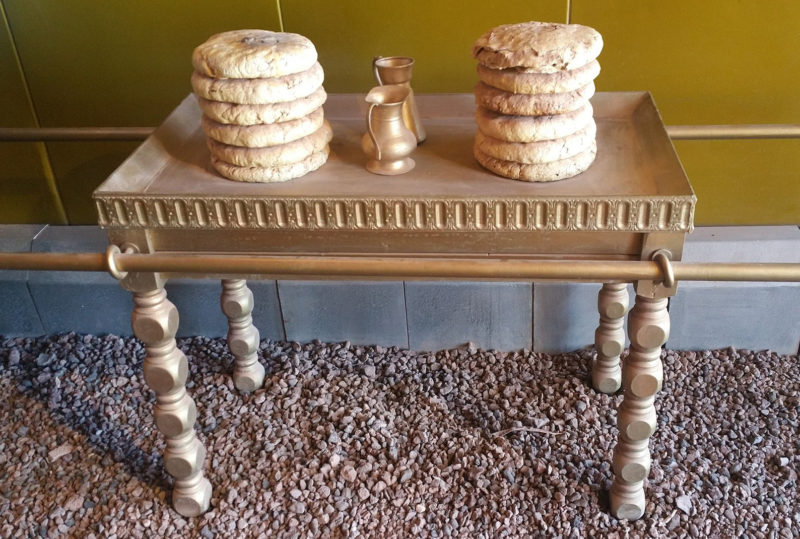

# Human-made Things in the Bible

## License Information

Human-made Things in the Bible © United Bible Societies, 2025. Adapted from: <cite>The Works of Their Hands: Man-made Things in the Bible</cite>, by Ray Pritz © 2009 United Bible Societies. This work is licensed under Creative Commons Attribution-ShareAlike 4.0 International (<a href="https://creativecommons.org/licenses/by-sa/4.0/">https://creativecommons.org/licenses/by-sa/4.0/</a>).

--------------------------------

## 标题：摆放供饼的桌子（table for consecrated bread） (id: REALIA:4.3.5)

4\.3\.5 标题：摆放供饼的桌子（table for consecrated bread）
===============================================

经文出处
----

Hebrew 来：שֻׁלְחָן (音译：shulchan (lechem hapanim, hama‘areketh))

[EXO 25:23](https://ref.ly/Exod25:23), [EXO 25:28](https://ref.ly/Exod25:28), [EXO 25:30](https://ref.ly/Exod25:30), [EXO 26:35](https://ref.ly/Exod26:35), [EXO 26:35](https://ref.ly/Exod26:35), [EXO 26:35](https://ref.ly/Exod26:35), [EXO 30:27](https://ref.ly/Exod30:27), [EXO 31:8](https://ref.ly/Exod31:8), [EXO 35:13](https://ref.ly/Exod35:13), [EXO 37:10](https://ref.ly/Exod37:10), [EXO 37:14](https://ref.ly/Exod37:14), [EXO 37:15](https://ref.ly/Exod37:15), [EXO 37:16](https://ref.ly/Exod37:16), [EXO 39:36](https://ref.ly/Exod39:36), [EXO 40:4](https://ref.ly/Exod40:4), [EXO 40:22](https://ref.ly/Exod40:22), [EXO 40:24](https://ref.ly/Exod40:24), [LEV 24:6](https://ref.ly/Lev24:6), [NUM 3:31](https://ref.ly/Num3:31), [NUM 4:7](https://ref.ly/Num4:7), [1KI 7:48](https://ref.ly/1Kgs7:48), [1CH 28:16](https://ref.ly/1Chr28:16), [1CH 28:16](https://ref.ly/1Chr28:16), [1CH 28:16](https://ref.ly/1Chr28:16), [1CH 28:16](https://ref.ly/1Chr28:16), [2CH 4:19](https://ref.ly/2Chr4:19), [2CH 13:11](https://ref.ly/2Chr13:11), [2CH 29:18](https://ref.ly/2Chr29:18)

Greek 希：τράπεζα, πρόθεσις (音译：trapeza (tēs protheseōs))

[HEB 9:2](https://ref.ly/Heb9:2), [1MA 1:22](https://ref.ly/1Macc1:22), [1MA 4:49](https://ref.ly/1Macc4:49), [1MA 4:51](https://ref.ly/1Macc4:51)

描述
--

*摆放着陈设饼或「神圣同在饼」的桌子（亭纳公园（Timnah Park）） (© Mboesch, CC BY\-SA 4\.0, via Wikimedia Commons)*

关于桌子构造的描述，见[EXO 25:23–EXO 25:28](https://ref.ly/Exod25:23-Exod25:28) 。桌子用金合欢木做成，用金包裹，长约1米（40英寸），宽50厘米（20英寸），高75厘米（30英寸）。根据上帝关于帐幕器具的吩咐，只有一张桌子用来摆放供饼。所罗门建造圣殿时，除了将灯台和洗濯盆的数目增加到10个之外，还将供桌的数目增加到了10张。因为上帝在西奈山上指示摩西每件物品只做一件，所以可能只有一张正式的桌子，而其他桌子只作某种装饰之用。无论如何，*shulchan* 一词用来指所有这种桌子，对于这个词在[EXO 25:0](https://ref.ly/Exod25:0) 出现的单数和复数形式，翻译者应使用[2CH 4:0](https://ref.ly/2Chr4:0) 中所用的同一个词来翻译。[1CH 28:16](https://ref.ly/1Chr28:16) 提到“银桌子”，圣经中没有其他地方提到银桌子，其用途也没有说明。这些桌子可以译作“用银包裹的桌子”。

---

翻译
--

[LEV 24:6](https://ref.ly/Lev24:6) ：在希伯来文本中，这节经文包含一个字面意为“纯净的桌子”（NJB (New Jerusalem Bible (1985)) 、NJPSV (New Jewish Publication Society Version) 同）的短语。这里的问题与第4节中“纯净的灯台”相同。“纯净的”可能指金子，也可能指在礼仪上是洁净的。NEB (New English Bible (1970)) 英文意为“礼仪上洁净的桌子”。灯台与桌子这两个问题应该用同样的方法解决。如果按照“纯金”来理解，最好译作“用纯金包裹的桌子”（GNT (Good News Translation (1992)) 直译），而不是“用纯金做的桌子”（参[EXO 25:24](https://ref.ly/Exod25:24) ，[EXO 37:11](https://ref.ly/Exod37:11) ）。

供桌的两侧安着环，把杠从环中穿过即可抬起桌子。与抬约柜的杠不同，抬这张桌子和其他物件的杠在物件摆放在指定位置后要抽出来。参[4\.1 约柜(Covenant Box, Ark of the Covenant)\<REALIA:4\.1\>](#) 中的讨论。

另参[5\.7 吃饭的桌子、饭桌(table for eating)\<REALIA:5\.7\>](#) 中的讨论。

* **Associated Passages:** 出埃及记 25:23; 出埃及记 25:28; 出埃及记 25:30; 出埃及记 26:35; 出埃及记 30:27; 出埃及记 31:8; 出埃及记 35:13; 出埃及记 37:10; 出埃及记 37:14; 出埃及记 37:15; 出埃及记 37:16; 出埃及记 39:36; 出埃及记 40:4; 出埃及记 40:22; 出埃及记 40:24; 利未记 24:6; 民数记 3:31; 民数记 4:7; 列王纪上 7:48; 历代志上 28:16; 历代志下 4:19; 历代志下 13:11; 历代志下 29:18; 希伯来书 9:2; 玛加伯上 1:22; 玛加伯上 4:49; 玛加伯上 4:51; 出埃及记 25:0; 历代志下 4:0; 出埃及记 25:24; 出埃及记 37:11

