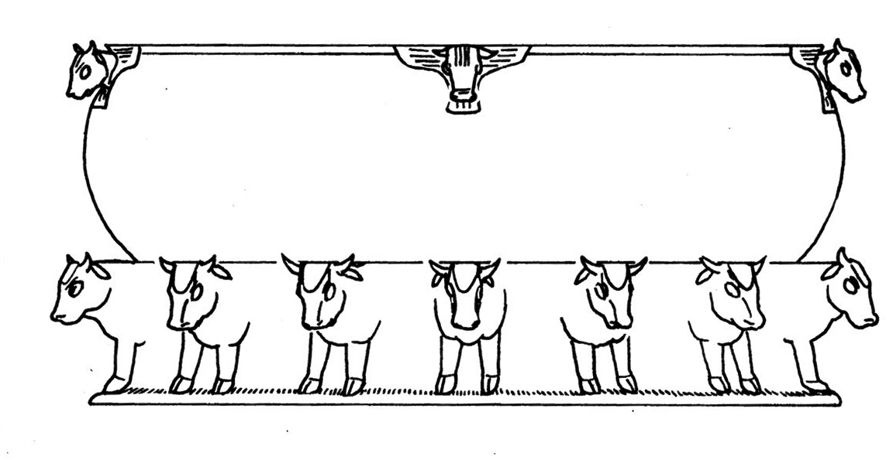
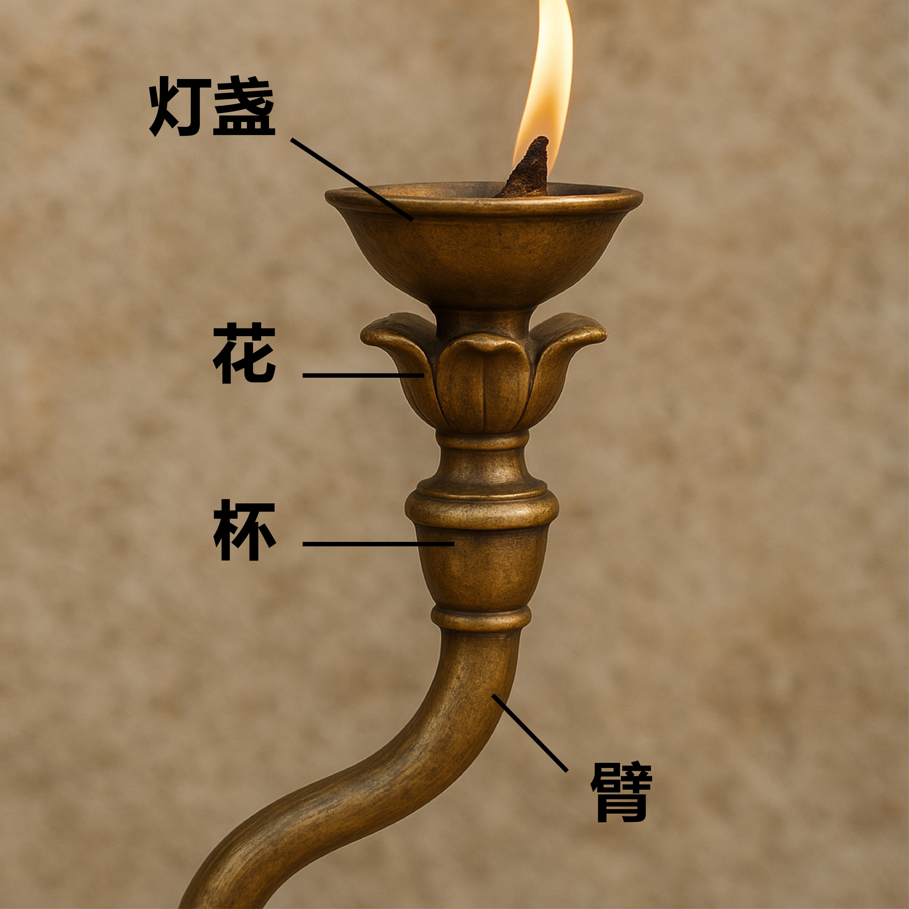
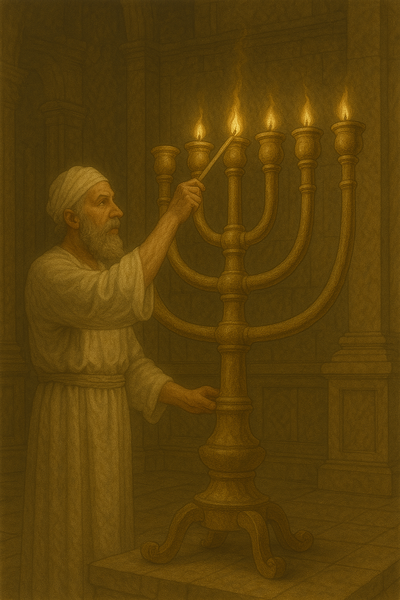

# Human-made Things in the Bible

## License Information

Human-made Things in the Bible © United Bible Societies, 2025. Adapted from: <cite>The Works of Their Hands: Man-made Things in the Bible</cite>, by Ray Pritz © 2009 United Bible Societies. This work is licensed under Creative Commons Attribution-ShareAlike 4.0 International (<a href="https://creativecommons.org/licenses/by-sa/4.0/">https://creativecommons.org/licenses/by-sa/4.0/</a>).

--------------------------------

## 标题：帐幕和圣殿中的器具（furniture of the Tabernacle and Temple） (id: REALIA:4.3)

4\.3 标题：帐幕和圣殿中的器具（furniture of the Tabernacle and Temple）
=========================================================

所罗门建造的圣殿保留或仿造了帐幕中的一些器具。约柜和灯台等物件被保存下来，它们从临时圣所迁到固定的圣所后并没有改变。然而，有一件器具变化很大，这个器具可能会让读者和翻译者感到十分困惑。在帐幕的祭坛和圣所之间放着一个很大的洗濯盆，有两种用途：（1）供准备献祭或进入圣所的祭司洗手洗脚；（2）洗洁准备献上的祭牲。

帐幕中的这个洗濯盆没有出现在所罗门圣殿的描述中。所罗门圣殿中有两个洗濯盆，用于两种不同的洗濯。[2CH 4:6](https://ref.ly/2Chr4:6) 记叙如下：“他又造十个盆：五个放在南边，五个放在北边，作洗涤之用。献燔祭所用之物都在盆内洗涤；但铜海是为祭司洗涤用的”（RSV (Revised Standard Version (1952)) 直译）。祭司洗涤用的水装在一个称作“海”的大缸内。洗涤众多祭牲的水装在十个盆里，这十个盆放在可移动的架子上。

* **Associated Passages:** 历代志下 4:6

## 标题：帐幕：洗濯盆、盆、碗（Tabernacle: washstand, basin, bowl） (id: REALIA:4.3.1)

4\.3\.1 标题：帐幕：洗濯盆、盆、碗（Tabernacle: washstand, basin, bowl）
=========================================================

经文出处
----

Hebrew 来：כִּיּוֹר (音译：kiyor)

[EXO 30:18](https://ref.ly/Exod30:18), [EXO 30:28](https://ref.ly/Exod30:28), [EXO 31:9](https://ref.ly/Exod31:9), [EXO 35:16](https://ref.ly/Exod35:16), [EXO 38:8](https://ref.ly/Exod38:8), [EXO 39:39](https://ref.ly/Exod39:39), [EXO 40:7](https://ref.ly/Exod40:7), [EXO 40:11](https://ref.ly/Exod40:11), [EXO 40:30](https://ref.ly/Exod40:30), [LEV 8:11](https://ref.ly/Lev8:11)

描述和用途
-----

洗濯盆是一个很大的铜盆，放在一个铜底座上，祭司用它来洗手和洗脚。盆的顶部很可能是开口的，以便加水，底部可能有出水口可以放水。根据[EXO 30:18](https://ref.ly/Exod30:18) ，洗濯盆放在“会幕和祭坛之间”（RSV (Revised Standard Version (1952)) 直译）。

---

翻译
--

祭司每天开始供职之前，会遵照诫命洗净手和脚。这是一种洁净的仪式，洗濯盆就用来盛放这个礼仪所需用的水。

有些英文译本（如RSV (Revised Standard Version (1952)) 和NJPSV (New Jewish Publication Society Version) ）采用“laver”（“水盆”）一词，但这个词很含糊，普通读者很难明白。NCV (New Century Version) 采用的“bowl”（“碗”）可能会让人想到比实际尺寸小得多的器具。最好译作“大碗”（“large bowl”；如CEV (Contemporary English Version) ）或“大盆”。

* **Associated Passages:** 出埃及记 30:18; 出埃及记 30:28; 出埃及记 31:9; 出埃及记 35:16; 出埃及记 38:8; 出埃及记 39:39; 出埃及记 40:7; 出埃及记 40:11; 出埃及记 40:30; 利未记 8:11

* **Associated ACAI Concepts:** Tabernacle Altar (ID: `realia:TabernacleAltar`)

## 标题：圣殿：海（Temple: sea, tank） (id: REALIA:4.3.2)

4\.3\.2 标题：圣殿：海（Temple: sea, tank）
==================================

经文出处
----

Hebrew 来：יָם (音译：yam)

[1KI 7:23](https://ref.ly/1Kgs7:23), [1KI 7:24](https://ref.ly/1Kgs7:24), [1KI 7:25](https://ref.ly/1Kgs7:25), [1KI 7:25](https://ref.ly/1Kgs7:25), [1KI 7:39](https://ref.ly/1Kgs7:39), [1KI 7:44](https://ref.ly/1Kgs7:44), [1KI 7:44](https://ref.ly/1Kgs7:44), [2KI 16:17](https://ref.ly/2Kgs16:17), [2KI 25:13](https://ref.ly/2Kgs25:13), [2KI 25:16](https://ref.ly/2Kgs25:16), [1CH 18:8](https://ref.ly/1Chr18:8), [2CH 4:2](https://ref.ly/2Chr4:2), [2CH 4:3](https://ref.ly/2Chr4:3), [2CH 4:4](https://ref.ly/2Chr4:4), [2CH 4:4](https://ref.ly/2Chr4:4), [2CH 4:6](https://ref.ly/2Chr4:6), [2CH 4:10](https://ref.ly/2Chr4:10), [2CH 4:15](https://ref.ly/2Chr4:15), [JER 52:17](https://ref.ly/Jer52:17), [JER 52:20](https://ref.ly/Jer52:20)

描述
--

*艺术家绘制的铜海 (© Deutsche Bibelgesellschaft, Stuttgart by United Bible Societies)*

“海”是一个非常大的水槽或水池，用铜制成，深2\.5米（8英尺），直径5米（16\.5英尺），边缘周长约15米（49英尺）。海的壁厚近8厘米（约3英寸），净重约为25—30吨或更重。描述海的两处经文存在容量差异；[1KI 7:26](https://ref.ly/1Kgs7:26) 给出的容量是38,000升（10,000加仑），而[2CH 4:5](https://ref.ly/2Chr4:5) 给出的容量是57,000升（15,000加仑）。从文本来看，我们并不清楚海的形状是像碗（半球形）还是像一个直立的圆柱体。根据[1KI 7:24](https://ref.ly/1Kgs7:24) 和[2CH 4:3](https://ref.ly/2Chr4:3) 的描述，其外缘铸有两排铜葫芦（NRSV (New Revised Standard Version (1989)) 译作“panels”“镶板”；NCV (New Century Version) 译作“plants”“植物”）作为装饰。海的“腿”是十二只铜牛，分为四组，每组三只，头朝外面，海驮在牛的背上。[2CH 4:6](https://ref.ly/2Chr4:6) 说明水是供祭司洗涤之用，但没有给出细节。

---

翻译
--

在有些语言中，最好使用描述性短语来翻译“海”；[1KI 7:23](https://ref.ly/1Kgs7:23) 可译为，“称为海的大圆碗”（NCV (New Century Version) 直译）。虽然这个盆在希伯来文中称为*yam* （“海”），但没有理由在译文中保留这个比喻性的名称。

* **Associated Passages:** 列王纪上 7:23; 列王纪上 7:24; 列王纪上 7:25; 列王纪上 7:39; 列王纪上 7:44; 列王纪下 16:17; 列王纪下 25:13; 列王纪下 25:16; 历代志上 18:8; 历代志下 4:2; 历代志下 4:3; 历代志下 4:4; 历代志下 4:6; 历代志下 4:10; 历代志下 4:15; 耶利米书 52:17; 耶利米书 52:20; 列王纪上 7:26; 历代志下 4:5

## 标题：圣殿：可移动的座、盆座（Temple: movable stand, cart, stand, base） (id: REALIA:4.3.3)

4\.3\.3 标题：圣殿：可移动的座、盆座（Temple: movable stand, cart, stand, base）
================================================================

经文出处
----

### **带轮子的箱子** ：

Hebrew 来：מְכוֹנָה (音译：mkonah)

[1KI 7:38](https://ref.ly/1Kgs7:38), [1KI 7:39](https://ref.ly/1Kgs7:39), [1KI 7:43](https://ref.ly/1Kgs7:43), [1KI 7:43](https://ref.ly/1Kgs7:43), [2KI 16:17](https://ref.ly/2Kgs16:17), [2KI 25:13](https://ref.ly/2Kgs25:13), [2CH 4:14](https://ref.ly/2Chr4:14), [2CH 4:14](https://ref.ly/2Chr4:14), [JER 27:19](https://ref.ly/Jer27:19), [JER 52:17](https://ref.ly/Jer52:17), [JER 52:20](https://ref.ly/Jer52:20)

经文出处
----

### **盛水的容器** ：

Hebrew 来：כִּיּוֹר (音译：kiyor)

[1KI 7:30](https://ref.ly/1Kgs7:30), [1KI 7:38](https://ref.ly/1Kgs7:38), [1KI 7:38](https://ref.ly/1Kgs7:38), [1KI 7:38](https://ref.ly/1Kgs7:38), [1KI 7:38](https://ref.ly/1Kgs7:38), [1KI 7:40](https://ref.ly/1Kgs7:40), [1KI 7:43](https://ref.ly/1Kgs7:43), [2KI 16:17](https://ref.ly/2Kgs16:17), [2CH 4:6](https://ref.ly/2Chr4:6), [2CH 4:14](https://ref.ly/2Chr4:14)

描述和用途
-----

*洗濯盆的活动支架 (© Deutsche Bibelgesellschaft, Stuttgart by United Bible Societies)*

[1KI 7:27–1KI 7:39](https://ref.ly/1Kgs7:27-1Kgs7:39) 详细描述了可移动的盆座。这是一个长约2米（6\.5英尺），宽2米（6\.5英尺），深1\.5米（5英尺）的箱子。侧面是铜板，装饰着各种动物的图案。箱子放在四个轮子上，箱的四角与轮轴相连。轮子的直径约65厘米（25英寸）。箱子顶部的角是四个把手，因此这是一种带装饰的大推车。

箱子的顶部是敞开的，内侧的上部衬有一个圆形的长条或衬套，里面放着一个圆形的铜制容器。这个容器的形状可能像碗或盆，或者更有可能像一个逐渐变细变尖的圆锥。根据[2CH 4:6](https://ref.ly/2Chr4:6) 的描述，容器中盛有水，用来清洗将被焚烧为祭的祭牲（参[LEV 1:9](https://ref.ly/Lev1:9) ，[LEV 1:13](https://ref.ly/Lev1:13) ）。考虑到这辆推车的大小，青铜材质，而且里面装有大量的水（约800升或200加仑），即使有轮子也会很难移动。估计每个盆座在装满水的时候有2—3吨重。

---

翻译
--

**带轮子的箱子** ：对于希伯来文*mkonah* ，有些译本将其译作一个通常静止不动的物件（KJV (King James Version (1611)) 和SPCL (Spanish Common Language Version (Dios Habla Hoy)) 译作“base”“座”；RSV (Revised Standard Version (1952)) 译作“stand”“架子”），还有些译本将其译作一个通常移动的物件（GNT (Good News Translation (1992)) 和FRCL (French Common Language Version (Bible en français courant)) 译作“cart”“小车”；REB (Revised English Bible (1989)) 译作“trolley”“手推车”）。也许NIV (New International Version (1984)) 和CEV (Contemporary English Version) 的“movable stand”（“可移动支架”）比上述词语都更加合适，这个短语表示物件通常放在一个固定位置，但设计成在必要时可以移动。[1KI 7:39](https://ref.ly/1Kgs7:39) 可能表示十个架子或小车的位置是固定的。

**盛水的容器** ：在上文所列的经文中，我们查阅的大多数译本都将希伯来文*kiyor* 译作“盆”（“basin”；如GNT (Good News Translation (1992)) 、NIV (New International Version (1984)) ）。或许更好的译法是“大桶”或“大缸”（“vat”；TOB (Traduction Oecuménique de la Bible (French, 1975)) ）。虽然*kiyor* 一词也用来指帐幕中的洗濯盆，但在圣殿里，这个词所指物件的结构却大不相同。

如上所述，[1KI 7:27–1KI 7:39](https://ref.ly/1Kgs7:27-1Kgs7:39) 详细地描述了可移动盆座的结构，还提到其他几个配件。这些配件包括构成箱壁的长方形或正方形镶板（希伯来文*misgaroth* ），固定镶板的框架（*shlabim* ），带辐条的轮子（*’ofanim* ；参[8\.3 轮、车轮 (wheel)\<REALIA:8\.3\>](#) ），轮轴（*sarnim* 或*yadoth* ），以及水盆四角的支撑物（*yadoth* 或*kthefoth*)。盆座顶部的圆形开口（*‘agol* ）装饰着“雕刻的图案”（“carvings”，GNT (Good News Translation (1992)) ；NASB (New American Standard Bible) 译作“engravings”“雕刻”；*miqla‘oth* ），底部饰有或刻有状似“花环”的东西（“wreaths”，*loyoth* ；GNT (Good News Translation (1992)) 译作“spiral figures”“螺旋图案”）。盛水的容器放在一个衬环（*kothereth* ，字面意为“王冠”）里。参《〈列王纪上下〉手册》（*A Handbook on 1–2 Kings* ）关于这些经文的讨论。

* **Associated Passages:** 列王纪上 7:38; 列王纪上 7:39; 列王纪上 7:43; 列王纪下 16:17; 列王纪下 25:13; 历代志下 4:14; 耶利米书 27:19; 耶利米书 52:17; 耶利米书 52:20; 列王纪上 7:30; 列王纪上 7:40; 历代志下 4:6; 列王纪上 7:27; 利未记 1:9; 利未记 1:13

## 标题：灯台（lampstand, menorah） (id: REALIA:4.3.4)

4\.3\.4 标题：灯台（lampstand, menorah）
=================================

经文出处
----

Hebrew 来：מְנוֹרָה (音译：mnorah)

[EXO 25:31](https://ref.ly/Exod25:31), [EXO 25:31](https://ref.ly/Exod25:31), [EXO 25:32](https://ref.ly/Exod25:32), [EXO 25:32](https://ref.ly/Exod25:32), [EXO 25:33](https://ref.ly/Exod25:33), [EXO 25:34](https://ref.ly/Exod25:34), [EXO 25:35](https://ref.ly/Exod25:35), [EXO 26:35](https://ref.ly/Exod26:35), [EXO 30:27](https://ref.ly/Exod30:27), [EXO 31:8](https://ref.ly/Exod31:8), [EXO 35:14](https://ref.ly/Exod35:14), [EXO 37:17](https://ref.ly/Exod37:17), [EXO 37:17](https://ref.ly/Exod37:17), [EXO 37:18](https://ref.ly/Exod37:18), [EXO 37:18](https://ref.ly/Exod37:18), [EXO 37:19](https://ref.ly/Exod37:19), [EXO 37:20](https://ref.ly/Exod37:20), [EXO 39:37](https://ref.ly/Exod39:37), [EXO 40:4](https://ref.ly/Exod40:4), [EXO 40:24](https://ref.ly/Exod40:24), [LEV 24:4](https://ref.ly/Lev24:4), [NUM 3:31](https://ref.ly/Num3:31), [NUM 4:9](https://ref.ly/Num4:9), [NUM 8:2](https://ref.ly/Num8:2), [NUM 8:3](https://ref.ly/Num8:3), [NUM 8:4](https://ref.ly/Num8:4), [NUM 8:4](https://ref.ly/Num8:4), [1KI 7:49](https://ref.ly/1Kgs7:49), [2KI 4:10](https://ref.ly/2Kgs4:10), [1CH 28:15](https://ref.ly/1Chr28:15), [1CH 28:15](https://ref.ly/1Chr28:15), [1CH 28:15](https://ref.ly/1Chr28:15), [1CH 28:15](https://ref.ly/1Chr28:15), [1CH 28:15](https://ref.ly/1Chr28:15), [1CH 28:15](https://ref.ly/1Chr28:15), [1CH 28:15](https://ref.ly/1Chr28:15), [2CH 4:7](https://ref.ly/2Chr4:7), [2CH 4:20](https://ref.ly/2Chr4:20), [2CH 13:11](https://ref.ly/2Chr13:11), [JER 52:19](https://ref.ly/Jer52:19), [ZEC 4:2](https://ref.ly/Zech4:2), [ZEC 4:11](https://ref.ly/Zech4:11)

Greek 希：λυχνία (音译：luchnia)

[HEB 9:2](https://ref.ly/Heb9:2), [SIR 26:17](https://ref.ly/Sir26:17), [1MA 1:21](https://ref.ly/1Macc1:21), [1MA 4:49](https://ref.ly/1Macc4:49), [1MA 4:50](https://ref.ly/1Macc4:50)

Latin 拉：candelabrum

[2ES 10:22](https://ref.ly/2Esd10:22)

描述
--

*灯台的枝子 (Image generated by ChatGPT using OpenAI technology)*

关于帐幕内灯台的构造，见[EXO 25:31–EXO 25:40](https://ref.ly/Exod25:31-Exod25:40); [EXO 37:17–EXO 37:24](https://ref.ly/Exod37:17-Exod37:24) ；[LEV 24:1–LEV 24:4](https://ref.ly/Lev24:1-Lev24:4) 。灯台是用一块纯金锤出来的，由五个部分组成：座、干（或花梗），以及带有花萼和花瓣的（花）杯。灯台中心有一个干，立在座上，从干两旁伸出六个枝子，共为七枝。每个枝子顶部都有一盏油灯。

按照上帝的指示，帐幕里面只有一个灯台。然而，在所罗门建造和装饰圣殿时，经文（[1KI 7:49](https://ref.ly/1Kgs7:49) ；[2CH 4:7](https://ref.ly/2Chr4:7) ）说他设立了十个灯台。文中没有解释为什么灯台增加到十个。所罗门又造了十张桌子和十个盆放在殿内，而在帐幕里这些物品都只有一件。根据一个犹太传统的说法，十个灯台是在那个指定的灯台之外另加的，而“在右边”和“在左边”是指摆在唯一神圣灯台的右边和左边。经文没有说明所罗门时期的灯台样式发生任何变化，他所做的十个灯台可能看起来和帐幕里的那个灯台是一样的。

关于油灯的基本使用方式，参[5\.1 油灯和灯心 (Oil lamp and wick)\<REALIA:5\.1\>](#) 和[5\.2 灯台 (lampstand)\<REALIA:5\.2\>](#) 。

---

翻译
--

由于许多文化中没有专门表示“灯台”的词语，因此“灯台”可能要翻译成“灯座”或“放灯的东西”。应该强调的是，这个物件上面放置的不是蜡烛而是油灯（参[5\.1 油灯和灯心 (Oil lamp and wick)\<REALIA:5\.1\>](#) ）。

灯台（希伯来文*mnorah* ）大体上是用花的结构来描述的。翻译者了解这一点，就能找出合适的术语来翻译灯台的各部分。似花的部分包括“干”（“花梗”）、“花蕾”或“花萼”，以及类似开放的花朵的“杯”。ITCL (Italian Common Language Version) 提供了以下脚注：“希伯来文本使用的术语很难解释，学者认为灯台的装饰式样取自植物和花卉。”

*利未人在圣殿中点燃七枝灯台 (Image generated by ChatGPT using OpenAI technology)*

[EXO 25:31](https://ref.ly/Exod25:31) 列出了灯台的各部分，但CEV (Contemporary English Version) 只概括性地翻译，英文意为：“整个灯台，包括装饰的花，要用一块金子锤出来。”GECL (German Common Language Version (Gute Nachricht Bibel)) 的翻译更加凝练，意为：“灯台所有的部分都要由一块［金子］做成。”对于这节经文，有些译本可能会采用这种译法，不过在后面的经文中，灯台的各个部分仍然需要翻译出来。

[LEV 24:4](https://ref.ly/Lev24:4) ：这节经文的希伯来文本字面意思是“纯净的灯台”（NJB (New Jerusalem Bible (1985)) 、NJPSV (New Jewish Publication Society Version) 同），这可能是指灯台的神圣或礼仪上的洁净，而不是指灯台是用金子制成。例如，NEB (New English Bible (1970)) 英文意为“礼仪上洁净的灯台”。但大多数版本（如NIV (New International Version (1984)) ）都将其解作“纯金的灯台”。如果遵循“纯金”的解释，这里“纯净”的概念可能要表达为“不含其他物质”或“纯粹由金子做成”。有些语言可能需要借用表示“金子”的词语，如果是这样，翻译者应在术语简释中作出解释。

灯台的各个部分由下到上依次是：

*Yarek* （[EXO 25:31](https://ref.ly/Exod25:31) ，[EXO 37:17](https://ref.ly/Exod37:17) ；[NUM 8:4](https://ref.ly/Num8:4) ）：这个希伯来文词语指承载整个灯台的“座”或“脚”。在[NUM 8:4](https://ref.ly/Num8:4) ，字面意为“从座到花”（RSV (Revised Standard Version (1952)) 同）的希伯来文短语可译作“从顶到底”（如GNT (Good News Translation (1992)) ）。

*Qaneh* （[EXO 25:0](https://ref.ly/Exod25:0) ，12次；[EXO 37:0](https://ref.ly/Exod37:0) ，12次）：这个希伯来文词语的字面意为“芦苇”，在[EXO 25:0](https://ref.ly/Exod25:0) 和[EXO 37:0](https://ref.ly/Exod37:0) ，它表示长而直的花梗。从灯台中心的梗伸出六支这样的梗，每边三支对称，因此共为七支。GECL (German Common Language Version (Gute Nachricht Bibel)) 舍弃了花的比喻，称其为“臂”。在多枝烛台为人所知的地方，这种译法是很自然的，但是如果人们不知道这种物件，“臂”听起来可能会很奇怪。

*Gavi‘a* （[EXO 25:31](https://ref.ly/Exod25:31) ，[EXO 25:33](https://ref.ly/Exod25:33); [EXO 25:34](https://ref.ly/Exod25:34) ，[EXO 37:17](https://ref.ly/Exod37:17) ，[EXO 37:19](https://ref.ly/Exod37:19); [EXO 37:20](https://ref.ly/Exod37:20) ）：这个希伯来文词语指灯台七个枝子顶端的杯。这七个杯里放着橄榄油和灯心，点燃后可以发光。杯的形状显然像是开放的花朵。NCV (New Century Version) 译作“flower\-like cups”（“花状的杯”；NIV (New International Version (1984)) 类似）。REB (Revised English Bible (1989)) 仅译作“cups”（“杯”），而GNT (Good News Translation (1992)) 译作“decorative flowers”（“装饰性的花朵”）。

*Kaftor* （[EXO 25:0](https://ref.ly/Exod25:0) ，8次；[EXO 37:0](https://ref.ly/Exod37:0) ，8次）：这个希伯文词语也用来指柱子的“柱顶”（“capital”；如RSV (Revised Standard Version (1952)) 在[AMO 9:1](https://ref.ly/Amos9:1) 的译文；参[3\.5 柱子、柱顶 (column, pillar, capital)\<REALIA:3\.5\>](#) ）。在这里，这个词似乎表示一种球状疙瘩，一种球形或蛋形的鼓起，位于三对枝子的连接处，以及花朵与干的连接处。大多数译本保留了花的比喻，将其译作“花蕾”（“buds”；GNT (Good News Translation (1992)) 、NIV (New International Version (1984)) ）或“花萼”（“calyxes”；NRSV (New Revised Standard Version (1989)) 、NJPSV (New Jewish Publication Society Version) ）。

*Perach* （[EXO 25:0](https://ref.ly/Exod25:0) ，4次；[EXO 37:0](https://ref.ly/Exod37:0) ，4次；[NUM 8:4](https://ref.ly/Num8:4) ；[1KI 7:49](https://ref.ly/1Kgs7:49) ；[2CH 4:21](https://ref.ly/2Chr4:21) ）：这个希伯来文词语意为“花”，或者更确切地说，是由开放的花瓣形成的“花头”。灯台的花形成了杯。虽然大多数译本都保留了这个词语的比喻性表达“花”，但表达方式各不相同。有些译本作“花瓣”（“petals”；GNT (Good News Translation (1992)) 、NJPSV (New Jewish Publication Society Version) ），有些译作“花”（“flowers”；RSV (Revised Standard Version (1952)) ）。

* **Associated Passages:** 出埃及记 25:31; 出埃及记 25:32; 出埃及记 25:33; 出埃及记 25:34; 出埃及记 25:35; 出埃及记 26:35; 出埃及记 30:27; 出埃及记 31:8; 出埃及记 35:14; 出埃及记 37:17; 出埃及记 37:18; 出埃及记 37:19; 出埃及记 37:20; 出埃及记 39:37; 出埃及记 40:4; 出埃及记 40:24; 利未记 24:4; 民数记 3:31; 民数记 4:9; 民数记 8:2; 民数记 8:3; 民数记 8:4; 列王纪上 7:49; 列王纪下 4:10; 历代志上 28:15; 历代志下 4:7; 历代志下 4:20; 历代志下 13:11; 耶利米书 52:19; 撒迦利亚书 4:2; 撒迦利亚书 4:11; 希伯来书 9:2; 德训篇 26:17; 玛加伯上 1:21; 玛加伯上 4:49; 玛加伯上 4:50; 厄斯德拉下 10:22; 出埃及记 25:40; 出埃及记 37:24; 利未记 24:1; 出埃及记 25:0; 出埃及记 37:0; 阿摩司书 9:1; 历代志下 4:21

* **Associated ACAI Concepts:** Lampstand (ID: `realia:Lampstand.2`)

## 标题：油灯套盖、灯剪（Snuffer, wick trimmer） (id: REALIA:4.3.4.1)

4\.3\.4\.1 标题：油灯套盖、灯剪（Snuffer, wick trimmer）
============================================

经文出处
----

Hebrew 来：מְזַמֶּרֶת (音译：mzamereth)

[1KI 7:50](https://ref.ly/1Kgs7:50), [2KI 12:14](https://ref.ly/2Kgs12:14), [2KI 25:14](https://ref.ly/2Kgs25:14), [2CH 4:22](https://ref.ly/2Chr4:22), [JER 52:18](https://ref.ly/Jer52:18)

描述和用途
-----

油灯套盖是一种盖子，盖在燃烧着的灯心上，通过隔断空气来达到熄灭灯火的目的。经文提到圣殿用的油灯套盖是由金子做的。

灯剪是一种剪刀，用来剪断烧焦了的灯心，以减少油灯燃烧冒出来的烟。

---

翻译
--

关于希伯来文*mzamereth* 具体指什么，各译本存在分歧。这个词可能指某种乐器，但是我们查阅的译本都没有反映这个意思。同一个希伯来文词根也可以表示“剪、修剪”（参[LEV 25:4](https://ref.ly/Lev25:4) ），正是根据这一点，有些译本（如NIV (New International Version (1984)) 、NCV (New Century Version) ）将其解作一种剪刀，用来剪断烧焦了的灯心。还有译本（如RSV (Revised Standard Version (1952)) 、CEV (Contemporary English Version) ）认为这是一种盖子，罩在燃烧着的灯心上面使其熄灭。另外一种解释是，这是一个放在灯盏下面的小盘子，用来接住灯心烧焦后产生的灰烬。

如果当地不知道油灯或者至少不用蜡烛作大范围照明，翻译者很难找到合适的词语来翻译这个希伯来文词语。即使是像“灯剪”（“wick trimmers”；NCV (New Century Version) ）或“油灯套盖”（“lamp snuffers”；CEV (Contemporary English Version) ）这样的表达，也不易为现代读者所理解。建议翻译者选择一个大多数人能够理解的表达，并在可能情况下附加注释或术语简释条目，来描述油灯的使用方法（参[5\.1 油灯和灯心 (Oil lamp and wick)\<REALIA:5\.1\>](#) ）。

幔子、帷幔、帷帐：参[3\.14\.1\.6 幔子、帷幔、帷帐 (curtain, veil, drape)\<REALIA:3\.14\.1\.6\>](#) 。

* **Associated Passages:** 列王纪上 7:50; 列王纪下 12:14; 列王纪下 25:14; 历代志下 4:22; 耶利米书 52:18; 利未记 25:4

* **Associated ACAI Concepts:** Wick Trimmer (ID: `realia:WickTrimmer`)

## 标题：摆放供饼的桌子（table for consecrated bread） (id: REALIA:4.3.5)

4\.3\.5 标题：摆放供饼的桌子（table for consecrated bread）
===============================================

经文出处
----

Hebrew 来：שֻׁלְחָן (音译：shulchan (lechem hapanim, hama‘areketh))

[EXO 25:23](https://ref.ly/Exod25:23), [EXO 25:28](https://ref.ly/Exod25:28), [EXO 25:30](https://ref.ly/Exod25:30), [EXO 26:35](https://ref.ly/Exod26:35), [EXO 26:35](https://ref.ly/Exod26:35), [EXO 26:35](https://ref.ly/Exod26:35), [EXO 30:27](https://ref.ly/Exod30:27), [EXO 31:8](https://ref.ly/Exod31:8), [EXO 35:13](https://ref.ly/Exod35:13), [EXO 37:10](https://ref.ly/Exod37:10), [EXO 37:14](https://ref.ly/Exod37:14), [EXO 37:15](https://ref.ly/Exod37:15), [EXO 37:16](https://ref.ly/Exod37:16), [EXO 39:36](https://ref.ly/Exod39:36), [EXO 40:4](https://ref.ly/Exod40:4), [EXO 40:22](https://ref.ly/Exod40:22), [EXO 40:24](https://ref.ly/Exod40:24), [LEV 24:6](https://ref.ly/Lev24:6), [NUM 3:31](https://ref.ly/Num3:31), [NUM 4:7](https://ref.ly/Num4:7), [1KI 7:48](https://ref.ly/1Kgs7:48), [1CH 28:16](https://ref.ly/1Chr28:16), [1CH 28:16](https://ref.ly/1Chr28:16), [1CH 28:16](https://ref.ly/1Chr28:16), [1CH 28:16](https://ref.ly/1Chr28:16), [2CH 4:19](https://ref.ly/2Chr4:19), [2CH 13:11](https://ref.ly/2Chr13:11), [2CH 29:18](https://ref.ly/2Chr29:18)

Greek 希：τράπεζα, πρόθεσις (音译：trapeza (tēs protheseōs))

[HEB 9:2](https://ref.ly/Heb9:2), [1MA 1:22](https://ref.ly/1Macc1:22), [1MA 4:49](https://ref.ly/1Macc4:49), [1MA 4:51](https://ref.ly/1Macc4:51)

描述
--

*摆放着陈设饼或「神圣同在饼」的桌子（亭纳公园（Timnah Park）） (© Mboesch, CC BY\-SA 4\.0, via Wikimedia Commons)*

关于桌子构造的描述，见[EXO 25:23–EXO 25:28](https://ref.ly/Exod25:23-Exod25:28) 。桌子用金合欢木做成，用金包裹，长约1米（40英寸），宽50厘米（20英寸），高75厘米（30英寸）。根据上帝关于帐幕器具的吩咐，只有一张桌子用来摆放供饼。所罗门建造圣殿时，除了将灯台和洗濯盆的数目增加到10个之外，还将供桌的数目增加到了10张。因为上帝在西奈山上指示摩西每件物品只做一件，所以可能只有一张正式的桌子，而其他桌子只作某种装饰之用。无论如何，*shulchan* 一词用来指所有这种桌子，对于这个词在[EXO 25:0](https://ref.ly/Exod25:0) 出现的单数和复数形式，翻译者应使用[2CH 4:0](https://ref.ly/2Chr4:0) 中所用的同一个词来翻译。[1CH 28:16](https://ref.ly/1Chr28:16) 提到“银桌子”，圣经中没有其他地方提到银桌子，其用途也没有说明。这些桌子可以译作“用银包裹的桌子”。

---

翻译
--

[LEV 24:6](https://ref.ly/Lev24:6) ：在希伯来文本中，这节经文包含一个字面意为“纯净的桌子”（NJB (New Jerusalem Bible (1985)) 、NJPSV (New Jewish Publication Society Version) 同）的短语。这里的问题与第4节中“纯净的灯台”相同。“纯净的”可能指金子，也可能指在礼仪上是洁净的。NEB (New English Bible (1970)) 英文意为“礼仪上洁净的桌子”。灯台与桌子这两个问题应该用同样的方法解决。如果按照“纯金”来理解，最好译作“用纯金包裹的桌子”（GNT (Good News Translation (1992)) 直译），而不是“用纯金做的桌子”（参[EXO 25:24](https://ref.ly/Exod25:24) ，[EXO 37:11](https://ref.ly/Exod37:11) ）。

供桌的两侧安着环，把杠从环中穿过即可抬起桌子。与抬约柜的杠不同，抬这张桌子和其他物件的杠在物件摆放在指定位置后要抽出来。参[4\.1 约柜(Covenant Box, Ark of the Covenant)\<REALIA:4\.1\>](#) 中的讨论。

另参[5\.7 吃饭的桌子、饭桌(table for eating)\<REALIA:5\.7\>](#) 中的讨论。

* **Associated Passages:** 出埃及记 25:23; 出埃及记 25:28; 出埃及记 25:30; 出埃及记 26:35; 出埃及记 30:27; 出埃及记 31:8; 出埃及记 35:13; 出埃及记 37:10; 出埃及记 37:14; 出埃及记 37:15; 出埃及记 37:16; 出埃及记 39:36; 出埃及记 40:4; 出埃及记 40:22; 出埃及记 40:24; 利未记 24:6; 民数记 3:31; 民数记 4:7; 列王纪上 7:48; 历代志上 28:16; 历代志下 4:19; 历代志下 13:11; 历代志下 29:18; 希伯来书 9:2; 玛加伯上 1:22; 玛加伯上 4:49; 玛加伯上 4:51; 出埃及记 25:0; 历代志下 4:0; 出埃及记 25:24; 出埃及记 37:11

## 标题：供饼（consecrated bread, bread of the presence, showbread） (id: REALIA:4.3.5.1)

4\.3\.5\.1 标题：供饼（consecrated bread, bread of the presence, showbread）
=====================================================================

经文出处
----

Hebrew 来：לֶחֶם (音译：lechem)

[EXO 40:23](https://ref.ly/Exod40:23), [1SA 21:7](https://ref.ly/1Sam21:7)

Hebrew 来：לֶחֶם, פָּנֶה (音译：lechem hapanim)

[EXO 25:30](https://ref.ly/Exod25:30), [EXO 35:13](https://ref.ly/Exod35:13), [EXO 39:36](https://ref.ly/Exod39:36), [1SA 21:7](https://ref.ly/1Sam21:7), [1KI 7:48](https://ref.ly/1Kgs7:48), [2CH 4:19](https://ref.ly/2Chr4:19)

Hebrew 来：לֶחֶם, מַעֲרֶכֶת (音译：lechem hama‘areketh)

[1CH 9:32](https://ref.ly/1Chr9:32), [1CH 23:29](https://ref.ly/1Chr23:29), [NEH 10:34](https://ref.ly/Neh10:34)

Hebrew 来：לֶחֶם, קֹדֶשׁ (音译：lechem qodesh)

[1SA 21:5](https://ref.ly/1Sam21:5), [1SA 21:5](https://ref.ly/1Sam21:5)

Hebrew 来：מַעֲרֶכֶת (音译：ma‘areketh)

[1CH 28:16](https://ref.ly/1Chr28:16), [2CH 2:3](https://ref.ly/2Chr2:3), [2CH 29:18](https://ref.ly/2Chr29:18)

Hebrew 来：מַעֲרֶכֶת, לֶחֶם (音译：ma‘areketh lechem)

[2CH 13:11](https://ref.ly/2Chr13:11)

Hebrew 来：פָּנֶה (音译：panim)

[NUM 4:7](https://ref.ly/Num4:7)

Hebrew 来：קֹדֶשׁ (音译：qodesh)

[1SA 21:7](https://ref.ly/1Sam21:7)

Greek 希：ἄρτος (音译：artos)

[1MA 4:51](https://ref.ly/1Macc4:51)

Greek 希：ἄρτος, πρόθεσις (音译：artoi tēs protheseōs)

[MAT 12:4](https://ref.ly/Matt12:4), [MRK 2:26](https://ref.ly/Mark2:26), [LUK 6:4](https://ref.ly/Luke6:4), [2MA 10:3](https://ref.ly/2Macc10:3)

Greek 希：πρόθεσις (音译：prothesis)

[1MA 1:22](https://ref.ly/1Macc1:22)

Greek 希：πρόθεσις, ἄρτος (音译：prothesis tōn artōn)

[HEB 9:2](https://ref.ly/Heb9:2)

描述和用途
-----

供饼是摆在上帝面前的供物，先是摆放在帐幕里，后来摆放在圣殿里。经文没有说明饼的大小和形状，但是从新约时期开始，在犹太文献中有详细的描述。

---

翻译
--

英文“showbread”译自一个希伯来文短语，短语的字面意思是“面的饼／临在的饼”或“陈设的饼”。翻译者不应试图模仿这个英文术语。在有些语言中，这个词被译作“摆在上帝面前的饼”或“摆在上帝临在中的饼”。还有译本译作“神圣的饼”（“sacred bread”，GNT (Good News Translation (1992)) ；“sacred loaves of bread”，CEV (Contemporary English Version) ），甚或“特殊的饼”（“special bread”；NCV (New Century Version) ；[1CH 9:32](https://ref.ly/1Chr9:32) ）。

* **Associated Passages:** 出埃及记 40:23; 撒母耳记上 21:7; 出埃及记 25:30; 出埃及记 35:13; 出埃及记 39:36; 列王纪上 7:48; 历代志下 4:19; 历代志上 9:32; 历代志上 23:29; 尼希米记 10:34; 撒母耳记上 21:5; 历代志上 28:16; 历代志下 2:3; 历代志下 29:18; 历代志下 13:11; 民数记 4:7; 玛加伯上 4:51; 马太福音 12:4; 马可福音 2:26; 路加福音 6:4; 玛加伯下 10:3; 玛加伯上 1:22; 希伯来书 9:2

## 标题：预备祭牲的桌子（tables for preparing sacrificial victims） (id: REALIA:4.3.6)

4\.3\.6 标题：预备祭牲的桌子（tables for preparing sacrificial victims）
============================================================

经文出处
----

Hebrew 来：שֻׁלְחָן (音译：shulchan)

[EXO 25:23](https://ref.ly/Exod25:23), [EXO 25:27](https://ref.ly/Exod25:27), [EXO 25:28](https://ref.ly/Exod25:28), [EXO 25:30](https://ref.ly/Exod25:30), [EXO 26:35](https://ref.ly/Exod26:35), [EXO 26:35](https://ref.ly/Exod26:35), [EXO 26:35](https://ref.ly/Exod26:35), [EXO 30:27](https://ref.ly/Exod30:27), [EXO 31:8](https://ref.ly/Exod31:8), [EXO 35:13](https://ref.ly/Exod35:13), [EXO 37:10](https://ref.ly/Exod37:10), [EXO 37:14](https://ref.ly/Exod37:14), [EXO 37:15](https://ref.ly/Exod37:15), [EXO 37:16](https://ref.ly/Exod37:16), [EXO 39:36](https://ref.ly/Exod39:36), [EXO 40:4](https://ref.ly/Exod40:4), [EXO 40:22](https://ref.ly/Exod40:22), [EXO 40:24](https://ref.ly/Exod40:24), [LEV 24:6](https://ref.ly/Lev24:6), [NUM 3:31](https://ref.ly/Num3:31), [NUM 4:7](https://ref.ly/Num4:7), [JDG 1:7](https://ref.ly/Judg1:7), [1SA 20:29](https://ref.ly/1Sam20:29), [1SA 20:34](https://ref.ly/1Sam20:34), [2SA 9:7](https://ref.ly/2Sam9:7), [2SA 9:10](https://ref.ly/2Sam9:10), [2SA 9:11](https://ref.ly/2Sam9:11), [2SA 9:13](https://ref.ly/2Sam9:13), [2SA 19:29](https://ref.ly/2Sam19:29), [1KI 2:7](https://ref.ly/1Kgs2:7), [1KI 5:7](https://ref.ly/1Kgs5:7), [1KI 7:48](https://ref.ly/1Kgs7:48), [1KI 10:5](https://ref.ly/1Kgs10:5), [1KI 13:20](https://ref.ly/1Kgs13:20), [1KI 18:19](https://ref.ly/1Kgs18:19), [2KI 4:10](https://ref.ly/2Kgs4:10), [1CH 28:16](https://ref.ly/1Chr28:16), [1CH 28:16](https://ref.ly/1Chr28:16), [1CH 28:16](https://ref.ly/1Chr28:16), [1CH 28:16](https://ref.ly/1Chr28:16), [2CH 4:8](https://ref.ly/2Chr4:8), [2CH 4:19](https://ref.ly/2Chr4:19), [2CH 9:4](https://ref.ly/2Chr9:4), [2CH 13:11](https://ref.ly/2Chr13:11), [2CH 29:18](https://ref.ly/2Chr29:18), [NEH 5:17](https://ref.ly/Neh5:17), [JOB 36:16](https://ref.ly/Job36:16), [PSA 23:5](https://ref.ly/Ps23:5), [PSA 69:23](https://ref.ly/Ps69:23), [PSA 78:19](https://ref.ly/Ps78:19), [PSA 128:3](https://ref.ly/Ps128:3), [PRO 9:2](https://ref.ly/Prov9:2), [ISA 21:5](https://ref.ly/Isa21:5), [ISA 28:8](https://ref.ly/Isa28:8), [ISA 65:11](https://ref.ly/Isa65:11), [EZK 23:41](https://ref.ly/Ezek23:41), [EZK 39:20](https://ref.ly/Ezek39:20), [EZK 40:39](https://ref.ly/Ezek40:39), [EZK 40:39](https://ref.ly/Ezek40:39), [EZK 40:40](https://ref.ly/Ezek40:40), [EZK 40:40](https://ref.ly/Ezek40:40), [EZK 40:41](https://ref.ly/Ezek40:41), [EZK 40:41](https://ref.ly/Ezek40:41), [EZK 40:41](https://ref.ly/Ezek40:41), [EZK 40:42](https://ref.ly/Ezek40:42), [EZK 40:43](https://ref.ly/Ezek40:43), [EZK 41:22](https://ref.ly/Ezek41:22), [EZK 44:16](https://ref.ly/Ezek44:16), [DAN 11:27](https://ref.ly/Dan11:27), [MAL 1:7](https://ref.ly/Mal1:7), [MAL 1:12](https://ref.ly/Mal1:12)

经文出处
----

### **钩子** ：

Hebrew 来：שְׁפַתַּיִם (音译：shfatayim)

[EZK 40:43](https://ref.ly/Ezek40:43)

描述
--

*祭品送上祭坛前可能在这桌子上准备 (Gary Todd, Israel Museum, CC0, via Wikimedia Commons)*

以西结在异象中看到，圣殿北门的门廊内外有一些石头凿成的桌子。这些桌子用于宰杀和收拾祭牲。桌子高50厘米（20英寸），桌面是正方形，边长75厘米（30英寸）。经文没有交代桌子是有桌腿还是放在基座上。有些桌子上放着用来宰杀祭牲、剥皮和去除内脏的器具。

---

翻译
--

与帐幕里的器具不同，这些桌子似乎不能移动。对于[EZK 40:39](https://ref.ly/Ezek40:39); [EZK 40:40](https://ref.ly/Ezek40:40); [EZK 40:41](https://ref.ly/Ezek40:41); [EZK 40:42](https://ref.ly/Ezek40:42); [EZK 40:43](https://ref.ly/Ezek40:43) 的理解，有一个问题与桌子的数目有关。大多数译本认为这里总共有8张桌子，4张在门廊内，4张在门廊外。（GNT (Good News Translation (1992)) 英文意为：“41\~用来宰杀祭牲的桌子共有八张：四张在屋子里，四张在院子里。42\~厢房里有四张预备全牲祭的桌子，是用凿出来的石头做成的……”。然而，有些译本认为共有12张桌子。（NIV (New International Version (1984)) 英文意为：“41\~门廊这边有四张桌子，那边也有四张桌子，共八张，用来宰杀祭牲。42\~另外，还有四张预备燔祭牲的桌子，是用凿出来的石头做成的……”）。

第43节有几个相互关联的问题，需要翻译者处理。我们无法确定希伯来文*shfatayim* 的意思。在第一个字母略加改变的情况下，有些译本将其解作“台／壁架／架子”（“ledges/shelves”；GNT (Good News Translation (1992)) 、CEV (Contemporary English Version) 、REB (Revised English Bible (1989)) 、NJPSV (New Jewish Publication Society Version) ）；另一些译本将其解作“钩子”（“hooks”；RSV (Revised Standard Version (1952)) 、NIV (New International Version (1984)) 、GECL (German Common Language Version (Gute Nachricht Bibel)) ）。除了意思不明之外，这个物件的位置也有疑问。希伯来文本（在描述桌子的中途）说，这个物件“在里面的周围”。如果意思是在桌子的周围，这是没有意义的（NJPSV (New Jewish Publication Society Version) 英文意为“架子……固定在里面的周围”）。我们如何想象架子在桌子里面的周围呢？GNT (Good News Translation (1992)) 直接忽略了“在里面”，英文意为“台宽三英寸，围绕着桌子的边缘”。有些译本设想“在周围”指的是门廊的墙壁，而非桌子，从而避开了这个问题（CEV (Contemporary English Version) 英文意为“在房间周围的墙壁上有一个宽三英寸的架子”）。然而，我们很难看出如此狭窄的架子能做什么用途。将*shfatayim* 译作“钩子”只是解决了部分问题。75毫米（3英寸）的长度对于钩子是合理的，不过在桌子“里面的周围”这个问题，对于架子和钩子来说都是一样的。然而，如果“钩子钉在周围的墙上”（GECL (German Common Language Version (Gute Nachricht Bibel)) 直译），那么我们可以想象这种钩子有几种可能的用途。这些钩子可以用来悬挂工具，或者按照犹太传统，用来悬挂刚刚宰杀的祭牲以便剥皮（在桌子上很难剥皮）。*shfatayim* 一词的形式表明这个物件含有成双的东西，所以NIV (New International Version (1984)) 译作“double\-pronged hooks”（“双叉钩”）。

* **Associated Passages:** 出埃及记 25:23; 出埃及记 25:27; 出埃及记 25:28; 出埃及记 25:30; 出埃及记 26:35; 出埃及记 30:27; 出埃及记 31:8; 出埃及记 35:13; 出埃及记 37:10; 出埃及记 37:14; 出埃及记 37:15; 出埃及记 37:16; 出埃及记 39:36; 出埃及记 40:4; 出埃及记 40:22; 出埃及记 40:24; 利未记 24:6; 民数记 3:31; 民数记 4:7; 士师记 1:7; 撒母耳记上 20:29; 撒母耳记上 20:34; 撒母耳记下 9:7; 撒母耳记下 9:10; 撒母耳记下 9:11; 撒母耳记下 9:13; 撒母耳记下 19:29; 列王纪上 2:7; 列王纪上 5:7; 列王纪上 7:48; 列王纪上 10:5; 列王纪上 13:20; 列王纪上 18:19; 列王纪下 4:10; 历代志上 28:16; 历代志下 4:8; 历代志下 4:19; 历代志下 9:4; 历代志下 13:11; 历代志下 29:18; 尼希米记 5:17; 约伯记 36:16; 诗篇 23:5; 诗篇 69:23; 诗篇 78:19; 诗篇 128:3; 箴言 9:2; 以赛亚书 21:5; 以赛亚书 28:8; 以赛亚书 65:11; 以西结书 23:41; 以西结书 39:20; 以西结书 40:39; 以西结书 40:40; 以西结书 40:41; 以西结书 40:42; 以西结书 40:43; 以西结书 41:22; 以西结书 44:16; 但以理书 11:27; 玛拉基书 1:7; 玛拉基书 1:12

