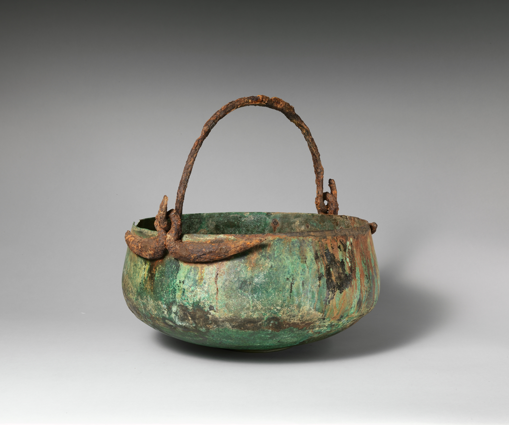

# Human-made Things in the Bible

## License Information

Human-made Things in the Bible © United Bible Societies, 2025. Adapted from: <cite>The Works of Their Hands: Man-made Things in the Bible</cite>, by Ray Pritz © 2009 United Bible Societies. This work is licensed under Creative Commons Attribution-ShareAlike 4.0 International (<a href="https://creativecommons.org/licenses/by-sa/4.0/">https://creativecommons.org/licenses/by-sa/4.0/</a>).

--------------------------------

## 标题：锅、盆、桶（pan, pot, pail） (id: REALIA:4.4.1)

4\.4\.1 标题：锅、盆、桶（pan, pot, pail）
================================

经文出处
----

Hebrew 来：סִיר (音译：sir)

[EXO 27:3](https://ref.ly/Exod27:3), [EXO 38:3](https://ref.ly/Exod38:3), [1KI 7:45](https://ref.ly/1Kgs7:45), [2KI 25:14](https://ref.ly/2Kgs25:14), [2CH 4:11](https://ref.ly/2Chr4:11), [2CH 4:16](https://ref.ly/2Chr4:16), [JER 52:18](https://ref.ly/Jer52:18), [JER 52:19](https://ref.ly/Jer52:19), [ZEC 14:20](https://ref.ly/Zech14:20), [ZEC 14:21](https://ref.ly/Zech14:21)

描述和用途
-----

*带摆动手柄的青铜大锅（伊特鲁里亚人（Etruscan）文物，约公元前550年） (Metropolitan Museum of Art, CC0, MMA)*

盆是一种铜制容器，用来收集祭牲焚烧后留在祭坛上的灰烬和残骸。在另一个背景中，同样的器具可以作为简单的大烹饪锅使用（参[5\.12 锅、盆、罐、壶 (cooking pot, kettle)\<REALIA:5\.12\>](#) ）。

---

翻译
--

参上文[4\.4 帐幕和圣殿中的用具 (Tabernacle and Temple implements)\<REALIA:4\.4\>](#) 中的注解。

[JER 52:18](https://ref.ly/Jer52:18); [JER 52:19](https://ref.ly/Jer52:19) 两次提到*sir* 这个物件被带往巴比伦。我们并不清楚是同一个名称指两个不同的物品，还是同一个物品列出了两次。我们查阅的几乎所有译本都两次提到这个词。[ZEC 14:20](https://ref.ly/Zech14:20); [ZEC 14:21](https://ref.ly/Zech14:21) 说到将来有一个时候俗物被当作圣物使用。第20节中的*sir* 是这里描述的圣殿器具，而第21节中的*sir* 是犹大地方家家户户日用的锅，这锅有一天将像圣殿器具那样被使用。

* **Associated Passages:** 出埃及记 27:3; 出埃及记 38:3; 列王纪上 7:45; 列王纪下 25:14; 历代志下 4:11; 历代志下 4:16; 耶利米书 52:18; 耶利米书 52:19; 撒迦利亚书 14:20; 撒迦利亚书 14:21

