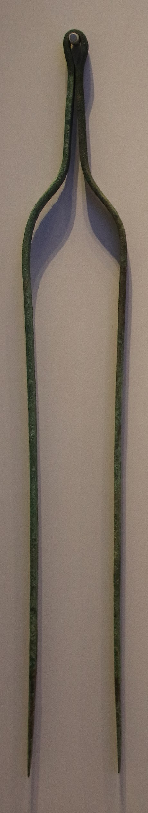

# Human-made Things in the Bible

## License Information

Human-made Things in the Bible © United Bible Societies, 2025. Adapted from: <cite>The Works of Their Hands: Man-made Things in the Bible</cite>, by Ray Pritz © 2009 United Bible Societies. This work is licensed under Creative Commons Attribution-ShareAlike 4.0 International (<a href="https://creativecommons.org/licenses/by-sa/4.0/">https://creativecommons.org/licenses/by-sa/4.0/</a>).

--------------------------------

## 标题：灯剪、蜡剪、剪子、火钳、火剪（tongs） (id: REALIA:4.4.3)

4\.4\.3 标题：灯剪、蜡剪、剪子、火钳、火剪（tongs）
================================

经文出处
----

Hebrew 来：מֶלְקָחַיִם (音译：melqachayim)

[EXO 25:38](https://ref.ly/Exod25:38), [EXO 37:23](https://ref.ly/Exod37:23), [NUM 4:9](https://ref.ly/Num4:9), [1KI 7:49](https://ref.ly/1Kgs7:49), [2CH 4:21](https://ref.ly/2Chr4:21), [ISA 6:6](https://ref.ly/Isa6:6)

Hebrew 来：מַעֲצָד (音译：ma‘atsad)

[ISA 44:12](https://ref.ly/Isa44:12)

描述和用途
-----

*钳子 (Gary Todd, Israel Museum, CC0, via Wikimedia Commons)*

火钳是一种U形金属工具。使用者握住工具靠近闭合端的地方，压紧工具的两个臂，就可以夹起烧着的火炭或其他东西。火钳可以看成是一把大号的镊子，人们今天经常用镊子来拔毛或者夹出刺及碎片等物。

---

翻译
--

希伯来文*melqachayim* 始终指祭司使用的一个器具，除了[ISA 6:6](https://ref.ly/Isa6:6) 没有指明其材质之外，这些器具都是用金子做的，用来修剪帐幕和圣殿里面的油灯。有些解经家认为，这些经文中的*melqachayim* 指一种较小的火钳，用来调整或取出灯心（参[4\.3\.4\.1 油灯套盖、灯剪 (Snuffer, wick trimmer)\<REALIA:4\.3\.4\.1\>](#) 和[5\.1 油灯和灯心 (Oil lamp and wick)\<REALIA:5\.1\>](#) ）。因此，在这个语境中，*melqachayim* 可能是一种“钳子”或大镊子。

在[ISA 44:12](https://ref.ly/Isa44:12) ，希伯来文*ma’atsad* 所指的火钳在结构上与帐幕和圣殿中所用的灯剪类似。然而，这节经文描述的钳子是铁匠用来夹着热铁锤打的那一种。

* **Associated Passages:** 出埃及记 25:38; 出埃及记 37:23; 民数记 4:9; 列王纪上 7:49; 历代志下 4:21; 以赛亚书 6:6; 以赛亚书 44:12

