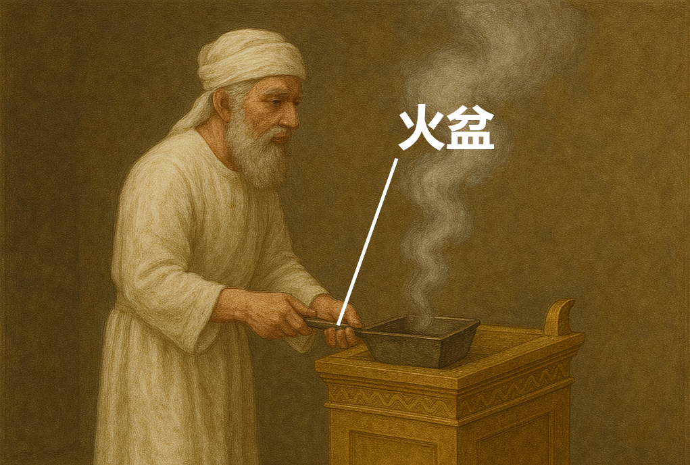

# Human-made Things in the Bible

## License Information

Human-made Things in the Bible © United Bible Societies, 2025. Adapted from: <cite>The Works of Their Hands: Man-made Things in the Bible</cite>, by Ray Pritz © 2009 United Bible Societies. This work is licensed under Creative Commons Attribution-ShareAlike 4.0 International (<a href="https://creativecommons.org/licenses/by-sa/4.0/">https://creativecommons.org/licenses/by-sa/4.0/</a>).

--------------------------------

## 标题：小铲子、火盆（small shovel, firepan） (id: REALIA:4.4.5)

4\.4\.5 标题：小铲子、火盆（small shovel, firepan）
========================================

经文出处
----

Hebrew 来：מַחְתָּה (音译：machtah)

[EXO 25:38](https://ref.ly/Exod25:38), [EXO 27:3](https://ref.ly/Exod27:3), [EXO 37:23](https://ref.ly/Exod37:23), [EXO 38:3](https://ref.ly/Exod38:3), [LEV 10:1](https://ref.ly/Lev10:1), [LEV 16:12](https://ref.ly/Lev16:12), [NUM 4:9](https://ref.ly/Num4:9), [NUM 4:14](https://ref.ly/Num4:14), [NUM 16:6](https://ref.ly/Num16:6), [NUM 16:17](https://ref.ly/Num16:17), [NUM 16:17](https://ref.ly/Num16:17), [NUM 16:17](https://ref.ly/Num16:17), [NUM 16:17](https://ref.ly/Num16:17), [NUM 16:18](https://ref.ly/Num16:18), [NUM 17:4](https://ref.ly/Num17:4), [NUM 17:11](https://ref.ly/Num17:11), [1KI 7:50](https://ref.ly/1Kgs7:50), [2KI 25:15](https://ref.ly/2Kgs25:15), [2CH 4:22](https://ref.ly/2Chr4:22), [JER 52:19](https://ref.ly/Jer52:19)

描述和用途
-----

*火盆 (Image generated by ChatGPT using OpenAI technology)*

火盆用来移动或翻动祭坛上的火炭，以及把火炭移到香坛上作其他用途（参[4\.2\.4 香坛 (incense altar)\<REALIA:4\.2\.4\>](#) ）。

---

翻译
--

有学者提出，希伯来文*machtah* 也指一种特殊的容器，在清洁祭坛或搬运帐幕时用来盛圣火。因此，这是一种“贮火器”，翻译者也可将其表述为“带走或装着余烬的容器”。

在上文所列的一些参考经文中，*machtah* 一词与烧香相关联（[NUM 16:17](https://ref.ly/Num16:17); [NUM 16:18](https://ref.ly/Num16:18) ）。如果目标语言有表示“香炉”的特定词语，这个词就可以用在这些经文里，但要注意避免让人想到现代的香炉。另外，翻译者也可以使用一个意指“火盆”的比较宽泛的词语，因为在上文所列的大多数参考经文中，*machtah* 似乎指一种器具，用来把炭火移到另一个地方，并且有时会把香放在炭火上面。另参[4\.2\.4 香坛 (incense altar)\<REALIA:4\.2\.4\>](#) 和[4\.4\.7 香炉(censer)\<REALIA:4\.4\.7\>](#) 。

*青铜火盆或香铲（罗马，公元1世纪晚期至2世纪早期） (Metropolitan Museum of Art, CC0, MMA)*

在[EXO 25:38](https://ref.ly/Exod25:38); [EXO 37:23](https://ref.ly/Exod37:23) 和[NUM 4:9](https://ref.ly/Num4:9) 中，*machtah* 与灯台相关联（参[4\.3\.4 灯台 (lampstand, menorah)\<REALIA:4\.3\.4\>](#) ），有些译本仍然将其译作“火盆”（“firepans”；REB (Revised English Bible (1989)) 、NJPSV (New Jewish Publication Society Version) ），然而也有译本译作“托盘”（“trays”；RSV (Revised Standard Version (1952)) 、GNT (Good News Translation (1992)) 、NIV (New International Version (1984)) ）。无论哪种译法，*machtah* 对于灯台有何用处并不清楚。这里描述和绘出的物品可能有多种用途。

* **Associated Passages:** 出埃及记 25:38; 出埃及记 27:3; 出埃及记 37:23; 出埃及记 38:3; 利未记 10:1; 利未记 16:12; 民数记 4:9; 民数记 4:14; 民数记 16:6; 民数记 16:17; 民数记 16:18; 民数记 17:4; 民数记 17:11; 列王纪上 7:50; 列王纪下 25:15; 历代志下 4:22; 耶利米书 52:19

