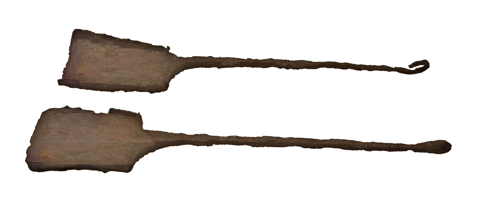

# Human-made Things in the Bible

## License Information

Human-made Things in the Bible © United Bible Societies, 2025. Adapted from: <cite>The Works of Their Hands: Man-made Things in the Bible</cite>, by Ray Pritz © 2009 United Bible Societies. This work is licensed under Creative Commons Attribution-ShareAlike 4.0 International (<a href="https://creativecommons.org/licenses/by-sa/4.0/">https://creativecommons.org/licenses/by-sa/4.0/</a>).

--------------------------------

## 标题：大铲子、刮板（large shovel, scraper） (id: REALIA:4.4.6)

4\.4\.6 标题：大铲子、刮板（large shovel, scraper）
========================================

经文出处
----

Hebrew 来：יָע (音译：ya‘)

[EXO 27:3](https://ref.ly/Exod27:3), [EXO 38:3](https://ref.ly/Exod38:3), [NUM 4:14](https://ref.ly/Num4:14), [1KI 7:40](https://ref.ly/1Kgs7:40), [1KI 7:45](https://ref.ly/1Kgs7:45), [2KI 25:14](https://ref.ly/2Kgs25:14), [2CH 4:11](https://ref.ly/2Chr4:11), [2CH 4:16](https://ref.ly/2Chr4:16), [JER 52:18](https://ref.ly/Jer52:18)

描述和用途
-----

*清除祭坛上废弃物的大铲子 (Gary Todd, Israel Museum, CC0, via Wikimedia Commons)*

刮板用来清除祭牲焚烧后留在祭坛上的残余物。这种工具可能类似铲子，将灰铲起来，也可能类似耙子或锄头，将灰刮到铜盆里（参[4\.4\.1 锅、盆、桶 (pan, pot, pail)\<REALIA:4\.4\.1\>](#) ）。

* **Associated Passages:** 出埃及记 27:3; 出埃及记 38:3; 民数记 4:14; 列王纪上 7:40; 列王纪上 7:45; 列王纪下 25:14; 历代志下 4:11; 历代志下 4:16; 耶利米书 52:18

* **Associated ACAI Concepts:** Shovel (ID: `realia:Shovel`)
