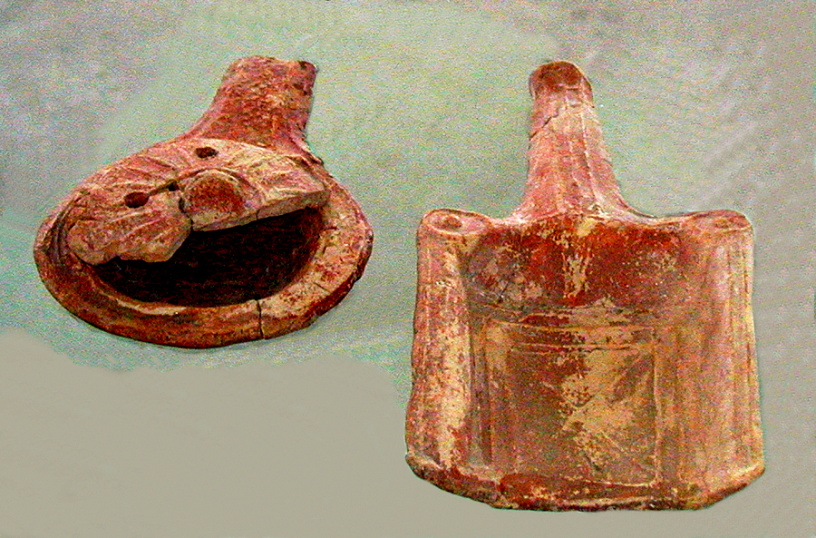

# Human-made Things in the Bible

## License Information

Human-made Things in the Bible © United Bible Societies, 2025. Adapted from: <cite>The Works of Their Hands: Man-made Things in the Bible</cite>, by Ray Pritz © 2009 United Bible Societies. This work is licensed under Creative Commons Attribution-ShareAlike 4.0 International (<a href="https://creativecommons.org/licenses/by-sa/4.0/">https://creativecommons.org/licenses/by-sa/4.0/</a>).

--------------------------------

## 标题：香炉（censer） (id: REALIA:4.4.7)

4\.4\.7 标题：香炉（censer）
=====================

经文出处
----

Hebrew 来：מִקְטֶרֶת (音译：miqtereth)

[2CH 26:19](https://ref.ly/2Chr26:19), [EZK 8:11](https://ref.ly/Ezek8:11)

Greek 希：θυΐσκη (音译：thuiskē)

[1MA 1:22](https://ref.ly/1Macc1:22), [1ES 2:9](https://ref.ly/1Esd2:9)

Greek 希：θυμιατήριον (音译：thumiatērion)

[4MA 7:11](https://ref.ly/4Macc7:11)

Greek 希：λιβανωτός (音译：libanōtos)

[REV 8:3](https://ref.ly/Rev8:3), [REV 8:5](https://ref.ly/Rev8:5)

Greek 希：πυρεῖον (音译：pureion)

[SIR 50:9](https://ref.ly/Sir50:9)

描述
--

*焚香用的陶土香炉和移动热炭的火盆 (© Ray Pritz by United Bible Societies)*

香炉是一个用来烧香的小碗或盘子，通常用金属制成，上面有一个把手，祭司可以握着把手将香炉带到祭坛前。

---

用途
--

香炉是碗状或盘子状的，祭司把火炭（通常取自祭坛）放到香炉里，上面撒上一些香。香被炭火点燃后，就散发出馨香的味道。

---

翻译
--

有些文化熟知在宗教仪式中烧香，可能会有专门词语指烧香的器具。但是，翻译者应该注意，不要选择一个只涉及异教仪式或非基督教崇拜仪式的词。如有必要，可以扩展表达为“用来烧香的小盘子”。另参[4\.2\.4 香坛 (incense altar)\<REALIA:4\.2\.4\>](#) 和[4\.4\.5 小铲子、火盆 (small shovel, firepan)\<REALIA:4\.4\.5\>](#) 。

* **Associated Passages:** 历代志下 26:19; 以西结书 8:11; 玛加伯上 1:22; 厄斯德拉上 2:9; 玛加伯四书 7:11; 启示录 8:3; 启示录 8:5; 德训篇 50:9

