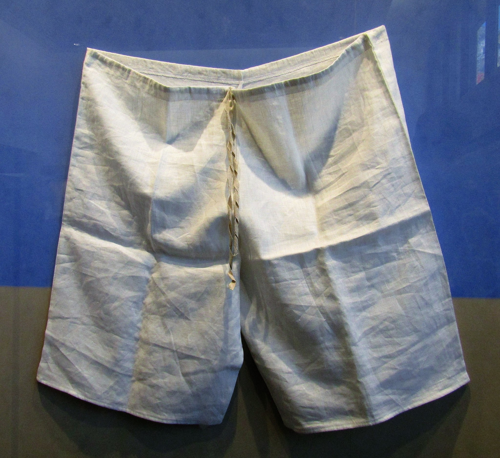

# Human-made Things in the Bible

## License Information

Human-made Things in the Bible © United Bible Societies, 2025. Adapted from: <cite>The Works of Their Hands: Man-made Things in the Bible</cite>, by Ray Pritz © 2009 United Bible Societies. This work is licensed under Creative Commons Attribution-ShareAlike 4.0 International (<a href="https://creativecommons.org/licenses/by-sa/4.0/">https://creativecommons.org/licenses/by-sa/4.0/</a>).

--------------------------------

## 标题：内衣、短裤（undergarment, breeches, shorts） (id: REALIA:4.5.1)

4\.5\.1 标题：内衣、短裤（undergarment, breeches, shorts）
================================================

经文出处
----

Hebrew 来：מִכְנָסַיִם (音译：miknasayim)

[EXO 28:42](https://ref.ly/Exod28:42), [EXO 39:28](https://ref.ly/Exod39:28), [LEV 6:3](https://ref.ly/Lev6:3), [LEV 16:4](https://ref.ly/Lev16:4), [EZK 44:18](https://ref.ly/Ezek44:18)

Greek 希：περισκελής (音译：periskelēs)

[SIR 45:8](https://ref.ly/Sir45:8)

描述和用途
-----

*大祭司的内衣 (© Ben P L, CC BY 2\.0, via Wikimedia Commons)*

短裤是穿在身体下半部分的内衣。以上参考经文表明这短裤是用细麻布做的（参[1\.5\.3\.7 麻、亚麻、细麻布 (linen)\<REALIA:1\.5\.3\.7\>](#) ）。虽然人们普遍穿着这件衣物，但圣经只在谈及大祭司和与他一同供职的祭司时才提到它。短裤要贴身穿在祭司礼袍的里面。

---

翻译
--

翻译者应该使用目标语言中与“短裤”最接近的自然对等词。有些语言会区分男士内衣和女士内衣，在上文列出的所有经文中，翻译者应选用表示男士内衣的词语。

* **Associated Passages:** 出埃及记 28:42; 出埃及记 39:28; 利未记 6:3; 利未记 16:4; 以西结书 44:18; 德训篇 45:8

