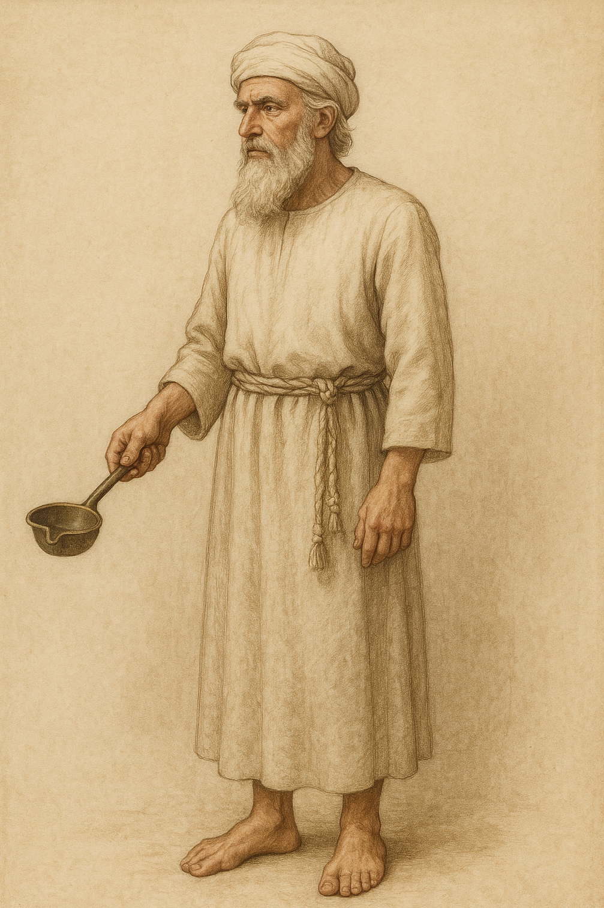

# Human-made Things in the Bible

## License Information

Human-made Things in the Bible © United Bible Societies, 2025. Adapted from: <cite>The Works of Their Hands: Man-made Things in the Bible</cite>, by Ray Pritz © 2009 United Bible Societies. This work is licensed under Creative Commons Attribution-ShareAlike 4.0 International (<a href="https://creativecommons.org/licenses/by-sa/4.0/">https://creativecommons.org/licenses/by-sa/4.0/</a>).

--------------------------------

## 标题：大祭司的圣服（High Priest’s clothing） (id: REALIA:4.5)

4\.5 标题：大祭司的圣服（High Priest’s clothing）
======================================

*这个模型展示大祭司衣服一个可能式样 (© Ray Pritz by United Bible Societies)*

大祭司的圣服由八件衣物组成。首先，大祭司穿上一条细麻布短裤作为内衣，外面罩一件内袍，这是一件很长的衬衫，再用一条腰带束腰，最后套上一件蓝色的外袍。接下来是穿戴以弗得，这是一种有腰带和肩带的围裙。在以弗得的肩带和腰带之间是一个镶有宝石的胸袋。圣经没有清楚说明以弗得的肩带是一直延伸到身体正面的腰部（如右图所示），还是通过胸袋及其带子来连接以弗得的肩带和腰带部位。大祭司的前额上系着一块金牌，头上戴着一条头巾。

我们很难准确地识别圣服的各件衣物。在一些情况下，经文的确切意思并不清楚。翻译者应该试着想象出整套圣服，然后用读者能够明白的方式表达出来。翻译者可能需要提供脚注，以强调这里提到的全套服饰是专门为大祭司预备的。但是，其中有些衣物其他祭司也会穿着。翻译者应尽量避免音译希伯来文术语，如果实在找不到其他译法，一定要加上脚注或在术语简释中解释这些音译的词语。

## 标题：内衣、短裤（undergarment, breeches, shorts） (id: REALIA:4.5.1)

4\.5\.1 标题：内衣、短裤（undergarment, breeches, shorts）
================================================

经文出处
----

Hebrew 来：מִכְנָסַיִם (音译：miknasayim)

[EXO 28:42](https://ref.ly/Exod28:42), [EXO 39:28](https://ref.ly/Exod39:28), [LEV 6:3](https://ref.ly/Lev6:3), [LEV 16:4](https://ref.ly/Lev16:4), [EZK 44:18](https://ref.ly/Ezek44:18)

Greek 希：περισκελής (音译：periskelēs)

[SIR 45:8](https://ref.ly/Sir45:8)

描述和用途
-----

*大祭司的内衣 (© Ben P L, CC BY 2\.0, via Wikimedia Commons)*

短裤是穿在身体下半部分的内衣。以上参考经文表明这短裤是用细麻布做的（参[1\.5\.3\.7 麻、亚麻、细麻布 (linen)\<REALIA:1\.5\.3\.7\>](#) ）。虽然人们普遍穿着这件衣物，但圣经只在谈及大祭司和与他一同供职的祭司时才提到它。短裤要贴身穿在祭司礼袍的里面。

---

翻译
--

翻译者应该使用目标语言中与“短裤”最接近的自然对等词。有些语言会区分男士内衣和女士内衣，在上文列出的所有经文中，翻译者应选用表示男士内衣的词语。

* **Associated Passages:** 出埃及记 28:42; 出埃及记 39:28; 利未记 6:3; 利未记 16:4; 以西结书 44:18; 德训篇 45:8

## 标题：内袍、束腰长衬衫、衬衫（tunic, shirt） (id: REALIA:4.5.2)

4\.5\.2 标题：内袍、束腰长衬衫、衬衫（tunic, shirt）
====================================

经文出处
----

Hebrew 来：כֻּתֹּנֶת (音译：kutoneth)

[EXO 28:4](https://ref.ly/Exod28:4), [EXO 28:39](https://ref.ly/Exod28:39), [EXO 28:40](https://ref.ly/Exod28:40), [EXO 29:5](https://ref.ly/Exod29:5), [EXO 29:8](https://ref.ly/Exod29:8), [EXO 39:27](https://ref.ly/Exod39:27), [EXO 40:14](https://ref.ly/Exod40:14), [LEV 8:7](https://ref.ly/Lev8:7), [LEV 8:13](https://ref.ly/Lev8:13), [LEV 10:5](https://ref.ly/Lev10:5), [LEV 16:4](https://ref.ly/Lev16:4), [EZR 2:69](https://ref.ly/Ezra2:69), [NEH 7:69](https://ref.ly/Neh7:69), [NEH 7:71](https://ref.ly/Neh7:71)

Greek 希：χιτών (音译：chitōn)

[MRK 14:63](https://ref.ly/Mark14:63)

描述和用途
-----

*身穿长袍的祭司 (Image generated by ChatGPT using OpenAI technology)*

内袍是大祭司及一同供职的祭司穿着的另一件内衣。内袍穿在短裤外面，但从腰部以上是贴身的，外面套着外袍。内袍是一种几乎长及脚踝的衬衫，大概是长袖的，用细麻布织成，可能是套头式的，用一条系在腰部的带子来扎紧。另参[6\.3 衬衫、束腰长衬衫(shirt, tunic)\<REALIA:6\.3\>](#) 。

---

翻译
--

希伯来文*kutoneth* 一般指男女穿着的日常衣服，很可能是一种“衬衫”。RSV (Revised Standard Version (1952)) 将其译成“coat”（“外套”；[EXO 28:4](https://ref.ly/Exod28:4) ）可能会误导读者，因为这件衣服不是外衣，而是在其他衣物里面贴身穿着的。*Kutoneth* 通常被译作“束腰长衬衫”或“内袍”（“tunic”；NIV (New International Version (1984)) 、NEB (New English Bible (1970)) 、NAB (New American Bible (1970)) 、NJB (New Jerusalem Bible (1985)) ）。在许多语言中，“衬衫”（“shirt”；GNT (Good News Translation (1992)) 、CEV (Contemporary English Version) ）会是最接近的对等词。根据[EXO 28:4](https://ref.ly/Exod28:4) 的描述，内袍是“带刺绣的”（“embroidered”；GNT (Good News Translation (1992)) ）。关于“带刺绣的”一词的翻译，参[1\.5\.3\.11 绣花布、刺绣作品 (embroidered cloth, needlework)\<REALIA:1\.5\.3\.11\>](#) 。

* **Associated Passages:** 出埃及记 28:4; 出埃及记 28:39; 出埃及记 28:40; 出埃及记 29:5; 出埃及记 29:8; 出埃及记 39:27; 出埃及记 40:14; 利未记 8:7; 利未记 8:13; 利未记 10:5; 利未记 16:4; 以斯拉记 2:69; 尼希米记 7:69; 尼希米记 7:71; 马可福音 14:63

* **Associated ACAI Concepts:** Tunic (ID: `realia:Tunic`)

## 标题：外袍（robe） (id: REALIA:4.5.3)

4\.5\.3 标题：外袍（robe）
===================

经文出处
----

Hebrew 来：מִדָּה (音译：midah)

[PSA 133:2](https://ref.ly/Ps133:2)

Hebrew 来：מְעִיל (音译：m‘il)

[EXO 28:4](https://ref.ly/Exod28:4), [EXO 28:31](https://ref.ly/Exod28:31), [EXO 28:34](https://ref.ly/Exod28:34), [EXO 29:5](https://ref.ly/Exod29:5), [EXO 39:22](https://ref.ly/Exod39:22), [EXO 39:23](https://ref.ly/Exod39:23), [EXO 39:24](https://ref.ly/Exod39:24), [EXO 39:25](https://ref.ly/Exod39:25), [EXO 39:26](https://ref.ly/Exod39:26), [LEV 8:7](https://ref.ly/Lev8:7), [1SA 2:19](https://ref.ly/1Sam2:19), [1SA 15:27](https://ref.ly/1Sam15:27), [1SA 18:4](https://ref.ly/1Sam18:4), [1SA 24:5](https://ref.ly/1Sam24:5), [1SA 24:12](https://ref.ly/1Sam24:12), [1SA 24:12](https://ref.ly/1Sam24:12), [1SA 28:14](https://ref.ly/1Sam28:14), [2SA 13:18](https://ref.ly/2Sam13:18), [1CH 15:27](https://ref.ly/1Chr15:27), [EZR 9:3](https://ref.ly/Ezra9:3), [EZR 9:5](https://ref.ly/Ezra9:5), [JOB 1:20](https://ref.ly/Job1:20), [JOB 2:12](https://ref.ly/Job2:12), [JOB 29:14](https://ref.ly/Job29:14), [PSA 109:29](https://ref.ly/Ps109:29), [ISA 59:17](https://ref.ly/Isa59:17), [ISA 61:10](https://ref.ly/Isa61:10), [EZK 26:16](https://ref.ly/Ezek26:16)

Greek 希：ἔνδυμα (音译：enduma)

[WIS 18:24](https://ref.ly/Wis18:24)

Greek 希：ἱμάτιον (音译：himation)

[MAT 26:65](https://ref.ly/Matt26:65)

Greek 希：περιστολή (音译：peristolē)

[SIR 45:7](https://ref.ly/Sir45:7)

Greek 希：ποδήρης (音译：podērēs)

[WIS 18:24](https://ref.ly/Wis18:24), [SIR 45:8](https://ref.ly/Sir45:8)

Greek 希：στολή (音译：stolē)

[SIR 45:10](https://ref.ly/Sir45:10), [SIR 50:11](https://ref.ly/Sir50:11), [1MA 10:21](https://ref.ly/1Macc10:21)

描述
--

大祭司的外袍套在内袍外面，是一种外套或罩衫，由浅蓝色的羊毛线织成。这是一种垂到脚踝的长袍，但并不清楚是否有袖子，也不清楚前襟是分成两片还是不分片。外袍甚至可能像拉丁美洲的披风那样是一块长方形的布，中间有一个套头的领口。外袍的下摆相间缝着金铃铛（参[4\.5\.3\.1 铃片、铃铛 (jinglet, bell)\<REALIA:4\.5\.3\.1\>](#) ）和用线织成的石榴。外袍由套在外面的以弗得来固定。参[4\.5 大祭司的圣服 (High Priest’s clothing)\<REALIA:4\.5\>](#) 和[4\.5\.4 以弗得 (ephod)\<REALIA:4\.5\.4\>](#) 中的插图。

---

翻译
--

外袍有时被称作“以弗得的外袍”（“the robe of the ephod”；如RSV (Revised Standard Version (1952)) 在[EXO 28:31](https://ref.ly/Exod28:31); [EXO 29:5](https://ref.ly/Exod29:5); [EXO 39:22](https://ref.ly/Exod39:22) 的译法），这句话的意思仅仅是以弗得套在外袍的外面。

* **Associated Passages:** 诗篇 133:2; 出埃及记 28:4; 出埃及记 28:31; 出埃及记 28:34; 出埃及记 29:5; 出埃及记 39:22; 出埃及记 39:23; 出埃及记 39:24; 出埃及记 39:25; 出埃及记 39:26; 利未记 8:7; 撒母耳记上 2:19; 撒母耳记上 15:27; 撒母耳记上 18:4; 撒母耳记上 24:5; 撒母耳记上 24:12; 撒母耳记上 28:14; 撒母耳记下 13:18; 历代志上 15:27; 以斯拉记 9:3; 以斯拉记 9:5; 约伯记 1:20; 约伯记 2:12; 约伯记 29:14; 诗篇 109:29; 以赛亚书 59:17; 以赛亚书 61:10; 以西结书 26:16; 智慧篇 18:24; 马太福音 26:65; 德训篇 45:7; 德训篇 45:8; 德训篇 45:10; 德训篇 50:11; 玛加伯上 10:21

* **Associated ACAI Concepts:** Robe (ID: `realia:Robe`)

## 标题：铃片、铃铛（jinglet, bell） (id: REALIA:4.5.3.1)

4\.5\.3\.1 标题：铃片、铃铛（jinglet, bell）
==================================

经文出处
----

Hebrew 来：פַּעֲמֹן (音译：pa‘amon)

[EXO 28:33](https://ref.ly/Exod28:33), [EXO 28:34](https://ref.ly/Exod28:34), [EXO 28:34](https://ref.ly/Exod28:34), [EXO 39:25](https://ref.ly/Exod39:25), [EXO 39:25](https://ref.ly/Exod39:25), [EXO 39:26](https://ref.ly/Exod39:26), [EXO 39:26](https://ref.ly/Exod39:26)

Greek 希：κώδων (音译：kōdōn)

[SIR 45:9](https://ref.ly/Sir45:9)

描述和用途
-----

*大祭司衣服上的铃铛和小金钟 (© Ben P L, CC BY 2\.0, via Wikimedia Commons)*

铃片是小金属片，确切的尺寸和形状不详。铃片缝在大祭司外袍的下摆处（参[4\.5\.3 外袍 (robe)\<REALIA:4\.5\.3\>](#) ）。当大祭司走动时，铃片就会相互碰撞，叮当作响。

---

翻译
--

我们今天所知的铃铛呈钟形，内有一个铃舌，这种铃铛在以色列人出埃及的时候还不为人所知，因此很可能不是经文所指。然而，我们查阅的几乎所有现代译本都将希伯来文*pa‘amon* 译作“铃铛”（“bells”；RSV (Revised Standard Version (1952)) 、NIV (New International Version (1984)) ）。如果目标语言中有表示铃片的词语且广为人知，那么就应该使用。如果没有，翻译者可以使用“铃铛”，因为两者功能相同，在形式上也没有太大区别。如果目标读者不知道“铃铛”这种东西，翻译者就必须找到类似的物品来替代，比如某种用金属片（或硬币）甚至贝壳做成的饰品，一种在衣服拂动时会发出声音的饰品。

* **Associated Passages:** 出埃及记 28:33; 出埃及记 28:34; 出埃及记 39:25; 出埃及记 39:26; 德训篇 45:9

* **Associated ACAI Concepts:** Jinglet (ID: `realia:Jinglet`)

## 标题：以弗得（ephod） (id: REALIA:4.5.4)

4\.5\.4 标题：以弗得（ephod）
=====================

经文出处
----

Hebrew 来：אֵפֹד, אֲפֻדָּה (音译：’efod, ’afudah)

[EXO 25:7](https://ref.ly/Exod25:7), [EXO 28:4](https://ref.ly/Exod28:4), [EXO 28:6](https://ref.ly/Exod28:6), [EXO 28:8](https://ref.ly/Exod28:8), [EXO 28:12](https://ref.ly/Exod28:12), [EXO 28:15](https://ref.ly/Exod28:15), [EXO 28:25](https://ref.ly/Exod28:25), [EXO 28:26](https://ref.ly/Exod28:26), [EXO 28:27](https://ref.ly/Exod28:27), [EXO 28:27](https://ref.ly/Exod28:27), [EXO 28:28](https://ref.ly/Exod28:28), [EXO 28:28](https://ref.ly/Exod28:28), [EXO 28:28](https://ref.ly/Exod28:28), [EXO 28:31](https://ref.ly/Exod28:31), [EXO 29:5](https://ref.ly/Exod29:5), [EXO 29:5](https://ref.ly/Exod29:5), [EXO 29:5](https://ref.ly/Exod29:5), [EXO 35:9](https://ref.ly/Exod35:9), [EXO 35:27](https://ref.ly/Exod35:27), [EXO 39:2](https://ref.ly/Exod39:2), [EXO 39:5](https://ref.ly/Exod39:5), [EXO 39:7](https://ref.ly/Exod39:7), [EXO 39:8](https://ref.ly/Exod39:8), [EXO 39:18](https://ref.ly/Exod39:18), [EXO 39:19](https://ref.ly/Exod39:19), [EXO 39:20](https://ref.ly/Exod39:20), [EXO 39:20](https://ref.ly/Exod39:20), [EXO 39:21](https://ref.ly/Exod39:21), [EXO 39:21](https://ref.ly/Exod39:21), [EXO 39:21](https://ref.ly/Exod39:21), [EXO 39:22](https://ref.ly/Exod39:22), [LEV 8:7](https://ref.ly/Lev8:7), [LEV 8:7](https://ref.ly/Lev8:7), [NUM 34:23](https://ref.ly/Num34:23), [JDG 8:27](https://ref.ly/Judg8:27), [JDG 17:5](https://ref.ly/Judg17:5), [JDG 18:14](https://ref.ly/Judg18:14), [JDG 18:17](https://ref.ly/Judg18:17), [JDG 18:18](https://ref.ly/Judg18:18), [JDG 18:20](https://ref.ly/Judg18:20), [1SA 2:18](https://ref.ly/1Sam2:18), [1SA 2:28](https://ref.ly/1Sam2:28), [1SA 14:3](https://ref.ly/1Sam14:3), [1SA 21:10](https://ref.ly/1Sam21:10), [1SA 22:18](https://ref.ly/1Sam22:18), [1SA 23:6](https://ref.ly/1Sam23:6), [1SA 23:9](https://ref.ly/1Sam23:9), [1SA 30:7](https://ref.ly/1Sam30:7), [1SA 30:7](https://ref.ly/1Sam30:7), [2SA 6:14](https://ref.ly/2Sam6:14), [1CH 15:27](https://ref.ly/1Chr15:27), [ISA 30:22](https://ref.ly/Isa30:22), [HOS 3:4](https://ref.ly/Hos3:4)

Greek 希：ἐπωμίς (音译：epōmis)

[SIR 45:8](https://ref.ly/Sir45:8)

描述和用途
-----

*大祭司的圣服 (Image generated by ChatGPT using OpenAI technology)*

大祭司穿的以弗得是一种围裙或背心，带有肩带和一条腰带。腰带是以弗得不可缺少的一部分；束在腰上，在前面或后面系住（另参下文的讨论）。以弗得的上缘位于胸部下方。根据犹太历史学家约瑟夫（《犹太古史》III 7，5）记载的一个传统说法，以弗得长1肘（约50厘米或20英寸）。这意味着以弗得大约垂到大腿的中部位置。圣经没有给出以弗得的尺寸。

为了更好地了解以弗得的样式，最好将其与胸袋放在一起来考虑（参[4\.5\.5 胸袋、胸牌 (sacred pocket, breastpiece)\<REALIA:4\.5\.5\>](#) ）。一种解释是：以弗得的两条肩带分别在祭司的身前和身后固定，胸袋通过金环固定在祭司身前的肩带上，如[4\.5 大祭司的圣服 (High Priest’s clothing)\<REALIA:4\.5\>](#) 中的插图所示。另一种解释是：以弗得的肩带没有连到以弗得上端的腰带上，肩带末端和腰带之间的距离（约25厘米或10英寸）由胸袋填补。胸袋的四角上缝着金环，下方的两个环用蓝色带子系在以弗得腰带处的对应环上。胸袋上方的环用小金链连在肩带的末端。每条肩带的末端有一个扣环，其实是镶在金槽里的宝石。宝石上面刻着以色列十二支派的名字。金链的另一端就连在这些扣环上。参本节和[4\.5\.5 胸袋、胸牌 (sacred pocket, breastpiece)\<REALIA:4\.5\.5\>](#) 中的插图。

---

翻译
--

“以弗得”是希伯来文*’efod* 的音译，这可能是祭司圣服中最难翻译的一件。有些语言会有词语表示的衣服样式与以弗得相同（并非有意）。然而，在一些情况下，这个词特别指女性穿着的衣服，因而不可采用。另外，译成“工人的围裙”之类也欠妥当，因为这种围裙的主要作用是保护衣物，但这不是以弗得的作用；以弗得是大祭司圣服中最精致、最贵重的一件。几乎所有英文译本都采取音译*’efod* 一词，但Mft (Moffatt Translation (1926)) 仅译作“apron”（“围裙”），AT (American Translation (Goodspeed, 1935)) 译作“\[sacred] apron”（“［神圣的］围裙”）。在有些语言中，也可译作“祭司的围裙”。

在[EXO 28:8](https://ref.ly/Exod28:8) 和[EXO 39:5](https://ref.ly/Exod39:5) ，RSV (Revised Standard Version (1952)) 译有短语“the skilfully woven band”（“巧工织的带子”）。这带子或腰带似乎是用和以弗得一样的料子做成的，固定在以弗得的角上，以便系紧以弗得。这节经文中的“带子”是单数，但并不是说就只有一条带子，而是代表所有带子。这里的希伯来文词语意思仅仅是“腰带”或“带子”。因此，在NJB (New Jerusalem Bible (1985)) 、NEB (New English Bible (1970)) ，以及许多其他语言的译本中，“巧工织的”被省略了，其他翻译者也可以省略这个形容词。NJB (New Jerusalem Bible (1985)) 将其译作“The waistband on the *ephod* ”（“以弗得上的腰带”）。

*’efod* 的其他意思：在上面列出的一些经文中，*’efod* 这个词不是指大祭司所穿的服饰。在大多数（有些学者认为是所有）这些经文中，*’efod* 仍然表示一种服饰，可能是一种在上腹部扎紧的坎肩或围裙。参[1SA 2:18](https://ref.ly/1Sam2:18); [1SA 22:18](https://ref.ly/1Sam22:18) ；[2SA 6:14](https://ref.ly/2Sam6:14) ；[1CH 15:27](https://ref.ly/1Chr15:27) ，这些经文出现了希伯来文短语*’efod bad* ；字面义为“细麻布的以弗得”或“布的以弗得”。GNT (Good News Translation (1992)) 的译法值得借鉴，因此[1SA 2:18](https://ref.ly/1Sam2:18) 可译为“神圣的细麻布围裙”，[2SA 6:14](https://ref.ly/2Sam6:14) 可作“他腰上围的细麻布”。

[JDG 8:27](https://ref.ly/Judg8:27) ：基甸制作的“以弗得”具体是什么并不确定。基甸在制作这个物件之前收集了大量的金子，所以很多人认为这是一种“偶像”（“idol”；GNT (Good News Translation (1992)) 、《国际儿童圣经》、Mft (Moffatt Translation (1926)) ）。然而，这里所指可能确实是祭司围裙的仿制品；金子是祭司圣服的主要装饰品，而且基甸收集的一部分金子可能用来支付制作以弗得的工匠的报酬。NCV (New Century Version) 译作“holy vest”（“圣背心”），但大多数译本只将其音译为“以弗得”（“ephod”；RSV (Revised Standard Version (1952)) 、NIV (New International Version (1984)) ）。然而，如果没有给出解释，一般读者可能会将其与最先在《出埃及记》提到的同名物件联系起来。因此，最佳译法似乎是在“偶像、塑像、雕像”和“祭司围裙”之间做出选择；或者保留“以弗得”，同时附上脚注，说明它可能是什么物品。TOB (Traduction Oecuménique de la Bible (French, 1975)) 对这节经文的注释是一个很好的范例：“这里的*ephod* 可能是指盛放占卜用圣签的签筒，或者是某个神明的雕像。”

[JDG 17:5](https://ref.ly/Judg17:5); [JDG 18:14](https://ref.ly/Judg18:14); [JDG 18:18](https://ref.ly/Judg18:18); [JDG 18:18](https://ref.ly/Judg18:18); [JDG 18:20](https://ref.ly/Judg18:20) 和[HOS 3:4](https://ref.ly/Hos3:4) 提到的以弗得很可能是圣服，并且在功能上，甚至也许在样式上，都与大祭司的以弗得相似。然而，不论《士师记》中米迦的以弗得，还是[HOS 3:4](https://ref.ly/Hos3:4) 中提到的以弗得，都不是大祭司的以弗得。在相关的语境中，这些以弗得都与律法禁止的崇拜有关。

* **Associated Passages:** 出埃及记 25:7; 出埃及记 28:4; 出埃及记 28:6; 出埃及记 28:8; 出埃及记 28:12; 出埃及记 28:15; 出埃及记 28:25; 出埃及记 28:26; 出埃及记 28:27; 出埃及记 28:28; 出埃及记 28:31; 出埃及记 29:5; 出埃及记 35:9; 出埃及记 35:27; 出埃及记 39:2; 出埃及记 39:5; 出埃及记 39:7; 出埃及记 39:8; 出埃及记 39:18; 出埃及记 39:19; 出埃及记 39:20; 出埃及记 39:21; 出埃及记 39:22; 利未记 8:7; 民数记 34:23; 士师记 8:27; 士师记 17:5; 士师记 18:14; 士师记 18:17; 士师记 18:18; 士师记 18:20; 撒母耳记上 2:18; 撒母耳记上 2:28; 撒母耳记上 14:3; 撒母耳记上 21:10; 撒母耳记上 22:18; 撒母耳记上 23:6; 撒母耳记上 23:9; 撒母耳记上 30:7; 撒母耳记下 6:14; 历代志上 15:27; 以赛亚书 30:22; 何西阿书 3:4; 德训篇 45:8

* **Associated ACAI Concepts:** Ephod (ID: `realia:Ephod`); Ephod (ID: `person:Ephod`)

## 标题：胸袋、胸牌（sacred pocket, breastpiece） (id: REALIA:4.5.5)

4\.5\.5 标题：胸袋、胸牌（sacred pocket, breastpiece）
============================================

经文出处
----

Hebrew 来：חֹשֶׁן (音译：choshen)

[EXO 25:7](https://ref.ly/Exod25:7), [EXO 28:4](https://ref.ly/Exod28:4), [EXO 28:15](https://ref.ly/Exod28:15), [EXO 28:22](https://ref.ly/Exod28:22), [EXO 28:23](https://ref.ly/Exod28:23), [EXO 28:23](https://ref.ly/Exod28:23), [EXO 28:24](https://ref.ly/Exod28:24), [EXO 28:26](https://ref.ly/Exod28:26), [EXO 28:28](https://ref.ly/Exod28:28), [EXO 28:28](https://ref.ly/Exod28:28), [EXO 28:29](https://ref.ly/Exod28:29), [EXO 28:30](https://ref.ly/Exod28:30), [EXO 29:5](https://ref.ly/Exod29:5), [EXO 35:9](https://ref.ly/Exod35:9), [EXO 35:27](https://ref.ly/Exod35:27), [EXO 39:8](https://ref.ly/Exod39:8), [EXO 39:9](https://ref.ly/Exod39:9), [EXO 39:15](https://ref.ly/Exod39:15), [EXO 39:16](https://ref.ly/Exod39:16), [EXO 39:17](https://ref.ly/Exod39:17), [EXO 39:19](https://ref.ly/Exod39:19), [EXO 39:21](https://ref.ly/Exod39:21), [EXO 39:21](https://ref.ly/Exod39:21), [LEV 8:8](https://ref.ly/Lev8:8), [LEV 8:8](https://ref.ly/Lev8:8)

描述和用途
-----

*(Image generated by ChatGPT using OpenAI technology)*

胸袋是大祭司戴在胸前的一块带有刺绣的布，连接在以弗得的肩带和腰带之间（关于胸袋和以弗得的连接方式，参[4\.5\.4 以弗得(ephod)\<REALIA:4\.5\.4\>](#) 中的描述）。

胸袋呈长方形，长度是宽度的两倍，对折后变成正方形。经文给出的尺寸是长2虎口，宽1虎口，对折后成为一个边长1虎口的正方形。（通常认为，1虎口约等于半肘，参[EZK 43:13](https://ref.ly/Ezek43:13) 、[EZK 43:17](https://ref.ly/Ezek43:17) ，半肘约25厘米或10英寸）。折叠处在底部，这样便形成一个口袋，里面放着乌陵和土明（参[4\.9\.1 乌陵和土明(Urim and Thummim)\<REALIA:4\.9\.1\>](#) ）。

胸袋上的金槽里镶着四行宝石，每行三块（或三行宝石，每行四块）。十二块宝石各不相同，每块都刻着以色列一个支派的名字。

---

翻译
--

要找到一个合适的术语来翻译希伯来文*choshen* 可能并不容易。英文“breastplate”（以及中文“胸牌”）会让人误以为它是由金属或其他坚硬的东西做成的。*Die Bibel: Einheitsübersetzung* （BE (Bible in Basic English) ）作“签袋”，着重于胸袋里放着的乌陵和土明的功用。*Choshen* 也可译作“圣袋”（“sacred pouch”；Mft (Moffatt Translation (1926)) ）、“覆胸布”（“chest covering”；NCV (New Century Version) ），或“心上的袋子”。[EXO 28:15](https://ref.ly/Exod28:15) 中的希伯来文短语*choshen mishpat* 被译作“breastpiece of judgment”（“判断的胸袋”；RSV (Revised Standard Version (1952)) ）、“pouch of judgment”（“判断袋”；TOT ）、“judicial pouch”（“判决袋”；Mft (Moffatt Translation (1926)) ）、“breastpiece of decision”（“决断的胸袋”；NJPSV (New Jewish Publication Society Version) 、NAB (New American Bible (1970)) ），以及“breastpiece for making decisions”（“做决断的胸袋”；NIV (New International Version (1984)) ）。CEV (Contemporary English Version) 英文意为，“胸袋，大祭司用它来知道我要百姓去做什么。”

* **Associated Passages:** 出埃及记 25:7; 出埃及记 28:4; 出埃及记 28:15; 出埃及记 28:22; 出埃及记 28:23; 出埃及记 28:24; 出埃及记 28:26; 出埃及记 28:28; 出埃及记 28:29; 出埃及记 28:30; 出埃及记 29:5; 出埃及记 35:9; 出埃及记 35:27; 出埃及记 39:8; 出埃及记 39:9; 出埃及记 39:15; 出埃及记 39:16; 出埃及记 39:17; 出埃及记 39:19; 出埃及记 39:21; 利未记 8:8; 以西结书 43:13; 以西结书 43:17

* **Associated ACAI Concepts:** Breast-Piece (ID: `realia:Breast-piece`)

## 标题：腰带（sash, cloth belt） (id: REALIA:4.5.6)

4\.5\.6 标题：腰带（sash, cloth belt）
===============================

经文出处
----

Hebrew 来：אַבְנֵט (音译：’avnet)

[EXO 28:4](https://ref.ly/Exod28:4), [EXO 28:39](https://ref.ly/Exod28:39), [EXO 28:40](https://ref.ly/Exod28:40), [EXO 29:9](https://ref.ly/Exod29:9), [EXO 39:29](https://ref.ly/Exod39:29), [LEV 8:7](https://ref.ly/Lev8:7), [LEV 8:13](https://ref.ly/Lev8:13), [LEV 16:4](https://ref.ly/Lev16:4)

Hebrew 来：חגר (音译：chagar)

[EXO 29:9](https://ref.ly/Exod29:9), [LEV 8:7](https://ref.ly/Lev8:7), [LEV 8:7](https://ref.ly/Lev8:7), [LEV 8:13](https://ref.ly/Lev8:13), [LEV 16:4](https://ref.ly/Lev16:4)

描述
--

腰带是一条长布带，大祭司把它围着腰部缠绕几圈，以扎紧内袍（参[4\.5\.2 内袍、束腰长衬衫、衬衫 (tunic, shirt)\<REALIA:4\.5\.2\>](#) ）。其他祭司也束腰带。[EXO 39:29](https://ref.ly/Exod39:29) 记载，大祭司的腰带是用四种线以刺绣的手艺做成的。根据后圣经时期的犹太传统，腰带长32肘（约16米或53英尺）。即使这个传统说法有所夸大，腰带的长度也应该足以缠绕腰部几圈，然后打结扎紧。参[4\.5\.4 以弗得 (ephod)\<REALIA:4\.5\.4\>](#) 中的插图。

---

翻译
--

RSV (Revised Standard Version (1952)) 把大祭司系的这条腰带译作“girdle”（“妇女紧身褡”、“腰带”），在现代英文中，这个词可能会误导读者。这条带有刺绣的长腰带除了缠在腰部这个基本用途之外，似乎还有一个象征意义，就是标志着祭司的身份。许多英文译本使用了“sash”（“腰带”）一词，但一些语言可能需要译作“宽带子”。在[LEV 8:7](https://ref.ly/Lev8:7) ，要注意区分这条腰带与这节经文稍后提到的“巧工织的以弗得带子”（RSV (Revised Standard Version (1952)) 直译；GNT (Good News Translation (1992)) 直译为“精织的腰带”；参[4\.5\.4 以弗得 (ephod)\<REALIA:4\.5\.4\>](#) ）。

另参[6\.6 腰带、皮带 (waistband, sash, belt)\<REALIA:6\.6\>](#) 中的讨论。

* **Associated Passages:** 出埃及记 28:4; 出埃及记 28:39; 出埃及记 28:40; 出埃及记 29:9; 出埃及记 39:29; 利未记 8:7; 利未记 8:13; 利未记 16:4

* **Associated ACAI Concepts:** Sash (ID: `realia:Sash`)

## 标题：金牌、额头上的饰物（forehead plate, forehead ornament） (id: REALIA:4.5.7)

4\.5\.7 标题：金牌、额头上的饰物（forehead plate, forehead ornament）
=======================================================

经文出处
----

Hebrew 来：צִיץ (音译：tsits)

[EXO 28:36](https://ref.ly/Exod28:36), [EXO 39:30](https://ref.ly/Exod39:30), [LEV 8:9](https://ref.ly/Lev8:9)

Greek 希：στέφανος (音译：stefanos)

[SIR 45:12](https://ref.ly/Sir45:12)

描述
--

*(Image generated by ChatGPT using OpenAI technology)*

大祭司要在前额上、礼冠的下方戴一条类似头带的饰物，称为金牌。金牌由两种材料做成。前面是一块薄金片，锤打成窄带子的形状，上面刻着“归耶和华为圣”。牌的末端系着蓝色的丝带或线绳，线绳在头后打结，将金牌固定在前额上。

---

翻译
--

对于[EXO 28:36](https://ref.ly/Exod28:36) 中的希伯来文*tsits* ，我们查阅的10个英文译本有多达8种译法。“窄带子”（CEV (Contemporary English Version) 直译）或“小牌子”（GECL (German Common Language Version (Gute Nachricht Bibel)) 直译）等类似译法可能是最好的。另外也可译作“金头带”。

[LEV 8:9](https://ref.ly/Lev8:9) 有一个字面意为“金花，圣冠”的表达，第一个词语中的“花”译自希伯来文*tsits* ，意思可能是“盛开的花”或“花朵”（如[NUM 17:23](https://ref.ly/Num17:23) 中的意思，希伯来文本是第23节；《和》17:8），或“闪亮的东西”。当这个词与限定词“金的”一起使用时，很多英文译本都将其解作“plate”（“牌”），如RSV (Revised Standard Version (1952)) 和NIV (New International Version (1984)) 。然而，也有译本译作“花形金饰”（FRCL (French Common Language Version (Bible en français courant)) 直译），或简单地译作“金花”（NJB (New Jerusalem Bible (1985)) 直译）。但是，在希伯来文本中，“金花”与“圣冠”并列，并且是由“圣冠”来解释的。“圣冠”显然不是指象征皇室的王冠。译作“冠”的希伯来文词语也可以表示“奉献”，整个语句大概表示金牌是大祭司奉献给上帝的象征。有学者提出，“圣冠”可以译作“表明亚伦被奉献给上帝的记号”。整个语句可以译作：“表明亚伦被奉献给上帝的金物件。”

* **Associated Passages:** 出埃及记 28:36; 出埃及记 39:30; 利未记 8:9; 德训篇 45:12; 民数记 17:23

## 标题：头巾、头饰（turban, headdress） (id: REALIA:4.5.8)

4\.5\.8 标题：头巾、头饰（turban, headdress）
===================================

经文出处
----

Hebrew 来：מִגְבָּעָה (音译：migba‘ah)

[EXO 28:40](https://ref.ly/Exod28:40), [EXO 29:9](https://ref.ly/Exod29:9), [EXO 39:28](https://ref.ly/Exod39:28), [LEV 8:13](https://ref.ly/Lev8:13)

Hebrew 来：מִצְנֶפֶת (音译：mitsnefeth)

[EXO 28:4](https://ref.ly/Exod28:4), [EXO 28:37](https://ref.ly/Exod28:37), [EXO 28:37](https://ref.ly/Exod28:37), [EXO 28:39](https://ref.ly/Exod28:39), [EXO 29:6](https://ref.ly/Exod29:6), [EXO 29:6](https://ref.ly/Exod29:6), [EXO 39:28](https://ref.ly/Exod39:28), [EXO 39:31](https://ref.ly/Exod39:31), [LEV 8:9](https://ref.ly/Lev8:9), [LEV 8:9](https://ref.ly/Lev8:9), [LEV 16:4](https://ref.ly/Lev16:4)

Hebrew 来：פְּאֵר (音译：p’er)

[EXO 39:28](https://ref.ly/Exod39:28), [EZK 44:18](https://ref.ly/Ezek44:18)

Hebrew 来：צָנִיף (音译：tsanif)

[ZEC 3:5](https://ref.ly/Zech3:5), [ZEC 3:5](https://ref.ly/Zech3:5)

Greek 希：κίδαρις (音译：kidaris)

[JDT 4:15](https://ref.ly/Jdt4:15), [SIR 45:12](https://ref.ly/Sir45:12)

描述
--

头巾是把一块长布条缠绕头顶许多圈而成的头饰。头巾可能是一次缠绕便持久成形，然后像帽子一样脱戴。参[6\.7 头饰、裹头巾、头巾、帽子 (headdress, turban, hat)\<REALIA:6\.7\>](#) 中的插图。

---

翻译
--

有些语言可能有非常宽泛的名词，指人头上戴的任何东西。如果一定要采用这个统称来描述大祭司的头饰，可能需要加上一个脚注，说明这个头饰象征大祭司的权柄。

希伯来文*migba‘ah* 和*p’er* （字面意为“美丽”或“装饰”）指普通祭司的头饰。他们的头饰在外形上和大祭司的头饰相同，只是没有那么精致。通常可以用同一个名称来指这两种头饰。

在[EXO 39:28](https://ref.ly/Exod39:28) ，*migba‘ah* 和*p’er* 两个词合在一起来描述普通祭司的帽子。由于这两个词在其他经文中用来描述一件头饰，所以各译本在这里用了不同的译法。大多数译本只译作一个词，例如“帽子”（“caps”；RSV (Revised Standard Version (1952)) 、GNT (Good News Translation (1992)) ）或“头带”（“headbands”；NIV (New International Version (1984)) 、NCV (New Century Version) ）。有些译本将*p’er* 理解为*migba‘ah* 的修饰词，译作“带装饰的头巾”（“decorated turbans”；NJPSV (New Jewish Publication Society Version) ）、“带装饰的帽子”（“decorated caps”；NASB (New American Standard Bible) ）、“漂亮的头巾”（“beautiful turbans”；GW (God's Word Translation) ）或“华丽的帽子”（“fancy caps”；CEV (Contemporary English Version) ）。REB (Revised English Bible (1989)) 将这两个词（顺序颠倒）视为两样不同的东西，英文意为“高高的头饰及其带子”。

* **Associated Passages:** 出埃及记 28:40; 出埃及记 29:9; 出埃及记 39:28; 利未记 8:13; 出埃及记 28:4; 出埃及记 28:37; 出埃及记 28:39; 出埃及记 29:6; 出埃及记 39:31; 利未记 8:9; 利未记 16:4; 以西结书 44:18; 撒迦利亚书 3:5; 友弟德传 4:15; 德训篇 45:12

* **Associated ACAI Concepts:** Turban (ID: `realia:Turban`)
