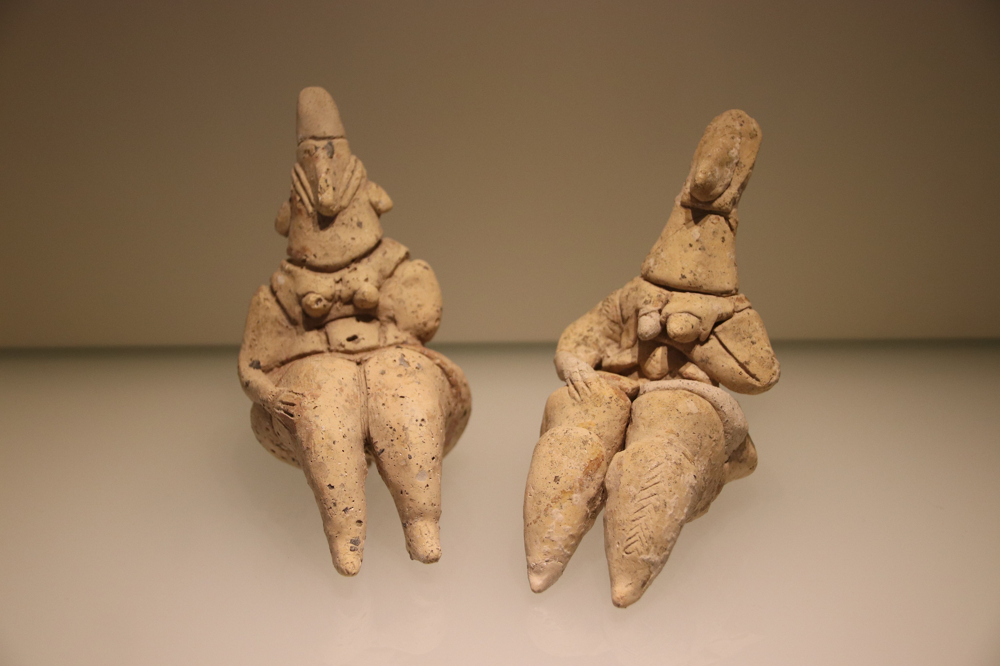

# Human-made Things in the Bible

## License Information

Human-made Things in the Bible © United Bible Societies, 2025. Adapted from: <cite>The Works of Their Hands: Man-made Things in the Bible</cite>, by Ray Pritz © 2009 United Bible Societies. This work is licensed under Creative Commons Attribution-ShareAlike 4.0 International (<a href="https://creativecommons.org/licenses/by-sa/4.0/">https://creativecommons.org/licenses/by-sa/4.0/</a>).

--------------------------------

## 标题：偶像（idols） (id: REALIA:4.6)

4\.6 标题：偶像（idols）
=================

经文出处
----

Hebrew 来：אֱלִיל (音译：’elil)

[LEV 19:4](https://ref.ly/Lev19:4), [LEV 26:1](https://ref.ly/Lev26:1), [1CH 16:26](https://ref.ly/1Chr16:26), [PSA 96:5](https://ref.ly/Ps96:5), [PSA 97:7](https://ref.ly/Ps97:7), [ISA 2:8](https://ref.ly/Isa2:8), [ISA 2:18](https://ref.ly/Isa2:18), [ISA 2:20](https://ref.ly/Isa2:20), [ISA 2:20](https://ref.ly/Isa2:20), [ISA 10:10](https://ref.ly/Isa10:10), [ISA 10:11](https://ref.ly/Isa10:11), [ISA 19:1](https://ref.ly/Isa19:1), [ISA 19:3](https://ref.ly/Isa19:3), [ISA 31:7](https://ref.ly/Isa31:7), [ISA 31:7](https://ref.ly/Isa31:7), [EZK 30:13](https://ref.ly/Ezek30:13), [HAB 2:18](https://ref.ly/Hab2:18)

Hebrew 来：גִּלּוּל (音译：gilul)

[LEV 26:30](https://ref.ly/Lev26:30), [DEU 29:16](https://ref.ly/Deut29:16), [1KI 15:12](https://ref.ly/1Kgs15:12), [1KI 21:26](https://ref.ly/1Kgs21:26), [2KI 17:12](https://ref.ly/2Kgs17:12), [2KI 21:11](https://ref.ly/2Kgs21:11), [2KI 21:21](https://ref.ly/2Kgs21:21), [2KI 23:24](https://ref.ly/2Kgs23:24), [JER 50:2](https://ref.ly/Jer50:2), [EZK 6:4](https://ref.ly/Ezek6:4), [EZK 6:5](https://ref.ly/Ezek6:5), [EZK 6:6](https://ref.ly/Ezek6:6), [EZK 6:9](https://ref.ly/Ezek6:9), [EZK 6:13](https://ref.ly/Ezek6:13), [EZK 6:13](https://ref.ly/Ezek6:13), [EZK 8:10](https://ref.ly/Ezek8:10), [EZK 14:3](https://ref.ly/Ezek14:3), [EZK 14:4](https://ref.ly/Ezek14:4), [EZK 14:4](https://ref.ly/Ezek14:4), [EZK 14:5](https://ref.ly/Ezek14:5), [EZK 14:6](https://ref.ly/Ezek14:6), [EZK 14:7](https://ref.ly/Ezek14:7), [EZK 16:36](https://ref.ly/Ezek16:36), [EZK 18:6](https://ref.ly/Ezek18:6), [EZK 18:12](https://ref.ly/Ezek18:12), [EZK 18:15](https://ref.ly/Ezek18:15), [EZK 20:7](https://ref.ly/Ezek20:7), [EZK 20:8](https://ref.ly/Ezek20:8), [EZK 20:16](https://ref.ly/Ezek20:16), [EZK 20:18](https://ref.ly/Ezek20:18), [EZK 20:24](https://ref.ly/Ezek20:24), [EZK 20:31](https://ref.ly/Ezek20:31), [EZK 20:39](https://ref.ly/Ezek20:39), [EZK 20:39](https://ref.ly/Ezek20:39), [EZK 22:3](https://ref.ly/Ezek22:3), [EZK 22:4](https://ref.ly/Ezek22:4), [EZK 23:7](https://ref.ly/Ezek23:7), [EZK 23:30](https://ref.ly/Ezek23:30), [EZK 23:37](https://ref.ly/Ezek23:37), [EZK 23:39](https://ref.ly/Ezek23:39), [EZK 23:49](https://ref.ly/Ezek23:49), [EZK 30:13](https://ref.ly/Ezek30:13), [EZK 33:25](https://ref.ly/Ezek33:25), [EZK 36:18](https://ref.ly/Ezek36:18), [EZK 36:25](https://ref.ly/Ezek36:25), [EZK 37:23](https://ref.ly/Ezek37:23), [EZK 44:10](https://ref.ly/Ezek44:10), [EZK 44:12](https://ref.ly/Ezek44:12)

Hebrew 来：חַמָּן (音译：chaman)

[LEV 26:30](https://ref.ly/Lev26:30), [2CH 14:4](https://ref.ly/2Chr14:4), [2CH 34:4](https://ref.ly/2Chr34:4), [2CH 34:7](https://ref.ly/2Chr34:7), [ISA 17:8](https://ref.ly/Isa17:8), [ISA 27:9](https://ref.ly/Isa27:9), [EZK 6:4](https://ref.ly/Ezek6:4), [EZK 6:6](https://ref.ly/Ezek6:6)

Hebrew 来：סֶמֶל (音译：semel)

[2CH 33:7](https://ref.ly/2Chr33:7), [2CH 33:15](https://ref.ly/2Chr33:15), [EZK 8:3](https://ref.ly/Ezek8:3), [EZK 8:5](https://ref.ly/Ezek8:5)

Hebrew 来：צִיר (音译：tsir)

[ISA 45:16](https://ref.ly/Isa45:16)

Hebrew 来：צֶלֶם (音译：tselem)

[NUM 33:52](https://ref.ly/Num33:52), [2KI 11:18](https://ref.ly/2Kgs11:18), [2CH 23:17](https://ref.ly/2Chr23:17), [EZK 7:20](https://ref.ly/Ezek7:20), [EZK 16:17](https://ref.ly/Ezek16:17), [EZK 23:14](https://ref.ly/Ezek23:14), [AMO 5:26](https://ref.ly/Amos5:26)

Hebrew 来：תַבְנִית (音译：tavnith)

[PSA 106:20](https://ref.ly/Ps106:20)

Greek 希：ἄγαλμα (音译：agalma)

[2MA 2:2](https://ref.ly/2Macc2:2)

Greek 希：εἴδωλον (音译：eidōlon)

[GEN 31:19](https://ref.ly/Gen31:19), [GEN 31:34](https://ref.ly/Gen31:34), [GEN 31:35](https://ref.ly/Gen31:35), [EXO 20:4](https://ref.ly/Exod20:4), [LEV 19:4](https://ref.ly/Lev19:4), [LEV 26:30](https://ref.ly/Lev26:30), [NUM 25:2](https://ref.ly/Num25:2), [NUM 25:2](https://ref.ly/Num25:2), [NUM 33:52](https://ref.ly/Num33:52), [DEU 5:8](https://ref.ly/Deut5:8), [DEU 29:16](https://ref.ly/Deut29:16), [DEU 32:21](https://ref.ly/Deut32:21), [1SA 31:9](https://ref.ly/1Sam31:9), [1KI 11:2](https://ref.ly/1Kgs11:2), [1KI 11:5](https://ref.ly/1Kgs11:5), [1KI 11:5](https://ref.ly/1Kgs11:5), [1KI 11:7](https://ref.ly/1Kgs11:7), [1KI 11:33](https://ref.ly/1Kgs11:33), [2KI 17:12](https://ref.ly/2Kgs17:12), [2KI 21:11](https://ref.ly/2Kgs21:11), [2KI 21:21](https://ref.ly/2Kgs21:21), [2KI 23:24](https://ref.ly/2Kgs23:24), [1CH 10:9](https://ref.ly/1Chr10:9), [1CH 16:26](https://ref.ly/1Chr16:26), [2CH 11:15](https://ref.ly/2Chr11:15), [2CH 14:4](https://ref.ly/2Chr14:4), [2CH 15:16](https://ref.ly/2Chr15:16), [2CH 17:3](https://ref.ly/2Chr17:3), [2CH 23:17](https://ref.ly/2Chr23:17), [2CH 24:18](https://ref.ly/2Chr24:18), [2CH 28:2](https://ref.ly/2Chr28:2), [2CH 33:22](https://ref.ly/2Chr33:22), [2CH 34:7](https://ref.ly/2Chr34:7), [2CH 35:19](https://ref.ly/2Chr35:19), [PSA 96:7](https://ref.ly/Ps96:7), [PSA 113:12](https://ref.ly/Ps113:12), [PSA 134:15](https://ref.ly/Ps134:15), [PSA 151:6](https://ref.ly/Ps151:6), [ISA 1:29](https://ref.ly/Isa1:29), [ISA 10:11](https://ref.ly/Isa10:11), [ISA 27:9](https://ref.ly/Isa27:9), [ISA 30:22](https://ref.ly/Isa30:22), [ISA 37:19](https://ref.ly/Isa37:19), [ISA 41:28](https://ref.ly/Isa41:28), [ISA 48:5](https://ref.ly/Isa48:5), [ISA 57:5](https://ref.ly/Isa57:5), [JER 9:13](https://ref.ly/Jer9:13), [JER 14:22](https://ref.ly/Jer14:22), [JER 16:19](https://ref.ly/Jer16:19), [EZK 6:4](https://ref.ly/Ezek6:4), [EZK 6:6](https://ref.ly/Ezek6:6), [EZK 6:13](https://ref.ly/Ezek6:13), [EZK 6:13](https://ref.ly/Ezek6:13), [EZK 8:10](https://ref.ly/Ezek8:10), [EZK 16:16](https://ref.ly/Ezek16:16), [EZK 18:12](https://ref.ly/Ezek18:12), [EZK 23:39](https://ref.ly/Ezek23:39), [EZK 36:17](https://ref.ly/Ezek36:17), [EZK 36:25](https://ref.ly/Ezek36:25), [EZK 37:23](https://ref.ly/Ezek37:23), [EZK 44:12](https://ref.ly/Ezek44:12), [HOS 4:17](https://ref.ly/Hos4:17), [HOS 8:4](https://ref.ly/Hos8:4), [HOS 13:2](https://ref.ly/Hos13:2), [HOS 14:9](https://ref.ly/Hos14:9), [MIC 1:7](https://ref.ly/Mic1:7), [HAB 2:18](https://ref.ly/Hab2:18), [ZEC 13:2](https://ref.ly/Zech13:2), [ACT 7:41](https://ref.ly/Acts7:41), [ACT 15:20](https://ref.ly/Acts15:20), [ROM 2:22](https://ref.ly/Rom2:22), [1CO 8:4](https://ref.ly/1Cor8:4), [1CO 8:7](https://ref.ly/1Cor8:7), [1CO 10:19](https://ref.ly/1Cor10:19), [1CO 12:2](https://ref.ly/1Cor12:2), [2CO 6:16](https://ref.ly/2Cor6:16), [1TH 1:9](https://ref.ly/1Thess1:9), [1JN 5:21](https://ref.ly/1John5:21), [REV 9:20](https://ref.ly/Rev9:20), [TOB 14:6](https://ref.ly/Tob14:6), [ESG 4:17](https://ref.ly/EsthGr4:17), [WIS 14:11](https://ref.ly/Wis14:11), [WIS 14:12](https://ref.ly/Wis14:12), [WIS 14:27](https://ref.ly/Wis14:27), [WIS 14:29](https://ref.ly/Wis14:29), [WIS 14:30](https://ref.ly/Wis14:30), [WIS 15:15](https://ref.ly/Wis15:15), [SIR 30:19](https://ref.ly/Sir30:19), [LJE 1:72](https://ref.ly/EpJer1:72), [BEL 1:3](https://ref.ly/Bel1:3), [BEL 1:5](https://ref.ly/Bel1:5), [1MA 1:43](https://ref.ly/1Macc1:43), [1MA 3:48](https://ref.ly/1Macc3:48), [1MA 13:47](https://ref.ly/1Macc13:47), [2MA 12:40](https://ref.ly/2Macc12:40), [3MA 4:16](https://ref.ly/3Macc4:16), [ODA 2:21](https://ref.ly/Odes2:21)

Greek 希：εἰκών (音译：eikōn)

[ROM 1:23](https://ref.ly/Rom1:23), [REV 13:14](https://ref.ly/Rev13:14), [REV 13:15](https://ref.ly/Rev13:15), [REV 13:15](https://ref.ly/Rev13:15), [REV 13:15](https://ref.ly/Rev13:15), [REV 14:9](https://ref.ly/Rev14:9), [REV 14:11](https://ref.ly/Rev14:11), [REV 15:2](https://ref.ly/Rev15:2), [REV 16:2](https://ref.ly/Rev16:2), [REV 19:20](https://ref.ly/Rev19:20), [REV 20:4](https://ref.ly/Rev20:4), [WIS 13:13](https://ref.ly/Wis13:13), [WIS 13:16](https://ref.ly/Wis13:16), [WIS 14:15](https://ref.ly/Wis14:15), [WIS 14:17](https://ref.ly/Wis14:17), [WIS 15:5](https://ref.ly/Wis15:5)

Greek 希：κατείδωλος (音译：kateidōlos)

[ACT 17:16](https://ref.ly/Acts17:16)

Greek 希：τύπος (音译：tupos)

[ACT 7:43](https://ref.ly/Acts7:43)

Greek 希：χάραγμα (音译：charagma)

[ACT 17:29](https://ref.ly/Acts17:29)

Latin 拉：idolum

[2ES 16:69](https://ref.ly/2Esd16:69)

经文出处
----

### **雕像、像** ：

Aramaic 兰：צְלֵם (音译：tselem)

[DAN 2:31](https://ref.ly/Dan2:31), [DAN 2:31](https://ref.ly/Dan2:31), [DAN 2:32](https://ref.ly/Dan2:32), [DAN 2:34](https://ref.ly/Dan2:34), [DAN 2:35](https://ref.ly/Dan2:35), [DAN 3:1](https://ref.ly/Dan3:1), [DAN 3:2](https://ref.ly/Dan3:2), [DAN 3:3](https://ref.ly/Dan3:3), [DAN 3:3](https://ref.ly/Dan3:3), [DAN 3:5](https://ref.ly/Dan3:5), [DAN 3:7](https://ref.ly/Dan3:7), [DAN 3:10](https://ref.ly/Dan3:10), [DAN 3:12](https://ref.ly/Dan3:12), [DAN 3:14](https://ref.ly/Dan3:14), [DAN 3:15](https://ref.ly/Dan3:15), [DAN 3:18](https://ref.ly/Dan3:18), [DAN 3:19](https://ref.ly/Dan3:19)

描述和用途
-----

*泥塑女神像 (Gary Todd, Israel Museum, CC0, via Wikimedia Commons)*

偶像是人手所造之物，用来代表神明，供人膜拜。偶像的形式多样，大小各异，小的不如手指长，大的高达数米。偶像通常被塑造成人的形状，但也往往被造成某种动物或鸟类的样子，甚至人与动物结合的形式。

*扛着偶像的人 (© Deutsche Bibelgesellschaft, Stuttgart by United Bible Societies)*

虽然偶像普遍存在，也有相关的术语，但也并不是尽人皆知的。因此，有些语言可能有必要对“偶像”进行意义对等的描述，例如，“看似神明的人工制品”或“代表神明的雕像”。

在有些语言中，可能有必要说明偶像的制作材料。圣经中提到的偶像由多种材料制成，包括石头、黏土、金属和木头等。

在旧约中，偶像很多时候不称作偶像，而是用多种多样的贬义词来指代，如“罪孽”、“惊恐”、“悲伤”和“惊骇”等词。大多数译本都会将这些词译成“偶像”，虽然“偶像”只是隐含的意思。例如，[JER 50:38](https://ref.ly/Jer50:38) 使用的希伯来文*’eymim* 意为“惊恐”，所以这节经文的后半部分字面意为：“因为这是偶像之地，人因惊恐而癫狂。”NRSV (New Revised Standard Version (1989)) 这里的英文意为，“因为这是偶像之地，人因偶像而癫狂。”GNT (Good News Translation (1992)) 意为，“巴比伦充满令人恐惧的偶像，这些偶像愚弄人。”其他用来贬称偶像的希伯来文词语有：

---

翻译
--

Hebrew 来：אָוֶן (音译：’awen（意为“麻烦、邪恶”）)

[ISA 66:3](https://ref.ly/Isa66:3)

Hebrew 来：גִּלּוּל (音译：gilul（“无生命的（滚动的）物、粪”）)

[LEV 26:30](https://ref.ly/Lev26:30), [DEU 29:16](https://ref.ly/Deut29:16), [1KI 15:12](https://ref.ly/1Kgs15:12), [1KI 21:26](https://ref.ly/1Kgs21:26), [2KI 17:12](https://ref.ly/2Kgs17:12), [2KI 21:11](https://ref.ly/2Kgs21:11), [2KI 21:21](https://ref.ly/2Kgs21:21), [2KI 23:24](https://ref.ly/2Kgs23:24), [JER 50:2](https://ref.ly/Jer50:2), [EZK 6:4](https://ref.ly/Ezek6:4), [EZK 6:5](https://ref.ly/Ezek6:5), [EZK 6:6](https://ref.ly/Ezek6:6), [EZK 6:9](https://ref.ly/Ezek6:9), [EZK 6:13](https://ref.ly/Ezek6:13), [EZK 6:13](https://ref.ly/Ezek6:13), [EZK 8:10](https://ref.ly/Ezek8:10), [EZK 14:3](https://ref.ly/Ezek14:3), [EZK 14:4](https://ref.ly/Ezek14:4), [EZK 14:4](https://ref.ly/Ezek14:4), [EZK 14:5](https://ref.ly/Ezek14:5), [EZK 14:6](https://ref.ly/Ezek14:6), [EZK 14:7](https://ref.ly/Ezek14:7), [EZK 16:36](https://ref.ly/Ezek16:36), [EZK 18:6](https://ref.ly/Ezek18:6), [EZK 18:12](https://ref.ly/Ezek18:12), [EZK 18:15](https://ref.ly/Ezek18:15), [EZK 20:7](https://ref.ly/Ezek20:7), [EZK 20:8](https://ref.ly/Ezek20:8), [EZK 20:16](https://ref.ly/Ezek20:16), [EZK 20:18](https://ref.ly/Ezek20:18), [EZK 20:24](https://ref.ly/Ezek20:24), [EZK 20:31](https://ref.ly/Ezek20:31), [EZK 20:39](https://ref.ly/Ezek20:39), [EZK 20:39](https://ref.ly/Ezek20:39), [EZK 22:3](https://ref.ly/Ezek22:3), [EZK 22:4](https://ref.ly/Ezek22:4), [EZK 23:7](https://ref.ly/Ezek23:7), [EZK 23:30](https://ref.ly/Ezek23:30), [EZK 23:37](https://ref.ly/Ezek23:37), [EZK 23:39](https://ref.ly/Ezek23:39), [EZK 23:49](https://ref.ly/Ezek23:49), [EZK 30:13](https://ref.ly/Ezek30:13), [EZK 33:25](https://ref.ly/Ezek33:25), [EZK 36:18](https://ref.ly/Ezek36:18), [EZK 36:25](https://ref.ly/Ezek36:25), [EZK 37:23](https://ref.ly/Ezek37:23), [EZK 44:10](https://ref.ly/Ezek44:10), [EZK 44:12](https://ref.ly/Ezek44:12)

Hebrew 来：הֶבֶל (音译：hevel（“无用、虚妄的物”）)

[DEU 32:21](https://ref.ly/Deut32:21), [1KI 16:13](https://ref.ly/1Kgs16:13), [1KI 16:26](https://ref.ly/1Kgs16:26), [2KI 17:15](https://ref.ly/2Kgs17:15), [PSA 31:7](https://ref.ly/Ps31:7), [JER 8:19](https://ref.ly/Jer8:19), [JER 10:8](https://ref.ly/Jer10:8), [JON 2:9](https://ref.ly/Jonah2:9)

Hebrew 来：מִפְלֶצֶת (音译：mifletseth（“可怕的、令人讨厌的物”）)

[1KI 15:13](https://ref.ly/1Kgs15:13), [1KI 15:13](https://ref.ly/1Kgs15:13), [2CH 15:16](https://ref.ly/2Chr15:16), [2CH 15:16](https://ref.ly/2Chr15:16)

Hebrew 来：עָצָב, עצב (音译：‘atsav（“悲伤、痛苦”；名词或动词）)

[1SA 31:9](https://ref.ly/1Sam31:9), [2SA 5:21](https://ref.ly/2Sam5:21), [1CH 10:9](https://ref.ly/1Chr10:9), [2CH 24:18](https://ref.ly/2Chr24:18), [PSA 106:36](https://ref.ly/Ps106:36), [PSA 106:38](https://ref.ly/Ps106:38), [PSA 115:4](https://ref.ly/Ps115:4), [PSA 135:15](https://ref.ly/Ps135:15), [ISA 10:11](https://ref.ly/Isa10:11), [ISA 46:1](https://ref.ly/Isa46:1), [JER 44:19](https://ref.ly/Jer44:19), [JER 50:2](https://ref.ly/Jer50:2), [HOS 4:17](https://ref.ly/Hos4:17), [HOS 8:4](https://ref.ly/Hos8:4), [HOS 13:2](https://ref.ly/Hos13:2), [HOS 14:9](https://ref.ly/Hos14:9), [MIC 1:7](https://ref.ly/Mic1:7), [ZEC 13:2](https://ref.ly/Zech13:2)

Hebrew 来：עֹצֶב (音译：‘otsev（“悲伤、痛苦”）)

[ISA 48:5](https://ref.ly/Isa48:5)

Hebrew 来：עֵצָה (音译：‘etsah（“不顺服、悖逆”）)

[HOS 10:6](https://ref.ly/Hos10:6)

Hebrew 来：שִׁקּוּץ (音译：shiquts（“可憎的物”）)

[DEU 29:16](https://ref.ly/Deut29:16), [1KI 11:5](https://ref.ly/1Kgs11:5), [1KI 11:7](https://ref.ly/1Kgs11:7), [1KI 11:7](https://ref.ly/1Kgs11:7), [2KI 23:13](https://ref.ly/2Kgs23:13), [2KI 23:13](https://ref.ly/2Kgs23:13), [2CH 15:8](https://ref.ly/2Chr15:8), [JER 4:1](https://ref.ly/Jer4:1), [JER 7:30](https://ref.ly/Jer7:30), [JER 13:27](https://ref.ly/Jer13:27), [JER 16:18](https://ref.ly/Jer16:18), [JER 32:34](https://ref.ly/Jer32:34), [EZK 5:11](https://ref.ly/Ezek5:11), [EZK 7:20](https://ref.ly/Ezek7:20), [EZK 11:18](https://ref.ly/Ezek11:18), [EZK 11:21](https://ref.ly/Ezek11:21), [EZK 20:8](https://ref.ly/Ezek20:8), [EZK 20:30](https://ref.ly/Ezek20:30)

虽然这些词语大部分都可以简单地译作“偶像”，但是为了更好地表达希伯来文本中的贬义，最好添加一个适当的修饰词，如“令人厌恶的”、“可憎的”或“污秽的”等等。

希伯来文*chaman* （总是以复数形式*chamanim* 出现）的确切含义不详。这个词的词形与希伯来文中的“太阳”一词相似，所以有些译本将其解作献给太阳神的偶像或柱像（Mft (Moffatt Translation (1926)) 译作“sun\-pillars”“太阳柱像”；参[4\.6\.6 圣柱、圣石、纪念石 (sacred pillar, sacred stone, memorial stone)\<REALIA:4\.6\.6\>](#) ）。大多数译本将这个词译为“incense altars”（“香坛”；RSV (Revised Standard Version (1952)) 、GNT (Good News Translation (1992)) 、NIV (New International Version (1984)) ）或“incense stands”（“香台”；NJPSV (New Jewish Publication Society Version) ）。

希腊文*eikōn* 、*tupos* 和*charagma* 主要指相像或相似之物，所以在[MAT 22:20](https://ref.ly/Matt22:20) ，CEV (Contemporary English Version) 将*eikōn* 译作“picture”（“图画”）。当这些词指某个神明的像时（如[ACT 7:43](https://ref.ly/Acts7:43) ；[ROM 1:23](https://ref.ly/Rom1:23) ），可以按照希腊文*eidōlon* （意为“偶像”）的译法来翻译。

雕像或像与偶像的根本区别在于：雕像可能仅仅代表一个超自然的存在，而偶像不仅代表这样的存在，还被认为具有某种内在的超自然力量。当人们认为雕像本身具有这样的力量，而不仅仅是某种超自然存在的代表时，雕像往往就变成为偶像。例如，如果某个超自然存在的各种像被认为具有不同的医治能力，那么，最初仅仅作为某种超自然力量的像或代表的事物就变成了偶像，因为不同的像自身已经获得了特殊的能力。换句话说，当人们把“像”当作神明时，“像”就变成了“偶像”。

以下关于[LEV 26:1](https://ref.ly/Lev26:1) 的讨论摘自《〈利未记〉手册》（*A Handbook on Leviticus* ，第401–402页），可能有助于区分不同种类的偶像：

这节经文中有四个词语或表述均指假神（或试图用物质形式来代表的神明），并且上帝禁止以色列人制造和敬拜这些假神。在有些语言中，可能很难找到四个同义词，但翻译者总要尽力寻找：

（1）**偶像** ：“偶像”一词译自希伯来文*’elil* ，词根意为“无用的、不足的、不够的”。NAB (New American Bible (1970)) 将其译作“false gods”（“假神”），Mft (Moffatt Translation (1926)) 译作“unreal gods”（“不真实的神明”）。在有些语言中，最好译作“（供人膜拜的）无用的（或无价值的）东西”。

（2）**雕像** ：这个词译自希伯来文*pesel* （参[4\.6\.2 雕刻的（石）像（graven \[stone] image）\<REALIA:4\.6\.2\>](#) ），指被塑造成某个物体、动物或人的形状的东西，可以由石头、黏土、木头或金属制成。根据这里的上下文，制造这种偶像是为了给人提供一个膜拜的对象。这个词可以译作“像某物的雕刻品”，或者“像某种活物的人造物品”等类似的表达。

（3）**柱像** ：这个词译自希伯来文*matsevah* （参[4\.6\.6 圣柱、圣石、纪念石 (sacred pillar, sacred stone, memorial stone)\<REALIA:4\.6\.6\>](#) ），很可能指一块柱形的石头，被人竖立起来作为膜拜的对象。[GEN 28:18](https://ref.ly/Gen28:18) 和[EXO 24:4](https://ref.ly/Exod24:4) 使用的是同一个词，这些物品在当时的希伯来崇拜中显然是可以接受的。NEB (New English Bible (1970)) 把这个词译作“sacred pillars”（“神圣的柱像”），JB (Jerusalem Bible (1966)) 译作“standing\-stone”（“竖立的石头”），但NJB (New Jerusalem Bible (1985)) 将其改为“cultic stones”（“供祭祀的石头”）。

（4）**石像** ：比较[NUM 33:52](https://ref.ly/Num33:52) 。这个词译自希伯来文*’even maskith* ，具体指什么并不确定。词根与动词“看”有关，因此有些解经家将其解作某种受人瞻仰的、引人注目的石头或马赛克。然而，大多数英文译本将其解作被人雕刻或塑造成膜拜对象的石头。

[DAN 3:1–DAN 3:18](https://ref.ly/Dan3:1-Dan3:18) ：有些解经家认为，这段经文提到的“像”或“雕像”的比例表明，这可能是一种象征性的柱子，而不是某个人或神明的形象的精确描绘，或许柱上的雕刻描绘了人或神明的特征。但也有人认为，这里的像必定具有人的特征。古代教会的教父们认为，这可能是一个被视为神明的君王的像，而有些现代解经家认为这可能是一个巴比伦神明的像；但是，第12、14和18节提供的信息使我们无法做出判断。如果目标语言中有词语表示象征性的像，而不是与本来事物完全相同的像，那么这个词就可以用在这里。

[2MA 2:2](https://ref.ly/2Macc2:2) ：希腊文*agalma* 的字面意为“像”（“image”）或“雕像”（“statue”），有些译本就是这样翻译的（NRSV (New Revised Standard Version (1989)) 、NJB (New Jerusalem Bible (1985)) ）。其他译本（GNT (Good News Translation (1992)) 、NAB (New American Bible (1970)) 、ITCL (Italian Common Language Version) ）将这个词译为“idol”（“偶像”），这似乎更符合上下文。

* **Associated Passages:** 利未记 19:4; 利未记 26:1; 历代志上 16:26; 诗篇 96:5; 诗篇 97:7; 以赛亚书 2:8; 以赛亚书 2:18; 以赛亚书 2:20; 以赛亚书 10:10; 以赛亚书 10:11; 以赛亚书 19:1; 以赛亚书 19:3; 以赛亚书 31:7; 以西结书 30:13; 哈巴谷书 2:18; 利未记 26:30; 申命记 29:16; 列王纪上 15:12; 列王纪上 21:26; 列王纪下 17:12; 列王纪下 21:11; 列王纪下 21:21; 列王纪下 23:24; 耶利米书 50:2; 以西结书 6:4; 以西结书 6:5; 以西结书 6:6; 以西结书 6:9; 以西结书 6:13; 以西结书 8:10; 以西结书 14:3; 以西结书 14:4; 以西结书 14:5; 以西结书 14:6; 以西结书 14:7; 以西结书 16:36; 以西结书 18:6; 以西结书 18:12; 以西结书 18:15; 以西结书 20:7; 以西结书 20:8; 以西结书 20:16; 以西结书 20:18; 以西结书 20:24; 以西结书 20:31; 以西结书 20:39; 以西结书 22:3; 以西结书 22:4; 以西结书 23:7; 以西结书 23:30; 以西结书 23:37; 以西结书 23:39; 以西结书 23:49; 以西结书 33:25; 以西结书 36:18; 以西结书 36:25; 以西结书 37:23; 以西结书 44:10; 以西结书 44:12; 历代志下 14:4; 历代志下 34:4; 历代志下 34:7; 以赛亚书 17:8; 以赛亚书 27:9; 历代志下 33:7; 历代志下 33:15; 以西结书 8:3; 以西结书 8:5; 以赛亚书 45:16; 民数记 33:52; 列王纪下 11:18; 历代志下 23:17; 以西结书 7:20; 以西结书 16:17; 以西结书 23:14; 阿摩司书 5:26; 诗篇 106:20; 玛加伯下 2:2; 创世记 31:19; 创世记 31:34; 创世记 31:35; 出埃及记 20:4; 民数记 25:2; 申命记 5:8; 申命记 32:21; 撒母耳记上 31:9; 列王纪上 11:2; 列王纪上 11:5; 列王纪上 11:7; 列王纪上 11:33; 历代志上 10:9; 历代志下 11:15; 历代志下 15:16; 历代志下 17:3; 历代志下 24:18; 历代志下 28:2; 历代志下 33:22; 历代志下 35:19; 诗篇 96:7; 诗篇 113:12; 诗篇 134:15; 诗篇 151:6; 以赛亚书 1:29; 以赛亚书 30:22; 以赛亚书 37:19; 以赛亚书 41:28; 以赛亚书 48:5; 以赛亚书 57:5; 耶利米书 9:13; 耶利米书 14:22; 耶利米书 16:19; 以西结书 16:16; 以西结书 36:17; 何西阿书 4:17; 何西阿书 8:4; 何西阿书 13:2; 何西阿书 14:9; 弥迦书 1:7; 撒迦利亚书 13:2; 使徒行传 7:41; 使徒行传 15:20; 罗马书 2:22; 哥林多前书 8:4; 哥林多前书 8:7; 哥林多前书 10:19; 哥林多前书 12:2; 哥林多后书 6:16; 帖撒罗尼迦前书 1:9; 约翰一书 5:21; 启示录 9:20; 多俾亚传 14:6; 以斯帖记补篇 4:17; 智慧篇 14:11; 智慧篇 14:12; 智慧篇 14:27; 智慧篇 14:29; 智慧篇 14:30; 智慧篇 15:15; 德训篇 30:19; 耶利米书信 1:72; 彼勒与大龙 1:3; 彼勒与大龙 1:5; 玛加伯上 1:43; 玛加伯上 3:48; 玛加伯上 13:47; 玛加伯下 12:40; 玛加伯三书 4:16; 颂歌 2:21; 罗马书 1:23; 启示录 13:14; 启示录 13:15; 启示录 14:9; 启示录 14:11; 启示录 15:2; 启示录 16:2; 启示录 19:20; 启示录 20:4; 智慧篇 13:13; 智慧篇 13:16; 智慧篇 14:15; 智慧篇 14:17; 智慧篇 15:5; 使徒行传 17:16; 使徒行传 7:43; 使徒行传 17:29; 厄斯德拉下 16:69; 但以理书 2:31; 但以理书 2:32; 但以理书 2:34; 但以理书 2:35; 但以理书 3:1; 但以理书 3:2; 但以理书 3:3; 但以理书 3:5; 但以理书 3:7; 但以理书 3:10; 但以理书 3:12; 但以理书 3:14; 但以理书 3:15; 但以理书 3:18; 但以理书 3:19; 以赛亚书 66:3; 列王纪上 16:13; 列王纪上 16:26; 列王纪下 17:15; 诗篇 31:7; 耶利米书 8:19; 耶利米书 10:8; 约拿书 2:9; 列王纪上 15:13; 撒母耳记下 5:21; 诗篇 106:36; 诗篇 106:38; 诗篇 115:4; 诗篇 135:15; 以赛亚书 46:1; 耶利米书 44:19; 何西阿书 10:6; 列王纪下 23:13; 历代志下 15:8; 耶利米书 4:1; 耶利米书 7:30; 耶利米书 13:27; 耶利米书 16:18; 耶利米书 32:34; 以西结书 5:11; 以西结书 11:18; 以西结书 11:21; 以西结书 20:30; 耶利米书 50:38; 马太福音 22:20; 创世记 28:18; 出埃及记 24:4

* **Associated ACAI Concepts:** Image (ID: `realia:Image`); Detested Thing (ID: `keyterm:DetestedThing`); Idol (ID: `keyterm:Idol`)
