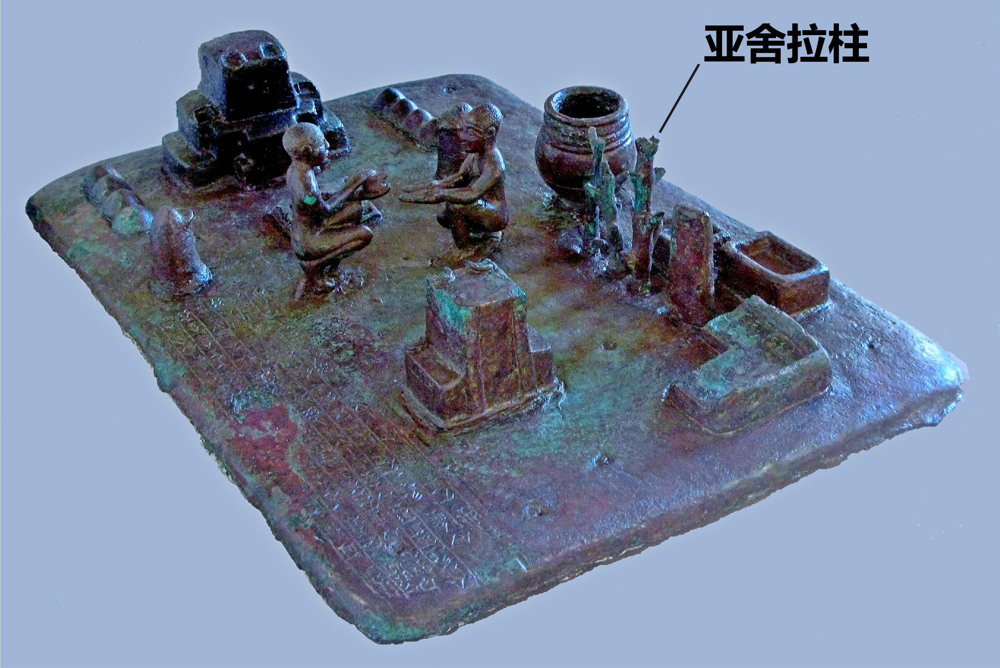

# Human-made Things in the Bible

## License Information

Human-made Things in the Bible © United Bible Societies, 2025. Adapted from: <cite>The Works of Their Hands: Man-made Things in the Bible</cite>, by Ray Pritz © 2009 United Bible Societies. This work is licensed under Creative Commons Attribution-ShareAlike 4.0 International (<a href="https://creativecommons.org/licenses/by-sa/4.0/">https://creativecommons.org/licenses/by-sa/4.0/</a>).

--------------------------------

## 标题：亚舍拉（Asherah） (id: REALIA:4.6.4)

4\.6\.4 标题：亚舍拉（Asherah）
=======================

经文出处
----

Hebrew 来：אֲשֵׁרָה (音译：’asherah)

[EXO 34:13](https://ref.ly/Exod34:13), [DEU 7:5](https://ref.ly/Deut7:5), [DEU 12:3](https://ref.ly/Deut12:3), [DEU 16:21](https://ref.ly/Deut16:21), [JDG 6:25](https://ref.ly/Judg6:25), [JDG 6:26](https://ref.ly/Judg6:26), [JDG 6:28](https://ref.ly/Judg6:28), [JDG 6:30](https://ref.ly/Judg6:30), [1KI 14:15](https://ref.ly/1Kgs14:15), [1KI 14:23](https://ref.ly/1Kgs14:23), [1KI 16:33](https://ref.ly/1Kgs16:33), [2KI 13:6](https://ref.ly/2Kgs13:6), [2KI 17:10](https://ref.ly/2Kgs17:10), [2KI 17:16](https://ref.ly/2Kgs17:16), [2KI 18:4](https://ref.ly/2Kgs18:4), [2KI 21:3](https://ref.ly/2Kgs21:3), [2KI 23:6](https://ref.ly/2Kgs23:6), [2KI 23:14](https://ref.ly/2Kgs23:14), [2KI 23:15](https://ref.ly/2Kgs23:15), [2CH 14:2](https://ref.ly/2Chr14:2), [2CH 17:6](https://ref.ly/2Chr17:6), [2CH 19:3](https://ref.ly/2Chr19:3), [2CH 24:18](https://ref.ly/2Chr24:18), [2CH 31:1](https://ref.ly/2Chr31:1), [2CH 33:3](https://ref.ly/2Chr33:3), [2CH 33:19](https://ref.ly/2Chr33:19), [2CH 34:4](https://ref.ly/2Chr34:4), [2CH 34:7](https://ref.ly/2Chr34:7), [ISA 17:8](https://ref.ly/Isa17:8), [ISA 27:9](https://ref.ly/Isa27:9), [JER 17:2](https://ref.ly/Jer17:2), [MIC 5:13](https://ref.ly/Mic5:13)

描述和用途
-----

*以拦出土的青铜模型，含亚舍拉柱 (© Louvre Museum, CC BY\-SA 2\.0, via Wikimedia Commons)*

亚舍拉是一根木头柱子，用来崇拜女神明亚舍拉。

---

翻译
--

亚舍拉被人当作众神之首的配偶（妻子）受到崇拜。它被视为众神之母，是丰饶的象征。

在旧约中，希伯来文*’asherah* 有时指女神明亚舍拉，有时指象征它的木柱。指亚舍拉的经文包括[JDG 3:7](https://ref.ly/Judg3:7); [1KI 15:13](https://ref.ly/1Kgs15:13); [1KI 18:19](https://ref.ly/1Kgs18:19); [2KI 21:7](https://ref.ly/2Kgs21:7); [2KI 23:4](https://ref.ly/2Kgs23:4); [2KI 23:7](https://ref.ly/2Kgs23:7); [2CH 15:16](https://ref.ly/2Chr15:16) 。在[1KI 15:13](https://ref.ly/1Kgs15:13) ，GNT (Good News Translation (1992)) 将“亚舍拉”扩展译为“丰饶女神亚舍拉”。当*’asherah* 一词指崇拜亚舍拉所用的木柱时，可以将其扩展译为“亚舍拉女神的像／偶像”。CEV (Contemporary English Version) 在[1KI 14:15](https://ref.ly/1Kgs14:15) 采用的扩展译法也是一个很好的范例，英文意为“用来崇拜亚舍拉女神的圣柱”。CEV (Contemporary English Version) 还附加了以下注释：“圣柱：或‘木头’，用来象征丰饶女神亚舍拉。”学者现在认为，亚舍拉并不是这个女神明的塑像或雕像，而是一根象征它的特别的木柱。因此，GNT (Good News Translation (1992)) 的英文意为“亚舍拉女神的象征”（参[EXO 34:13](https://ref.ly/Exod34:13); [DEU 16:21](https://ref.ly/Deut16:21) ）。

* **Associated Passages:** 出埃及记 34:13; 申命记 7:5; 申命记 12:3; 申命记 16:21; 士师记 6:25; 士师记 6:26; 士师记 6:28; 士师记 6:30; 列王纪上 14:15; 列王纪上 14:23; 列王纪上 16:33; 列王纪下 13:6; 列王纪下 17:10; 列王纪下 17:16; 列王纪下 18:4; 列王纪下 21:3; 列王纪下 23:6; 列王纪下 23:14; 列王纪下 23:15; 历代志下 14:2; 历代志下 17:6; 历代志下 19:3; 历代志下 24:18; 历代志下 31:1; 历代志下 33:3; 历代志下 33:19; 历代志下 34:4; 历代志下 34:7; 以赛亚书 17:8; 以赛亚书 27:9; 耶利米书 17:2; 弥迦书 5:13; 士师记 3:7; 列王纪上 15:13; 列王纪上 18:19; 列王纪下 21:7; 列王纪下 23:4; 列王纪下 23:7; 历代志下 15:16

* **Associated ACAI Concepts:** Asherah (ID: `deity:Asherah`); Sacred Pole (ID: `realia:SacredPole`)
