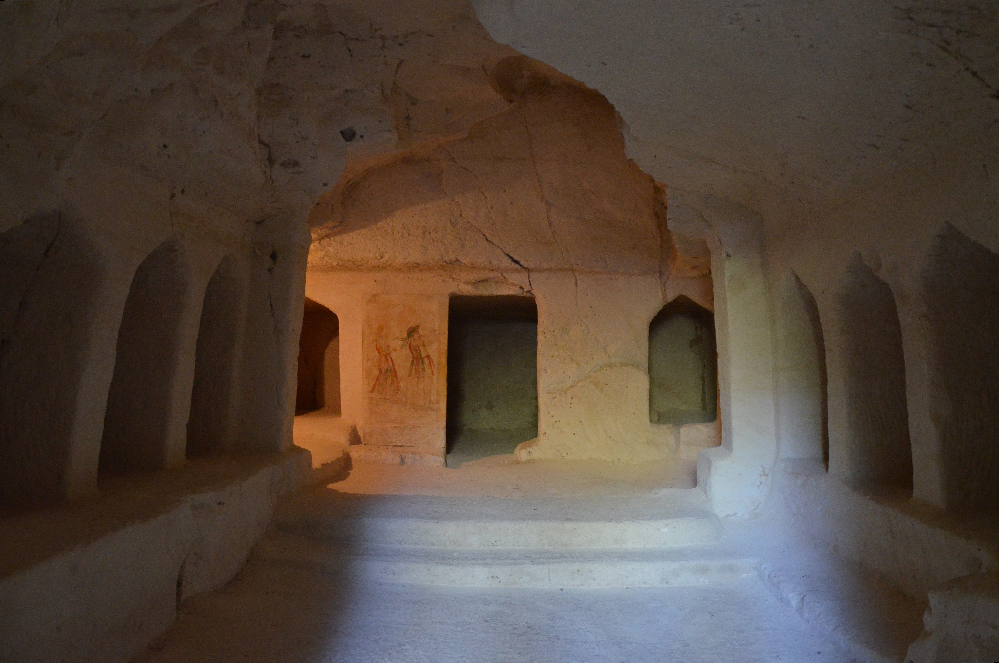

# Human-made Things in the Bible

## License Information

Human-made Things in the Bible © United Bible Societies, 2025. Adapted from: <cite>The Works of Their Hands: Man-made Things in the Bible</cite>, by Ray Pritz © 2009 United Bible Societies. This work is licensed under Creative Commons Attribution-ShareAlike 4.0 International (<a href="https://creativecommons.org/licenses/by-sa/4.0/">https://creativecommons.org/licenses/by-sa/4.0/</a>).

--------------------------------

## 标题：埋葬和服丧（burial and mourning） (id: REALIA:4.8)

4\.8 标题：埋葬和服丧（burial and mourning）
==================================

## 标题：坟墓、墓地（tomb, grave） (id: REALIA:4.8.1)

4\.8\.1 标题：坟墓、墓地（tomb, grave）
=============================

经文出处
----

Hebrew 来：בַּיִת (音译：bayith)

[ISA 14:18](https://ref.ly/Isa14:18)

Hebrew 来：גָּדִישׁ (音译：gadish)

[JOB 21:32](https://ref.ly/Job21:32)

Hebrew 来：צְרִיחַ (音译：tsriach)

[1SA 13:6](https://ref.ly/1Sam13:6)

Hebrew 来：קְבוּרָה (音译：qvurah)

[GEN 35:20](https://ref.ly/Gen35:20), [GEN 35:20](https://ref.ly/Gen35:20), [GEN 47:30](https://ref.ly/Gen47:30), [DEU 34:6](https://ref.ly/Deut34:6), [1SA 10:2](https://ref.ly/1Sam10:2), [2KI 9:28](https://ref.ly/2Kgs9:28), [2KI 21:26](https://ref.ly/2Kgs21:26), [2KI 23:30](https://ref.ly/2Kgs23:30), [2CH 26:23](https://ref.ly/2Chr26:23), [ECC 6:3](https://ref.ly/Eccl6:3), [ISA 14:20](https://ref.ly/Isa14:20), [JER 22:19](https://ref.ly/Jer22:19), [EZK 32:23](https://ref.ly/Ezek32:23), [EZK 32:24](https://ref.ly/Ezek32:24)

Hebrew 来：קֶבֶר (音译：qever)

[GEN 23:4](https://ref.ly/Gen23:4), [GEN 23:6](https://ref.ly/Gen23:6), [GEN 23:6](https://ref.ly/Gen23:6), [GEN 23:9](https://ref.ly/Gen23:9), [GEN 23:20](https://ref.ly/Gen23:20), [GEN 49:30](https://ref.ly/Gen49:30), [GEN 50:5](https://ref.ly/Gen50:5), [GEN 50:13](https://ref.ly/Gen50:13), [EXO 14:11](https://ref.ly/Exod14:11), [NUM 19:16](https://ref.ly/Num19:16), [NUM 19:18](https://ref.ly/Num19:18), [JDG 8:32](https://ref.ly/Judg8:32), [JDG 16:31](https://ref.ly/Judg16:31), [2SA 2:32](https://ref.ly/2Sam2:32), [2SA 3:32](https://ref.ly/2Sam3:32), [2SA 4:12](https://ref.ly/2Sam4:12), [2SA 17:23](https://ref.ly/2Sam17:23), [2SA 19:38](https://ref.ly/2Sam19:38), [2SA 21:14](https://ref.ly/2Sam21:14), [1KI 13:22](https://ref.ly/1Kgs13:22), [1KI 13:30](https://ref.ly/1Kgs13:30), [1KI 13:31](https://ref.ly/1Kgs13:31), [1KI 14:13](https://ref.ly/1Kgs14:13), [2KI 13:21](https://ref.ly/2Kgs13:21), [2KI 22:20](https://ref.ly/2Kgs22:20), [2KI 23:6](https://ref.ly/2Kgs23:6), [2KI 23:16](https://ref.ly/2Kgs23:16), [2KI 23:16](https://ref.ly/2Kgs23:16), [2KI 23:17](https://ref.ly/2Kgs23:17), [2CH 16:14](https://ref.ly/2Chr16:14), [2CH 21:20](https://ref.ly/2Chr21:20), [2CH 24:25](https://ref.ly/2Chr24:25), [2CH 28:27](https://ref.ly/2Chr28:27), [2CH 32:33](https://ref.ly/2Chr32:33), [2CH 34:4](https://ref.ly/2Chr34:4), [2CH 34:28](https://ref.ly/2Chr34:28), [2CH 35:24](https://ref.ly/2Chr35:24), [NEH 2:3](https://ref.ly/Neh2:3), [NEH 2:5](https://ref.ly/Neh2:5), [NEH 3:16](https://ref.ly/Neh3:16), [JOB 3:22](https://ref.ly/Job3:22), [JOB 5:26](https://ref.ly/Job5:26), [JOB 10:19](https://ref.ly/Job10:19), [JOB 17:1](https://ref.ly/Job17:1), [JOB 21:32](https://ref.ly/Job21:32), [PSA 5:10](https://ref.ly/Ps5:10), [PSA 88:6](https://ref.ly/Ps88:6), [PSA 88:12](https://ref.ly/Ps88:12), [ISA 14:19](https://ref.ly/Isa14:19), [ISA 22:16](https://ref.ly/Isa22:16), [ISA 22:16](https://ref.ly/Isa22:16), [ISA 53:9](https://ref.ly/Isa53:9), [ISA 65:4](https://ref.ly/Isa65:4), [JER 5:16](https://ref.ly/Jer5:16), [JER 8:1](https://ref.ly/Jer8:1), [JER 20:17](https://ref.ly/Jer20:17), [JER 26:23](https://ref.ly/Jer26:23), [EZK 32:22](https://ref.ly/Ezek32:22), [EZK 32:23](https://ref.ly/Ezek32:23), [EZK 32:25](https://ref.ly/Ezek32:25), [EZK 32:26](https://ref.ly/Ezek32:26), [EZK 37:12](https://ref.ly/Ezek37:12), [EZK 37:12](https://ref.ly/Ezek37:12), [EZK 37:13](https://ref.ly/Ezek37:13), [EZK 37:13](https://ref.ly/Ezek37:13), [EZK 39:11](https://ref.ly/Ezek39:11), [NAM 1:14](https://ref.ly/Nah1:14)

Greek 希：μνῆμα (音译：mnēma)

[MRK 5:5](https://ref.ly/Mark5:5), [LUK 8:27](https://ref.ly/Luke8:27), [LUK 23:53](https://ref.ly/Luke23:53), [LUK 24:1](https://ref.ly/Luke24:1), [ACT 2:29](https://ref.ly/Acts2:29), [ACT 7:16](https://ref.ly/Acts7:16), [REV 11:9](https://ref.ly/Rev11:9)

Greek 希：μνημεῖον (音译：mnēmeion)

[GEN 23:6](https://ref.ly/Gen23:6), [GEN 23:6](https://ref.ly/Gen23:6), [GEN 23:9](https://ref.ly/Gen23:9), [GEN 35:20](https://ref.ly/Gen35:20), [GEN 35:20](https://ref.ly/Gen35:20), [GEN 49:30](https://ref.ly/Gen49:30), [GEN 50:5](https://ref.ly/Gen50:5), [GEN 50:13](https://ref.ly/Gen50:13), [ISA 22:16](https://ref.ly/Isa22:16), [ISA 22:16](https://ref.ly/Isa22:16), [ISA 26:19](https://ref.ly/Isa26:19), [EZK 39:11](https://ref.ly/Ezek39:11), [MAT 8:28](https://ref.ly/Matt8:28), [MAT 23:29](https://ref.ly/Matt23:29), [MAT 27:52](https://ref.ly/Matt27:52), [MAT 27:53](https://ref.ly/Matt27:53), [MAT 27:60](https://ref.ly/Matt27:60), [MAT 27:60](https://ref.ly/Matt27:60), [MAT 28:8](https://ref.ly/Matt28:8), [MRK 5:2](https://ref.ly/Mark5:2), [MRK 6:29](https://ref.ly/Mark6:29), [MRK 15:46](https://ref.ly/Mark15:46), [MRK 15:46](https://ref.ly/Mark15:46), [MRK 16:2](https://ref.ly/Mark16:2), [MRK 16:3](https://ref.ly/Mark16:3), [MRK 16:5](https://ref.ly/Mark16:5), [MRK 16:8](https://ref.ly/Mark16:8), [LUK 11:44](https://ref.ly/Luke11:44), [LUK 11:47](https://ref.ly/Luke11:47), [LUK 23:55](https://ref.ly/Luke23:55), [LUK 24:2](https://ref.ly/Luke24:2), [LUK 24:9](https://ref.ly/Luke24:9), [LUK 24:12](https://ref.ly/Luke24:12), [LUK 24:22](https://ref.ly/Luke24:22), [LUK 24:24](https://ref.ly/Luke24:24), [JHN 5:28](https://ref.ly/John5:28), [JHN 11:17](https://ref.ly/John11:17), [JHN 11:31](https://ref.ly/John11:31), [JHN 11:38](https://ref.ly/John11:38), [JHN 12:17](https://ref.ly/John12:17), [JHN 19:41](https://ref.ly/John19:41), [JHN 19:42](https://ref.ly/John19:42), [JHN 20:1](https://ref.ly/John20:1), [JHN 20:1](https://ref.ly/John20:1), [JHN 20:2](https://ref.ly/John20:2), [JHN 20:3](https://ref.ly/John20:3), [JHN 20:4](https://ref.ly/John20:4), [JHN 20:6](https://ref.ly/John20:6), [JHN 20:8](https://ref.ly/John20:8), [JHN 20:11](https://ref.ly/John20:11), [JHN 20:11](https://ref.ly/John20:11), [ACT 13:29](https://ref.ly/Acts13:29), [WIS 10:7](https://ref.ly/Wis10:7)

Greek 希：τάφος (音译：tafos)

[MAT 23:27](https://ref.ly/Matt23:27), [MAT 23:29](https://ref.ly/Matt23:29), [MAT 27:61](https://ref.ly/Matt27:61), [MAT 27:64](https://ref.ly/Matt27:64), [MAT 27:66](https://ref.ly/Matt27:66), [MAT 28:1](https://ref.ly/Matt28:1), [ROM 3:13](https://ref.ly/Rom3:13), [TOB 4:4](https://ref.ly/Tob4:4), [TOB 4:17](https://ref.ly/Tob4:17), [TOB 6:15](https://ref.ly/Tob6:15), [TOB 8:10](https://ref.ly/Tob8:10), [TOB 8:18](https://ref.ly/Tob8:18), [WIS 19:3](https://ref.ly/Wis19:3), [SIR 30:18](https://ref.ly/Sir30:18), [1MA 2:70](https://ref.ly/1Macc2:70), [1MA 9:19](https://ref.ly/1Macc9:19), [1MA 13:27](https://ref.ly/1Macc13:27), [1MA 13:30](https://ref.ly/1Macc13:30), [2MA 5:10](https://ref.ly/2Macc5:10), [2MA 12:39](https://ref.ly/2Macc12:39), [3MA 6:31](https://ref.ly/3Macc6:31), [1ES 1:29](https://ref.ly/1Esd1:29)

Latin 拉：monumentum

[2ES 2:16](https://ref.ly/2Esd2:16)

Latin 拉：sepulchrum

[2ES 2:23](https://ref.ly/2Esd2:23), [2ES 5:35](https://ref.ly/2Esd5:35)

描述和用途
-----

*有多个壁龛的墓穴，壁画是男子吹笛和女子弹竖琴（贝特古夫林（Beit Guvrin）国家公园）。 (© Carole Raddato from FRANKFURT, Germany, CC BY\-SA 2\.0, via Wikimedia Commons)*

坟墓是为埋葬死者而建的。由于以色列大部分土地的表层土壤很少，特别是在丘陵地区，所以坟墓通常是在基岩上凿出来的。有时，天然洞穴也被用作坟墓。坟墓的入口用一块石头堵住（参[4\.8\.1\.1 封墓石 (stone for closing a tomb)\<REALIA:4\.8\.1\.1\>](#) ）。

---

翻译
--

死亡是普世共有的经验，所有语言和文化都有表达尸体处理方式的词语。在许多语言中，明确区分坟墓（地里埋葬尸体的坑）和墓室（建在地面之上，用来埋葬一具或多具尸体的建筑物）是很重要的。然而，在有些语境中，使用比较宽泛的表达可能更合适，例如“埋葬死人的地方”或“放置尸体的地方”。

有些经文用“坟墓”一词来象征死亡。翻译者应考虑经文是指实际的埋葬地点，还是指某人已经死亡的事实。对于后一种情况，最好使用表示“死亡”的词语，尤其是在诗歌体经文中。例如，[JOB 3:22](https://ref.ly/Job3:22) 的字面意为“他们寻见坟墓就快乐，极其欢喜”，但GNT (Good News Translation (1992)) 英文意为“他们直到死后被埋葬才会快乐”。[JOB 5:26](https://ref.ly/Job5:26) 的字面意为“你必寿高年迈才归坟墓”，但GNT (Good News Translation (1992)) 意为“你必活到寿数满足”。

有些经文提到的“坟墓”是复数形式，这时通常可以译成“墓地”（“graveyard”；GNT (Good News Translation (1992)) ；[JOB 21:32](https://ref.ly/Job21:32) ）、“坟场”等。

以色列社会上层人士的埋葬通常分为两个阶段。在第一阶段，尸体被放在墓室里的石台上，或放在一个英文称作“sarcophagus”（意为“食肉者”）的大箱子里。大约经过一年后，肉体腐烂了，骨头就被移到墓室里的一个特定位置。到了新约时期，骨头被放进一个尸骨罐里。这些习俗在希伯来文中产生了对死亡的两种委婉表达：“与他列祖同睡”和“归到他列祖那里”。在[2CH 16:14](https://ref.ly/2Chr16:14) ，犹大王亚撒的埋葬提到了放尸体的地方（希伯来文*mishkav* ）。有些译本将这个词译为“尸架”（“bier”；RSV (Revised Standard Version (1952)) 、NIV (New International Version (1984)) ；参[4\.8\.4 尸架、棺材 (bier, coffin)\<REALIA:4\.8\.4\>](#) ），但这节经文的结构表明，亚撒的尸体抬进墓室后被放在固定的位置，即墓室的石台上。NJPSV (New Jewish Publication Society Version) 译作“resting\-place”（“安息处”），更好地表达出经文原来的意思。

[1SA 13:6](https://ref.ly/1Sam13:6) ：这节经文中的希伯来文*tsrichim* 意思不确定。有些译本将其解作“墓室”（“tombs”；RSV (Revised Standard Version (1952)) 、CEV (Contemporary English Version) 、GECL (German Common Language Version (Gute Nachricht Bibel)) 、ITCL (Italian Common Language Version) ），这可能是在岩石上凿出来的洞穴。另一些译本使用了比较宽泛的词语，如“坑”（“pits”；GNT (Good News Translation (1992)) 、NIV (New International Version (1984)) ）或“地下室”（“vaults”；NJB (New Jerusalem Bible (1985)) ）。有些学者认为，这个词与[JDG 9:46](https://ref.ly/Judg9:46) 、[JDG 9:49](https://ref.ly/Judg9:49) 中一个意为“山寨”或“塔”的希伯来文词语有关联，但这个意思似乎不符合这里的语境。

在[MAT 23:29](https://ref.ly/Matt23:29) ，希腊文*mnēmeion* 也可解作为纪念逝者而建的纪念碑，在这里可译作“逝者纪念碑”；在[LUK 11:47](https://ref.ly/Luke11:47) 也是这个意思。[2ES 2:16](https://ref.ly/2Esd2:16) 中的拉丁文*monumentum* 也可以这样理解。

在[MRK 5:2](https://ref.ly/Mark5:2) ，翻译者要避免使用一个单单指坟墓的词语，因为那个被魔鬼所附的人并不是住在地底下的坟墓里，而是住在墓穴或建在地面上的墓室里。

* **Associated Passages:** 以赛亚书 14:18; 约伯记 21:32; 撒母耳记上 13:6; 创世记 35:20; 创世记 47:30; 申命记 34:6; 撒母耳记上 10:2; 列王纪下 9:28; 列王纪下 21:26; 列王纪下 23:30; 历代志下 26:23; 传道书 6:3; 以赛亚书 14:20; 耶利米书 22:19; 以西结书 32:23; 以西结书 32:24; 创世记 23:4; 创世记 23:6; 创世记 23:9; 创世记 23:20; 创世记 49:30; 创世记 50:5; 创世记 50:13; 出埃及记 14:11; 民数记 19:16; 民数记 19:18; 士师记 8:32; 士师记 16:31; 撒母耳记下 2:32; 撒母耳记下 3:32; 撒母耳记下 4:12; 撒母耳记下 17:23; 撒母耳记下 19:38; 撒母耳记下 21:14; 列王纪上 13:22; 列王纪上 13:30; 列王纪上 13:31; 列王纪上 14:13; 列王纪下 13:21; 列王纪下 22:20; 列王纪下 23:6; 列王纪下 23:16; 列王纪下 23:17; 历代志下 16:14; 历代志下 21:20; 历代志下 24:25; 历代志下 28:27; 历代志下 32:33; 历代志下 34:4; 历代志下 34:28; 历代志下 35:24; 尼希米记 2:3; 尼希米记 2:5; 尼希米记 3:16; 约伯记 3:22; 约伯记 5:26; 约伯记 10:19; 约伯记 17:1; 诗篇 5:10; 诗篇 88:6; 诗篇 88:12; 以赛亚书 14:19; 以赛亚书 22:16; 以赛亚书 53:9; 以赛亚书 65:4; 耶利米书 5:16; 耶利米书 8:1; 耶利米书 20:17; 耶利米书 26:23; 以西结书 32:22; 以西结书 32:25; 以西结书 32:26; 以西结书 37:12; 以西结书 37:13; 以西结书 39:11; 那鸿书 1:14; 马可福音 5:5; 路加福音 8:27; 路加福音 23:53; 路加福音 24:1; 使徒行传 2:29; 使徒行传 7:16; 启示录 11:9; 以赛亚书 26:19; 马太福音 8:28; 马太福音 23:29; 马太福音 27:52; 马太福音 27:53; 马太福音 27:60; 马太福音 28:8; 马可福音 5:2; 马可福音 6:29; 马可福音 15:46; 马可福音 16:2; 马可福音 16:3; 马可福音 16:5; 马可福音 16:8; 路加福音 11:44; 路加福音 11:47; 路加福音 23:55; 路加福音 24:2; 路加福音 24:9; 路加福音 24:12; 路加福音 24:22; 路加福音 24:24; 约翰福音 5:28; 约翰福音 11:17; 约翰福音 11:31; 约翰福音 11:38; 约翰福音 12:17; 约翰福音 19:41; 约翰福音 19:42; 约翰福音 20:1; 约翰福音 20:2; 约翰福音 20:3; 约翰福音 20:4; 约翰福音 20:6; 约翰福音 20:8; 约翰福音 20:11; 使徒行传 13:29; 智慧篇 10:7; 马太福音 23:27; 马太福音 27:61; 马太福音 27:64; 马太福音 27:66; 马太福音 28:1; 罗马书 3:13; 多俾亚传 4:4; 多俾亚传 4:17; 多俾亚传 6:15; 多俾亚传 8:10; 多俾亚传 8:18; 智慧篇 19:3; 德训篇 30:18; 玛加伯上 2:70; 玛加伯上 9:19; 玛加伯上 13:27; 玛加伯上 13:30; 玛加伯下 5:10; 玛加伯下 12:39; 玛加伯三书 6:31; 厄斯德拉上 1:29; 厄斯德拉下 2:16; 厄斯德拉下 2:23; 厄斯德拉下 5:35; 士师记 9:46; 士师记 9:49

* **Associated ACAI Concepts:** Grave (ID: `realia:Grave`)

## 标题：封墓石（stone for closing a tomb） (id: REALIA:4.8.1.1)

4\.8\.1\.1 标题：封墓石（stone for closing a tomb）
===========================================

经文出处
----

Greek 希：λίθος (音译：lithos)

[MAT 27:60](https://ref.ly/Matt27:60), [MAT 27:66](https://ref.ly/Matt27:66), [MAT 28:2](https://ref.ly/Matt28:2), [MRK 15:46](https://ref.ly/Mark15:46), [MRK 16:3](https://ref.ly/Mark16:3), [MRK 16:4](https://ref.ly/Mark16:4), [LUK 24:2](https://ref.ly/Luke24:2), [JHN 11:39](https://ref.ly/John11:39), [JHN 11:41](https://ref.ly/John11:41), [JHN 20:1](https://ref.ly/John20:1)

描述和用途
-----

*封堵墓穴入口的圆石 (© Ian Scott, CC BY\-SA 2\.0, via Wikimedia Commons)*

封墓石是一块又大又重的石头，用来封住用作坟墓的天然洞穴或者从岩石中凿出的墓穴的入口。

---

翻译
--

用石头封住坟墓有两种方法，福音书没有记载是用哪种方法封住了安葬耶稣的那个墓穴。一种方法是使用一块圆柱形的石头，放倒在一个与石头宽度相同的槽中，从侧面将石头滚到墓穴的洞口，将其封住。第二种方法是把石头沿着一个小斜坡滚到墓穴口；石头是球形的，沿着斜坡向下滚动，直到堵住墓穴的入口。

[JHN 11:39](https://ref.ly/John11:39); [JHN 11:39](https://ref.ly/John11:39); [JHN 11:41](https://ref.ly/John11:41) 记载，埋葬拉撒路的地方是一个洞穴，入口有石头挡着。[JHN 11:38](https://ref.ly/John11:38) 有一个含义模糊的希腊文短语，可译作“在入口处”（如GNT (Good News Translation (1992)) ）。这个短语可以是“在上面”的意思，此时坟墓的通道就是垂直的；另外也可以是“靠着”的意思，这样坟墓的通道就是水平的。解经家对此意见不一，但证据似乎更支持水平洞穴。无论是哪一种情况，石头的主要目的都是为了防止动物进入坟墓吞食尸体。GNT (Good News Translation (1992)) 英文意为“放在入口的石头”，然而最好译作“盖住洞口的石头”。注意，与埋葬耶稣的坟墓不同，这里没有说石头是“滚”到入口前面的。

* **Associated Passages:** 马太福音 27:60; 马太福音 27:66; 马太福音 28:2; 马可福音 15:46; 马可福音 16:3; 马可福音 16:4; 路加福音 24:2; 约翰福音 11:39; 约翰福音 11:41; 约翰福音 20:1; 约翰福音 11:38

## 标题：坟堆（burial mound） (id: REALIA:4.8.2)

4\.8\.2 标题：坟堆（burial mound）
===========================

经文出处
----

Greek 希：χειμών (音译：cheimōn)

[SIR 21:8](https://ref.ly/Sir21:8)

描述和用途
-----

*一堆石头有时会用来标志一个墓葬地点 (© ניסים טבקה Pikiwiki Israel, CC BY 2\.5, via Wikimedia Commons)*

坟堆是在埋葬尸体的地方堆起来的一堆石头，以标记埋葬的地点，并防止动物刨开地面吞吃尸体。

---

翻译
--

由于“坟堆”不过是坟墓的另一种形式，在[SIR 21:8](https://ref.ly/Sir21:8) ，GNT (Good News Translation (1992)) 直接将其译作“tomb”（“坟墓”）。这节经文有一个异文；有些抄本作“为冬天”，而不是“为他的坟堆”（RSV (Revised Standard Version (1952)) 直译）。大多数译本采用“坟墓”一词，并在脚注中列出另一种读文（如GNT (Good News Translation (1992)) ）。

* **Associated Passages:** 德训篇 21:8

## 标题：预备葬埋尸体（body preparation） (id: REALIA:4.8.3)

4\.8\.3 标题：预备葬埋尸体（body preparation）
===================================

裹尸布、寿衣：参[1\.5\.3\.7 麻、亚麻、细麻布 (linen)\<REALIA:1\.5\.3\.7\>](#) 。
---------------------------------------------------------------

## 标题：防腐油、香膏（embalming oils） (id: REALIA:4.8.3.1)

4\.8\.3\.1 标题：防腐油、香膏（embalming oils）
====================================

经文出处
----

Greek 希：ἀλόη (音译：aloē)

[JHN 19:39](https://ref.ly/John19:39)

Greek 希：ἄρωμα (音译：arōma)

[MRK 16:1](https://ref.ly/Mark16:1), [LUK 23:56](https://ref.ly/Luke23:56), [LUK 24:1](https://ref.ly/Luke24:1), [JHN 19:40](https://ref.ly/John19:40)

Greek 希：μύρον (音译：muron)

[LUK 23:56](https://ref.ly/Luke23:56)

Greek 希：σμύρνα (音译：smurna)

[JHN 19:39](https://ref.ly/John19:39)

描述和用途
-----

防腐油是一种芳香的膏油或药膏，特别用来处理尸体，使尸体得以保存较长的时间。另参[10\.6\.1\.1 没药 (myrrh)\<REALIA:10\.6\.1\.1\>](#) 。

---

翻译
--

在[2CH 16:14](https://ref.ly/2Chr16:14) ，我们看到*bsamim uznim mruqachim* 这个希伯来文语句出现在犹大王亚撒下葬的语境中，经文说墓室里放着香料和香膏（“墓室里装满了香料和香膏”，CEV (Contemporary English Version) 直译）。尽管GNT (Good News Translation (1992)) 英文意为“他们用香料和香膏来预备安葬亚撒的尸体”，但没有理由认为亚撒的尸体（像[GEN 50:2](https://ref.ly/Gen50:2); [GEN 50:3](https://ref.ly/Gen50:3) 所述雅各的尸体那样）进行了防腐处理。

在[LUK 23:56](https://ref.ly/Luke23:56) ，翻译者可以使用描述性短语来翻译希腊文*muron* ，例如“用来保存尸体的香膏”，或“用来防止尸体腐烂的香膏”。

新约提到防腐香膏的原料是“没药”（希腊文*smurna* ）和“沉香”（希腊文*aloē* ）。大多数翻译者会借用这些原料的术语，然后用旁注来解释这些物质的作用。

* **Associated Passages:** 约翰福音 19:39; 马可福音 16:1; 路加福音 23:56; 路加福音 24:1; 约翰福音 19:40; 历代志下 16:14; 创世记 50:2; 创世记 50:3

* **Associated ACAI Concepts:** Aloes (ID: `realia:Aloes`)

## 标题：尸架、棺材（bier, coffin） (id: REALIA:4.8.4)

4\.8\.4 标题：尸架、棺材（bier, coffin）
==============================

经文出处
----

Hebrew 来：אֲרוֹן (音译：’aron)

[GEN 50:26](https://ref.ly/Gen50:26)

Hebrew 来：מִטָּה (音译：mitah)

[2SA 3:31](https://ref.ly/2Sam3:31)

Greek 希：σορός (音译：soros)

[LUK 7:14](https://ref.ly/Luke7:14)

描述和用途
-----

*橄榄山主泣教堂（Dominus Flevit）花园中的石棺或骨灰盒 (© Deror Avi, CC BY\-SA 3\.0, via Wikimedia Commons)*

尸架是用来将尸体抬到埋葬地点的一块板，棺材是放置尸体以备埋葬的盒子。

---

翻译
--

在[GEN 50:26](https://ref.ly/Gen50:26) ，希伯来文*’aron* 字面意为“盒子”，但在这个语境中是指“棺材”。

在[2SA 3:31](https://ref.ly/2Sam3:31) ，希伯来文*mitah* 字面意为“床”。然而，这里的上下文清楚表明这个物件被用作尸架，甚至有可能是棺材。

[LUK 7:14](https://ref.ly/Luke7:14) ：有些译本将这节经文中的希腊文*soros* 译作“棺材”（“coffin”；GNT (Good News Translation (1992)) 、NCV (New Century Version) ）。这个词也可以指“尸架”，并且更可能是它在这里的意思。在有些语言中，翻译者可能需要采用描述性的语句，例如“抬尸体的板”或“安放尸体的盒子”。

* **Associated Passages:** 创世记 50:26; 撒母耳记下 3:31; 路加福音 7:14

* **Associated ACAI Concepts:** Bier (ID: `realia:Bier`)

## 标题：麻布、麻衣、丧服（sackcloth, mourning clothes） (id: REALIA:4.8.5)

4\.8\.5 标题：麻布、麻衣、丧服（sackcloth, mourning clothes）
================================================

经文出处
----

Hebrew 来：בֶּגֶד, אֵבֶל (音译：bigdey ’evel)

[2SA 14:2](https://ref.ly/2Sam14:2)

Hebrew 来：שַׂק (音译：saq)

[GEN 37:34](https://ref.ly/Gen37:34), [2SA 3:31](https://ref.ly/2Sam3:31), [2SA 21:10](https://ref.ly/2Sam21:10), [1KI 20:31](https://ref.ly/1Kgs20:31), [1KI 20:32](https://ref.ly/1Kgs20:32), [1KI 21:27](https://ref.ly/1Kgs21:27), [1KI 21:27](https://ref.ly/1Kgs21:27), [2KI 6:30](https://ref.ly/2Kgs6:30), [2KI 19:1](https://ref.ly/2Kgs19:1), [2KI 19:2](https://ref.ly/2Kgs19:2), [1CH 21:16](https://ref.ly/1Chr21:16), [NEH 9:1](https://ref.ly/Neh9:1), [EST 4:1](https://ref.ly/Esth4:1), [EST 4:2](https://ref.ly/Esth4:2), [EST 4:3](https://ref.ly/Esth4:3), [EST 4:4](https://ref.ly/Esth4:4), [JOB 16:15](https://ref.ly/Job16:15), [PSA 30:12](https://ref.ly/Ps30:12), [PSA 35:13](https://ref.ly/Ps35:13), [PSA 69:12](https://ref.ly/Ps69:12), [ISA 3:24](https://ref.ly/Isa3:24), [ISA 15:3](https://ref.ly/Isa15:3), [ISA 20:2](https://ref.ly/Isa20:2), [ISA 22:12](https://ref.ly/Isa22:12), [ISA 37:1](https://ref.ly/Isa37:1), [ISA 37:2](https://ref.ly/Isa37:2), [ISA 50:3](https://ref.ly/Isa50:3), [ISA 58:5](https://ref.ly/Isa58:5), [JER 4:8](https://ref.ly/Jer4:8), [JER 6:26](https://ref.ly/Jer6:26), [JER 48:37](https://ref.ly/Jer48:37), [JER 49:3](https://ref.ly/Jer49:3), [LAM 2:10](https://ref.ly/Lam2:10), [EZK 7:18](https://ref.ly/Ezek7:18), [EZK 27:31](https://ref.ly/Ezek27:31), [DAN 9:3](https://ref.ly/Dan9:3), [JOL 1:8](https://ref.ly/Joel1:8), [JOL 1:13](https://ref.ly/Joel1:13), [AMO 8:10](https://ref.ly/Amos8:10), [JON 3:5](https://ref.ly/Jonah3:5), [JON 3:6](https://ref.ly/Jonah3:6), [JON 3:8](https://ref.ly/Jonah3:8)

Greek 希：σάκκος (音译：sakkos)

[MAT 11:21](https://ref.ly/Matt11:21), [LUK 10:13](https://ref.ly/Luke10:13), [REV 6:12](https://ref.ly/Rev6:12), [REV 11:3](https://ref.ly/Rev11:3), [JDT 4:10](https://ref.ly/Jdt4:10), [JDT 4:11](https://ref.ly/Jdt4:11), [JDT 4:12](https://ref.ly/Jdt4:12), [JDT 4:14](https://ref.ly/Jdt4:14), [JDT 8:5](https://ref.ly/Jdt8:5), [JDT 9:1](https://ref.ly/Jdt9:1), [JDT 10:3](https://ref.ly/Jdt10:3), [ESG 4:1](https://ref.ly/EsthGr4:1), [ESG 4:2](https://ref.ly/EsthGr4:2), [ESG 4:3](https://ref.ly/EsthGr4:3), [ESG 4:4](https://ref.ly/EsthGr4:4), [BAR 4:20](https://ref.ly/Bar4:20), [1MA 2:14](https://ref.ly/1Macc2:14), [1MA 3:47](https://ref.ly/1Macc3:47), [2MA 3:19](https://ref.ly/2Macc3:19), [2MA 10:25](https://ref.ly/2Macc10:25)

Latin 拉：saccus

[2ES 16:2](https://ref.ly/2Esd16:2)

描述和用途
-----

麻布是一种粗糙的深色布料，用山羊毛或骆驼毛制成。人们贴身穿着麻布衣，表示哀悼或悔改（[2KI 6:30](https://ref.ly/2Kgs6:30) ）。

---

翻译
--

不同文化的服丧习俗千差万别，在有些文化中，穿什么或不穿什么并不重要。在大多数语言中，“麻布”可描述为“粗布”，有时也可描述为“厚布”。一般来说，最好明确指出这些衣服和哀悼之间的关系，例如说“表示某人为哀悼死者而穿的衣服”。

有些文化可能存在与以色列人服丧相似的哀悼行为，如涂画身体，在脸上或胸前抹灰，背着包裹之类的东西（象征一个贫困寡妇的哀悼），或在脖子上戴一根哀悼绳。这种文化对等翻译既有优点也有危险，因为以色列文化的某些特殊方面丢失了，而当地习俗可能会有我们想要避免的含意。如果采取文化对等翻译，那么译文的所有隐含意思都要仔细审查。一般来说，最好译出以色列人的习俗，并在脚注中解释其含义或说明相应的习俗。脚注可以是：“丧服是用山羊毛或骆驼毛织成的粗布缝制而成的。”

[2SA 14:2](https://ref.ly/2Sam14:2) 没有明确说是麻衣，但使用了“丧服”一词。撕裂外袍以示绝望或悲伤是犹太人的习俗之一。然而，这节经文所表达的不仅仅是撕裂衣服。对于字面意为“穿上丧服”的这个分句，CEV (Contemporary English Version) 和NCV (New Century Version) 英文意为“穿上葬礼的衣服”。如果目标语言的文化没有特别的习俗，或者已知的习俗不适合这个故事的语境，那么可将这个分句扩展译为：“穿上特别的衣服，让大卫以为你因为某人死去而难过。”

[JOB 16:15](https://ref.ly/Job16:15) ：这节经文的前半部分字面意为，“我把麻布缝在皮肤上”（RSV (Revised Standard Version (1952)) 同）。这可能表示约伯要长期穿着麻衣，或者他贴身穿着麻衣。GNT (Good News Translation (1992)) 英文意为“我哀悼并身穿麻衣”，没有表达上述任何一种意思。然而，GECL (German Common Language Version (Gute Nachricht Bibel)) 意为“丧服是我的第二层皮肤”，暗示约伯一直穿着丧服。这句话可译作：“我把丧服穿在身上”、“我给自己穿上居丧之人所穿的衣服”，或“我穿上居丧之人穿着的粗布衣”。

在有些经文中，穿麻衣并不是为了哀悼死者，而是表示忧伤痛悔。参[ISA 58:5](https://ref.ly/Isa58:5); [DAN 9:3](https://ref.ly/Dan9:3); [JON 3:6](https://ref.ly/Jonah3:6) 等例。

[MAT 11:21](https://ref.ly/Matt11:21) ：这节经文最后一部分的字面意为“他们早已披麻蒙灰悔改了”（RSV (Revised Standard Version (1952)) 同；另参[LUK 10:13](https://ref.ly/Luke10:13) ）。有些译本没有提及“披麻蒙灰”，而是直接译作：“他们早就向众人表明他们已从罪中回转了。”然而，翻译者应尽量保留经文中这些特有的文化行为，因为这些行为是圣经文化的一个常见现象。

* **Associated Passages:** 撒母耳记下 14:2; 创世记 37:34; 撒母耳记下 3:31; 撒母耳记下 21:10; 列王纪上 20:31; 列王纪上 20:32; 列王纪上 21:27; 列王纪下 6:30; 列王纪下 19:1; 列王纪下 19:2; 历代志上 21:16; 尼希米记 9:1; 以斯帖记 4:1; 以斯帖记 4:2; 以斯帖记 4:3; 以斯帖记 4:4; 约伯记 16:15; 诗篇 30:12; 诗篇 35:13; 诗篇 69:12; 以赛亚书 3:24; 以赛亚书 15:3; 以赛亚书 20:2; 以赛亚书 22:12; 以赛亚书 37:1; 以赛亚书 37:2; 以赛亚书 50:3; 以赛亚书 58:5; 耶利米书 4:8; 耶利米书 6:26; 耶利米书 48:37; 耶利米书 49:3; 耶利米哀歌 2:10; 以西结书 7:18; 以西结书 27:31; 但以理书 9:3; 约珥书 1:8; 约珥书 1:13; 阿摩司书 8:10; 约拿书 3:5; 约拿书 3:6; 约拿书 3:8; 马太福音 11:21; 路加福音 10:13; 启示录 6:12; 启示录 11:3; 友弟德传 4:10; 友弟德传 4:11; 友弟德传 4:12; 友弟德传 4:14; 友弟德传 8:5; 友弟德传 9:1; 友弟德传 10:3; 以斯帖记补篇 4:1; 以斯帖记补篇 4:2; 以斯帖记补篇 4:3; 以斯帖记补篇 4:4; 巴路克 4:20; 玛加伯上 2:14; 玛加伯上 3:47; 玛加伯下 3:19; 玛加伯下 10:25; 厄斯德拉下 16:2

* **Associated ACAI Concepts:** Sackcloth (ID: `realia:Sackcloth`)
