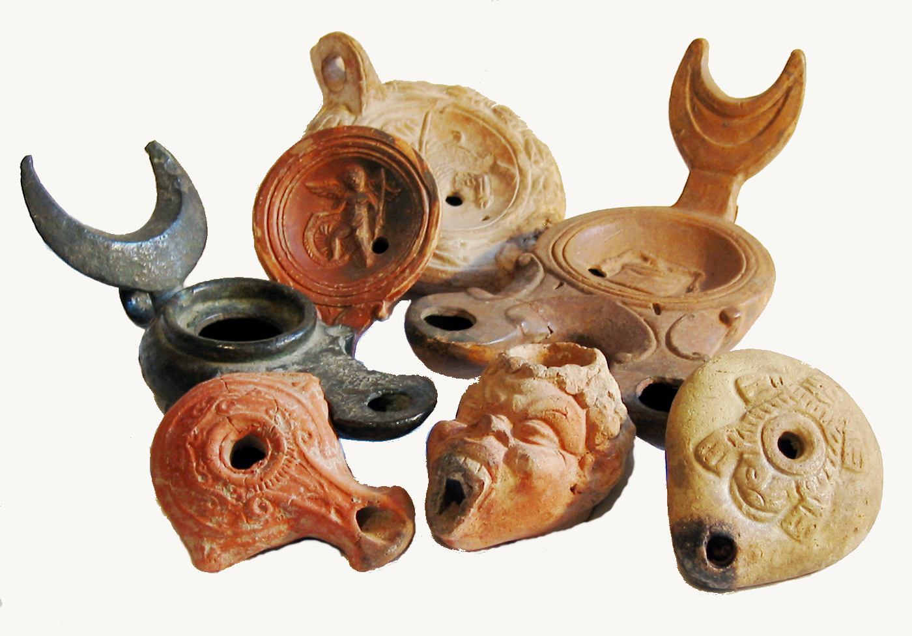

# Human-made Things in the Bible

## License Information

Human-made Things in the Bible © United Bible Societies, 2025. Adapted from: <cite>The Works of Their Hands: Man-made Things in the Bible</cite>, by Ray Pritz © 2009 United Bible Societies. This work is licensed under Creative Commons Attribution-ShareAlike 4.0 International (<a href="https://creativecommons.org/licenses/by-sa/4.0/">https://creativecommons.org/licenses/by-sa/4.0/</a>).

--------------------------------

## 标题：油灯和灯心（Oil lamp and wick） (id: REALIA:5.1)

5\.1 标题：油灯和灯心（Oil lamp and wick）
================================

经文出处
----

Hebrew 来：מָאוֹר (音译：ma’or)

[EXO 25:6](https://ref.ly/Exod25:6), [EXO 27:20](https://ref.ly/Exod27:20), [EXO 35:8](https://ref.ly/Exod35:8), [EXO 35:14](https://ref.ly/Exod35:14), [EXO 35:14](https://ref.ly/Exod35:14), [EXO 35:28](https://ref.ly/Exod35:28), [EXO 39:37](https://ref.ly/Exod39:37), [LEV 24:2](https://ref.ly/Lev24:2), [NUM 4:9](https://ref.ly/Num4:9), [NUM 4:16](https://ref.ly/Num4:16)

Hebrew 来：נִיר (音译：nir)

[1KI 11:36](https://ref.ly/1Kgs11:36), [1KI 15:4](https://ref.ly/1Kgs15:4), [2KI 8:19](https://ref.ly/2Kgs8:19), [2CH 21:7](https://ref.ly/2Chr21:7), [PRO 21:4](https://ref.ly/Prov21:4)

Hebrew 来：נֵר (音译：ner)

[EXO 25:37](https://ref.ly/Exod25:37), [EXO 25:37](https://ref.ly/Exod25:37), [EXO 27:20](https://ref.ly/Exod27:20), [EXO 30:7](https://ref.ly/Exod30:7), [EXO 30:8](https://ref.ly/Exod30:8), [EXO 35:14](https://ref.ly/Exod35:14), [EXO 37:23](https://ref.ly/Exod37:23), [EXO 39:37](https://ref.ly/Exod39:37), [EXO 39:37](https://ref.ly/Exod39:37), [EXO 40:4](https://ref.ly/Exod40:4), [EXO 40:25](https://ref.ly/Exod40:25), [LEV 24:2](https://ref.ly/Lev24:2), [LEV 24:4](https://ref.ly/Lev24:4), [NUM 4:9](https://ref.ly/Num4:9), [NUM 8:2](https://ref.ly/Num8:2), [NUM 8:2](https://ref.ly/Num8:2), [NUM 8:3](https://ref.ly/Num8:3), [1SA 3:3](https://ref.ly/1Sam3:3), [2SA 21:17](https://ref.ly/2Sam21:17), [2SA 22:29](https://ref.ly/2Sam22:29), [1KI 7:49](https://ref.ly/1Kgs7:49), [1CH 28:15](https://ref.ly/1Chr28:15), [1CH 28:15](https://ref.ly/1Chr28:15), [1CH 28:15](https://ref.ly/1Chr28:15), [2CH 4:20](https://ref.ly/2Chr4:20), [2CH 4:21](https://ref.ly/2Chr4:21), [2CH 13:11](https://ref.ly/2Chr13:11), [2CH 29:7](https://ref.ly/2Chr29:7), [JOB 18:6](https://ref.ly/Job18:6), [JOB 21:17](https://ref.ly/Job21:17), [JOB 29:3](https://ref.ly/Job29:3), [PSA 18:29](https://ref.ly/Ps18:29), [PSA 119:105](https://ref.ly/Ps119:105), [PSA 132:17](https://ref.ly/Ps132:17), [PRO 6:23](https://ref.ly/Prov6:23), [PRO 13:9](https://ref.ly/Prov13:9), [PRO 20:20](https://ref.ly/Prov20:20), [PRO 20:27](https://ref.ly/Prov20:27), [PRO 24:20](https://ref.ly/Prov24:20), [PRO 31:18](https://ref.ly/Prov31:18), [JER 25:10](https://ref.ly/Jer25:10), [ZEP 1:12](https://ref.ly/Zeph1:12), [ZEC 4:2](https://ref.ly/Zech4:2), [ZEC 4:2](https://ref.ly/Zech4:2)

Greek 希：λύχνος (音译：luchnos)

[MAT 5:15](https://ref.ly/Matt5:15), [MAT 6:22](https://ref.ly/Matt6:22), [MRK 4:21](https://ref.ly/Mark4:21), [LUK 8:16](https://ref.ly/Luke8:16), [LUK 11:34](https://ref.ly/Luke11:34), [LUK 11:36](https://ref.ly/Luke11:36), [LUK 12:35](https://ref.ly/Luke12:35), [LUK 15:8](https://ref.ly/Luke15:8), [JHN 5:35](https://ref.ly/John5:35), [2PE 1:19](https://ref.ly/2Pet1:19), [REV 18:23](https://ref.ly/Rev18:23), [REV 21:23](https://ref.ly/Rev21:23), [REV 22:5](https://ref.ly/Rev22:5), [SIR 26:17](https://ref.ly/Sir26:17), [LJE 1:18](https://ref.ly/EpJer1:18), [1MA 4:50](https://ref.ly/1Macc4:50), [2MA 1:8](https://ref.ly/2Macc1:8), [2MA 10:3](https://ref.ly/2Macc10:3)

Latin 拉：lucerna

[2ES 12:42](https://ref.ly/2Esd12:42), [2ES 14:25](https://ref.ly/2Esd14:25)

Latin 拉：lumen

[2ES 10:2](https://ref.ly/2Esd10:2)

经文出处
----

### **灯心** ：

Hebrew 来：פִּשְׁתָּה (音译：pishtah)

[ISA 42:3](https://ref.ly/Isa42:3), [ISA 43:17](https://ref.ly/Isa43:17)

Greek 希：λίνον (音译：linon)

[MAT 12:20](https://ref.ly/Matt12:20)

描述
--

*油灯，罗马时期 (© Combirom2 Wikimedia Commons)*

油灯是一种照明工具，在一个较小的容器中装着灯油，里面浸着一根灯心，灯心燃烧就发出光来。容器呈椭圆形，通常由黏土制成。油灯大小不一，家用油灯的尺寸通常约为13×8×4厘米（5×3×1\.5英寸）。油灯有几种样式，其中一种是装着油的浅盘子，油上面漂着一根灯心。另外一种尺寸差不多，然而是封闭式的，油不会洒出来，便于携带。这种油灯的顶部有两个孔，小孔用来插灯心，大孔用来添油。灯心通常由亚麻线做成。

---

用途
--

*罗马时期油灯 (© Davidbena, CC BY\-SA 4\.0, via Wikimedia Commons)*

灯身里面盛满油，灯心浸在油里面。灯心会烧焦，因此需要定期修剪。油灯的照明面积很小。根据油的品质和灯心的质地及长短，油灯发出的光和烟也不同。橄榄油是最常用的灯油，但在很早的时候，人们也使用鱼油。（关于橄榄油的其他用途，另参[1\.10\.5 膏油 (anointing oil)\<REALIA:1\.10\.5\>](#) 、[1\.15\.1 油、油膏 (oil, ointment)\<REALIA:1\.15\.1\>](#) 和[9\.3 橄榄油 (olive oil)\<REALIA:9\.3\>](#) 。）

---

翻译
--

在有些语言中，与“油灯”最接近的对等词是“煤油灯”。翻译者应避免使用表示手电筒或任何电灯的词语，因为这是严重的时代错误。可以译为“灯笼”或“灯”。蜡烛也是一个合适的文化对等物，其原理与油灯相同，只是燃烧的是固态物，不是油。蜡烛虽然没有在圣经中提到过，但在古代就已经有了。

“灯”的作用是发光，因此在经文中有时用作比喻。希伯来文*nir* 和希腊文*lucerna* 在相关经文中都是作为比喻使用。希伯来文*ner* 用来喻指以色列的王（[2SA 21:17](https://ref.ly/2Sam21:17) ）、上帝，或者与上帝相关的一些事物，例如他的保护、引领、祝福或话语（[2SA 22:29](https://ref.ly/2Sam22:29) ；[JOB 21:17](https://ref.ly/Job21:17) ；[PSA 18:29](https://ref.ly/Ps18:29) ［《和》18:28］，[PSA 119:105](https://ref.ly/Ps119:105) ；[PRO 6:23](https://ref.ly/Prov6:23) ）、生或死（生命的熄灭；[JOB 18:6](https://ref.ly/Job18:6) ，[JOB 21:17](https://ref.ly/Job21:17) ；[PSA 132:17](https://ref.ly/Ps132:17) ；[PRO 13:9](https://ref.ly/Prov13:9) ，[PRO 20:20](https://ref.ly/Prov20:20) ，[PRO 24:20](https://ref.ly/Prov24:20) ）、人的灵（[PRO 20:27](https://ref.ly/Prov20:27) ）、平安或正常状态（[JER 25:10](https://ref.ly/Jer25:10) ），以及彻底（[ZEP 1:12](https://ref.ly/Zeph1:12) ）。希腊文*luchnos* 喻指人的领悟（[MAT 6:22](https://ref.ly/Matt6:22) ；[LUK 11:34](https://ref.ly/Luke11:34) ，[LUK 11:36](https://ref.ly/Luke11:36) ）、准备就绪（[LUK 12:35](https://ref.ly/Luke12:35) ）、先知的声音（[JHN 5:35](https://ref.ly/John5:35) ），以及人的面容（[SIR 26:17](https://ref.ly/Sir26:17) ）。

“灯”经常用来比喻人的生命；例如，RSV (Revised Standard Version (1952)) 在[JOB 21:17](https://ref.ly/Job21:17) 的英文意为，“恶人的灯有多少次熄灭过？”《〈约伯记〉手册》（*A Handbook on The Book of Job* ，第398页）指出，这行经文说的是早逝或意外死亡。

在一些经文中，灯发出亮光喻指人在生活中经历上帝的引领，通常是藉着他的话语。[PSA 119:105](https://ref.ly/Ps119:105) 就是一个例子，NIV (New International Version (1984)) 在这一节的英文意为，“你的话是我脚前的灯，是我路上的光。”

有些时候，虽然翻译者会认同某段经文是比喻性的，但关于比喻的确切内容是什么，他们却并不一定能够达成一致意见；例如，关于[JOB 29:3](https://ref.ly/Job29:3) 中的灯喻指什么，GNT (Good News Translation (1992)) 和GECL (German Common Language Version (Gute Nachricht Bibel)) 的理解就不一样。这行经文的原文字面意思是，“当他的灯照在我的头上”（如RSV (Revised Standard Version (1952)) ），GNT (Good News Translation (1992)) 英文意为“那时上帝一直与我同在”，而GECL (German Common Language Version (Gute Nachricht Bibel)) 则为“他每日都赐我以顺遂”。

关于[JER 25:10](https://ref.ly/Jer25:10) ，参[5\.10 磨、磨石、磨盘 (millstones, mill)\<REALIA:5\.10\>](#) 中的注解。

在翻译[ISA 42:3](https://ref.ly/Isa42:3) 中的希伯来文*pishtah* 时，比较正式的译本直译为“灯心”；例如，RSV (Revised Standard Version (1952)) 英文意为“微明的灯心，他不熄灭”。通俗译本通常会避免使用这种大众不容易理解的字面翻译，以下是几个很好的范例：“他必不吹灭摇曳的灯盏”（GNT (Good News Translation (1992)) 直译），“他不会扑灭将灭的火苗”（CEV (Contemporary English Version) 直译），“即使是微弱的火苗，他也必不熄灭”（NCV (New Century Version) 直译）。如果翻译者希望保留灯心的比喻，可以将这个词译为“小布条”。

* **Associated Passages:** 出埃及记 25:6; 出埃及记 27:20; 出埃及记 35:8; 出埃及记 35:14; 出埃及记 35:28; 出埃及记 39:37; 利未记 24:2; 民数记 4:9; 民数记 4:16; 列王纪上 11:36; 列王纪上 15:4; 列王纪下 8:19; 历代志下 21:7; 箴言 21:4; 出埃及记 25:37; 出埃及记 30:7; 出埃及记 30:8; 出埃及记 37:23; 出埃及记 40:4; 出埃及记 40:25; 利未记 24:4; 民数记 8:2; 民数记 8:3; 撒母耳记上 3:3; 撒母耳记下 21:17; 撒母耳记下 22:29; 列王纪上 7:49; 历代志上 28:15; 历代志下 4:20; 历代志下 4:21; 历代志下 13:11; 历代志下 29:7; 约伯记 18:6; 约伯记 21:17; 约伯记 29:3; 诗篇 18:29; 诗篇 119:105; 诗篇 132:17; 箴言 6:23; 箴言 13:9; 箴言 20:20; 箴言 20:27; 箴言 24:20; 箴言 31:18; 耶利米书 25:10; 西番雅书 1:12; 撒迦利亚书 4:2; 马太福音 5:15; 马太福音 6:22; 马可福音 4:21; 路加福音 8:16; 路加福音 11:34; 路加福音 11:36; 路加福音 12:35; 路加福音 15:8; 约翰福音 5:35; 彼得后书 1:19; 启示录 18:23; 启示录 21:23; 启示录 22:5; 德训篇 26:17; 耶利米书信 1:18; 玛加伯上 4:50; 玛加伯下 1:8; 玛加伯下 10:3; 厄斯德拉下 12:42; 厄斯德拉下 14:25; 厄斯德拉下 10:2; 以赛亚书 42:3; 以赛亚书 43:17; 马太福音 12:20

