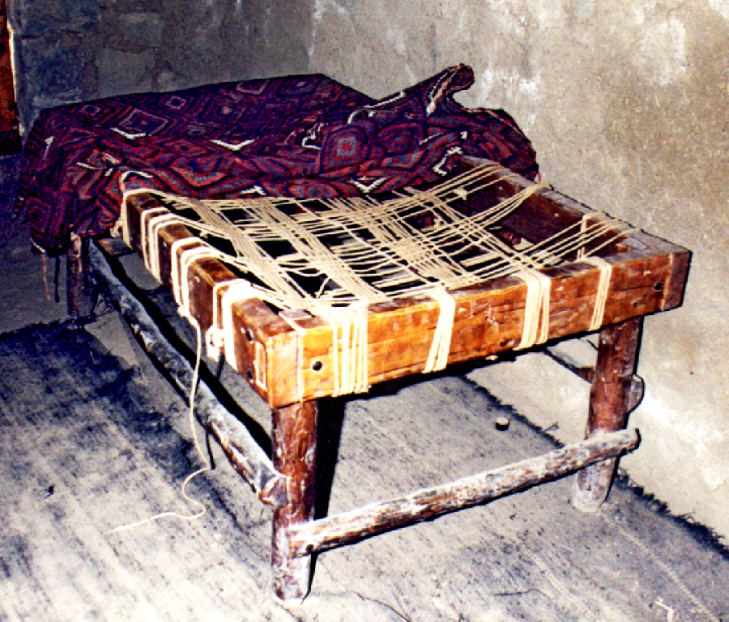
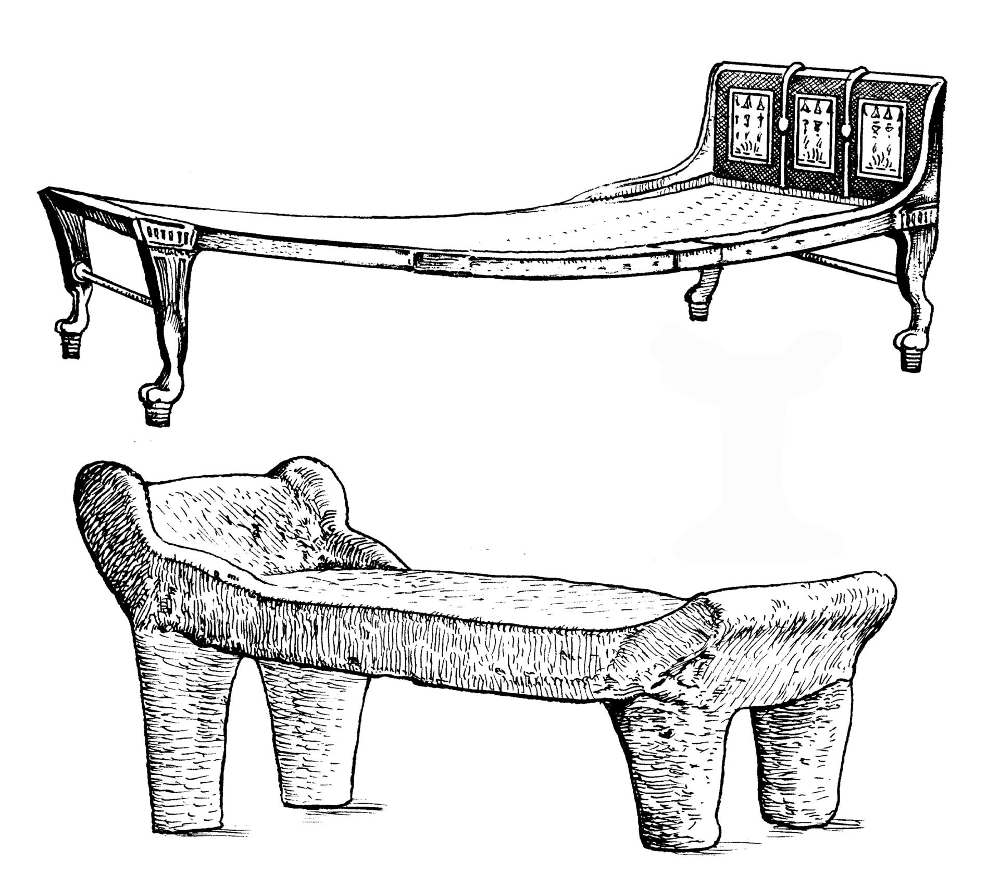

# Human-made Things in the Bible

## License Information

Human-made Things in the Bible © United Bible Societies, 2025. Adapted from: <cite>The Works of Their Hands: Man-made Things in the Bible</cite>, by Ray Pritz © 2009 United Bible Societies. This work is licensed under Creative Commons Attribution-ShareAlike 4.0 International (<a href="https://creativecommons.org/licenses/by-sa/4.0/">https://creativecommons.org/licenses/by-sa/4.0/</a>).

--------------------------------

## 标题：床、褥子（bed, sleeping mat） (id: REALIA:5.5)

5\.5 标题：床、褥子（bed, sleeping mat）
===============================

经文出处
----

Hebrew 来：יָצוּעַ (音译：yatsu‘a)

[GEN 49:4](https://ref.ly/Gen49:4), [1CH 5:1](https://ref.ly/1Chr5:1), [JOB 17:13](https://ref.ly/Job17:13), [PSA 63:7](https://ref.ly/Ps63:7), [PSA 132:3](https://ref.ly/Ps132:3)

Hebrew 来：מִטָּה (音译：mitah)

[GEN 47:31](https://ref.ly/Gen47:31), [GEN 48:2](https://ref.ly/Gen48:2), [GEN 49:33](https://ref.ly/Gen49:33), [EXO 7:28](https://ref.ly/Exod7:28), [1SA 19:13](https://ref.ly/1Sam19:13), [1SA 19:15](https://ref.ly/1Sam19:15), [1SA 19:16](https://ref.ly/1Sam19:16), [1SA 28:23](https://ref.ly/1Sam28:23), [2SA 4:7](https://ref.ly/2Sam4:7), [1KI 17:19](https://ref.ly/1Kgs17:19), [1KI 21:4](https://ref.ly/1Kgs21:4), [2KI 1:4](https://ref.ly/2Kgs1:4), [2KI 1:6](https://ref.ly/2Kgs1:6), [2KI 1:16](https://ref.ly/2Kgs1:16), [2KI 4:10](https://ref.ly/2Kgs4:10), [2KI 4:21](https://ref.ly/2Kgs4:21), [2KI 4:32](https://ref.ly/2Kgs4:32), [2KI 11:2](https://ref.ly/2Kgs11:2), [2CH 22:11](https://ref.ly/2Chr22:11), [2CH 24:25](https://ref.ly/2Chr24:25), [EST 1:6](https://ref.ly/Esth1:6), [EST 7:8](https://ref.ly/Esth7:8), [PSA 6:7](https://ref.ly/Ps6:7), [PRO 26:14](https://ref.ly/Prov26:14), [SNG 3:7](https://ref.ly/Song3:7), [EZK 23:41](https://ref.ly/Ezek23:41), [AMO 3:12](https://ref.ly/Amos3:12), [AMO 6:4](https://ref.ly/Amos6:4)

Hebrew 来：מֵסַב (音译：mesav)

[SNG 1:12](https://ref.ly/Song1:12)

Hebrew 来：מַצָּע (音译：matsa‘)

[ISA 28:20](https://ref.ly/Isa28:20)

Hebrew 来：מִשְׁכָּב (音译：mishkav)

[GEN 49:4](https://ref.ly/Gen49:4), [EXO 7:28](https://ref.ly/Exod7:28), [EXO 21:18](https://ref.ly/Exod21:18), [LEV 15:4](https://ref.ly/Lev15:4), [LEV 15:5](https://ref.ly/Lev15:5), [LEV 15:21](https://ref.ly/Lev15:21), [LEV 15:23](https://ref.ly/Lev15:23), [LEV 15:24](https://ref.ly/Lev15:24), [LEV 15:26](https://ref.ly/Lev15:26), [LEV 15:26](https://ref.ly/Lev15:26), [LEV 18:22](https://ref.ly/Lev18:22), [LEV 20:13](https://ref.ly/Lev20:13), [NUM 31:17](https://ref.ly/Num31:17), [NUM 31:18](https://ref.ly/Num31:18), [NUM 31:35](https://ref.ly/Num31:35), [JDG 21:11](https://ref.ly/Judg21:11), [JDG 21:12](https://ref.ly/Judg21:12), [2SA 4:5](https://ref.ly/2Sam4:5), [2SA 4:7](https://ref.ly/2Sam4:7), [2SA 4:11](https://ref.ly/2Sam4:11), [2SA 11:2](https://ref.ly/2Sam11:2), [2SA 11:13](https://ref.ly/2Sam11:13), [2SA 13:5](https://ref.ly/2Sam13:5), [2SA 17:28](https://ref.ly/2Sam17:28), [1KI 1:47](https://ref.ly/1Kgs1:47), [2KI 6:12](https://ref.ly/2Kgs6:12), [2CH 16:14](https://ref.ly/2Chr16:14), [JOB 7:13](https://ref.ly/Job7:13), [JOB 33:15](https://ref.ly/Job33:15), [JOB 33:19](https://ref.ly/Job33:19), [PSA 4:5](https://ref.ly/Ps4:5), [PSA 36:5](https://ref.ly/Ps36:5), [PSA 41:4](https://ref.ly/Ps41:4), [PSA 149:5](https://ref.ly/Ps149:5), [PRO 7:17](https://ref.ly/Prov7:17), [PRO 22:27](https://ref.ly/Prov22:27), [ECC 10:20](https://ref.ly/Eccl10:20), [SNG 3:1](https://ref.ly/Song3:1), [ISA 57:2](https://ref.ly/Isa57:2), [ISA 57:7](https://ref.ly/Isa57:7), [ISA 57:8](https://ref.ly/Isa57:8), [ISA 57:8](https://ref.ly/Isa57:8), [EZK 23:17](https://ref.ly/Ezek23:17), [EZK 32:25](https://ref.ly/Ezek32:25), [HOS 7:14](https://ref.ly/Hos7:14), [MIC 2:1](https://ref.ly/Mic2:1)

Hebrew 来：עֶרֶשׂ (音译：‘eres)

[DEU 3:11](https://ref.ly/Deut3:11), [DEU 3:11](https://ref.ly/Deut3:11), [JOB 7:13](https://ref.ly/Job7:13), [PSA 6:7](https://ref.ly/Ps6:7), [PSA 41:4](https://ref.ly/Ps41:4), [PSA 132:3](https://ref.ly/Ps132:3), [PRO 7:16](https://ref.ly/Prov7:16), [SNG 1:16](https://ref.ly/Song1:16), [AMO 3:12](https://ref.ly/Amos3:12), [AMO 6:4](https://ref.ly/Amos6:4)

Greek 希：κλινάριον (音译：klinarion)

[ACT 5:15](https://ref.ly/Acts5:15)

Greek 希：κλίνη (音译：klinē)

[MAT 9:2](https://ref.ly/Matt9:2), [MAT 9:6](https://ref.ly/Matt9:6), [MRK 4:21](https://ref.ly/Mark4:21), [MRK 7:4](https://ref.ly/Mark7:4), [MRK 7:30](https://ref.ly/Mark7:30), [LUK 5:18](https://ref.ly/Luke5:18), [LUK 8:16](https://ref.ly/Luke8:16), [LUK 17:34](https://ref.ly/Luke17:34), [REV 2:22](https://ref.ly/Rev2:22), [TOB 8:4](https://ref.ly/Tob8:4), [TOB 14:11](https://ref.ly/Tob14:11), [JDT 8:3](https://ref.ly/Jdt8:3), [JDT 10:21](https://ref.ly/Jdt10:21), [JDT 13:2](https://ref.ly/Jdt13:2), [JDT 13:4](https://ref.ly/Jdt13:4), [JDT 13:6](https://ref.ly/Jdt13:6), [JDT 13:7](https://ref.ly/Jdt13:7), [JDT 15:11](https://ref.ly/Jdt15:11), [ESG 1:6](https://ref.ly/EsthGr1:6), [ESG 7:8](https://ref.ly/EsthGr7:8), [SIR 23:18](https://ref.ly/Sir23:18), [SIR 48:6](https://ref.ly/Sir48:6)

Greek 希：κλινίδιον (音译：klinidion)

[LUK 5:19](https://ref.ly/Luke5:19), [LUK 5:24](https://ref.ly/Luke5:24)

Greek 希：κοίτη (音译：koitē)

[LUK 11:7](https://ref.ly/Luke11:7), [ROM 9:10](https://ref.ly/Rom9:10), [ROM 13:13](https://ref.ly/Rom13:13), [HEB 13:4](https://ref.ly/Heb13:4), [JDT 13:1](https://ref.ly/Jdt13:1), [ESG 4:17](https://ref.ly/EsthGr4:17), [WIS 3:13](https://ref.ly/Wis3:13), [WIS 3:16](https://ref.ly/Wis3:16), [SIR 31:19](https://ref.ly/Sir31:19), [SIR 40:5](https://ref.ly/Sir40:5), [SIR 41:24](https://ref.ly/Sir41:24), [1MA 1:5](https://ref.ly/1Macc1:5), [1MA 6:8](https://ref.ly/1Macc6:8), [PSS 17:16](https://ref.ly/PssSol17:16)

Greek 希：κράβαττος (音译：krabattos)

[MRK 2:4](https://ref.ly/Mark2:4), [MRK 2:9](https://ref.ly/Mark2:9), [MRK 2:11](https://ref.ly/Mark2:11), [MRK 2:12](https://ref.ly/Mark2:12), [MRK 6:55](https://ref.ly/Mark6:55), [JHN 5:8](https://ref.ly/John5:8), [JHN 5:9](https://ref.ly/John5:9), [JHN 5:10](https://ref.ly/John5:10), [JHN 5:11](https://ref.ly/John5:11), [ACT 5:15](https://ref.ly/Acts5:15), [ACT 9:33](https://ref.ly/Acts9:33)

Greek 希：στρωμνή (音译：strōmnē)

[JDT 9:3](https://ref.ly/Jdt9:3), [JDT 13:9](https://ref.ly/Jdt13:9)

Greek 希：φορεῖον (音译：foreion)

[2MA 3:27](https://ref.ly/2Macc3:27), [2MA 9:8](https://ref.ly/2Macc9:8)

Latin 拉：cubile

[2ES 3:1](https://ref.ly/2Esd3:1)

Latin 拉：lectus

[2ES 12:26](https://ref.ly/2Esd12:26)

描述和用途
-----

*(Image generated by ChatGPT using OpenAI technology)*

床是供人睡觉的物品。在某些情况下，床可能是一个架高的家具。然而，迦南的闪族人通常不睡在架高的床上，而是睡在铺在地上的兽皮上。架高床的形状与现今大多数文化中使用的床相似：是一个用四条腿支撑起来的低矮平面，比人稍高，宽约70—80厘米（27—31英寸）。

---

翻译
--

*仿制的木床 (© Ray Pritz by United Bible Societies)*

[GEN 47:31](https://ref.ly/Gen47:31) ：古埃及人——尤其是富人——使用的床与今天大多数文化中的床非常相似。这种床已经在埃及的多座坟墓中出土。埃及人有时会用头枕来代替枕头。这些头枕是木头做的，略微凹陷，底座高20厘米（8英寸）或以上。雅各可能就是屈身在这种头枕（比较NJB (New Jerusalem Bible (1985)) 的“pillow”“枕头”）上面。翻译这节经文时，也可以考虑另一种可能性。RSV (Revised Standard Version (1952)) 将希伯来文*mitah* 译为“bed”（“床”），但这个词也可以指“杖”，《七十士译本》就是这样理解的（[HEB 11:21](https://ref.ly/Heb11:21) 和NIV (New International Version (1984)) 也采取这种解释）。然而，绝大多数译本都译为“床”。翻译者不必统一本节经文和[HEB 11:21](https://ref.ly/Heb11:21) 的译法。

*用不同材料制作的床 (© Deutsche Bibelgesellschaft, Stuttgart by United Bible Societies)*

[PSA 6:7](https://ref.ly/Ps6:7) （《和》6:6）：这节经文的第三行“我的长榻”（“My couch”；RSV (Revised Standard Version (1952)) ）和第二行“我的床”同义。GNT (Good News Translation (1992)) （NJB (New Jerusalem Bible (1985)) 、REB (Revised English Bible (1989)) 同）使用了更为自然的当代对等词“bed”（“床”）和“pillow”（“枕头”）。

[SNG 1:12](https://ref.ly/Song1:12) ：希伯来文*mesav* 仅出现在此处，指一件家具。大多数现代译本都将其理解为一种“长榻”（“couch”；RSV (Revised Standard Version (1952)) 、GNT (Good News Translation (1992)) ），但有些译本认为它指的是人们斜躺着就餐的矮“桌子”（“table”；KJV (King James Version (1611)) 、NASB (New American Standard Bible) 、SPCL (Spanish Common Language Version (Dios Habla Hoy)) ）。一些译本把经文的第一行译为，“我王在我旁边的时候”（GECL (German Common Language Version (Gute Nachricht Bibel)) 直译），或“我王在他的筵席中”（FRCL (French Common Language Version (Bible en français courant)) 直译），避免了指明是什么家具的问题。TOB (Traduction Oecuménique de la Bible (French, 1975)) 把*mesav* 译为“enclosure”（“围绕”），并在脚注中解释说：虽然这个词可能指围绕餐桌的床或围绕这对夫妇的朝臣，但它在这里说的是一个花园，其中的香气吸引了王。ITCL (Italian Common Language Version) 采取了这种解释，译文第一行的意思是：“现在我的王在他的花园里。”

*男人卷起他的垫子 (Image generated by ChatGPT using OpenAI technology)*

在新约的一些经文中，希腊文*klinarion* 、*klinidion* 和*krabattos* 指的是折叠床或担架，病人或康复中的人可以躺在上面休息或转移。这种折叠床或担架可能是用芦苇或布做的，又轻又薄，一个人就可以轻松地把它卷起来或折叠起来带走。在提到这些词语的新约经文中，没有一处指的是人们斜躺在上面吃饭的长榻。

希腊文*klinē* 通常泛指任何用来斜靠或躺卧的家具。在[MAT 9:2](https://ref.ly/Matt9:2) 中，“担架”或“折叠床”等译法显然比传统的“床”（“bed”；RSV (Revised Standard Version (1952)) ）更为可取，因为“床”可能暗示这是一件很大的家具。翻译者每次翻译*klinē* 一词时，都应选用最符合上下文的物件类型。

[LUK 11:7](https://ref.ly/Luke11:7) ：对于“我的孩子们也同我在床上了”（如RSV (Revised Standard Version (1952)) ）这句话，不必认为这人和他的孩子们是在同一张床上；当然，这里所指也可能是一个相对简陋的房子，全家人都睡在房间某个角落的地板上，或者一个架高的平台上。这段经文可以简单地译为：“我已经上床睡觉了，我的孩子们也是”，或“我已经在床上了，我的孩子们也是”。

床有时用作比喻。在一些经文中，床指的是婚内或婚外的性行为（[ROM 13:13](https://ref.ly/Rom13:13); [WIS 3:13](https://ref.ly/Wis3:13); [WIS 3:16](https://ref.ly/Wis3:16); [SIR 23:18](https://ref.ly/Sir23:18) ）。在[ROM 9:10](https://ref.ly/Rom9:10) 中，希腊文*koitē* 和动词*echō* 一起使用，意思是“怀孕”。在[1MA 1:5](https://ref.ly/1Macc1:5) 中，文本的字面意思是亚历山大“倒在床上”，意即他“生病了”（如RSV (Revised Standard Version (1952)) ）。

* **Associated Passages:** 创世记 49:4; 历代志上 5:1; 约伯记 17:13; 诗篇 63:7; 诗篇 132:3; 创世记 47:31; 创世记 48:2; 创世记 49:33; 出埃及记 7:28; 撒母耳记上 19:13; 撒母耳记上 19:15; 撒母耳记上 19:16; 撒母耳记上 28:23; 撒母耳记下 4:7; 列王纪上 17:19; 列王纪上 21:4; 列王纪下 1:4; 列王纪下 1:6; 列王纪下 1:16; 列王纪下 4:10; 列王纪下 4:21; 列王纪下 4:32; 列王纪下 11:2; 历代志下 22:11; 历代志下 24:25; 以斯帖记 1:6; 以斯帖记 7:8; 诗篇 6:7; 箴言 26:14; 雅歌 3:7; 以西结书 23:41; 阿摩司书 3:12; 阿摩司书 6:4; 雅歌 1:12; 以赛亚书 28:20; 出埃及记 21:18; 利未记 15:4; 利未记 15:5; 利未记 15:21; 利未记 15:23; 利未记 15:24; 利未记 15:26; 利未记 18:22; 利未记 20:13; 民数记 31:17; 民数记 31:18; 民数记 31:35; 士师记 21:11; 士师记 21:12; 撒母耳记下 4:5; 撒母耳记下 4:11; 撒母耳记下 11:2; 撒母耳记下 11:13; 撒母耳记下 13:5; 撒母耳记下 17:28; 列王纪上 1:47; 列王纪下 6:12; 历代志下 16:14; 约伯记 7:13; 约伯记 33:15; 约伯记 33:19; 诗篇 4:5; 诗篇 36:5; 诗篇 41:4; 诗篇 149:5; 箴言 7:17; 箴言 22:27; 传道书 10:20; 雅歌 3:1; 以赛亚书 57:2; 以赛亚书 57:7; 以赛亚书 57:8; 以西结书 23:17; 以西结书 32:25; 何西阿书 7:14; 弥迦书 2:1; 申命记 3:11; 箴言 7:16; 雅歌 1:16; 使徒行传 5:15; 马太福音 9:2; 马太福音 9:6; 马可福音 4:21; 马可福音 7:4; 马可福音 7:30; 路加福音 5:18; 路加福音 8:16; 路加福音 17:34; 启示录 2:22; 多俾亚传 8:4; 多俾亚传 14:11; 友弟德传 8:3; 友弟德传 10:21; 友弟德传 13:2; 友弟德传 13:4; 友弟德传 13:6; 友弟德传 13:7; 友弟德传 15:11; 以斯帖记补篇 1:6; 以斯帖记补篇 7:8; 德训篇 23:18; 德训篇 48:6; 路加福音 5:19; 路加福音 5:24; 路加福音 11:7; 罗马书 9:10; 罗马书 13:13; 希伯来书 13:4; 友弟德传 13:1; 以斯帖记补篇 4:17; 智慧篇 3:13; 智慧篇 3:16; 德训篇 31:19; 德训篇 40:5; 德训篇 41:24; 玛加伯上 1:5; 玛加伯上 6:8; 所罗门诗篇 17:16; 马可福音 2:4; 马可福音 2:9; 马可福音 2:11; 马可福音 2:12; 马可福音 6:55; 约翰福音 5:8; 约翰福音 5:9; 约翰福音 5:10; 约翰福音 5:11; 使徒行传 9:33; 友弟德传 9:3; 友弟德传 13:9; 玛加伯下 3:27; 玛加伯下 9:8; 厄斯德拉下 3:1; 厄斯德拉下 12:26; 希伯来书 11:21

