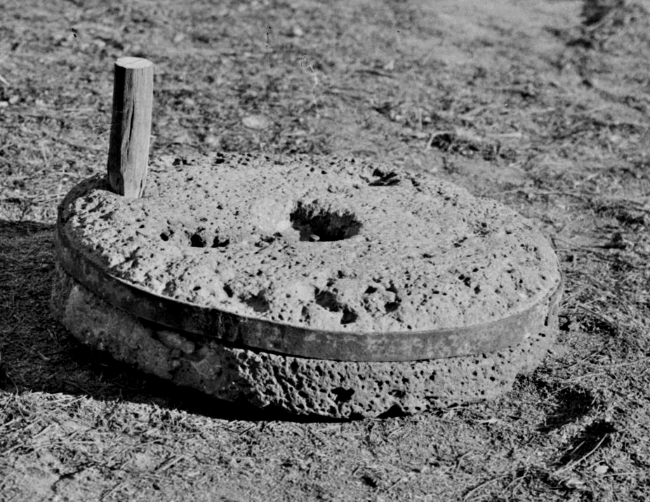

# Human-made Things in the Bible

## License Information

Human-made Things in the Bible © United Bible Societies, 2025. Adapted from: <cite>The Works of Their Hands: Man-made Things in the Bible</cite>, by Ray Pritz © 2009 United Bible Societies. This work is licensed under Creative Commons Attribution-ShareAlike 4.0 International (<a href="https://creativecommons.org/licenses/by-sa/4.0/">https://creativecommons.org/licenses/by-sa/4.0/</a>).

--------------------------------

## 标题：磨、磨石、磨盘（millstones, mill） (id: REALIA:5.10)

5\.10 标题：磨、磨石、磨盘（millstones, mill）
==================================

经文出处
----

Hebrew 来：פֶּלַח (音译：pelach)

[JDG 9:53](https://ref.ly/Judg9:53), [2SA 11:21](https://ref.ly/2Sam11:21), [JOB 41:16](https://ref.ly/Job41:16)

Hebrew 来：רֵחַיִם (音译：rechayim)

[EXO 11:5](https://ref.ly/Exod11:5), [NUM 11:8](https://ref.ly/Num11:8), [DEU 24:6](https://ref.ly/Deut24:6), [ISA 47:2](https://ref.ly/Isa47:2), [JER 25:10](https://ref.ly/Jer25:10)

Hebrew 来：רֶכֶב (音译：rekev)

[DEU 24:6](https://ref.ly/Deut24:6), [JDG 9:53](https://ref.ly/Judg9:53), [2SA 11:21](https://ref.ly/2Sam11:21)

Greek 希：μυλικός (音译：mulikos)

[LUK 17:2](https://ref.ly/Luke17:2)

Greek 希：μύλινος (音译：mulinos)

[REV 18:21](https://ref.ly/Rev18:21)

Greek 希：μύλος (音译：mulos)

[MAT 18:6](https://ref.ly/Matt18:6), [MAT 24:41](https://ref.ly/Matt24:41), [MRK 9:42](https://ref.ly/Mark9:42), [REV 18:22](https://ref.ly/Rev18:22)

描述和用途
-----

*手动碾磨器 (Gary Todd, Israel Museum, CC0, via Wikimedia Commons)*

*手动碾磨器 (Matson Collection, Library of Congress, Public domain, via Wikimedia Commons)*

磨由两块扁平的石块组成，两块石板摩擦便可将麦子磨成面粉。在旧约时期，石磨一般相对较小，由人工操作。把麦子放在固定的下磨石上，然后用上磨石来回碾压麦子，就可将其磨成面粉。磨面粉通常是妇女的工作，她们要在清晨天亮前完成。这是一项辛苦的工作，要花很多时间。据估计，要为一个五口之家磨出足够的面粉做饼，一个妇女需要每天磨三个小时以上。油灯在清晨闪亮，磨面的声音阵阵传来，这是安居乐业的象征。在[JER 25:10](https://ref.ly/Jer25:10) ，先知耶利米描述将要临到百姓的灾难时，他引用上帝的话说：“我又要使……推磨的声音和灯的亮光，从他们中间止息。”

*妇女使用手动碾磨器 (© Marcus Cyron, CC BY 3\.0, via Wikimedia Commons)*

在新约时期，人们仍然使用同类型的石磨，但也开始使用圆磨。圆磨的上磨盘和下磨盘基本一样大，磨面时，上磨盘相对于下磨盘转动。麦子通过上磨盘中间的一个洞倒入磨石中，面粉则从两块磨盘的摩擦面中流出来。有些圆磨相对较小，由手工操作。但有的圆磨很大，要套上牲口来拉动上磨盘。

在世界上的许多地方，人们都会用某种方式来把麦子磨成粉。通常情况下，石磨的结构和古代所用的石磨基本相同，就是使用两块相对较大、扁平的磨盘石，把其中一块放到另一块上面，在两块磨盘之间碾麦子。在世界上的一些地方，人们会使用一种研钵和研杵来磨碎或捣碎麦子。

---

翻译
--

*一种较后期的手动碾磨器的磨石 (Matson Collection, Library of Congress, Public domain, via Wikimedia Commons)*

“石磨”通常可译为“用来碾谷物的石头”。在其他情况下，甚至可以使用更加宽泛的表达，例如“大石块”。大多数情况下，经文的重点或者是磨石的大小，或者是碾麦子的功能，而未必是石磨的具体形式。然而，[MAT 18:6](https://ref.ly/Matt18:6) 、[MRK 9:42](https://ref.ly/Mark9:42) 和[LUK 17:2](https://ref.ly/Luke17:2) 提到把磨石拴在人的脖子上，然后丢到海里，这里重要的是说明较大的石块会使人立刻往下沉。对于这种情形，使用表示“研钵”（尤其是木制的）的词语是不合适的，因为研钵通常会浮在水面上。

*妇女使用手动碾磨器 (© Marcus Cyron, CC BY 3\.0, via Wikimedia Commons)*

希伯来文*pelach* 一词指的是旧约时期手磨的磨石。在[JDG 9:53](https://ref.ly/Judg9:53) 和[2SA 11:21](https://ref.ly/2Sam11:21) 中，这个词指上磨石（希伯来文*pelach rekev* ），而在[JOB 41:16](https://ref.ly/Job41:16) （《和》41:24）中，指下磨石（*pelach tachtith* ）。

* **Associated Passages:** 士师记 9:53; 撒母耳记下 11:21; 约伯记 41:16; 出埃及记 11:5; 民数记 11:8; 申命记 24:6; 以赛亚书 47:2; 耶利米书 25:10; 路加福音 17:2; 启示录 18:21; 马太福音 18:6; 马太福音 24:41; 马可福音 9:42; 启示录 18:22

