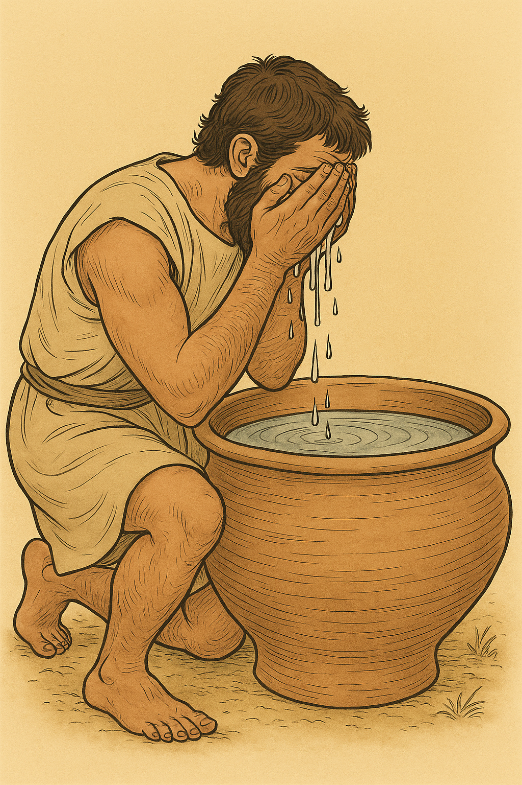

# Human-made Things in the Bible

## License Information

Human-made Things in the Bible © United Bible Societies, 2025. Adapted from: <cite>The Works of Their Hands: Man-made Things in the Bible</cite>, by Ray Pritz © 2009 United Bible Societies. This work is licensed under Creative Commons Attribution-ShareAlike 4.0 International (<a href="https://creativecommons.org/licenses/by-sa/4.0/">https://creativecommons.org/licenses/by-sa/4.0/</a>).

--------------------------------

## 标题：盆（basin, washbasin） (id: REALIA:5.16)

5\.16 标题：盆（basin, washbasin）
============================

经文出处
----

Hebrew 来：סַף (音译：saf)

[EXO 12:22](https://ref.ly/Exod12:22), [EXO 12:22](https://ref.ly/Exod12:22), [2SA 17:28](https://ref.ly/2Sam17:28)

Hebrew 来：סִיר, רַחַץ (音译：sir rachats)

[PSA 60:10](https://ref.ly/Ps60:10), [PSA 108:10](https://ref.ly/Ps108:10)

Greek 希：νιπτήρ (音译：niptēr)

[JHN 13:5](https://ref.ly/John13:5)

描述和用途
-----

*(Image generated by ChatGPT using OpenAI technology)*

盆是一个很大的碗，通常用黏土制成。盆有几个用途，比如盛水洗手、洗脸洗脚等。

---

翻译
--

[JHN 13:5](https://ref.ly/John13:5) ：*niptēr* 一词没有在其他希腊文献中出现过，意思不详，但大多数译本都译为“盆”、“水盆”或“碗”。也有人认为，这个词的意思是“带柄的陶罐”或“水壶”，因为在古代近东，人们洗脚时，通常不是把脚放到盛着水的盆里，而是用水壶往脚上倒水。有鉴于此，[JHN 13:5](https://ref.ly/John13:5) 描绘的画面应该是：门徒在垫子上向左斜躺，右手去拿面前桌子上的食物。耶稣把水倒进“水壶”（这个希腊文词语前面有定冠词，表明这是一个专门用来洗脚的容器），然后在门徒身后绕着走了一圈，因为他们的脚伸在后面。他把水壶里的水倒到门徒脚上，又用围在腰间的毛巾（参[10\.4 手巾 (towel)\<REALIA:10\.4\>](#) ）擦干。

* **Associated Passages:** 出埃及记 12:22; 撒母耳记下 17:28; 诗篇 60:10; 诗篇 108:10; 约翰福音 13:5

* **Associated ACAI Concepts:** Bowl (ID: `realia:Bowl`)
