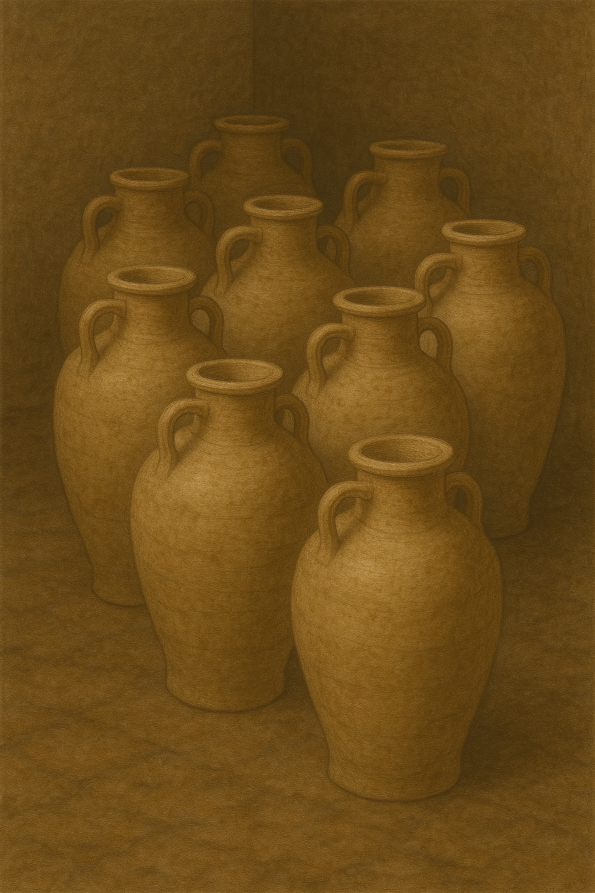

# Human-made Things in the Bible

## License Information

Human-made Things in the Bible © United Bible Societies, 2025. Adapted from: <cite>The Works of Their Hands: Man-made Things in the Bible</cite>, by Ray Pritz © 2009 United Bible Societies. This work is licensed under Creative Commons Attribution-ShareAlike 4.0 International (<a href="https://creativecommons.org/licenses/by-sa/4.0/">https://creativecommons.org/licenses/by-sa/4.0/</a>).

--------------------------------

## 标题：容器、器皿（containers, vessels） (id: REALIA:5.18)

5\.18 标题：容器、器皿（containers, vessels）
===================================

经文出处
----

Hebrew 来：אָסוּךְ (音译：’asuk)

[2KI 4:2](https://ref.ly/2Kgs4:2)

Hebrew 来：בַּקְבֻּק (音译：baqbuq)

[1KI 14:3](https://ref.ly/1Kgs14:3), [JER 19:1](https://ref.ly/Jer19:1), [JER 19:10](https://ref.ly/Jer19:10)

Hebrew 来：חֶרֶשׂ (音译：cheres)

[PRO 26:23](https://ref.ly/Prov26:23)

Hebrew 来：כְּלִי (音译：kli)

[GEN 42:25](https://ref.ly/Gen42:25), [GEN 43:11](https://ref.ly/Gen43:11), [GEN 45:20](https://ref.ly/Gen45:20), [EXO 37:16](https://ref.ly/Exod37:16), [LEV 6:21](https://ref.ly/Lev6:21), [LEV 6:21](https://ref.ly/Lev6:21), [LEV 11:32](https://ref.ly/Lev11:32), [LEV 11:33](https://ref.ly/Lev11:33), [LEV 11:34](https://ref.ly/Lev11:34), [LEV 14:5](https://ref.ly/Lev14:5), [LEV 14:50](https://ref.ly/Lev14:50), [LEV 15:12](https://ref.ly/Lev15:12), [LEV 15:12](https://ref.ly/Lev15:12), [NUM 4:9](https://ref.ly/Num4:9), [NUM 5:17](https://ref.ly/Num5:17), [NUM 19:15](https://ref.ly/Num19:15), [NUM 19:17](https://ref.ly/Num19:17), [DEU 23:25](https://ref.ly/Deut23:25), [RUT 2:9](https://ref.ly/Ruth2:9), [1SA 9:7](https://ref.ly/1Sam9:7), [2SA 17:28](https://ref.ly/2Sam17:28), [1KI 10:21](https://ref.ly/1Kgs10:21), [1KI 17:10](https://ref.ly/1Kgs17:10), [2KI 4:3](https://ref.ly/2Kgs4:3), [2KI 4:3](https://ref.ly/2Kgs4:3), [2KI 4:4](https://ref.ly/2Kgs4:4), [2KI 4:6](https://ref.ly/2Kgs4:6), [2KI 4:6](https://ref.ly/2Kgs4:6), [2KI 4:6](https://ref.ly/2Kgs4:6), [2CH 9:20](https://ref.ly/2Chr9:20), [EST 1:7](https://ref.ly/Esth1:7), [EST 1:7](https://ref.ly/Esth1:7), [EST 1:7](https://ref.ly/Esth1:7), [JOB 28:17](https://ref.ly/Job28:17), [PSA 2:9](https://ref.ly/Ps2:9), [ISA 22:24](https://ref.ly/Isa22:24), [ISA 22:24](https://ref.ly/Isa22:24), [ISA 22:24](https://ref.ly/Isa22:24), [ISA 65:4](https://ref.ly/Isa65:4), [ISA 66:20](https://ref.ly/Isa66:20), [JER 14:3](https://ref.ly/Jer14:3), [JER 18:4](https://ref.ly/Jer18:4), [JER 18:4](https://ref.ly/Jer18:4), [JER 19:11](https://ref.ly/Jer19:11), [JER 22:28](https://ref.ly/Jer22:28), [JER 32:14](https://ref.ly/Jer32:14), [JER 40:10](https://ref.ly/Jer40:10), [JER 48:11](https://ref.ly/Jer48:11), [JER 48:11](https://ref.ly/Jer48:11), [JER 48:12](https://ref.ly/Jer48:12), [JER 48:38](https://ref.ly/Jer48:38), [JER 51:34](https://ref.ly/Jer51:34), [EZK 4:9](https://ref.ly/Ezek4:9)

Hebrew 来：עֶצֶב (音译：‘etsev)

[JER 22:28](https://ref.ly/Jer22:28)

Greek 希：ἀγγεῖον (音译：aggeion)

[MAT 25:4](https://ref.ly/Matt25:4), [JDT 7:20](https://ref.ly/Jdt7:20), [JDT 10:5](https://ref.ly/Jdt10:5), [SIR 21:14](https://ref.ly/Sir21:14), [1MA 6:53](https://ref.ly/1Macc6:53)

Greek 希：ἄγγος (音译：aggos)

[MAT 13:48](https://ref.ly/Matt13:48)

Greek 希：ἄντλημα (音译：antlēma)

[JHN 4:11](https://ref.ly/John4:11)

Greek 希：κάλπη (音译：kalpē)

[4MA 3:12](https://ref.ly/4Macc3:12)

Greek 希：καψάκης (音译：kapsakēs)

[JDT 10:5](https://ref.ly/Jdt10:5)

Greek 希：σκεῦος (音译：skeuos)

[LUK 8:16](https://ref.ly/Luke8:16), [JHN 19:29](https://ref.ly/John19:29), [ROM 9:21](https://ref.ly/Rom9:21), [REV 2:27](https://ref.ly/Rev2:27), [LJE 1:15](https://ref.ly/EpJer1:15)

Latin 拉：vas

[2ES 6:56](https://ref.ly/2Esd6:56), [2ES 9:34](https://ref.ly/2Esd9:34)

描述和用途
-----

*(Image generated by ChatGPT using OpenAI technology)*

容器是用来装东西的坚固物品。容器有陶制的、金属制的，也有木制的，大小和形状差别很大。

---

翻译
--

*瓶 (Metropolitan Museum of Art, CC0, MMA)*

大多数语言都有表示容器的统称。希伯来文*kli* 一词的含义非常笼统，用法与英文“implement”（“用具”）、“instrument”（“工具”）、甚至是“object”（“物体”）或“thing”（“东西”）类似。翻译者应根据语境选择相应的译词。例如，在[RUT 2:9](https://ref.ly/Ruth2:9) 中，该词明显是指人们用来喝水的容器，翻译者可能要指出这一点；例如，GNT (Good News Translation (1992)) 、NIV (New International Version (1984)) 和CEV (Contemporary English Version) 译为“water jars”（“水罐”），NCV (New Century Version) 译为“water jugs”（“水壶”）。在大多数经文中，翻译者都可以选择一个一般性词语，但应避免译作由塑料、橡胶、锡或其他圣经时期没有的材料制成的容器。

在[2KI 4:2](https://ref.ly/2Kgs4:2) 中，希伯来文*’asuk* 指的是某种罐子或长颈瓶，可能是陶制的。大多数译本都在译词前面添加了修饰词“小”（如GNT (Good News Translation (1992)) 、CEV (Contemporary English Version) ）。

希伯来文*baqbuq* 一词指的是一种细颈小瓶。在现代希伯来文中，这个词表示“瓶子”。

在[PRO 26:23](https://ref.ly/Prov26:23) 中，希伯来文*cheres* 指的是一种由廉价而普通的材料制成的器皿。

[JOB 28:17](https://ref.ly/Job28:17) ：这节经文末尾的希伯来文字面意思是“精金的器皿”。虽然大多数译本都采取了“精金的珠宝”（“jewels of fine gold”，RSV (Revised Standard Version (1952)) ）等类译法，但GNT (Good News Translation (1992)) 和其他译本认为“器皿”（希伯来文*kli* ）指的是“金瓶子”，这可能比“珠宝”更准确。在一些语言中，“精金的器皿”可以译为“用精金做的罐子”。因为经文的要旨是智慧极其可贵，而不是把它与任何物品作比较；翻译者可以借鉴CEV (Contemporary English Version) 来翻译整节经文，“没有任何东西与它等价——不论是金子还是贵重的玻璃。”

[MAT 25:4](https://ref.ly/Matt25:4) 中提到的器皿应该比较小，容量不超过1升（约1夸脱）。

[MAT 13:48](https://ref.ly/Matt13:48) 提到的容器应该很大，容量可能有15—19升（4—5加仑）。

[JHN 4:11](https://ref.ly/John4:11) ：撒玛利亚妇人看见耶稣“没有打水的器具”。希腊文*antlēma* （[JHN 4:11](https://ref.ly/John4:11) ）源自一个意为“打水”的动词，并没有提示器具的形状和材料。许多译本译为“桶”。但是，这种译法可能会暗示这是一种用金属、塑料甚或橡胶做的器具，而这些都是不合适的。即便是木桶，也不太可能出现在新约时期。这里比较可能是一个皮制的容器。在许多语言中，最好的解决办法是不指明具体的器具。翻译者可以用妇女的话来开始该节经文：“先生，井很深，但你没有打水的东西。”GW (God's Word Translation) 、NCV (New Century Version) 、NIV (New International Version (1984)) 、SPCL (Spanish Common Language Version (Dios Habla Hoy)) 、PV 和其他一些译本采用了类似的译法。

[JHN 19:29](https://ref.ly/John19:29) ：RSV (Revised Standard Version (1952)) 和GNT (Good News Translation (1992)) 将希腊文*skeuos* 一词译为“bowl”（“碗”），还有译本译为“jar”（“罐子”；CEV (Contemporary English Version) 、NIV (New International Version (1984)) 、NLT (New Living Translation) 、REB (Revised English Bible (1989)) ）。这里最好使用一个统称，如“器皿”或“容器”（GECL (German Common Language Version (Gute Nachricht Bibel)) ）。*skeuos* 一词在新约中通常是指广义的“东西、物件、物品”（参[MAT 12:29](https://ref.ly/Matt12:29); [MRK 3:27](https://ref.ly/Mark3:27); [MRK 11:16](https://ref.ly/Mark11:16); [LUK 17:31](https://ref.ly/Luke17:31); [ACT 10:11](https://ref.ly/Acts10:11); [ACT 10:16](https://ref.ly/Acts10:16); [ACT 11:5](https://ref.ly/Acts11:5); [ACT 27:17](https://ref.ly/Acts27:17); [2TI 2:20](https://ref.ly/2Tim2:20); [2TI 2:21](https://ref.ly/2Tim2:21); [HEB 9:21](https://ref.ly/Heb9:21); [REV 18:12](https://ref.ly/Rev18:12); [REV 18:12](https://ref.ly/Rev18:12) ）。

* **Associated Passages:** 列王纪下 4:2; 列王纪上 14:3; 耶利米书 19:1; 耶利米书 19:10; 箴言 26:23; 创世记 42:25; 创世记 43:11; 创世记 45:20; 出埃及记 37:16; 利未记 6:21; 利未记 11:32; 利未记 11:33; 利未记 11:34; 利未记 14:5; 利未记 14:50; 利未记 15:12; 民数记 4:9; 民数记 5:17; 民数记 19:15; 民数记 19:17; 申命记 23:25; 路得记 2:9; 撒母耳记上 9:7; 撒母耳记下 17:28; 列王纪上 10:21; 列王纪上 17:10; 列王纪下 4:3; 列王纪下 4:4; 列王纪下 4:6; 历代志下 9:20; 以斯帖记 1:7; 约伯记 28:17; 诗篇 2:9; 以赛亚书 22:24; 以赛亚书 65:4; 以赛亚书 66:20; 耶利米书 14:3; 耶利米书 18:4; 耶利米书 19:11; 耶利米书 22:28; 耶利米书 32:14; 耶利米书 40:10; 耶利米书 48:11; 耶利米书 48:12; 耶利米书 48:38; 耶利米书 51:34; 以西结书 4:9; 马太福音 25:4; 友弟德传 7:20; 友弟德传 10:5; 德训篇 21:14; 玛加伯上 6:53; 马太福音 13:48; 约翰福音 4:11; 玛加伯四书 3:12; 路加福音 8:16; 约翰福音 19:29; 罗马书 9:21; 启示录 2:27; 耶利米书信 1:15; 厄斯德拉下 6:56; 厄斯德拉下 9:34; 马太福音 12:29; 马可福音 3:27; 马可福音 11:16; 路加福音 17:31; 使徒行传 10:11; 使徒行传 10:16; 使徒行传 11:5; 使徒行传 27:17; 提摩太后书 2:20; 提摩太后书 2:21; 希伯来书 9:21; 启示录 18:12

