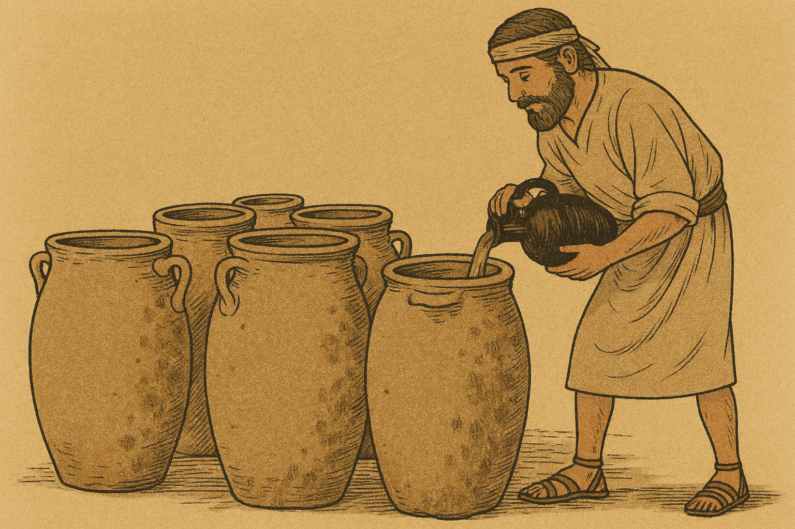

# Human-made Things in the Bible

## License Information

Human-made Things in the Bible © United Bible Societies, 2025. Adapted from: <cite>The Works of Their Hands: Man-made Things in the Bible</cite>, by Ray Pritz © 2009 United Bible Societies. This work is licensed under Creative Commons Attribution-ShareAlike 4.0 International (<a href="https://creativecommons.org/licenses/by-sa/4.0/">https://creativecommons.org/licenses/by-sa/4.0/</a>).

--------------------------------

## 标题：石缸（stone jar） (id: REALIA:5.18.1.1)

5\.18\.1\.1 标题：石缸（stone jar）
============================

经文出处
----

Greek 希：λίθινος, ὑδρία (音译：(lithinos) hudria)

[JHN 2:6](https://ref.ly/John2:6), [JHN 2:6](https://ref.ly/John2:6), [JHN 2:7](https://ref.ly/John2:7)

描述和用途
-----

*美锡尼（Mycenean）石制储物罐，青铜时代晚期，公元前1570–1200年 (© Zde, CC BY\-SA 3\.0, via Wikimedia Commons)*

石缸是用来盛水的容器。在圣经中，只有一个地方提到了这种盛水的容器，并且描述得非常详细。石缸的容量为“二十至三十加仑”（GNT (Good News Translation (1992)) 直译；约80—120升），是用石头做成的。圣经时期的石缸是由比较软的石头制成的，可用锤子和凿子进行雕刻，再用多种工具打磨光滑；也可以用车床加工，就像木匠旋削木头那样。

---

翻译
--

*(Image generated by ChatGPT using OpenAI technology)*

关于[RUT 2:9](https://ref.ly/Ruth2:9) 记叙的水缸，参[5\.18 容器、器皿 (containers, vessels)\<REALIA:5\.18\>](#) 中的讨论。

[JHN 2:6](https://ref.ly/John2:6) ：这里的水缸是用石头做成，而不是陶制的，这一点很重要。根据犹太律法，如果陶缸沾染了不洁，就必须打碎；但是被污染的石缸只要清洗干净就可以再次使用。希腊文*hudria* 表明这些石缸是用来盛水的。在一些语言中，短语“六口石缸”中每个词之间的关系必须明确，例如，“六口用来盛水的大石缸”。

* **Associated Passages:** 约翰福音 2:6; 约翰福音 2:7; 路得记 2:9

