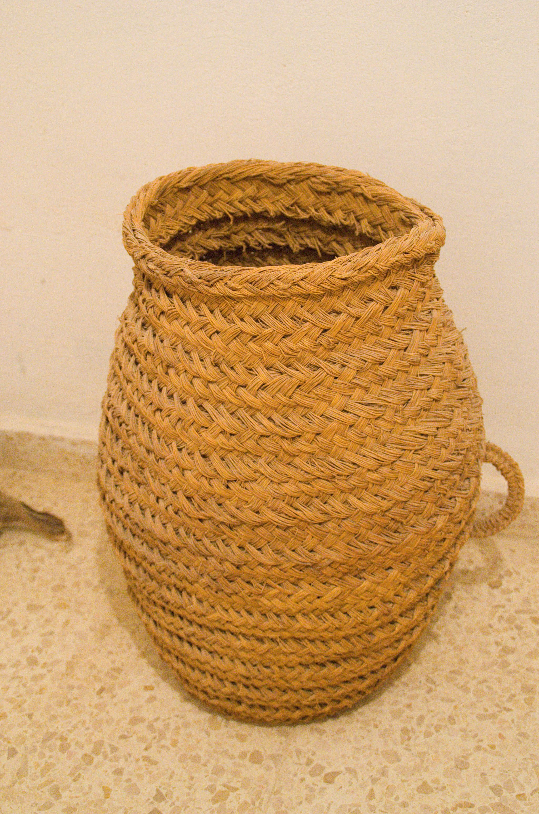

# Human-made Things in the Bible

## License Information

Human-made Things in the Bible © United Bible Societies, 2025. Adapted from: <cite>The Works of Their Hands: Man-made Things in the Bible</cite>, by Ray Pritz © 2009 United Bible Societies. This work is licensed under Creative Commons Attribution-ShareAlike 4.0 International (<a href="https://creativecommons.org/licenses/by-sa/4.0/">https://creativecommons.org/licenses/by-sa/4.0/</a>).

--------------------------------

## 标题：筐子、篮子、伊法（basket） (id: REALIA:5.18.2)

5\.18\.2 标题：筐子、篮子、伊法（basket）
============================

经文出处
----

Hebrew 来：אֵיפָה (音译：’eyfah)

[EXO 16:36](https://ref.ly/Exod16:36), [LEV 5:11](https://ref.ly/Lev5:11), [LEV 6:13](https://ref.ly/Lev6:13), [LEV 19:36](https://ref.ly/Lev19:36), [NUM 5:15](https://ref.ly/Num5:15), [NUM 28:5](https://ref.ly/Num28:5), [DEU 25:14](https://ref.ly/Deut25:14), [DEU 25:14](https://ref.ly/Deut25:14), [DEU 25:15](https://ref.ly/Deut25:15), [JDG 6:19](https://ref.ly/Judg6:19), [RUT 2:17](https://ref.ly/Ruth2:17), [1SA 1:24](https://ref.ly/1Sam1:24), [1SA 17:17](https://ref.ly/1Sam17:17), [PRO 20:10](https://ref.ly/Prov20:10), [PRO 20:10](https://ref.ly/Prov20:10), [ISA 5:10](https://ref.ly/Isa5:10), [EZK 45:10](https://ref.ly/Ezek45:10), [EZK 45:11](https://ref.ly/Ezek45:11), [EZK 45:11](https://ref.ly/Ezek45:11), [EZK 45:13](https://ref.ly/Ezek45:13), [EZK 45:13](https://ref.ly/Ezek45:13), [EZK 45:24](https://ref.ly/Ezek45:24), [EZK 45:24](https://ref.ly/Ezek45:24), [EZK 45:24](https://ref.ly/Ezek45:24), [EZK 46:5](https://ref.ly/Ezek46:5), [EZK 46:5](https://ref.ly/Ezek46:5), [EZK 46:7](https://ref.ly/Ezek46:7), [EZK 46:7](https://ref.ly/Ezek46:7), [EZK 46:7](https://ref.ly/Ezek46:7), [EZK 46:11](https://ref.ly/Ezek46:11), [EZK 46:11](https://ref.ly/Ezek46:11), [EZK 46:11](https://ref.ly/Ezek46:11), [EZK 46:14](https://ref.ly/Ezek46:14), [AMO 8:5](https://ref.ly/Amos8:5), [MIC 6:10](https://ref.ly/Mic6:10), [ZEC 5:6](https://ref.ly/Zech5:6), [ZEC 5:7](https://ref.ly/Zech5:7), [ZEC 5:8](https://ref.ly/Zech5:8), [ZEC 5:9](https://ref.ly/Zech5:9), [ZEC 5:10](https://ref.ly/Zech5:10)

Hebrew 来：דּוּד (音译：dud, dudai)

[2KI 10:7](https://ref.ly/2Kgs10:7), [PSA 81:7](https://ref.ly/Ps81:7), [JER 24:1](https://ref.ly/Jer24:1), [JER 24:2](https://ref.ly/Jer24:2), [JER 24:2](https://ref.ly/Jer24:2)

Hebrew 来：טֶנֶא (音译：tene’)

[DEU 26:2](https://ref.ly/Deut26:2), [DEU 26:4](https://ref.ly/Deut26:4), [DEU 28:5](https://ref.ly/Deut28:5), [DEU 28:17](https://ref.ly/Deut28:17)

Hebrew 来：כְּלוּב (音译：kluv)

[JER 5:27](https://ref.ly/Jer5:27), [AMO 8:1](https://ref.ly/Amos8:1), [AMO 8:2](https://ref.ly/Amos8:2)

Hebrew 来：סַל (音译：sal, salsiloth)

[GEN 40:16](https://ref.ly/Gen40:16), [GEN 40:17](https://ref.ly/Gen40:17), [GEN 40:17](https://ref.ly/Gen40:17), [GEN 40:18](https://ref.ly/Gen40:18), [EXO 29:3](https://ref.ly/Exod29:3), [EXO 29:3](https://ref.ly/Exod29:3), [EXO 29:23](https://ref.ly/Exod29:23), [EXO 29:32](https://ref.ly/Exod29:32), [LEV 8:2](https://ref.ly/Lev8:2), [LEV 8:26](https://ref.ly/Lev8:26), [LEV 8:31](https://ref.ly/Lev8:31), [NUM 6:15](https://ref.ly/Num6:15), [NUM 6:17](https://ref.ly/Num6:17), [NUM 6:19](https://ref.ly/Num6:19), [JDG 6:19](https://ref.ly/Judg6:19)

Hebrew 来：תֵּבָה (音译：tevah)

[EXO 2:3](https://ref.ly/Exod2:3), [EXO 2:5](https://ref.ly/Exod2:5)

Greek 希：κόφινος (音译：kofinos)

[MAT 14:20](https://ref.ly/Matt14:20), [MAT 16:9](https://ref.ly/Matt16:9), [MRK 6:43](https://ref.ly/Mark6:43), [MRK 8:19](https://ref.ly/Mark8:19), [LUK 9:17](https://ref.ly/Luke9:17), [JHN 6:13](https://ref.ly/John6:13)

Greek 希：σαργάνη (音译：sarganē)

[2CO 11:33](https://ref.ly/2Cor11:33)

Greek 希：σπυρίς (音译：spuris)

[MAT 15:37](https://ref.ly/Matt15:37), [MAT 16:10](https://ref.ly/Matt16:10), [MRK 8:8](https://ref.ly/Mark8:8), [MRK 8:20](https://ref.ly/Mark8:20), [ACT 9:25](https://ref.ly/Acts9:25)

描述和用途
-----

*用于储存和运输货物的大型编织篮 (© Habib M’henni, CC BY\-SA 3\.0, via Wikimedia Commons)*

篮子是用草或芦苇等编织材料做成的一种容器。根据用途的不同，篮子的大小也有很大的不同。篮子可以盛装各种各样的东西，包括食物和农产品，甚至可以用来搬运泥土。

---

翻译
--

希伯来文*’eyfah* 有时指一个体积单位（伊法），有时指具有该容量的篮子。翻译者要特别注意语境。

[ZEC 5:7](https://ref.ly/Zech5:7) 提到一种用来盖篮子（希伯来文*kikar* ）的东西。经文记载这个物品是用铅做的，并且篮子通常没有它。大多数译本将这个词译为“铅做的盖子”（“lid made of lead”；GNT (Good News Translation (1992)) ）或“铅盖”（“lead cover”；CEV (Contemporary English Version) 、GW (God's Word Translation) ）。

*(Image generated by ChatGPT using OpenAI technology)*

在[JER 5:27](https://ref.ly/Jer5:27) 中，希伯来文*kluv* 似乎指的是一种非常特别的篮子；实际上，这是一种用来装鸟的笼子。RSV (Revised Standard Version (1952)) 把这节经文的开头译为“Like a basket full of birds”（“像装满鸟的篮子”），这暗示鸟已经死了。然而，大多数其他译本并没有译为“篮子”，而是译成“笼子”，似乎更好地保留了前一节经文的比喻。另一方面，在[AMO 8:1](https://ref.ly/Amos8:1); [AMO 8:2](https://ref.ly/Amos8:2) 中，*kluv* 一词毫无疑问是“容器”的统称，译文应该尽量使用一般性的词语，该词语所表示的物品应该适合用来在市场售卖、携带或存放水果。如果目标语言没有适合的篮子，那么可以译作任何作此用途的容器。

对于上文所列三个在新约中表示篮子的词语，我们无法准确说明它们的意思有什么区别。希腊文*sarganē* 一词仅出现在[2CO 11:33](https://ref.ly/2Cor11:33) ，这显然是一个相当大的篮子，因为保罗就是坐在里面从大马士革的城墙缒下来的。在[ACT 9:25](https://ref.ly/Acts9:25) 中，希腊文*spuris* 也指同一种篮子。

对于希腊文*spuris* 和*kofinos* ，翻译者通常很难找到令人满意的对等词，因为在不同的目标语言中，特定类型的篮子有非常具体的名称；篮子的结构和大小不同，名称也不同。遗憾的是，我们无法从希腊文本中准确地知道篮子的大小或类型。翻译者要注意，选定的词语不能表示由塑料或橡胶等现代材料制成的容器。

* **Associated Passages:** 出埃及记 16:36; 利未记 5:11; 利未记 6:13; 利未记 19:36; 民数记 5:15; 民数记 28:5; 申命记 25:14; 申命记 25:15; 士师记 6:19; 路得记 2:17; 撒母耳记上 1:24; 撒母耳记上 17:17; 箴言 20:10; 以赛亚书 5:10; 以西结书 45:10; 以西结书 45:11; 以西结书 45:13; 以西结书 45:24; 以西结书 46:5; 以西结书 46:7; 以西结书 46:11; 以西结书 46:14; 阿摩司书 8:5; 弥迦书 6:10; 撒迦利亚书 5:6; 撒迦利亚书 5:7; 撒迦利亚书 5:8; 撒迦利亚书 5:9; 撒迦利亚书 5:10; 列王纪下 10:7; 诗篇 81:7; 耶利米书 24:1; 耶利米书 24:2; 申命记 26:2; 申命记 26:4; 申命记 28:5; 申命记 28:17; 耶利米书 5:27; 阿摩司书 8:1; 阿摩司书 8:2; 创世记 40:16; 创世记 40:17; 创世记 40:18; 出埃及记 29:3; 出埃及记 29:23; 出埃及记 29:32; 利未记 8:2; 利未记 8:26; 利未记 8:31; 民数记 6:15; 民数记 6:17; 民数记 6:19; 出埃及记 2:3; 出埃及记 2:5; 马太福音 14:20; 马太福音 16:9; 马可福音 6:43; 马可福音 8:19; 路加福音 9:17; 约翰福音 6:13; 哥林多后书 11:33; 马太福音 15:37; 马太福音 16:10; 马可福音 8:8; 马可福音 8:20; 使徒行传 9:25

