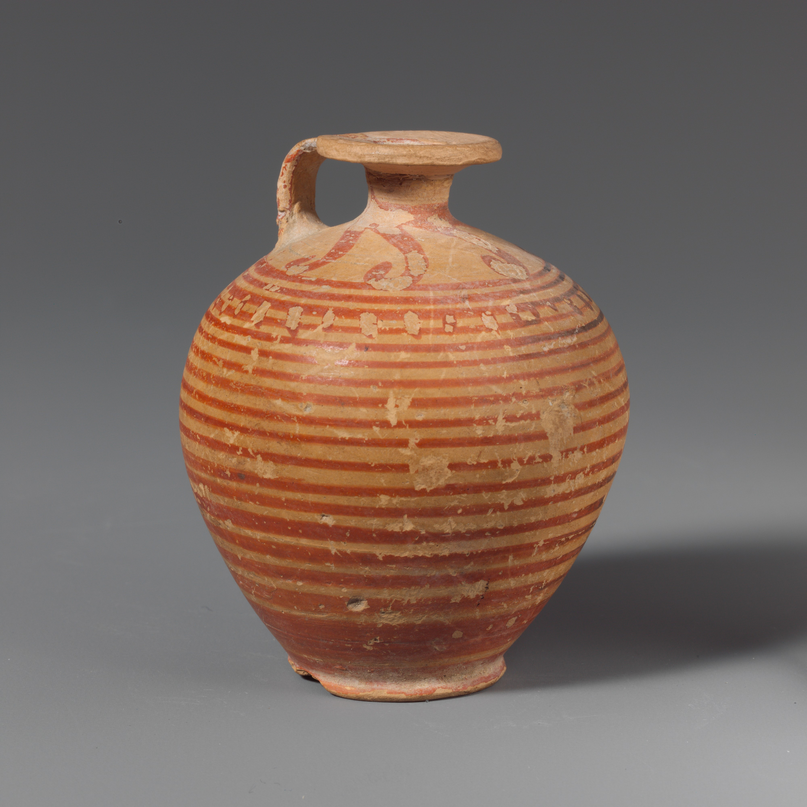

# Human-made Things in the Bible

## License Information

Human-made Things in the Bible © United Bible Societies, 2025. Adapted from: <cite>The Works of Their Hands: Man-made Things in the Bible</cite>, by Ray Pritz © 2009 United Bible Societies. This work is licensed under Creative Commons Attribution-ShareAlike 4.0 International (<a href="https://creativecommons.org/licenses/by-sa/4.0/">https://creativecommons.org/licenses/by-sa/4.0/</a>).

--------------------------------

## 标题：容器、器皿（containers, vessels） (id: REALIA:5.18)

5\.18 标题：容器、器皿（containers, vessels）
===================================

经文出处
----

Hebrew 来：אָסוּךְ (音译：’asuk)

[2KI 4:2](https://ref.ly/2Kgs4:2)

Hebrew 来：בַּקְבֻּק (音译：baqbuq)

[1KI 14:3](https://ref.ly/1Kgs14:3), [JER 19:1](https://ref.ly/Jer19:1), [JER 19:10](https://ref.ly/Jer19:10)

Hebrew 来：חֶרֶשׂ (音译：cheres)

[PRO 26:23](https://ref.ly/Prov26:23)

Hebrew 来：כְּלִי (音译：kli)

[GEN 42:25](https://ref.ly/Gen42:25), [GEN 43:11](https://ref.ly/Gen43:11), [GEN 45:20](https://ref.ly/Gen45:20), [EXO 37:16](https://ref.ly/Exod37:16), [LEV 6:21](https://ref.ly/Lev6:21), [LEV 6:21](https://ref.ly/Lev6:21), [LEV 11:32](https://ref.ly/Lev11:32), [LEV 11:33](https://ref.ly/Lev11:33), [LEV 11:34](https://ref.ly/Lev11:34), [LEV 14:5](https://ref.ly/Lev14:5), [LEV 14:50](https://ref.ly/Lev14:50), [LEV 15:12](https://ref.ly/Lev15:12), [LEV 15:12](https://ref.ly/Lev15:12), [NUM 4:9](https://ref.ly/Num4:9), [NUM 5:17](https://ref.ly/Num5:17), [NUM 19:15](https://ref.ly/Num19:15), [NUM 19:17](https://ref.ly/Num19:17), [DEU 23:25](https://ref.ly/Deut23:25), [RUT 2:9](https://ref.ly/Ruth2:9), [1SA 9:7](https://ref.ly/1Sam9:7), [2SA 17:28](https://ref.ly/2Sam17:28), [1KI 10:21](https://ref.ly/1Kgs10:21), [1KI 17:10](https://ref.ly/1Kgs17:10), [2KI 4:3](https://ref.ly/2Kgs4:3), [2KI 4:3](https://ref.ly/2Kgs4:3), [2KI 4:4](https://ref.ly/2Kgs4:4), [2KI 4:6](https://ref.ly/2Kgs4:6), [2KI 4:6](https://ref.ly/2Kgs4:6), [2KI 4:6](https://ref.ly/2Kgs4:6), [2CH 9:20](https://ref.ly/2Chr9:20), [EST 1:7](https://ref.ly/Esth1:7), [EST 1:7](https://ref.ly/Esth1:7), [EST 1:7](https://ref.ly/Esth1:7), [JOB 28:17](https://ref.ly/Job28:17), [PSA 2:9](https://ref.ly/Ps2:9), [ISA 22:24](https://ref.ly/Isa22:24), [ISA 22:24](https://ref.ly/Isa22:24), [ISA 22:24](https://ref.ly/Isa22:24), [ISA 65:4](https://ref.ly/Isa65:4), [ISA 66:20](https://ref.ly/Isa66:20), [JER 14:3](https://ref.ly/Jer14:3), [JER 18:4](https://ref.ly/Jer18:4), [JER 18:4](https://ref.ly/Jer18:4), [JER 19:11](https://ref.ly/Jer19:11), [JER 22:28](https://ref.ly/Jer22:28), [JER 32:14](https://ref.ly/Jer32:14), [JER 40:10](https://ref.ly/Jer40:10), [JER 48:11](https://ref.ly/Jer48:11), [JER 48:11](https://ref.ly/Jer48:11), [JER 48:12](https://ref.ly/Jer48:12), [JER 48:38](https://ref.ly/Jer48:38), [JER 51:34](https://ref.ly/Jer51:34), [EZK 4:9](https://ref.ly/Ezek4:9)

Hebrew 来：עֶצֶב (音译：‘etsev)

[JER 22:28](https://ref.ly/Jer22:28)

Greek 希：ἀγγεῖον (音译：aggeion)

[MAT 25:4](https://ref.ly/Matt25:4), [JDT 7:20](https://ref.ly/Jdt7:20), [JDT 10:5](https://ref.ly/Jdt10:5), [SIR 21:14](https://ref.ly/Sir21:14), [1MA 6:53](https://ref.ly/1Macc6:53)

Greek 希：ἄγγος (音译：aggos)

[MAT 13:48](https://ref.ly/Matt13:48)

Greek 希：ἄντλημα (音译：antlēma)

[JHN 4:11](https://ref.ly/John4:11)

Greek 希：κάλπη (音译：kalpē)

[4MA 3:12](https://ref.ly/4Macc3:12)

Greek 希：καψάκης (音译：kapsakēs)

[JDT 10:5](https://ref.ly/Jdt10:5)

Greek 希：σκεῦος (音译：skeuos)

[LUK 8:16](https://ref.ly/Luke8:16), [JHN 19:29](https://ref.ly/John19:29), [ROM 9:21](https://ref.ly/Rom9:21), [REV 2:27](https://ref.ly/Rev2:27), [LJE 1:15](https://ref.ly/EpJer1:15)

Latin 拉：vas

[2ES 6:56](https://ref.ly/2Esd6:56), [2ES 9:34](https://ref.ly/2Esd9:34)

描述和用途
-----

*(Image generated by ChatGPT using OpenAI technology)*

容器是用来装东西的坚固物品。容器有陶制的、金属制的，也有木制的，大小和形状差别很大。

---

翻译
--

*瓶 (Metropolitan Museum of Art, CC0, MMA)*

大多数语言都有表示容器的统称。希伯来文*kli* 一词的含义非常笼统，用法与英文“implement”（“用具”）、“instrument”（“工具”）、甚至是“object”（“物体”）或“thing”（“东西”）类似。翻译者应根据语境选择相应的译词。例如，在[RUT 2:9](https://ref.ly/Ruth2:9) 中，该词明显是指人们用来喝水的容器，翻译者可能要指出这一点；例如，GNT (Good News Translation (1992)) 、NIV (New International Version (1984)) 和CEV (Contemporary English Version) 译为“water jars”（“水罐”），NCV (New Century Version) 译为“water jugs”（“水壶”）。在大多数经文中，翻译者都可以选择一个一般性词语，但应避免译作由塑料、橡胶、锡或其他圣经时期没有的材料制成的容器。

在[2KI 4:2](https://ref.ly/2Kgs4:2) 中，希伯来文*’asuk* 指的是某种罐子或长颈瓶，可能是陶制的。大多数译本都在译词前面添加了修饰词“小”（如GNT (Good News Translation (1992)) 、CEV (Contemporary English Version) ）。

希伯来文*baqbuq* 一词指的是一种细颈小瓶。在现代希伯来文中，这个词表示“瓶子”。

在[PRO 26:23](https://ref.ly/Prov26:23) 中，希伯来文*cheres* 指的是一种由廉价而普通的材料制成的器皿。

[JOB 28:17](https://ref.ly/Job28:17) ：这节经文末尾的希伯来文字面意思是“精金的器皿”。虽然大多数译本都采取了“精金的珠宝”（“jewels of fine gold”，RSV (Revised Standard Version (1952)) ）等类译法，但GNT (Good News Translation (1992)) 和其他译本认为“器皿”（希伯来文*kli* ）指的是“金瓶子”，这可能比“珠宝”更准确。在一些语言中，“精金的器皿”可以译为“用精金做的罐子”。因为经文的要旨是智慧极其可贵，而不是把它与任何物品作比较；翻译者可以借鉴CEV (Contemporary English Version) 来翻译整节经文，“没有任何东西与它等价——不论是金子还是贵重的玻璃。”

[MAT 25:4](https://ref.ly/Matt25:4) 中提到的器皿应该比较小，容量不超过1升（约1夸脱）。

[MAT 13:48](https://ref.ly/Matt13:48) 提到的容器应该很大，容量可能有15—19升（4—5加仑）。

[JHN 4:11](https://ref.ly/John4:11) ：撒玛利亚妇人看见耶稣“没有打水的器具”。希腊文*antlēma* （[JHN 4:11](https://ref.ly/John4:11) ）源自一个意为“打水”的动词，并没有提示器具的形状和材料。许多译本译为“桶”。但是，这种译法可能会暗示这是一种用金属、塑料甚或橡胶做的器具，而这些都是不合适的。即便是木桶，也不太可能出现在新约时期。这里比较可能是一个皮制的容器。在许多语言中，最好的解决办法是不指明具体的器具。翻译者可以用妇女的话来开始该节经文：“先生，井很深，但你没有打水的东西。”GW (God's Word Translation) 、NCV (New Century Version) 、NIV (New International Version (1984)) 、SPCL (Spanish Common Language Version (Dios Habla Hoy)) 、PV 和其他一些译本采用了类似的译法。

[JHN 19:29](https://ref.ly/John19:29) ：RSV (Revised Standard Version (1952)) 和GNT (Good News Translation (1992)) 将希腊文*skeuos* 一词译为“bowl”（“碗”），还有译本译为“jar”（“罐子”；CEV (Contemporary English Version) 、NIV (New International Version (1984)) 、NLT (New Living Translation) 、REB (Revised English Bible (1989)) ）。这里最好使用一个统称，如“器皿”或“容器”（GECL (German Common Language Version (Gute Nachricht Bibel)) ）。*skeuos* 一词在新约中通常是指广义的“东西、物件、物品”（参[MAT 12:29](https://ref.ly/Matt12:29); [MRK 3:27](https://ref.ly/Mark3:27); [MRK 11:16](https://ref.ly/Mark11:16); [LUK 17:31](https://ref.ly/Luke17:31); [ACT 10:11](https://ref.ly/Acts10:11); [ACT 10:16](https://ref.ly/Acts10:16); [ACT 11:5](https://ref.ly/Acts11:5); [ACT 27:17](https://ref.ly/Acts27:17); [2TI 2:20](https://ref.ly/2Tim2:20); [2TI 2:21](https://ref.ly/2Tim2:21); [HEB 9:21](https://ref.ly/Heb9:21); [REV 18:12](https://ref.ly/Rev18:12); [REV 18:12](https://ref.ly/Rev18:12) ）。

* **Associated Passages:** 列王纪下 4:2; 列王纪上 14:3; 耶利米书 19:1; 耶利米书 19:10; 箴言 26:23; 创世记 42:25; 创世记 43:11; 创世记 45:20; 出埃及记 37:16; 利未记 6:21; 利未记 11:32; 利未记 11:33; 利未记 11:34; 利未记 14:5; 利未记 14:50; 利未记 15:12; 民数记 4:9; 民数记 5:17; 民数记 19:15; 民数记 19:17; 申命记 23:25; 路得记 2:9; 撒母耳记上 9:7; 撒母耳记下 17:28; 列王纪上 10:21; 列王纪上 17:10; 列王纪下 4:3; 列王纪下 4:4; 列王纪下 4:6; 历代志下 9:20; 以斯帖记 1:7; 约伯记 28:17; 诗篇 2:9; 以赛亚书 22:24; 以赛亚书 65:4; 以赛亚书 66:20; 耶利米书 14:3; 耶利米书 18:4; 耶利米书 19:11; 耶利米书 22:28; 耶利米书 32:14; 耶利米书 40:10; 耶利米书 48:11; 耶利米书 48:12; 耶利米书 48:38; 耶利米书 51:34; 以西结书 4:9; 马太福音 25:4; 友弟德传 7:20; 友弟德传 10:5; 德训篇 21:14; 玛加伯上 6:53; 马太福音 13:48; 约翰福音 4:11; 玛加伯四书 3:12; 路加福音 8:16; 约翰福音 19:29; 罗马书 9:21; 启示录 2:27; 耶利米书信 1:15; 厄斯德拉下 6:56; 厄斯德拉下 9:34; 马太福音 12:29; 马可福音 3:27; 马可福音 11:16; 路加福音 17:31; 使徒行传 10:11; 使徒行传 10:16; 使徒行传 11:5; 使徒行传 27:17; 提摩太后书 2:20; 提摩太后书 2:21; 希伯来书 9:21; 启示录 18:12

## 标题：储存容器（containers for storage） (id: REALIA:5.18.1)

5\.18\.1 标题：储存容器（containers for storage）
========================================

储物罐用来储存水、油等液体，或存放谷物等粮食，大小不一。这些容器通常是用比较软的石头凿成，或者是用黏土制成，基本上是圆柱形，顶部开口。开口可以用盖子盖上（参[5\.18\.1\.2\.1 盖子 (lid, cover)\<REALIA:5\.18\.1\.2\.1\>](#) ）。

## 标题：石缸（stone jar） (id: REALIA:5.18.1.1)

5\.18\.1\.1 标题：石缸（stone jar）
============================

经文出处
----

Greek 希：λίθινος, ὑδρία (音译：(lithinos) hudria)

[JHN 2:6](https://ref.ly/John2:6), [JHN 2:6](https://ref.ly/John2:6), [JHN 2:7](https://ref.ly/John2:7)

描述和用途
-----

*美锡尼（Mycenean）石制储物罐，青铜时代晚期，公元前1570–1200年 (© Zde, CC BY\-SA 3\.0, via Wikimedia Commons)*

石缸是用来盛水的容器。在圣经中，只有一个地方提到了这种盛水的容器，并且描述得非常详细。石缸的容量为“二十至三十加仑”（GNT (Good News Translation (1992)) 直译；约80—120升），是用石头做成的。圣经时期的石缸是由比较软的石头制成的，可用锤子和凿子进行雕刻，再用多种工具打磨光滑；也可以用车床加工，就像木匠旋削木头那样。

---

翻译
--

*(Image generated by ChatGPT using OpenAI technology)*

关于[RUT 2:9](https://ref.ly/Ruth2:9) 记叙的水缸，参[5\.18 容器、器皿 (containers, vessels)\<REALIA:5\.18\>](#) 中的讨论。

[JHN 2:6](https://ref.ly/John2:6) ：这里的水缸是用石头做成，而不是陶制的，这一点很重要。根据犹太律法，如果陶缸沾染了不洁，就必须打碎；但是被污染的石缸只要清洗干净就可以再次使用。希腊文*hudria* 表明这些石缸是用来盛水的。在一些语言中，短语“六口石缸”中每个词之间的关系必须明确，例如，“六口用来盛水的大石缸”。

* **Associated Passages:** 约翰福音 2:6; 约翰福音 2:7; 路得记 2:9

* **Associated ACAI Concepts:** Stone Jar (ID: `realia:StoneJar`); Clay Jar (ID: `realia:ClayJar`)

## 标题：陶罐（clay jar） (id: REALIA:5.18.1.2)

5\.18\.1\.2 标题：陶罐（clay jar）
===========================

经文出处
----

Hebrew 来：כַּד (音译：kad)

[GEN 24:14](https://ref.ly/Gen24:14), [GEN 24:15](https://ref.ly/Gen24:15), [GEN 24:16](https://ref.ly/Gen24:16), [GEN 24:17](https://ref.ly/Gen24:17), [GEN 24:18](https://ref.ly/Gen24:18), [GEN 24:20](https://ref.ly/Gen24:20), [GEN 24:43](https://ref.ly/Gen24:43), [GEN 24:45](https://ref.ly/Gen24:45), [GEN 24:46](https://ref.ly/Gen24:46), [JDG 7:16](https://ref.ly/Judg7:16), [JDG 7:16](https://ref.ly/Judg7:16), [JDG 7:19](https://ref.ly/Judg7:19), [JDG 7:20](https://ref.ly/Judg7:20), [1KI 17:12](https://ref.ly/1Kgs17:12), [1KI 17:14](https://ref.ly/1Kgs17:14), [1KI 17:16](https://ref.ly/1Kgs17:16), [1KI 18:34](https://ref.ly/1Kgs18:34), [ECC 12:6](https://ref.ly/Eccl12:6)

Hebrew 来：נֵבֶל (音译：nevel)

[ISA 30:14](https://ref.ly/Isa30:14), [LAM 4:2](https://ref.ly/Lam4:2)

Hebrew 来：צַפַּחַת (音译：tsapachath)

[1SA 26:12](https://ref.ly/1Sam26:12), [1SA 26:16](https://ref.ly/1Sam26:16), [1KI 17:12](https://ref.ly/1Kgs17:12), [1KI 17:14](https://ref.ly/1Kgs17:14), [1KI 17:16](https://ref.ly/1Kgs17:16), [1KI 19:6](https://ref.ly/1Kgs19:6)

Greek 希：κεράμιον (音译：keramion)

[MRK 14:13](https://ref.ly/Mark14:13), [LUK 22:10](https://ref.ly/Luke22:10)

Greek 希：ὑδρία (音译：hudria)

[JHN 4:28](https://ref.ly/John4:28)

描述和用途
-----

*(Image generated by ChatGPT using OpenAI technology)*

陶罐是一种陶制器皿，用来储存葡萄酒和橄榄油等液体（另参[5\.18\.1 储存容器 (containers for storage)\<REALIA:5\.18\.1\>](#) ）。陶罐也可以用来装水或其他液体。

---

翻译
--

石缸（参[5\.18\.1\.1 石缸 (stone jar)\<REALIA:5\.18\.1\.1\>](#) ）只是用来储水。陶罐与石缸不同，装满水后必须要足够轻，以便妇女能够拿着走路；在当时的社会，打水工作通常由妇女来做。在[JHN 2:6](https://ref.ly/John2:6) 和[JHN 4:28](https://ref.ly/John4:28) 中，约翰使用了同一个意为“罐”的希腊文词语（《和修》2:6译作“缸”，4:28“水罐”），但从上下文可以清楚地看出，这个词指的是两种不同的容器。[JHN 4:28](https://ref.ly/John4:28) 提到的妇女不可能提着一口沉重的石缸。大多数译本都译为“水罐”（“water jar”；RSV (Revised Standard Version (1952)) 、GNT (Good News Translation (1992)) ）。目标语言如果使用不同的词语来分别表示打水或提水的器皿与喝水的器皿，就应使用表示前者的词语。

* **Associated Passages:** 创世记 24:14; 创世记 24:15; 创世记 24:16; 创世记 24:17; 创世记 24:18; 创世记 24:20; 创世记 24:43; 创世记 24:45; 创世记 24:46; 士师记 7:16; 士师记 7:19; 士师记 7:20; 列王纪上 17:12; 列王纪上 17:14; 列王纪上 17:16; 列王纪上 18:34; 传道书 12:6; 以赛亚书 30:14; 耶利米哀歌 4:2; 撒母耳记上 26:12; 撒母耳记上 26:16; 列王纪上 19:6; 马可福音 14:13; 路加福音 22:10; 约翰福音 4:28; 约翰福音 2:6

* **Associated ACAI Concepts:** Clay Jar (ID: `realia:ClayJar`)

## 标题：盖子（lid, cover） (id: REALIA:5.18.1.2.1)

5\.18\.1\.2\.1 标题：盖子（lid, cover）
================================

经文出处
----

Hebrew 来：צָמִיד (音译：tsamid)

[NUM 19:15](https://ref.ly/Num19:15)

描述
--

*有盖储藏罐 (Metropolitan Museum of Art, CC0, MMA)*

盖子是用来严密地盖住罐口或缸口的东西。在某些情况下，盖子会用绳子系在容器上。

---

翻译
--

希伯来文*tsamid* 通常指一种作为珠宝佩戴的手镯（参[10\.5\.2 手镯、臂镯、脚镯 (bracelet, armlet, anklet)\<REALIA:10\.5\.2\>](#) ）。然而在[NUM 19:15](https://ref.ly/Num19:15) 中，这个词指的是盖住器皿的方式。这节经文的重点是器皿没有封住或盖住，因此异物可能会掉进去，译文要传递出这个意思。GNT (Good News Translation (1992)) 英文意为，“帐棚中凡没有盖子的罐和缸也都不洁净”；NCV (New Century Version) 意为，“凡没有盖子、敞口的罐和缸都不洁净”；这两种翻译都可作为参考。在这节经文中，希伯来文*pathil* 描述的是盖子相对于器皿的情况，一些译本译为“绑住”（“tied”；NASB (New American Standard Bible) 、REB (Revised English Bible (1989)) 、路德、ITCL (Italian Common Language Version) ）。还有译本则选择了一个比较宽泛的词语，如“固定住”（“fastened”；RSV (Revised Standard Version (1952)) 、NRSV (New Revised Standard Version (1989)) 、NIV (New International Version (1984)) ）。整节经文的另一种参考译法是：“凡没有封严的罐和缸，就为不洁净。”

* **Associated Passages:** 民数记 19:15

* **Associated ACAI Concepts:** Thread (ID: `realia:Thread`); Measuring Reed (ID: `realia:MeasuringReed`)

## 标题：瓦片（potsherd） (id: REALIA:5.18.1.2.2)

5\.18\.1\.2\.2 标题：瓦片（potsherd）
==============================

经文出处
----

Hebrew 来：חֶרֶשׂ (音译：cheres)

[JOB 2:8](https://ref.ly/Job2:8), [JOB 41:22](https://ref.ly/Job41:22), [PSA 22:16](https://ref.ly/Ps22:16), [ISA 30:14](https://ref.ly/Isa30:14), [EZK 23:34](https://ref.ly/Ezek23:34)

Greek 希：ὄστρακον (音译：ostrakon)

[SIR 22:9](https://ref.ly/Sir22:9)

描述
--

*陶器碎片 (© Davidbena, CC BY\-SA 4\.0, via Wikimedia Commons)*

瓦片是陶器的碎片，没有规则的形状。瓦片通常不太大，比手掌小，边缘可能很锋利。

---

翻译
--

在圣经时期，人们吃饭、喝水、烹饪所用的大多数家用器皿都是用黏土制成，可能是晒干或烧制的。这样的器皿很容易破碎，并且破碎后通常也不会修补。这种器皿的碎片极其常见。大多数译本把“瓦片”译为“陶器的碎片”（“piece of broken pottery”；GNT (Good News Translation (1992)) 、NIV (New International Version (1984)) 、NCV (New Century Version) ）或类似的表达。

* **Associated Passages:** 约伯记 2:8; 约伯记 41:22; 诗篇 22:16; 以赛亚书 30:14; 以西结书 23:34; 德训篇 22:9

## 标题：玉瓶、雪花石膏瓶（alabaster jar, alabaster flask） (id: REALIA:5.18.1.3)

5\.18\.1\.3 标题：玉瓶、雪花石膏瓶（alabaster jar, alabaster flask）
=======================================================

经文出处
----

Greek 希：ἀλάβαστρον, ἀλάβαστρος (音译：alabastron, alabastros)

[MAT 26:7](https://ref.ly/Matt26:7), [MRK 14:3](https://ref.ly/Mark14:3), [MRK 14:3](https://ref.ly/Mark14:3), [LUK 7:37](https://ref.ly/Luke7:37)

描述和用途
-----

*放油膏的雪花石膏瓶（埃及，公元前2000–100年） (© Wellcome Images, UK, CC BY 4\.0, via Wikimedia Commons)*

玉瓶（雪花石膏瓶）是用方解石制成的瓶子。这种瓶子的瓶颈通常很长，因此必须把瓶子打碎才能使用里面装着的东西。这种瓶子一般都很小，主要用来装香水等贵重物品。

---

翻译
--

考古学和文学证据表明，在希腊化时期，装香水的玉瓶（最初用雪花石膏制成）被玻璃瓶所取代。但是，这些瓶子仍然被称为“玉瓶”。玉瓶买来的时候是密封的，要打碎才能开封。因此，[MRK 14:3](https://ref.ly/Mark14:3) 记载那个妇女打碎了瓶子；《马太福音》中的平行经文没有记录这个细节。虽然玻璃没有雪花石膏那么昂贵，但也不是很常见，因此也很贵重。

在翻译“玉瓶”（雪花石膏瓶）时，许多翻译者使用了一个表示“瓶”或“长颈瓶”的词语，并用一个修饰语进行描述，例如“用雪花石膏做的”、“用贵重的石头做的”，或“用称为雪花石膏的贵重石头做的”。由于雪花石膏在现今并不广为人知，有些译本省略了这一信息；例如，[MRK 14:3](https://ref.ly/Mark14:3) 有一个短语字面意为“一个装着纯哪哒香膏的雪花石膏瓶，非常昂贵”，RSV (Revised Standard Version (1952)) 采用了直译；然而，CEV (Contemporary English Version) 英文意为，“非常昂贵的一瓶子的芬芳香膏”，这可能会让英文读者产生疑问：究竟是瓶子昂贵，还是里面的东西昂贵（实际上是里面的东西昂贵）。GECL (German Common Language Version (Gute Nachricht Bibel)) 和希伯来文通俗译本作，“一个装着昂贵的纯哪哒油的小瓶子”，这种译法更好一些。

* **Associated Passages:** 马太福音 26:7; 马可福音 14:3; 路加福音 7:37

* **Associated ACAI Concepts:** Alabaster Jar (ID: `realia:AlabasterJar`)

## 标题：钱囊、钱箱、宝盒（money box, treasure box） (id: REALIA:5.18.1.4)

5\.18\.1\.4 标题：钱囊、钱箱、宝盒（money box, treasure box）
================================================

经文出处
----

Greek 希：γλωσσόκομον (音译：glōssokomon)

[JHN 12:6](https://ref.ly/John12:6), [JHN 13:29](https://ref.ly/John13:29)

Greek 希：θησαυρός (音译：thēsauros)

[MAT 2:11](https://ref.ly/Matt2:11), [MAT 12:35](https://ref.ly/Matt12:35), [MAT 12:35](https://ref.ly/Matt12:35), [MAT 13:52](https://ref.ly/Matt13:52), [LUK 6:45](https://ref.ly/Luke6:45)

Greek 希：κιβωτός (音译：kibōtos)

[1ES 1:51](https://ref.ly/1Esd1:51)

描述和用途
-----

*(Image generated by ChatGPT using OpenAI technology)*

钱箱是一种箱子，可能是木头做的，里面放着钱或其他贵重的小物品。这种箱子可能很小，可以轻松地单手拿着或夹在腋下。

---

翻译
--

“宝盒”可以译为：“装着贵重物品的盒子”，或“装着值一大笔钱的物品的盒子。”

[JHN 13:29](https://ref.ly/John13:29) 的重点并不是钱箱这件东西，而是犹大所承担的职责。因此，对于字面意为“犹大带着钱箱”的短句，可以简单地译为“犹大是管钱的”（CEV (Contemporary English Version) 直译），或“犹大是他们的财务”。这里的希腊文表达可以理解为惯用语。

[MAT 2:11](https://ref.ly/Matt2:11) ：RSV (Revised Standard Version (1952)) 把这里的希腊文*thēsaurus* 译为“treasures”（“宝物”），该词既可以指存放起来的贵重物品，也可能指储存贵重物品的地方或物件。对于该节经文中的这个词语，各译本分别译为“宝物”或“宝箱”；但即便是依循第二种解释，解经家对箱子的性质也没有达成共识。例如，有些人建议译为“宝盒”，而另一些人则不认同，主张译为“袋子”。鉴于*thēsaurus* 有许多译法，但又没有一种特别有说服力，因此最好按照目标语言中最自然且不与圣经文化冲突的方式来翻译。与圣经文化矛盾的翻译包括“手提箱”、“旅行箱”、“保险箱”等。翻译者要避免使用这些词语。许多翻译者都使用了“行李”和“用来装贵重物品的袋子（或箱子）”之类的一般性表达。

* **Associated Passages:** 约翰福音 12:6; 约翰福音 13:29; 马太福音 2:11; 马太福音 12:35; 马太福音 13:52; 路加福音 6:45; 厄斯德拉上 1:51

* **Associated ACAI Concepts:** Money Box (ID: `realia:MoneyBox`); Storeroom (ID: `realia:Storeroom`)

## 标题：筐子、篮子、伊法（basket） (id: REALIA:5.18.2)

5\.18\.2 标题：筐子、篮子、伊法（basket）
============================

经文出处
----

Hebrew 来：אֵיפָה (音译：’eyfah)

[EXO 16:36](https://ref.ly/Exod16:36), [LEV 5:11](https://ref.ly/Lev5:11), [LEV 6:13](https://ref.ly/Lev6:13), [LEV 19:36](https://ref.ly/Lev19:36), [NUM 5:15](https://ref.ly/Num5:15), [NUM 28:5](https://ref.ly/Num28:5), [DEU 25:14](https://ref.ly/Deut25:14), [DEU 25:14](https://ref.ly/Deut25:14), [DEU 25:15](https://ref.ly/Deut25:15), [JDG 6:19](https://ref.ly/Judg6:19), [RUT 2:17](https://ref.ly/Ruth2:17), [1SA 1:24](https://ref.ly/1Sam1:24), [1SA 17:17](https://ref.ly/1Sam17:17), [PRO 20:10](https://ref.ly/Prov20:10), [PRO 20:10](https://ref.ly/Prov20:10), [ISA 5:10](https://ref.ly/Isa5:10), [EZK 45:10](https://ref.ly/Ezek45:10), [EZK 45:11](https://ref.ly/Ezek45:11), [EZK 45:11](https://ref.ly/Ezek45:11), [EZK 45:13](https://ref.ly/Ezek45:13), [EZK 45:13](https://ref.ly/Ezek45:13), [EZK 45:24](https://ref.ly/Ezek45:24), [EZK 45:24](https://ref.ly/Ezek45:24), [EZK 45:24](https://ref.ly/Ezek45:24), [EZK 46:5](https://ref.ly/Ezek46:5), [EZK 46:5](https://ref.ly/Ezek46:5), [EZK 46:7](https://ref.ly/Ezek46:7), [EZK 46:7](https://ref.ly/Ezek46:7), [EZK 46:7](https://ref.ly/Ezek46:7), [EZK 46:11](https://ref.ly/Ezek46:11), [EZK 46:11](https://ref.ly/Ezek46:11), [EZK 46:11](https://ref.ly/Ezek46:11), [EZK 46:14](https://ref.ly/Ezek46:14), [AMO 8:5](https://ref.ly/Amos8:5), [MIC 6:10](https://ref.ly/Mic6:10), [ZEC 5:6](https://ref.ly/Zech5:6), [ZEC 5:7](https://ref.ly/Zech5:7), [ZEC 5:8](https://ref.ly/Zech5:8), [ZEC 5:9](https://ref.ly/Zech5:9), [ZEC 5:10](https://ref.ly/Zech5:10)

Hebrew 来：דּוּד (音译：dud, dudai)

[2KI 10:7](https://ref.ly/2Kgs10:7), [PSA 81:7](https://ref.ly/Ps81:7), [JER 24:1](https://ref.ly/Jer24:1), [JER 24:2](https://ref.ly/Jer24:2), [JER 24:2](https://ref.ly/Jer24:2)

Hebrew 来：טֶנֶא (音译：tene’)

[DEU 26:2](https://ref.ly/Deut26:2), [DEU 26:4](https://ref.ly/Deut26:4), [DEU 28:5](https://ref.ly/Deut28:5), [DEU 28:17](https://ref.ly/Deut28:17)

Hebrew 来：כְּלוּב (音译：kluv)

[JER 5:27](https://ref.ly/Jer5:27), [AMO 8:1](https://ref.ly/Amos8:1), [AMO 8:2](https://ref.ly/Amos8:2)

Hebrew 来：סַל (音译：sal, salsiloth)

[GEN 40:16](https://ref.ly/Gen40:16), [GEN 40:17](https://ref.ly/Gen40:17), [GEN 40:17](https://ref.ly/Gen40:17), [GEN 40:18](https://ref.ly/Gen40:18), [EXO 29:3](https://ref.ly/Exod29:3), [EXO 29:3](https://ref.ly/Exod29:3), [EXO 29:23](https://ref.ly/Exod29:23), [EXO 29:32](https://ref.ly/Exod29:32), [LEV 8:2](https://ref.ly/Lev8:2), [LEV 8:26](https://ref.ly/Lev8:26), [LEV 8:31](https://ref.ly/Lev8:31), [NUM 6:15](https://ref.ly/Num6:15), [NUM 6:17](https://ref.ly/Num6:17), [NUM 6:19](https://ref.ly/Num6:19), [JDG 6:19](https://ref.ly/Judg6:19)

Hebrew 来：תֵּבָה (音译：tevah)

[EXO 2:3](https://ref.ly/Exod2:3), [EXO 2:5](https://ref.ly/Exod2:5)

Greek 希：κόφινος (音译：kofinos)

[MAT 14:20](https://ref.ly/Matt14:20), [MAT 16:9](https://ref.ly/Matt16:9), [MRK 6:43](https://ref.ly/Mark6:43), [MRK 8:19](https://ref.ly/Mark8:19), [LUK 9:17](https://ref.ly/Luke9:17), [JHN 6:13](https://ref.ly/John6:13)

Greek 希：σαργάνη (音译：sarganē)

[2CO 11:33](https://ref.ly/2Cor11:33)

Greek 希：σπυρίς (音译：spuris)

[MAT 15:37](https://ref.ly/Matt15:37), [MAT 16:10](https://ref.ly/Matt16:10), [MRK 8:8](https://ref.ly/Mark8:8), [MRK 8:20](https://ref.ly/Mark8:20), [ACT 9:25](https://ref.ly/Acts9:25)

描述和用途
-----

*用于储存和运输货物的大型编织篮 (© Habib M’henni, CC BY\-SA 3\.0, via Wikimedia Commons)*

篮子是用草或芦苇等编织材料做成的一种容器。根据用途的不同，篮子的大小也有很大的不同。篮子可以盛装各种各样的东西，包括食物和农产品，甚至可以用来搬运泥土。

---

翻译
--

希伯来文*’eyfah* 有时指一个体积单位（伊法），有时指具有该容量的篮子。翻译者要特别注意语境。

[ZEC 5:7](https://ref.ly/Zech5:7) 提到一种用来盖篮子（希伯来文*kikar* ）的东西。经文记载这个物品是用铅做的，并且篮子通常没有它。大多数译本将这个词译为“铅做的盖子”（“lid made of lead”；GNT (Good News Translation (1992)) ）或“铅盖”（“lead cover”；CEV (Contemporary English Version) 、GW (God's Word Translation) ）。

*(Image generated by ChatGPT using OpenAI technology)*

在[JER 5:27](https://ref.ly/Jer5:27) 中，希伯来文*kluv* 似乎指的是一种非常特别的篮子；实际上，这是一种用来装鸟的笼子。RSV (Revised Standard Version (1952)) 把这节经文的开头译为“Like a basket full of birds”（“像装满鸟的篮子”），这暗示鸟已经死了。然而，大多数其他译本并没有译为“篮子”，而是译成“笼子”，似乎更好地保留了前一节经文的比喻。另一方面，在[AMO 8:1](https://ref.ly/Amos8:1); [AMO 8:2](https://ref.ly/Amos8:2) 中，*kluv* 一词毫无疑问是“容器”的统称，译文应该尽量使用一般性的词语，该词语所表示的物品应该适合用来在市场售卖、携带或存放水果。如果目标语言没有适合的篮子，那么可以译作任何作此用途的容器。

对于上文所列三个在新约中表示篮子的词语，我们无法准确说明它们的意思有什么区别。希腊文*sarganē* 一词仅出现在[2CO 11:33](https://ref.ly/2Cor11:33) ，这显然是一个相当大的篮子，因为保罗就是坐在里面从大马士革的城墙缒下来的。在[ACT 9:25](https://ref.ly/Acts9:25) 中，希腊文*spuris* 也指同一种篮子。

对于希腊文*spuris* 和*kofinos* ，翻译者通常很难找到令人满意的对等词，因为在不同的目标语言中，特定类型的篮子有非常具体的名称；篮子的结构和大小不同，名称也不同。遗憾的是，我们无法从希腊文本中准确地知道篮子的大小或类型。翻译者要注意，选定的词语不能表示由塑料或橡胶等现代材料制成的容器。

* **Associated Passages:** 出埃及记 16:36; 利未记 5:11; 利未记 6:13; 利未记 19:36; 民数记 5:15; 民数记 28:5; 申命记 25:14; 申命记 25:15; 士师记 6:19; 路得记 2:17; 撒母耳记上 1:24; 撒母耳记上 17:17; 箴言 20:10; 以赛亚书 5:10; 以西结书 45:10; 以西结书 45:11; 以西结书 45:13; 以西结书 45:24; 以西结书 46:5; 以西结书 46:7; 以西结书 46:11; 以西结书 46:14; 阿摩司书 8:5; 弥迦书 6:10; 撒迦利亚书 5:6; 撒迦利亚书 5:7; 撒迦利亚书 5:8; 撒迦利亚书 5:9; 撒迦利亚书 5:10; 列王纪下 10:7; 诗篇 81:7; 耶利米书 24:1; 耶利米书 24:2; 申命记 26:2; 申命记 26:4; 申命记 28:5; 申命记 28:17; 耶利米书 5:27; 阿摩司书 8:1; 阿摩司书 8:2; 创世记 40:16; 创世记 40:17; 创世记 40:18; 出埃及记 29:3; 出埃及记 29:23; 出埃及记 29:32; 利未记 8:2; 利未记 8:26; 利未记 8:31; 民数记 6:15; 民数记 6:17; 民数记 6:19; 出埃及记 2:3; 出埃及记 2:5; 马太福音 14:20; 马太福音 16:9; 马可福音 6:43; 马可福音 8:19; 路加福音 9:17; 约翰福音 6:13; 哥林多后书 11:33; 马太福音 15:37; 马太福音 16:10; 马可福音 8:8; 马可福音 8:20; 使徒行传 9:25

* **Associated ACAI Concepts:** Basket (ID: `realia:Basket`)
