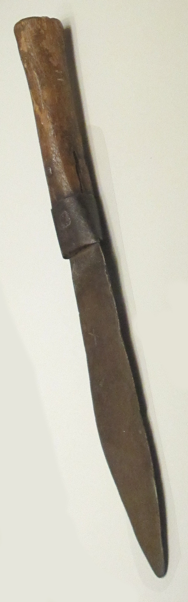

# Human-made Things in the Bible

## License Information

Human-made Things in the Bible © United Bible Societies, 2025. Adapted from: <cite>The Works of Their Hands: Man-made Things in the Bible</cite>, by Ray Pritz © 2009 United Bible Societies. This work is licensed under Creative Commons Attribution-ShareAlike 4.0 International (<a href="https://creativecommons.org/licenses/by-sa/4.0/">https://creativecommons.org/licenses/by-sa/4.0/</a>).

--------------------------------

## 标题：餐具（eating utensils） (id: REALIA:5.20)

5\.20 标题：餐具（eating utensils）
============================

在圣经时期，人们用盘和碗来盛食物吃，与今天的大多数文化相同；但他们似乎不用筷子、叉子或调羹等餐具从盘子中夹取食物，而是直接用手抓着吃。
-------------------------------------------------------------------

## 标题：碗（bowl） (id: REALIA:5.20.1)

5\.20\.1 标题：碗（bowl）
===================

经文出处
----

Hebrew 来：אַגָּן (音译：’agan)

[SNG 7:3](https://ref.ly/Song7:3), [ISA 22:24](https://ref.ly/Isa22:24)

Hebrew 来：גֻּלָּה (音译：gulah)

[ECC 12:6](https://ref.ly/Eccl12:6), [ZEC 4:2](https://ref.ly/Zech4:2), [ZEC 4:3](https://ref.ly/Zech4:3)

Hebrew 来：מִזְרָק (音译：mizraq)

[AMO 6:6](https://ref.ly/Amos6:6)

Hebrew 来：מִשְׁאֶרֶת (音译：mish’ereth)

[EXO 7:28](https://ref.ly/Exod7:28), [EXO 12:34](https://ref.ly/Exod12:34), [DEU 28:5](https://ref.ly/Deut28:5), [DEU 28:17](https://ref.ly/Deut28:17)

Hebrew 来：צְלֹחִית (音译：tslochith)

[2KI 2:20](https://ref.ly/2Kgs2:20)

Greek 希：ἀργύρωμα (音译：argurōma)

[JDT 12:1](https://ref.ly/Jdt12:1), [JDT 15:11](https://ref.ly/Jdt15:11), [1MA 15:32](https://ref.ly/1Macc15:32)

Greek 希：ὁλκεῖον (音译：holkeion)

[JDT 15:11](https://ref.ly/Jdt15:11)

Greek 希：σκάφη (音译：skafē)

[BEL 1:33](https://ref.ly/Bel1:33)

Greek 希：τρύβλιον (音译：trublion)

[MAT 26:23](https://ref.ly/Matt26:23), [MRK 14:20](https://ref.ly/Mark14:20), [SIR 31:14](https://ref.ly/Sir31:14)

Greek 希：φιάλη (音译：fialē)

[REV 5:8](https://ref.ly/Rev5:8), [REV 15:7](https://ref.ly/Rev15:7), [REV 16:1](https://ref.ly/Rev16:1), [REV 16:2](https://ref.ly/Rev16:2), [REV 16:3](https://ref.ly/Rev16:3), [REV 16:4](https://ref.ly/Rev16:4), [REV 16:8](https://ref.ly/Rev16:8), [REV 16:10](https://ref.ly/Rev16:10), [REV 16:12](https://ref.ly/Rev16:12), [REV 16:17](https://ref.ly/Rev16:17), [REV 17:1](https://ref.ly/Rev17:1), [REV 21:9](https://ref.ly/Rev21:9), [EXO 27:3](https://ref.ly/Exod27:3), [EXO 38:23](https://ref.ly/Exod38:23), [NUM 4:14](https://ref.ly/Num4:14), [NUM 7:13](https://ref.ly/Num7:13), [NUM 7:19](https://ref.ly/Num7:19), [NUM 7:25](https://ref.ly/Num7:25), [NUM 7:31](https://ref.ly/Num7:31), [NUM 7:37](https://ref.ly/Num7:37), [NUM 7:43](https://ref.ly/Num7:43), [NUM 7:49](https://ref.ly/Num7:49), [NUM 7:55](https://ref.ly/Num7:55), [NUM 7:61](https://ref.ly/Num7:61), [NUM 7:67](https://ref.ly/Num7:67), [NUM 7:73](https://ref.ly/Num7:73), [NUM 7:79](https://ref.ly/Num7:79), [NUM 7:84](https://ref.ly/Num7:84), [NUM 7:85](https://ref.ly/Num7:85), [1KI 7:26](https://ref.ly/1Kgs7:26), [1KI 7:31](https://ref.ly/1Kgs7:31), [1KI 7:36](https://ref.ly/1Kgs7:36), [2KI 12:14](https://ref.ly/2Kgs12:14), [2KI 25:14](https://ref.ly/2Kgs25:14), [2KI 25:15](https://ref.ly/2Kgs25:15), [1CH 28:17](https://ref.ly/1Chr28:17), [2CH 4:8](https://ref.ly/2Chr4:8), [2CH 4:21](https://ref.ly/2Chr4:21), [PRO 23:31](https://ref.ly/Prov23:31), [SNG 5:13](https://ref.ly/Song5:13), [SNG 6:2](https://ref.ly/Song6:2), [JER 52:18](https://ref.ly/Jer52:18), [ZEC 9:15](https://ref.ly/Zech9:15), [ZEC 14:20](https://ref.ly/Zech14:20), [1MA 1:22](https://ref.ly/1Macc1:22), [1ES 2:10](https://ref.ly/1Esd2:10)

Greek 希：χρύσωμα (音译：chrusōma)

[1MA 15:32](https://ref.ly/1Macc15:32)

描述和用途
-----

碗是一种凹形餐具，用来盛放、烹煮食物或液体，直径和深度差别很大。碗通常是用烧制的黏土做成的，但[REV 5:8](https://ref.ly/Rev5:8) 特别提到金子做的碗。由于碗的大小和深度颇不相同，而杯子又通常没有把手，所以较小的碗和杯子看起来基本上没有什么区别。[5\.20\.3 杯子 (cup)\<REALIA:5\.20\.3\>](#) 下的第一个插图也绘出了碗。

---

翻译
--

在[ZEC 4:2](https://ref.ly/Zech4:2) 中，读者可能不会立时明白碗（希伯来文*gulah* ；《和修》“灯座”）的用途。我们建议翻译者借鉴GNT (Good News Translation (1992)) ，译为“顶上有用来装油的碗”。

[AMO 6:6](https://ref.ly/Amos6:6) 中提到的碗是专门用来喝酒的（参[5\.20\.3 杯子 (cup)\<REALIA:5\.20\.3\>](#) ）。翻译这节经文时，可能要根据当地文化做出适当的调整。例如，在一些文化中，可以使用表示某种大葫芦的词语，或者使用葫芦的统称，并用“大”和“满”等词语加以修饰。

希伯来文*mish’ereth* 指的是一种大碗，用来揉面和发酵，然后进行烘烤。大多数译本译为“揉面碗”（“kneading bowls”；RSV (Revised Standard Version (1952)) 、NJPSV (New Jewish Publication Society Version) ）或“揉面槽”（“kneading troughs”；NIV (New International Version (1984)) 、REB (Revised English Bible (1989)) ）。GNT (Good News Translation (1992)) 的“baking pans”（“烤盘”）可能会误导读者。如果没有表示这种碗的专门词语，或者这种碗不为人所熟知，翻译者可以遵循CEV (Contemporary English Version) 的范例，译为“bowls of bread dough”（“面团碗”）。

在[MAT 26:23](https://ref.ly/Matt26:23) 和[MRK 14:20](https://ref.ly/Mark14:20) 中，希腊文*trublion* 可以理解为一句惯用语的一部分，这个惯用语的字面意思是，“和某人一起把手伸进碗里”。大多数译本基本上是按照字面来翻译这个惯用语的，但这可能会让读者产生误解，以为人是把手指放到碗里，而不是用手拿着食物在碗里蘸一下。如果翻译者想要在某种程度上直译这个惯用语，最好译成“和某人一起把食物在碗里蘸一下”，或“一起把食物在酱汁里蘸一下”。我们建议把这个惯用语译为：“和某人分享餐食”，或“和某人一起吃饭”。[MRK 14:20](https://ref.ly/Mark14:20) 的后半节可译为，“一个正和我一起在这个盘子里吃饭的人”（如CEV (Contemporary English Version) ），或“正和我一起吃饭的一个人”（如NLT (New Living Translation) ）。

[1MA 15:32](https://ref.ly/1Macc15:32) ：希腊文*chrusōma* 的字面意思是“黄金物件”。然而，该词在这里指的是金或镀金的餐具。GNT (Good News Translation (1992)) 和NRSV (New Revised Standard Version (1989)) 译为“gold\[en] bowls”（“金碗”）。

* **Associated Passages:** 雅歌 7:3; 以赛亚书 22:24; 传道书 12:6; 撒迦利亚书 4:2; 撒迦利亚书 4:3; 阿摩司书 6:6; 出埃及记 7:28; 出埃及记 12:34; 申命记 28:5; 申命记 28:17; 列王纪下 2:20; 友弟德传 12:1; 友弟德传 15:11; 玛加伯上 15:32; 彼勒与大龙 1:33; 马太福音 26:23; 马可福音 14:20; 德训篇 31:14; 启示录 5:8; 启示录 15:7; 启示录 16:1; 启示录 16:2; 启示录 16:3; 启示录 16:4; 启示录 16:8; 启示录 16:10; 启示录 16:12; 启示录 16:17; 启示录 17:1; 启示录 21:9; 出埃及记 27:3; 出埃及记 38:23; 民数记 4:14; 民数记 7:13; 民数记 7:19; 民数记 7:25; 民数记 7:31; 民数记 7:37; 民数记 7:43; 民数记 7:49; 民数记 7:55; 民数记 7:61; 民数记 7:67; 民数记 7:73; 民数记 7:79; 民数记 7:84; 民数记 7:85; 列王纪上 7:26; 列王纪上 7:31; 列王纪上 7:36; 列王纪下 12:14; 列王纪下 25:14; 列王纪下 25:15; 历代志上 28:17; 历代志下 4:8; 历代志下 4:21; 箴言 23:31; 雅歌 5:13; 雅歌 6:2; 耶利米书 52:18; 撒迦利亚书 9:15; 撒迦利亚书 14:20; 玛加伯上 1:22; 厄斯德拉上 2:10

* **Associated ACAI Concepts:** Bowl (ID: `realia:Bowl.2`)

## 标题：盘子（plate, platter） (id: REALIA:5.20.2)

5\.20\.2 标题：盘子（plate, platter）
==============================

经文出处
----

Hebrew 来：צַלַּחַת (音译：tsalachath)

[2KI 21:13](https://ref.ly/2Kgs21:13), [PRO 19:24](https://ref.ly/Prov19:24), [PRO 26:15](https://ref.ly/Prov26:15)

Greek 希：παροψίς (音译：paropsis)

[MAT 23:25](https://ref.ly/Matt23:25)

Greek 希：πίναξ (音译：pinax)

[MAT 14:8](https://ref.ly/Matt14:8), [MAT 14:11](https://ref.ly/Matt14:11), [MRK 6:25](https://ref.ly/Mark6:25), [MRK 6:28](https://ref.ly/Mark6:28), [LUK 11:39](https://ref.ly/Luke11:39)

描述和用途
-----

*大盘子 (Gary Todd, Israel Museum, CC0, via Wikimedia Commons)*

盘子是一种扁平的餐具，人们用来吃饭或盛食物。盘子通常是由黏土烧制而成，但王室和富人的餐具可能是用贵重金属做成的。

---

翻译
--

[PRO 19:24](https://ref.ly/Prov19:24); [PRO 26:15](https://ref.ly/Prov26:15) ：这两节经文描述懒惰人把手放在盘子里，但却不举到嘴边。在许多文化中，这句话可能会被读者误以为他懒得去拿叉子，而是直接用手来抓食物。然而，这不是该则箴言的重点。在当时，用手拿东西吃是正常的。这个人的懒惰在于他甚至不愿抬起手把食物送到嘴里！翻译者要把重点放在这个人懒惰的真正含义上。GNT (Good News Translation (1992)) 和CEV (Contemporary English Version) 为[PRO 19:24](https://ref.ly/Prov19:24) 提供了两个很好的翻译范例：GNT (Good News Translation (1992)) 英文意为“有些人甚至懒得把食物放到嘴里”，CEV (Contemporary English Version) 则作“有些人甚至懒得伸手吃饭”。

[MAT 14:8](https://ref.ly/Matt14:8) ：希腊文*pinax* 可以泛指任何扁平的盘子；该词最初的意思是“板”或“厚板”。如果目标语言的文化通常不使用盘子，那么可以译作“碗”或其他通常用来盛食物的器皿。

* **Associated Passages:** 列王纪下 21:13; 箴言 19:24; 箴言 26:15; 马太福音 23:25; 马太福音 14:8; 马太福音 14:11; 马可福音 6:25; 马可福音 6:28; 路加福音 11:39

* **Associated ACAI Concepts:** Plate (ID: `realia:Plate.2`)

## 标题：杯子（cup） (id: REALIA:5.20.3)

5\.20\.3 标题：杯子（cup）
===================

经文出处
----

Hebrew 来：גָּבִיעַ (音译：gavi‘a)

[GEN 44:2](https://ref.ly/Gen44:2), [GEN 44:2](https://ref.ly/Gen44:2), [GEN 44:12](https://ref.ly/Gen44:12), [GEN 44:16](https://ref.ly/Gen44:16), [GEN 44:17](https://ref.ly/Gen44:17), [EXO 25:31](https://ref.ly/Exod25:31), [EXO 25:33](https://ref.ly/Exod25:33), [EXO 25:33](https://ref.ly/Exod25:33), [EXO 25:34](https://ref.ly/Exod25:34), [EXO 37:17](https://ref.ly/Exod37:17), [EXO 37:19](https://ref.ly/Exod37:19), [EXO 37:19](https://ref.ly/Exod37:19), [EXO 37:20](https://ref.ly/Exod37:20), [JER 35:5](https://ref.ly/Jer35:5)

Hebrew 来：כּוֹס (音译：kos)

[GEN 40:11](https://ref.ly/Gen40:11), [GEN 40:11](https://ref.ly/Gen40:11), [GEN 40:11](https://ref.ly/Gen40:11), [GEN 40:13](https://ref.ly/Gen40:13), [GEN 40:21](https://ref.ly/Gen40:21), [2SA 12:3](https://ref.ly/2Sam12:3), [1KI 7:26](https://ref.ly/1Kgs7:26), [2CH 4:5](https://ref.ly/2Chr4:5), [PSA 11:6](https://ref.ly/Ps11:6), [PSA 16:5](https://ref.ly/Ps16:5), [PSA 23:5](https://ref.ly/Ps23:5), [PSA 75:9](https://ref.ly/Ps75:9), [PSA 116:13](https://ref.ly/Ps116:13), [PRO 23:31](https://ref.ly/Prov23:31), [ISA 51:17](https://ref.ly/Isa51:17), [ISA 51:17](https://ref.ly/Isa51:17), [ISA 51:22](https://ref.ly/Isa51:22), [ISA 51:22](https://ref.ly/Isa51:22), [JER 16:7](https://ref.ly/Jer16:7), [JER 25:15](https://ref.ly/Jer25:15), [JER 25:17](https://ref.ly/Jer25:17), [JER 25:28](https://ref.ly/Jer25:28), [JER 35:5](https://ref.ly/Jer35:5), [JER 49:12](https://ref.ly/Jer49:12), [JER 51:7](https://ref.ly/Jer51:7), [LAM 4:21](https://ref.ly/Lam4:21), [EZK 23:31](https://ref.ly/Ezek23:31), [EZK 23:32](https://ref.ly/Ezek23:32), [EZK 23:33](https://ref.ly/Ezek23:33), [EZK 23:33](https://ref.ly/Ezek23:33), [HAB 2:16](https://ref.ly/Hab2:16)

Hebrew 来：סַף (音译：saf)

[ZEC 12:2](https://ref.ly/Zech12:2)

Hebrew 来：סֵפֶל (音译：sefel)

[JDG 5:25](https://ref.ly/Judg5:25), [JDG 6:38](https://ref.ly/Judg6:38)

Greek 希：ποτήριον (音译：potērion)

[GEN 40:11](https://ref.ly/Gen40:11), [GEN 40:11](https://ref.ly/Gen40:11), [GEN 40:11](https://ref.ly/Gen40:11), [GEN 40:13](https://ref.ly/Gen40:13), [GEN 40:21](https://ref.ly/Gen40:21), [2SA 12:3](https://ref.ly/2Sam12:3), [1KI 7:12](https://ref.ly/1Kgs7:12), [2CH 4:5](https://ref.ly/2Chr4:5), [PSA 10:6](https://ref.ly/Ps10:6), [PSA 15:5](https://ref.ly/Ps15:5), [PSA 22:5](https://ref.ly/Ps22:5), [PSA 74:9](https://ref.ly/Ps74:9), [PSA 115:4](https://ref.ly/Ps115:4), [PRO 23:31](https://ref.ly/Prov23:31), [ISA 51:17](https://ref.ly/Isa51:17), [ISA 51:17](https://ref.ly/Isa51:17), [ISA 51:22](https://ref.ly/Isa51:22), [JER 16:7](https://ref.ly/Jer16:7), [JER 28:7](https://ref.ly/Jer28:7), [JER 30:6](https://ref.ly/Jer30:6), [JER 32:15](https://ref.ly/Jer32:15), [JER 32:17](https://ref.ly/Jer32:17), [JER 32:28](https://ref.ly/Jer32:28), [JER 42:5](https://ref.ly/Jer42:5), [LAM 2:13](https://ref.ly/Lam2:13), [LAM 4:21](https://ref.ly/Lam4:21), [EZK 23:31](https://ref.ly/Ezek23:31), [EZK 23:32](https://ref.ly/Ezek23:32), [EZK 23:33](https://ref.ly/Ezek23:33), [EZK 23:33](https://ref.ly/Ezek23:33), [HAB 2:16](https://ref.ly/Hab2:16), [MAT 10:42](https://ref.ly/Matt10:42), [MAT 20:22](https://ref.ly/Matt20:22), [MAT 20:23](https://ref.ly/Matt20:23), [MAT 23:25](https://ref.ly/Matt23:25), [MAT 23:26](https://ref.ly/Matt23:26), [MAT 26:27](https://ref.ly/Matt26:27), [MAT 26:39](https://ref.ly/Matt26:39), [MRK 7:4](https://ref.ly/Mark7:4), [MRK 9:41](https://ref.ly/Mark9:41), [MRK 10:38](https://ref.ly/Mark10:38), [MRK 10:39](https://ref.ly/Mark10:39), [MRK 14:23](https://ref.ly/Mark14:23), [MRK 14:36](https://ref.ly/Mark14:36), [LUK 11:39](https://ref.ly/Luke11:39), [LUK 22:17](https://ref.ly/Luke22:17), [LUK 22:20](https://ref.ly/Luke22:20), [LUK 22:20](https://ref.ly/Luke22:20), [LUK 22:42](https://ref.ly/Luke22:42), [JHN 18:11](https://ref.ly/John18:11), [1CO 10:16](https://ref.ly/1Cor10:16), [1CO 10:21](https://ref.ly/1Cor10:21), [1CO 10:21](https://ref.ly/1Cor10:21), [1CO 11:25](https://ref.ly/1Cor11:25), [1CO 11:25](https://ref.ly/1Cor11:25), [1CO 11:26](https://ref.ly/1Cor11:26), [1CO 11:27](https://ref.ly/1Cor11:27), [1CO 11:28](https://ref.ly/1Cor11:28), [REV 14:10](https://ref.ly/Rev14:10), [REV 16:19](https://ref.ly/Rev16:19), [REV 17:4](https://ref.ly/Rev17:4), [REV 18:6](https://ref.ly/Rev18:6), [ESG 1:7](https://ref.ly/EsthGr1:7), [PSS 8:14](https://ref.ly/PssSol8:14)

Greek 希：σπονδεῖον (音译：spondeion)

[SIR 50:15](https://ref.ly/Sir50:15), [1MA 1:22](https://ref.ly/1Macc1:22), [1ES 2:9](https://ref.ly/1Esd2:9), [1ES 2:9](https://ref.ly/1Esd2:9)

Greek 希：χρύσωμα (音译：chrusōma)

[1MA 11:58](https://ref.ly/1Macc11:58), [1MA 11:58](https://ref.ly/1Macc11:58), [1ES 3:6](https://ref.ly/1Esd3:6)

Latin 拉：calix

[2ES 14:39](https://ref.ly/2Esd14:39)

描述和用途
-----

杯子是用来喝东西的器皿。普通的杯子是用陶土做的，有些会进行烧制并上釉。到了新约时期，玻璃杯子已经很常见了。富人经常使用铜、银或金制成的杯子。杯子有圆柱形的，类似于现代的杯子；也有碗状的半球形。不管是哪种形状，杯子都可能有一个或两个把手，或没有把手。

---

翻译
--

*饮用容器 (© Deutsche Bibelgesellschaft, Stuttgart by United Bible Societies)*

考古学家已经发现了许多类似现代饮料杯的物品，然而在古代，人们通常用类似小碗的器具来喝东西。从历史发展的角度来看，最开始用来喝东西的器皿可能是碗。希伯来文*sefel* 指的是在碗之后出现的一种器皿。这种器皿的高度和直径差不多，还带有把手。

上面列出的几个词语都可以译为“杯子”或“碗”，各译本也体现出这一点。有些译本译为“喝东西用的碗”（“drinking bowl”）。然而，在大多数语言中，“杯子”的统称已经是足够贴近的对等词了。

在[GEN 44:0](https://ref.ly/Gen44:0) 中，希伯来文*gavi‘a* 指的是一种特殊的杯子，经文明确说这是一种银制的杯子。翻译者要避免译作用其他材料做成的饮器，例如葫芦，也不要译成用木头或黏土做成的杯子。

[MAT 10:42](https://ref.ly/Matt10:42); [MRK 9:41](https://ref.ly/Mark9:41) ：在[MRK 9:41](https://ref.ly/Mark9:41) 中，有些语言将字面意为“一杯水”（“cup of water”）的短语译成“杯中的水”；原文中的“杯”不仅表示容器，还表示水量。但是，这里“一杯水”的对等词更有可能是“一口水”（“drink of water”；GNT (Good News Translation (1992)) ）。在有些地方，“一杯水”是一种很奇怪、外来味道很浓的表达方式，因此有些翻译者可能会发现，像“一瓢水”这样的表达不仅更自然，而且在语义上也与“一口水”更相近。

[1MA 11:58](https://ref.ly/1Macc11:58) 和[1ES 3:6](https://ref.ly/1Esd3:6) 的原文字面作“用金的喝”，意思显然是“用金杯喝”或“用金的器皿喝”。

* **Associated Passages:** 创世记 44:2; 创世记 44:12; 创世记 44:16; 创世记 44:17; 出埃及记 25:31; 出埃及记 25:33; 出埃及记 25:34; 出埃及记 37:17; 出埃及记 37:19; 出埃及记 37:20; 耶利米书 35:5; 创世记 40:11; 创世记 40:13; 创世记 40:21; 撒母耳记下 12:3; 列王纪上 7:26; 历代志下 4:5; 诗篇 11:6; 诗篇 16:5; 诗篇 23:5; 诗篇 75:9; 诗篇 116:13; 箴言 23:31; 以赛亚书 51:17; 以赛亚书 51:22; 耶利米书 16:7; 耶利米书 25:15; 耶利米书 25:17; 耶利米书 25:28; 耶利米书 49:12; 耶利米书 51:7; 耶利米哀歌 4:21; 以西结书 23:31; 以西结书 23:32; 以西结书 23:33; 哈巴谷书 2:16; 撒迦利亚书 12:2; 士师记 5:25; 士师记 6:38; 列王纪上 7:12; 诗篇 10:6; 诗篇 15:5; 诗篇 22:5; 诗篇 74:9; 诗篇 115:4; 耶利米书 28:7; 耶利米书 30:6; 耶利米书 32:15; 耶利米书 32:17; 耶利米书 32:28; 耶利米书 42:5; 耶利米哀歌 2:13; 马太福音 10:42; 马太福音 20:22; 马太福音 20:23; 马太福音 23:25; 马太福音 23:26; 马太福音 26:27; 马太福音 26:39; 马可福音 7:4; 马可福音 9:41; 马可福音 10:38; 马可福音 10:39; 马可福音 14:23; 马可福音 14:36; 路加福音 11:39; 路加福音 22:17; 路加福音 22:20; 路加福音 22:42; 约翰福音 18:11; 哥林多前书 10:16; 哥林多前书 10:21; 哥林多前书 11:25; 哥林多前书 11:26; 哥林多前书 11:27; 哥林多前书 11:28; 启示录 14:10; 启示录 16:19; 启示录 17:4; 启示录 18:6; 以斯帖记补篇 1:7; 所罗门诗篇 8:14; 德训篇 50:15; 玛加伯上 1:22; 厄斯德拉上 2:9; 玛加伯上 11:58; 厄斯德拉上 3:6; 厄斯德拉下 14:39; 创世记 44:0

* **Associated ACAI Concepts:** Cup (ID: `realia:Cup`)

## 标题：刀（knife） (id: REALIA:5.20.4)

5\.20\.4 标题：刀（knife）
====================

经文出处
----

Hebrew 来：חֶרֶב, צוּר (音译：cherev tsur)

[JOS 5:2](https://ref.ly/Josh5:2), [JOS 5:3](https://ref.ly/Josh5:3)

Hebrew 来：מַאֲכֶלֶת (音译：ma’akeleth)

[GEN 22:6](https://ref.ly/Gen22:6), [GEN 22:10](https://ref.ly/Gen22:10), [JDG 19:29](https://ref.ly/Judg19:29), [PRO 30:14](https://ref.ly/Prov30:14)

Hebrew 来：שַׂכִּין (音译：sakin)

[PRO 23:2](https://ref.ly/Prov23:2)

描述和用途
-----

*铁制和木制刀，字母洞穴（Cave of the Letters），哈尔赫贝耳（Nahal Hever）（公元132–135年），以色列博物馆 (© Chamberi, CC BY\-SA 3\.0, via Wikimedia Commons)*

刀是带柄的小刀片，用来切肉和其他食物。

---

翻译
--

上面列出的希伯来文词语指的是一种锋利的刀，可能带尖。翻译者应避免使用仅指较钝的刀的词语，例如用来把果酱等物涂到面包上面的那种刀。

[JOS 5:2](https://ref.ly/Josh5:2); [JOS 5:3](https://ref.ly/Josh5:3) ：希伯来文*cherev* 通常指剑（参[2\.3 刀剑 (sword)\<REALIA:2\.3\>](#) ）。这里的语境是施行精密的割礼手术，所以显然是一把较小的刀具。希伯来文修饰语*tsur* 表明这种刀是用一种非常坚硬的石英石（燧石）制成的。从远古时代起，人们就使用由燧石制成的工具和武器，通过剥片获得锋利的边缘。

* **Associated Passages:** 约书亚记 5:2; 约书亚记 5:3; 创世记 22:6; 创世记 22:10; 士师记 19:29; 箴言 30:14; 箴言 23:2

* **Associated ACAI Concepts:** Knife (ID: `realia:Knife`)
