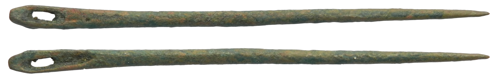
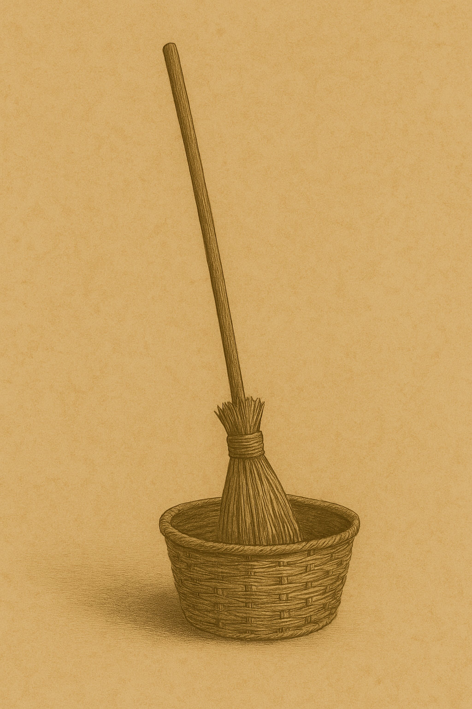

# Human-made Things in the Bible

## License Information

Human-made Things in the Bible © United Bible Societies, 2025. Adapted from: <cite>The Works of Their Hands: Man-made Things in the Bible</cite>, by Ray Pritz © 2009 United Bible Societies. This work is licensed under Creative Commons Attribution-ShareAlike 4.0 International (<a href="https://creativecommons.org/licenses/by-sa/4.0/">https://creativecommons.org/licenses/by-sa/4.0/</a>).

--------------------------------

## 标题：其他家居用品 (id: REALIA:5.21)

5\.21 标题：其他家居用品
===============

## 标题：针（needle） (id: REALIA:5.21.1)

5\.21\.1 标题：针（needle）
=====================

经文出处
----

Greek 希：βελόνη (音译：belonē)

[LUK 18:25](https://ref.ly/Luke18:25)

Greek 希：ῥαφίς (音译：rhafis)

[MAT 19:24](https://ref.ly/Matt19:24), [MRK 10:25](https://ref.ly/Mark10:25)

描述和用途
-----

*罗马针（利物浦国家博物馆（National Museums Liverpool）） (© Portable Antiquities Scheme, CC BY\-SA 4\.0, via Wikimedia Commons)*

针是一种非常光滑的细小工具，一端很尖，另一端有孔。在缝纫时，针引着线穿过布料。针可以用金属、骨头，甚至坚硬的荆棘做成。

---

翻译
--

若说[MAT 19:24](https://ref.ly/Matt19:24) 、[MRK 10:25](https://ref.ly/Mark10:25) 和[LUK 18:25](https://ref.ly/Luke18:25) 中的“针眼”是喻指窄门，这种观点并没有充分的证据。骆驼穿过针眼是一种夸张修辞，强调与其进行比较的事情是极难实现的。耶稣选择了以色列人所知的最大陆地生物和最小的人造孔来表达这种难度。针上的孔在不同语言中有不同的叫法，例如，“针孔”、“针耳”、“针嘴”，甚至“针屁股”。

* **Associated Passages:** 路加福音 18:25; 马太福音 19:24; 马可福音 10:25

* **Associated ACAI Concepts:** Needle (ID: `realia:Needle`)

## 标题：扫帚（broom） (id: REALIA:5.21.2)

5\.21\.2 标题：扫帚（broom）
=====================

经文出处
----

Hebrew 来：מַטְאֲטֵא (音译：mat’ate’)

[ISA 14:23](https://ref.ly/Isa14:23)

描述和用途
-----

*(Image generated by ChatGPT using OpenAI technology)*

扫帚是一种清扫灰尘的工具，在杆子的一端固定一些柔软有弹性的东西，如小树枝等。扫帚的杆子有长有短。

---

翻译
--

希伯来文*mat’ate’* 也见于经外文献，但在圣经中，这个词仅出现在[ISA 14:23](https://ref.ly/Isa14:23) 。在《以赛亚书》的这节经文中，这个词指一种用于毁灭和审判的工具，大多数译本根据字面意思将这个词译为“毁灭的扫帚”（“broom of destruction”；RSV (Revised Standard Version (1952)) 、NIV (New International Version (1984)) ）。如果当地文化没有类似的工具，或者“毁灭性的扫把”这种说法听起来很奇怪，翻译者可以借鉴CEV (Contemporary English Version) ，将后半节经文译为，“上帝必除尽百姓。”

* **Associated Passages:** 以赛亚书 14:23

* **Associated ACAI Concepts:** Broom (ID: `flora:Broom`)

## 标题：（墙上的）钉子、橛子（peg [on a wall]） (id: REALIA:5.21.3)

5\.21\.3 标题：（墙上的）钉子、橛子（peg \[on a wall]）
========================================

经文出处
----

Hebrew 来：יָתֵד (音译：yathed)

[ISA 22:23](https://ref.ly/Isa22:23), [ISA 22:25](https://ref.ly/Isa22:25), [EZK 15:3](https://ref.ly/Ezek15:3)

描述
--

钉子是一根短木棍，一端尖锐，将其敲进墙壁的石头缝里就可以挂东西。

---

翻译
--

在[ISA 22:23](https://ref.ly/Isa22:23); [ISA 22:25](https://ref.ly/Isa22:25) 中，墙上的钉子象征稳固。参[3\.2\.2 帐棚橛、帐棚桩 (tent peg, stake)\<REALIA:3\.2\.2\>](#) 中的讨论。

* **Associated Passages:** 以赛亚书 22:23; 以赛亚书 22:25; 以西结书 15:3

* **Associated ACAI Concepts:** Peg (ID: `realia:Peg.2`); Peg (ID: `realia:Peg`)

## 标题：分娩凳（birthstool） (id: REALIA:5.21.4)

5\.21\.4 标题：分娩凳（birthstool）
===========================

经文出处
----

Hebrew 来：אָבְנַיִם (音译：’ovnayim)

[EXO 1:16](https://ref.ly/Exod1:16)

描述和用途
-----

分娩凳是一种特制的凳子，可能是由两块并排放置的石头构成，石头中间隔开一小段距离，妇女坐在上面分娩。

---

翻译
--

希伯来文*’ovnayim* 的字面意思是“一对石头”或“双石”。词典编纂者和解经家对于它在[EXO 1:16](https://ref.ly/Exod1:16) 中的含义持有不同意见。该词在[JER 18:3](https://ref.ly/Jer18:3) 指的是陶匠的轮盘（参[1\.5\.1\.1 转盘 (potter’s wheel)\<REALIA:1\.5\.1\.1\>](#) ）。词典提供了两种可能的含义：（1）可能是生殖器的委婉说法，因此[EXO 1:16](https://ref.ly/Exod1:16) 的第二句可译为“你们去查看婴儿是不是男孩”；（2）可能指分娩凳，因为它与陶匠的凳子有一些相似之处，这样此句可译为“她们分娩时，你们要仔细看着”。两种解释在这里的语境中都合适。

翻译者无需直译这个词；对于这节经文的前半节，可以借鉴GNT (Good News Translation (1992)) 译成“你们帮助希伯来妇人分娩的时候”。当然，在知道这种凳子或椅子的地方，可以使用该词，译为“当你们帮助希伯来妇人分娩，看她们坐在分娩凳上的时候”（如NIV (New International Version (1984)) ）。

* **Associated Passages:** 出埃及记 1:16; 耶利米书 18:3

* **Associated ACAI Concepts:** Birthstool (ID: `realia:Birthstool`)
