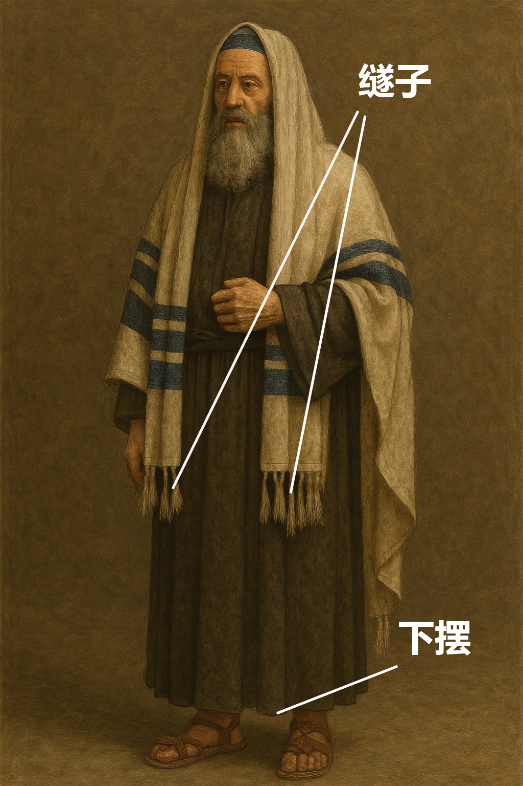

# Human-made Things in the Bible

## License Information

Human-made Things in the Bible © United Bible Societies, 2025. Adapted from: <cite>The Works of Their Hands: Man-made Things in the Bible</cite>, by Ray Pritz © 2009 United Bible Societies. This work is licensed under Creative Commons Attribution-ShareAlike 4.0 International (<a href="https://creativecommons.org/licenses/by-sa/4.0/">https://creativecommons.org/licenses/by-sa/4.0/</a>).

--------------------------------

## 标题：下摆、衣角（hem, corner of a garment） (id: REALIA:6.2.1)

6\.2\.1 标题：下摆、衣角（hem, corner of a garment）
==========================================

经文出处
----

Hebrew 来：כָּנָף (音译：kanaf)

[NUM 15:38](https://ref.ly/Num15:38), [NUM 15:38](https://ref.ly/Num15:38), [DEU 22:12](https://ref.ly/Deut22:12), [DEU 23:1](https://ref.ly/Deut23:1), [DEU 27:20](https://ref.ly/Deut27:20), [RUT 3:9](https://ref.ly/Ruth3:9), [1SA 15:27](https://ref.ly/1Sam15:27), [1SA 24:6](https://ref.ly/1Sam24:6), [1SA 24:12](https://ref.ly/1Sam24:12), [1SA 24:12](https://ref.ly/1Sam24:12), [JER 2:34](https://ref.ly/Jer2:34), [EZK 5:3](https://ref.ly/Ezek5:3), [EZK 16:8](https://ref.ly/Ezek16:8), [HAG 2:12](https://ref.ly/Hag2:12), [HAG 2:12](https://ref.ly/Hag2:12), [ZEC 8:23](https://ref.ly/Zech8:23)

描述
--

*流苏和下襬 (Image generated by ChatGPT using OpenAI technology)*

下摆是外衣最下面的褶边（参[6\.2 外衣、外袍、披风、长袍 (outer garment, cloak, mantle, robe)\<REALIA:6\.2\>](#) ）。

---

用途
--

大多数译本将[NUM 15:38](https://ref.ly/Num15:38) 和[DEU 22:12](https://ref.ly/Deut22:12)中的希伯来文*kanaf* 翻译为“衣角”（“corners”，RSV (Revised Standard Version (1952)) 、GNT (Good News Translation (1992)) ）。CEV (Contemporary English Version) 在[NUM 15:38](https://ref.ly/Num15:38) 将这个词翻译为“bottom edge”（“下摆”），也可以作为参考。

[ZEC 8:23](https://ref.ly/Zech8:23) ：希伯来文*kanaf* 表示衣服的下摆，有时也用来指整件衣服（比较[JER 2:34](https://ref.ly/Jer2:34); [EZK 16:8](https://ref.ly/Ezek16:8) ）。在这些经文中，翻译者可以选择一个表示外衣的词。[ZEC 8:23](https://ref.ly/Zech8:23) 的第一个部分可以译作：“在那些日子，十个来自不同语言的国家的人会抓住一个犹太人的衣服”（“When this happens, ten people from nations with different languages will grab a Jew by his clothes”，CEV (Contemporary English Version) ），或“那时，来自不同国家的十个人会来抓住一个犹太人的外衣”（“At that time, ten men from different countries will come and take hold of a Judean by his coat”，NCV (New Century Version) ）；另外也可以译成：“在那些日子里，十个外国人要来找一个犹太人”（“In those days ten foreigners will come to one Jew”，GNT (Good News Translation (1992)) ），不过这就丧失了抓住外衣所表达出来的紧迫感。

* **Associated Passages:** 民数记 15:38; 申命记 22:12; 申命记 23:1; 申命记 27:20; 路得记 3:9; 撒母耳记上 15:27; 撒母耳记上 24:6; 撒母耳记上 24:12; 耶利米书 2:34; 以西结书 5:3; 以西结书 16:8; 哈该书 2:12; 撒迦利亚书 8:23

## 标题：䍁子、流苏（fringe, tassel） (id: REALIA:6.2.1.1)

6\.2\.1\.1 标题：䍁子、流苏（fringe, tassel）
===================================

经文出处
----

Hebrew 来：צִיצִת (音译：tsitsith)

[NUM 15:38](https://ref.ly/Num15:38), [NUM 15:38](https://ref.ly/Num15:38), [NUM 15:39](https://ref.ly/Num15:39)

Hebrew 来：גָּדִל (音译：gadil)

[DEU 22:12](https://ref.ly/Deut22:12)

Greek 希：κράσπεδον (音译：kraspedon)

[MAT 9:20](https://ref.ly/Matt9:20), [MAT 14:36](https://ref.ly/Matt14:36), [MAT 23:5](https://ref.ly/Matt23:5), [MRK 6:56](https://ref.ly/Mark6:56), [LUK 8:44](https://ref.ly/Luke8:44)

描述
--

*流苏和下摆 (DRosenbach, Public domain, via Wikimedia Commons)*

以色列人会在长外袍的底边加上装饰性的流苏，特别是在长袍四角的其中一个角上。

---

用途
--

根据[NUM 15:37–NUM 15:41](https://ref.ly/Num15:37-Num15:41) 和[DEU 22:12](https://ref.ly/Deut22:12) 的规定，以色列人需要在外衣的四个角钉上䍁子（参[6\.1 服饰（统称）（clothing \[generic]）\<REALIA:6\.1\>](#) ）。这些䍁子提醒他们有义务遵守摩西律法的诫命。

---

翻译
--

[MAT 23:5](https://ref.ly/Matt23:5) 中的希腊文*kraspedon* 是指外衣四个角上的䍁子。另外，在*kraspedon* 用来指耶稣所穿衣服的所有经文中（[MAT 9:20](https://ref.ly/Matt9:20); [MAT 14:36](https://ref.ly/Matt14:36); [MRK 6:56](https://ref.ly/Mark6:56); [LUK 8:44](https://ref.ly/Luke8:44) ），这个词可能特指䍁子，而不是仅仅指衣服的边缘。这些经文的具体解释取决于耶稣如何理解和遵行摩西律法，以及作者如何理解*kraspedon* 的意思。

在[NUM 15:38](https://ref.ly/Num15:38) 中，对于字面意思是“衣角上的䍁子”（“tassels on the corners”，RSV (Revised Standard Version (1952)) ）的希伯来文短语，有些语言可以翻译为“带装饰的衣角”或者“衣角处的丝带”。如果目标语言没有“䍁子”一词，或者这个词含义模糊，翻译者可以采用描述性的短语；例如，NCV (New Century Version) 将这节经文的第二句译为，“Tie several pieces of thread together and attach them to the corners of your clothes”（英文直译：“将几根线绑在一起，然后系在衣角上”）。

* **Associated Passages:** 民数记 15:38; 民数记 15:39; 申命记 22:12; 马太福音 9:20; 马太福音 14:36; 马太福音 23:5; 马可福音 6:56; 路加福音 8:44; 民数记 15:37; 民数记 15:41

