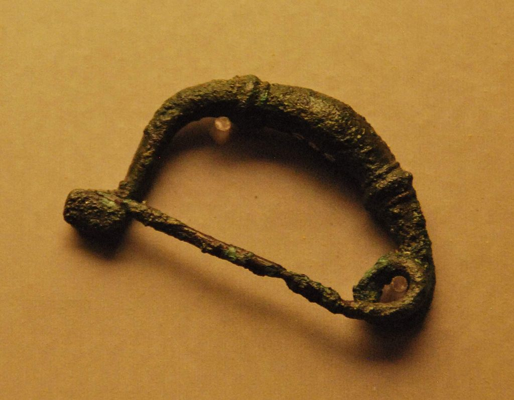

# Human-made Things in the Bible

## License Information

Human-made Things in the Bible © United Bible Societies, 2025. Adapted from: <cite>The Works of Their Hands: Man-made Things in the Bible</cite>, by Ray Pritz © 2009 United Bible Societies. This work is licensed under Creative Commons Attribution-ShareAlike 4.0 International (<a href="https://creativecommons.org/licenses/by-sa/4.0/">https://creativecommons.org/licenses/by-sa/4.0/</a>).

--------------------------------

## 标题：扣针、胸针、扣环（buckle, brooch, clasp） (id: REALIA:6.2.3)

6\.2\.3 标题：扣针、胸针、扣环（buckle, brooch, clasp）
==========================================

经文出处
----

Hebrew 来：חָח (音译：chach)

[EXO 35:22](https://ref.ly/Exod35:22)

Greek 希：πόρπη (音译：porpē)

[1MA 10:89](https://ref.ly/1Macc10:89), [1MA 11:58](https://ref.ly/1Macc11:58), [1MA 14:44](https://ref.ly/1Macc14:44)

描述和用途
-----

*长袍别针（扣针） (© Marcus Cyron, CC BY\-SA 3\.0, via Wikimedia Commons)*

扣针是一种扣环或饰针，用来把披风或长袍固定在肩部。这种扣针是尊贵地位的象征，有特权的人才能佩戴。

---

翻译
--

在有些文化中，拥有特权或荣誉的人会佩戴一种特殊的记号，可能是衣服上面的一件珠宝、项链、特别的帽子，或其他物件。翻译者可以使用这种物品来翻译所有三处经文中的希腊文*porpē* 。

在[EXO 35:22](https://ref.ly/Exod35:22) 中，希伯来文*chach* 指的是某种珠宝饰物，可能是胸针，甚至可能是戒指（参[10\.5\.1 耳环、鼻环 (earring, nose ring)\<REALIA:10\.5\.1\>](#) ）。在其他上下文中，这个词指的是穿在囚犯鼻子上的一件东西，从而强迫囚犯任人牵来牵去（参[1\.3\.3 鱼叉 (fishing spear, harpoon)\<REALIA:1\.3\.3\>](#) ）。

* **Associated Passages:** 出埃及记 35:22; 玛加伯上 10:89; 玛加伯上 11:58; 玛加伯上 14:44

