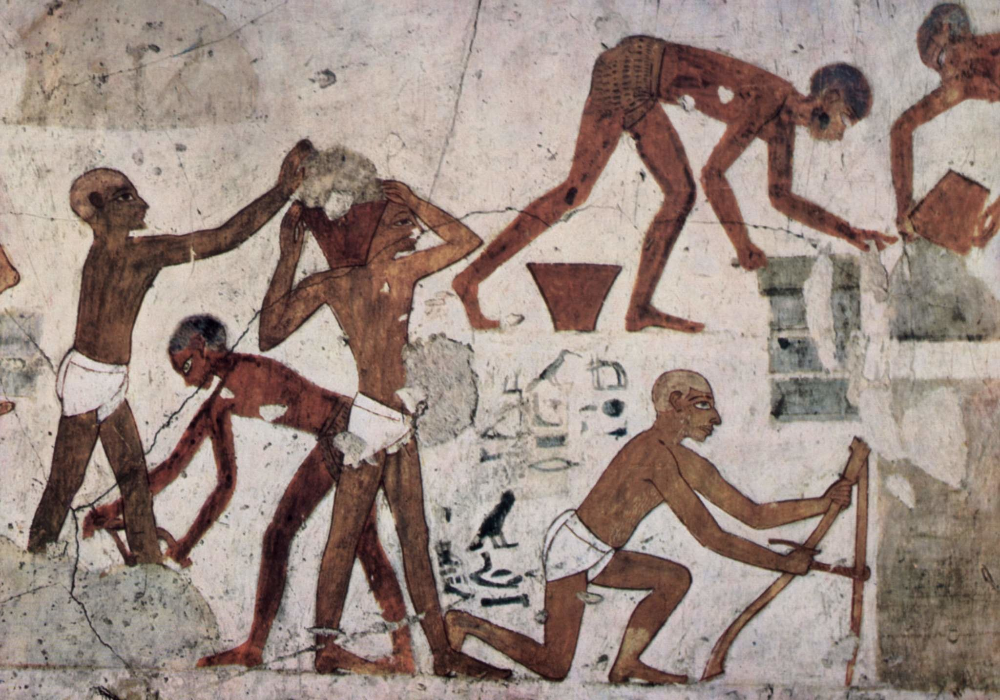

# Human-made Things in the Bible

## License Information

Human-made Things in the Bible © United Bible Societies, 2025. Adapted from: <cite>The Works of Their Hands: Man-made Things in the Bible</cite>, by Ray Pritz © 2009 United Bible Societies. This work is licensed under Creative Commons Attribution-ShareAlike 4.0 International (<a href="https://creativecommons.org/licenses/by-sa/4.0/">https://creativecommons.org/licenses/by-sa/4.0/</a>).

--------------------------------

## 标题：缠腰布、短裤（loincloth） (id: REALIA:6.4)

6\.4 标题：缠腰布、短裤（loincloth）
=========================

经文出处
----

Hebrew 来：אֵזוֹר (音译：’ezor)

[JOB 12:18](https://ref.ly/Job12:18)

Hebrew 来：חֲגוֹרָה (音译：chagorah)

[GEN 3:7](https://ref.ly/Gen3:7)

描述和用途
-----

*穿着缠腰布的工人 (Eloquence, Public domain, via Wikimedia Commons)*

缠腰布是围在腰间以遮盖私处的一块布，通常是奴隶穿的。

---

翻译
--

[JOB 12:18](https://ref.ly/Job12:18) 第二行的原文字面意思是，“他把腰带系在他们的腰上”。有些学者认为这句话的意思是：上帝在王的腰部系上宽腰带以使其刚强（参[6\.6 腰带、皮带 (waistband, sash, belt)\<REALIA:6\.6\>](#) ）。然而，更有可能的意思是：上帝除去了他们王权的象征，给他们穿上缠腰布，就是做重体力劳动时所穿的衣服，从而把他们描绘成奴隶。GNT (Good News Translation (1992)) 译为“and makes them prisoners”（英文直译：“使他们成为囚犯”）。NIV (New International Version (1984)) 采用直译：“and ties a loincloth around their waist”（“在他们的腰间系上缠腰布”）。这种译法需要提供一个说明，指明上帝是把君王降为奴隶。另外，最好说明这行经文的文化意义，译作“使他们成为奴隶”，或“在他们身上系上缠腰带，使他们成为奴隶”。整节经文可以译为：“上帝夺去君王的权柄，使他们像奴隶一样。”如果翻译者想在这节经文中保留服饰的变化，那么可以说，“上帝夺去君王的王袍，给他们穿上奴隶的缠腰布。”

以下内容改写自《〈创世记〉手册》（*A Handbook on Genesis* ，第86页）对[GEN 3:7](https://ref.ly/Gen3:7) 中的希伯来文*chagorah* 的注解：这个希伯来文词语指的是围在腰部或臀部的某物。RSV (Revised Standard Version (1952)) 在这里将这个词译为“aprons”（“围裙”），但这样翻译在英文和中文里面都不太合适，因为围裙通常是为了某个特定目的或是在特定场合穿的，并不是平常穿的衣服。有些语言需要分别译成“男人的缠腰布”和“女人的缠腰布”，因为两者的用语是不同的。这些缠腰布的确切样式还不清楚，所以最好使用比较一般性的词语，如“遮盖物”，或者把这一节的后半部分译为“他们把树叶编在一起，遮盖他们的私处。”有一个英文译本将整句译为：“So they\-two sewed together fig leaves and put them on like a skirt to hide their bare skin”（英文直译：“于是，他们两个人把无花果树叶缝在一起，像裙子一样穿上，以遮盖他们裸露的皮肤”）。

* **Associated Passages:** 约伯记 12:18; 创世记 3:7

