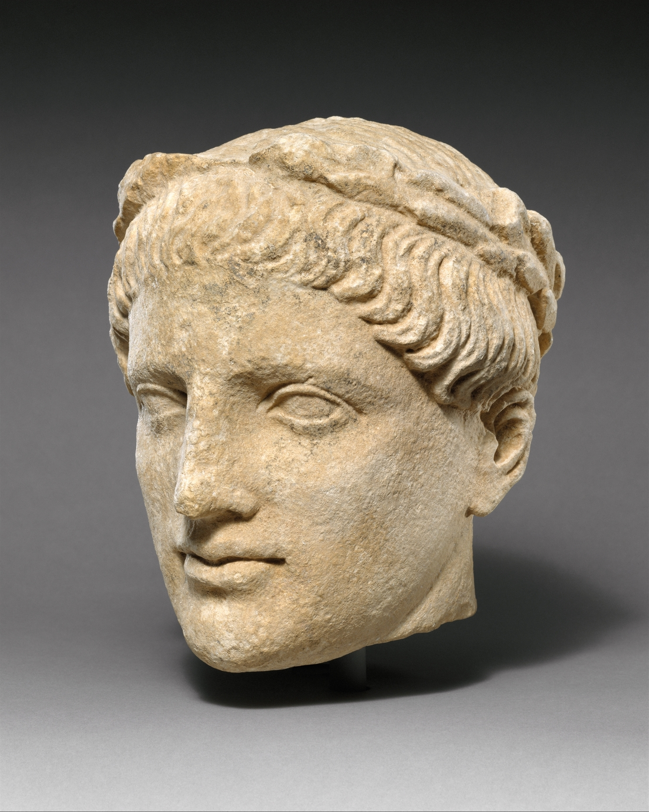
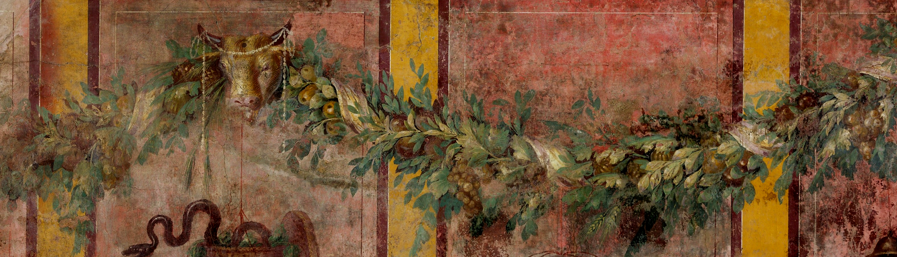

# Human-made Things in the Bible

## License Information

Human-made Things in the Bible © United Bible Societies, 2025. Adapted from: <cite>The Works of Their Hands: Man-made Things in the Bible</cite>, by Ray Pritz © 2009 United Bible Societies. This work is licensed under Creative Commons Attribution-ShareAlike 4.0 International (<a href="https://creativecommons.org/licenses/by-sa/4.0/">https://creativecommons.org/licenses/by-sa/4.0/</a>).

--------------------------------

## 标题：花环、王冠（wreath, crown） (id: REALIA:6.8)

6\.8 标题：花环、王冠（wreath, crown）
============================

经文出处
----

Hebrew 来：לִוְיָה (音译：liwyah)

[PRO 1:9](https://ref.ly/Prov1:9), [PRO 4:9](https://ref.ly/Prov4:9)

Hebrew 来：צְפִירָה (音译：tsefirah)

[ISA 28:5](https://ref.ly/Isa28:5)

Greek 希：κισσός (音译：kissos)

[2MA 6:7](https://ref.ly/2Macc6:7)

Greek 希：στεφανηφορέω (音译：stefanēforeō（动词）)

[WIS 4:2](https://ref.ly/Wis4:2)

Greek 希：στέφανος, στεφανόω (音译：stefanos, stefanoō（动词）)

[1CO 9:25](https://ref.ly/1Cor9:25), [PHP 4:1](https://ref.ly/Phil4:1), [1TH 2:19](https://ref.ly/1Thess2:19), [2TI 2:5](https://ref.ly/2Tim2:5), [2TI 4:8](https://ref.ly/2Tim4:8), [JAS 1:12](https://ref.ly/Jas1:12), [1PE 5:4](https://ref.ly/1Pet5:4), [REV 2:10](https://ref.ly/Rev2:10), [REV 3:11](https://ref.ly/Rev3:11), [JDT 15:13](https://ref.ly/Jdt15:13), [JDT 3:7](https://ref.ly/Jdt3:7), [JDT 15:13](https://ref.ly/Jdt15:13), [ESG 8:15](https://ref.ly/EsthGr8:15), [SIR 1:11](https://ref.ly/Sir1:11), [SIR 1:18](https://ref.ly/Sir1:18), [SIR 6:31](https://ref.ly/Sir6:31), [SIR 15:6](https://ref.ly/Sir15:6), [SIR 25:6](https://ref.ly/Sir25:6), [SIR 32:2](https://ref.ly/Sir32:2), [SIR 45:12](https://ref.ly/Sir45:12), [SIR 50:12](https://ref.ly/Sir50:12), [LJE 1:8](https://ref.ly/EpJer1:8), [1MA 1:22](https://ref.ly/1Macc1:22), [1MA 4:57](https://ref.ly/1Macc4:57), [1MA 10:20](https://ref.ly/1Macc10:20), [3MA 3:28](https://ref.ly/3Macc3:28), [4MA 17:15](https://ref.ly/4Macc17:15), [PSS 8:17](https://ref.ly/PssSol8:17)

Greek 希：στέφος (音译：stefos)

[3MA 4:8](https://ref.ly/3Macc4:8)

Greek 希：στέφω (音译：stefō（动词）)

[WIS 2:8](https://ref.ly/Wis2:8)

Latin 拉：corona

[2ES 2:43](https://ref.ly/2Esd2:43), [2ES 2:46](https://ref.ly/2Esd2:46)

Latin 拉：corono（动词）

[2ES 2:45](https://ref.ly/2Esd2:45)

描述和用途
-----

*头戴花环的男人 (Public Domain Wikimedia Commons)*

花环是把叶子或叶子形状的贵重金属做成一个环，戴在头顶上，作为荣誉或胜利的象征，或者作为身处高位的标志。关于王冠，请参阅[1\.10\.2 冠冕、王冠 (crown)\<REALIA:1\.10\.2\>](#) 。

---

翻译
--

在有些经文中，翻译者需要清楚说明戴在头上的花环的意义，例如译成“表示胜利的花环”。如果仅仅把“花环”描述为“一圈叶子”，就很难充分表达出它的文化意义。为了清楚表达花环的文化涵义，可能需要添加一个旁注。

在有些语言中，“王冠”一词只是王权统治的象征，而不是表示对胜利的奖赏。因此，在有些经文中，将“王冠”翻译成“奖品”或“奖赏”可能更好；例如，[JAS 1:12](https://ref.ly/Jas1:12) 有一个希腊文短语的字面意思是，“他必得到生命的冠冕”（“he will receive the crown of life”，RSV (Revised Standard Version (1952)) ），由于上下文不涉及王权统治，所以CEV (Contemporary English Version) 将其译为“He will reward you with a glorious life”（英文直译：“他将赏赐你一个荣耀的生命”）。

*来自范尼乌斯\-辛尼斯托（P. Fannius Synistor）别墅L厅西墙的壁画（博斯科雷亚莱（Boscoreale），罗马，约公元前50–40年） (Metropolitan Museum of Art, Public domain)*

[PHP 4:1](https://ref.ly/Phil4:1) ：保罗在这里称腓立比教会为“我的冠冕”。在有些语言中，翻译者可以保留这个比喻，译成“你们就像我头上的冠冕”。但是，这种译法有时会被误解；例如，读者可能将其理解为“你们是我头上的重物”，即一种精神负担。另外，翻译者也可以译成“我为你们感到骄傲!”（“how proud I am of you!”，GNT (Good News Translation (1992)) ），“我总是很乐意告诉别人关于你们的事”，以及“我常为你们夸口”。对于字面义为“我的喜乐和冠冕”这个表达，CEV (Contemporary English Version) 找到了一个非常相近的英文惯用语：“You are my pride and joy”（英文直译：“你们是我的骄傲和喜乐”）。

* **Associated Passages:** 箴言 1:9; 箴言 4:9; 以赛亚书 28:5; 玛加伯下 6:7; 智慧篇 4:2; 哥林多前书 9:25; 腓立比书 4:1; 帖撒罗尼迦前书 2:19; 提摩太后书 2:5; 提摩太后书 4:8; 雅各书 1:12; 彼得前书 5:4; 启示录 2:10; 启示录 3:11; 友弟德传 15:13; 友弟德传 3:7; 以斯帖记补篇 8:15; 德训篇 1:11; 德训篇 1:18; 德训篇 6:31; 德训篇 15:6; 德训篇 25:6; 德训篇 32:2; 德训篇 45:12; 德训篇 50:12; 耶利米书信 1:8; 玛加伯上 1:22; 玛加伯上 4:57; 玛加伯上 10:20; 玛加伯三书 3:28; 玛加伯四书 17:15; 所罗门诗篇 8:17; 玛加伯三书 4:8; 智慧篇 2:8; 厄斯德拉下 2:43; 厄斯德拉下 2:46; 厄斯德拉下 2:45

