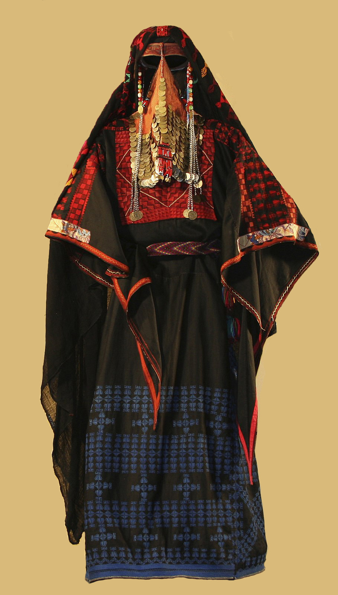

# Human-made Things in the Bible

## License Information

Human-made Things in the Bible © United Bible Societies, 2025. Adapted from: <cite>The Works of Their Hands: Man-made Things in the Bible</cite>, by Ray Pritz © 2009 United Bible Societies. This work is licensed under Creative Commons Attribution-ShareAlike 4.0 International (<a href="https://creativecommons.org/licenses/by-sa/4.0/">https://creativecommons.org/licenses/by-sa/4.0/</a>).

--------------------------------

## 标题：面纱、帕子（veil） (id: REALIA:6.12)

6\.12 标题：面纱、帕子（veil）
====================

经文出处
----

Hebrew 来：מַסְוֶה (音译：masweh)

[EXO 34:33](https://ref.ly/Exod34:33), [EXO 34:34](https://ref.ly/Exod34:34), [EXO 34:35](https://ref.ly/Exod34:35)

Hebrew 来：מִסְפָּחָה (音译：mispachah)

[EZK 13:18](https://ref.ly/Ezek13:18), [EZK 13:21](https://ref.ly/Ezek13:21)

Hebrew 来：צַמָּה (音译：tsamah)

[SNG 4:1](https://ref.ly/Song4:1), [SNG 4:3](https://ref.ly/Song4:3), [SNG 6:7](https://ref.ly/Song6:7), [ISA 47:2](https://ref.ly/Isa47:2)

Hebrew 来：צָעִיף (音译：tsa‘if)

[GEN 24:65](https://ref.ly/Gen24:65), [GEN 38:14](https://ref.ly/Gen38:14), [GEN 38:19](https://ref.ly/Gen38:19)

Hebrew 来：רְדִיד (音译：rdid)

[SNG 5:7](https://ref.ly/Song5:7), [ISA 3:23](https://ref.ly/Isa3:23)

Hebrew 来：רְעָלָה (音译：r‘alah)

[ISA 3:19](https://ref.ly/Isa3:19)

Greek 希：κάλυμμα (音译：kalumma)

[2CO 3:13](https://ref.ly/2Cor3:13), [2CO 3:14](https://ref.ly/2Cor3:14), [2CO 3:15](https://ref.ly/2Cor3:15), [2CO 3:16](https://ref.ly/2Cor3:16)

描述和用途
-----

*婚纱和面纱（贝特杰布林（Beit Jebrin），希伯仑西北部） (© Trjames, CC BY\-SA 3\.0, via Wikimedia Commons)*

面纱是蒙在脸上的一块薄布。面料非常轻薄，佩戴者即便用它遮住眼睛（和这里的插图不同），也仍然能够透过它看到外面，但别人很难透过面纱看清其面貌。

---

翻译
--

如果目标语言没有“面纱”一词，那么可以使用描述性的短语，如“遮住脸部的薄布”。为了更好地表达意思，翻译者可以在必要时扩展译文；NCV (New Century Version) 把[GEN 38:14](https://ref.ly/Gen38:14) 的第二个分句翻译为，“covered her face with a veil to hide who she was”（英文直译：“用面纱遮住自己的脸，不让别人认出她是谁”）。

翻译者应该知道，在较早的英文译本中，“veil”（“面纱”）一词也用来指称隔开圣所与至圣所的幔子，这只是一个历史上的偶然情况，（参[3\.14\.1\.6 幔子、帷幔、帷帐 (curtain, veil, drape)\<REALIA:3\.14\.1\.6\>](#) ）。因此，翻译者不必使用同一个译词来表示这两种不同的东西。

[EZK 13:18](https://ref.ly/Ezek13:18); [EZK 13:21](https://ref.ly/Ezek13:21) ：希伯来文*mispachah* 指的是一种几乎从头垂到脚的长面纱。

在[SNG 5:7](https://ref.ly/Song5:7) 和[ISA 3:23](https://ref.ly/Isa3:23) 中，希伯来文*rdid* 可能指一种不是仅仅盖住面部的长面纱。*Mispachah* 和*rdid* 与一些穆斯林妇女所戴的*niqab* 或*burqah* 相似。

* **Associated Passages:** 出埃及记 34:33; 出埃及记 34:34; 出埃及记 34:35; 以西结书 13:18; 以西结书 13:21; 雅歌 4:1; 雅歌 4:3; 雅歌 6:7; 以赛亚书 47:2; 创世记 24:65; 创世记 38:14; 创世记 38:19; 雅歌 5:7; 以赛亚书 3:23; 以赛亚书 3:19; 哥林多后书 3:13; 哥林多后书 3:14; 哥林多后书 3:15; 哥林多后书 3:16

