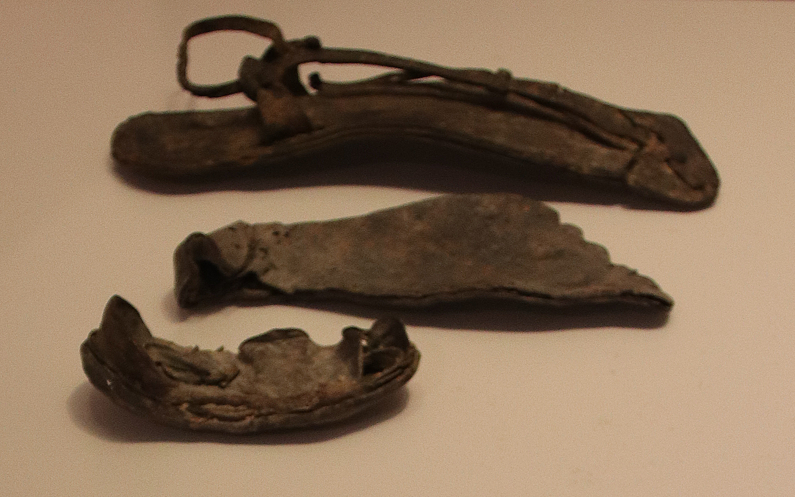

# Human-made Things in the Bible

## License Information

Human-made Things in the Bible © United Bible Societies, 2025. Adapted from: <cite>The Works of Their Hands: Man-made Things in the Bible</cite>, by Ray Pritz © 2009 United Bible Societies. This work is licensed under Creative Commons Attribution-ShareAlike 4.0 International (<a href="https://creativecommons.org/licenses/by-sa/4.0/">https://creativecommons.org/licenses/by-sa/4.0/</a>).

--------------------------------

## 标题：凉鞋、鞋（sandal, shoe） (id: REALIA:6.13)

6\.13 标题：凉鞋、鞋（sandal, shoe）
===========================

经文出处
----

Hebrew 来：נַעַל, נעל (音译：na‘al)

[GEN 14:23](https://ref.ly/Gen14:23), [EXO 3:5](https://ref.ly/Exod3:5), [EXO 12:11](https://ref.ly/Exod12:11), [DEU 25:9](https://ref.ly/Deut25:9), [DEU 25:10](https://ref.ly/Deut25:10), [DEU 29:4](https://ref.ly/Deut29:4), [JOS 5:15](https://ref.ly/Josh5:15), [JOS 9:5](https://ref.ly/Josh9:5), [JOS 9:13](https://ref.ly/Josh9:13), [RUT 4:7](https://ref.ly/Ruth4:7), [RUT 4:8](https://ref.ly/Ruth4:8), [1KI 2:5](https://ref.ly/1Kgs2:5), [2CH 28:15](https://ref.ly/2Chr28:15), [PSA 60:10](https://ref.ly/Ps60:10), [PSA 108:10](https://ref.ly/Ps108:10), [SNG 7:2](https://ref.ly/Song7:2), [ISA 5:27](https://ref.ly/Isa5:27), [ISA 11:15](https://ref.ly/Isa11:15), [ISA 20:2](https://ref.ly/Isa20:2), [EZK 16:10](https://ref.ly/Ezek16:10), [EZK 24:17](https://ref.ly/Ezek24:17), [EZK 24:23](https://ref.ly/Ezek24:23), [AMO 2:6](https://ref.ly/Amos2:6), [AMO 8:6](https://ref.ly/Amos8:6)

Greek 希：σανδάλιον (音译：sandalion)

[MRK 6:9](https://ref.ly/Mark6:9), [ACT 12:8](https://ref.ly/Acts12:8), [JDT 10:4](https://ref.ly/Jdt10:4), [JDT 16:9](https://ref.ly/Jdt16:9)

Greek 希：ὑπόδημα, ὑποδέομαι (音译：hupodēma, hupodeomai（动词）)

[MAT 3:11](https://ref.ly/Matt3:11), [MAT 10:10](https://ref.ly/Matt10:10), [MRK 1:7](https://ref.ly/Mark1:7), [MRK 6:9](https://ref.ly/Mark6:9), [LUK 3:16](https://ref.ly/Luke3:16), [LUK 10:4](https://ref.ly/Luke10:4), [LUK 15:22](https://ref.ly/Luke15:22), [LUK 22:35](https://ref.ly/Luke22:35), [JHN 1:27](https://ref.ly/John1:27), [ACT 12:8](https://ref.ly/Acts12:8), [ACT 7:33](https://ref.ly/Acts7:33), [ACT 13:25](https://ref.ly/Acts13:25), [EPH 6:15](https://ref.ly/Eph6:15), [SIR 46:19](https://ref.ly/Sir46:19)

描述和用途
-----

*马撒大（Masada）北部宫殿的皮凉鞋，公元73年 (Gary Todd, Israel Museum, CC0, via Wikimedia Commons)*

凉鞋是一种步行鞋，鞋底用皮革（也可能是木头）制成，在脚踝处用皮带子固定。

---

翻译
--

有时，“凉鞋”一词是指特别贫穷的人所穿的鞋，有时仅指休闲或运动时穿的鞋。如果是这种情况，翻译者最好使用鞋的统称，其中包含了凉鞋。

*马撒大（Masada）北部宫殿的皮凉鞋，公元73年 (Gary Todd, Israel Museum, CC0, via Wikimedia Commons)*

在圣经时期，凉鞋不像大多数现代的凉鞋那样是搭扣的，而是用带子绕着脚踝系牢。在提到穿鞋或脱鞋的经文中，翻译者应该选择一个指系鞋带或解鞋带的词，而不要用表示搭扣的词。

* **Associated Passages:** 创世记 14:23; 出埃及记 3:5; 出埃及记 12:11; 申命记 25:9; 申命记 25:10; 申命记 29:4; 约书亚记 5:15; 约书亚记 9:5; 约书亚记 9:13; 路得记 4:7; 路得记 4:8; 列王纪上 2:5; 历代志下 28:15; 诗篇 60:10; 诗篇 108:10; 雅歌 7:2; 以赛亚书 5:27; 以赛亚书 11:15; 以赛亚书 20:2; 以西结书 16:10; 以西结书 24:17; 以西结书 24:23; 阿摩司书 2:6; 阿摩司书 8:6; 马可福音 6:9; 使徒行传 12:8; 友弟德传 10:4; 友弟德传 16:9; 马太福音 3:11; 马太福音 10:10; 马可福音 1:7; 路加福音 3:16; 路加福音 10:4; 路加福音 15:22; 路加福音 22:35; 约翰福音 1:27; 使徒行传 7:33; 使徒行传 13:25; 以弗所书 6:15; 德训篇 46:19

* **Associated ACAI Concepts:** Sandal (ID: `realia:Sandal`)

## 标题：皮条、带子（straps） (id: REALIA:6.13.1)

6\.13\.1 标题：皮条、带子（straps）
=========================

经文出处
----

Hebrew 来：שְׂרוֹךְ (音译：srok)

[GEN 14:23](https://ref.ly/Gen14:23), [ISA 5:27](https://ref.ly/Isa5:27)

Greek 希：ἱμάς (音译：himas)

[MRK 1:7](https://ref.ly/Mark1:7), [LUK 3:16](https://ref.ly/Luke3:16), [JHN 1:27](https://ref.ly/John1:27), [ACT 22:25](https://ref.ly/Acts22:25)

描述和用途
-----

皮条是窄而薄的长条皮革，有很多用途，包括系凉鞋、捆东西等（用途类似绳子；参[1\.14 绳、带 (rope, cord)\<REALIA:1\.14\>](#) ），或者当作鞭子使用（[1\.1\.3 鞭子 (whip, scourge)\<REALIA:1\.1\.3\>](#) ）。参看[6\.13 凉鞋、鞋 (sandal, shoe)\<REALIA:6\.13\>](#) 中的插图。

---

翻译
--

在许多语言中，希腊文*himas* 可以译为“皮绳”或“皮带”。然而，在[JHN 1:27](https://ref.ly/John1:27) 中，翻译者可以不译出这个词，而是把意思蕴含在整个句子里面；例如译为，“我不配给他解开凉鞋”（暗指解开系住凉鞋的带子）。[MRK 1:7](https://ref.ly/Mark1:7) 和[LUK 3:16](https://ref.ly/Luke3:16) 也可以这样处理。

在[ACT 22:25](https://ref.ly/Acts22:25) 中，希腊文*himas* 可能有两个意思。路加可能是想告诉我们保罗被捆绑的原因，也可能是捆绑的方式。因此，翻译者可以把这节经文的第一个分句翻译成，“他们用皮条把他捆起来”，或者“他们把他捆起来，要鞭打他”，在后面这种情况下，*himas* 指的是事件，而不是物件。

* **Associated Passages:** 创世记 14:23; 以赛亚书 5:27; 马可福音 1:7; 路加福音 3:16; 约翰福音 1:27; 使徒行传 22:25

* **Associated ACAI Concepts:** Strap (ID: `realia:Strap`)
