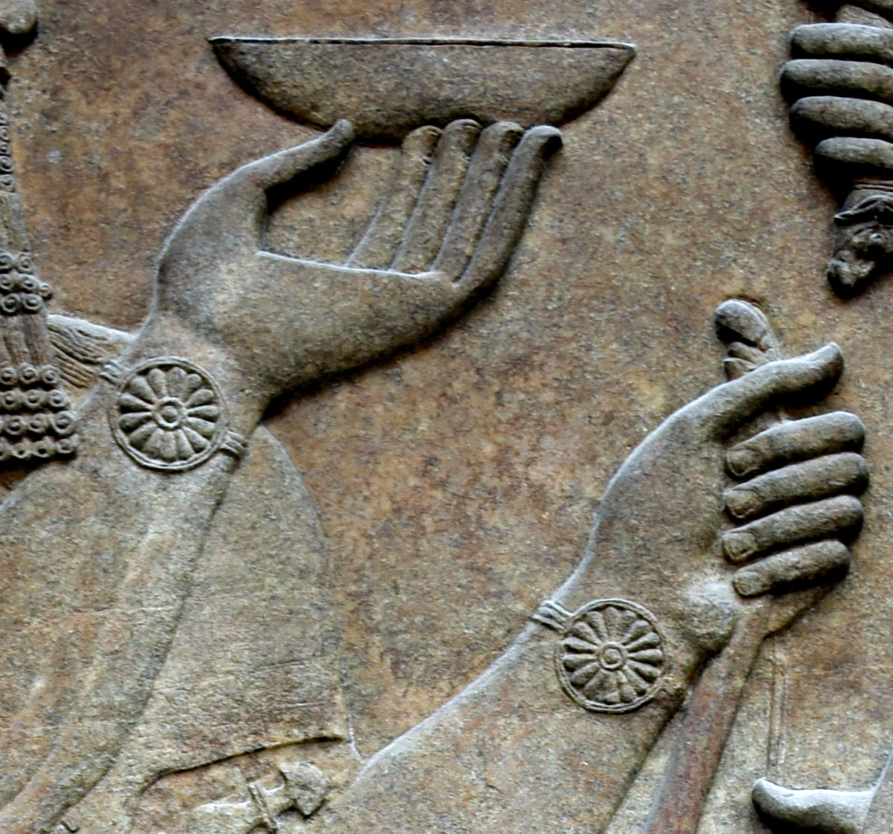

# Human-made Things in the Bible

## License Information

Human-made Things in the Bible © United Bible Societies, 2025. Adapted from: <cite>The Works of Their Hands: Man-made Things in the Bible</cite>, by Ray Pritz © 2009 United Bible Societies. This work is licensed under Creative Commons Attribution-ShareAlike 4.0 International (<a href="https://creativecommons.org/licenses/by-sa/4.0/">https://creativecommons.org/licenses/by-sa/4.0/</a>).

--------------------------------

## 标题：腕带、驱邪带、魔符（wristband, magic charm） (id: REALIA:6.14)

6\.14 标题：腕带、驱邪带、魔符（wristband, magic charm）
==========================================

经文出处
----

Hebrew 来：כֶּסֶת (音译：keseth)

[EZK 13:18](https://ref.ly/Ezek13:18), [EZK 13:20](https://ref.ly/Ezek13:20)

描述
--

*戴在手腕上的布带被认为具有保护作用 (© Osama Shukir Muhammed Amin FRCP(Glasg), CC BY\-SA 4\.0, via Wikimedia Commons)*

腕带是一条缝制的布条，戴在手腕上。

---

翻译
--

从[EZK 13:18](https://ref.ly/Ezek13:18); [EZK 13:20](https://ref.ly/Ezek13:20) 的上下文可以看出，这些布带是在神秘仪式中使用的。有些语言可能有对等词，但如果没有，翻译者可以采用描述性的短语。GNT (Good News Translation (1992)) 称其为“magic wristbands”（“魔法腕带”），CEV (Contemporary English Version) 和NCV (New Century Version) 称其为“magic charms”（“魔符”）。第18节记载，布带是为“手的所有关节”缝制的，我们查阅的所有译本都认为这是指手腕而不是手肘，正如布朗（Brown）、德赖弗（Driver）和布瑞格斯（Briggs）所著希伯来文词典在*’atsil* 一词下的注解。

* **Associated Passages:** 以西结书 13:18; 以西结书 13:20

