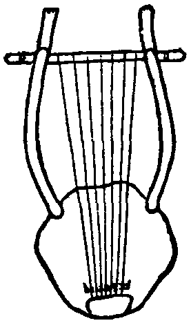

# Human-made Things in the Bible

## License Information

Human-made Things in the Bible © United Bible Societies, 2025. Adapted from: <cite>The Works of Their Hands: Man-made Things in the Bible</cite>, by Ray Pritz © 2009 United Bible Societies. This work is licensed under Creative Commons Attribution-ShareAlike 4.0 International (<a href="https://creativecommons.org/licenses/by-sa/4.0/">https://creativecommons.org/licenses/by-sa/4.0/</a>).

--------------------------------

## 标题： (id: REALIA:7.2.2)

7\.2\.2 标题：
===========

经文出处
----

Hebrew 来：כִּנּוֹר (音译：kinor)

[GEN 4:21](https://ref.ly/Gen4:21), [GEN 31:27](https://ref.ly/Gen31:27), [1SA 10:5](https://ref.ly/1Sam10:5), [1SA 16:16](https://ref.ly/1Sam16:16), [1SA 16:23](https://ref.ly/1Sam16:23), [2SA 6:5](https://ref.ly/2Sam6:5), [1KI 10:12](https://ref.ly/1Kgs10:12), [1CH 13:8](https://ref.ly/1Chr13:8), [1CH 15:16](https://ref.ly/1Chr15:16), [1CH 15:21](https://ref.ly/1Chr15:21), [1CH 15:28](https://ref.ly/1Chr15:28), [1CH 16:5](https://ref.ly/1Chr16:5), [1CH 25:1](https://ref.ly/1Chr25:1), [1CH 25:3](https://ref.ly/1Chr25:3), [1CH 25:6](https://ref.ly/1Chr25:6), [2CH 5:12](https://ref.ly/2Chr5:12), [2CH 9:11](https://ref.ly/2Chr9:11), [2CH 20:28](https://ref.ly/2Chr20:28), [2CH 29:25](https://ref.ly/2Chr29:25), [NEH 12:27](https://ref.ly/Neh12:27), [JOB 21:12](https://ref.ly/Job21:12), [JOB 30:31](https://ref.ly/Job30:31), [PSA 33:2](https://ref.ly/Ps33:2), [PSA 43:4](https://ref.ly/Ps43:4), [PSA 49:5](https://ref.ly/Ps49:5), [PSA 57:9](https://ref.ly/Ps57:9), [PSA 71:22](https://ref.ly/Ps71:22), [PSA 81:3](https://ref.ly/Ps81:3), [PSA 92:4](https://ref.ly/Ps92:4), [PSA 98:5](https://ref.ly/Ps98:5), [PSA 98:5](https://ref.ly/Ps98:5), [PSA 108:3](https://ref.ly/Ps108:3), [PSA 137:2](https://ref.ly/Ps137:2), [PSA 147:7](https://ref.ly/Ps147:7), [PSA 149:3](https://ref.ly/Ps149:3), [PSA 150:3](https://ref.ly/Ps150:3), [ISA 5:12](https://ref.ly/Isa5:12), [ISA 16:11](https://ref.ly/Isa16:11), [ISA 23:16](https://ref.ly/Isa23:16), [ISA 24:8](https://ref.ly/Isa24:8), [ISA 30:32](https://ref.ly/Isa30:32), [EZK 26:13](https://ref.ly/Ezek26:13)

Aramaic 兰：שַׂבְּכָא (音译：sabka’)

[DAN 3:5](https://ref.ly/Dan3:5), [DAN 3:7](https://ref.ly/Dan3:7), [DAN 3:10](https://ref.ly/Dan3:10), [DAN 3:15](https://ref.ly/Dan3:15)

Greek 希：κινύρα (音译：kinura)

[SIR 39:15](https://ref.ly/Sir39:15), [1MA 3:45](https://ref.ly/1Macc3:45), [1MA 4:54](https://ref.ly/1Macc4:54), [1MA 13:51](https://ref.ly/1Macc13:51)

描述
--

*里拉琴（来自古埃及，后来演化成为基萨拉琴（cithara）） (© Public domain \- Wikimedia Commons)*

里拉琴有一个共鸣箱，从共鸣箱的末端或两侧伸出来两个琴臂。两根琴臂末端连着一根横臂。琴弦从横臂一直拉伸到共鸣箱上面。和*nevel* 一样，里拉琴弦的数目可能有所不同。弦的不同厚度和张紧程度使乐器发出一系列音符。里拉琴通常是木头制的，弦由动物的肠子（可能是绵羊肠）做成。

---

用途
--

里拉琴的琴弦通常用手指拨动。*kinor* 经常被描述为一种伴奏的乐器。

---

翻译
--

*弹里拉琴的女子壁画（庞贝（Pompeii），公元50–79年，大英博物馆） (© Carole Raddato from FRANKFURT, Germany, CC BY\-SA 2\.0, via Wikimedia Commons)*

参[7\.2\.1 Nevel、大里拉琴、吉他、竖琴 (Nevel, large lyre, guitar, harp)\<REALIA:7\.2\.1\>](#) 。

[JOB 21:12](https://ref.ly/Job21:12) ：这个与鼓同奏的弦乐器的希伯来文是*kinor* ，FRCL (French Common Language Version (Bible en français courant)) 译为“吉他”，法文《耶路撒冷圣经》（*La Bible de Jérusalem* ）译为“齐特琴”。这似乎是[1SA 10:5](https://ref.ly/1Sam10:5) 中使用的乐器。[JOB 21:12](https://ref.ly/Job21:12) 的第一行也可以译为，“人们击着鼓、弹着琴，孩子们唱着歌。”在有些语言中，这些乐器可以译为当地的鼓和弦乐器，并且该弦乐器可以译为吉他。如果找不到相应的当地乐器来翻译这节经文中的乐器，翻译者可以用另一种不同的方式来表述整节经文；例如，“孩子们跳舞唱歌，发出快乐的声音／音乐。”

在[DAN 3:5](https://ref.ly/Dan3:5); [DAN 3:7](https://ref.ly/Dan3:7); [DAN 3:10](https://ref.ly/Dan3:10); [DAN 3:15](https://ref.ly/Dan3:15) 中，我们不确定亚兰文*sabka’* 是什么乐器。RSV (Revised Standard Version (1952)) 将这个词译为“trigon”（“三角琴”），这是一种有四根弦的小型三角形里拉琴。也许从音乐术语上来说，三角琴是准确的，但一般的英文读者并不知道这种琴。GNT (Good News Translation (1992)) 试图找到一个更为人熟悉的对等词，因此译成“zither”（“齐特琴”），但齐特琴的弦太多了（超过30根）。有些译本把*sabka’* 译成“lyre”（“里拉琴”），把这个词前面的亚兰文*qathros* 译为“zither”（如NIV (New International Version (1984)) 、NJPSV (New Jewish Publication Society Version) 、NLT (New Living Translation) ）。REB (Revised English Bible (1989)) 译为“triangle”（“三角”），但大多数读者会将其误解为打击乐器“三角铁”。为了避免这个问题，有译本只翻译了清单中的前三种乐器，而把包含*sabka’* 在内的后三种乐器合在了一起，整句译为“号、笛、竖琴和所有其他类型的乐器”（CEV (Contemporary English Version) 直译）。

* **Associated Passages:** 创世记 4:21; 创世记 31:27; 撒母耳记上 10:5; 撒母耳记上 16:16; 撒母耳记上 16:23; 撒母耳记下 6:5; 列王纪上 10:12; 历代志上 13:8; 历代志上 15:16; 历代志上 15:21; 历代志上 15:28; 历代志上 16:5; 历代志上 25:1; 历代志上 25:3; 历代志上 25:6; 历代志下 5:12; 历代志下 9:11; 历代志下 20:28; 历代志下 29:25; 尼希米记 12:27; 约伯记 21:12; 约伯记 30:31; 诗篇 33:2; 诗篇 43:4; 诗篇 49:5; 诗篇 57:9; 诗篇 71:22; 诗篇 81:3; 诗篇 92:4; 诗篇 98:5; 诗篇 108:3; 诗篇 137:2; 诗篇 147:7; 诗篇 149:3; 诗篇 150:3; 以赛亚书 5:12; 以赛亚书 16:11; 以赛亚书 23:16; 以赛亚书 24:8; 以赛亚书 30:32; 以西结书 26:13; 但以理书 3:5; 但以理书 3:7; 但以理书 3:10; 但以理书 3:15; 德训篇 39:15; 玛加伯上 3:45; 玛加伯上 4:54; 玛加伯上 13:51

