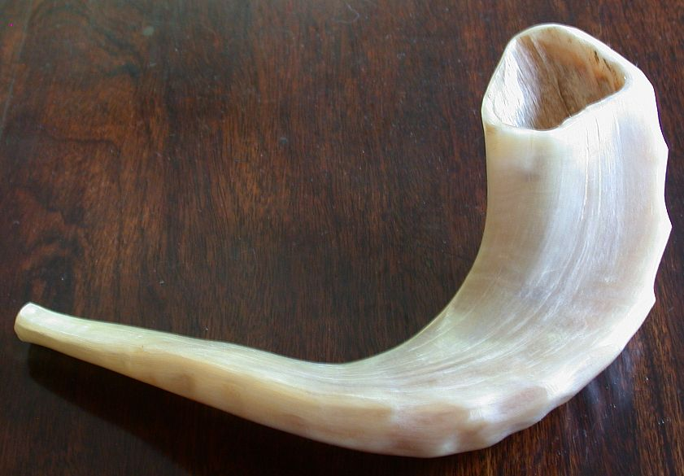

# Human-made Things in the Bible

## License Information

Human-made Things in the Bible © United Bible Societies, 2025. Adapted from: <cite>The Works of Their Hands: Man-made Things in the Bible</cite>, by Ray Pritz © 2009 United Bible Societies. This work is licensed under Creative Commons Attribution-ShareAlike 4.0 International (<a href="https://creativecommons.org/licenses/by-sa/4.0/">https://creativecommons.org/licenses/by-sa/4.0/</a>).

--------------------------------

## 标题：角、羊角、羊角号（horn, ram’s horn） (id: REALIA:7.3.1)

7\.3\.1 标题：角、羊角、羊角号（horn, ram’s horn）
=====================================

经文出处
----

Hebrew 来：יוֹבֵל (音译：yovel)

[EXO 19:13](https://ref.ly/Exod19:13), [JOS 6:4](https://ref.ly/Josh6:4), [JOS 6:5](https://ref.ly/Josh6:5), [JOS 6:6](https://ref.ly/Josh6:6), [JOS 6:8](https://ref.ly/Josh6:8), [JOS 6:13](https://ref.ly/Josh6:13)

Hebrew 来：קֶרֶן (音译：qeren)

[JOS 6:5](https://ref.ly/Josh6:5), [DAN 3:5](https://ref.ly/Dan3:5), [DAN 3:7](https://ref.ly/Dan3:7), [DAN 3:10](https://ref.ly/Dan3:10), [DAN 3:15](https://ref.ly/Dan3:15)

Hebrew 来：שׁוֹפָר (音译：shofar)

[EXO 19:16](https://ref.ly/Exod19:16), [EXO 19:19](https://ref.ly/Exod19:19), [EXO 20:18](https://ref.ly/Exod20:18), [LEV 25:9](https://ref.ly/Lev25:9), [LEV 25:9](https://ref.ly/Lev25:9), [JOS 6:4](https://ref.ly/Josh6:4), [JOS 6:4](https://ref.ly/Josh6:4), [JOS 6:5](https://ref.ly/Josh6:5), [JOS 6:6](https://ref.ly/Josh6:6), [JOS 6:8](https://ref.ly/Josh6:8), [JOS 6:8](https://ref.ly/Josh6:8), [JOS 6:9](https://ref.ly/Josh6:9), [JOS 6:9](https://ref.ly/Josh6:9), [JOS 6:13](https://ref.ly/Josh6:13), [JOS 6:13](https://ref.ly/Josh6:13), [JOS 6:13](https://ref.ly/Josh6:13), [JOS 6:16](https://ref.ly/Josh6:16), [JOS 6:20](https://ref.ly/Josh6:20), [JOS 6:20](https://ref.ly/Josh6:20), [JDG 3:27](https://ref.ly/Judg3:27), [JDG 6:34](https://ref.ly/Judg6:34), [JDG 7:8](https://ref.ly/Judg7:8), [JDG 7:16](https://ref.ly/Judg7:16), [JDG 7:18](https://ref.ly/Judg7:18), [JDG 7:18](https://ref.ly/Judg7:18), [JDG 7:19](https://ref.ly/Judg7:19), [JDG 7:20](https://ref.ly/Judg7:20), [JDG 7:20](https://ref.ly/Judg7:20), [JDG 7:22](https://ref.ly/Judg7:22), [1SA 13:3](https://ref.ly/1Sam13:3), [2SA 2:28](https://ref.ly/2Sam2:28), [2SA 6:15](https://ref.ly/2Sam6:15), [2SA 15:10](https://ref.ly/2Sam15:10), [2SA 18:16](https://ref.ly/2Sam18:16), [2SA 20:1](https://ref.ly/2Sam20:1), [2SA 20:22](https://ref.ly/2Sam20:22), [1KI 1:34](https://ref.ly/1Kgs1:34), [1KI 1:39](https://ref.ly/1Kgs1:39), [1KI 1:41](https://ref.ly/1Kgs1:41), [2KI 9:13](https://ref.ly/2Kgs9:13), [1CH 15:28](https://ref.ly/1Chr15:28), [2CH 15:14](https://ref.ly/2Chr15:14), [NEH 4:12](https://ref.ly/Neh4:12), [NEH 4:14](https://ref.ly/Neh4:14), [JOB 39:24](https://ref.ly/Job39:24), [JOB 39:25](https://ref.ly/Job39:25), [PSA 47:6](https://ref.ly/Ps47:6), [PSA 81:4](https://ref.ly/Ps81:4), [PSA 98:6](https://ref.ly/Ps98:6), [PSA 150:3](https://ref.ly/Ps150:3), [ISA 18:3](https://ref.ly/Isa18:3), [ISA 27:13](https://ref.ly/Isa27:13), [ISA 58:1](https://ref.ly/Isa58:1), [JER 4:5](https://ref.ly/Jer4:5), [JER 4:19](https://ref.ly/Jer4:19), [JER 4:21](https://ref.ly/Jer4:21), [JER 6:1](https://ref.ly/Jer6:1), [JER 6:17](https://ref.ly/Jer6:17), [JER 42:14](https://ref.ly/Jer42:14), [JER 51:27](https://ref.ly/Jer51:27), [EZK 33:3](https://ref.ly/Ezek33:3), [EZK 33:4](https://ref.ly/Ezek33:4), [EZK 33:5](https://ref.ly/Ezek33:5), [EZK 33:6](https://ref.ly/Ezek33:6), [HOS 5:8](https://ref.ly/Hos5:8), [HOS 8:1](https://ref.ly/Hos8:1), [JOL 2:1](https://ref.ly/Joel2:1), [JOL 2:15](https://ref.ly/Joel2:15), [AMO 2:2](https://ref.ly/Amos2:2), [AMO 3:6](https://ref.ly/Amos3:6), [ZEP 1:16](https://ref.ly/Zeph1:16), [ZEC 9:14](https://ref.ly/Zech9:14)

Hebrew 来：תָּקוֹעַ (音译：taqo‘a)

[EZK 7:14](https://ref.ly/Ezek7:14)

Greek 希：σάλπιγξ (音译：salpigx)

[MAT 24:31](https://ref.ly/Matt24:31), [1CO 14:8](https://ref.ly/1Cor14:8), [1CO 15:52](https://ref.ly/1Cor15:52), [1TH 4:16](https://ref.ly/1Thess4:16), [HEB 12:19](https://ref.ly/Heb12:19), [REV 1:10](https://ref.ly/Rev1:10), [REV 4:1](https://ref.ly/Rev4:1), [REV 8:2](https://ref.ly/Rev8:2), [REV 8:6](https://ref.ly/Rev8:6), [REV 8:13](https://ref.ly/Rev8:13), [REV 9:14](https://ref.ly/Rev9:14)

描述
--

*(Image generated by ChatGPT using OpenAI technology)*

角是一种吹奏乐器，由动物的角制成，通常用的是公绵羊的角。

---

用途
--

制作羊角号时，先把动物的角软化，使其可以塑造成形。切下羊角的尖端，留下一个小口供吹角者吹气，吹角者的嘴唇吹气振动，使角发出声音。

*用公羊角制成的乐器 (© Pixabay)*

羊角号有两种用途：

1\. 某些宗教场合会吹响羊角号，不是作为敬拜的音乐伴奏，而是作为重要事件的信号。这些场合包括西奈山颁布律法、赎罪日、把约柜抬进耶路撒冷、君王加冕仪式等。

2\. 敌人临近时，人们也会吹响羊角号作为信号或警报。在先知书中，当先知呼吁百姓悔改时，经常提到吹角（[HOS 5:8](https://ref.ly/Hos5:8); [HOS 8:1](https://ref.ly/Hos8:1); [JOL 2:1](https://ref.ly/Joel2:1); [JOL 2:15](https://ref.ly/Joel2:15); [AMO 3:6](https://ref.ly/Amos3:6) ）。

---

翻译
--

*用公羊角制成的小羊角号 (© Olve Utne, CC BY\-SA 2\.5, via Wikimedia Commons)*

在许多经文中，吹羊角号（希伯来文*shofar* ）的目的是发出警报。在有些文化中，用动物角制成的号是向一大群人发出信号的乐器，这时很容易表达出用羊角号发出警报的目的。其他文化也许可以找到用于相同目的的其他乐器。例如，有些文化用钟或鼓等乐器作为打仗的警告。有些译本对*shofar* 一词进行了音译。如果这种乐器不是众所周知的，那么音译应附有脚注或收录在术语简释中。

在[EXO 19:13](https://ref.ly/Exod19:13) 和[JOS 6:0](https://ref.ly/Josh6:0) 中，希伯来文*yovel* 和*qeren* （意为“动物的角”）与*shofar* 平行，可以把它们作为*shofar* 的对等词。有些学者认为，[EZK 7:14](https://ref.ly/Ezek7:14) 中的希伯来文*taqo‘a* （意为“吹”）不是指一种乐器，而是指提哥亚镇（比较[JER 6:1](https://ref.ly/Jer6:1) ）。然而，这个词更有可能是指发出警报的东西，即羊角号。

在一些段落中，翻译者有必要扩展译文，以表明吹响羊角号并不仅仅是为了演奏音乐；例如，在[EZK 7:14](https://ref.ly/Ezek7:14) 中，CEV (Contemporary English Version) 英文意为“号角已发出信号”，而GECL (German Common Language Version (Gute Nachricht Bibel)) 译为“警报已吹响”。

对于[LEV 25:9](https://ref.ly/Lev25:9) 中“公羊的角”一语，翻译者可以依循NCV (New Century Version) ，采用描述性的短语“公绵羊的角”。

[ZEP 1:16](https://ref.ly/Zeph1:16) 可译作“战争号角的响声”（如GNT (Good News Translation (1992)) ），强调的是羊角号的功能；也可以不提到乐器，而是将其译为“警报”（“alarms”；NCV (New Century Version) ）。

* **Associated Passages:** 出埃及记 19:13; 约书亚记 6:4; 约书亚记 6:5; 约书亚记 6:6; 约书亚记 6:8; 约书亚记 6:13; 但以理书 3:5; 但以理书 3:7; 但以理书 3:10; 但以理书 3:15; 出埃及记 19:16; 出埃及记 19:19; 出埃及记 20:18; 利未记 25:9; 约书亚记 6:9; 约书亚记 6:16; 约书亚记 6:20; 士师记 3:27; 士师记 6:34; 士师记 7:8; 士师记 7:16; 士师记 7:18; 士师记 7:19; 士师记 7:20; 士师记 7:22; 撒母耳记上 13:3; 撒母耳记下 2:28; 撒母耳记下 6:15; 撒母耳记下 15:10; 撒母耳记下 18:16; 撒母耳记下 20:1; 撒母耳记下 20:22; 列王纪上 1:34; 列王纪上 1:39; 列王纪上 1:41; 列王纪下 9:13; 历代志上 15:28; 历代志下 15:14; 尼希米记 4:12; 尼希米记 4:14; 约伯记 39:24; 约伯记 39:25; 诗篇 47:6; 诗篇 81:4; 诗篇 98:6; 诗篇 150:3; 以赛亚书 18:3; 以赛亚书 27:13; 以赛亚书 58:1; 耶利米书 4:5; 耶利米书 4:19; 耶利米书 4:21; 耶利米书 6:1; 耶利米书 6:17; 耶利米书 42:14; 耶利米书 51:27; 以西结书 33:3; 以西结书 33:4; 以西结书 33:5; 以西结书 33:6; 何西阿书 5:8; 何西阿书 8:1; 约珥书 2:1; 约珥书 2:15; 阿摩司书 2:2; 阿摩司书 3:6; 西番雅书 1:16; 撒迦利亚书 9:14; 以西结书 7:14; 马太福音 24:31; 哥林多前书 14:8; 哥林多前书 15:52; 帖撒罗尼迦前书 4:16; 希伯来书 12:19; 启示录 1:10; 启示录 4:1; 启示录 8:2; 启示录 8:6; 启示录 8:13; 启示录 9:14; 约书亚记 6:0

