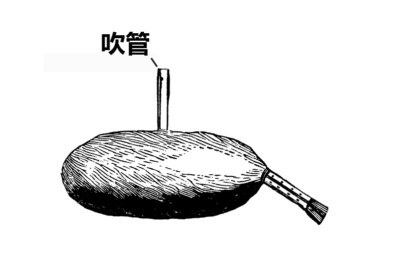

# Human-made Things in the Bible

## License Information

Human-made Things in the Bible © United Bible Societies, 2025. Adapted from: <cite>The Works of Their Hands: Man-made Things in the Bible</cite>, by Ray Pritz © 2009 United Bible Societies. This work is licensed under Creative Commons Attribution-ShareAlike 4.0 International (<a href="https://creativecommons.org/licenses/by-sa/4.0/">https://creativecommons.org/licenses/by-sa/4.0/</a>).

--------------------------------

## 标题：管乐器、吹奏乐器（wind instruments） (id: REALIA:7.3)

7\.3 标题：管乐器、吹奏乐器（wind instruments）
==================================

管乐器通过振动乐器里面的空气、穿过乐器的空气或乐器周围的空气来发出声音。这个类别包括两种类型的乐器：（1）演奏者用嘴唇使乐器里面的空气产生振动（[7\.3\.1 角、羊角、羊角号 (horn, ram’s horn)\<REALIA:7\.3\.1\>](#) 和[7\.3\.2 号、号筒（trumpet, horn）\<REALIA:7\.3\.2\>](#) ）；（2）在乐器的入口处使空气产生振动（[7\.3\.3 笛、箫 (flute, pipe)\<REALIA:7\.3\.3\>](#) 和[7\.3\.4 风笛（定音鼓、大鼓）（bagpipe \[kettledrum, large drum]）\<REALIA:7\.3\.4\>](#) ）。

## 标题：角、羊角、羊角号（horn, ram’s horn） (id: REALIA:7.3.1)

7\.3\.1 标题：角、羊角、羊角号（horn, ram’s horn）
=====================================

经文出处
----

Hebrew 来：יוֹבֵל (音译：yovel)

[EXO 19:13](https://ref.ly/Exod19:13), [JOS 6:4](https://ref.ly/Josh6:4), [JOS 6:5](https://ref.ly/Josh6:5), [JOS 6:6](https://ref.ly/Josh6:6), [JOS 6:8](https://ref.ly/Josh6:8), [JOS 6:13](https://ref.ly/Josh6:13)

Hebrew 来：קֶרֶן (音译：qeren)

[JOS 6:5](https://ref.ly/Josh6:5), [DAN 3:5](https://ref.ly/Dan3:5), [DAN 3:7](https://ref.ly/Dan3:7), [DAN 3:10](https://ref.ly/Dan3:10), [DAN 3:15](https://ref.ly/Dan3:15)

Hebrew 来：שׁוֹפָר (音译：shofar)

[EXO 19:16](https://ref.ly/Exod19:16), [EXO 19:19](https://ref.ly/Exod19:19), [EXO 20:18](https://ref.ly/Exod20:18), [LEV 25:9](https://ref.ly/Lev25:9), [LEV 25:9](https://ref.ly/Lev25:9), [JOS 6:4](https://ref.ly/Josh6:4), [JOS 6:4](https://ref.ly/Josh6:4), [JOS 6:5](https://ref.ly/Josh6:5), [JOS 6:6](https://ref.ly/Josh6:6), [JOS 6:8](https://ref.ly/Josh6:8), [JOS 6:8](https://ref.ly/Josh6:8), [JOS 6:9](https://ref.ly/Josh6:9), [JOS 6:9](https://ref.ly/Josh6:9), [JOS 6:13](https://ref.ly/Josh6:13), [JOS 6:13](https://ref.ly/Josh6:13), [JOS 6:13](https://ref.ly/Josh6:13), [JOS 6:16](https://ref.ly/Josh6:16), [JOS 6:20](https://ref.ly/Josh6:20), [JOS 6:20](https://ref.ly/Josh6:20), [JDG 3:27](https://ref.ly/Judg3:27), [JDG 6:34](https://ref.ly/Judg6:34), [JDG 7:8](https://ref.ly/Judg7:8), [JDG 7:16](https://ref.ly/Judg7:16), [JDG 7:18](https://ref.ly/Judg7:18), [JDG 7:18](https://ref.ly/Judg7:18), [JDG 7:19](https://ref.ly/Judg7:19), [JDG 7:20](https://ref.ly/Judg7:20), [JDG 7:20](https://ref.ly/Judg7:20), [JDG 7:22](https://ref.ly/Judg7:22), [1SA 13:3](https://ref.ly/1Sam13:3), [2SA 2:28](https://ref.ly/2Sam2:28), [2SA 6:15](https://ref.ly/2Sam6:15), [2SA 15:10](https://ref.ly/2Sam15:10), [2SA 18:16](https://ref.ly/2Sam18:16), [2SA 20:1](https://ref.ly/2Sam20:1), [2SA 20:22](https://ref.ly/2Sam20:22), [1KI 1:34](https://ref.ly/1Kgs1:34), [1KI 1:39](https://ref.ly/1Kgs1:39), [1KI 1:41](https://ref.ly/1Kgs1:41), [2KI 9:13](https://ref.ly/2Kgs9:13), [1CH 15:28](https://ref.ly/1Chr15:28), [2CH 15:14](https://ref.ly/2Chr15:14), [NEH 4:12](https://ref.ly/Neh4:12), [NEH 4:14](https://ref.ly/Neh4:14), [JOB 39:24](https://ref.ly/Job39:24), [JOB 39:25](https://ref.ly/Job39:25), [PSA 47:6](https://ref.ly/Ps47:6), [PSA 81:4](https://ref.ly/Ps81:4), [PSA 98:6](https://ref.ly/Ps98:6), [PSA 150:3](https://ref.ly/Ps150:3), [ISA 18:3](https://ref.ly/Isa18:3), [ISA 27:13](https://ref.ly/Isa27:13), [ISA 58:1](https://ref.ly/Isa58:1), [JER 4:5](https://ref.ly/Jer4:5), [JER 4:19](https://ref.ly/Jer4:19), [JER 4:21](https://ref.ly/Jer4:21), [JER 6:1](https://ref.ly/Jer6:1), [JER 6:17](https://ref.ly/Jer6:17), [JER 42:14](https://ref.ly/Jer42:14), [JER 51:27](https://ref.ly/Jer51:27), [EZK 33:3](https://ref.ly/Ezek33:3), [EZK 33:4](https://ref.ly/Ezek33:4), [EZK 33:5](https://ref.ly/Ezek33:5), [EZK 33:6](https://ref.ly/Ezek33:6), [HOS 5:8](https://ref.ly/Hos5:8), [HOS 8:1](https://ref.ly/Hos8:1), [JOL 2:1](https://ref.ly/Joel2:1), [JOL 2:15](https://ref.ly/Joel2:15), [AMO 2:2](https://ref.ly/Amos2:2), [AMO 3:6](https://ref.ly/Amos3:6), [ZEP 1:16](https://ref.ly/Zeph1:16), [ZEC 9:14](https://ref.ly/Zech9:14)

Hebrew 来：תָּקוֹעַ (音译：taqo‘a)

[EZK 7:14](https://ref.ly/Ezek7:14)

Greek 希：σάλπιγξ (音译：salpigx)

[MAT 24:31](https://ref.ly/Matt24:31), [1CO 14:8](https://ref.ly/1Cor14:8), [1CO 15:52](https://ref.ly/1Cor15:52), [1TH 4:16](https://ref.ly/1Thess4:16), [HEB 12:19](https://ref.ly/Heb12:19), [REV 1:10](https://ref.ly/Rev1:10), [REV 4:1](https://ref.ly/Rev4:1), [REV 8:2](https://ref.ly/Rev8:2), [REV 8:6](https://ref.ly/Rev8:6), [REV 8:13](https://ref.ly/Rev8:13), [REV 9:14](https://ref.ly/Rev9:14)

描述
--

*(Image generated by ChatGPT using OpenAI technology)*

角是一种吹奏乐器，由动物的角制成，通常用的是公绵羊的角。

---

用途
--

制作羊角号时，先把动物的角软化，使其可以塑造成形。切下羊角的尖端，留下一个小口供吹角者吹气，吹角者的嘴唇吹气振动，使角发出声音。

*用公羊角制成的乐器 (© Pixabay)*

羊角号有两种用途：

1\. 某些宗教场合会吹响羊角号，不是作为敬拜的音乐伴奏，而是作为重要事件的信号。这些场合包括西奈山颁布律法、赎罪日、把约柜抬进耶路撒冷、君王加冕仪式等。

2\. 敌人临近时，人们也会吹响羊角号作为信号或警报。在先知书中，当先知呼吁百姓悔改时，经常提到吹角（[HOS 5:8](https://ref.ly/Hos5:8); [HOS 8:1](https://ref.ly/Hos8:1); [JOL 2:1](https://ref.ly/Joel2:1); [JOL 2:15](https://ref.ly/Joel2:15); [AMO 3:6](https://ref.ly/Amos3:6) ）。

---

翻译
--

*用公羊角制成的小羊角号 (© Olve Utne, CC BY\-SA 2\.5, via Wikimedia Commons)*

在许多经文中，吹羊角号（希伯来文*shofar* ）的目的是发出警报。在有些文化中，用动物角制成的号是向一大群人发出信号的乐器，这时很容易表达出用羊角号发出警报的目的。其他文化也许可以找到用于相同目的的其他乐器。例如，有些文化用钟或鼓等乐器作为打仗的警告。有些译本对*shofar* 一词进行了音译。如果这种乐器不是众所周知的，那么音译应附有脚注或收录在术语简释中。

在[EXO 19:13](https://ref.ly/Exod19:13) 和[JOS 6:0](https://ref.ly/Josh6:0) 中，希伯来文*yovel* 和*qeren* （意为“动物的角”）与*shofar* 平行，可以把它们作为*shofar* 的对等词。有些学者认为，[EZK 7:14](https://ref.ly/Ezek7:14) 中的希伯来文*taqo‘a* （意为“吹”）不是指一种乐器，而是指提哥亚镇（比较[JER 6:1](https://ref.ly/Jer6:1) ）。然而，这个词更有可能是指发出警报的东西，即羊角号。

在一些段落中，翻译者有必要扩展译文，以表明吹响羊角号并不仅仅是为了演奏音乐；例如，在[EZK 7:14](https://ref.ly/Ezek7:14) 中，CEV (Contemporary English Version) 英文意为“号角已发出信号”，而GECL (German Common Language Version (Gute Nachricht Bibel)) 译为“警报已吹响”。

对于[LEV 25:9](https://ref.ly/Lev25:9) 中“公羊的角”一语，翻译者可以依循NCV (New Century Version) ，采用描述性的短语“公绵羊的角”。

[ZEP 1:16](https://ref.ly/Zeph1:16) 可译作“战争号角的响声”（如GNT (Good News Translation (1992)) ），强调的是羊角号的功能；也可以不提到乐器，而是将其译为“警报”（“alarms”；NCV (New Century Version) ）。

* **Associated Passages:** 出埃及记 19:13; 约书亚记 6:4; 约书亚记 6:5; 约书亚记 6:6; 约书亚记 6:8; 约书亚记 6:13; 但以理书 3:5; 但以理书 3:7; 但以理书 3:10; 但以理书 3:15; 出埃及记 19:16; 出埃及记 19:19; 出埃及记 20:18; 利未记 25:9; 约书亚记 6:9; 约书亚记 6:16; 约书亚记 6:20; 士师记 3:27; 士师记 6:34; 士师记 7:8; 士师记 7:16; 士师记 7:18; 士师记 7:19; 士师记 7:20; 士师记 7:22; 撒母耳记上 13:3; 撒母耳记下 2:28; 撒母耳记下 6:15; 撒母耳记下 15:10; 撒母耳记下 18:16; 撒母耳记下 20:1; 撒母耳记下 20:22; 列王纪上 1:34; 列王纪上 1:39; 列王纪上 1:41; 列王纪下 9:13; 历代志上 15:28; 历代志下 15:14; 尼希米记 4:12; 尼希米记 4:14; 约伯记 39:24; 约伯记 39:25; 诗篇 47:6; 诗篇 81:4; 诗篇 98:6; 诗篇 150:3; 以赛亚书 18:3; 以赛亚书 27:13; 以赛亚书 58:1; 耶利米书 4:5; 耶利米书 4:19; 耶利米书 4:21; 耶利米书 6:1; 耶利米书 6:17; 耶利米书 42:14; 耶利米书 51:27; 以西结书 33:3; 以西结书 33:4; 以西结书 33:5; 以西结书 33:6; 何西阿书 5:8; 何西阿书 8:1; 约珥书 2:1; 约珥书 2:15; 阿摩司书 2:2; 阿摩司书 3:6; 西番雅书 1:16; 撒迦利亚书 9:14; 以西结书 7:14; 马太福音 24:31; 哥林多前书 14:8; 哥林多前书 15:52; 帖撒罗尼迦前书 4:16; 希伯来书 12:19; 启示录 1:10; 启示录 4:1; 启示录 8:2; 启示录 8:6; 启示录 8:13; 启示录 9:14; 约书亚记 6:0

* **Associated ACAI Concepts:** Rams Horn (ID: `realia:RamsHorn`)

## 标题：号、号筒（trumpet, horn） (id: REALIA:7.3.2)

7\.3\.2 标题：号、号筒（trumpet, horn）
==============================

经文出处
----

Hebrew 来：חצצר, חֲצֹצְרָה (音译：chatsotsrah, chatsar（动词）)

[NUM 10:2](https://ref.ly/Num10:2), [NUM 10:8](https://ref.ly/Num10:8), [NUM 10:9](https://ref.ly/Num10:9), [NUM 10:10](https://ref.ly/Num10:10), [NUM 31:6](https://ref.ly/Num31:6), [2KI 11:14](https://ref.ly/2Kgs11:14), [2KI 11:14](https://ref.ly/2Kgs11:14), [2KI 12:14](https://ref.ly/2Kgs12:14), [1CH 13:8](https://ref.ly/1Chr13:8), [1CH 15:24](https://ref.ly/1Chr15:24), [1CH 15:28](https://ref.ly/1Chr15:28), [1CH 16:6](https://ref.ly/1Chr16:6), [1CH 16:42](https://ref.ly/1Chr16:42), [2CH 5:12](https://ref.ly/2Chr5:12), [2CH 5:13](https://ref.ly/2Chr5:13), [2CH 7:6](https://ref.ly/2Chr7:6), [2CH 7:6](https://ref.ly/2Chr7:6), [2CH 13:12](https://ref.ly/2Chr13:12), [2CH 13:14](https://ref.ly/2Chr13:14), [2CH 15:14](https://ref.ly/2Chr15:14), [2CH 20:28](https://ref.ly/2Chr20:28), [2CH 23:13](https://ref.ly/2Chr23:13), [2CH 23:13](https://ref.ly/2Chr23:13), [2CH 29:26](https://ref.ly/2Chr29:26), [2CH 29:27](https://ref.ly/2Chr29:27), [2CH 29:28](https://ref.ly/2Chr29:28), [EZR 3:10](https://ref.ly/Ezra3:10), [NEH 12:35](https://ref.ly/Neh12:35), [NEH 12:41](https://ref.ly/Neh12:41), [PSA 98:6](https://ref.ly/Ps98:6), [HOS 5:8](https://ref.ly/Hos5:8)

Hebrew 来：קֶרֶן (音译：qeren)

[DAN 3:5](https://ref.ly/Dan3:5), [DAN 3:7](https://ref.ly/Dan3:7), [DAN 3:10](https://ref.ly/Dan3:10), [DAN 3:15](https://ref.ly/Dan3:15)

Greek 希：σάλπιγξ, σαλπίζω, σαλπιστής (音译：salpigx, salpizō（动词）, salpistēs)

[MAT 6:2](https://ref.ly/Matt6:2), [MAT 24:31](https://ref.ly/Matt24:31), [1CO 14:8](https://ref.ly/1Cor14:8), [1CO 15:52](https://ref.ly/1Cor15:52), [1CO 15:52](https://ref.ly/1Cor15:52), [1TH 4:16](https://ref.ly/1Thess4:16), [HEB 12:19](https://ref.ly/Heb12:19), [REV 1:10](https://ref.ly/Rev1:10), [REV 4:1](https://ref.ly/Rev4:1), [REV 8:2](https://ref.ly/Rev8:2), [REV 8:6](https://ref.ly/Rev8:6), [REV 8:6](https://ref.ly/Rev8:6), [REV 8:7](https://ref.ly/Rev8:7), [REV 8:8](https://ref.ly/Rev8:8), [REV 8:10](https://ref.ly/Rev8:10), [REV 8:12](https://ref.ly/Rev8:12), [REV 8:13](https://ref.ly/Rev8:13), [REV 8:13](https://ref.ly/Rev8:13), [REV 9:1](https://ref.ly/Rev9:1), [REV 9:13](https://ref.ly/Rev9:13), [REV 9:14](https://ref.ly/Rev9:14), [REV 10:7](https://ref.ly/Rev10:7), [REV 11:15](https://ref.ly/Rev11:15), [REV 18:22](https://ref.ly/Rev18:22), [SIR 39:15](https://ref.ly/Sir39:15), [1MA 3:45](https://ref.ly/1Macc3:45), [1MA 4:54](https://ref.ly/1Macc4:54), [1MA 4:13](https://ref.ly/1Macc4:13), [1MA 4:40](https://ref.ly/1Macc4:40), [1MA 4:40](https://ref.ly/1Macc4:40), [1MA 5:31](https://ref.ly/1Macc5:31), [1MA 5:33](https://ref.ly/1Macc5:33), [1MA 5:33](https://ref.ly/1Macc5:33), [1MA 6:33](https://ref.ly/1Macc6:33), [1MA 6:33](https://ref.ly/1Macc6:33), [1MA 7:45](https://ref.ly/1Macc7:45), [1MA 7:45](https://ref.ly/1Macc7:45), [1MA 9:12](https://ref.ly/1Macc9:12), [1MA 9:12](https://ref.ly/1Macc9:12), [1MA 9:12](https://ref.ly/1Macc9:12), [1MA 16:8](https://ref.ly/1Macc16:8), [1MA 16:8](https://ref.ly/1Macc16:8), [2MA 15:25](https://ref.ly/2Macc15:25), [1ES 5:57](https://ref.ly/1Esd5:57), [1ES 5:59](https://ref.ly/1Esd5:59), [1ES 5:61](https://ref.ly/1Esd5:61), [1ES 5:62](https://ref.ly/1Esd5:62), [1ES 5:62](https://ref.ly/1Esd5:62), [1ES 5:63](https://ref.ly/1Esd5:63)

Latin 拉：tuba

[2ES 6:23](https://ref.ly/2Esd6:23)

描述
--

*号、乐器 (© Public Domain Harry Burton \- Wikimedia Commons)*

号筒是一种管乐器，常用于发出信号，尤其是与战争有关的信号。号筒由金属制成，是一根狭长的直管，长约40—45厘米（16—18英寸），一端有吹嘴，另一端逐渐张开成喇叭的形状；[NUM 10:0](https://ref.ly/Num10:0) 中提到的号筒是银制的。

---

用途
--

*(Image generated by ChatGPT using OpenAI technology)*

吹奏号筒的人振动双唇向号嘴吹气，号筒就发出声音来。空气束经过逐渐变宽的筒身时，其振动会逐渐增强。

在以色列，号筒的主要目的是发出信号。[DAN 3:5](https://ref.ly/Dan3:5); [DAN 3:7](https://ref.ly/Dan3:7); [DAN 3:10](https://ref.ly/Dan3:10); [DAN 3:15](https://ref.ly/Dan3:15); [1CO 15:52](https://ref.ly/1Cor15:52); [1SA 10:5](https://ref.ly/1Sam10:5); [1KI 1:40](https://ref.ly/1Kgs1:40); [ISA 5:12](https://ref.ly/Isa5:12); [ISA 30:29](https://ref.ly/Isa30:29); [JER 48:36](https://ref.ly/Jer48:36) 罗列了多种需要吹号的场合，包括拔营起行、召集全会众、召集众领袖、在战斗开始前发出警报，以及在特定节期作为礼仪的一部分。需要注意，吹号筒的工作是由祭司执行的。

---

翻译
--

一般来说，翻译者可以把希伯来文*chatsotsrah* 译为“号筒”或“军号”，而把*shofar* 译为更加一般性的“号角”或“羊角号”，以此来区分*chatsotsrah* 和*shofar* （参[7\.3\.1 角、羊角、羊角号 (horn, ram’s horn)\<REALIA:7\.3\.1\>](#) ）。请注意《〈诗篇〉手册》（*A Handbook on Psalms* ，第846页）中关于[JER 48:36](https://ref.ly/Jer48:36) 的注解：“有些语言无法区分这两个分别译为**号筒** 和**号角** 的希伯来文词语。在这些情况下，翻译者应使用意为‘号角、喇叭’的当地词语。希腊文旧约只使用了一个术语来翻译这两个词。”

在[DAN 3:5](https://ref.ly/Dan3:5); [DAN 3:7](https://ref.ly/Dan3:7); [DAN 3:10](https://ref.ly/Dan3:10); [DAN 3:15](https://ref.ly/Dan3:15) 中，亚兰文*qeren* 的确切意思存在争议。这个词可能是指一种铜管乐器，最好译为“号角”。

希腊文*salpigx* 的现代对等词是“军号”。军号一般比号筒小，通常用来发出军事信号。

[PSA 5:1](https://ref.ly/Ps5:1) ：在翻译字面意为“在末次号筒的时候”一语时，可能需要引入一个行为主体；例如，“在某人最后一次吹响号筒的时候。”RSV (Revised Standard Version (1952)) 采用了字面直译。另外，也可以译为“在某人最后一次使号筒发出响声的时候”；然而，表示“响声”的词语应该暗示这是一种有意义的声音。

* **Associated Passages:** 民数记 10:2; 民数记 10:8; 民数记 10:9; 民数记 10:10; 民数记 31:6; 列王纪下 11:14; 列王纪下 12:14; 历代志上 13:8; 历代志上 15:24; 历代志上 15:28; 历代志上 16:6; 历代志上 16:42; 历代志下 5:12; 历代志下 5:13; 历代志下 7:6; 历代志下 13:12; 历代志下 13:14; 历代志下 15:14; 历代志下 20:28; 历代志下 23:13; 历代志下 29:26; 历代志下 29:27; 历代志下 29:28; 以斯拉记 3:10; 尼希米记 12:35; 尼希米记 12:41; 诗篇 98:6; 何西阿书 5:8; 但以理书 3:5; 但以理书 3:7; 但以理书 3:10; 但以理书 3:15; 马太福音 6:2; 马太福音 24:31; 哥林多前书 14:8; 哥林多前书 15:52; 帖撒罗尼迦前书 4:16; 希伯来书 12:19; 启示录 1:10; 启示录 4:1; 启示录 8:2; 启示录 8:6; 启示录 8:7; 启示录 8:8; 启示录 8:10; 启示录 8:12; 启示录 8:13; 启示录 9:1; 启示录 9:13; 启示录 9:14; 启示录 10:7; 启示录 11:15; 启示录 18:22; 德训篇 39:15; 玛加伯上 3:45; 玛加伯上 4:54; 玛加伯上 4:13; 玛加伯上 4:40; 玛加伯上 5:31; 玛加伯上 5:33; 玛加伯上 6:33; 玛加伯上 7:45; 玛加伯上 9:12; 玛加伯上 16:8; 玛加伯下 15:25; 厄斯德拉上 5:57; 厄斯德拉上 5:59; 厄斯德拉上 5:61; 厄斯德拉上 5:62; 厄斯德拉上 5:63; 厄斯德拉下 6:23; 民数记 10:0; 撒母耳记上 10:5; 列王纪上 1:40; 以赛亚书 5:12; 以赛亚书 30:29; 耶利米书 48:36; 诗篇 5:1

* **Associated ACAI Concepts:** Trumpet (ID: `realia:Trumpet`)

## 标题：笛、箫（flute, pipe） (id: REALIA:7.3.3)

7\.3\.3 标题：笛、箫（flute, pipe）
===========================

经文出处
----

Hebrew 来：חָלִיל (音译：chalil)

[1SA 10:5](https://ref.ly/1Sam10:5), [1KI 1:40](https://ref.ly/1Kgs1:40), [ISA 5:12](https://ref.ly/Isa5:12), [ISA 30:29](https://ref.ly/Isa30:29), [JER 48:36](https://ref.ly/Jer48:36), [JER 48:36](https://ref.ly/Jer48:36)

Aramaic 兰：מַשְׁרוֹקִי (音译：mashroqi)

[DAN 3:5](https://ref.ly/Dan3:5), [DAN 3:7](https://ref.ly/Dan3:7), [DAN 3:10](https://ref.ly/Dan3:10), [DAN 3:15](https://ref.ly/Dan3:15)

Hebrew 来：נְחִילוֹת (音译：nchiloth)

[PSA 5:1](https://ref.ly/Ps5:1)

Hebrew 来：עוּגָב (音译：‘ugav)

[GEN 4:21](https://ref.ly/Gen4:21), [JOB 21:12](https://ref.ly/Job21:12), [JOB 30:31](https://ref.ly/Job30:31), [PSA 150:4](https://ref.ly/Ps150:4)

Greek 希：αὐλέω, αὐλητής, αὐλός (音译：auleō（动词）, aulētēs, aulos)

[MAT 9:23](https://ref.ly/Matt9:23), [MAT 11:17](https://ref.ly/Matt11:17), [LUK 7:32](https://ref.ly/Luke7:32), [1CO 14:7](https://ref.ly/1Cor14:7), [1CO 14:7](https://ref.ly/1Cor14:7), [REV 18:22](https://ref.ly/Rev18:22), [SIR 40:21](https://ref.ly/Sir40:21), [1MA 3:45](https://ref.ly/1Macc3:45), [1ES 5:2](https://ref.ly/1Esd5:2)

描述
--

*骨制长笛，约公元前2500年（音乐博物馆（Musée de la musique），巴黎） (Vassil, CC0, via Wikimedia Commons)*

笛是一种管乐器，在笛管上面有一系列用来改变音调的指孔。有些笛子是用芦苇制成的，有多种形式：笛管是圆柱形，也可能略呈圆锥形。有些笛子只有一根笛管，还有一些则由两根管并排而成。古代双管笛或双管箫的两根芦苇通常成V型。其中一根管有数个孔，而另一根只有一个孔，提供一个不变的低音，以配合第一根管发出的曲调。有些笛或箫是用木头、象牙、骨头或金属等材料制成的。

---

用途
--

*双笛 (© Arjuno3 \- Wikimedia Commons)*

乐器内部在整个长度上都是空心的，在开口的上方吹气，气流灌入贯穿整个乐器的共鸣腔筒，笛便发出声音；有些乐器的开口是在末端，还有一些乐器的开口是在靠近乐器端部的侧面。对于用另一种方法引起振动的簧管来说，演奏者需在簧片上方吹气使其振动，然后笛身里面的空气柱也随之振动而发出声音。

---

翻译
--

*吹笛的男人 (© Zde \- Wikimedia Commons)*

如果没有可以用来翻译“笛”的管乐器，翻译者可以使用其他管乐器的名称。

希伯来文*‘ugav* 通常是指一种管乐器；例如，在[GEN 4:21](https://ref.ly/Gen4:21) 中，RSV (Revised Standard Version (1952)) 译成“pipe”（“箫”），GNT (Good News Translation (1992)) 译为“flute”（“笛”）。然而，这个词有可能是“乐器”的统称，甚至可能是指某一种弦乐器。在[JOB 21:12](https://ref.ly/Job21:12) 和[JOB 30:31](https://ref.ly/Job30:31) 中，这是一种用来表达喜悦和满足的乐器。

[PSA 5:1](https://ref.ly/Ps5:1) （标题）：希伯来文*nchiloth* 在旧约中仅出现在此处，意思不确定。这个词可能是“管乐器”的统称，或特别指“笛”。圣经以外的证据表明，它可能是一种吹奏哀歌的乐器。

[MAT 9:23](https://ref.ly/Matt9:23) ：RSV (Revised Standard Version (1952)) 这里译成“flute players”（“吹笛手”），GNT (Good News Translation (1992)) 作“musicians”（“音乐家”）。根据犹太传统，即使是最穷的人的葬礼，也要有两个吹笛的人和一个哀哭的女子。为了具体说明吹笛手的角色，GNT (Good News Translation (1992)) 增加了修饰语“葬礼上的”。这个背景知识对于熟悉葬礼习俗的犹太读者来说非常清楚，但对其他读者来说就不是那么明显。许多文化都熟悉木管笛子或其他木管乐器。如果没有这样的乐器，翻译者可以译为，“那些为葬礼演奏乐器的人”，或者“在葬礼上演奏的人”（GNT (Good News Translation (1992)) 直译）、“葬礼演奏者”（NCV (New Century Version) 直译）等。

有关亚兰文*mashroqi* 一词的翻译，参本章开头关于[DAN 3:0](https://ref.ly/Dan3:0) 的讨论。

* **Associated Passages:** 撒母耳记上 10:5; 列王纪上 1:40; 以赛亚书 5:12; 以赛亚书 30:29; 耶利米书 48:36; 但以理书 3:5; 但以理书 3:7; 但以理书 3:10; 但以理书 3:15; 诗篇 5:1; 创世记 4:21; 约伯记 21:12; 约伯记 30:31; 诗篇 150:4; 马太福音 9:23; 马太福音 11:17; 路加福音 7:32; 哥林多前书 14:7; 启示录 18:22; 德训篇 40:21; 玛加伯上 3:45; 厄斯德拉上 5:2; 但以理书 3:0

* **Associated ACAI Concepts:** Flute (ID: `realia:Flute`); Lute (ID: `realia:Lute`)

## 标题：风笛（定音鼓、大鼓）（bagpipe [kettledrum, large drum]） (id: REALIA:7.3.4)

7\.3\.4 标题：风笛（定音鼓、大鼓）（bagpipe \[kettledrum, large drum]）
========================================================

经文出处
----

Aramaic 兰：סוּמְפֹּנְיָה (音译：sumponyah)

[DAN 3:5](https://ref.ly/Dan3:5), [DAN 3:10](https://ref.ly/Dan3:10), [DAN 3:10](https://ref.ly/Dan3:10), [DAN 3:15](https://ref.ly/Dan3:15)

描述
--

风笛由一个风袋和连在上面的两支音管组成，另外还有一支吹管。演奏者通过吹管向风袋吹气，袋中的空气从两支音管出去。音管上有孔洞，用手指控制开合，就可发出一系列的乐音。

定音鼓是一种较大的鼓，构造类似[7\.4\.6 鼓、手鼓、框鼓 (drum, hand drum, frame drum)\<REALIA:7\.4\.6\>](#) 所讨论的鼓。然而，定音鼓不需要手持，而是立在地上。

---

翻译
--

关于[DAN 3:0](https://ref.ly/Dan3:0) 中亚兰文*sumponyah* 是什么乐器，学者提出了几个可能性，包括双笛、鼓和风笛（如上图所示）。各译本的译法包括“笛”（“pipes”；NIV (New International Version (1984)) 、NCV (New Century Version) ）、“风笛”（“bagpipe”；RSV (Revised Standard Version (1952)) 、NJB (New Jerusalem Bible (1985)) ）、“鼓”（“drum”；NRSV (New Revised Standard Version (1989)) ）和“扬琴”（“dulcimer”；KJV (King James Version (1611)) 、REB (Revised English Bible (1989)) ）。有学者基于下述假设，认为*sumponyah* 是一种大鼓：这个亚兰文词语音译自希腊文*tumpanon* 的方言形式。

许多学者认为，*sumponyah* 一词实际上并不是某种乐器的名称，而是指同时奏响前面提到的所有乐器；因此，GNT (Good News Translation (1992)) 的英译文意思是：“然后所有其他乐器都加入演奏。”这种解释可能是由于把*sumponyah* 解作“伴奏”。NEB (New English Bible (1970)) 遵循了这一解释，使用了一般性的“music”（“音乐”）。

* **Associated Passages:** 但以理书 3:5; 但以理书 3:10; 但以理书 3:15; 但以理书 3:0

* **Associated ACAI Concepts:** Bagpipe (ID: `realia:Bagpipe`)
