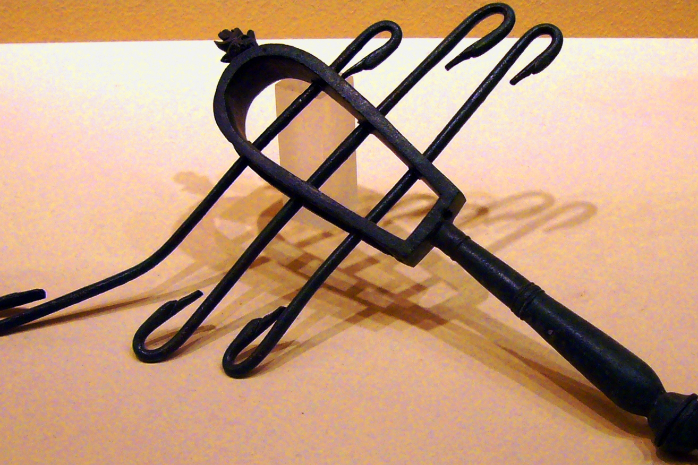

# Human-made Things in the Bible

## License Information

Human-made Things in the Bible © United Bible Societies, 2025. Adapted from: <cite>The Works of Their Hands: Man-made Things in the Bible</cite>, by Ray Pritz © 2009 United Bible Societies. This work is licensed under Creative Commons Attribution-ShareAlike 4.0 International (<a href="https://creativecommons.org/licenses/by-sa/4.0/">https://creativecommons.org/licenses/by-sa/4.0/</a>).

--------------------------------

## 标题：叉铃（sistrum） (id: REALIA:7.4.1)

7\.4\.1 标题：叉铃（sistrum）
======================

经文出处
----

Hebrew 来：שָׁלִישׁ (音译：shalish)

[1SA 18:6](https://ref.ly/1Sam18:6)

描述
--

*拨浪鼓，一种叉铃乐器 (© Lalupa \- Wikimedia Commons)*

叉铃的框架上有一些较短的金属线，金属线上穿有一些小金属环。

---

用途
--

摇动叉铃时，会发出一种嘎嘎或叮铃叮铃的声音。这种乐器用来为歌舞伴奏。

---

翻译
--

希伯来文*shalish* 意指“叉铃”，仅出现在[1SA 18:6](https://ref.ly/1Sam18:6) ，确切含义不明。其他可能的意思有“三角铁”、“三弦鲁特琴”、“三角竖琴”或“三角手鼓”。

* **Associated Passages:** 撒母耳记上 18:6

