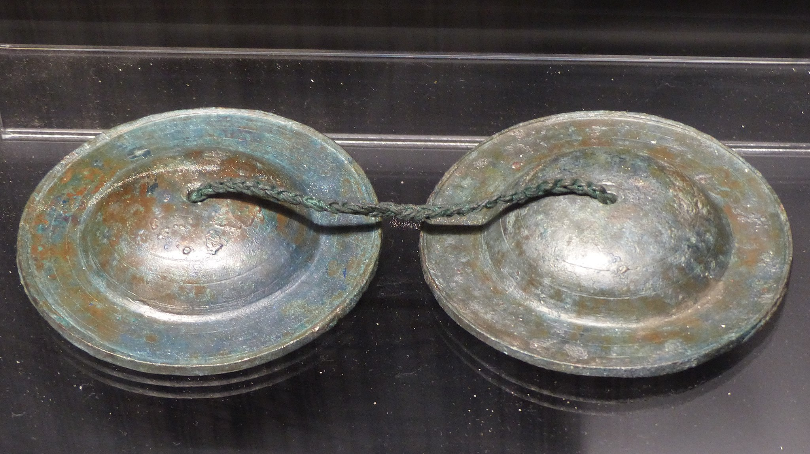

# Human-made Things in the Bible

## License Information

Human-made Things in the Bible © United Bible Societies, 2025. Adapted from: <cite>The Works of Their Hands: Man-made Things in the Bible</cite>, by Ray Pritz © 2009 United Bible Societies. This work is licensed under Creative Commons Attribution-ShareAlike 4.0 International (<a href="https://creativecommons.org/licenses/by-sa/4.0/">https://creativecommons.org/licenses/by-sa/4.0/</a>).

--------------------------------

## 标题：钹、铙钹（cymbals） (id: REALIA:7.4.2)

7\.4\.2 标题：钹、铙钹（cymbals）
========================

经文出处
----

Hebrew 来：מְצִלְתַּיִם (音译：mtsiltayim)

[1CH 13:8](https://ref.ly/1Chr13:8), [1CH 15:16](https://ref.ly/1Chr15:16), [1CH 15:19](https://ref.ly/1Chr15:19), [1CH 15:28](https://ref.ly/1Chr15:28), [1CH 16:5](https://ref.ly/1Chr16:5), [1CH 16:42](https://ref.ly/1Chr16:42), [1CH 25:1](https://ref.ly/1Chr25:1), [1CH 25:6](https://ref.ly/1Chr25:6), [2CH 5:12](https://ref.ly/2Chr5:12), [2CH 5:13](https://ref.ly/2Chr5:13), [2CH 29:25](https://ref.ly/2Chr29:25), [EZR 3:10](https://ref.ly/Ezra3:10), [NEH 12:27](https://ref.ly/Neh12:27)

Hebrew 来：צֶלְצְלִים (音译：tseltselim)

[2SA 6:5](https://ref.ly/2Sam6:5), [PSA 150:5](https://ref.ly/Ps150:5), [PSA 150:5](https://ref.ly/Ps150:5)

Greek 希：κύμβαλον (音译：kumbalon)

[1CO 13:1](https://ref.ly/1Cor13:1), [JDT 16:1](https://ref.ly/Jdt16:1), [1MA 4:54](https://ref.ly/1Macc4:54), [1MA 13:51](https://ref.ly/1Macc13:51), [1ES 5:57](https://ref.ly/1Esd5:57)

描述
--

*钹 (© Finoskov, CC BY\-SA 4\.0, via Wikimedia Commons)*

钹是一种打击乐器，由两块金属圆盘组成，圆盘互相撞击，发出尖锐、刺耳的声音。钹有两种类型：（1）两个扁平金属薄片互相撞击；（2）两个圆锥形金属片，将其中一片的敞开侧从上往下碰击另一片的敞开侧。

---

翻译
--

在许多语言中，“钹”的对等译法是“响亮的金属”之类短语。

[PSA 150:5](https://ref.ly/Ps150:5) 提到了两种钹，字面意思分别是“听钹”和“喊钹”。这可能是指“小钹……大钹”，也可能是比较诗意的表达方式，实际意思为“响钹……撞钹”。

在[1CO 13:1](https://ref.ly/1Cor13:1) 中，GNT (Good News Translation (1992)) 把希腊文*kumbalon* 译为“钟”（“bell”）而不是“钹”，因为钟更为人所熟知。

* **Associated Passages:** 历代志上 13:8; 历代志上 15:16; 历代志上 15:19; 历代志上 15:28; 历代志上 16:5; 历代志上 16:42; 历代志上 25:1; 历代志上 25:6; 历代志下 5:12; 历代志下 5:13; 历代志下 29:25; 以斯拉记 3:10; 尼希米记 12:27; 撒母耳记下 6:5; 诗篇 150:5; 哥林多前书 13:1; 友弟德传 16:1; 玛加伯上 4:54; 玛加伯上 13:51; 厄斯德拉上 5:57

* **Associated ACAI Concepts:** Cymbals (ID: `realia:Cymbals`)
