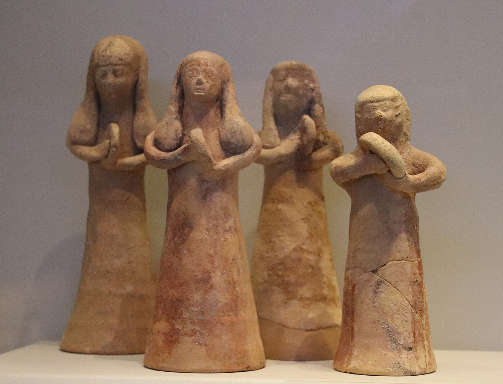

# Human-made Things in the Bible

## License Information

Human-made Things in the Bible © United Bible Societies, 2025. Adapted from: <cite>The Works of Their Hands: Man-made Things in the Bible</cite>, by Ray Pritz © 2009 United Bible Societies. This work is licensed under Creative Commons Attribution-ShareAlike 4.0 International (<a href="https://creativecommons.org/licenses/by-sa/4.0/">https://creativecommons.org/licenses/by-sa/4.0/</a>).

--------------------------------

## 标题：鼓、手鼓、框鼓（drum, hand drum, frame drum） (id: REALIA:7.4.6)

7\.4\.6 标题：鼓、手鼓、框鼓（drum, hand drum, frame drum）
===============================================

经文出处
----

Hebrew 来：תֹּף, תפף (音译：tof, tafaf（动词）)

[GEN 31:27](https://ref.ly/Gen31:27), [EXO 15:20](https://ref.ly/Exod15:20), [EXO 15:20](https://ref.ly/Exod15:20), [JDG 11:34](https://ref.ly/Judg11:34), [1SA 10:5](https://ref.ly/1Sam10:5), [1SA 18:6](https://ref.ly/1Sam18:6), [2SA 6:5](https://ref.ly/2Sam6:5), [1CH 13:8](https://ref.ly/1Chr13:8), [JOB 21:12](https://ref.ly/Job21:12), [PSA 68:26](https://ref.ly/Ps68:26), [PSA 81:3](https://ref.ly/Ps81:3), [PSA 149:3](https://ref.ly/Ps149:3), [PSA 150:4](https://ref.ly/Ps150:4), [ISA 5:12](https://ref.ly/Isa5:12), [ISA 24:8](https://ref.ly/Isa24:8), [ISA 30:32](https://ref.ly/Isa30:32), [JER 31:4](https://ref.ly/Jer31:4)

Greek 希：τύμπανον (音译：tumpanon)

[JDT 3:7](https://ref.ly/Jdt3:7), [JDT 16:1](https://ref.ly/Jdt16:1), [1MA 9:39](https://ref.ly/1Macc9:39), [1ES 5:2](https://ref.ly/1Esd5:2)

描述
--

*手鼓（乐器） (© Public Domain \- Wikimedia Commons)*

鼓由一块膜和一个扁圆形、三角形或方形的框架组成；膜通常由动物皮做成，在框架上张紧固定。

---

用途
--

根据放置鼓的位置，击鼓者可以用一只或两只手来击打。击鼓者可以左手持鼓，把鼓放在左臂下，或者靠在胸前，然后用右手击打；也可以把鼓放在膝盖上或地上，然后用一只或两只手击打。用右手手掌击鼓时，可以用左手手指来加紧或放松鼓面上的张力。

---

翻译
--

*敲打手鼓的妇女 (Gary Todd, Israel Museum, CC0, via Wikimedia Commons)*

希伯来文*tof* 的出现场合通常与歌唱、游行或节期有关。考古证据表明，框架上带金属圆箍的鼓（“铃鼓”或“小手鼓”）在圣经时期并不为人所知。一般来说，这个词最好译成“手鼓”或“鼓”。

* **Associated Passages:** 创世记 31:27; 出埃及记 15:20; 士师记 11:34; 撒母耳记上 10:5; 撒母耳记上 18:6; 撒母耳记下 6:5; 历代志上 13:8; 约伯记 21:12; 诗篇 68:26; 诗篇 81:3; 诗篇 149:3; 诗篇 150:4; 以赛亚书 5:12; 以赛亚书 24:8; 以赛亚书 30:32; 耶利米书 31:4; 友弟德传 3:7; 友弟德传 16:1; 玛加伯上 9:39; 厄斯德拉上 5:2

* **Associated ACAI Concepts:** Drum (ID: `realia:Drum`)
